# 了解 Burp Suite 工具

在本章中，我们将介绍以下内容：

+   设置目标站点地图

+   了解消息编辑器

+   使用重复器进行重复

+   使用解码器进行解码

+   使用入侵者进行入侵

# 介绍

本章概述了 Burp Suite 中最常用的工具。该章节首先在目标站点地图中建立目标范围。然后，介绍消息编辑器。接下来，将使用**OWASP Mutillidae II**进行一些实际操作，以熟悉代理、重复器、解码器和入侵者。

# 软件工具要求

要完成本章的实际操作，您需要以下内容：

+   Burp 代理社区或专业版（[`portswigger.net/burp/`](https://portswigger.net/burp/)）

+   配置为允许 Burp 代理流量的 Firefox 浏览器（[`www.mozilla.org/en-US/firefox/new/`](https://www.mozilla.org/en-US/firefox/new/)）

# 设置目标站点地图

现在我们的浏览器、Burp 和 OWASP BWA 虚拟机之间有流量流动，我们可以开始设置我们测试的范围。对于本教程，我们将使用 OWASP BWA VM 中提供的 OWASP Mutillidae II 链接（`http://<Your_VM_Assigned_IP_Address>/mutillidae/`）作为我们的目标应用程序。

更仔细地查看目标选项卡，您会注意到有两个可用的子选项卡：站点地图和范围。从浏览器、Burp 和 Web 服务器之间的初始代理设置开始，您现在应该在目标|站点地图选项卡中看到一些 URL、文件夹和文件。您可能会发现信息量很大，但为我们的项目设置范围将有助于更好地集中我们的注意力。

# 准备工作

使用目标|站点地图和目标|范围选项卡，我们将为 mutillidae（`http://<Your_VM_Assigned_IP_Address>/mutillidae/`）分配 URL 作为**范围。**

# 如何做...

执行以下步骤设置目标站点地图：

1.  搜索文件夹`mutillidae`，右键单击“添加到范围”。注意目标|范围子选项卡的简要高亮显示，如下所示：

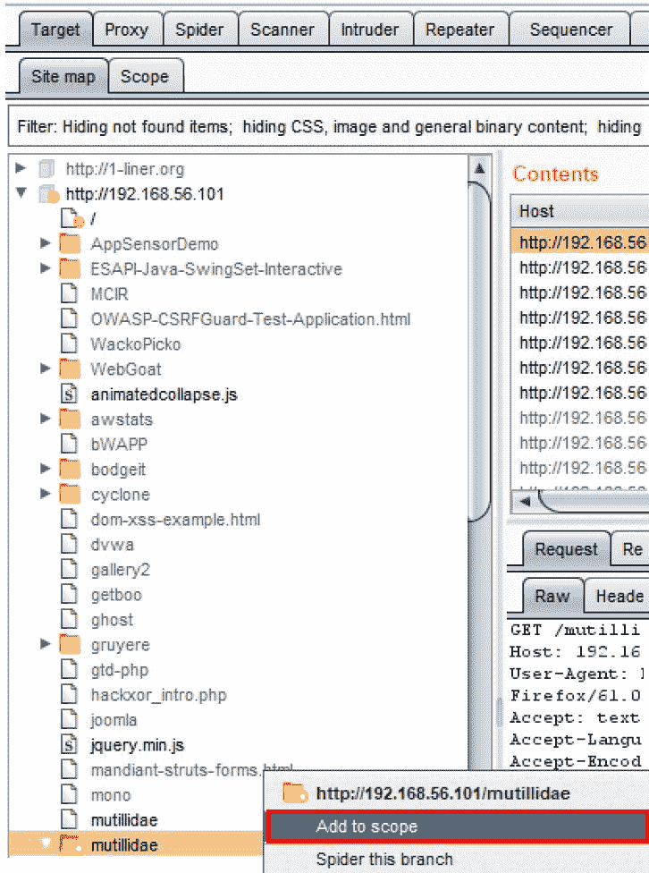

1.  将文件夹`mutillidae`添加到您的范围后，您可能会看到一个代理历史记录对话框，如下所示。您可以通过单击“是”来避免收集超出范围的消息。或者，您可以选择继续使**代理 HTTP 历史**表收集通过 Burp 传递的任何消息，即使这些消息超出了您已识别的范围。对于我们的目的，我们将选择**是**：

1.  切换到目标|范围选项卡，您现在应该在包含范围表中看到 OWASP Mutillidae II 的完整 URL，如下所示：

# 它是如何工作的...

消息编辑器显示通过代理侦听器流经的任何 HTTP 消息的详细信息。设置代理以捕获 HTTP 流量后，如在目标|站点地图和 Burp 代理|HTTP 历史选项卡中所见，您可以选择任何单个消息以显示消息编辑器。每个编辑器都包含消息的请求和响应方面，只要消息通过 Burp 正确代理。

# 了解消息编辑器

在 Burp Suite 中几乎每个显示 HTTP 消息的工具和选项卡中，您都会看到一个标识请求和响应的编辑器。这通常被称为消息编辑器。消息编辑器允许查看和编辑具有特殊功能的 HTTP 请求和响应。

消息编辑器中有多个子选项卡。请求消息的子选项卡至少包括以下内容：

+   **原始**

+   **标头**

+   **十六进制**

响应消息的子选项卡包括以下内容：

+   **原始**

+   **标头**

+   **十六进制**

+   **HTML**（有时）

+   **渲染**（有时）

原始选项卡以原始 HTTP 形式显示消息。标头选项卡以表格格式显示 HTTP 标头参数。这些参数是可编辑的，并且可以在工具（如代理和重复器）的表格中添加、删除或修改列。

对于包含参数或 cookie 的请求，参数选项卡是存在的。参数是可编辑的，并且可以在工具（如代理和 Repeater）中的表格中添加、删除或修改列。

最后，还有十六进制选项卡，以十六进制格式呈现消息；实质上是一个十六进制编辑器。您可以在工具（如代理和 Repeater）中编辑单个字节，但这些值必须以两位十六进制形式给出，从 00 到 FF。

# 准备工作

让我们探索 Burp 中捕获的每个请求和响应的消息编辑器中可用的多个选项卡。

# 操作步骤...

确保您的浏览器、Burp 和 OWASP BWA 虚拟机之间有流量流动。

1.  查看目标 | 站点地图选项卡，注意消息编辑器部分：

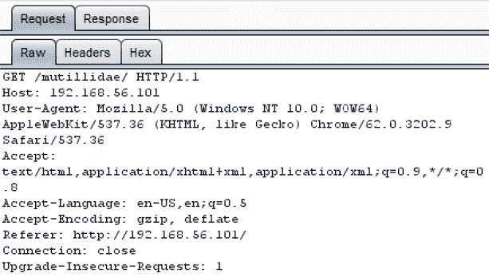

1.  查看请求时，请注意可用的子选项卡至少包括原始、标头和十六进制。然而，在包含参数或 cookie 的请求的情况下，参数子选项卡也是可用的：

1.  消息的另一侧是**响应**选项卡，包括**原始**，**标头**，**十六进制**子选项卡，有时还包括**HTML**和**渲染**。这些是提供给 HTTP 响应的各种格式。如果内容是 HTML，那么选项卡将出现。同样，**渲染**选项卡使 HTML 显示为在浏览器中呈现的样子，但不执行任何 JavaScript：

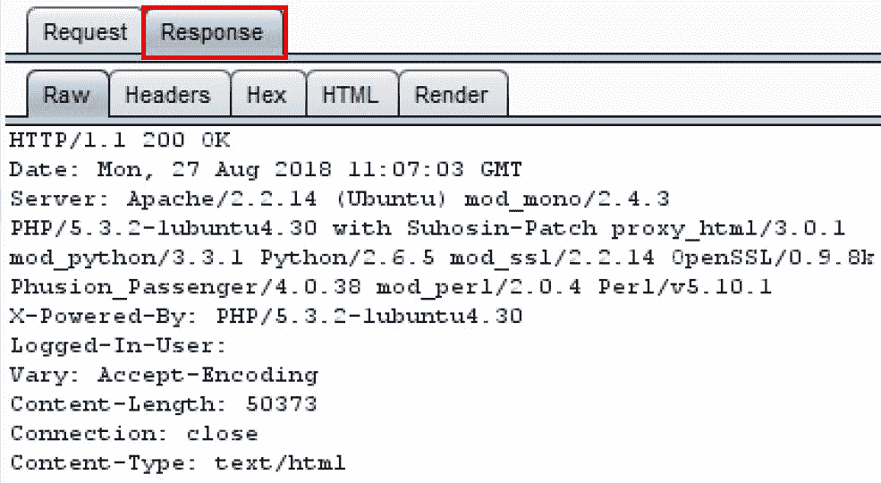

# 使用 Repeater 重复

Repeater 允许对请求进行轻微更改或调整，并显示在左侧窗口中。**Go**按钮允许重新发出请求，并在右侧窗口中显示响应。

与您的 HTTP 请求相关的详细信息包括标准的消息编辑器详细信息，如**原始**，**参数**（对于带有参数或 cookie 的请求），**标头**和**十六进制**。

与 HTTP 响应相关的详细信息包括标准的消息编辑器详细信息，包括**原始**，**标头**，**十六进制**，有时还包括**HTML**和**渲染**。

在每个面板的底部都有一个搜索文本框，允许测试人员快速找到消息中存在的值。

# 准备工作

Repeater 允许您手动修改并重新发出单个 HTTP 请求，分析您收到的响应。

# 操作步骤...

1.  从**目标** | **站点地图**或从**代理** | **HTTP 历史**选项卡（如下截图所示）中，右键单击消息，然后选择**发送到 Repeater**：

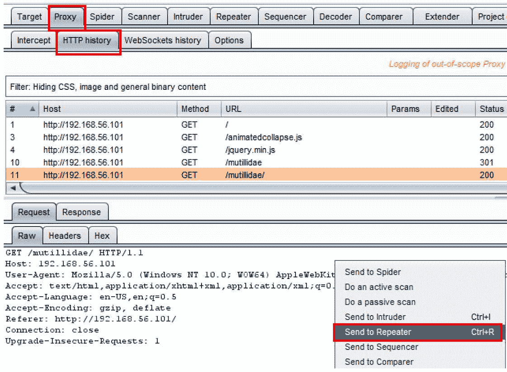

1.  切换到**Repeater**选项卡。注意**HTTP 请求**已准备好供测试人员调整参数，然后通过**Go**按钮将请求发送到应用程序。

注意每个面板底部的搜索框：

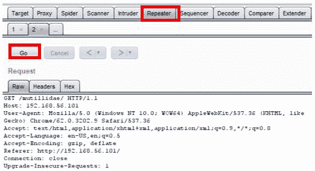

我们将在本书中经常使用 Repeater。本章只是对 Repeater 的介绍，以及了解其目的。

# 使用解码器进行解码

**Burp 解码器**是一个工具，允许测试人员将原始数据转换为编码数据，或者将编码数据转换回纯文本。解码器支持包括 URL 编码、HTML 编码、Base64 编码、二进制代码、哈希数据等在内的多种格式。解码器还包括内置的十六进制编辑器。

# 准备工作

随着网络渗透测试的进行，测试人员可能会遇到编码值。Burp 通过允许测试人员将编码值发送到解码器并尝试各种可用的解码功能来简化解码过程。

# 操作步骤...

让我们尝试解码在 OWASP Mutillidae II 应用程序中找到的会话令牌 PHPSESSID 的值。当用户最初浏览到 URL（`http://<Your_VM_Assigned_IP_Address>/mutillidae/`）时，该用户将被分配一个 PHPSESSID cookie。PHPSESSID 值似乎被加密，然后包裹在 base 64 编码中。使用解码器，我们可以解开该值。

1.  浏览到`http://<Your_VM_Assigned_IP_Address>/mutillidae/`应用程序。

1.  在**代理** | **HTTP 历史**选项卡中找到您刚刚从浏览器生成的 HTTP 请求（如下一张截图所示）。突出显示 PHPSESSID 值，而不是参数名称，右键单击，并选择**发送到解码器**：

1.  在**解码器**选项卡中，在**解码为...**下拉菜单中，选择**Base 64**。注意结果在**Hex**编辑器中查看并且已加密：

在这个示例中，我们无法进一步进行。我们可以确认值确实被包裹在 Base 64 中。然而，解包的值是加密的。本示例的目的是向您展示如何使用解码器来操作编码的值。

# 使用 Burp Intruder 进行攻击

Burp Intruder 允许测试人员对 HTTP 消息的特定部分进行暴力破解或模糊测试，使用定制的负载。

为了正确设置 Intruder 中的定制攻击，测试人员需要使用**Intruder**的四个子选项卡中提供的设置：

# 准备工作

测试人员可能希望在消息中模糊测试或暴力破解参数值。Burp Intruder 通过提供各种入侵者攻击样式、负载和选项来简化这个过程。

# 操作步骤...

1.  浏览到 Mutillidae 的登录界面，并尝试登录应用程序。例如，输入用户名`admin`和密码`adminpass`。

1.  在**代理** | **HTTP 历史**选项卡中找到登录尝试。您的请求编号（即左侧的**#**标志）将与下面显示的不同。选择捕获您尝试登录的消息。

1.  当登录尝试消息在**HTTP 历史**表中被突出显示时，右键单击**请求**选项卡，并选择**发送到 Intruder**：

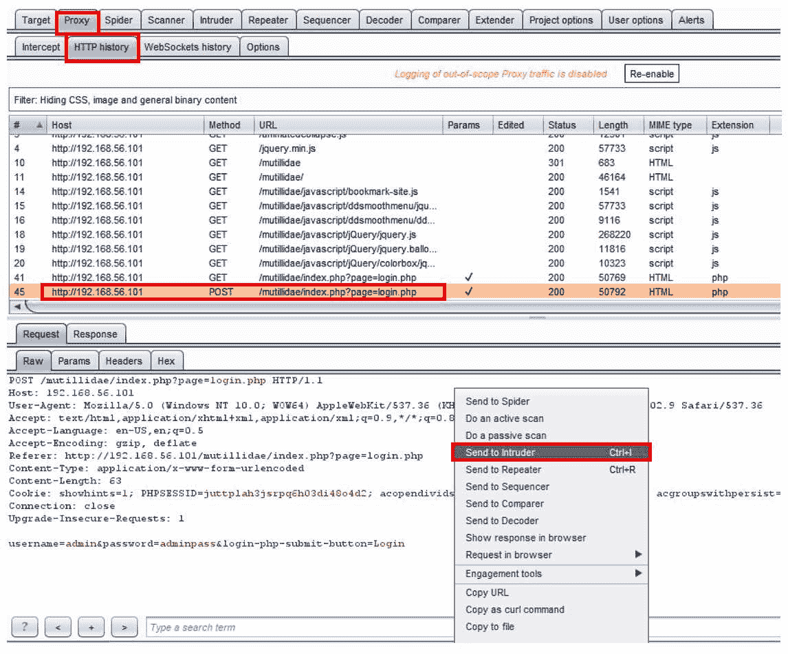

# 目标

Intruder 的**目标**选项卡定义了您的目标 Web 应用程序。这些设置由 Burp 预先为您填充：

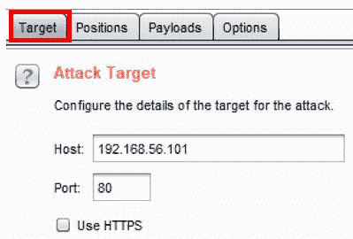

# 位置

**位置**选项卡标识出**负载** | **位置**部分中的负载标记的位置。对于我们的目的，从右侧菜单中点击**清除§**（即负载标记）。使用鼠标手动选择密码字段。现在点击右侧菜单中的**添加§**按钮。您应该看到负载标记包裹在密码字段周围，如下所示：

# 负载

**位置**选项卡之后是**负载**选项卡。**负载**选项卡标识出您希望插入到上一个选项卡中标识的位置的单词列表值或数字。**负载**选项卡中有几个部分，包括**负载集**、**负载选项**、**负载处理**和**负载编码**。

# 负载集

**负载集**允许设置负载的数量和类型。对于我们的目的，我们将使用 Sniper 的默认设置，允许我们使用一个**负载类型**为**简单列表**的负载：

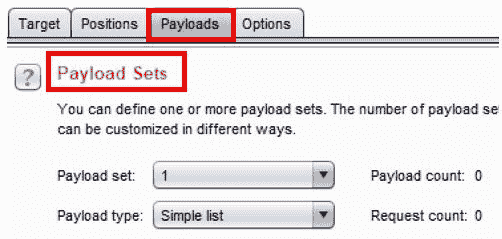

# 负载选项

在**负载选项**部分，测试人员可以配置自定义负载或从文件中加载预配置的负载。

为了我们的目的，我们将向我们的负载添加一个值。在文本框中输入`admin`，然后单击**添加**按钮来创建我们的自定义负载：

# 负载处理

负载处理在配置特殊规则用于替换负载标记位置时非常有用。对于这个示例，我们不需要任何特殊的负载处理规则：

# 负载编码

负载编码是在将请求发送到 Web 服务器之前应用于负载值的。许多 Web 服务器可能会阻止攻击性的负载（例如`<script>`标签），因此编码功能是绕过任何黑名单阻止的手段。

出于本示例的目的，保持默认框被选中：

# 选项

最后，**Intruder** | **选项**选项卡提供了攻击表的自定义设置，特别是与捕获的响应相关的特定错误消息。**Intruder** | **选项**选项卡中有几个部分，包括**请求头**、**请求引擎**、**攻击结果**、**Grep-Match**、**Grep-Extract**、**Grep - Payloads**和**重定向**：

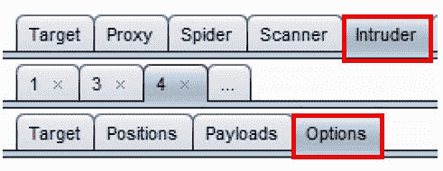

# 请求头

**请求头**提供了在 Intruder 运行攻击时特定于头部参数的配置。为了这个食谱的目的，保持默认复选框选中：

# 请求引擎

**请求引擎**应该被修改，如果测试人员希望在运行 Intruder 时在网络上减少噪音。例如，测试人员可以使用可变的时间间隔来限制攻击请求，使它们对网络设备看起来更随机。这也是降低 Intruder 对目标应用程序运行的线程数的位置。

为了这个食谱的目的，保持默认设置不变：

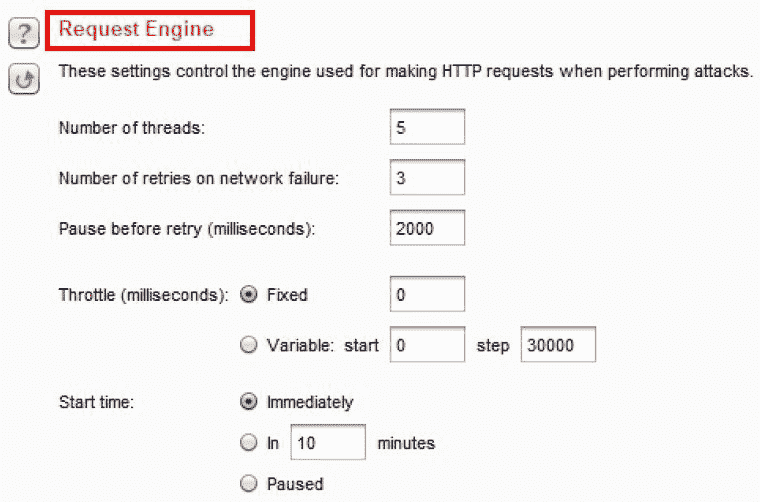

# 攻击结果

开始攻击后，Intruder 创建了一个攻击表。**攻击结果**部分提供了一些关于在表中捕获的内容的设置。

为了这个食谱的目的，保持默认设置不变：

# Grep - Match

**Grep - Match**是一个非常有用的功能，当启用时，会在攻击表结果中创建额外的列，以快速识别错误、异常，甚至是响应中的自定义字符串。

为了这个食谱的目的，保持默认设置不变：

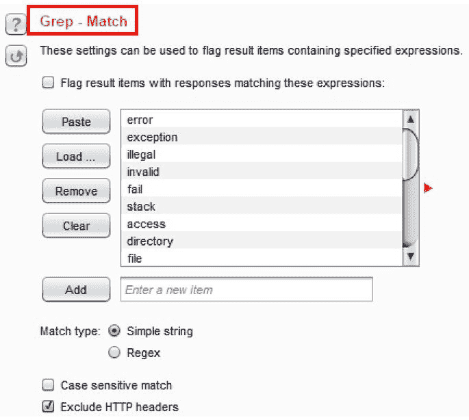

# Grep - Extract

**Grep - Extract**，当启用时，是在攻击表中添加一个列的另一个选项，其标签是在响应中找到的特定字符串。这个选项不同于**Grep - Match**，因为 Grep - Extract 的值是从实际的 HTTP 响应中取得的，而不是任意字符串。

为了这个食谱的目的，保持默认设置不变：

# Grep - Payloads

**Grep - Payloads**提供了测试人员在攻击表中添加列的能力，其中响应包含负载的反射。

为了这个食谱的目的，保持默认设置不变：

# 重定向

**重定向**指示 Intruder 永远不要、有条件地或总是跟随重定向。这个功能非常有用，特别是在暴力破解登录时，因为 302 重定向通常表示进入的迹象。

为了这个食谱的目的，保持默认设置不变：

# 开始攻击按钮

最后，我们准备开始 Intruder。在**负载**或**选项**选项卡上，单击**开始攻击**按钮开始：

攻击开始后，将出现一个攻击结果表。这允许测试人员使用负载标记位置内的负载来审查所有请求。它还允许我们审查所有响应和显示**状态**、**错误**、**超时**、**长度**和**注释**的列。

为了这个食谱的目的，我们注意到在`password`参数的 admin 负载产生了状态码`302`，这是一个重定向。这意味着我们成功登录了 Mutillidae 应用程序：

在攻击表中查看**响应** | **渲染**，可以让我们看到 Web 应用程序如何响应我们的负载。正如你所看到的，我们成功地以管理员身份登录了：

