# 第七章：评估业务逻辑

在本章中，我们将涵盖以下内容：

+   测试业务逻辑数据验证

+   无限制的文件上传 - 绕过弱验证

+   执行进程时间攻击

+   测试工作流的规避

+   上传恶意文件 - 多语言

# 介绍

本章介绍了**业务逻辑测试**的基础知识，包括对该领域中一些常见测试的解释。Web 渗透测试涉及对业务逻辑的关键评估，以确定应用程序设计在执行完整性检查方面的表现如何，特别是在连续的应用程序功能步骤中，我们将学习如何使用 Burp 执行此类测试。

# 软件工具要求

要完成本章的练习，您将需要以下内容：

+   OWASP Broken Web Applications (VM)

+   OWASP Mutillidae 链接

+   Burp Proxy Community 或 Professional ([`portswigger.net/burp/`](https://portswigger.net/burp/))

# 测试业务逻辑数据验证

业务逻辑数据验证错误是由于缺乏服务器端检查，特别是在一系列事件中，如购物车结账。如果存在设计缺陷，如线程问题，这些缺陷可能允许攻击者在购买之前修改或更改其购物车内容或价格，以降低支付的价格。

# 准备工作

使用**OWASP WebGoat**应用程序和 Burp，我们将利用业务逻辑设计缺陷，以非常便宜的价格购买许多大额商品。

# 如何操作...

1.  确保**owaspbwa**虚拟机正在运行。从虚拟机的初始登陆页面选择 OWASP WebGoat 应用程序。登陆页面将配置为与您的机器特定的 IP 地址：

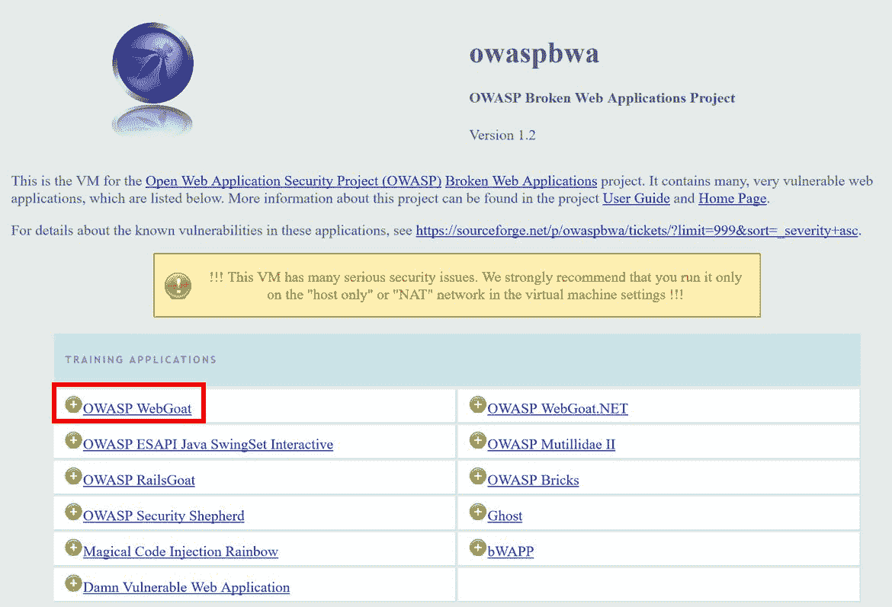

1.  点击 OWASP WebGoat 链接后，将提示您输入一些登录凭据。使用以下凭据：用户名：`guest`密码：`guest`。

1.  认证后，点击**开始 WebGoat**按钮以访问应用程序练习：

1.  从左侧菜单中点击**并发性** | **购物车并发性缺陷**：

练习解释了购物车设计中存在线程问题，将允许我们以较低的价格购买商品。让我们利用这个设计缺陷！

1.  将`1`添加到`数量`框中的`Sony - Vaio with Intel Centrino`项目。点击更新购物车按钮：

1.  切换到 Burp Proxy | HTTP 历史选项卡。找到购物车请求，右键单击，点击发送到 Repeater：

1.  在 Burp 的 Repeater 选项卡中，将`QTY3`参数从`1`更改为`10`：

1.  留在 Burp Repeater 中，在请求窗格中，右键单击并选择**在浏览器中请求** | **在当前浏览器会话中**：

1.  弹出窗口显示修改后的请求。点击**复制**按钮：

1.  在包含购物车的同一 Firefox 浏览器中，打开一个新标签，并粘贴上一步中复制到剪贴板中的 URL：

1.  按下*Enter*键，查看修改后的数量为`10`的请求重新提交：

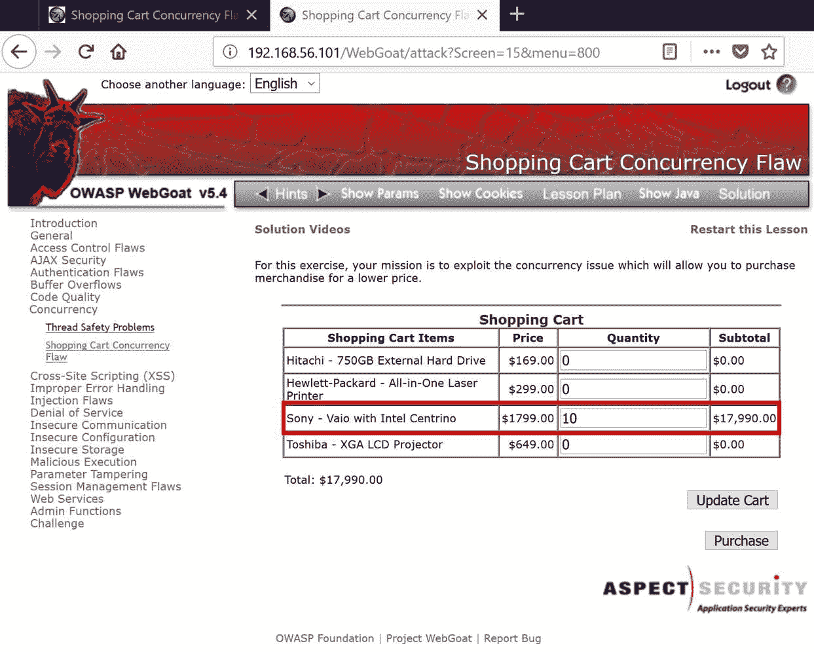

1.  切换到包含您购物车的原始标签（原始数量为`1`的购物车）。点击购买按钮：

1.  在下一个屏幕上，在点击确认按钮之前，切换到第二个标签，并再次更新购物车，但这次使用我们的新数量`10`，然后点击更新购物车：

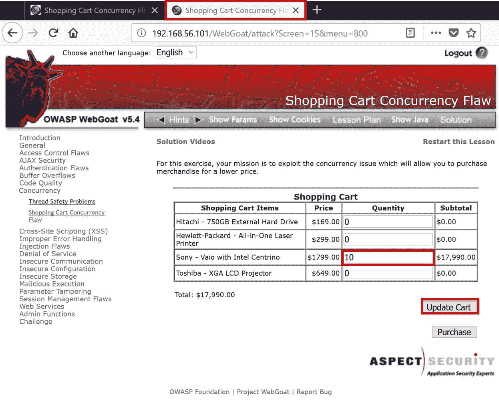

1.  返回第一个标签，并点击确认按钮：

注意我们能够以一个商品的价格购买 10 台 Sony Vaio 笔记本电脑！

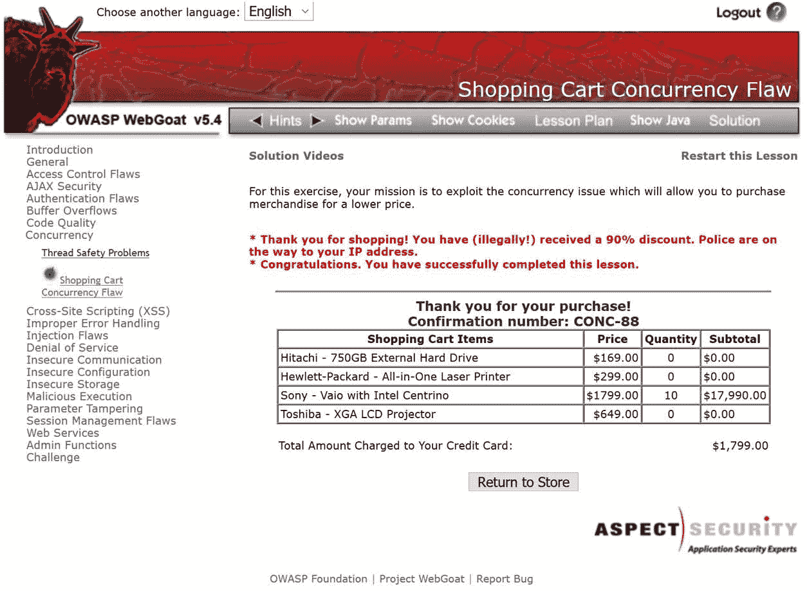

# 工作原理...

线程安全问题可能会产生意外结果。对于许多语言，开发人员对如何将变量和方法声明为线程安全的了解至关重要。未被隔离的线程，例如本教程中显示的购物车内容，可能导致用户获得意外的产品折扣。

# 无限制文件上传-绕过弱验证

许多应用程序允许上传文件以各种原因。服务器端的业务逻辑必须包括检查可接受的文件；这被称为**白名单**。如果此类检查薄弱或仅涉及文件属性的一个方面（例如，仅限于文件扩展名），攻击者可以利用这些弱点并上传可能在服务器上可执行的意外文件类型。

# 做好准备

使用**Damn Vulnerable Web Application**（**DVWA**）应用程序和 Burp，我们将利用文件上传页面中的业务逻辑设计缺陷。

# 如何做...

1.  确保 owaspbwa VM 正在运行。从 VM 的初始登陆页面选择 DVWA。登陆页面将配置为与您的计算机特定的 IP 地址。

1.  在登录页面，使用以下凭据：用户名：`user`；密码：`user`。

1.  从左侧菜单中选择 DVWA 安全选项。将默认设置从低更改为中，然后单击提交：

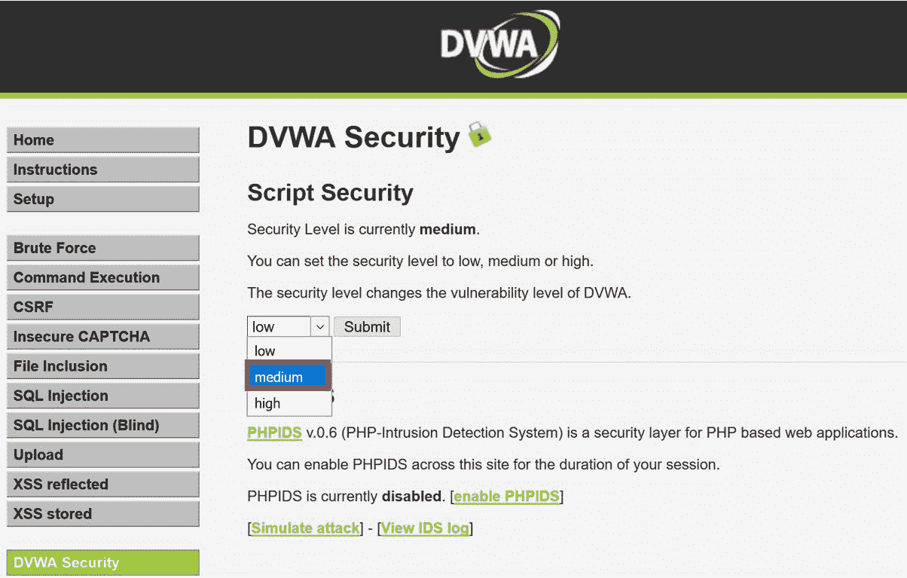

1.  从左侧菜单中选择“上传”页面：

1.  注意页面指示用户只能上传图像。如果我们尝试上传除 JPG 图像以外的其他类型的文件，我们将在左上角收到错误消息：

1.  在本地计算机上创建任何类型的文件，除了 JPG。例如，创建一个名为`malicious_spreadsheet.xlsx`的 Microsoft Excel 文件。出于本教程的目的，它不需要任何内容。

1.  切换到 Burp 的代理|拦截选项卡。使用“拦截器”按钮打开拦截器。

1.  返回到 Firefox，并使用浏览按钮在系统上找到`malicious_spreadsheet.xlsx`文件，然后单击上传按钮：

1.  在 Burp 的代理|拦截器中暂停请求，将**Content-type**从`application/vnd.openxmlformats-officedocument.spreadsheet.sheet`更改为`image/jpeg`。

+   这是原始版本：

+   +   这是修改后的版本：

1.  单击前进按钮。现在通过单击拦截器上的切换按钮将拦截器关闭。

1.  注意文件上传成功！我们能够绕过弱数据验证检查并上传除图像以外的文件：

# 它是如何工作的...

由于服务器端检查薄弱，我们能够轻松规避仅限于图像的限制并上传我们选择的文件类型。应用程序代码仅检查与`image/jpeg`匹配的内容类型，这很容易通过 Burp 等拦截代理进行修改。开发人员需要同时在应用程序代码中将内容类型和文件扩展名列入白名单，以防止此类利用发生。

# 执行过程时间攻击

通过监视应用程序完成任务所需的时间，攻击者可以收集或推断有关应用程序编码的信息。例如，使用有效凭据的登录过程比使用无效凭据的登录过程更快地收到响应。响应时间的延迟泄漏了与系统进程相关的信息。攻击者可以使用响应时间执行帐户枚举，并根据响应时间确定有效用户名。

# 做好准备

对于此教程，您将需要来自`wfuzz`的`common_pass.txt`单词列表：

+   [`github.com/xmendez/wfuzz`](https://github.com/xmendez/wfuzz)

+   路径：`wordlists` | `other` | `common_pass.txt`

使用 OWASP Mutillidae II，我们将确定应用程序是否基于强制登录的响应时间提供信息泄漏。

# 如何做...

确保 Burp 正在运行，并确保 owaspbwa VM 正在运行，并且已经在用于查看 owaspbwa 应用程序的 Firefox 浏览器中配置了 Burp。

1.  从 owaspbwa 登陆页面，单击链接到 OWASP Mutillidae II 应用程序。

1.  打开 Firefox 浏览器，转到 OWASP Mutillidae II 的主页（URL：`http://<your_VM_assigned_IP_address>/mutillidae/`）。

1.  转到登录页面，使用用户名`ed`和密码`pentest`登录。

1.  切换到 Burp 的代理|HTTP 历史选项卡，找到刚刚执行的登录，右键单击，并选择发送到入侵者：

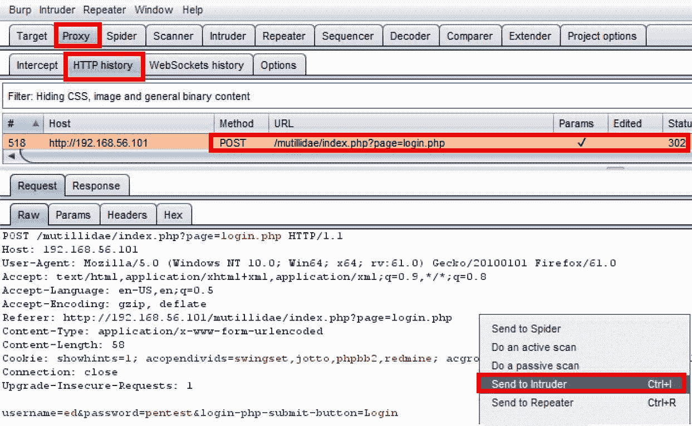

1.  转到入侵者|位置选项卡，并清除所有有效负载标记，使用右侧的清除§按钮：

1.  选择密码字段，并单击“添加§”按钮以在该字段周围添加有效负载标记：

1.  还要删除`PHPSESSID`令牌。删除此令牌中的值（等号后面的内容），并将其留空。这一步非常重要，因为如果您不小心在请求中留下此令牌，您将无法看到时间差异，因为应用程序会认为您已经登录：

1.  转到入侵者|有效负载选项卡。在有效负载选项[简单列表]中，我们将使用来自`wfuzz`的`wordlist`添加一些无效值，其中包含常见密码：`wfuzz` | `wordlists` | `other` | `common_pass.txt`：

1.  滚动到底部，取消“有效负载编码”的复选框：

1.  单击“开始攻击”按钮。将显示一个攻击结果表。让攻击完成。从攻击结果表中，选择列并选中“接收响应”。选中“完成响应”以将这些列添加到攻击结果表中：

1.  分析提供的结果。虽然并非在每个响应中都明显，但请注意当使用无效密码（如`administrator`）时的延迟。`接收响应`时间为`156`，但`完成响应`时间为`166`。然而，有效密码`pentest`（仅`302`）会立即收到响应：`50`（接收），和`50`（完成）：

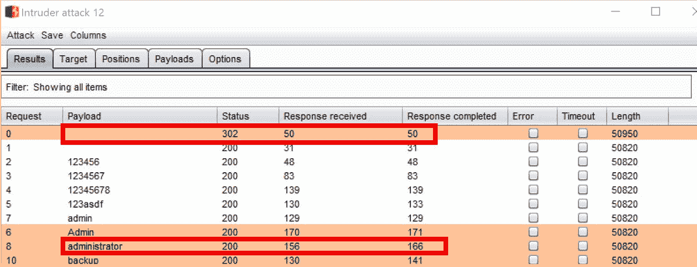

# 工作原理...

在处理错误消息或无效编码路径时，可能会发生信息泄露，这比有效的编码路径花费更长的时间。开发人员必须确保业务逻辑不会向攻击者透露这些线索。

# 测试工作流的规避

必须由 Web 应用程序渗透测试人员测试购物车到支付网关的交互，以确保工作流程不能按顺序执行。除非在服务器端首先验证了购物车内容，否则不应进行付款。如果缺少此检查，攻击者可以在实际购买之前更改价格、数量或两者。

# 准备就绪

使用 OWASP WebGoat 应用程序和 Burp，我们将利用业务逻辑设计缺陷，在购买之前没有服务器端验证。

# 如何做...

1.  确保 owaspbwa VM 正在运行。从 VM 的初始登陆页面选择 OWASP WebGoat 应用程序。登陆页面将配置为特定于您的计算机的 IP 地址。

1.  单击 OWASP WebGoat 链接后，将提示您输入登录凭据。使用以下凭据：用户名：`guest`；密码：`guest`。

1.  认证后，单击“开始 WebGoat”按钮以访问应用程序练习。

1.  单击左侧菜单中的 AJAX 安全性|不安全的客户端存储。您将看到一个购物车：

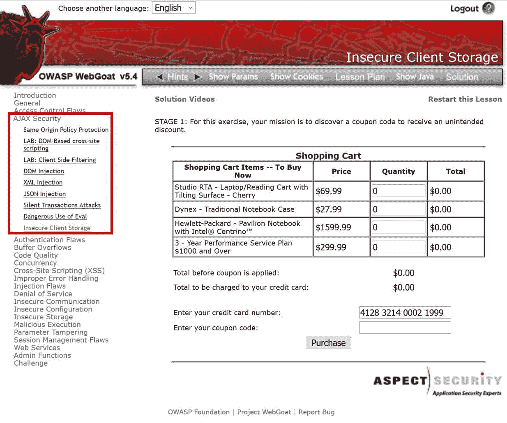

1.  切换到 Burp 的**代理**|**HTTP 历史**选项卡，单击“过滤”按钮，并确保您的“按 MIME 类型过滤”部分包括“脚本”。如果未选中“脚本”，请务必现在选中它：

1.  返回到 Firefox 浏览器，使用 WebGoat 并为“惠普 - 带英特尔 Centrino 的 Pavilion 笔记本”项目指定数量为`2`：

1.  切换回 Burp 的**代理**|**HTTP 历史**选项卡，并注意与您对数量所做的更改相关的 JavaScript（`*.js`）文件。注意一个名为`clientSideValiation.js`的脚本。确保状态码为`200`而不是`304`（未修改）。只有*200*状态码才会显示脚本的源代码：

1.  选择`clientSideValidation.js`文件，并在响应选项卡中查看其源代码。

1.  请注意，优惠码在 JavaScript 文件中是硬编码的。但是，如果按照它们的字面意思使用，它们将不起作用：

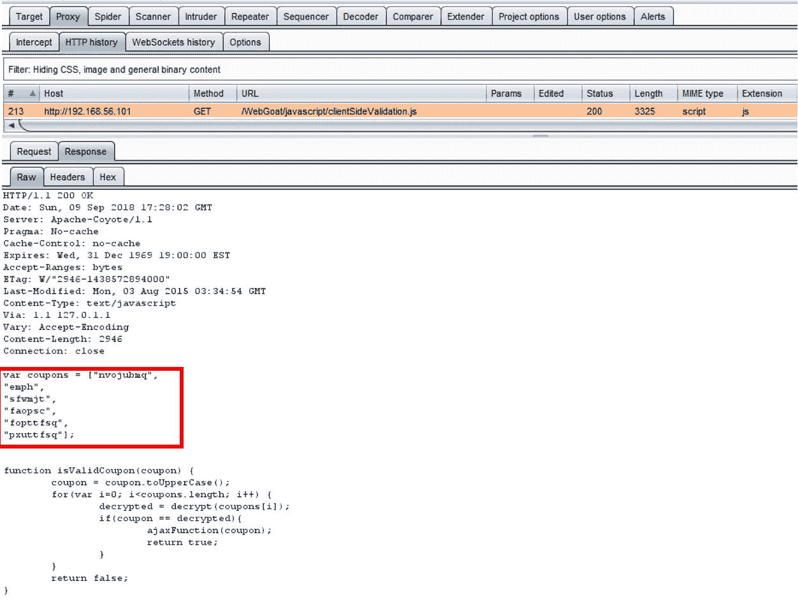

1.  继续查看源代码，并注意在 JavaScript 文件中找到了一个`decrypt`函数。我们可以通过这个函数测试其中一个优惠码。让我们在 Firefox 浏览器中尝试这个测试：

1.  在浏览器中打开开发者工具（*F12*），转到控制台选项卡。在控制台中粘贴（查找`>>`提示）以下命令：

[PRE0]

1.  您可以使用此命令对数组中声明的任何优惠码调用`decrypt`函数：

1.  按下*Enter*键后，您将看到优惠码被解密为单词`GOLD`：

1.  在“输入您的优惠码”框中输入单词`GOLD`。注意金额现在要少得多。接下来，点击“购买”按钮：

1.  我们收到有关第 1 阶段完成的确认。现在让我们试着免费购买：

1.  切换到 Burp 的**代理** | **拦截**选项卡，并使用**拦截器打开**按钮打开拦截器。

1.  返回到 Firefox 并按下**购买**按钮。在请求暂停时，将$1,599.99 的金额修改为$0.00。查找`GRANDTOT`参数以帮助您找到要更改的总金额：

1.  点击**转发**按钮。现在通过单击拦截器关闭切换按钮来关闭拦截器。

1.  您应该收到一个成功的消息。请注意，现在收取的总费用为$0.00：

# 工作原理...

由于在收取信用卡之前，未对优惠码和总金额进行服务器端检查，因此我们能够规避分配的价格并自行设置价格。

# 上传恶意文件 - 多语言

**多语言**是一个使用多种语言的术语。如果我们将这个概念引入黑客行为，它意味着通过使用不同的语言作为执行点来创建**跨站脚本**（**XSS**）攻击向量。例如，攻击者可以构造有效的图像并嵌入 JavaScript。 JavaScript 有效负载的放置通常在图像的注释部分。一旦图像在浏览器中加载，取决于 Web 服务器声明的内容类型的严格性以及浏览器对内容类型的解释，XSS 内容可能会执行。

# 准备工作

+   从 PortSwigger 博客页面下载一个包含跨站脚本漏洞的 JPG 文件：[`portswigger.net/blog/bypassing-csp-using-polyglot-jpegs`](https://portswigger.net/blog/bypassing-csp-using-polyglot-jpegs)

+   这是一个多语言图像的直接链接：[`portswigger-labs.net/polyglot/jpeg/xss.jpg`](http://portswigger-labs.net/polyglot/jpeg/xss.jpg)

+   使用 OWASP WebGoat 文件上传功能，我们将在应用程序中植入一个包含 XSS 有效负载的图像。

# 如何做...

1.  确保 owaspbwa 虚拟机正在运行。从虚拟机的初始登陆页面选择 OWASP WebGoat 应用程序。登陆页面将配置为与您的机器特定的 IP 地址。

1.  点击 OWASP WebGoat 链接后，将提示您输入登录凭据。使用以下凭据：用户名：`guest`*；*密码：`guest`*。*

1.  经过身份验证后，单击“启动 WebGoat”按钮以访问应用程序练习。

1.  从左侧菜单中点击**恶意执行** | **恶意文件执行**。您将看到一个文件上传功能页面。说明中指出，只允许上传图像：

1.  浏览到您从本食谱开头提到的 PortSwigger 博客页面下载的`xss.jpg`图像所保存的位置。

1.  以下是图像的屏幕截图。正如你所看到的，很难检测到图像中包含的任何 XSS 漏洞。它被隐藏得很隐蔽。

1.  点击**浏览**按钮选择`xss.jpg`文件：

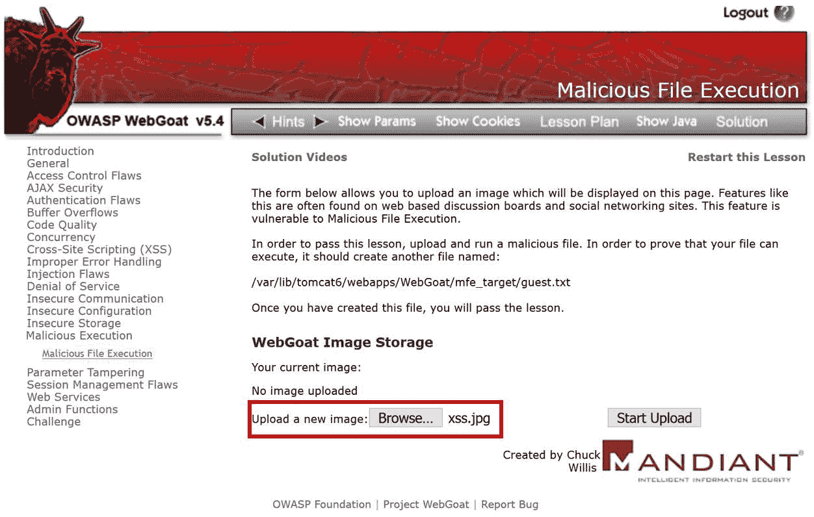

1.  切换到 Burp 的**代理** | **选项**。确保你正在捕获**客户端响应**并且已启用以下设置。这将允许我们捕获修改或拦截的 HTTP 响应：

1.  切换到 Burp 的**代理** | **拦截**选项卡。通过单击拦截器打开按钮打开拦截器。

1.  返回到 Firefox 浏览器，然后点击**开始上传**按钮。消息应该在 Burp 的拦截器中暂停。

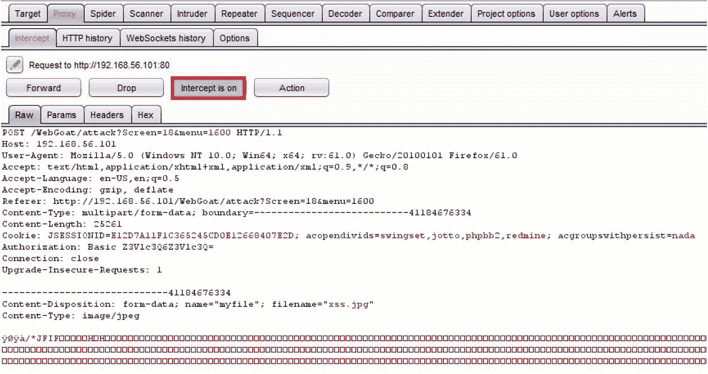

1.  在请求暂停时的拦截窗口中，在底部的搜索框中键入`Burp rocks`。你应该在图像中间看到一个匹配项。这是我们的多语言有效负载。它是一张图片，但它包含了图像注释中的隐藏 XSS 脚本：

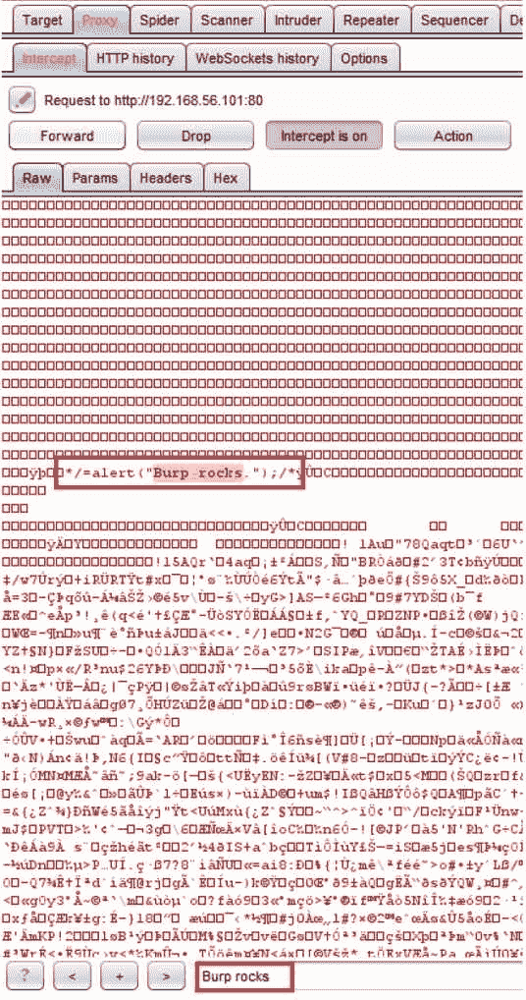

1.  点击**转发**按钮。现在通过单击拦截器关闭按钮关闭拦截器。

1.  使用记事本或你喜欢的文本编辑器，创建一个名为`poly.jsp`的新文件，并在文件中写入以下代码：

1.  返回到**恶意文件执行**页面，并浏览到你创建的`poly.jsp`文件，然后点击**开始上传**按钮。`poly.jsp`是一个可以在这个 Web 服务器上执行的 Java 服务器页面文件。根据说明，我们必须在提供的路径中创建一个`guest.txt`文件。此代码在 JSP 脚本标记代码中创建该文件：

1.  右键单击未识别的图像，然后选择**复制图像位置**。

1.  在与 WebGoat 相同的 Firefox 浏览器中打开一个新标签，并在新标签中粘贴图像位置。按*Enter*执行脚本，并在转到下一步之前给脚本几秒钟在后台运行。

1.  切换回第一个标签，*F5*，刷新页面，你应该收到成功完成的消息。如果你的脚本运行缓慢，尝试在上传页面上再次上传`poly.jsp`。成功消息应该出现：

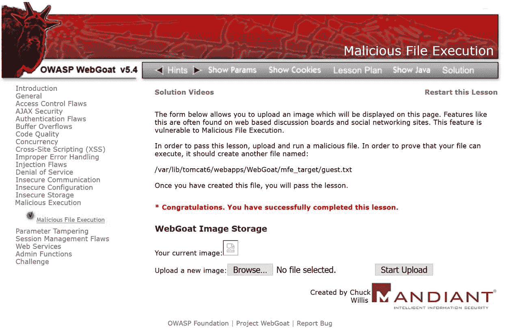

# 它是如何工作的...

由于不受限制的文件上传漏洞，我们可以上传恶意文件，如多语言文件，而不会被 Web 服务器检测到。许多网站允许上传图片，因此开发人员必须确保这些图片不携带其中的 XSS 有效负载。在这方面的保护可以采用魔术数字检查或特殊代理服务器筛选所有上传。

# 还有更多...

要了解更多关于多语言的信息，请参考 Portswigger 博客：[`portswigger.net/blog/bypassing-csp-using-polyglot-jpegs`](https://portswigger.net/blog/bypassing-csp-using-polyglot-jpegs)。
