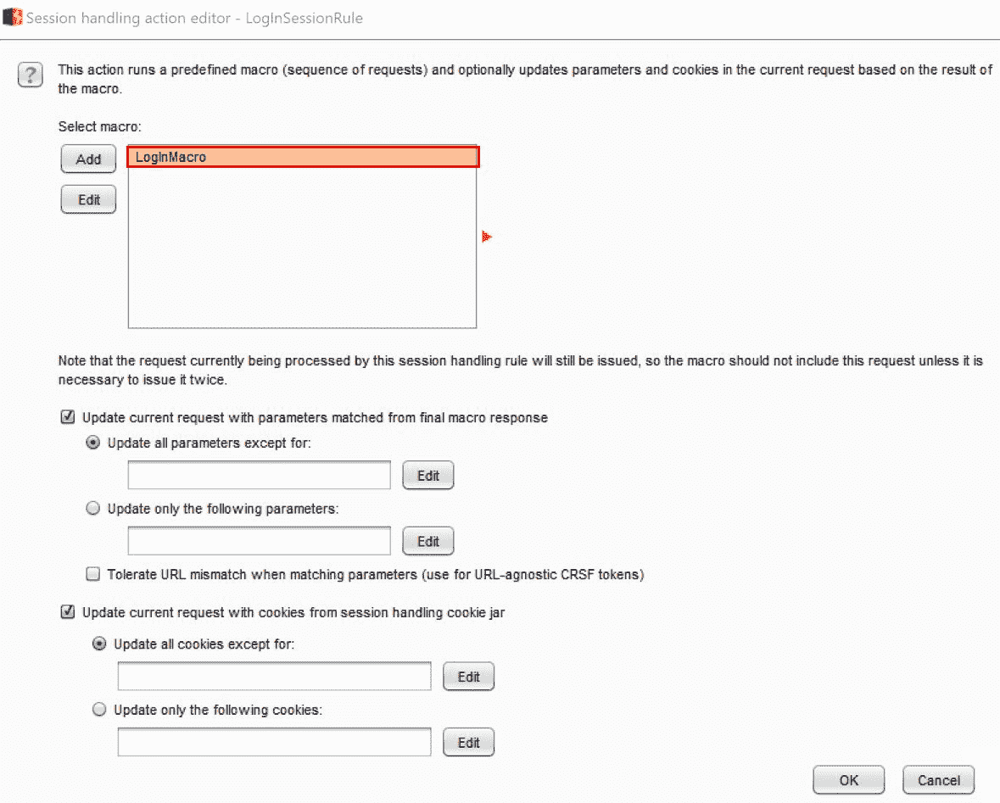
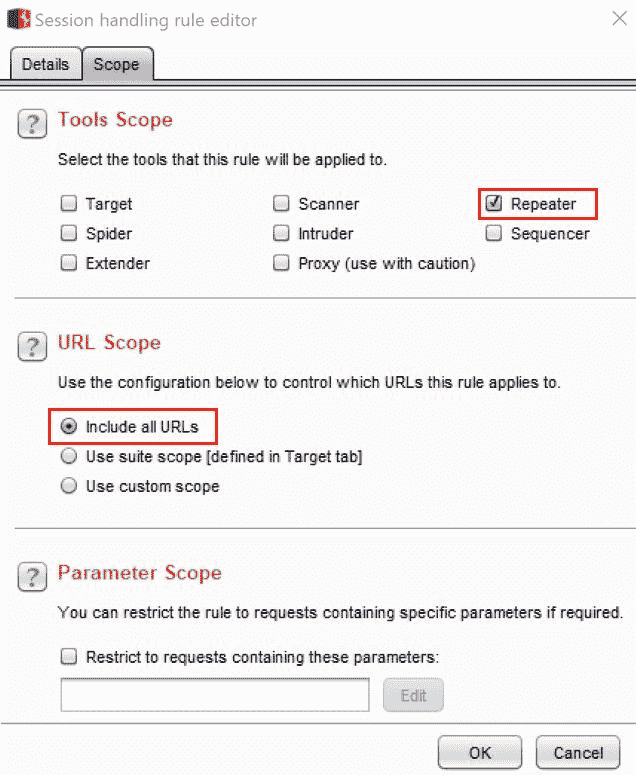
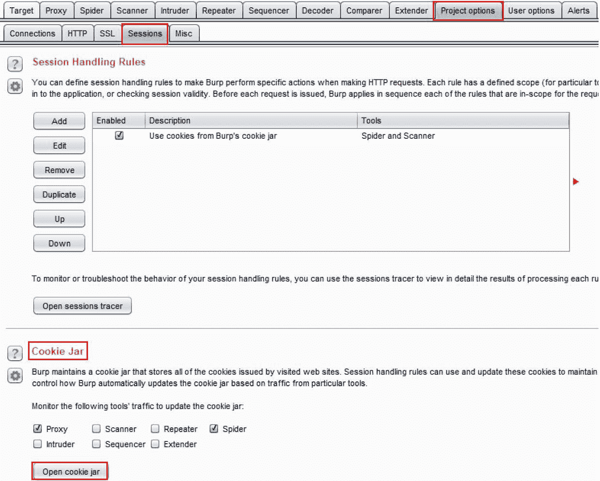
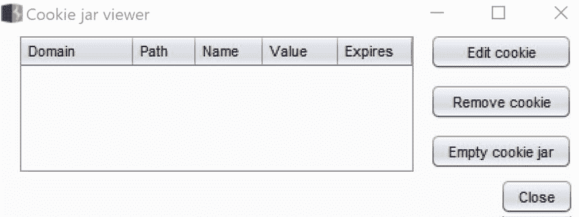
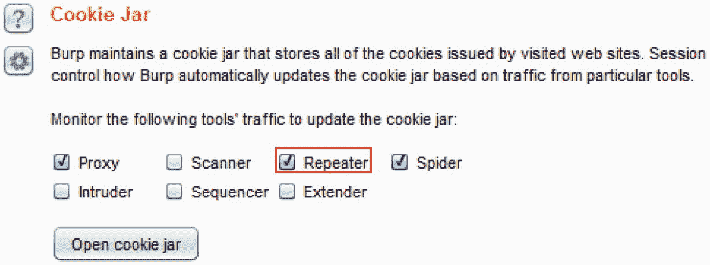
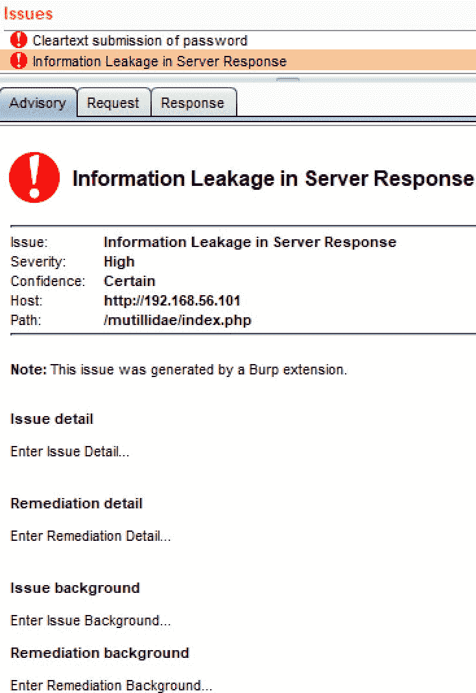
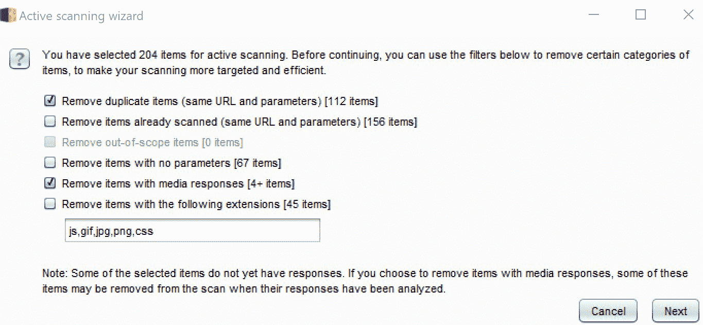

# 使用 Burp 宏和扩展

在本章中，我们将涵盖以下示例：

+   创建会话处理宏

+   被抓到手深处

+   添加优秀的渗透测试插件

+   通过手动扫描问题扩展创建新问题

+   使用 Active Scan++扩展

# 介绍

本章涵盖了两个可以混合在一起的独立主题：宏和扩展。Burp 宏使渗透测试人员能够自动化事件，例如登录或参数读取，以克服潜在的错误情况。扩展，也称为插件，扩展了 Burp 中找到的核心功能。

# 软件工具要求

为了完成本章的示例，您需要以下内容：

+   OWASP 破损的 Web 应用程序（VM）

+   OWASP Mutillidae (`http://<Your_VM_Assigned_IP_Address>/mutillidae`)

+   GetBoo (`http://<Your_VM_Assigned_IP_Address>/getboo`)

+   Burp Proxy Community or Professional ([`portswigger.net/burp/`](https://portswigger.net/burp/))

# 创建会话处理宏

在 Burp 中，项目选项卡允许测试人员设置会话处理规则。会话处理规则允许测试人员指定 Burp 在进行 HTTP 请求时将采取的一组操作。在范围内为 Spider 和 Scanner 设置了默认的会话处理规则。但是，在本示例中，我们将创建一个新的会话处理规则，并使用宏来帮助我们在使用 Repeater 时从未经认证的会话中创建一个经过认证的会话。

# 做好准备

使用 OWASP Mutilliae II 应用程序，我们将创建一个新的 Burp 会话处理规则，并使用相关的宏，在使用 Repeater 时从未经认证的会话中创建一个经过认证的会话。

# 如何做…

1.  在 Mutillidae 的登录页面中导航。使用用户名`ed`和密码`pentest`登录应用程序。

1.  立即点击“注销”按钮退出应用程序，并确保应用程序确认您已注销。

1.  切换到 Burp 代理 HTTP 历史选项卡。查找您刚刚进行的注销请求以及随后的未经认证的`GET`请求。选择未经认证的请求，即第二个`GET`。右键单击并将该请求发送到 Repeater，如下所示：

1.  切换到 Burp Repeater，然后单击“Go”按钮。在响应的渲染选项卡上，确保您收到“未登录”消息。我们将使用这种情况来构建一个会话处理规则，以解决未经认证的会话，并将其变为经过认证的会话，如下所示：

1.  切换到 Burp 项目选项卡，然后切换到会话选项卡，并在会话处理规则部分下单击“添加”按钮，如下所示：

1.  单击“添加”按钮后，将弹出一个框。给您的新规则取一个名字，比如`LogInSessionRule`，在规则操作下选择运行宏，如下所示：

1.  另一个弹出框出现，这是会话处理操作编辑器。在“选择宏”下的第一部分，单击“添加”按钮，如下所示：

1.  单击“添加”按钮后，宏编辑器将出现，同时还会出现另一个宏记录器的弹出框，如下所示：

注意：1.7.35 版本存在一个禁用宏记录器的错误。因此，在单击“添加”按钮后，如果记录器没有出现，请升级 Burp 版本至 1.7.36 或更高版本。

1.  在宏记录器中，查找您以 Ed 身份登录的`POST`请求以及以下的`GET`请求。在宏记录器窗口中突出显示这两个请求，然后单击“确定”，如下所示：

1.  在上一个对话框中突出显示的这两个请求现在出现在宏编辑器窗口中。给宏一个描述，比如`LogInMacro`，如下所示：

1.  单击“配置”按钮验证用户名和密码值是否正确。完成后单击“确定”，如下所示：

1.  单击“确定”关闭宏编辑器。您应该在会话处理操作编辑器中看到新创建的宏。单击“确定”关闭此对话框窗口，如下所示：

1.  关闭会话处理操作编辑器后，您将返回到会话处理规则编辑器，在那里您现在可以看到规则操作部分填充了您的宏名称。单击此窗口的范围选项卡，以定义哪个工具将使用此规则：

1.  在会话处理规则编辑器的范围选项卡中，取消选中其他框，只保留 Repeater 选中。在 URL 范围下，单击“包括所有 URL”单选按钮。单击“确定”关闭此编辑器，如下所示：

1.  现在您应该在会话处理规则窗口中看到新的会话处理规则，如下所示：

1.  返回到 Repeater 选项卡，在那里您之前未登录到应用程序。单击“Go”按钮，以显示您现在以 Ed 的身份登录！这意味着您的会话处理规则和相关的宏起作用了：

# 它是如何工作的...

在这个示例中，我们看到如何通过重放登录过程将未经身份验证的会话更改为经过身份验证的会话。宏的创建允许手动步骤被脚本化并分配给 Burp 套件中的各种工具。

Burp 允许测试人员配置会话处理规则，以解决工具套件可能遇到的各种条件。当满足这些条件时，规则提供额外的操作。在这个示例中，我们通过创建一个新的会话处理规则来解决未经身份验证的会话，该规则调用了一个宏。我们将此规则的范围限定为仅用于 Repeater，仅用于演示目的。

# 陷入困境

在针对应用程序时，Burp 会捕获代理和爬虫 HTTP 流量时遇到的所有 cookie。Burp 将这些 cookie 存储在一个名为**cookie jar**的缓存中。这个 cookie jar 在默认会话处理规则中使用，并且可以在 Burp 工具套件中共享，比如 Proxy、Intruder 和 Spider。在 cookie jar 中，有一个请求的历史表。该表详细说明了每个 cookie 的域和路径。可以编辑或删除 cookie jar 中的 cookie。

# 准备就绪

我们将打开 Burp Cookie Jar 并查看内部。然后，使用 OWASP GetBoo 应用程序，我们将识别添加到 Burp Cookie Jar 的新 cookie。

# 如何做...

1.  关闭并重新启动 Burp，以清除任何历史记录。切换到 Burp 项目选项卡，然后切换到会话选项卡。在 Cookie Jar 部分，单击“打开 cookie jar”按钮，如下所示：

1.  出现一个新的弹出框。由于我们还没有代理流量，cookie jar 是空的。让我们针对一个应用程序并捕获一些 cookie，如下所示：

1.  从 OWASP 登陆页面，单击链接以访问 GetBoo 应用程序，如下所示：

1.  单击“登录”按钮。在登录屏幕上，输入用户名和密码为`demo`，然后单击“登录”按钮。

1.  返回到 Burp Cookie Jar。现在有三个可用的 cookie。每个 cookie 都有一个域、路径、名称和值，如下所示：

1.  选择列表中的最后一个 cookie，然后单击“编辑 cookie”按钮。将值从`nada`修改为`thisIsMyCookie`，然后单击“确定”，如下所示：

1.  现在值已更改，如下所示：

1.  Burp Cookie Jar 的默认范围是 Proxy 和 Spider。但是，您可以扩展范围以包括其他工具。单击 Repeater 的复选框，如下所示：

现在，如果您创建一个新的会话处理规则并使用默认的 Burp Cookie Jar，您将看到该 cookie 的新值被用于请求。

# 它是如何工作的...

当自动化针对目标应用程序的请求时，Burp Cookie Jar 用于会话处理规则的 cookie 处理。在本教程中，我们查看了 Cookie Jar，了解了其内容，甚至修改了捕获的 cookie 值之一。使用默认的 Burp Cookie Jar 的任何后续会话处理规则都将在请求中看到修改后的值。

# 添加优秀的渗透测试插件

作为 Web 应用程序测试人员，您会发现一些方便的工具，可以增加到您的工具库中，使您的评估更加高效。Burp 社区提供了许多出色的扩展。在本教程中，我们将添加其中的一些，并解释它们如何使您的评估更好。Retire.js 和软件漏洞扫描器是两个插件，这两个插件与被动扫描器一起使用。

注意：这两个插件都需要 Burp 专业版。

# 准备工作

使用 OWASP Mutilliae II 应用程序，我们将添加两个方便的扩展，以帮助我们在目标中找到更多漏洞。

# 如何做…

1.  切换到 Burp 扩展选项卡。转到 BApp Store 并找到两个插件—`Retire.js`和“软件漏洞扫描器”。为每个插件单击“安装”按钮，如下所示：

！

1.  安装这两个插件后，转到“扩展”选项卡，然后转到“扩展”，然后转到 Burp 扩展部分。确保两个插件都启用，并在复选框内有检查标记。还要注意，软件漏洞扫描器有一个新选项卡，如下所示：

！

1.  返回到 Firefox 浏览器，浏览到 Mutillidae 首页。右键单击并选择“被动扫描此分支”，执行轻量级、非侵入式的被动扫描，如下所示：

！

1.  注意从这两个插件创建的额外发现。软件漏洞扫描器插件发现了许多 CVE 问题，`Retire.js`识别了五个易受攻击版本的 jQuery 实例，如下所示：

！

# 它是如何工作的…

通过 PortSwigger API 可以扩展 Burp 功能，以创建自定义扩展，也称为插件。在本教程中，我们安装了两个插件，用于识别应用程序中包含的已知漏洞的旧版本软件。

# 通过手动扫描问题扩展创建新问题

尽管 Burp 提供了许多常见的 Web 应用程序中发现的安全漏洞列表，但偶尔您会发现一个问题并需要创建一个自定义扫描发现。这可以使用手动扫描问题扩展来完成。

注意：此插件需要 Burp 专业版。

# 准备工作

使用 OWASP Mutillidae II 应用程序，我们将添加手动扫描问题扩展，创建显示发现的步骤，然后使用扩展创建自定义问题。

# 如何做…

1.  切换到 Burp 扩展选项卡。转到 BApp Store 并找到标有“手动扫描问题”的插件。单击“安装”按钮：

！

1.  返回到 Firefox 浏览器，浏览到 Mutillidae 首页。

1.  切换到 Burp 代理| HTTP 历史选项卡，并找到您刚刚浏览到首页的请求。单击“响应”选项卡。注意过于冗长的服务器标头，指示所使用的 Web 服务器类型和版本以及操作系统和编程语言。攻击者可以利用这些信息来识别技术堆栈并确定可利用的漏洞：

！

1.  由于这是一个发现，我们需要手动创建一个新问题，以便在报告中捕获它。在查看请求时，右键单击并选择“添加问题”，如下所示：

！

1.  弹出对话框出现。在“常规”选项卡中，我们可以创建一个名为“服务器响应中的信息泄露”的新问题名称。显然，您可以在问题详细信息、背景和补救领域添加更多措辞，如下所示：

！

1.  如果我们切换到 HTTP 请求选项卡，我们可以复制并粘贴请求选项卡中消息编辑器中找到的内容到文本区域中，如下所示：

1.  如果我们切换到 HTTP 响应选项卡，我们可以复制并粘贴响应选项卡中消息编辑器中找到的内容到文本区域中。

1.  完成后，切换回“常规”选项卡，然后单击“导入发现”按钮。您应该看到新创建的扫描问题已添加到问题窗口，如下所示：

# 工作原理...

在 Burp 核心问题列表中没有可用问题的情况下，测试人员可以使用手动扫描问题扩展创建自己的问题。在这个示例中，我们为服务器响应中的信息泄露创建了一个问题。

# 另请参阅

要查看 Burp 识别的所有问题定义，请转到[`portswigger.net/kb/issues`](https://portswigger.net/kb/issues)。

# 使用 Active Scan++扩展

一些扩展可以帮助找到具有特定有效负载的漏洞，比如 XML，或者帮助找到隐藏的问题，比如缓存投毒和 DNS 重绑定。在这个示例中，我们将添加一个名为**Active Scan++**的主动扫描器扩展，它有助于识别这些更专业的漏洞。

注意：此插件需要 Burp 专业版。

# 准备工作

使用 OWASP Mutillidae II 应用程序，我们将添加 Active Scan++扩展，然后针对目标运行主动扫描。

# 操作步骤...

1.  切换到 Burp Extender | BApp Store 并选择`Active Scan++`扩展。单击“安装”按钮安装扩展，如下所示：

1.  返回到 Firefox 浏览器并浏览 Mutillidae 主页。

1.  切换到 Burp 目标选项卡，然后切换到站点地图选项卡，在`mutillidae`文件夹上右键单击，并选择“主动扫描此分支”，如下所示：

1.  当 Active 扫描向导出现时，您可以保留默认设置并单击“下一步”按钮，如下所示：

按照提示点击“确定”开始扫描过程。

1.  在主动扫描器完成后，浏览到问题窗口。注意任何新添加的扩展发现的额外问题。您可以通过查找“This issue was generated by the Burp extension: Active Scan++”消息来确定扩展发现了哪些问题，如下所示：

# 工作原理...

Burp 功能可以通过使用扩展来扩展核心发现之外的功能。在这个示例中，我们安装了一个插件，它扩展了 Active Scanner 功能，以帮助识别额外的问题，比如任意头部注入，就像在这个示例中看到的那样。
