# 实施高级主题攻击

在本章中，我们将涵盖以下内容：

+   执行**XML 外部实体**（**XXE**）攻击

+   使用**JSON Web Token**（**JWT**）进行工作

+   使用 Burp Collaborator 来确定**服务器端请求伪造**（**SSRF**）

+   测试**跨源资源共享**（**CORS**）

+   执行 Java 反序列化攻击

# 介绍

本章涵盖了中级到高级的主题，如使用 JWT、XXE 和 Java 反序列化攻击，以及如何使用 Burp 来协助进行此类评估。对于一些高级攻击，Burp 插件在简化测试人员所需的任务方面提供了巨大的帮助。

# 软件工具要求

为了完成本章中的示例，您需要以下内容：

+   OWASP **Broken Web Applications**（**BWA**）

+   OWASP Mutillidae 链接

+   Burp 代理社区或专业版（[`portswigger.net/burp/`](https://portswigger.net/burp/)）

# 执行 XXE 攻击

XXE 是针对解析 XML 的应用程序的漏洞。攻击者可以使用任意命令操纵 XML 输入，并将这些命令作为 XML 结构中的外部实体引用发送。然后，由弱配置的解析器执行 XML，从而使攻击者获得所请求的资源。

# 准备工作

使用 OWASP Mutillidae II XML 验证器页面，确定应用程序是否容易受到 XXE 攻击。

# 如何做...

1.  导航到 XML 外部实体注入页面，即通过其他| XML 外部实体注入| XML 验证器：

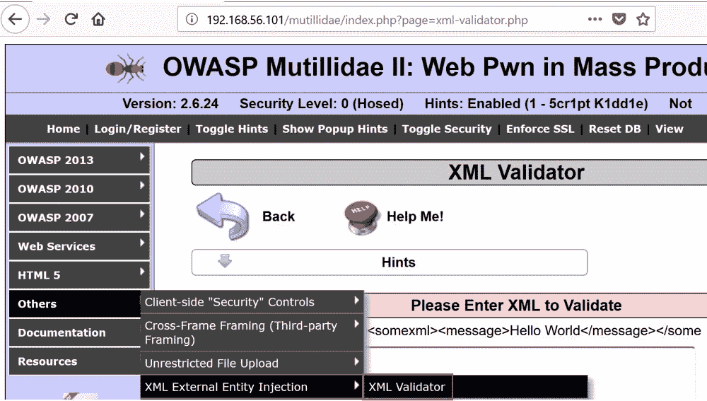

1.  在 XML 验证器页面上，执行页面上提供的示例 XML。单击“验证 XML”按钮：

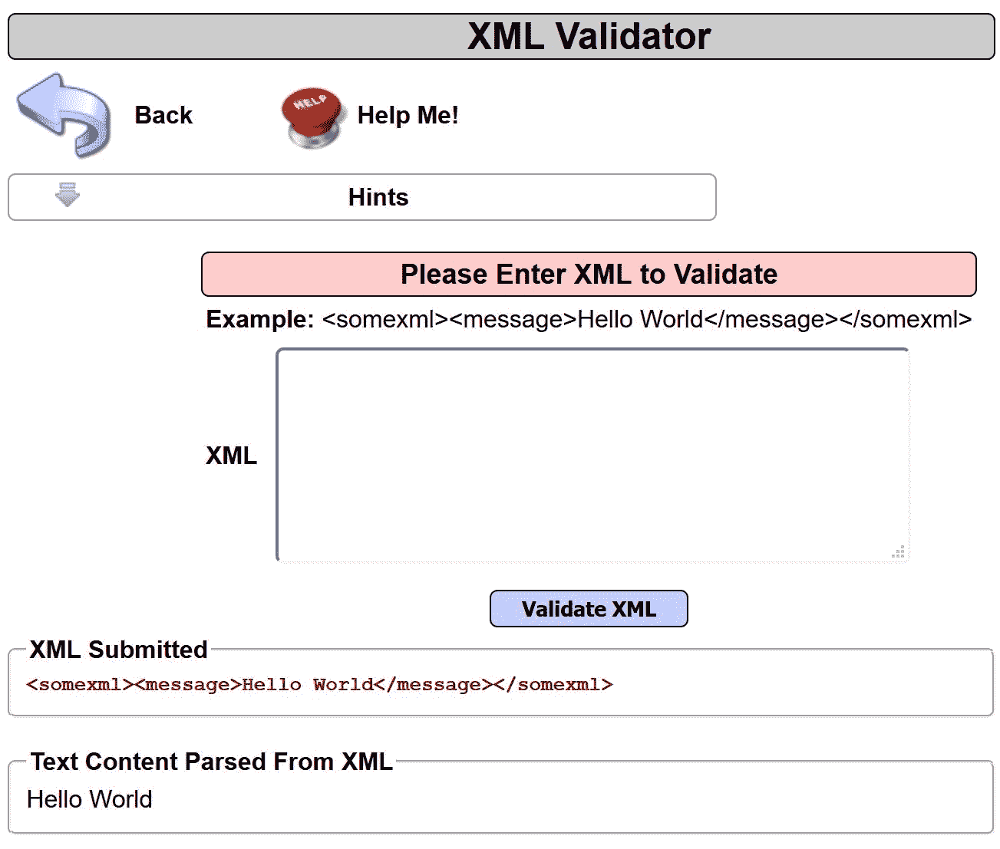

1.  切换到 Burp 代理| HTTP 历史选项卡，并查找您刚刚提交的用于验证 XML 的请求。右键单击并将请求发送到重复器：

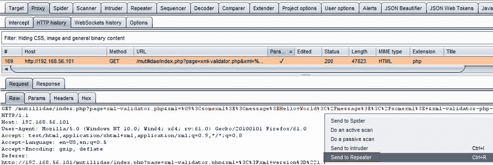

1.  注意`xml`参数中提供的值：

1.  使用 Burp 代理拦截器，将此 XML 参数值替换为以下有效负载。这个新的有效负载将对操作系统上应该被限制查看的文件发出请求，即`/etc/passwd`文件：

[PRE0]

由于新的 XML 消息中有奇怪的字符和空格，让我们在将其粘贴到`xml`参数之前，将此有效负载输入到解码器部分并进行 URL 编码。

1.  切换到解码器部分，输入或粘贴新的有效负载到文本区域。单击“编码为…”按钮，并从下拉列表中选择 URL 选项。然后，使用*Ctrl* + *C*复制 URL 编码的有效负载。确保通过向右滚动复制所有有效负载：

1.  切换到 Burp 代理拦截选项卡。使用“拦截已打开”按钮打开拦截器。

1.  返回到 Firefox 浏览器并重新加载页面。由于请求被暂停，将`xml`参数的当前值替换为新的 URL 编码的有效负载：

1.  点击“转发”按钮。通过切换按钮关闭拦截器，使拦截器处于关闭状态。

1.  请注意，返回的 XML 现在显示了`/etc/passwd`文件的内容！XML 解析器授予我们对操作系统上`/etc/passwd`文件的访问权限：

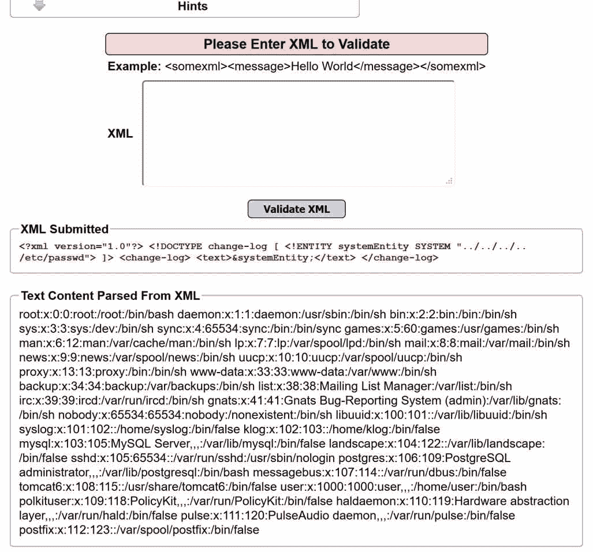

# 工作原理...

在这个示例中，不安全的 XML 解析器接收了 XML 中对服务器上`/etc/passwd`文件的请求。由于由于弱配置的解析器未对 XML 请求执行验证，因此资源自由地提供给攻击者。

# 使用 JWT

随着越来越多的网站提供客户端 API 访问，JWT 通常用于身份验证。这些令牌包含与用户在目标网站上被授予访问权限的资源相关的身份和声明信息。Web 渗透测试人员需要读取这些令牌并确定它们的强度。幸运的是，有一些方便的插件可以使在 Burp 中处理 JWT 令牌变得更容易。我们将在本章中了解这些插件。

# 准备工作

在这个教程中，我们需要生成 JWT 令牌。因此，我们将使用 OneLogin 软件来协助完成这项任务。为了完成这个教程，请浏览 OneLogin 网站：[`www.onelogin.com/`](https://www.onelogin.com/)。点击顶部的开发人员链接，然后点击获取开发人员帐户链接（[`www.onelogin.com/developer-signup`](https://www.onelogin.com/developer-signup)）。

注册后，您将被要求验证您的帐户并创建密码。请在开始这个教程之前执行这些帐户设置任务。

使用 OneLogin SSO 帐户，我们将使用两个 Burp 扩展来检查网站分配的 JWT 令牌作为身份验证。

# 如何操作...

1.  切换到 Burp BApp Store 并安装两个插件—JSON Beautifier 和 JSON Web Tokens：

1.  在 Firefox 浏览器中，转到您的 OneLogin 页面。URL 将特定于您创建的开发人员帐户。在开始这个教程之前，请使用您设置帐户时建立的凭据登录帐户：

1.  切换到 Burp 代理 | HTTP 历史选项卡。找到 URL 为`/access/auth`的 POST 请求。右键单击并单击发送到 Repeater 选项。

1.  您的主机值将特定于您设置的 OneLogin 帐户：

1.  切换到 Repeater 选项卡，注意您有两个与您安装的两个扩展相关的额外选项卡：

1.  单击 JSON Beautifier 选项卡，以更可读的方式查看 JSON 结构：

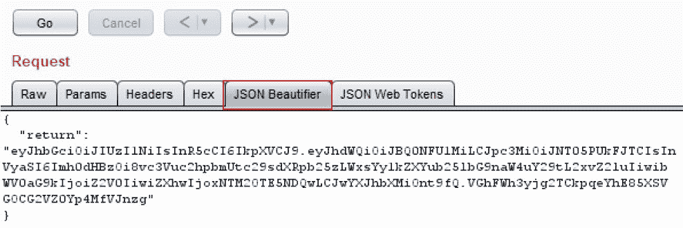

1.  单击 JSON Web Tokens 选项卡，以显示一个与[`jwt.io`](https://jwt.io)上可用的非常相似的调试器。此插件允许您阅读声明内容并操纵各种暴力测试的加密算法。例如，在下面的屏幕截图中，请注意您可以将算法更改为**nOnE**，以尝试创建一个新的 JWT 令牌放入请求中：

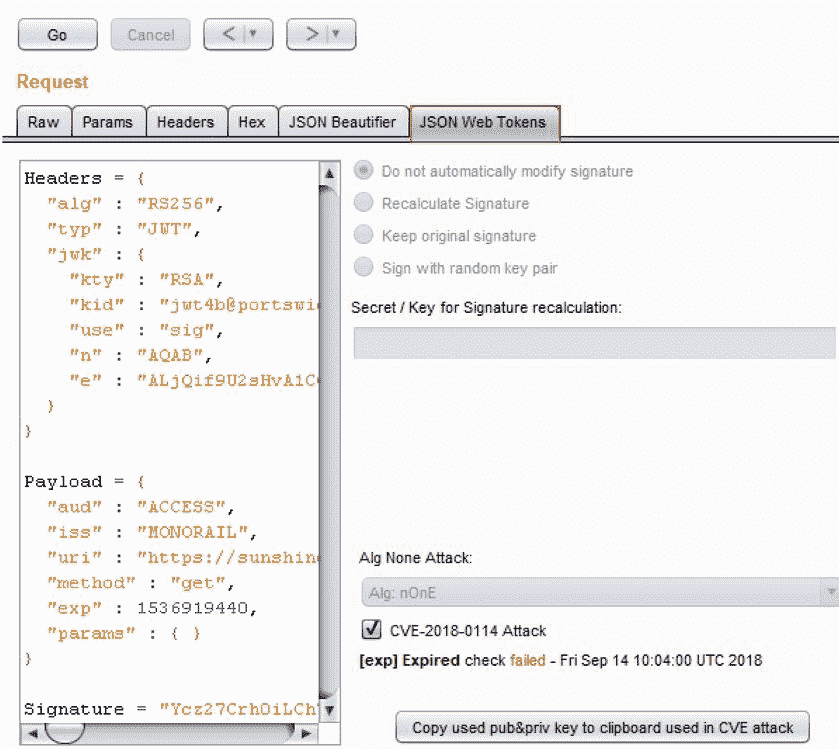

# 它是如何工作的...

两个扩展，JSON Beautifier 和 JSON Web Tokens，通过提供方便地与 Burp UI 一起使用的调试器工具，帮助测试人员更轻松地处理 JWT 令牌。

# 使用 Burp Collaborator 来确定 SSRF

SSRF 是一种漏洞，允许攻击者强制应用程序代表攻击者进行未经授权的请求。这些请求可以简单到 DNS 查询，也可以疯狂到来自攻击者控制的服务器的命令。

在这个教程中，我们将使用 Burp Collaborator 来检查 SSRF 请求的开放端口，然后使用 Intruder 来确定应用程序是否会通过 SSRF 漏洞向公共 Burp Collaborator 服务器执行 DNS 查询。

# 准备工作

使用 OWASP Mutillidae II DNS 查询页面，让我们确定应用程序是否存在 SSRF 漏洞。

# 如何操作...

1.  切换到 Burp 项目选项 | 杂项选项卡。注意 Burp Collaborator 服务器部分。您可以选择使用私人 Burp Collaborator 服务器的选项，您可以设置，或者您可以使用 PortSwigger 提供的公共互联网可访问的服务器。在这个教程中，我们将使用公共的。

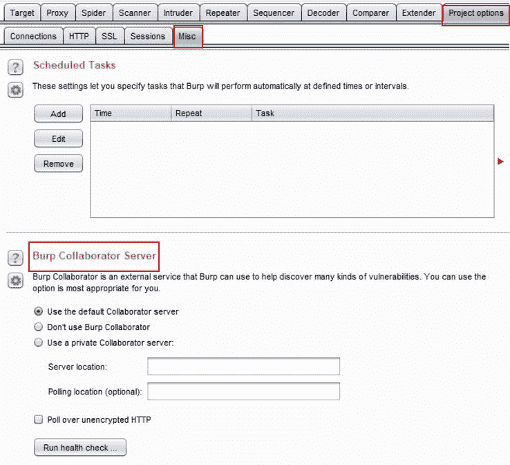

1.  勾选标有在未加密的 HTTP 上轮询并单击运行健康检查...按钮的框：

1.  弹出框出现以测试各种协议，以查看它们是否会连接到互联网上可用的公共 Burp Collaborator 服务器。

1.  检查每个协议的消息，看看哪些是成功的。完成后，单击关闭按钮：

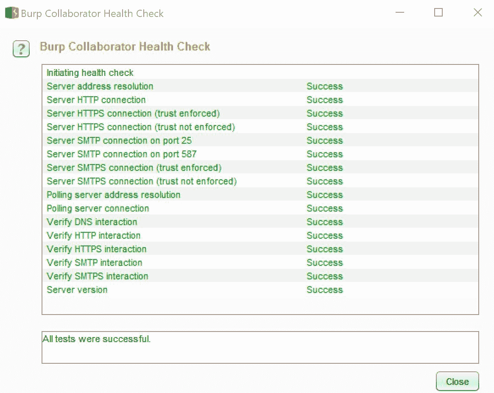

1.  从顶级菜单中，选择 Burp | Burp Collaborator 客户端：

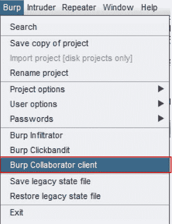

1.  弹出框出现。在标有生成协作者有效负载的部分，将 1 更改为 10：

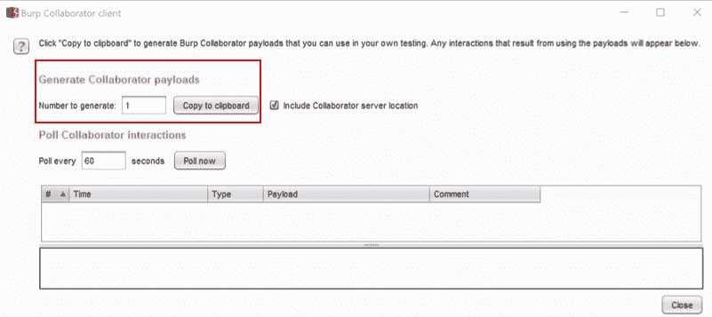

1.  单击复制到剪贴板按钮。保持所有其他默认设置不变。不要关闭 Collaborator 客户端窗口。如果关闭窗口，您将丢失客户端会话：

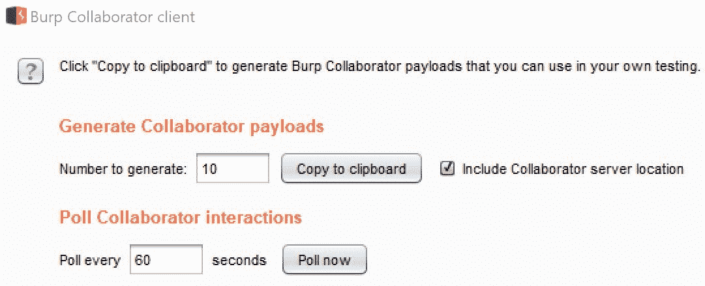

1.  返回 Firefox 浏览器，并导航到 OWASP 2013 | A1 – Injection（其他）| HTML Injection（HTMLi）| DNS Lookup：

1.  在 DNS Lookup 页面上，输入 IP 地址，然后单击查找 DNS 按钮：

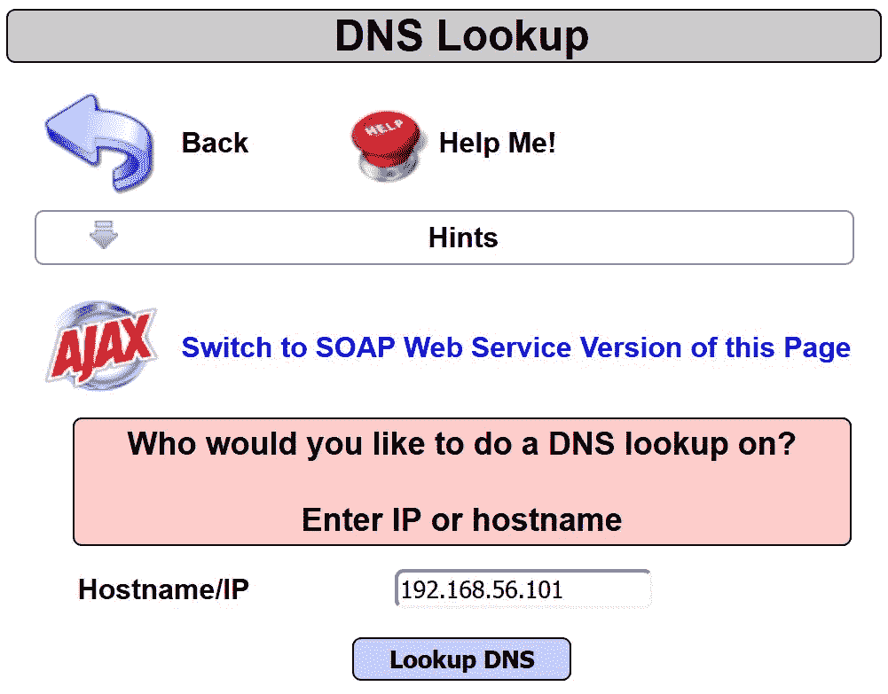

1.  切换到 Burp Proxy | HTTP 历史选项卡，并找到刚刚在 DNS Lookup 页面上创建的请求。右键单击并选择发送到 Intruder 选项：

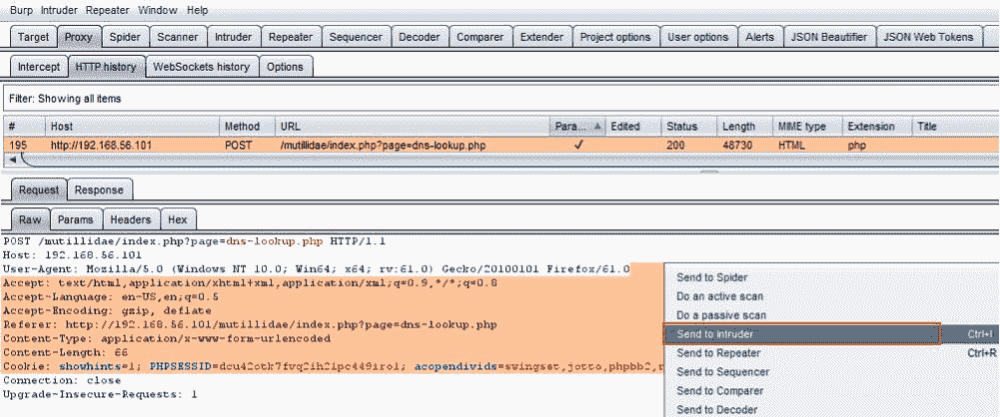

1.  切换到 Burp Intruder |位置选项卡。清除所有建议的有效负载标记，并突出显示 IP 地址，单击*添加§*按钮，将有效负载标记放置在`target_host`参数的 IP 地址值周围：

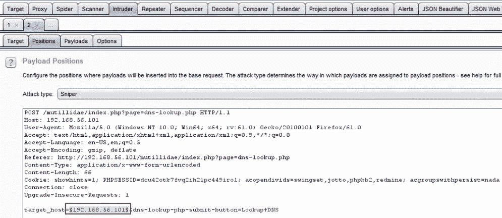

1.  切换到 Burp Intruder |有效负载选项卡，并使用粘贴按钮将从 Burp Collaborator 客户端复制到剪贴板的 10 个有效负载粘贴到有效负载选项[简单列表]文本框中：

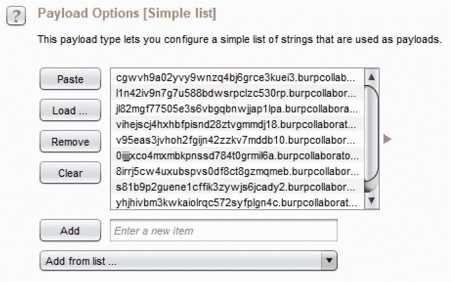

确保取消选中有效负载编码复选框。

1.  单击开始攻击按钮。攻击结果表将在处理有效负载时弹出。允许攻击完成。请注意，`burpcollaborator.net` URL 放置在`target_host`参数的有效负载标记位置：

1.  返回 Burp Collaborator 客户端，单击立即轮询按钮，查看是否有任何 SSRF 攻击成功通过任何协议。如果任何请求泄漏到网络之外，则这些请求将显示在此表中，并显示使用的特定协议。如果在此表中显示任何请求，则需要将 SSRF 漏洞报告为发现。从这里显示的结果可以看出，应用程序代表攻击者提供的有效负载进行了大量 DNS 查询：

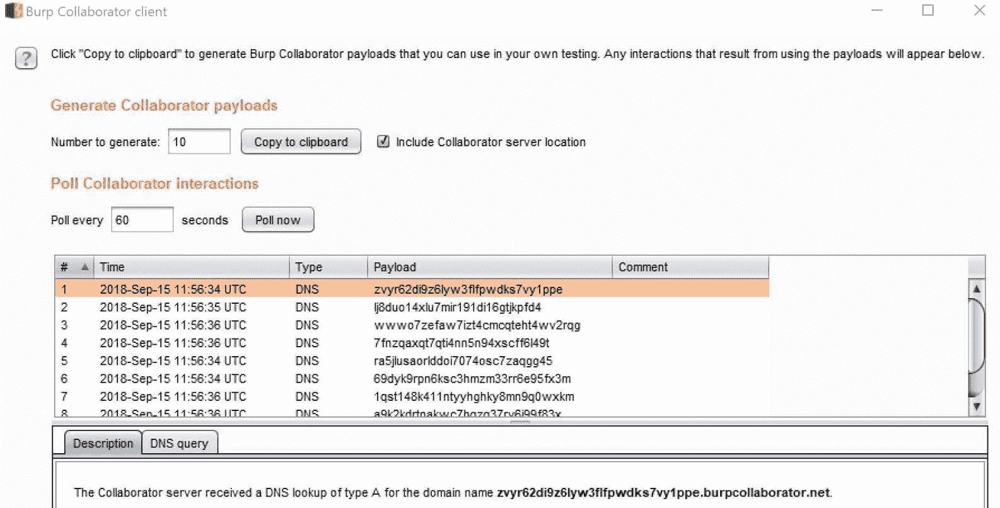

# 工作原理...

网络泄漏和过于宽松的应用程序参数可以允许攻击者代表应用程序通过各种协议进行未经授权的调用。在这个案例中，该应用程序允许 DNS 查询泄漏到本地机器之外并连接到互联网。

# 另请参阅

有关 SSRF 攻击的更多信息，请参阅 PortSwigger 博客条目[`portswigger.net/blog/cracking-the-lens-targeting-https-hidden-attack-surface`](https://portswigger.net/blog/cracking-the-lens-targeting-https-hidden-attack-surface)。

# 测试 CORS

实现 HTML5 CORS 的应用程序意味着该应用程序将与位于不同来源的另一个域共享浏览器信息。按设计，浏览器保护阻止外部脚本访问浏览器中的信息。此保护称为**同源策略**（**SOP**）。但是，CORS 是一种绕过 SOP 的手段。如果应用程序希望与完全不同的域共享浏览器信息，则可以通过正确配置的 CORS 标头实现。

网络渗透测试人员必须确保处理 AJAX 调用（例如 HTML5）的应用程序没有配置错误的 CORS 标头。让我们看看 Burp 如何帮助我们识别这种配置错误。

# 准备就绪

使用 OWASP Mutillidae II AJAX 版本的 Pen Test Tool Lookup 页面，确定应用程序是否包含配置错误的 CORS 标头。

# 如何做...

1.  导航到 HTML5 |异步 JavaScript 和 XML | Pen Test Tool Lookup（AJAX）：

1.  从列表中选择一个工具，然后单击查找工具按钮：

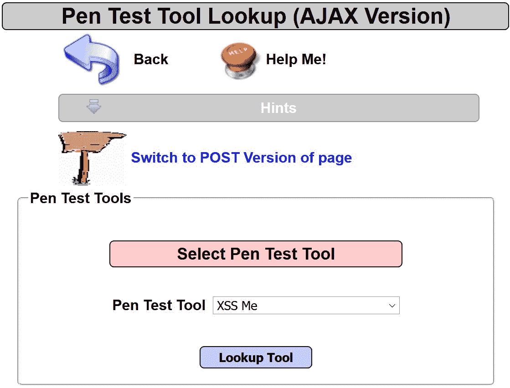

1.  切换到 Burp Proxy | HTTP 历史选项卡，并找到刚刚从 AJAX 版本 Pen Test Tool Lookup 页面进行的请求。切换到响应选项卡：

1.  让我们通过选择相同响应选项卡的标题选项卡来更仔细地检查标题。虽然这是一个 AJAX 请求，但该调用是应用程序内部的，而不是跨源域的。因此，由于不需要，没有 CORS 标头。但是，如果对外部域进行调用（例如 Google APIs），则需要 CORS 标头：

1.  在 AJAX 请求中，会调用外部 URL（例如，跨域）。为了允许外部域接收来自用户浏览器会话的 DOM 信息，必须存在 CORS 标头，包括`Access-Control-Allow-Origin: <跨域的名称>`。

1.  如果 CORS 标头未指定外部域的名称，而是使用通配符（`*`），则存在漏洞。Web 渗透测试人员应将此包括在其报告中，作为配置错误的 CORS 标头漏洞。

# 它是如何工作的...

由于此示例中使用的 AJAX 调用源自同一位置，因此无需 CORS 标头。但是，在许多情况下，AJAX 调用是向外部域进行的，并且需要通过 HTTP 响应`Access-Control-Allow-Origin`标头明确许可。

# 另请参阅

有关配置错误的 CORS 标头的更多信息，请参阅 PortSwigger 博客条目[`portswigger.net/blog/exploiting-cors-misconfigurations-for-bitcoins-and-bounties`](https://portswigger.net/blog/exploiting-cors-misconfigurations-for-bitcoins-and-bounties)。

# 执行 Java 反序列化攻击

**序列化**是各种语言中提供的一种机制，允许以二进制格式保存对象的状态。它用于加快速度和混淆。将对象从二进制转换回对象的过程称为反序列化。在使用用户输入创建对象并将该对象序列化后，会为任意代码注入和可能的远程代码执行创建攻击向量。我们将看一下 Burp 扩展，它将帮助 Web 渗透测试人员评估 Java 反序列化漏洞的应用程序。

# 准备工作

[PRE1]

# 如何操作...

1.  切换到 Burp BApp Store 并安装 Java Serial Killer 插件：

为了创建一个使用序列化对象的场景，我们将采用标准请求，并向其添加一个序列化对象，以演示您如何使用扩展程序向序列化对象添加受攻击者控制的命令。

1.  请注意，您的 Burp UI 菜单顶部添加了一个新的选项卡，专门用于新安装的插件。

1.  导航到 Mutillidae 主页。

1.  切换到 Burp Proxy| HTTP 历史选项卡，并查找刚刚创建的请求，方法是浏览到 Mutillidae 主页：

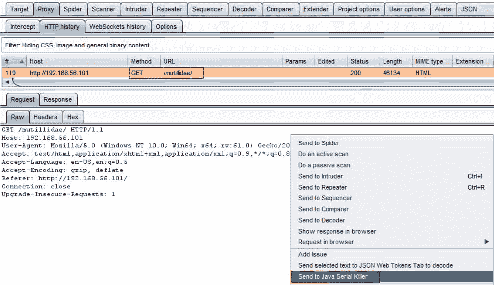

不幸的是，Mutillidae 中没有序列化对象，所以我们必须自己创建一个。

1.  切换到解码器选项卡并复制以下序列化对象的片段：

[PRE2]

1.  将十六进制数粘贴到解码器选项卡，单击“编码为...”按钮，然后选择 base 64：

1.  从解码器选项卡复制 base-64 编码的值，并将其粘贴到您发送到 Java Serial Killer 选项卡底部的请求中。使用*Ctrl* + *C*从解码器复制，*Ctrl* + *V*粘贴到请求的白色空间区域中的任何位置：

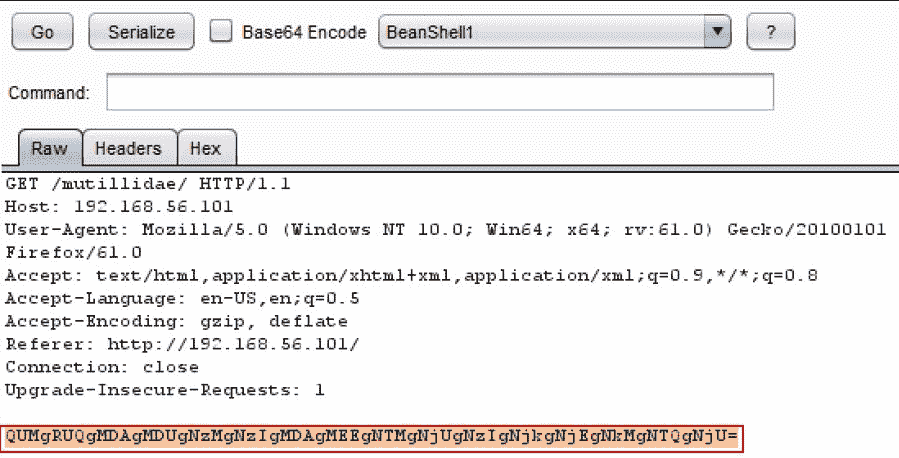

1.  在 Java Serial Killer 选项卡中，从下拉列表中选择一个 Java 库。对于这个示例，我们将使用 CommonsCollections1。勾选 Base64 编码框。添加一个命令嵌入到序列化对象中。在这个示例中，我们将使用 nslookup 127.0.0.1 命令。突出显示有效载荷并单击“序列化”按钮：

1.  单击“序列化”按钮后，注意有效载荷已更改，现在包含您的任意命令并且已进行 base-64 编码：

1.  单击 Java Serial Killer 选项卡中的“Go”按钮以执行有效载荷。即使您可能会收到响应中的错误，理想情况下，您将拥有一个侦听器，例如`tcpdump`，用于监听端口`53`上的任何 DNS 查询。从侦听器中，您将看到对 IP 地址的 DNS 查询，该 IP 地址是您在`nslookup`命令中指定的。

# 它是如何工作的...

在应用程序代码接收用户输入并将其直接放入对象而不对输入进行消毒的情况下，攻击者有机会提供任意命令。然后对输入进行序列化并在应用程序所在的操作系统上运行，从而为远程代码执行创建可能的攻击向量。

# 还有更多...

由于这个示例场景有点牵强，您可能无法在`nslookup`命令的网络监听器上收到响应。在下载已知存在 Java 反序列化漏洞的应用程序的易受攻击版本（即 Jenkins、JBoss）后，再尝试此示例。重复此处显示的相同步骤，只需更改目标应用程序。

# 另请参阅

+   有关真实世界的 Java 反序列化攻击的更多信息，请查看以下链接：

+   **赛门铁克**：[`www.symantec.com/security_response/attacksignatures/detail.jsp?asid=30326`](https://www.symantec.com/security_response/attacksignatures/detail.jsp?asid=30326)

+   福克斯格洛夫安全：[`foxglovesecurity.com/2015/11/06/what-do-weblogic-websphere-jboss-jenkins-opennms-and-your-application-have-in-common-this-vulnerability/`](https://foxglovesecurity.com/2015/11/06/what-do-weblogic-websphere-jboss-jenkins-opennms-and-your-application-have-in-common-this-vulnerability/)

+   要了解有关这个 Burp 插件的更多信息，请访问[`blog.netspi.com/java-deserialization-attacks-burp/`](https://blog.netspi.com/java-deserialization-attacks-burp/)
