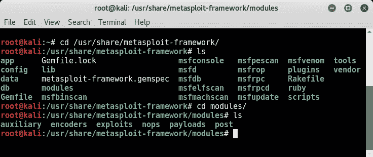
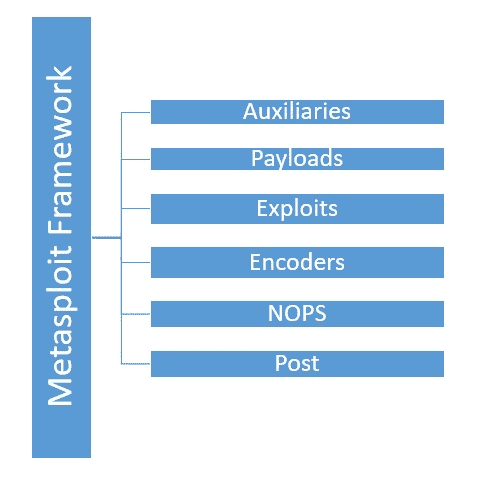
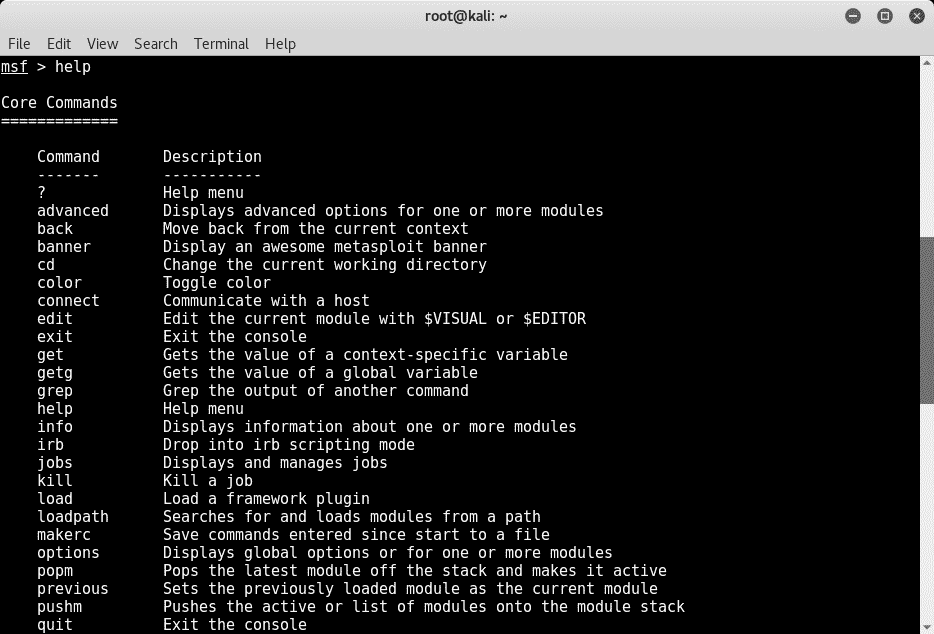
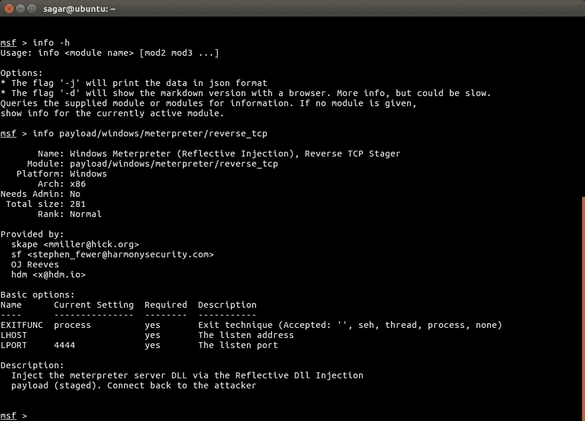
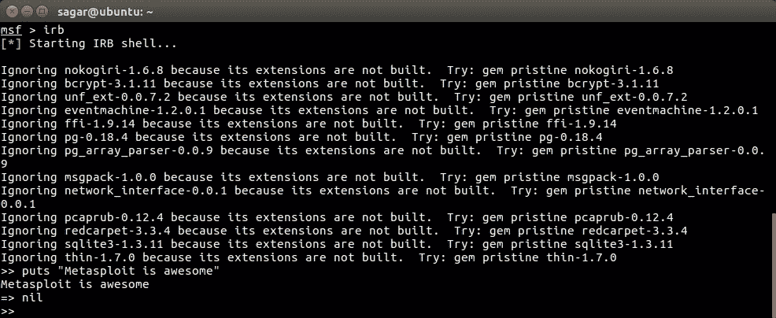

# 第三章：Metasploit 组件和环境配置

对于我们用来执行特定任务的任何工具，了解该工具的内部始终是有帮助的。对工具的详细了解使我们能够恰当地使用它，使其充分发挥其能力。现在您已经学会了 Metasploit Framework 及其安装的一些绝对基础知识，在本章中，您将学习 Metasploit Framework 的结构以及 Metasploit 生态系统的各种组件。本章将涵盖以下主题：

+   Metasploit 的解剖和结构

+   Metasploit 组件--辅助模块、利用、编码器、有效载荷和后期

+   开始使用 msfconsole 和常用命令

+   配置本地和全局变量

+   更新框架

# Metasploit 的解剖和结构

学习 Metasploit 结构的最佳方法是浏览其目录。在使用 Kali Linux 时，Metasploit Framework 通常位于路径`/usr/share/metasploit-framework`，如下面的屏幕截图所示：

在较高层次上，Metasploit Framework 的结构如下所示：

Metasploit Framework 具有非常清晰和明确定义的结构，框架内的工具/实用程序根据它们在渗透测试生命周期的各个阶段中的相关性进行组织。随着我们在本书中的进展，我们将使用来自每个类别的工具/实用程序。

在下一节中，我们将简要概述所有 Metasploit 组件。

# Metasploit 组件

Metasploit Framework 具有基于其在渗透测试阶段中的角色的各种组件类别。以下各节将详细了解每个组件类别的责任。

# 辅助模块

到目前为止，您已经了解到 Metasploit 是一个完整的渗透测试框架，而不仅仅是一个工具。当我们称其为框架时，这意味着它包含许多有用的工具和实用程序。Metasploit Framework 中的辅助模块只是用于执行特定任务（在我们的渗透测试生命周期范围内）的小代码片段。例如，您可能需要执行一个简单的任务，验证特定服务器的证书是否已过期，或者您可能想要扫描您的子网并检查是否有任何 FTP 服务器允许匿名访问。使用 Metasploit Framework 中存在的辅助模块可以非常轻松地完成这些任务。

在 Metasploit Framework 中有 1000 多个辅助模块分布在 18 个类别中。

以下表格显示了 Metasploit Framework 中存在的各种辅助模块的各个类别：

| `gather` | `pdf` | `vsploit` |
| --- | --- | --- |
| `bnat` | `sqli` | `client` |
| `crawler` | `fuzzers` | `server` |
| `spoof` | `parser` | `voip` |
| `sniffer` | `analyze` | `dos` |
| `docx` | `admin` | `scanner` |

不要被 Metasploit Framework 中存在的辅助模块数量所压倒。您可能不需要单独了解每个模块。您只需要在所需的上下文中搜索正确的模块并相应地使用它。现在我们将看到如何使用辅助模块。

在本书的过程中，我们将根据需要使用许多不同的辅助模块；但是，让我们从一个简单的例子开始：

1.  打开终端窗口，并使用命令`msfconsole`启动 Metasploit。

1.  选择`auxiliary`模块`portscan/tcp`来对目标系统执行端口扫描。

1.  使用`show`命令，列出运行此辅助模块所需配置的所有参数。

1.  使用`set RHOSTS`命令，设置我们目标系统的 IP 地址。

1.  使用`set PORTS`命令，选择要在目标系统上扫描的端口范围。

1.  使用`run`命令，执行先前配置的参数的辅助模块。

您可以在以下截图中看到所有先前提到的命令的使用：

# 利用

利用是 Metasploit 框架中最重要的部分。利用是实际的代码片段，将为您提供对目标系统所需的访问权限。根据支持利用的平台，有 2500 多个利用分布在 20 多个类别中。现在，您可能会想到在这么多可用的利用中，需要使用哪一个。只有在对目标进行广泛的枚举和漏洞评估之后，才能决定使用特定的利用对目标进行攻击（参见第一章中的渗透测试生命周期部分，*Metasploit 和支持工具简介*）。对目标进行适当的枚举和漏洞评估将为我们提供以下信息，基于这些信息，我们可以选择正确的利用：

+   目标系统的操作系统（包括确切的版本和架构）

+   目标系统上的开放端口（TCP 和 UDP）

+   目标系统上运行的服务及其版本

+   特定服务存在漏洞的概率

以下表格显示了 Metasploit 框架中提供的各种利用类别：

| **Linux** | **Windows** | **Unix** | **OS X** | **Apple iOS** |
| --- | --- | --- | --- | --- |
| `irix` | `mainframe` | `freebsd` | `solaris` | `bsdi` |
| `firefox` | `netware` | `aix` | `android` | `dialup` |
| `hpux` | `jre7u17` | `wifi` | `php` | `mssql` |

在接下来的章节中，我们将看到如何针对易受攻击的目标使用利用。

# 编码器

在任何给定的现实世界渗透测试场景中，我们尝试攻击目标系统很可能会被目标系统上存在的某种安全软件检测到/注意到。这可能会危及我们所有的努力来获取对远程系统的访问权限。这正是编码器发挥作用的时候。编码器的工作是以这样的方式混淆我们的利用和有效载荷，以至于它在目标系统上的任何安全系统都不会被注意到。

以下表格显示了 Metasploit 框架中提供的各种编码器类别：

| `generic` | `mipsbe` | `ppc` |
| --- | --- | --- |
| `x64` | `php` | `mipsle` |
| `cmd` | `sparc` | `x86` |

我们将在接下来的章节中更详细地了解编码器。

# 有效载荷

要了解有效载荷的作用，让我们考虑一个现实世界的例子。某个国家的军事单位开发了一种新型导弹，可以以非常高的速度飞行 500 公里。现在，导弹本身是没有用的，除非它装满了正确类型的弹药。现在，军事单位决定在导弹内部装载高爆材料，这样当导弹击中目标时，导弹内部的高爆材料就会爆炸，对敌人造成所需的伤害。因此，在这种情况下，导弹内的高爆材料就是有效载荷。根据导弹发射后要造成的破坏程度，可以更改有效载荷。

同样，在 Metasploit 框架中的有效载荷让我们决定在成功利用后对目标系统执行什么操作。以下是 Metasploit 框架中提供的各种有效载荷类别：

+   **Singles**：有时也称为内联或非分段有效载荷。此类别中的有效载荷是利用的完全独立单元，并且需要 shellcode，这意味着它们具有利用目标漏洞所需的一切。这种有效载荷的缺点是它们的大小。由于它们包含完整的利用和 shellcode，它们有时可能相当庞大，使它们在某些有大小限制的场景中变得无用。

+   **分段**：在某些情况下，有效载荷的大小非常重要。即使是多一个字节的有效载荷在目标系统上也可能无法正常运行。在这种情况下，分段有效载荷非常有用。分段有效载荷简单地在攻击系统和目标系统之间建立连接。它没有在目标系统上利用漏洞所需的 shellcode。由于体积非常小，它在许多情况下都能很好地适用。

+   **阶段**：一旦分段类型的有效载荷建立了攻击系统和目标系统之间的连接，“阶段”有效载荷就会被下载到目标系统上。它们包含在目标系统上利用漏洞所需的 shellcode。

以下截图显示了一个示例有效载荷，可用于从受损的 Windows 系统获取反向 TCP shell：

在接下来的章节中，您将学习如何使用各种有效载荷以及利用。

# 后期

**post**模块包含各种脚本和实用程序，可以在成功利用后帮助我们进一步渗透目标系统。一旦成功利用漏洞并进入目标系统，后期利用模块可能以以下方式帮助我们：

+   提升用户权限

+   转储操作系统凭据

+   窃取 cookie 和保存的密码

+   从目标系统获取按键日志

+   执行 PowerShell 脚本

+   使我们的访问持久化

以下表格显示了 Metasploit Framework 中可用的各种“post”模块的不同类别：

| **Linux** | **Windows** | **OS X** | **Cisco** |
| --- | --- | --- | --- |
| Solaris | Firefox | Aix | Android |
| 多功能 | Zip | Powershell |  |

Metasploit Framework 有 250 多个后期利用实用程序和脚本。在接下来的章节中，我们将讨论更多关于后期利用技术的内容时，会使用其中一些。

# 玩转 msfconsole

现在我们对 Metasploit Framework 的结构有了基本的了解，让我们开始实际学习`msfconsole`的基础知识。

`msfconsole`只是 Metasploit Framework 的简单命令行界面。虽然`msfconsole`可能一开始看起来有点复杂，但它是与 Metasploit Framework 交互的最简单和最灵活的方式。在本书的学习过程中，我们将一直使用`msfconsole`与 Metasploit 框架进行交互。

一些 Metasploit 版本确实提供了 GUI 和基于 Web 的界面。然而，从学习的角度来看，始终建议掌握 Metasploit Framework 的命令行控制台`msfconsole`。

让我们看一些`msfconsole`命令：

+   `banner`命令：`banner`命令是一个非常简单的命令，用于显示 Metasploit Framework 的横幅信息。此信息通常包括其版本详细信息以及当前安装版本中可用的漏洞、辅助工具、有效载荷、编码器和 nop 生成器的数量。

它的语法是`msf> banner`。以下截图显示了`banner`命令的使用：

+   `version`命令：`version`命令用于检查当前 Metasploit Framework 安装的版本。您可以访问以下网站以检查 Metasploit 官方发布的最新版本：

[`github.com/rapid7/metasploit-framework/wiki/Downloads-by-Version`](https://github.com/rapid7/metasploit-framework/wiki/Downloads-by-Version)

它的语法是`msf> version`。以下截图显示了`version`命令的使用：

+   `connect`命令：Metasploit Framework 中的`connect`命令提供了类似于 putty 客户端或 netcat 的功能。您可以使用此功能进行快速端口扫描或端口横幅抓取。

它的语法是`msf> connect <ip:port>`。以下截图显示了`connect`命令的使用：

+   `help`命令：顾名思义，`help`命令提供有关 Metasploit Framework 中任何命令的使用的附加信息。

其语法为`msf> help`。以下截图显示了`help`命令的使用：

+   `route`命令：`route`命令用于添加、查看、修改或删除网络路由。这用于高级场景中的枢纽，我们将在本书的后面部分介绍。 

其语法为`msf> route`。以下截图显示了`route`命令的使用：

+   `save`命令：有时，在对复杂目标环境进行渗透测试时，Metasploit Framework 会进行许多配置更改。现在，如果需要稍后再次恢复渗透测试，从头开始重新配置 Metasploit Framework 将非常痛苦。`save`命令将所有配置保存到文件中，并在下次启动时加载，节省了所有重新配置的工作。

其语法为`msf>save`。以下截图显示了`save`命令的使用：

+   `sessions`命令：一旦我们成功利用目标，通常会在目标系统上获得一个 shell 会话。如果我们同时在多个目标上工作，可能会同时打开多个会话。Metasploit Framework 允许我们根据需要在多个会话之间切换。`sessions`命令列出了与各个目标系统建立的所有当前活动会话。

其语法为`msf>sessions`。以下截图显示了`sessions`命令的使用：

+   `spool`命令：就像任何应用程序都有帮助调试错误的调试日志一样，`spool`命令将所有输出打印到用户定义的文件以及控制台。稍后可以根据需要分析输出文件。

其语法为`msf>spool`。以下截图显示了`spool`命令的使用：

+   `show`命令：`show`命令用于显示 Metasploit Framework 中可用的模块，或在使用特定模块时显示附加信息。

其语法为`msf> show`。以下截图显示了`show`命令的使用：

+   `info`命令：`info`命令用于显示 Metasploit Framework 中特定模块的详细信息。例如，您可能希望查看有关 meterpreter 有效载荷的信息，例如支持的架构和执行所需的选项：

其语法为`msf> info`。以下截图显示了`info`命令的使用：

+   `irb`命令：`irb`命令从 Metasploit Framework 内部调用交互式 Ruby 平台。交互式 Ruby 平台可用于在后期利用阶段创建和调用自定义脚本。

其语法为`msf>irb`。以下截图显示了`irb`命令的使用：

+   `makerc`命令：当我们使用 Metasploit Framework 对目标进行渗透测试时，会发出许多命令。在任务结束或特定会话结束时，我们可能希望回顾通过 Metasploit 执行的所有活动。`makerc`命令简单地将特定会话的所有命令历史写入用户定义的输出文件。

其语法为`msf>makerc`。以下截图显示了`makerc`命令的使用：

# Metasploit 中的变量

对于我们在 Metasploit 框架中使用的大多数利用，我们需要为一些变量设置值。以下是 Metasploit 框架中一些常见和最重要的变量：

| **变量名称** | **变量描述** |
| --- | --- |
| `LHOST` | 本地主机：此变量包含攻击者系统的 IP 地址，即我们发起利用的系统的 IP 地址。 |
| `LPORT` | 本地端口：此变量包含攻击者系统的（本地）端口号。当我们期望利用给我们提供反向 shell 时，通常需要这个。 |
| `RHOST` | 远程主机：此变量包含目标系统的 IP 地址。 |
| `RPORT` | 远程端口：此变量包含我们将攻击/利用的目标系统上的端口号。例如，要利用远程目标系统上的 FTP 漏洞，RPORT 将设置为 21。 |

+   `get`命令：`get`命令用于检索 Metasploit 框架中特定本地变量中包含的值。例如，您可能想查看为特定利用设置的目标系统的 IP 地址。

其语法是`msf>get`。以下截图显示了`msf> get`命令的使用：

+   `getg`命令：`getg`命令与`get`命令非常相似，只是返回全局变量中包含的值。

其语法是`msf> getg`。以下截图显示了`msf> getg`命令的使用：

+   `set`和`setg`命令：`set`命令为 Metasploit 框架中的一个（本地）变量（如`RHOST`、`RPORT`、`LHOST`和`LPPORT`）分配一个新值。但是，`set`命令为一个有限的会话/实例分配一个变量的值。`setg`命令为（全局）变量永久分配一个新值，以便在需要时可以重复使用。

其语法是：

[PRE0]

我们可以在以下截图中看到`set`和`setg`命令：

+   `unset`和`unsetg`命令：`unset`命令简单地清除通过`set`命令之前存储在（本地）变量中的值。`unsetg`命令通过`setg`命令清除之前存储在（全局）变量中的值：

语法是：

[PRE1]

我们可以在以下截图中看到`unset`和`unsetg`命令：

# 更新 Metasploit 框架

Metasploit 框架由 Rapid 7 提供商业支持，并拥有一个非常活跃的开发社区。几乎每天都会在各种系统中发现新的漏洞。对于任何这种新发现的漏洞，很有可能在 Metasploit 框架中获得一个现成的利用。但是，为了跟上最新的漏洞和利用，保持 Metasploit 框架的更新是很重要的。您可能不需要每天更新框架（除非您非常积极地参与渗透测试）；但是，您可以定期进行更新。

Metasploit 框架提供了一个简单的实用程序称为`msfupdate`，它连接到相应的在线存储库并获取更新：

# 摘要

在本章中，我们已经看到了 Metasploit 框架的结构和一些常见的控制台命令。在下一章中，我们将实际开始使用 Metasploit 框架来执行对目标系统的信息收集和枚举。对于在 Metasploit 框架中使用大多数模块，记住以下顺序：

1.  使用`use`命令选择所需的 Metasploit 模块。

1.  使用`show options`命令列出执行所选模块所需的所有变量。

1.  使用`set`命令设置所需变量的值。

1.  使用`run`命令执行先前配置的变量的模块。

# 练习

您可以尝试以下练习：

+   浏览 Metasploit Framework 的目录结构

+   尝试一些本章讨论的常见控制台命令

+   更新 Metasploit Framework 到最新可用版本
