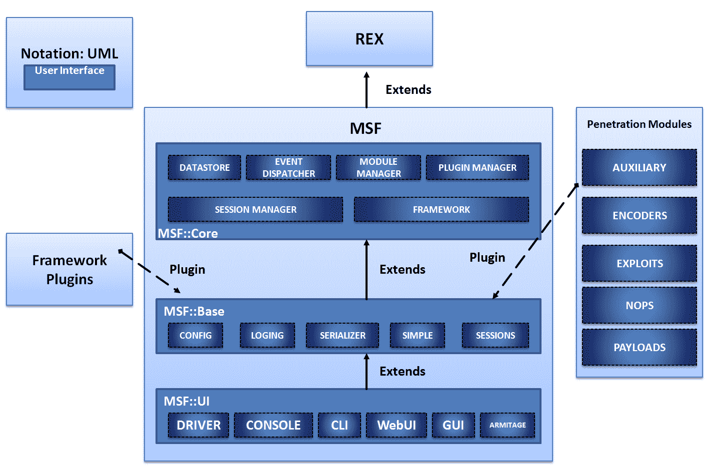
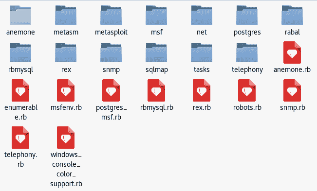
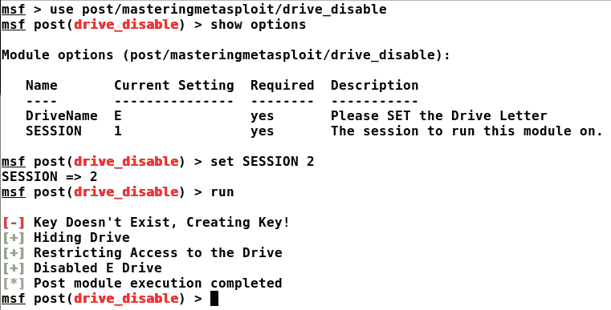
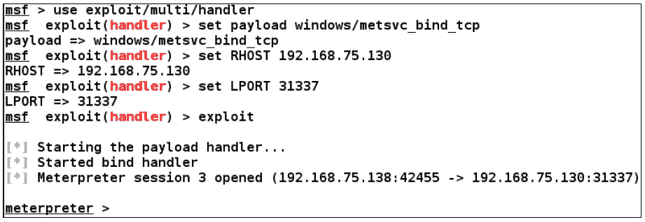
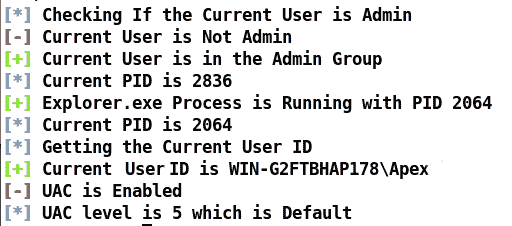

# 第十二章：重新发明 Metasploit

我们已经介绍了 Metasploit 的基础知识，现在我们可以进一步了解 Metasploit 框架的底层编码部分。我们将从 Ruby 编程的基础知识开始，以了解各种语法和语义。本章将使您更容易编写 Metasploit 模块。在本章中，我们将看到如何设计和制作各种具有我们选择功能的 Metasploit 模块。我们还将看看如何创建自定义后渗透模块，这将帮助我们更好地控制被利用的机器。

考虑一个情景，渗透测试范围内的系统数量庞大，我们渴望一个后渗透功能，比如从所有被利用的系统中下载特定文件。手动从每个系统下载特定文件不仅耗时，而且低效。因此，在这种情况下，我们可以创建一个自定义后渗透脚本，它将自动从所有被攻陷的系统中下载文件。

本章以 Metasploit 上下文中的 Ruby 编程的基础知识开始，并以开发各种 Metasploit 模块结束。在本章中，我们将涵盖：

+   在 Metasploit 的上下文中了解 Ruby 编程的基础知识

+   探索 Metasploit 中的模块

+   编写自定义扫描器、暴力破解和后渗透模块

+   编写 Meterpreter 脚本

+   了解 Metasploit 模块的语法和语义

+   使用 DLLs 通过**RailGun**执行不可能的任务

现在，让我们了解 Ruby 编程的基础知识，并收集我们编写 Metasploit 模块所需的必要要素。

在深入编写 Metasploit 模块之前，我们必须了解 Ruby 编程的核心功能，这些功能是设计这些模块所需的。为什么我们需要 Ruby 来开发 Metasploit？以下关键点将帮助我们理解这个问题的答案：

+   构建可重用代码的自动化类是 Ruby 语言的一个特性，符合 Metasploit 的需求

+   Ruby 是一种面向对象的编程风格

+   Ruby 是一种基于解释器的语言，速度快，减少开发时间

# Ruby - Metasploit 的核心

Ruby 确实是 Metasploit 框架的核心。但是，Ruby 到底是什么？根据官方网站，Ruby 是一种简单而强大的编程语言，由松本行弘于 1995 年设计。它进一步被定义为一种动态、反射和通用的面向对象的编程语言，具有类似 Perl 的功能。

您可以从以下网址下载 Windows/Linux 的 Ruby：[`rubyinstaller.org/downloads/`](https://rubyinstaller.org/downloads/)。

您可以在以下网址找到一个学习 Ruby 实践的优秀资源：[`tryruby.org/levels/1/challenges/0`](http://tryruby.org/levels/1/challenges/0)。

# 创建您的第一个 Ruby 程序

Ruby 是一种易于学习的编程语言。现在，让我们从 Ruby 的基础知识开始。请记住，Ruby 是一种广泛的编程语言，覆盖 Ruby 的所有功能将超出本书的范围。因此，我们只会坚持设计 Metasploit 模块所需的基本要素。

# 与 Ruby shell 交互

Ruby 提供了一个交互式 shell，与之一起工作将帮助我们了解基础知识。所以，让我们开始吧。打开 CMD/Terminal 并键入`irb`以启动 Ruby 交互式 shell。

让我们在 Ruby shell 中输入一些内容，看看会发生什么；假设我输入数字`2`，如下所示：

[PRE0]

shell 只是返回值。让我们再输入一些内容，比如带有加法运算符的内容，如下所示：

[PRE1]

我们可以看到，如果我们以表达式的形式输入数字，shell 会返回表达式的结果。

让我们对字符串执行一些功能，例如将字符串的值存储在变量中，如下所示：

[PRE2]

在为变量`a`和`b`分配值之后，让我们看看当我们在控制台上输入`a`和`a+b`时会发生什么：

[PRE3]

我们可以看到当我们输入`a`时，它反映了存储在名为`a`的变量中的值。同样，`a+b`给了我们连接的`a`和`b`。

# 在 shell 中定义方法

方法或函数是一组语句，当我们调用它时将执行。我们可以在 Ruby 的交互式 shell 中轻松声明方法，也可以使用脚本声明方法。在处理 Metasploit 模块时，了解方法是很重要的。让我们看看语法：

[PRE4]

要定义一个方法，我们使用`def`后跟方法名，括号中包含参数和表达式。我们还使用`end`语句，跟随所有表达式以设置方法定义的结束。在这里，`arg`指的是方法接收的参数。此外，`expr`指的是方法接收或计算的表达式。让我们看一个例子：

[PRE5]

我们定义了一个名为`xorops`的方法，它接收名为`a`和`b`的两个参数。此外，我们对接收的参数进行了异或操作，并将结果存储在一个名为`res`的新变量中。最后，我们使用`return`语句返回结果：

[PRE6]

我们可以看到我们的函数通过执行异或操作打印出了正确的值。Ruby 提供了两种不同的函数来打印输出：`puts`和`print`。当涉及到 Metasploit 框架时，主要使用`print_line`函数。然而，可以使用`print_good`、`print_status`和`print_error`语句来表示成功、状态和错误。让我们看一些例子：

[PRE7]

这些`print`方法在与 Metasploit 模块一起使用时，将产生以下输出：绿色的`+`符号表示良好，蓝色的`*`表示状态消息，红色的`-`表示错误：

[PRE8]

我们将在本章的后半部分看到各种`print`语句类型的工作方式。

# Ruby 中的变量和数据类型

变量是一个可以随时更改值的占位符。在 Ruby 中，我们只在需要时声明变量。Ruby 支持许多变量数据类型，但我们只讨论与 Metasploit 相关的类型。让我们看看它们是什么。

# 处理字符串

字符串是表示字符流或序列的对象。在 Ruby 中，我们可以轻松地将字符串值赋给变量，就像在前面的例子中看到的那样。只需在引号或单引号中定义值，我们就可以将值赋给字符串。

建议使用双引号，因为如果使用单引号，可能会出现问题。让我们看看可能出现的问题：

[PRE9]

我们可以看到当我们使用单引号时，它可以正常工作。然而，当我们尝试将`Msf's`替换为值`Msf`时，出现了错误。这是因为它将`Msf's`字符串中的单引号解释为单引号的结束，这并不是事实；这种情况导致了基于语法的错误。

# 连接字符串

在处理 Metasploit 模块时，我们将需要字符串连接功能。我们将有多个实例需要将两个不同的结果连接成一个字符串。我们可以使用`+`运算符执行字符串连接。但是，我们可以使用`<<`运算符向变量附加数据来延长变量：

[PRE10]

我们可以看到，我们首先将值`"Nipun"`赋给变量`a`，然后使用`<<`运算符将`"loves"`和`"Metasploit"`附加到它上。我们可以看到我们使用了另一个变量`b`，并将值`"and plays counter strike"`存储在其中。接下来，我们简单地使用+运算符连接了这两个值，并得到了完整的输出`"Nipun loves Metasploit and plays counter strike"`。

# 子字符串函数

在 Ruby 中找到字符串的子字符串非常容易。我们只需要在字符串中指定起始索引和长度，如下例所示：

[PRE11]

# 拆分函数

我们可以使用`split`函数将字符串的值拆分为变量数组。让我们看一个快速示例来演示这一点：

[PRE12]

我们可以看到，我们已经将字符串的值从`","`位置拆分为一个新数组`b`。现在，包含值`"mastering"`和`"metasploit"`的`"mastering,metasploit"`字符串分别形成数组`b`的第 0 和第 1 个元素。

# Ruby 中的数字和转换

我们可以直接在算术运算中使用数字。但是，在处理用户输入时，记得使用`.to_i`函数将字符串转换为整数。另一方面，我们可以使用`.to_s`函数将整数转换为字符串。

让我们看一些快速示例及其输出：

[PRE13]

我们可以看到，当我们将`a`的值赋给带引号的`b`时，它被视为字符串，并且在执行加法操作时生成了错误。然而，一旦使用`to_i`函数，它将值从字符串转换为整数变量，并且加法操作成功执行。同样，关于字符串，当我们尝试将整数与字符串连接时，会出现错误。但是，在转换后，它可以正常工作。

# Ruby 中的转换

在处理漏洞利用和模块时，我们将需要大量的转换操作。让我们看看我们将在接下来的部分中使用的一些转换：

+   **十六进制转十进制转换**：

+   在 Ruby 中，使用内置的`hex`函数很容易将值从十六进制转换为十进制。让我们来看一个例子：

[PRE14]

+   +   我们可以看到，对于十六进制值`10`，我们得到了值`16`。

+   **十进制转十六进制转换**：

+   前面函数的相反操作可以使用`to_s`函数执行，如下所示：

[PRE15]

# Ruby 中的范围

范围是重要的方面，在 Metasploit 等辅助模块中广泛使用扫描仪和模糊测试器。

让我们定义一个范围，并查看我们可以对这种数据类型执行的各种操作：

[PRE16]

我们可以看到，范围提供了各种操作，如搜索、查找最小和最大值以及显示范围内的所有数据。在这里，`include?`函数检查值是否包含在范围内。此外，`min`和`max`函数显示范围内的最低和最高值。

# Ruby 中的数组

我们可以简单地将数组定义为各种值的列表。让我们看一个例子：

[PRE17]

到目前为止，我们已经涵盖了编写 Metasploit 模块所需的所有变量和数据类型。

有关变量和数据类型的更多信息，请参阅以下链接：[`www.tutorialspoint.com/ruby/index.htm`](https://www.tutorialspoint.com/ruby/index.htm)。

请参考以下链接，了解如何有效使用 Ruby 编程的快速备忘单：[`github.com/savini/cheatsheets/raw/master/ruby/RubyCheat.pdf`](https://github.com/savini/cheatsheets/raw/master/ruby/RubyCheat.pdf)。

从其他编程语言转换到 Ruby？请参考一个有用的指南：[`hyperpolyglot.org/scripting`](http://hyperpolyglot.org/scripting)。

# Ruby 中的方法

方法是函数的另一个名称。与 Ruby 不同背景的程序员可能会互换使用这些术语。方法是执行特定操作的子例程。使用方法实现代码的重用，并显著减少程序的长度。定义方法很容易，它们的定义以`def`关键字开始，并以`end`语句结束。让我们考虑一个简单的程序，以了解它们的工作原理，例如，打印出`50`的平方：

[PRE18]

`print_data`方法接收从主函数发送的参数，将其与自身相乘，并使用`return`语句发送回去。程序将这个返回值保存在一个名为`answer`的变量中，并打印这个值。在本章的后半部分以及接下来的几章中，我们将大量使用方法。

# 决策运算符

决策也是一个简单的概念，与任何其他编程语言一样。让我们看一个例子：

[PRE19]

让我们也考虑字符串数据的情况：

[PRE20]

让我们考虑一个带有决策运算符的简单程序：

[PRE21]

在上面的程序中，我们使用了单词`"Metasploit"`，它位于垃圾数据的中间，并赋值给变量`a`。接下来，我们将这些数据发送到`find_match()`方法，它匹配`/Metasploit/`正则表达式。如果变量`a`包含单词`"Metasploit"`，则返回 true 条件，否则将 false 值赋给变量`bool_b`。

运行上述方法将基于决策运算符`=~`产生一个有效条件，匹配两个值。

在 Windows 环境中执行上述程序的输出将与以下输出类似：

[PRE22]

# Ruby 中的循环

迭代语句被称为循环；与任何其他编程语言一样，Ruby 编程中也存在循环。让我们使用它们，并看看它们的语法与其他语言有何不同：

[PRE23]

上面的代码从`0`到`10`迭代循环，如范围中定义的那样，并打印出值。在这里，我们使用`#{i}`在`print`语句中打印`i`变量的值。`n`关键字指定了一个新行。因此，每次打印一个变量，它都会占据一行新行。

通过`each`循环迭代循环也是一种常见的做法，在 Metasploit 模块中被广泛使用。让我们看一个例子：

[PRE24]

在上面的代码中，我们定义了一个接受数组`a`的方法，并使用`each`循环打印出所有的元素。使用`each`方法进行循环将把`a`数组的元素临时存储在`i`中，直到在下一个循环中被覆盖。`t`在`print`语句中表示一个制表符。

更多关于循环的信息，请参考[`www.tutorialspoint.com/ruby/ruby_loops.htm`](http://www.tutorialspoint.com/ruby/ruby_loops.htm)。

# 正则表达式

正则表达式用于匹配字符串或在给定一组字符串或句子中的出现次数。当涉及到 Metasploit 时，正则表达式的概念至关重要。我们在大多数情况下使用正则表达式，比如编写模糊测试器、扫描器、分析给定端口的响应等。

让我们看一个演示正则表达式用法的程序的例子。

考虑一个情景，我们有一个变量`n`，值为`Hello world`，我们需要为它设计正则表达式。让我们看一下以下代码片段：

[PRE25]

我们创建了另一个名为`r`的变量，并将我们的正则表达式存储在其中，即`/world/`。在下一行，我们使用`MatchData`类的`match`对象将正则表达式与字符串进行匹配。Shell 响应了一条消息，`MatchData "world"`，表示成功匹配。接下来，我们将使用另一种方法来使用`=~`运算符匹配字符串的方式，它返回匹配的确切位置。让我们看另一个做法：

[PRE26]

让我们给`r`赋一个新值，即`/^world/`；这里，`^`运算符告诉解释器从开头匹配字符串。如果没有匹配，我们得到`nil`作为输出。我们修改这个表达式以从单词`Hello`开始；这次，它给我们返回位置`0`，表示匹配从最开始开始。接下来，我们将正则表达式修改为`/world$/`，表示我们需要从结尾匹配单词`world`，以便进行成功匹配。

有关 Ruby 正则表达式的更多信息，请参阅：[`www.tutorialspoint.com/ruby/ruby_regular_expressions.htm`](http://www.tutorialspoint.com/ruby/ruby_regular_expressions.htm)。

请参考以下链接，了解如何有效使用 Ruby 编程的快速备忘单：[`github.com/savini/cheatsheets/raw/master/ruby/RubyCheat.pdf`](https://github.com/savini/cheatsheets/raw/master/ruby/RubyCheat.pdf) 和 [`hyperpolyglot.org/scripting`](http://hyperpolyglot.org/scripting)。

有关构建正确的正则表达式，请参考 [`rubular.com/`](http://rubular.com/)。

# 用 Ruby 基础知识结束

你好！还醒着吗？这是一次累人的会话，对吧？我们刚刚介绍了设计 Metasploit 模块所需的 Ruby 基本功能。Ruby 非常广泛，不可能在这里涵盖所有方面。但是，请参考以下链接中关于 Ruby 编程的一些优秀资源：

+   Ruby 教程的优秀资源可在以下链接找到：[`tutorialspoint.com/ruby/`](http://tutorialspoint.com/ruby/)

+   使用 Ruby 编程的快速备忘单可以在以下链接找到：

+   [`github.com/savini/cheatsheets/raw/master/ruby/RubyCheat.pdf`](https://github.com/savini/cheatsheets/raw/master/ruby/RubyCheat.pdf)

+   [`hyperpolyglot.org/scripting`](http://hyperpolyglot.org/scripting)

+   有关 Ruby 的更多信息，请访问：[`en.wikibooks.org/wiki/Ruby_Programming`](http://en.wikibooks.org/wiki/Ruby_Programming)

# 开发自定义模块

让我们深入了解编写模块的过程。Metasploit 有各种模块，如有效载荷、编码器、利用、NOP 生成器和辅助程序。在本节中，我们将介绍开发模块的基本知识；然后，我们将看看如何创建自定义模块。

我们将讨论辅助和后利用模块的开发。此外，我们将在下一章中介绍核心利用模块。但是，在本章中，让我们详细讨论模块构建的基本要点。

# 在脑袋里建立一个模块

在深入构建模块之前，让我们了解 Metasploit 框架中组件的排列方式以及它们的作用。

# Metasploit 框架的架构

Metasploit 包含各种组件，如必要的库、模块、插件和工具。Metasploit 结构的图形视图如下：

让我们看看这些组件是什么，它们是如何工作的。最好从作为 Metasploit 核心的库开始。我们可以在下表中看到核心库：

| **库名称** | **用法** |
| --- | --- |
| `REX` | 处理几乎所有核心功能，如设置套接字、连接、格式化和所有其他原始功能 |
| `MSF CORE` | 提供了描述框架的底层 API 和实际核心 |
| `MSF BASE` | 为模块提供友好的 API 支持 |

在 Metasploit 中有许多类型的模块，它们在功能上有所不同。我们有用于创建对被利用系统的访问通道的有效载荷模块。我们有辅助模块来执行操作，如信息收集、指纹识别、模糊化应用程序和登录到各种服务。让我们看一下这些模块的基本功能，如下表所示：

| **模块类型** | **用法** |
| --- | --- |
| 有效载荷 | 有效载荷用于在利用系统后执行操作，如连接到或从目标系统，或执行特定任务，如安装服务等。在成功利用系统后，有效载荷执行是下一步。在上一章中广泛使用的 Meterpreter shell 是典型的 Metasploit 有效载荷。 |
| 辅助 | 执行特定任务的模块，如信息收集、数据库指纹识别、端口扫描和目标网络上的横幅抓取的辅助模块。 |
| 编码器 | 编码器用于对载荷和攻击向量进行编码，以逃避杀毒软件或防火墙的检测。 |
| NOPs | NOP 生成器用于对齐，从而使利用稳定。 |
| 利用 | 触发漏洞的实际代码。 |

# 了解文件结构

Metasploit 的文件结构按照以下图示的方案布置：

我们将通过以下表格介绍最相关的目录，这将帮助我们构建 Metasploit 模块：

| **目录** | **用途** |
| --- | --- |
| `lib` | Metasploit 的核心；它包含了所有必要的库文件，帮助我们构建 MSF 模块。 |
| `模块` | 所有的 Metasploit 模块都包含在这个目录中；从扫描器到后渗透模块，Metasploit 项目中集成的每个模块都可以在这个目录中找到。 |
| `工具` | 包含在这个文件夹中的命令行实用程序有助于渗透测试；从创建垃圾模式到查找成功利用编写的 JMP ESP 地址，所有必要的命令行实用程序都在这里。 |
| `插件` | 所有扩展 Metasploit 功能的插件都存储在这个目录中。标准插件包括 OpenVAS、Nexpose、Nessus 等，可以使用`load`命令加载到框架中。 |
| `脚本` | 这个目录包含 Meterpreter 和其他各种脚本。 |

# 库布局

Metasploit 模块是由不同库中包含的各种功能以及一般的 Ruby 编程构建而成。现在，要使用这些功能，我们首先需要了解它们是什么。我们如何触发这些功能？我们需要传递多少个参数？此外，这些功能会返回什么？

让我们来看看这些库是如何组织的；如下截图所示：

正如我们在前面的截图中所看到的，我们在`/lib`目录中有关键的`rex`库以及所有其他必要的库。

`/base`和`/core`库也是一组关键的库，位于`/msf`目录下：

现在，在`/msf/core`库文件夹下，我们有所有在第一章中使用的模块的库；如下截图所示：

这些库文件为所有模块提供了核心。然而，对于不同的操作和功能，我们可以参考任何我们想要的库。在大多数 Metasploit 模块中使用的一些最常用的库文件位于`core/exploits/`目录中，如下截图所示：

正如我们所看到的，很容易在`core/`目录中找到各种类型模块的相关库。目前，我们在`/lib`目录中有用于利用、载荷、后渗透、编码器和其他各种模块的核心库。

访问 Metasploit Git 存储库[`github.com/rapid7/metasploit-framework`](https://github.com/rapid7/metasploit-framework)以访问完整的源代码。

# 了解现有模块

开始编写模块的最佳方法是深入研究现有的 Metasploit 模块，了解它们内部是如何工作的。

# Metasploit 模块的格式

Metasploit 模块的骨架相当简单。我们可以在这里显示的代码中看到通用的头部部分：

[PRE27]

一个模块通过使用`require`关键字包含必要的库开始，前面的代码中跟随着`msf/core`库。因此，它包括了来自`/msf`目录的核心库。

下一个重要的事情是定义类类型，以指定我们要创建的模块的类型。我们可以看到我们已经为同样的目的设置了`MSF::Auxiliary`。

在`initialize`方法中，这是 Ruby 中的默认构造函数，我们定义了`Name`，`Description`，`Author`，`License`，`CVE`等详细信息。此方法涵盖了特定模块的所有相关信息：`Name`通常包含被定位的软件名称；`Description`包含有关漏洞解释的摘录；`Author`是开发模块的人的名字；`License`是`MSF_LICENSE`，如前面列出的代码示例中所述。辅助模块的主要方法是`run`方法。因此，除非您有大量其他方法，否则所有操作都应在其中执行。但是，执行仍将从`run`方法开始。

# 分解现有的 HTTP 服务器扫描器模块

让我们使用一个简单的 HTTP 版本扫描器模块，并看看它是如何工作的。这个 Metasploit 模块的路径是：`/modules/auxiliary/scanner/http/http_version.rb`。

让我们系统地检查这个模块：

[PRE28]

让我们讨论这里的安排方式。以`#`符号开头的版权行是注释，包含在所有 Metasploit 模块中。`require 'rex/proto/http'`语句要求解释器包含来自`rex`库的所有 HTTP 协议方法的路径。因此，来自`/lib/rex/proto/http`目录的所有文件的路径现在对模块可用，如下面的屏幕截图所示：

所有这些文件都包含各种 HTTP 方法，包括建立连接、`GET`和`POST`请求、响应处理等功能。

在下一行，`Msf::Auxiliary`将代码定义为辅助类型模块。让我们继续看代码，如下所示：

[PRE29]

前面的部分包括所有包含在模块中使用的方法的必要库文件。让我们列出这些包含的库的路径，如下所示：

| **包含语句** | **路径** | **用法** |
| --- | --- | --- |
| `Msf::Exploit::Remote::HttpClient` | `/lib/msf/core/exploit/http/client.rb` | 此库文件将提供各种方法，如连接到目标，发送请求，断开客户端等。 |
| `Msf::Auxiliary::WmapScanServer` | `/lib/msf/core/auxiliary/wmapmodule.rb` | 你可能想知道，WMAP 是什么？WMAP 是 Metasploit 框架的基于 Web 应用程序的漏洞扫描器附加组件，它利用 Metasploit 进行 Web 测试。 |
| `Msf::Auxiliary::Scanner` | `/lib/msf/core/auxiliary/scanner.rb` | 此文件包含基于扫描器的模块的各种功能。该文件支持各种方法，如运行模块，初始化和扫描进度等。 |

让我们看一下代码的下一部分：

[PRE30]

这部分模块定义了`initialize`方法，该方法初始化了此模块的基本参数，如`Name`，`Author`，`Description`和`License`，并初始化了 WMAP 参数。现在，让我们看一下代码的最后一部分：

[PRE31]

这里的函数是扫描器的核心。

# 库和函数

让我们看一下在这个模块中使用的一些库的一些基本方法，如下所示：

| **函数** | **库文件** | **用法** |
| --- | --- | --- |
| `run_host` | `/lib/msf/core/auxiliary/scanner.rb` | 这是每个主机运行一次的主要方法 |
| `connect` | `/lib/msf/core/auxiliary/scanner.rb` | 这用于与目标主机建立连接 |
| `send_raw_request` | `/core/exploit/http/client.rb` | 此方法用于向目标发出原始的 HTTP 请求 |
| `request_raw` | `/rex/proto/http/client.rb` | `send_raw_request`传递数据到的库方法 |
| `http_fingerprint` | `/lib/msf/core/exploit/http/client.rb` | 将 HTTP 响应解析为可用变量 |
| `report_service` | `/lib/msf/core/auxiliary/report.rb` | 此方法用于报告和存储在目标主机上找到的服务到数据库中 |

现在让我们了解一下这个模块。这里，我们有一个名为`run_host`的方法，以 IP 作为参数来建立与所需主机的连接。`run_host`方法是从`/lib/msf/core/auxiliary/scanner.rb`库文件中引用的。这个方法将为每个主机运行一次，如下面的截图所示：

接下来，我们有`begin`关键字，表示代码块的开始。在下一条语句中，我们有`connect`方法，它建立与服务器的 HTTP 连接，如前面的表中所讨论的。

接下来，我们定义一个名为`res`的变量，它将存储响应。我们将使用`/core/exploit/http/client.rb`文件中的`send_raw_request`方法，参数为`URI`为`/`，请求的`method`为`GET`：

上述方法将帮助您连接到服务器，创建请求，发送请求并读取响应。我们将响应保存在`res`变量中。

这个方法将所有参数传递给`/rex/proto/http/client.rb`文件中的`request_raw`方法，这里检查了所有这些参数。我们有很多可以在参数列表中设置的参数。让我们看看它们是什么：

`res`是一个存储结果的变量。在下一条语句中，从`/lib/msf/core/exploit/http/client.rb`文件中使用`http_fingerprint`方法来分析`fp`变量中的数据。这个方法将记录和过滤诸如`Set-cookie`、`Powered-by`和其他这样的头信息。这个方法需要一个 HTTP 响应数据包来进行计算。因此，我们将提供`:response` `=> res`作为参数，表示应该对之前使用`res`生成的请求接收到的数据进行指纹识别。然而，如果没有给出这个参数，它将重新做一切，并再次从源获取数据。下一条语句在`fp`变量被设置时打印出一个类型良好的信息消息，其中包括 IP、端口和服务名称的详细信息。`report_service`方法只是将信息存储到数据库中。它将保存目标的 IP 地址、端口号、服务类型（基于服务的 HTTP 或 HTTPS）和服务信息。最后一行`rescue ::Timeout::Error, ::Errno::EPIPE`将处理模块超时的异常。

现在，让我们运行这个模块，看看输出是什么：

到目前为止，我们已经看到了模块是如何工作的。我们可以看到，在成功对应用程序进行指纹识别后，信息被发布在控制台上并保存在数据库中。此外，在超时时，模块不会崩溃，并且处理得很好。让我们再进一步，尝试编写我们自定义的模块。

# 编写一个自定义的 FTP 扫描器模块

让我们尝试构建一个简单的模块。我们将编写一个简单的 FTP 指纹模块，看看事情是如何工作的。让我们来检查 FTP 模块的代码：

[PRE32]

我们通过定义我们要构建的 Metasploit 模块的类型来开始我们的代码。在这种情况下，我们正在编写一个辅助模块，它与我们之前工作过的模块非常相似。接下来，我们定义了需要从核心库集中包含的库文件，如下所示：

| **包含语句** | **路径** | **用法** |
| --- | --- | --- |
| Msf::Exploit::Remote::Ftp | `/lib/msf/core/exploit/ftp.rb` | 该库文件包含了所有与 FTP 相关的必要方法，如建立连接、登录 FTP 服务、发送 FTP 命令等方法。 |
| Msf::Auxiliary::Scanner | `/lib/msf/core/auxiliary/scanner.rb` | 该文件包含了所有基于扫描仪的模块的各种功能。该文件支持各种方法，如运行模块、初始化和扫描进度。 |
| Msf::Auxiliary::Report | `/lib/msf/core/auxiliary/report.rb` | 该文件包含了所有各种报告功能，帮助将运行模块的数据存储到数据库中。 |

我们在`initialize`方法中定义模块的信息，如名称、描述、作者名称和许可证等属性。我们还定义了模块工作所需的选项。例如，在这里，我们将`RPORT`分配给端口`21`，这是 FTP 的默认端口。让我们继续处理模块的其余部分：

[PRE33]

# 库和函数

让我们看看在这个模块中使用的一些重要函数的库，如下所示：

| **函数** | **库文件** | **用法** |
| --- | --- | --- |
| `run_host` | `/lib/msf/core/auxiliary/scanner.rb` | 每个主机运行一次的主要方法。 |
| `connect` | `/lib/msf/core/exploit/ftp.rb` | 该函数负责初始化与主机的连接，并自动抓取横幅并将其存储在横幅变量中。 |
| `report_service` | `/lib/msf/core/auxiliary/report.rb` | 该方法专门用于将服务及其相关详细信息添加到数据库中。 |

我们定义了`run_host`方法，作为主要方法。`connect`函数将负责初始化与主机的连接。然而，我们向`connect`函数提供了两个参数，分别是`true`和`false`。`true`参数定义了使用全局参数，而`false`关闭了模块的冗长功能。`connect`函数的美妙之处在于它连接到目标并自动记录 FTP 服务的横幅在名为`banner`的参数中，如下截图所示：

现在，我们知道结果存储在`banner`属性中。因此，我们只需在最后打印出横幅。接下来，我们使用`report_service`函数，以便将扫描数据保存到数据库中以供以后使用或进行高级报告。该方法位于辅助库部分的`report.rb`文件中。`report_service`的代码看起来类似于以下截图：

我们可以看到，`report_service`方法提供的参数通过另一个名为`framework.db.report_service`的方法传递到数据库中，该方法位于`/lib/msf/core/db_manager/service.rb`中。完成所有必要操作后，我们只需断开与目标的连接。

这是一个简单的模块，我建议您尝试构建简单的扫描程序和其他类似的模块。

# 使用 msftidy

然而，在运行此模块之前，让我们检查我们刚刚构建的模块是否在语法上是正确的。我们可以通过使用内置的 Metasploit 工具`msftidy`来实现这一点，如下截图所示：

我们将收到一个警告消息，指示第 20 行末尾有一些额外的空格。当我们删除额外的空格并重新运行`msftidy`时，我们将看到没有生成错误，这意味着模块的语法是正确的。

现在，让我们运行这个模块，看看我们收集到了什么：

我们可以看到模块成功运行，并且它具有在端口`21`上运行的服务的横幅，即`220-FileZilla Server 0.9.60 beta`。在前一个模块中，`report_service`函数将数据存储到服务部分，可以通过运行`services`命令来查看，如前面的截图所示。

有关 Metasploit 项目中模块的接受标准，可参考：[`github.com/rapid7/metasploit-framework/wiki/Guidelines-for-Accepting-Modules-and-Enhancements`](https://github.com/rapid7/metasploit-framework/wiki/Guidelines-for-Accepting-Modules-and-Enhancements)。

# 编写一个自定义的 SSH 身份验证暴力攻击。

检查弱登录凭据，我们需要执行身份验证暴力攻击。这些测试的议程不仅是为了测试应用程序是否容易受到弱凭据的攻击，还要确保适当的授权和访问控制。这些测试确保攻击者不能简单地通过尝试非穷尽的暴力攻击来绕过安全范式，并且在一定数量的随机猜测后被锁定。

设计 SSH 服务的下一个身份验证测试模块，我们将看看在 Metasploit 中设计基于身份验证的检查有多容易，并执行攻击身份验证的测试。现在让我们跳入编码部分并开始设计一个模块，如下所示：

[PRE34]

在前面的示例中，我们已经看到了使用`Msf::Auxiliary::Scanner`和`Msf::Auxiliary::Report`的重要性。让我们看看其他包含的库并通过下表了解它们的用法：

| **包含语句** | **路径** | **用法** |
| --- | --- | --- |
| `Msf::Auxiliary::AuthBrute` | `/lib/msf/core/auxiliary/auth_brute.rb` | 提供必要的暴力攻击机制和功能，比如提供使用单个用户名和密码、单词列表和空密码的选项。 |

在前面的代码中，我们还包括了两个文件，分别是`metasploit/framework/login_scanner/ssh`和`metasploit/framework/credential_collection`。`metasploit/framework/login_scanner/ssh`文件包括了 SSH 登录扫描器库，它消除了所有手动操作，并提供了 SSH 扫描的底层 API。`metasploit/framework/credential_collection`文件帮助根据`datastore`中用户输入创建多个凭据。接下来，我们只需定义我们正在构建的模块的类型。

在`initialize`部分，我们为这个模块定义了基本信息。让我们看看下一部分：

[PRE35]

我们可以看到在前面的代码中有两个对象，分别是`cred_collection`和`scanner`。这里需要注意的一个重要点是，我们不需要任何手动登录 SSH 服务的方法，因为登录扫描器会为我们完成一切。因此，`cred_collection`只是根据模块上设置的`datastore`选项生成凭据集。`CredentialCollection`类的美妙之处在于它可以一次性接受单个用户名/密码组合、单词列表和空凭据，或者它们中的一个。

所有登录扫描器模块都需要凭据对象来进行登录尝试。在前面的代码中定义的`scanner`对象初始化了一个 SSH 类的对象。这个对象存储了目标的地址、端口、由`CredentialCollection`类生成的凭据，以及其他数据，比如代理信息、`stop_on_success`，它将在成功的凭据匹配时停止扫描，暴力攻击速度和尝试超时的值。

到目前为止，在模块中我们已经创建了两个对象；`cred_collection`将根据用户输入生成凭据，而`scanner`对象将使用这些凭据来扫描目标。接下来，我们需要定义一个机制，使得来自单词列表的所有凭据都被定义为单个参数，并针对目标进行测试。

我们已经在之前的示例中看到了`run_host`的用法。让我们看看在这个模块中我们将使用哪些来自各种库的其他重要函数：

| **函数** | **库文件** | **用法** |
| --- | --- | --- |
| `create_credential()` | `/lib/msf/core/auxiliary/report.rb` | 从结果对象中产生凭据数据。 |
| `create_credential_login()` | `/lib/msf/core/auxiliary/report.rb` | 从结果对象中创建登录凭据，可用于登录到特定服务。 |
| `invalidate_login` | `/lib/msf/core/auxiliary/report.rb` | 标记一组凭据为特定服务的无效。 |

让我们看看我们如何实现这一点：

[PRE36]

可以观察到我们使用`.scan`来初始化扫描，这将自行执行所有的登录尝试，这意味着我们不需要明确指定任何其他机制。`.scan`指令就像 Ruby 中的`each`循环一样。

在下一个语句中，结果被保存在`result`对象中，并使用`to_h`方法分配给`credential_data`变量，该方法将数据转换为哈希格式。在下一行中，我们将模块名称和工作区 ID 合并到`credential_data`变量中。接下来，我们使用`.success`变量对`result`对象进行 if-else 检查，该变量表示成功登录到目标。如果`result.success?`变量返回 true，我们将凭据标记为成功的登录尝试并将其存储在数据库中。但是，如果条件不满足，我们将`credential_data`变量传递给`invalidate_login`方法，表示登录失败。 

建议通过`msftidy`进行一致性检查后再运行本章和后续章节中的所有模块。让我们尝试运行该模块，如下所示：

我们可以看到我们能够使用`claire`和`18101988`作为用户名和密码登录。让我们看看我们是否能够使用`creds`命令将凭据记录到数据库中：

我们可以看到我们已经将详细信息记录到数据库中，并且可以用于进行高级攻击或报告。

# 重新表达方程

如果您在之前列出的模块上工作后感到困惑，让我们逐步了解模块：

1.  我们创建了一个`CredentialCollection`对象，它接受任何用户作为输入并产生凭据，这意味着如果我们将`USERNAME`作为 root 和`PASSWORD`作为 root，它将作为单个凭据产生。但是，如果我们使用`USER_FILE`和`PASS_FILE`作为字典，那么它将从字典文件中获取每个用户名和密码，并分别为文件中的每个用户名和密码组合生成凭据。

1.  我们为 SSH 创建了一个`scanner`对象，它将消除任何手动命令使用，并将简单地检查我们提供的所有组合。

1.  我们使用`.scan`方法运行了我们的`scanner`，它将在目标上初始化暴力破解的身份验证。

1.  `.scan`方法将依次扫描所有凭据，并根据结果，将其存储到数据库中并使用`print_good`显示，否则将使用`print_status`显示而不保存。

# 编写一个驱动禁用后渗透模块

现在我们已经看到了模块构建的基础知识，我们可以进一步尝试构建一个后渗透模块。这里需要记住的一点是，只有在成功攻击目标后才能运行后渗透模块。

因此，让我们从一个简单的驱动禁用模块开始，该模块将禁用目标系统上选择的驱动器，该系统是 Windows 7 操作系统。让我们看看模块的代码，如下所示：

[PRE37]

我们以与之前模块相同的方式开始。我们添加了所有需要的库的路径，以便在这个后渗透模块中使用。让我们看看下表中的任何新的包含和它们的用法：

| **包含语句** | **路径** | **用法** |
| --- | --- | --- |
| `Msf::Post::Windows::Registry` | `lib/msf/core/post/windows/registry.rb` | 这个库将使我们能够使用 Ruby Mixins 轻松地进行注册表操作函数。 |

接下来，我们将模块的类型定义为`Post`，用于后渗透。在继续代码时，我们在`initialize`方法中描述了模块的必要信息。我们可以始终定义`register_options`来定义我们的自定义选项以与模块一起使用。在这里，我们使用`OptString.new`将`DriveName`描述为字符串数据类型。定义新选项需要两个参数，即`required`和`description`。我们将`required`的值设置为`true`，因为我们需要一个驱动器号来启动隐藏和禁用过程。因此，将其设置为`true`将不允许模块运行，除非为其分配一个值。接下来，我们定义了新添加的`DriveName`选项的描述。

在继续代码的下一部分之前，让我们看看在这个模块中我们将要使用的重要函数是什么：

| **函数** | **库文件** | **用法** |
| --- | --- | --- |
| `meterpreter_registry_key_exist` | `lib/msf/core/post/windows/registry.rb` | 检查注册表中是否存在特定的键 |
| `registry_createkey` | `lib/msf/core/post/windows/registry.rb` | 创建一个新的注册表键 |
| `meterpreter_registry_setvaldata` | `lib/msf/core/post/windows/registry.rb` | 创建一个新的注册表值 |

让我们看看模块的剩余部分：

[PRE38]

通常我们使用`run`方法来运行后渗透模块。因此，在定义`run`时，我们将`DriveName`变量发送到`drive_string`方法，以获取驱动器的数值。

我们创建了一个名为`key1`的变量，并将注册表的路径存储在其中。我们将使用`meterpreter_registry_key_exist`来检查系统中是否已经存在该键。

如果键存在，则将`exists`变量的值分配为`true`或`false`。如果`exists`变量的值为`false`，我们使用`registry_createkey(key1)`创建键，然后继续创建值。但是，如果条件为真，我们只需创建值。

为了隐藏驱动器并限制访问，我们需要创建两个注册表值，即`NoDrives`和`NoViewOnDrive`，其值为十进制或十六进制的驱动器号，类型为`DWORD`。

我们可以使用`meterpreter_registry_setvaldata`来实现这一点，因为我们正在使用 meterpreter shell。我们需要向`meterpreter_registry_setvaldata`函数提供五个参数，以确保其正常运行。这些参数是键路径（字符串）、注册表值的名称（字符串）、驱动器号的十进制值（字符串）、注册表值的类型（字符串）和视图（整数值），对于本机视图为 0，32 位视图为 1，64 位视图为 2。

`meterpreter_registry_setvaldata`的示例可以分解如下：

[PRE39]

在前面的代码中，我们将路径设置为`key1`，将值设置为`NoViewOnDrives`，将驱动器`D`的十进制值设置为 16，将注册表的类型设置为`REG_DWORD`，并将视图设置为`REGISTRY_VIEW_NATIVE`，即 0。

对于 32 位注册表访问，我们需要将 1 作为视图参数提供，对于 64 位，我们需要提供 2。但是，这可以使用`REGISTRY_VIEW_32_BIT`和`REGISTRY_VIEW_64_BIT`来完成。

你可能想知道我们是如何知道对于驱动器`E`，我们需要将位掩码的值设置为`16`？让我们看看在下一节中如何计算位掩码。

要计算特定驱动器的位掩码，我们有公式`2^([驱动器字符序号]-1)`。假设我们需要禁用驱动器`E`；我们知道字符 E 是字母表中的第五个字符。因此，我们可以计算禁用驱动器`E`的确切位掩码值，如下所示：

*2^ (5-1) = 2⁴= 16*

位掩码值为`16`用于禁用`E`驱动器。然而，在前面的模块中，我们在`drive_string`方法中使用`case`开关硬编码了一些值。让我们看看我们是如何做到的：

[PRE40]

我们可以看到，前面的方法接受一个驱动器字母作为参数，并将其对应的数字返回给调用函数。让我们看看目标系统上有多少个驱动器：

我们可以看到我们有两个驱动器，驱动器`C`和驱动器`E`。让我们也检查一下我们将在其中写入新键的注册表条目：

我们可以看到我们还没有一个 explorer 键。让我们运行模块，如下所示：

我们可以看到该键不存在，并且根据我们模块的执行，它应该已经在注册表中写入了键。让我们再次检查注册表：

我们可以看到我们有现有的键。注销并重新登录系统后，驱动器`E`应该已经消失了。让我们检查一下：

没有`E`驱动器的迹象。因此，我们成功地从用户视图中禁用了`E`驱动器，并限制了对其的访问。

根据我们的需求，我们可以创建尽可能多的后渗透模块。我建议您花一些额外的时间来了解 Metasploit 的库。

确保您对上述脚本具有`SYSTEM`级别访问权限，因为`SYSTEM`特权不会在当前用户下创建注册表，而是会在本地计算机上创建注册表。除此之外，我们使用了`HKLM`而不是写`HKEY_LOCAL_MACHINE`，因为内置的规范化将自动创建键的完整形式。我建议您检查`registry.rb`文件以查看各种可用的方法。

如果您没有系统权限，请尝试使用`exploit/windows/local/bypassuac`模块并切换到提升的 shell，然后尝试上述模块。

# 编写凭证收集后渗透模块

在这个示例模块中，我们将攻击 Foxmail 6.5。我们将尝试解密凭据并将其存储在数据库中。让我们看看代码：

[PRE41]

就像我们在前面的模块中看到的那样；我们首先包括所有必需的库，并提供有关模块的基本信息。

我们已经看到了`Msf::Post::Windows::Registry`和`Msf::Auxiliary::Report`的用法。让我们看看我们在此模块中包含的新库的详细信息，如下所示：

| **包含语句** | **路径** | **用法** |
| --- | --- | --- |
| `Msf::Post::Windows::UserProfiles` | `lib/msf/core/post/windows/user_profiles.rb` | 此库将提供 Windows 系统上的所有配置文件，包括查找重要目录、路径等。 |
| `Msf::Post::File` | `lib/msf/core/post/file.rb` | 此库将提供函数，将帮助文件操作，如读取文件、检查目录、列出目录、写入文件等。 |

在了解模块的下一部分之前，让我们看看我们需要执行哪些操作来收集凭据：

1.  我们将搜索用户配置文件，并找到当前用户的`LocalAppData`目录的确切路径。

1.  我们将使用先前找到的路径，并将其与`\VirtualStore\Program Files (x86)\Tencent\Foxmail\mail`连接起来，以建立到`mail`目录的完整路径。

1.  我们将从 `mail` 目录中列出所有目录，并将它们存储在一个数组中。但是，`mail` 目录中的目录名称将使用各种邮件提供程序的用户名命名约定。例如，`nipunjaswal@rocketmail.com` 将是 `mail` 目录中存在的目录之一。

1.  接下来，我们将在 `mail` 目录下找到帐户目录中的 `Account.stg` 文件。

1.  我们将读取 `Account.stg` 文件，并找到名为 `POP3Password` 的常量的哈希值。

1.  我们将哈希值传递给我们的解密方法，该方法将找到明文密码。

1.  我们将值存储在数据库中。

非常简单！让我们分析代码：

[PRE42]

在开始理解前面的代码之前，让我们看一下其中使用的重要函数，以便更好地了解其用法：

| **函数** | **库文件** | **用法** |
| --- | --- | --- |
| `grab_user_profiles()` | `lib/msf/core/post/windows/user_profiles.rb` | 获取 Windows 平台上重要目录的所有路径 |
| `directory?` | `lib/msf/core/post/file.rb` | 检查目录是否存在 |
| `file?` | `lib/msf/core/post/file.rb` | 检查文件是否存在 |
| `read_file` | `lib/msf/core/post/file.rb` | 读取文件的内容 |
| `store_loot` | `/lib/msf/core/auxiliary/report.rb` | 将收集到的信息存储到文件和数据库中 |

我们可以看到在前面的代码中，我们使用 `grab_user_profiles()` 获取了配置文件，并尝试找到 `LocalAppData` 目录。一旦找到，我们将其存储在一个名为 `full_path` 的变量中。

接下来，我们将路径连接到列出所有帐户的 `mail` 文件夹。我们使用 `directory?` 检查路径是否存在，并在成功时使用正则表达式匹配将包含 `@` 的目录名称复制到 `dir_list` 中。接下来，我们创建另一个名为 `full_path_mail` 的变量，并存储每封电子邮件的 `Account.stg` 文件的确切路径。我们确保使用 `file?` 来检查 `Account.stg` 文件是否存在。成功后，我们读取文件并在换行符处拆分所有内容。我们将拆分的内容存储到 `file_content` 列表中。让我们看代码的下一部分：

[PRE43]

对于 `file_content` 中的每个条目，我们运行了一个检查，以查找常量 `POP3Password`。一旦找到，我们将常量在 `=` 处拆分，并将常量的值存储在一个名为 `hash_value` 的变量中。

接下来，我们直接将 `hash_value` 和 `dir_list`（帐户名）传递给 `decrypt` 函数。成功解密后，明文密码将存储在 `decrypted_pass` 变量中。我们创建另一个名为 `data_entry` 的变量，并将所有凭据附加到其中。我们这样做是因为我们不知道目标上可能配置了多少电子邮件帐户。因此，对于每个结果，凭据都会附加到 `data_entry`。所有操作完成后，我们使用 `store_loot` 方法将 `data_entry` 变量存储在数据库中。我们向 `store_loot` 方法提供了六个参数，分别为收集、内容类型、会话、`data_entry`、文件名和收集的描述。

让我们来了解解密函数，如下所示：

[PRE44]

在前面的方法中，我们收到了两个参数，即哈希密码和用户名。`magic` 变量是解密密钥，存储在一个包含 `~draGon~` 字符串的十进制值的数组中，依次存储。我们将整数 `90` 存储为 `fc0`，稍后我们将详细讨论。

接下来，我们通过将哈希除以 2 并减去 1 来找到哈希的大小。这将是我们新数组 `b` 的大小。

在下一步中，我们将哈希拆分为字节（每两个字符一个），并将其存储到数组 `b` 中。我们对数组 `b` 的第一个字节执行 `XOR`，将其与 `fc0` 执行 `XOR`，从而通过对其执行 `XOR` 操作来更新 `b[0]` 的值为 `90`。这对于 Foxmail 6.5 是固定的。

现在，我们将数组`magic`复制两次到一个新数组`double_magic`中。我们还声明`double_magic`的大小比数组`b`少一个。我们对数组`b`和`double_magic`数组的所有元素执行`XOR`操作，除了数组`b`的第一个元素，我们已经对其执行了 XOR 操作。

我们将 XOR 操作的结果存储在数组`d`中。在下一条指令中，我们将完整的数组`d`从数组`b`中减去。但是，如果特定减法操作的值小于 0，我们将向数组`d`的元素添加 255。

在下一步中，我们只需将结果数组`e`中特定元素的 ASCII 值附加到`decoded`变量中，并将其返回给调用语句。

让我们看看当我们运行这个模块时会发生什么：

很明显，我们轻松解密了存储在 Foxmail 6.5 中的凭据。

# 突破 Meterpreter 脚本

Meterpreter shell 是攻击者希望在目标上拥有的最理想的访问类型。Meterpreter 为攻击者提供了广泛的工具集，可以在受损系统上执行各种任务。Meterpreter 有许多内置脚本，这使得攻击者更容易攻击系统。这些脚本在受损系统上执行繁琐和直接的任务。在本节中，我们将看看这些脚本，它们由什么组成，以及我们如何在 Meterpreter 中利用它们。

基本的 Meterpreter 命令速查表可在以下网址找到：[`www.scadahackr.com/library/Documents/Cheat_Sheets/Hacking%20-%20Meterpreter%20Cheat%20%20Sheet.pdf`](http://www.scadahackr.com/library/Documents/Cheat_Sheets/Hacking%20-%20Meterpreter%20Cheat%20%20Sheet.pdf)。

# Meterpreter 脚本的基本知识

就我们所见，我们在需要在系统上执行一些额外任务时使用了 Meterpreter。然而，现在我们将看一些可能在渗透测试中出现的问题情况，在这些情况下，Meterpreter 中已经存在的脚本似乎对我们没有帮助。在这种情况下，我们很可能希望向 Meterpreter 添加我们自定义的功能，并执行所需的任务。然而，在我们继续向 Meterpreter 添加自定义脚本之前，让我们先执行一些 Meterpreter 的高级功能，并了解其功能。

# 建立持久访问

一旦我们访问了目标机器，我们可以像在上一章中看到的那样转移到内部网络，但是保留辛苦获得的访问权限也是必要的。但是，对于经过批准的渗透测试，这应该只在测试期间是强制性的，并且应该在项目的范围内。Meterpreter 允许我们使用两种不同的方法在目标上安装后门：**MetSVC**和**Persistence**。

我们将在接下来的章节中看到一些高级的持久性技术。因此，在这里我们将讨论 MetSVC 方法。MetSVC 服务被安装在受损系统中作为一个服务。此外，它永久地为攻击者打开一个端口，以便他或她随时连接。

在目标上安装 MetSVC 很容易。让我们看看我们如何做到这一点：

我们可以看到，MetSVC 服务在端口`31337`创建了一个服务，并且还上传了恶意文件。

稍后，每当需要访问此服务时，我们需要使用`metsvc_bind_tcp`有效载荷和一个利用处理程序脚本，这将允许我们再次连接到服务，如下面的屏幕截图所示：

MetSVC 的效果甚至在目标机器重新启动后仍然存在。当我们需要对目标系统进行永久访问时，MetSVC 非常方便，因为它节省了重新利用目标所需的时间。

# API 调用和混合

我们刚刚看到了如何使用 Meterpreter 执行高级任务。这确实使渗透测试人员的生活变得更加轻松。

现在，让我们深入了解 Meterpreter 的工作原理，并揭示 Meterpreter 模块和脚本的基本构建过程。有时，我们可能会用尽 Meterpreter 的功能，并希望自定义功能来执行所有所需的任务。在这种情况下，我们需要构建自己的自定义 Meterpreter 模块，以实现或自动化在利用时所需的各种任务。

让我们首先了解 Meterpreter 脚本的基础知识。使用 Meterpreter 进行编码的基础是**应用程序编程接口**（**API**）调用和混入。这些是使用特定的基于 Windows 的**动态链接库**（**DLL**）执行特定任务所需的，以及使用各种内置的基于 Ruby 的模块执行一些常见任务所需的。

混入是基于 Ruby 编程的类，其中包含来自各种其他类的方法。当我们在目标系统上执行各种任务时，混入非常有帮助。除此之外，混入并不完全属于 IRB，但它们可以帮助轻松编写特定和高级的 Meterpreter 脚本。

有关混入的更多信息，请参阅：[`www.offensive-security.com/metasploit-unleashed/Mixins_and_Plugins`](http://www.offensive-security.com/metasploit-unleashed/Mixins_and_Plugins)。

我建议大家查看`/lib/rex/post/meterpreter`和`/lib/msf/scripts/meterpreter`目录，以查看 Meterpreter 使用的各种库。

API 调用是用于从 Windows DLL 文件中调用特定函数的 Windows 特定调用。我们将在*使用 RailGun*部分很快学习有关 API 调用的知识。

# 制作自定义 Meterpreter 脚本

让我们来编写一个简单的示例 Meterpreter 脚本，它将检查我们是否是管理员用户，然后找到资源管理器进程并自动迁移到其中。

在查看代码之前，让我们看看我们将使用的所有基本方法：

| **函数** | **库文件** | **用法** |
| --- | --- | --- |
| `is_admin` | `/lib/msf/core/post/windows/priv.rb` | 检查会话是否具有管理员权限。 |
| `is_in_admin_group` | `/lib/msf/core/post/windows/priv.rb` | 检查用户是否属于管理员组。 |
| `session.sys.process.get_processes()` | `/lib/rex/post/meterpreter/extensions/stdapi/sys/process.rb` | 列出目标上所有正在运行的进程。 |
| `session.core.migrate()` | `/lib/rex/post/meterpreter/client_core.rb` | 将访问从现有进程迁移到参数中指定的 PID。 |
| `is_uac_enabled?` | `/lib/msf/core/post/windows/priv.rb` | 检查 UAC 是否已启用。 |
| `get_uac_level` | `/lib/msf/core/post/windows/priv.rb` | 获取 UAC 级别：0,2,5 等。0：已禁用，2：全部，5：默认。 |

让我们看看以下代码：

[PRE45]

我们只是检查前面的代码中当前用户是否是管理员。函数`is_admin`返回一个布尔值，基于此我们打印结果：

[PRE46]

在先前的代码中，我们检查用户是否属于管理员组。在逻辑上，前面的代码片段与先前的代码非常相似：

[PRE47]

这里的代码段非常有趣。我们首先使用`session.sys.process.getpid`找到当前进程 ID，然后使用`session.sys.process.get_processes()`上的循环遍历目标系统上的所有进程。如果找到任何名称为`explorer.exe`的进程，我们打印出一条消息并将其 ID 存储到`explorer_ppid`变量中。使用`session.core.migrate()`方法，我们将存储的进程 ID（`explorer.exe`）传递到`explorer.exe`进程中进行迁移。最后，我们只是再次打印当前进程 ID，以确保我们是否成功迁移：

[PRE48]

在先前的代码中，我们只是使用`sessions.sys.config.getuid`方法找到当前用户的标识符：

[PRE49]

前面的代码检查了目标系统上是否启用了 UAC。如果启用了 UAC，我们进一步深入，使用`get_uac_level`方法找到 UAC 的级别，并通过其响应值打印状态。

让我们将这段代码保存在`/scripts/meterpreter/gather.rb`目录中，并从 Meterpreter 中启动此脚本。这将给您一个类似于以下屏幕截图的输出：

我们可以看到，创建 Meterpreter 脚本并执行各种任务和任务自动化是多么容易。我建议您检查模块中包含的所有文件和路径，以便广泛探索 Meterpreter。

根据 Metasploit 的官方维基，您不应再编写 Meterpreter 脚本，而应编写后渗透模块。

# 使用 RailGun

电磁炮听起来像是一种比光还快的枪，射出子弹；然而，事实并非如此。RailGun 允许您调用 Windows API，而无需编译自己的 DLL。

它支持许多 Windows DLL 文件，并为我们在受害者机器上执行系统级任务提供了便利。让我们看看如何使用 RailGun 执行各种任务，并进行一些高级的后渗透。

# 交互式 Ruby shell 基础知识

RailGun 需要将`irb` shell 加载到 Meterpreter 中。让我们看看如何从 Meterpreter 跳转到`irb` shell：

我们可以在前面的屏幕截图中看到，仅仅从 Meterpreter 中键入`irb`就可以让我们进入 Ruby 交互式 shell。我们可以在这里使用 Ruby shell 执行各种任务。

# 了解 RailGun 及其脚本

RailGun 给了我们巨大的力量，可以执行 Metasploit 有时无法执行的任务。使用 RailGun，我们可以向被侵入系统的任何 DLL 文件发出异常调用。

现在，让我们看看如何使用 RailGun 进行基本 API 调用，并了解其工作原理：

[PRE50]

这是 RailGun 中 API 调用的基本结构。`client.railgun`关键字定义了客户端对 RailGun 功能的需求。`DLLname`关键字指定了我们将要调用的 DLL 文件的名称。语法中的`function (parameters)`关键字指定了要使用来自 DLL 文件的所需参数来激发的实际 API 函数。

让我们看一个例子：

此 API 调用的结果如下：

在这里，调用了来自`user32.dll` DLL 文件的`LockWorkStation()`函数，导致了受损系统的锁定。

接下来，让我们看一个带参数的 API 调用：

[PRE51]

当上述命令运行时，它会从客户端的机器中删除特定用户。目前，我们有以下用户：

让我们尝试删除`Nipun`用户名：

让我们检查用户是否已成功删除：

用户似乎已经去钓鱼了。RailGun 调用已成功删除了用户`Nipun`。`nil`值定义了用户在本地机器上。但是，我们也可以使用名称参数来针对远程系统。

# 操纵 Windows API 调用

DLL 文件负责在基于 Windows 的系统上执行大部分任务。因此，了解哪个 DLL 文件包含哪些方法是至关重要的。这与 Metasploit 的库文件非常相似，它们中有各种方法。要研究 Windows API 调用，我们在[`source.winehq.org/WineAPI/`](http://source.winehq.org/WineAPI/)和[`msdn.microsoft.com/en-us/library/windows/desktop/ff818516(v=vs.85).aspx`](http://msdn.microsoft.com/en-us/library/windows/desktop/ff818516(v=vs.85).aspx)上有很好的资源。我建议在继续创建 RailGun 脚本之前，您探索各种 API 调用。

请参考以下路径，了解有关 RailGun 支持的 DLL 文件的更多信息：`/usr/share/metasploit-framework/lib/rex/post/meterpreter/extensions/stdapi/railgun/def`。

# 制作复杂的 RailGun 脚本

更进一步，让我们深入研究使用 RailGun 编写 Meterpreter 扩展的脚本。首先，让我们创建一个脚本，该脚本将向 Metasploit 上下文中添加一个自定义命名的 DLL 文件：

[PRE52]

将代码保存在名为`urlmon.rb`的文件中，放在`/scripts/meterpreter`目录下。

上述脚本向`C:\WINDOWS\system32\urlmon.dll`文件添加了一个引用路径，其中包含所有浏览所需的函数，以及下载特定文件等功能。我们将此引用路径保存为`urlmon`的名称。接下来，我们使用 DLL 文件的名称作为第一个参数，我们将要挂钩的函数的名称作为第二个参数，即`URLDownloadToFileA`，然后是所需的参数，向 DLL 文件添加一个函数。代码的第一行检查 DLL 函数是否已经存在于 DLL 文件中。如果已经存在，脚本将跳过再次添加该函数。如果调用应用程序不是 ActiveX 组件，则将`pcaller`参数设置为`NULL`；如果是，则设置为 COM 对象。`szURL`参数指定要下载的 URL。`szFileName`参数指定从 URL 下载的对象的文件名。`Reserved`始终设置为`NULL`，`lpfnCB`处理下载的状态。但是，如果不需要状态，则应将此值设置为`NULL`。

现在让我们创建另一个脚本，该脚本将利用此功能。我们将创建一个后渗透脚本，该脚本将下载一个免费文件管理器，并将修改 Windows OS 上实用程序管理器的条目。因此，每当调用实用程序管理器时，我们的免费程序将代替运行。

我们在同一目录下创建另一个脚本，并将其命名为`railgun_demo.rb`，如下所示：

[PRE53]

如前所述，脚本的第一行将调用自定义添加的 DLL 函数`URLDownloadToFile`，并提供所需的参数。

接下来，我们在父键`HKLMSOFTWAREMicrosoftWindows NTCurrentVersionImage File Execution Options`下创建一个名为`Utilman.exe`的键。

我们在`utilman.exe`键下创建一个名为`Debugger`的`REG_SZ`类型的注册表值。最后，我们将值`a43.exe`分配给`Debugger`。

让我们从 Meterpreter 运行此脚本，看看情况如何：

一旦我们运行`railgun_demo`脚本，文件管理器将使用`urlmon.dll`文件下载，并放置在`system32`目录中。接下来，创建注册表键，以替换实用程序管理器的默认行为，运行`a43.exe`文件。因此，每当从登录屏幕按下辅助功能按钮时，`a43`文件管理器将显示并作为目标系统上的登录屏幕后门。

让我们看看从登录屏幕按下辅助功能按钮时会发生什么，如下截图所示：

我们可以看到它打开了一个`a43`文件管理器，而不是实用程序管理器。现在我们可以执行各种功能，包括修改注册表、与 CMD 交互等，而无需登录到目标。您可以看到 RailGun 的强大之处，它简化了创建您想要的任何 DLL 文件的路径的过程，并且还允许您向其中添加自定义功能。

有关此 DLL 函数的更多信息，请访问：[`docs.microsoft.com/en-us/previous-versions/windows/internet-explorer/ie-developer/platform-apis/ms775123(v=vs.85)`](https://docs.microsoft.com/en-us/previous-versions/windows/internet-explorer/ie-developer/platform-apis/ms775123(v=vs.85))。

# 摘要和练习

在本章中，我们涵盖了 Metasploit 的编码工作。我们还研究了模块、后渗透脚本、Meterpreter、RailGun 和 Ruby 编程。在本章中，我们看到了如何向 Metasploit 框架添加我们自定义的功能，并使已经强大的框架变得更加强大。我们首先熟悉了 Ruby 的基础知识。我们学习了编写辅助模块、后渗透脚本和 Meterpreter 扩展。我们看到了如何利用 RailGun 添加自定义功能，比如向目标的 DLL 文件添加 DLL 文件和自定义功能。

为了进一步学习，您可以尝试以下练习：

+   为 FTP 创建一个身份验证暴力破解模块

+   为 Windows、Linux 和 macOS 各开发至少三个后渗透模块，这些模块尚不是 Metasploit 的一部分

+   在 RailGun 上工作，并为至少三个不同功能的 Windows DLL 开发自定义模块

在下一章中，我们将在 Metasploit 中的开发和利用模块的背景下进行研究。这是我们将开始编写自定义利用、对各种参数进行模糊测试以进行利用、利用软件，并为软件和网络编写高级利用的地方。
