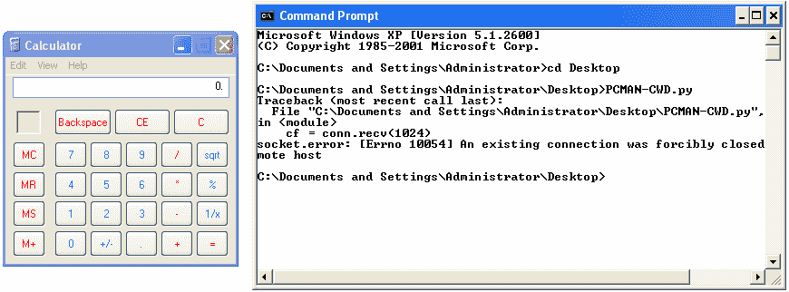
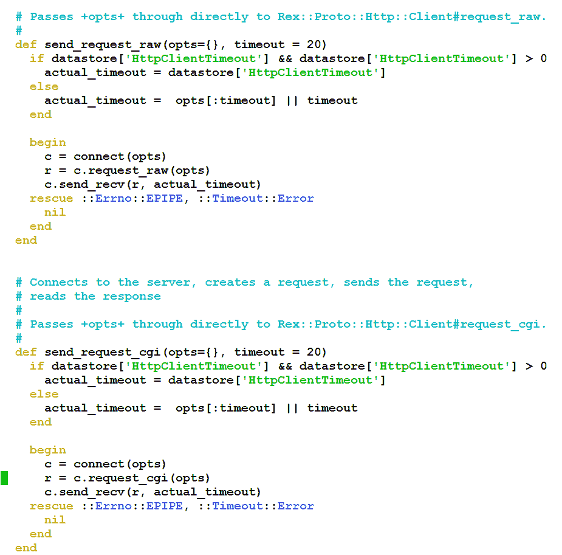
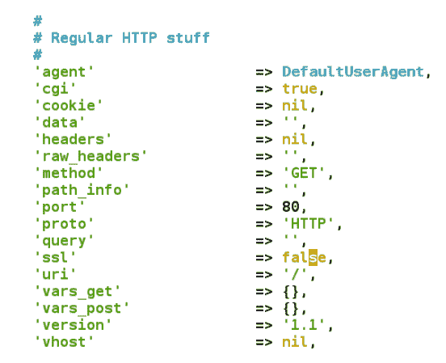
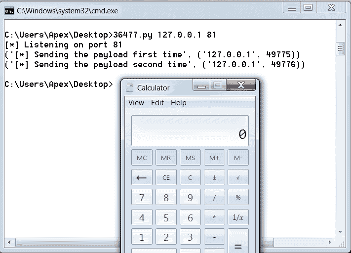
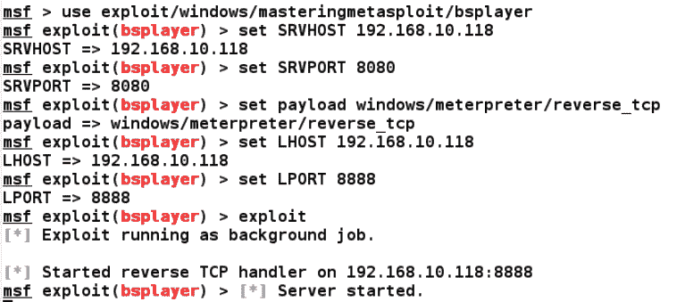
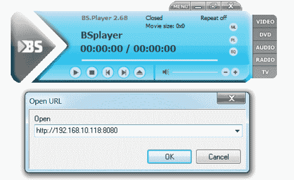

# 第十四章：移植利用

在前一章中，我们讨论了如何在 Metasploit 中编写利用。然而，在已经有公开利用的情况下，我们不需要为特定软件创建利用。公开可用的利用可能是 Perl、Python、C 或其他不同编程语言中的。现在让我们发现一些将利用移植到 Metasploit 框架中的策略。这种机制使我们能够将现有利用转换为与 Metasploit 兼容的利用，从而节省时间并使我们能够随时切换有效载荷。在本章结束时，我们将了解以下主题：

+   从各种编程语言移植利用

+   从独立利用中发现基本要素

+   从现有独立扫描器/工具脚本创建 Metasploit 模块

如果我们能够找出现有利用中哪些基本要素可以在 Metasploit 中使用，那么将脚本移植到 Metasploit 框架中就是一项简单的工作。

将利用移植到 Metasploit 的这一想法通过使独立脚本能够在广泛的网络上运行而不仅仅是单个系统上，从而节省时间。此外，由于每个利用都可以从 Metasploit 中访问，这使得渗透测试更有组织性。让我们了解如何在即将到来的章节中使用 Metasploit 实现可移植性。

# 导入基于堆栈的缓冲区溢出利用

在即将到来的示例中，我们将看到如何将用 Python 编写的利用导入 Metasploit。公开可用的利用可以从以下网址下载：[`www.exploit-db.com/exploits/31255/`](https://www.exploit-db.com/exploits/31255/)。让我们按照以下方式分析利用：

[PRE0]

这个简单的利用通过匿名凭据登录到端口`21`上的 PCMAN FTP 2.0 软件，并使用`CWD`命令利用软件。

前一个利用的整个过程可以分解为以下一系列要点：

1.  将用户名、密码和主机存储在`fuser`、`pass`和`host`变量中。

1.  将`junk`变量分配为`2008`个 A 字符。这里，`2008`是覆盖 EIP 的偏移量。

1.  将 JMP ESP 地址分配给`espaddress`变量。这里，`espaddress 0x71ab9372`是目标返回地址。

1.  在`nops`变量中存储 10 个 NOPs。

1.  将执行计算器的有效载荷存储在`shellcode`变量中。

1.  将`junk`、`espaddress`、`nops`和`shellcode`连接起来，并将它们存储在`sploit`变量中。

1.  使用`s.socket(s.AF_INET,s.SOCK_STREAM)`建立套接字，并使用`connect((host,21))`连接到端口 21 的主机。

1.  使用`USER`和`PASS`提供`fuser`和`fpass`以成功登录到目标。

1.  发出`CWD`命令，然后跟上`sploit`变量。这将导致在偏移量为`2008`处覆盖 EIP，并弹出计算器应用程序。

1.  让我们尝试执行利用并分析结果如下：

原始利用从命令行获取用户名、密码和主机。然而，我们修改了机制，使用了固定的硬编码值。

一旦我们执行了利用，就会出现以下屏幕：

我们可以看到计算器应用程序已经弹出，这表明利用正在正确工作。

# 收集基本要素

让我们找出从前面的利用中需要获取哪些基本值，以便从下表中生成 Metasploit 中等效模块：

| **序列号** | **变量** | **值** |
| --- | --- | --- |
| 1 | 偏移值 | `2008` |
| 2 | 使用 JMP ESP 搜索在可执行模块中找到的目标返回/跳转地址/值 | `0x71AB9372` |
| 3 | 目标端口 | `21` |
| 4 | 用于删除不规则性的前导 NOP 字节到 shellcode 的数量 | `10` |
| 5 | 逻辑 | `CWD`命令后跟着 2008 字节的垃圾数据，然后是 EIP、NOPs 和 shellcode |

我们有构建 Metasploit 模块所需的所有信息。在下一节中，我们将看到 Metasploit 如何辅助 FTP 进程以及在 Metasploit 中创建利用模块有多么容易。

# 生成一个 Metasploit 模块

构建 Metasploit 模块的最佳方法是复制现有的类似模块并对其进行更改。但是，`Mona.py`脚本也可以动态生成特定于 Metasploit 的模块。我们将在本书的后面部分看到如何使用`Mona.py`脚本生成快速利用。

现在让我们看一下 Metasploit 中利用的等效代码：

[PRE1]

在上一章中，我们处理了许多利用模块。这个利用也不例外。我们首先包含了所有必需的库和`/lib/msf/core/exploit`目录中的`ftp.rb`库。接下来，在`initialize`部分中分配了所有必要的信息。从利用中收集必要的信息后，我们将`Ret`分配为返回地址，并将`Offset`设置为`2008`。我们还将`FTPPASS`选项的值声明为`'anonymous'`。让我们看看下一节代码：

[PRE2]

`connect_login`方法将连接到目标并尝试使用我们提供的匿名凭据登录软件。但等等！我们什么时候提供了凭据？模块的`FTPUSER`和`FTPPASS`选项会自动启用，包括 FTP 库。`FTPUSER`的默认值是`anonymous`。但是，对于`FTPPASS`，我们已经在`register_options`中提供了值`anonymous`。

接下来，我们使用`rand_text_alpha`生成`2008`的垃圾数据，使用`Targets`字段中的`Offset`值，并将其存储在`sploit`变量中。我们还使用`pack('V')`函数将`Targets`字段中的`Ret`值以小端格式存储在`sploit`变量中。将`make_nop`函数生成的 NOP 连接到 shellcode 中，我们将其存储到`sploit`变量中。我们的输入数据已经准备好供应。

接下来，我们只需使用 FTP 库中的`send_cmd`函数将`sploit`变量中的数据发送到`CWD`命令的目标。那么，Metasploit 有什么不同之处呢？让我们看看：

+   我们不需要创建垃圾数据，因为`rand_text_aplha`函数已经为我们完成了。

+   我们不需要以小端格式提供`Ret`地址，因为`pack('V')`函数帮助我们转换了它。

+   我们从未需要手动指定 NOP，因为`make_nops`会自动为我们完成。

+   我们不需要提供任何硬编码的 shellcode，因为我们可以在运行时决定和更改有效载荷。这样可以节省时间，消除了对 shellcode 的手动更改。

+   我们简单地利用 FTP 库创建并连接套接字。

+   最重要的是，我们不需要使用手动命令连接和登录，因为 Metasploit 使用单个方法`connect_login`为我们完成了这些。

# 利用 Metasploit 对目标应用程序

我们看到使用 Metasploit 比现有的利用更有益。让我们利用应用程序并分析结果：

我们可以看到`FTPPASS`和`FTPUSER`已经设置为`anonymous`。让我们按照以下方式提供`RHOST`和有效载荷类型来利用目标机器：

我们可以看到我们的利用成功执行。Metasploit 还提供了一些额外的功能，使利用更加智能。我们将在下一节看到这些功能。

# 在 Metasploit 中实现利用的检查方法

在 Metasploit 中，可以在利用易受攻击的应用程序之前检查易受攻击的版本。这非常重要，因为如果目标运行的应用程序版本不易受攻击，可能会导致应用程序崩溃，利用目标的可能性变为零。让我们编写一个示例检查代码，检查我们在上一节中利用的应用程序的版本。

[PRE3]

我们通过调用`connect_login`方法开始`check`方法。这将建立与目标的连接。如果连接成功并且应用程序返回横幅，我们将使用正则表达式将其与受影响的应用程序的横幅进行匹配。如果匹配成功，我们将使用`Exploit::Checkcode::Appears`标记应用程序为易受攻击。但是，如果我们无法进行身份验证但横幅是正确的，我们将返回相同的`Exploit::Checkcode::Appears`值，表示应用程序易受攻击。如果所有这些检查都失败，我们将返回`Exploit::CheckCode::Safe`，标记应用程序为不易受攻击。

通过发出`check`命令，让我们看看应用程序是否易受攻击：

我们可以看到应用程序是易受攻击的。我们可以继续进行利用。

有关实现`check`方法的更多信息，请参阅：[`github.com/rapid7/metasploit-framework/wiki/How-to-write-a-check%28%29-method`](https://github.com/rapid7/metasploit-framework/wiki/How-to-write-a-check%28%29-method)。

# 将基于 Web 的 RCE 导入 Metasploit

在本节中，我们将看看如何将 Web 应用程序漏洞导入 Metasploit。本章的重点将是掌握与不同编程语言中使用的基本功能相当的功能。在本例中，我们将看看 2015 年 12 月 8 日披露的 PHP 实用工具包远程代码执行漏洞。可从以下网址下载受影响的应用程序：[`www.exploit-db.com/apps/222c6e2ed4c86f0646016e43d1947a1f-php-utility-belt-master.zip`](https://www.exploit-db.com/apps/222c6e2ed4c86f0646016e43d1947a1f-php-utility-belt-master.zip)。

远程代码执行漏洞位于`POST`请求的`code`参数中，当使用特制数据操纵时，可能导致服务器端代码的执行。让我们看看如何手动利用这个漏洞：

我们在前面的屏幕截图中使用的命令是`fwrite`，它用于将数据写入文件。我们使用`fwrite`以可写模式打开名为`info.php`的文件。我们向文件中写入`<?php $a = "net user"; echo shell_exec($a);?>`。

当我们的命令运行时，它将创建一个名为`info.php`的新文件，并将 PHP 内容放入该文件。接下来，我们只需要浏览`info.php`文件，就可以看到命令的结果。

让我们按以下方式浏览`info.php`文件：

我们可以看到所有用户帐户都列在`info.php`页面上。要为 PHP 工具包远程代码执行漏洞编写 Metasploit 模块，我们需要向页面发出 GET/POST 请求。我们需要发出一个请求，在该请求中，我们将我们的恶意数据 POST 到易受攻击的服务器上，并可能获得 meterpreter 访问。

# 收集必要的信息

在 Metasploit 中利用基于 Web 的漏洞时，最重要的事情是弄清楚 Web 方法，弄清楚使用这些方法的方式，以及弄清楚要传递给这些方法的参数。此外，我们需要知道的另一件事是受攻击的文件的确切路径。在这种情况下，我们知道漏洞存在于`CODE`参数中。

# 掌握重要的 Web 功能

在 Web 应用程序的上下文中，重要的 Web 方法位于`/lib/msf/core/exploit/http`下的`client.rb`库文件中，进一步链接到`/lib/rex/proto/http`下的`client.rb`和`client_request.rb`文件，其中包含与`GET`和`POST`请求相关的核心变量和方法。

`/lib/msf/core/exploit/http/client.rb`库文件中的以下方法可用于创建 HTTP 请求：

`send_request_raw`和`send_request_cgi`方法在不同的上下文中进行 HTTP 请求时是相关的。

我们有`send_request_cgi`，在某些情况下比传统的`send_request_raw`函数提供了更多的灵活性，而`send_request_raw`有助于建立更直接的连接。我们将在接下来的部分讨论这些方法。

要了解我们需要传递给这些函数的数值，我们需要调查`REX`库。`REX`库提供了与请求类型相关的以下标头：

通过使用前述参数，我们可以传递与我们的请求相关的各种值。一个例子是设置我们特定的 cookie 和我们选择的其他参数。让我们保持简单，专注于`URI`参数，即可利用的 Web 文件的路径。

`method`参数指定它是`GET`还是`POST`类型的请求。在获取/发布数据到目标时，我们将使用这些。

# GET/POST 方法的基本要点

`GET`方法将请求数据或来自指定资源的网页，并用它来浏览网页。另一方面，`POST`命令将来自表单或特定值的数据发送到资源进行进一步处理。现在，在编写基于 Web 的利用时，这非常方便。HTTP 库简化了将特定查询或数据发布到指定页面。

让我们看看我们需要在这个利用中执行的操作：

1.  创建一个`POST`请求

1.  使用`CODE`参数将我们的有效载荷发送到易受攻击的应用程序

1.  获取目标的 Meterpreter 访问权限

1.  执行一些后期利用功能

我们清楚我们需要执行的任务。让我们进一步迈出一步，生成一个兼容的匹配利用，并确认它是否有效。

# 将 HTTP 利用导入 Metasploit

让我们按照以下方式编写 Metasploit 中 PHP 实用程序皮带远程代码执行漏洞的利用：

[PRE4]

我们可以看到我们已经声明了所有必需的库，并在初始化部分提供了必要的信息。由于我们正在利用基于 PHP 的漏洞，我们选择平台为 PHP。我们将`DisableNops`设置为 true，以关闭有效载荷中的`NOP`使用，因为利用针对的是 Web 应用程序中的远程代码执行漏洞，而不是基于软件的漏洞。我们知道漏洞存在于`ajax.php`文件中。因此，我们将`TARGETURI`的值声明为`ajax.php`文件。我们还创建了一个名为`CHECKURI`的新字符串变量，它将帮助我们为利用创建一个检查方法。让我们看一下利用的下一部分：

[PRE5]

我们使用`send_request_cgi`方法以高效的方式容纳`POST`请求。我们将方法的值设置为`POST`，将 URI 设置为规范化格式中的目标 URI，并将`POST`参数`CODE`的值设置为`fwrite(fopen('info.php','w'),'<?php echo phpinfo();?>');`。这个有效载荷将创建一个名为`info.php`的新文件，同时编写代码，当执行时将显示一个 PHP 信息页面。我们创建了另一个请求，用于获取我们刚刚创建的`info.php`文件的内容。我们使用`send_request_raw`技术并将方法设置为`GET`来执行此操作。我们之前创建的`CHECKURI`变量将作为此请求的 URI。

我们可以看到我们将请求的结果存储在`resp`变量中。接下来，我们将`resp`的主体与`phpinfo()`表达式进行匹配。如果结果为真，将表示`info.php`文件已成功创建到目标上，并且`Exploit::CheckCode::Vulnerable`的值将返回给用户，显示标记目标为易受攻击的消息。否则，它将使用`Exploit::CheckCode::Safe`将目标标记为安全。现在让我们进入利用方法：

[PRE6]

我们可以看到我们刚刚创建了一个带有我们有效载荷的简单`POST`请求。一旦它在目标上执行，我们就会获得 PHP Meterpreter 访问权限。让我们看看这个利用的效果：

我们可以看到我们已经在目标机器上获得了 Meterpreter 访问权限。我们已成功将远程代码执行漏洞转换为 Metasploit 中的可工作利用。

官方的 Metasploit 模块已经存在于 PHP 实用工具包中。您可以从以下链接下载利用：[`www.exploit-db.com/exploits/39554/`](https://www.exploit-db.com/exploits/39554/)。

# 将 TCP 服务器/基于浏览器的利用导入 Metasploit

在接下来的部分中，我们将看到如何将基于浏览器或 TCP 服务器的利用导入 Metasploit。

在应用程序测试或渗透测试期间，我们可能会遇到无法解析请求/响应数据并最终崩溃的软件。让我们看一个在解析数据时存在漏洞的应用程序的例子：

本例中使用的应用程序是 BSplayer 2.68。我们可以看到我们有一个监听端口`81`的 Python 利用。当用户尝试从 URL 播放视频时，漏洞在解析远程服务器的响应时出现。让我们看看当我们尝试从端口`81`上的监听器中流式传输内容时会发生什么：

我们可以看到计算器应用程序弹出，这表明利用成功运行。

从以下链接下载 BSplayer 2.68 的 Python 利用：[`www.exploit-db.com/exploits/36477/`](https://www.exploit-db.com/exploits/36477/)。

让我们看一下利用代码，并收集构建 Metasploit 模块所需的基本信息：

这个利用很简单。然而，利用的作者使用了向后跳转技术来找到由有效载荷传递的 shellcode。这种技术用于对抗空间限制。这里需要注意的另一件事是，作者发送了恶意缓冲区两次来执行有效载荷，这是由于漏洞的性质。让我们尝试在下一节中建立一个表，列出我们转换这个利用为 Metasploit 兼容模块所需的所有数据。

# 收集基本要素

让我们看一下下表，突出显示了所有必要的值及其用法：

| **序列号** | **变量** | **值** |
| --- | --- | --- |
| 1 | 偏移值 | `2048` |
| 2 | 内存中已知包含 POP-POP-RETN 系列指令/P-P-R 地址的位置 | `0x0000583b` |
| 3 | 向后跳转/长跳转以找到 shellcode | `\xe9\x85\xe9\xff\xff` |
| 4 | 短跳转/指向下一个 SEH 帧的指针 | `\xeb\xf9\x90\x90` |

现在我们已经拥有构建 BSplayer 2.68 应用的 Metasploit 模块的所有基本要素。我们可以看到作者在`2048` NOP 之后精确放置了 shellcode。然而，这并不意味着实际的偏移值是`2048`。利用的作者将其放置在 SEH 覆盖之前，因为可能没有空间留给 shellcode。然而，我们将采用这个值作为偏移量，因为我们将按照原始利用的确切过程进行。此外，`\xcc`是一个断点操作码，但在这个利用中，它被用作填充。`jmplong`变量存储了向后跳转到 shellcode，因为存在空间限制。`nseh`变量存储了下一个帧的地址，这只是一个短跳转，正如我们在上一章中讨论的那样。`seh`变量存储了`P/P/R`指令序列的地址。

在这种情况下需要注意的一个重要点是，我们需要目标机器连接到我们的利用服务器，而不是我们试图连接到目标机器。因此，我们的利用服务器应该始终监听传入的连接，并根据请求传递恶意内容。

# 生成 Metasploit 模块

让我们开始在 Metasploit 中编写我们的漏洞的编码部分：

[PRE7]

通过与许多漏洞一起工作，我们可以看到前面的代码部分并无不同，除了来自`/lib/msf/core/exploit/tcp_server.rb`的 TCP 服务器库文件。TCP 服务器库提供了处理传入请求并以各种方式处理它们所需的所有必要方法。包含此库使得额外选项如`SRVHOST`、`SRVPORT`和`SSL`成为可能。让我们看看代码的剩余部分：

[PRE8]

我们可以看到，我们没有这种类型漏洞的漏洞方法。但是，我们有`on_client_connect`、`on_client_data`和`on_client_disconnect`方法。最有用且最简单的是`on_client_connect`方法。一旦客户端连接到所选的`SRVHOST`和`SRVPORT`上的漏洞服务器，此方法将被触发。

我们可以看到，我们使用`make_nops`以 Metasploit 的方式创建了 NOPs，并使用`payload.encoded`嵌入了有效载荷，从而消除了硬编码有效载荷的使用。我们使用了类似于原始漏洞的方法组装了`sploit`变量的其余部分。然而，为了在请求时将恶意数据发送回目标，我们使用了`client.put()`，它将以我们选择的数据回应目标。由于漏洞需要将数据两次发送到目标，我们使用了`client.get_once`来确保数据被发送两次，而不是合并成单个单元。将数据两次发送到目标，我们触发了主动寻找来自成功利用的传入会话的处理程序。最后，我们通过发出`service.client_close`调用来关闭与目标的连接。

我们可以看到我们在代码中使用了`client`对象。这是因为来自特定目标的传入请求将被视为单独的对象，并且还将允许多个目标同时连接。

让我们看看我们的 Metasploit 模块的运行情况：

让我们从 BSplayer 2.8 连接到端口`8080`上的漏洞服务器，方法如下：

一旦有连接尝试连接到我们的漏洞处理程序，Meterpreter 有效载荷将传递到目标，并且我们将看到以下屏幕：

中奖！Meterpreter shell 现在可访问。我们成功地使用 TCP 服务器库在 Metasploit 中编写了一个漏洞服务器模块。在 Metasploit 中，我们还可以使用 HTTP 服务器库建立 HTTP 服务器功能。

有关更多 HTTP 服务器功能，请参阅：[`github.com/rapid7/metasploit-framework/blob/master/lib/msf/core/exploit/http/server.rb`](https://github.com/rapid7/metasploit-framework/blob/master/lib/msf/core/exploit/http/server.rb)。

# 总结

在移植漏洞的头脑风暴练习中，我们现在已经开发了在 Metasploit 中导入各种漏洞的方法。通过阅读本章，我们学会了如何轻松地将不同类型的漏洞移植到框架中。在本章中，我们开发了从独立漏洞中找出必要要素的机制。我们看到了各种 HTTP 功能及其在利用中的用法。我们还复习了基于 SEH 的漏洞利用以及如何构建漏洞服务器。

您可以尝试以下练习：

+   从以下网站将 10 个漏洞移植到 Metasploit：[`exploit-db.com/`](https://exploit-db.com/)

+   至少开发 3 个浏览器漏洞并将它们移植到 Metasploit

+   尝试创建自己的自定义 shellcode 模块并将其移植到 Metasploit

到目前为止，我们已经涵盖了大部分漏洞编写练习。在下一章中，我们将看到如何利用 Metasploit 对各种服务进行渗透测试，包括 VOIP、DBMS、SCADA 等。
