# 使用 Metasploit 测试服务

现在让我们来谈谈测试各种专业服务。作为渗透测试人员，你可能会遇到一个只需要在数据库、VOIP 或 SCADA 等服务中进行测试的可测试环境。在本章中，我们将探讨在进行这些服务的渗透测试时使用的各种发展策略。在本章中，我们将涵盖以下内容：

+   理解 SCADA 的利用

+   ICS 的基础知识及其关键性质

+   进行数据库渗透测试

+   测试 VOIP 服务

基于服务的渗透测试需要敏锐的技能和对我们可以成功利用的服务的深刻理解。因此，在本章中，我们将探讨在服务导向的渗透测试中可能面临的理论和实际挑战。

# 测试 SCADA 系统的基础知识

**监控控制和数据采集**（**SCADA**）是软件和硬件元素的组合，用于控制大坝、发电站、炼油厂、大型服务器控制服务等活动。

SCADA 系统是为高度特定的任务而构建的，例如控制分派水的水平，控制天然气管道，控制电力网以管理特定城市的电力以及各种其他操作。

# ICS 和其组件的基础知识

SCADA 系统是**工业控制系统**（**ICS**）系统，用于关键环境或生命受到威胁的地方。工业控制系统负责控制各种过程，例如在特定比例中混合两种化学品，将二氧化碳注入特定环境，向锅炉中加入适量的水等。

这些 SCADA 系统的组件如下：

| **组件** | **用途** |
| --- | --- |
| **远程终端单元**（**RTU**） | RTU 是将模拟测量转换为数字信息的设备。此外，用于通信的最广泛使用的协议是**ModBus**。 |
| **可编程逻辑控制器**（**PLC**） | PLC 与 I/O 服务器和实时操作系统集成；它的工作方式与 RTU 完全相同。它还使用诸如 FTP 和 SSH 的协议。 |
| **人机界面**（**HMI**） | HMI 是环境的图形表示，由 SCADA 系统观察或控制。HMI 是 GUI 界面，也是攻击者利用的一个领域。 |
| **智能电子设备**（**IED**） | IED 是一个微芯片，或更具体地说是一个控制器，可以发送命令执行特定操作，例如在特定物质的特定量混合后关闭阀门。 |

# ICS-SCADA 的重要性

ICS 系统非常关键，如果它们的控制权落入错误的手中，可能会发生灾难性的情况。想象一下，如果一个恶意行为者黑客入侵了天然气管道的 ICS 控制，我们不仅会遭受服务拒绝，甚至可能会造成 SCADA 系统的损坏，甚至导致生命的丧失。你可能看过电影《虎胆龙威 4.0》，在电影中，黑客们重定向天然气管道到特定站点看起来很酷，交通混乱似乎是一种乐趣的来源。然而，在现实中，当出现这样的情况时，它将对财产造成严重损害，并可能导致生命的丧失。

正如我们过去所看到的，随着**Stuxnet 蠕虫**的出现，关于 ICS 和 SCADA 系统安全性的讨论已经受到严重侵犯。让我们进一步讨论如何侵入 SCADA 系统或测试它们，以便为更美好的未来保护它们。

# 利用 SCADA 服务器中的 HMI

在本节中，我们将讨论如何测试 SCADA 系统的安全性。我们有很多框架可以测试 SCADA 系统，但考虑到所有这些都会超出本书的范围。因此，为了简化起见，我们将继续讨论使用 Metasploit 进行 SCADA HMI 利用的特定内容。

# SCADA 测试基础

让我们了解利用 SCADA 系统的基础知识。SCADA 系统可以使用 Metasploit 中最近添加到框架中的各种漏洞进行妥协。一些位于互联网上的 SCADA 服务器可能具有默认的用户名和密码。然而，由于安全性的提高，找到具有默认凭据的服务器的可能性极小，但这可能是一种可能性。

像[`shodan.io`](https://shodan.io)这样的流行互联网扫描网站是寻找面向互联网的 SCADA 服务器的绝佳资源；让我们看看我们需要执行哪些步骤来将 Shodan 与 Metasploit 集成：

首先，我们需要在[`shodan.io`](https://shodan.io)网站上创建一个帐户：

1.  注册后，我们可以在我们的帐户中轻松找到我们的 API 密钥。获取 API 密钥后，我们可以在 Metasploit 中搜索各种服务。

1.  启动 Metasploit 并加载`auxiliary/gather/shodan_search`模块。

1.  在模块中设置`SHODAN_API`密钥选项为您帐户的 API 密钥。

1.  让我们尝试使用由 Rockwell Automation 开发的系统来查找 SCADA 服务器，将`QUERY`选项设置为`Rockwell`，如下截图所示：

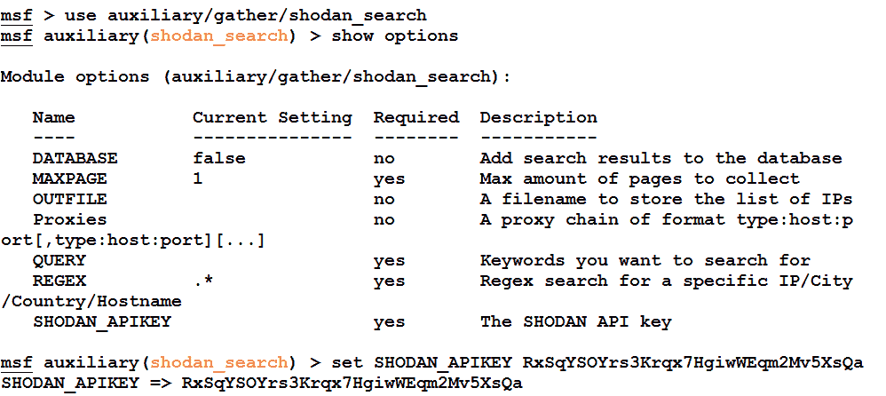

1.  我们设置了所需的`SHODAN_APIKEY`选项和`QUERY`选项，如前面的截图所示。让我们通过运行模块来分析结果：

我们发现许多通过 Rockwell Automation 使用 Metasploit 模块轻松运行 SCADA 服务的系统。然而，最好不要尝试对你一无所知的网络进行任何攻击，尤其是你没有权限的网络。

# 基于 SCADA 的利用

最近，我们看到 SCADA 系统受到的利用率远高于过去。SCADA 系统可能受到各种漏洞的影响，如基于堆栈的溢出、整数溢出、跨站脚本和 SQL 注入。

此外，这些漏洞可能对生命和财产造成危险，正如我们之前讨论的那样。SCADA 设备被黑客攻击的可能性主要在于 SCADA 开发人员和操作人员的粗心编程和糟糕的操作程序。

让我们看一个 SCADA 服务的例子，并尝试使用 Metasploit 进行利用。在下面的案例中，我们将使用 Metasploit 在基于 Windows XP 系统的 DATAC RealWin SCADA Server 2.0 系统上进行利用。

该服务在端口`912`上运行，容易受到`sprintf` C 函数的缓冲区溢出的影响。`sprintf`函数在 DATAC RealWin SCADA 服务器的源代码中用于显示从用户输入构造的特定字符串。当攻击者滥用这个易受攻击的函数时，可能导致目标系统完全被攻陷。

让我们尝试使用 Metasploit 利用`exploit/windows/scada/realwin_scpc_initialize`漏洞来利用 DATAC RealWin SCADA Server 2.0，如下所示：

我们将 RHOST 设置为`192.168.10.108`，有效载荷设置为`windows/meterpreter/bind_tcp`。DATAC RealWin SCADA 的默认端口是`912`。让我们利用目标并检查我们是否可以利用这个漏洞：

太棒了！我们成功地利用了目标。让我们加载`mimikatz`模块以找到系统的明文密码，如下所示：

我们可以看到，通过发出`kerberos`命令，我们可以找到明文密码。我们将在本书的后半部分进一步讨论`mimikatz`功能和其他附加库。

# 攻击 Modbus 协议

大多数 SCADA 服务器都位于内部/空隔网络中。但是，考虑一种可能性，即攻击者已经获得了对面向互联网的服务器的初始访问权限，并从同一服务器进行了枢纽转移；他可以更改 PLC 的状态，读取和写入控制器的值，并造成混乱。让我们看一个示例来演示这一点：

在前面的屏幕截图中，我们可以看到攻击者已经访问了 IP 范围为`192.168.174.0`的系统，并已经识别并添加了一个到内部网络范围`192.168.116.0`的路由。

此时，攻击者将在内部网络中的主机上执行端口扫描。假设我们在内部网络中找到了一个 IP 为`192.168.116.131`的系统。这里需要进行广泛的端口扫描，因为不良做法可能会导致严重问题。让我们看看如何在这种情况下执行端口扫描：

我们可以看到，前面的扫描不是常规扫描。我们使用了`-n`开关来禁用 DNS 解析。`-sT`开关表示使用扫描延迟为 1 秒的 TCP 连接扫描，这意味着端口将按顺序逐个进行扫描。Nmap 扫描产生了以下结果：

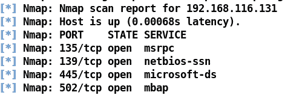

端口号`502`是标准的 Modbus/TCP 服务器端口，允许与 SCADA 软件中的 PLC 进行通信。有趣的是，我们有一个 Metasploit `modbusclient`模块，可以与 Modbus 端口通信，并可能允许我们更改 PLC 中寄存器的值。让我们看一个例子：

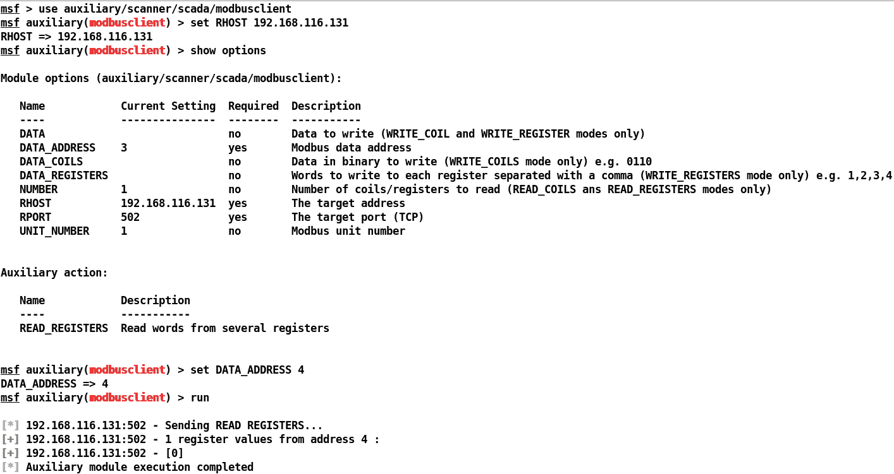

我们可以看到，辅助模块的默认操作是读取寄存器。将四个寄存器设置为`DATA_ADDRESS`将产生存储在第四个数据寄存器中的值。我们可以看到值为`0`。让我们尝试在`DATA_ADDRESS 3`处的不同寄存器上进行操作：

嗯，将值设置为`3`会读取`56`作为输出，这意味着第三个数据寄存器中的值为`56`。我们可以将这个值视为温度，如下图所示：

攻击者可以通过将辅助模块的操作更改为`WRITE_REGISTERS`来改变这些值，如下面的屏幕截图所示：

让我们看看我们是否可以将值写入寄存器：

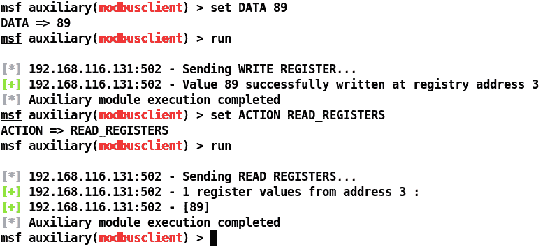

我们可以看到，值已经成功更改，这也意味着在 HMI 上温度读数可能会不可避免地增加，如下图所示：

前面的示例界面仅用于说明目的，以及展示 SCADA 和 ICS 系统的重要性。我们还可以通过将操作设置为`READ_COILS`来操纵线圈中的值。此外，我们可以通过将`NUMBER`选项设置如下来读取/写入多个寄存器和线圈中的数据：

我们在 Metasploit 中有很多专门针对 SCADA 系统漏洞的利用。要了解有关这些漏洞的更多信息，您可以参考 SCADA 黑客和安全网站上关于这些漏洞的最重要资源：[`www.scadahacker.com`](http://www.scadahacker.com)。您应该能够在[`scadahacker.com/resources/msf-scada.html`](http://scadahacker.com/resources/msf-scada.html)的*msf-scada*部分下找到许多列出的利用。

# 保护 SCADA

对 SCADA 网络进行安全保护是任何渗透测试人员的首要目标。让我们进入下一部分，学习如何安全实施 SCADA 服务并对其进行限制。

# 实施安全的 SCADA

在实际执行 SCADA 安全时，确保 SCADA 系统的安全性是一项艰巨的任务；然而，我们可以在确保 SCADA 系统安全时寻找以下一些关键点：

+   密切关注对 SCADA 网络的每一次连接，并检查是否有任何未经授权的尝试

+   确保所有网络连接在不需要时都被断开

+   实施系统供应商提供的所有安全功能

+   为内部和外部系统实施 IDPS 技术，并应用 24 小时的事件监控

+   记录所有网络基础设施，并为管理员和编辑者定义个别角色

+   建立 IR 团队和蓝队，定期识别攻击向量

# 限制网络

在未经授权访问、不需要的开放服务等攻击事件发生时，网络可以进行调整。通过删除或卸载服务来实施治疗是对各种 SCADA 攻击的最佳防御。

SCADA 系统主要部署在 Windows XP 系统上，这显著增加了攻击面。如果您部署了 SCADA 系统，请确保您的 Windows 系统是最新的，以防止更常见的攻击。

# 数据库利用

在介绍了 SCADA 利用的基础知识之后，让我们转向测试数据库服务。在这一部分，我们的主要目标将是测试数据库并检查各种漏洞。数据库包含了关键的业务数据。因此，如果数据库管理系统中存在漏洞，可能导致远程代码执行或完全网络妥协，这可能导致公司机密数据的泄露。与财务交易、医疗记录、犯罪记录、产品、销售、营销等相关的数据可能对地下社区的买家有利。

为了确保数据库完全安全，我们需要开发测试这些服务的方法论，以抵御各种类型的攻击。现在，让我们开始测试数据库，并查看在数据库渗透测试中进行不同阶段的过程。

# SQL 服务器

微软于 1989 年推出了其数据库服务器。如今，相当大比例的网站都在最新版本的 MSSQL 服务器上运行——这是网站的后端。然而，如果网站规模庞大或每天处理大量交易，那么数据库没有任何漏洞和问题是至关重要的。

在测试数据库的这一部分，我们将专注于有效测试数据库管理系统的策略。默认情况下，MSSQL 运行在 TCP 端口号`1433`上，UDP 服务运行在端口`1434`上。因此，让我们开始测试运行在 Windows 8 上的 MSSQL Server 2008。

# 使用 Metasploit 模块扫描 MSSQL

让我们进入专门用于测试 MSSQL 服务器的 Metasploit 模块，并看看我们可以通过使用它们获得什么样的信息。我们将首先使用的辅助模块是`mssql_ping`。该模块将收集额外的服务信息。

因此，让我们加载模块并按以下步骤开始扫描过程：

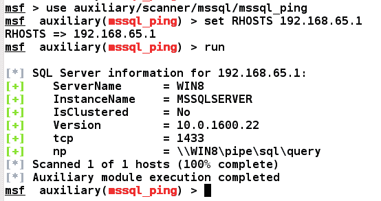

从以前的结果中我们可以看到，我们从扫描中获得了大量信息。Nmap 提供了一个类似的模块来扫描 MSSQL 数据库。然而，Metasploit 的辅助模块在可读性上比 Nmap 的输出具有竞争优势。让我们看看还有哪些模块可以用来测试 MSSQL 服务器。

# 暴力破解密码

渗透测试数据库的下一步是精确检查认证。Metasploit 有一个内置模块名为`mssql_login`，我们可以用它作为认证测试工具，来暴力破解 MSSQL 服务器数据库的用户名和密码。

让我们加载模块并分析结果：

一旦我们运行这个模块，它会在第一步测试默认凭据，也就是使用用户名`sa`和空密码，并发现登录成功。因此，我们可以得出结论，仍然在使用默认凭据。此外，如果无法立即找到`sa`账户，我们必须尝试测试更多的凭据。为了实现这一点，我们将使用包含用于暴力破解 DBMS 用户名和密码的字典的文件的名称来设置`USER_FILE`和`PASS_FILE`参数：

让我们设置所需的参数，即`USER_FILE`列表、`PASS_FILE`列表和`RHOSTS`，以成功运行这个模块。

当我们针对目标数据库服务器运行这个模块时，我们将得到类似以下截图的输出：

从前面的结果中可以看出，我们有两个条目对应于用户在数据库中成功登录。我们找到了一个默认用户`sa`，密码为空，另一个用户`nipun`，密码是`12345`。

# 定位/捕获服务器密码

我们知道我们有两个用户：`sa`和`nipun`。让我们使用其中一个，并尝试找到另一个用户的凭据。我们可以借助`mssql_hashdump`模块来实现这一点。让我们检查它的工作并调查所有其他哈希值：

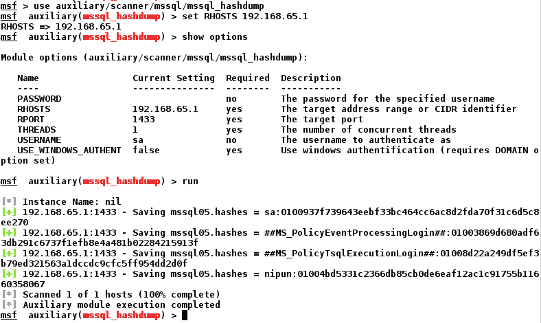

我们可以看到，我们已经获得了数据库服务器上其他账户的密码哈希。现在我们可以使用第三方工具破解它们，并且还可以提升或访问其他数据库和表。

# 浏览 SQL 服务器

我们在前面的部分找到了用户及其对应的密码。现在，让我们登录到服务器，并收集关于数据库服务器的基本信息，如存储过程、当前存在的数据库数量和名称、可以登录到数据库服务器的 Windows 组、数据库中的文件以及参数。

我们将要使用的模块是`mssql_enum`。让我们看看如何在目标数据库上运行这个模块：

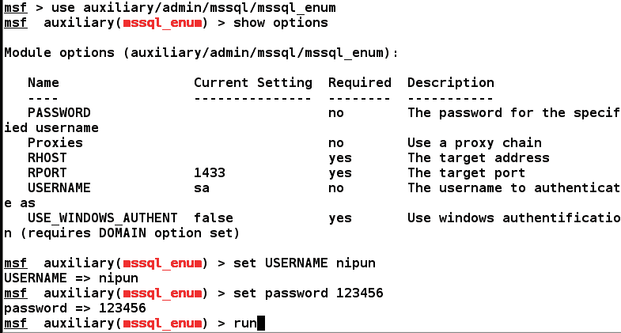

运行`mssql_enum`模块后，我们将能够收集关于数据库服务器的大量信息。让我们看看它提供了什么样的信息：

正如我们所看到的，该模块向我们呈现了关于数据库服务器的几乎所有信息，如存储过程、名称、当前存在的数据库数量、禁用的账户等。

我们还将在接下来的*重新加载 xp_cmdshell 功能*部分中看到，我们可以绕过一些禁用的存储过程。而且，像`xp_cmdshell`这样的存储过程可能导致整个服务器被 compromise。我们可以在之前的截图中看到`xp_cmdshell`在服务器上是启用的。让我们看看`mssql_enum`模块还为我们提供了什么其他信息：

运行该模块，我们得到了一系列存储过程、空密码的账户、数据库的窗口登录和管理员登录。

# 后期利用/执行系统命令

在收集了关于目标数据库的足够信息后，让我们进行一些后期利用。为了实现后期利用，我们有两个不同的模块可以非常方便。第一个是`mssql_sql`，它将允许我们在数据库上运行 SQL 查询，第二个是`msssql_exec`，它将使我们能够通过启用`xp_cmdshell`存储过程来运行系统级命令，以防它被禁用。

# 重新加载 xp_cmdshell 功能

`mssql_exec`模块将尝试通过重新加载禁用的`xp_cmdshell`功能来运行系统级命令。此模块将要求我们将`CMD`选项设置为我们要执行的`system`命令。让我们看看它是如何工作的：

一旦我们完成运行`mssql_exec`模块，结果将如下屏幕截图所示闪现到屏幕上：

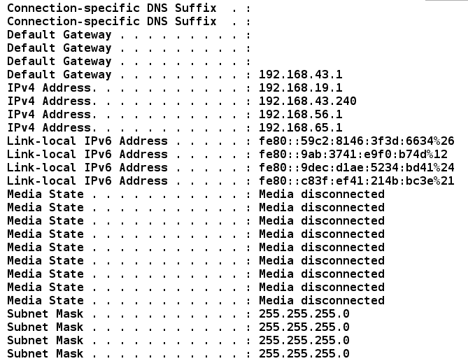

结果窗口显示了针对目标数据库服务器执行`system`命令的成功执行。

# 运行基于 SQL 的查询

我们还可以使用`mssql_sql`模块对目标数据库服务器运行基于 SQL 的查询。将`SQL`选项设置为任何有效的数据库查询将执行它，如下面的屏幕截图所示：

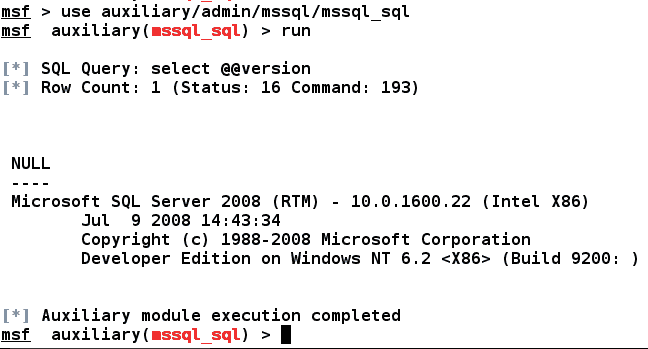

我们将`SQL`参数设置为`select @@version`。数据库服务器成功运行了查询，并且我们得到了数据库的版本。

因此，按照上述程序，我们可以使用 Metasploit 测试各种数据库的漏洞。

MySQL 数据库的测试在我的另一本书*Metasploit Bootcamp*中有介绍（[`www.packtpub.com/networking-and-servers/metasploit-bootcamp`](https://www.packtpub.com/networking-and-servers/metasploit-bootcamp)）；试试看。

请参考以下资源以保护 MSSQL 数据库：

[`www.mssqltips.com/sql-server-tip-category/19/security/`](https://www.mssqltips.com/sql-server-tip-category/19/security/)。

对于 MySQL：

[`www.hexatier.com/mysql-database-security-best-practices-2/`](http://www.hexatier.com/mysql-database-security-best-practices-2/)。

# 测试 VOIP 服务

现在，让我们专注于测试 VOIP 服务，并看看我们如何检查可能影响 VOIP 服务的各种缺陷。

# VOIP 基础知识

**互联网语音**（**VOIP**）技术与传统电话服务相比成本要低得多。VOIP 在电信方面比传统电话服务提供了更多的灵活性，并提供了多个功能，如多个分机、来电显示服务、日志记录、每通电话的录音等。多家公司已经在 IP 电话上推出了他们的**专用分支交换**（**PBX**）。

传统和现有的电话系统仍然容易通过物理接触进行拦截，因此，如果攻击者更改电话线的连接并连接他们的发射器，他们将能够在受害者设备上拨打和接听电话，并享受互联网和传真服务。

然而，在 VOIP 服务的情况下，我们可以在不接触电线的情况下破坏安全性。然而，如果您不了解其工作原理，攻击 VOIP 服务将是一项繁琐的任务。本节将介绍如何在网络中破坏 VOIP 而不拦截电线。

# PBX 简介

PBX 是小型和中型公司电话服务的经济解决方案，因为它在公司的机舱和楼层之间提供了更多的灵活性和互联。大公司也可能更喜欢 PBX，因为在大型组织中连接每条电话线到外部线路变得非常繁琐。PBX 包括以下内容：

+   在 PBX 终止的电话干线

+   管理 PBX 内和外的呼叫切换的计算机

+   PBX 内的通信线路网络

+   人工操作员的控制台或交换机

# VOIP 服务的类型

我们可以将 VOIP 技术分为三种不同的类别。让我们看看它们是什么。

# 自托管网络

在这种类型的网络中，PBX 安装在客户端现场，并进一步连接到**互联网服务提供商**（**ISP**）。这些系统通过多个虚拟局域网将 VOIP 流量传输到 PBX 设备，然后将其发送到**公共交换电话网**（**PSTN**）进行电路交换，同时也发送到互联网连接的 ISP。以下图表很好地展示了这种网络：

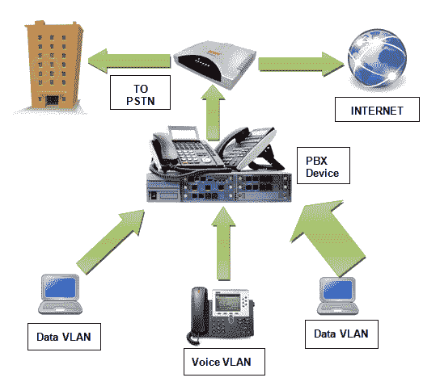

# 托管服务

在托管服务类型的 VOIP 技术中，客户端的场所没有 PBX。然而，客户端场所的所有设备都通过互联网连接到服务提供商的 PBX，即通过使用 IP/VPN 技术的**会话初始协议**（**SIP**）线路。

让我们看看以下图表如何解释这项技术：

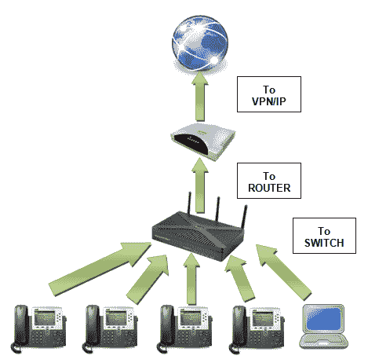

# SIP 服务提供商

许多互联网 SIP 服务提供商为软电话提供连接，可以直接使用以享受 VOIP 服务。此外，我们可以使用任何客户端软电话来访问 VOIP 服务，例如 Xlite，如下面的屏幕截图所示：

# 指纹识别 VOIP 服务

我们可以使用 Metasploit 内置的 SIP 扫描器模块对网络中的 VOIP 设备进行指纹识别。一个常见的 SIP 扫描器是**SIP 终端扫描器**。我们可以使用此扫描器通过向网络中的各种 SIP 设备发出选项请求来识别启用 SIP 的设备。

让我们继续使用`/auxiliary/scanner/sip`下的`options`辅助模块扫描 VOIP 并分析结果。这里的目标是运行 Asterisk PBX VOIP 客户端的 Windows XP 系统。我们首先加载用于扫描网络上的 SIP 服务的辅助模块，如下面的屏幕截图所示：

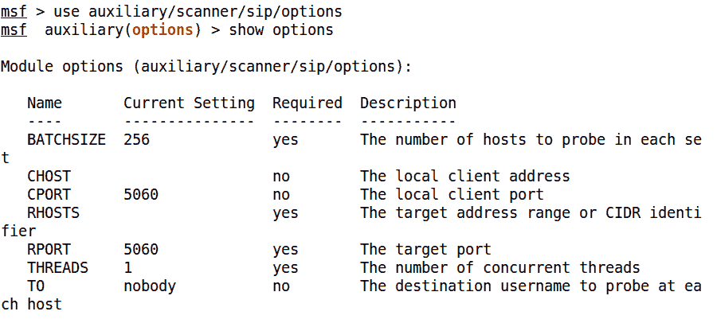

我们可以看到我们有很多选项可以与`auxiliary/scanner/sip/options`辅助模块一起使用。我们只需要配置`RHOSTS`选项。但是，对于大型网络，我们可以使用**无类域间路由**（**CIDR**）标识符定义 IP 范围。运行后，该模块将开始扫描可能正在使用 SIP 服务的 IP。让我们按照以下方式运行此模块：

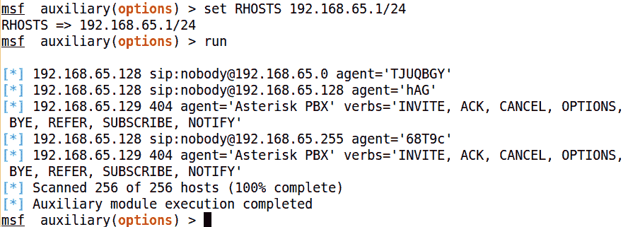

当此模块运行时，它返回了许多与运行 SIP 服务的系统相关的信息。信息包含了称为**agent**的响应，它表示 PBX 的名称和版本，以及定义 PBX 支持的请求类型的动词。因此，我们可以使用此模块收集关于网络上 SIP 服务的大量知识。

# 扫描 VOIP 服务

在找到有关目标支持的各种选项请求的信息后，让我们现在使用另一个 Metasploit 模块`auxiliary/scanner/sip/enumerator`来扫描和枚举 VOIP 服务的用户。此模块将检查目标范围内的 VOIP 服务，并尝试枚举其用户。让我们看看我们如何实现这一点：

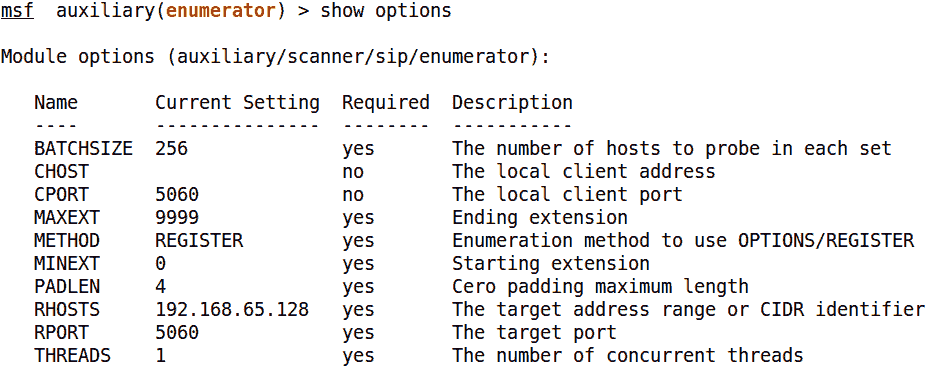

我们有前面的选项可用于此模块。我们将设置以下一些选项以成功运行此模块：

正如我们所看到的，我们已经设置了`MAXEXT`，`MINEXT`，`PADLEN`和`RHOSTS`选项。

在前面的屏幕截图中使用的 enumerator 模块中，我们将`MINEXT`和`MAXEXT`定义为`3000`和`3005`。`MINEXT`是搜索将从哪个分机号开始的扩展号码，`MAXEXT`是搜索将结束的最后一个分机号码。这些选项可以设置为广泛的范围，例如将`MINEXT`设置为`0`，`MAXEXT`设置为`9999`，以查找在分机号码`0`到`9999`上使用 VOIP 服务的各种用户。

通过将 RHOSTS 变量设置为 CIDR 值，让我们在目标范围上运行此模块，如下所示：

将`RHOSTS`设置为`192.168.65.0/24`将扫描整个子网。现在，让我们运行此模块并查看它呈现了什么输出：

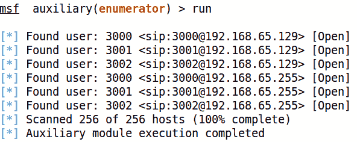

这次搜索返回了许多使用 SIP 服务的用户。此外，`MAXEXT`和`MINEXT`的影响只扫描了从`3000`到`3005`的分机用户。分机可以被认为是特定网络中某个用户的通用地址。

# 欺骗 VOIP 呼叫

在了解了使用 SIP 服务的各种用户的足够知识后，让我们尝试使用 Metasploit 给用户打一个假电话。当用户在 Windows XP 平台上运行 SipXphone 2.0.6.27 时，让我们发送一个虚假的邀请请求给用户，使用`auxiliary/voip/sip_invite_spoof`模块如下：

我们将使用目标的 IP 地址设置`RHOSTS`选项，将`EXTENSION`设置为目标的`4444`。让我们保持`SRCADDR`设置为`192.168.1.1`，这将伪装地址源进行呼叫。

因此，让我们按照以下方式运行模块：

让我们看看受害者这边发生了什么：

我们可以看到软电话正在响铃，显示呼叫者为 192.168.1.1，并显示来自 Metasploit 的预定义消息。

# 利用 VOIP

为了完全访问系统，我们也可以尝试利用软电话软件。从之前的情景中，我们有目标的 IP 地址。让我们使用 Metasploit 扫描和利用它。但是，在 Kali 操作系统中有专门设计用于测试 VOIP 服务的专用 VOIP 扫描工具。以下是我们可以用来利用 VOIP 服务的工具列表：

+   Smap

+   Sipscan

+   Sipsak

+   Voipong

+   Svmap

回到利用部分，我们在 Metasploit 中有一些可以用于软电话的利用程序。让我们看一个例子。

我们要利用的应用程序是 SipXphone 版本 2.0.6.27。该应用程序的界面可能类似于以下截图：

# 关于漏洞

漏洞在应用程序处理`Cseq`值时存在。发送一个过长的字符串会导致应用程序崩溃，并且在大多数情况下，它将允许攻击者运行恶意代码并访问系统。

# 利用应用程序

现在，让我们利用 Metasploit 来利用 SipXphone 版本 2.0.6.27 应用程序。我们要使用的利用程序是`exploit/windows/sip/sipxphone_cseq`。让我们将此模块加载到 Metasploit 中并设置所需的选项：

我们需要设置`RHOST`、`LHOST`和`payload`的值。让我们按照以下方式利用目标应用程序：

哇！我们在极短的时间内就得到了 meterpreter。因此，在使用 Metasploit 时，利用 VOIP 可能很容易。然而，在测试 VOIP 设备和其他与服务相关的缺陷时，我们可以使用第三方工具进行有效的测试。

可以在以下网址找到测试 VOIP 的绝佳资源：[`www.viproy.com/`](http://www.viproy.com/)。

有关保护 VOIP 网络的更多信息，请参考这些优秀的指南：

[`searchsecurity.techtarget.com/feature/Securing-VoIP-Keeping-Your-VoIP-Networks-Safe`](https://searchsecurity.techtarget.com/feature/Securing-VoIP-Keeping-Your-VoIP-Networks-Safe) 和 [`www.sans.org/reading-room/whitepapers/voip/security-issues-countermeasure-voip-1701`](https://www.sans.org/reading-room/whitepapers/voip/security-issues-countermeasure-voip-1701)。

# 总结

在本章中，我们看到了一些使我们能够测试各种服务的利用和渗透测试场景，例如数据库、VOIP 和 SCADA。在本章中，我们了解了 SCADA 及其基本原理。我们看到了如何可以获取有关数据库服务器的各种信息以及如何完全控制它。我们还看到了如何通过扫描网络来测试 VOIP 服务，并进行 VOIP 呼叫欺骗。

在进入下一章之前，您应该进行以下练习：

+   使用 Metasploit 设置和测试 MySQL、Oracle 和 PostgreSQL，并找到并开发缺失模块的模块。

+   尝试在 Metasploit 中自动化 SQL 注入漏洞

+   如果您对 SCADA 和 ICS 感兴趣，请尝试使用 Samurai STFU（[`www.samuraistfu.org/`](http://www.samuraistfu.org/)）

+   利用至少一个演示中未使用的 VOIP 软件

在下一章中，我们将看到如何使用 Metasploit 进行完整的渗透测试，并集成其他流行的渗透测试扫描工具。我们将介绍如何在对特定主题进行渗透测试时进行系统化的操作。我们还将探讨如何创建报告以及报告中应包含或排除哪些内容。
