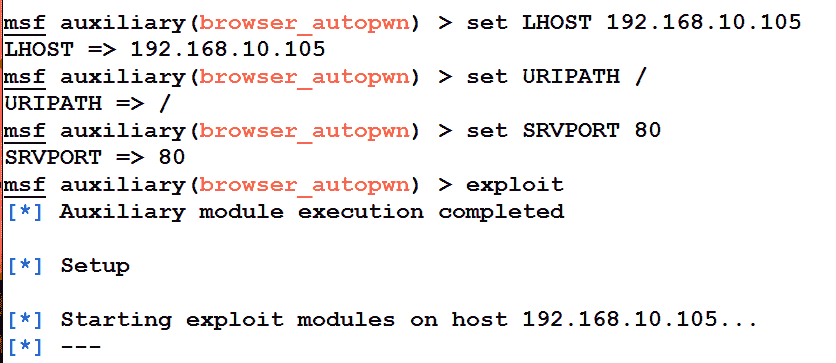
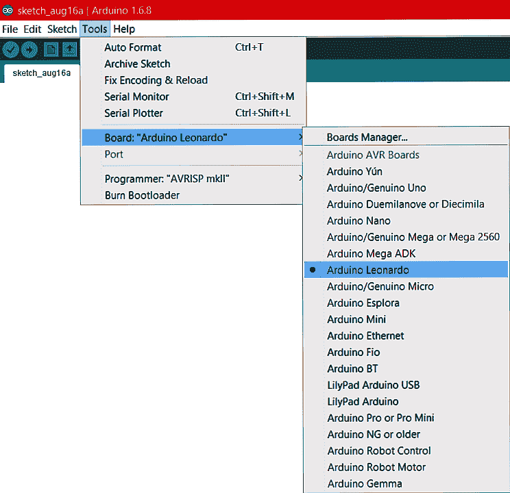
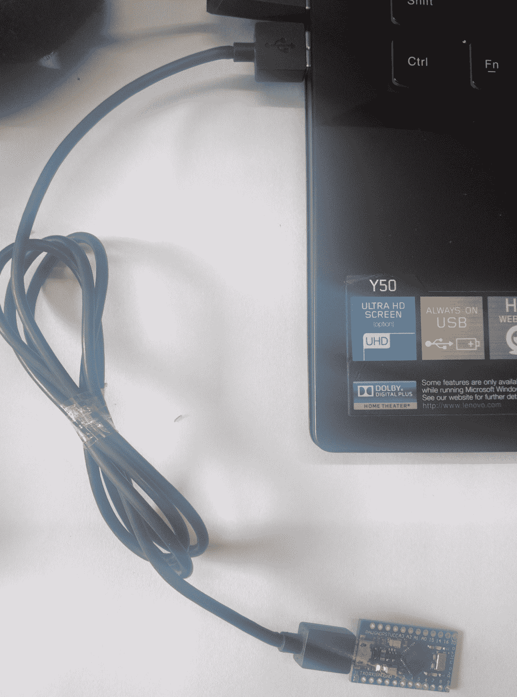
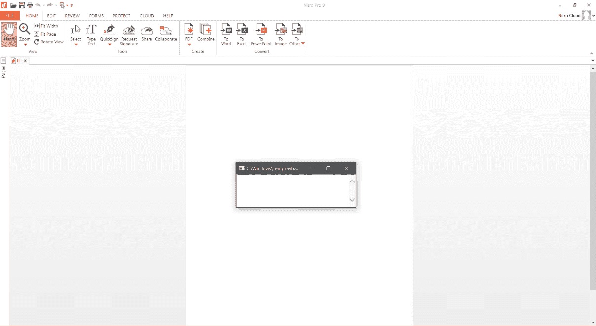
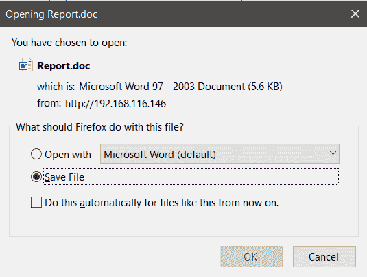
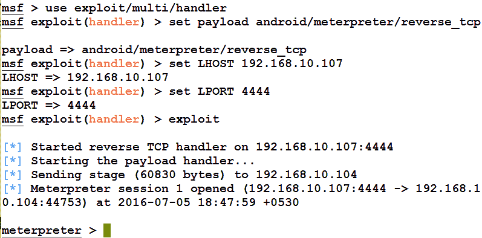

# 客户端利用

在前几章中，我们涵盖了编码并在许多环境中执行了渗透测试；现在我们准备介绍客户端利用。在本节和接下来的几节中，我们将详细学习客户端利用。

在本章中，我们将重点关注以下内容：

+   攻击目标的浏览器

+   欺骗客户端的复杂攻击向量

+   攻击 Android 并使用 Kali NetHunter

+   使用 Arduino 进行利用

+   将 payload 注入各种文件

客户端利用有时需要受害者与恶意文件进行交互，这使得其成功取决于交互。这些交互可能是访问恶意 URL 或下载并执行文件，这意味着我们需要受害者的帮助才能成功地利用他们的系统。因此，对受害者的依赖是客户端利用的关键因素。

客户端系统可能运行不同的应用程序。PDF 阅读器、文字处理器、媒体播放器和 Web 浏览器是客户端系统的基本软件组件。在本章中，我们将发现这些应用程序中的各种缺陷，这可能导致整个系统被攻破，从而使我们能够利用被攻破的系统作为测试整个内部网络的发射台。

让我们开始利用多种技术攻击客户端，并分析可能导致成功或失败的因素，同时利用客户端漏洞。

# 利用浏览器进行娱乐和盈利

Web 浏览器主要用于浏览网页；然而，过时的 Web 浏览器可能导致整个系统被攻破。客户端可能永远不会使用预安装的 Web 浏览器，而是根据自己的喜好选择一个；然而，默认预安装的 Web 浏览器仍然可能导致对系统的各种攻击。通过发现浏览器组件中的漏洞来利用浏览器被称为**基于浏览器的利用**。

有关 Firefox 漏洞的更多信息，请参阅[`www.cvedetails.com/product/3264/Mozilla-Firefox.html?vendor_id=452`](https://www.cvedetails.com/product/3264/Mozilla-Firefox.html?vendor_id=452)。

参考 Internet Explorer 漏洞[`www.cvedetails.com/product/9900/Microsoft-Internet-Explorer.html?vendor_id=26`](https://www.cvedetails.com/product/9900/Microsoft-Internet-Explorer.html?vendor_id=26)。

# 浏览器 autopwn 攻击

Metasploit 提供了浏览器 autopwn，这是一组旨在通过触发相关漏洞来利用目标浏览器的各种攻击模块。为了了解这个模块的内部工作原理，让我们讨论一下攻击背后的技术。

# 浏览器 autopwn 攻击背后的技术

autopwn 指的是对目标的自动利用。autopwn 模块通过自动配置它们一个接一个地将大多数基于浏览器的利用程序设置为监听模式。在特定浏览器发来的请求时，它会启动一组匹配的利用程序。因此，无论受害者使用的是哪种浏览器，如果浏览器中存在漏洞，autopwn 脚本都会自动使用匹配的利用程序模块对其进行攻击。

让我们通过以下图表详细了解这种攻击向量的工作原理：

在前面的场景中，一个利用服务器基地正在运行，并配置了一些基于浏览器的利用程序及其匹配的处理程序。一旦受害者的浏览器连接到利用服务器，利用服务器基地会检查浏览器的类型，并将其与匹配的利用程序进行测试。在前面的图表中，我们有 Internet Explorer 作为受害者的浏览器。因此，与 Internet Explorer 匹配的利用程序将被发送到受害者的浏览器。随后的利用程序将与处理程序建立连接，攻击者将获得对目标的 shell 或 meterpreter 访问权限。

# 使用 Metasploit 浏览器 autopwn 攻击浏览器

为了进行浏览器利用攻击，我们将使用 Metasploit 中的`browser_autopwn`模块，如下截图所示：

我们可以看到，我们成功在 Metasploit 中加载了位于`auxiliary/server/browser_autpown2`的`browser_autopwn`模块。要发动攻击，我们需要指定`LHOST`、`URIPATH`和`SRVPORT`。`SRVPORT`是我们的利用服务器基础运行的端口。建议使用端口`80`或`443`，因为在`URL`中添加端口号会引起许多人的注意，看起来可疑。`URIPATH`是各种利用的目录路径，并且应通过将`URIPATH`指定为`/`来保持在根目录中。让我们设置所有必需的参数并启动模块，如下截图所示：

启动`browser_autopwn`模块将设置浏览器利用处于监听模式，等待传入连接，如下截图所示：

任何连接到我们系统端口`80`的目标都将根据其浏览器获得一系列的利用。让我们分析一下受害者如何连接到我们的恶意利用服务器：

我们可以看到，一旦受害者连接到我们的 IP 地址，`browser_autopwn`模块会以各种利用方式做出响应，直到获得 Meterpreter 访问，如下截图所示：

正如我们所看到的，`browser_autopwn`模块允许我们测试和积极利用受害者浏览器的多个漏洞；然而，客户端利用可能会导致服务中断。在进行客户端利用测试之前，最好获得事先许可。在接下来的部分中，我们将看到像`browser_autopwn`这样的模块如何对多个目标造成致命打击。

# 危害网站客户端

在本节中，我们将尝试开发方法，通过这些方法可以将常见攻击转化为致命的选择武器。

如前一节所示，向目标发送 IP 地址可能会引起注意，受害者可能会后悔浏览您发送的 IP 地址；然而，如果向受害者发送的是域名地址而不是裸 IP 地址，则逃避受害者的注意的可能性更大，结果是有保证的。

# 注入恶意 Web 脚本

一个有漏洞的网站可以作为浏览器 autopwn 服务器的发射台。攻击者可以将隐藏的 iFrame 嵌入到有漏洞服务器的网页中，这样任何访问服务器的人都将面对浏览器 autopwn 攻击。因此，每当有人访问被注入的页面时，浏览器 autopwn 利用服务器都会测试他们的浏览器是否存在漏洞，并且在大多数情况下也会利用它。

使用**iFrame 注入**可以实现对网站用户的大规模黑客攻击。让我们在下一节中了解攻击的解剖。

# 黑客攻击网站用户

让我们通过以下图表了解如何使用浏览器利用来黑客攻击网站用户：

前面的图表非常清晰。现在让我们找出如何做到这一点。但请记住，这种攻击最重要的要求是访问具有适当权限的有漏洞服务器。让我们通过以下截图更多地了解如何注入恶意脚本：

我们有一个示例网站，存在一个允许我们上传基于 PHP 的第三方 Web shell 的 Web 应用程序漏洞。要执行攻击，我们需要将以下行添加到`index.php`页面，或者我们选择的任何其他页面：

[PRE0]

上述代码行将在受害者访问网站时在 iFrame 中加载恶意的浏览器 autopwn。由于这段代码在一个`iframe`标签中，它将自动从攻击者的系统中包含浏览器 autopwn。我们需要保存这个文件并允许访问者查看网站并浏览它。

一旦受害者浏览到被感染的网站，浏览器 autopwn 将自动在他们的浏览器上运行；但是，请确保`browser_autopwn`模块正在运行。如果没有，您可以使用以下命令：

如果一切顺利，我们将能够在目标系统上运行 Meterpreter。整个想法是利用目标网站来诱使尽可能多的受害者，并获取对其系统的访问权限。这种方法在进行白盒测试时非常方便，其中内部 Web 服务器的用户是目标。让我们看看当受害者浏览到恶意网站时会发生什么：

我们可以看到对 IP `192.168.10.107`发起了调用，这是我们的浏览器 autopwn 服务器。让我们从攻击者的角度来看一下：

我们可以看到利用正在轻松进行。成功利用后，我们将获得 Meterpreter 访问，就像前面的例子中演示的那样。

# 带有 DNS 欺骗和 MITM 攻击的 autopwn

对受害者系统进行所有攻击的主要动机是以最小的检测和最低的被发现风险获得访问权限。

现在，我们已经看到了传统的浏览器 autopwn 攻击以及修改以侵入网站目标受众的方式。但是，我们仍然有以某种方式将链接发送给受害者的限制。

然而，在这种攻击中，我们将以不同的方式对受害者进行相同的浏览器 autopwn 攻击。在这种情况下，我们不会向受害者发送任何链接。相反，我们将等待他们浏览他们喜欢的网站。

这种攻击只能在局域网环境中工作。这是因为要执行这种攻击，我们需要进行 ARP 欺骗，它在第 2 层上工作，并且只在相同的广播域下工作；然而，如果我们可以以某种方式修改远程受害者的`hosts`文件，我们也可以在广域网上执行这种攻击，这被称为**Pharming 攻击**。

# 用 DNS 劫持欺骗受害者

让我们开始吧。在这里，我们将对受害者进行 ARP 毒化攻击，并欺骗 DNS 查询。因此，如果受害者尝试打开一个标准网站，比如[`google.com`](http://google.com)，这是最常浏览的网站，他们将得到浏览器 autopwn 服务作为回报，这将导致他们的系统受到浏览器 autopwn 服务器的攻击。

我们首先将创建一个用于毒化 DNS 的条目列表，这样每当受害者尝试打开一个域时，域的名称将指向我们的浏览器 autopwn 服务的 IP 地址，而不是[`www.google.com`](http://www.google.com)。DNS 的欺骗条目存储在以下文件中：

在这个例子中，我们将使用最流行的 ARP 毒化工具集之一，`ettercap`。首先，我们将搜索文件并在其中创建一个虚假的 DNS 条目。这很重要，因为当受害者尝试打开网站时，他们将得到我们自定义的 IP 地址，而不是原始 IP。为了做到这一点，我们需要修改`etter.dns`文件中的条目，如下面的截图所示：

我们需要在这一部分做以下更改：

这个条目将在受害者请求[`google.com`](http://google.com)时发送攻击者机器的 IP 地址。创建条目后，保存该文件并打开`ettercap`，使用下面截图中显示的命令：

上述命令将以图形模式启动 Ettercap，如下面的屏幕截图所示：

我们需要从“嗅探”选项卡中选择“统一嗅探…”选项，并选择默认接口，即 eth0，如下面的屏幕截图所示：

下一步是扫描网络范围，以识别网络上存在的所有主机，包括受害者和路由器，如下面的屏幕截图所示：

根据地址范围，所有扫描的主机都根据其存在进行过滤，并将网络上所有现有的主机添加到主机列表中，如下面的屏幕截图所示：

要打开主机列表，我们需要导航到“主机”选项卡并选择“主机列表”，如下面的屏幕截图所示：

下一步是将路由器地址添加到**目标 2**，将受害者添加到**目标 1**。我们将路由器用作**目标 2**，将受害者用作**目标 1**，因为我们需要拦截来自受害者并发送到路由器的信息。

下一步是浏览到 Mitm 选项卡并选择 ARP 毒化，如下面的屏幕截图所示：

接下来，点击“确定”并继续下一步，即浏览到“开始”选项卡并选择“开始嗅探”。点击“开始嗅探”选项将通知我们一个消息，显示“开始统一嗅探…”：

下一步是从“插件”选项卡中激活 DNS 欺骗插件，选择“管理插件”，如下面的屏幕截图所示：

双击 DNS 欺骗插件以激活 DNS 欺骗。激活此插件后会发生的情况是，它将开始从我们之前修改的`etter.dns`文件中发送虚假的 DNS 条目。因此，每当受害者请求特定网站时，来自`etter.dns`文件的欺骗性 DNS 条目将返回，而不是网站的原始 IP。这个虚假的条目是我们浏览器 autopwn 服务的 IP 地址。因此，受害者不会进入原始网站，而是被重定向到浏览器 autopwn 服务，从而使他们的浏览器被攻破：

让我们还在端口`80`上启动我们的恶意`browser_autopwn`服务：

现在，让我们看看当受害者尝试打开[`google.com/`](http://google.com/)时会发生什么：

让我们也看看攻击者端是否有什么有趣的东西，或者没有：

太棒了！我们在后台打开了 Meterpreter，这表明我们的攻击已经成功，而不需要向受害者发送任何链接。这种攻击的优势在于我们从未向受害者发布任何链接，因为我们在本地网络上毒害了 DNS 条目；然而，要在 WAN 网络上执行这种攻击，我们需要修改受害者的主机文件，这样每当对特定 URL 的请求被发出时，主机文件中的受感染条目将把它重定向到我们的恶意 autopwn 服务器，如下面的屏幕截图所示：

因此，许多其他技术可以使用 Metasploit 中支持的各种攻击重新发明。

# 使用 Kali NetHunter 进行浏览器漏洞利用

我们看到了如何欺骗 DNS 查询并在同一网络上利用它对目标进行攻击。我们也可以使用 NetHunter Android 设备执行类似但无麻烦的攻击。为了避开受害者的眼睛，我们不会像在之前的演示中那样使用特定的网站，比如 Google。在这种攻击类型中，我们将使用 Kali NetHunter 中的**cSploit**工具通过脚本注入攻击注入目标正在浏览的所有网站。因此，让我们通过 cSploit 进行浏览：

我们假设我们的目标是`DESKTOP-PESQ21S`，点击它将打开一个包含所有列出选项的子菜单：

让我们选择 MITM，然后是脚本注入和自定义代码，结果将是以下屏幕：

我们将使用自定义脚本攻击和默认脚本来开始。现在，这将会将此脚本注入到目标正在浏览的所有网页中。让我们按“确定”来启动攻击。一旦目标打开新网站，受害者将看到以下内容：

我们可以看到我们的攻击完美地成功了。我们现在可以创建一些 JavaScript，用于加载浏览器的 autopwn 服务。我故意留下 JavaScript 练习给你完成，这样在创建脚本时，你可以研究更多技术，比如基于 JavaScript 的 cookie 记录器；然而，运行 JavaScript 后，将在后台加载浏览器的 autopwn 服务，我们将得到以下输出：

太神奇了，对吧？ NetHunter 和 cSploit 是改变游戏规则的。然而，如果你不知何故无法创建 JavaScript，你可以使用重定向选项来重定向目标，如下所示：

单击“确定”按钮将强制所有流量转到端口`8080`上的前一个地址，这只是我们的 autopwn 服务器的地址。

# Metasploit 和 Arduino - 致命的组合

基于 Arduino 的微控制器板是微小而不寻常的硬件，当涉及到渗透测试时，它们可以充当致命武器。一些 Arduino 板支持键盘和鼠标库，这意味着它们可以作为 HID 设备：

因此，这些小型 Arduino 板可以偷偷地执行诸如键盘输入、鼠标移动和点击等人类动作，以及许多其他操作。在本节中，我们将模拟 Arduino Pro Micro 板作为键盘，从远程站点下载并执行我们的恶意载荷；然而，这些小板没有足够的内存来保存载荷，因此需要下载。

有关使用 HID 设备进行利用的更多信息，请参阅 USB Rubber Ducky 或 Teensy。

**Arduino Pro Micro**在诸如[`www.aliexpress.com/`](https://www.aliexpress.com/)等知名购物网站上的价格不到 4 美元。因此，使用 Arduino Pro Micro 比 Teensy 和 USB Rubber Ducky 要便宜得多。

使用其编译器软件配置 Arduino 非常容易。精通编程概念的读者会发现这个练习非常容易。

有关设置和开始使用 Arduino 的更多信息，请参阅[`www.arduino.cc/en/Guide/Windows`](https://www.arduino.cc/en/Guide/Windows)。

让我们看看我们需要在 Arduino 芯片上烧录的代码：

[PRE1]

我们有一个名为`type`的函数，它接受两个参数，即要按下和释放的键的名称，这决定了我们是否需要释放特定的键。下一个函数是`print`，它通过直接在键盘按下函数上输出文本来覆盖默认的`print`函数。Arduino 主要有两个函数，即`loop`和`setup`。由于我们只需要我们的 payload 下载和执行一次，所以我们将代码放在`setup`函数中。当我们需要重复一组指令时，需要`Loop`函数。`delay`函数相当于`sleep`函数，它暂停程序一定的毫秒数。`type(KEY_LEFT_GUI, false);`将按下目标上的左 Windows 键，由于我们需要保持按下，所以我们将`false`作为释放参数传递。接下来，以同样的方式，我们传递`d`键。现在，我们按下了两个键，即 Windows + *D*（显示桌面的快捷键）。一旦我们提供`Keyboard.releaseAll();`，`Windows+d`命令就会被推送到目标上执行，这将最小化桌面上的所有内容。

在[`www.arduino.cc/en/Reference/KeyboardModifiers`](https://www.arduino.cc/en/Reference/KeyboardModifiers)了解更多关于 Arduino 键盘库的信息。

同样，我们提供下一个组合来显示运行对话框。接下来，我们在运行对话框中打印 PowerShell 命令，该命令将从远程站点`192.168.10.107/pay2.exe`下载我们的 payload 到`Temp`目录，并将其从那里执行。提供命令后，我们需要按*Enter*来运行命令。我们可以通过将`KEY_RETURN`作为键值来实现这一点。让我们看看如何向 Arduino 板写入：

我们可以看到我们需要通过浏览 Tools 菜单来选择我们的板类型，如前面的截图所示。接下来，我们需要为板选择通信端口：

接下来，我们需要通过按->图标将程序写入板：

我们的 Arduino 现在已经准备好插入受害者的系统。好消息是它模拟键盘。因此，您不必担心被检测到；但是，payload 需要被混淆得足够好，以避开杀毒软件的检测。

像这样插入设备：

一旦我们插入设备，几毫秒内，我们的 payload 就会被下载，在目标系统上执行，并为我们提供以下信息：

让我们来看看我们如何生成 payload：

我们可以看到我们为 Windows 创建了一个简单的 x64 Meterpreter payload，它将连接到端口`5555`。我们将可执行文件直接保存到 Apache 文件夹，并按照前面的截图启动了 Apache。接下来，我们只是启动了一个利用处理程序，它将监听端口`5555`上的传入连接，如下所示：

我们在这里看到了一个非常新的攻击。使用廉价的微控制器，我们能够访问 Windows 10 系统。Arduino 很有趣，我建议进一步阅读有关 Arduino、USB Rubber Ducky、Teensy 和 Kali NetHunter 的信息。Kali NetHunter 可以使用任何 Android 手机模拟相同的攻击。

有关 Teensy 的更多信息，请访问[`www.pjrc.com/teensy/`](https://www.pjrc.com/teensy/)。

有关 USB Rubber Ducky 的更多信息，请访问[`hakshop.myshopify.com/products/usb-rubber-ducky-deluxe`](http://hakshop.myshopify.com/products/usb-rubber-ducky-deluxe)。

# 基于文件格式的利用

在本节中，我们将涵盖使用恶意文件对受害者进行各种攻击。每当这些恶意文件运行时，Meterpreter 或 shell 访问将提供给目标系统。在下一节中，我们将介绍使用恶意文档和 PDF 文件进行利用。

# 基于 PDF 的漏洞利用

基于 PDF 文件格式的利用是触发各种 PDF 阅读器和解析器中的漏洞，这些漏洞被设计为执行携带 PDF 文件的有效负载，向攻击者提供对目标系统的完全访问，以 Meterpreter shell 或命令 shell 的形式；然而，在进入技术之前，让我们看看我们正在针对什么漏洞，以及环境细节是什么：

| **测试案例** | **描述** |
| --- | --- |
| 漏洞 | 该模块利用了 Nitro 和 Nitro Pro PDF Reader 版本 11 中实现的不安全的 JavaScript API。`saveAs()` Javascript API 函数允许将任意文件写入文件系统。此外，`launchURL()`函数允许攻击者执行文件系统上的本地文件，并绕过安全对话框。 |
| 在操作系统上利用 | Windows 10 |
| 软件版本 | Nitro Pro 11.0.3.173 |
| CVE 细节 | [`www.cvedetails.com/cve/CVE-2017-7442/`](https://www.cvedetails.com/cve/CVE-2017-7442/) |
| 利用细节 | `exploit/windows/fileformat/nitro_reader_jsapi` |

为了利用这个漏洞，我们将创建一个 PDF 文件并发送给受害者。当受害者尝试打开我们的恶意 PDF 文件时，我们将能够获得 Meterpreter shell 或基于使用的有效负载的命令 shell。让我们进一步，尝试构建恶意的 PDF 文件：

我们需要将`LHOST`设置为我们的 IP 地址，并选择`LPORT`和`SRVPORT`。出于演示目的，我们将选择将端口设置为默认的`8080`，`LPORT`设置为`4444`。让我们按照以下方式运行模块：

我们需要通过多种方式之一向受害者发送`msf.pdf`文件，例如上传文件并将链接发送给受害者，将文件放入 USB 存储设备中，或者通过电子邮件发送压缩的 ZIP 文件格式；然而，出于演示目的，我们已经将文件托管在我们的 Apache 服务器上。一旦受害者下载并执行文件，他们将看到类似于以下屏幕的内容：

在一小部分时间内，覆盖的窗口将消失，并将导致成功的 Meterpreter shell，如下面的屏幕截图所示：

# 基于 Word 的漏洞利用

基于 Word 的漏洞利用侧重于我们可以加载到 Microsoft Word 中的各种文件格式；然而，一些文件格式执行恶意代码，并可以让攻击者访问目标系统。我们可以像对待 PDF 文件一样利用基于 Word 的漏洞。让我们快速看一些与这个漏洞相关的基本事实：

| **测试案例** | **描述** |
| --- | --- |
| 漏洞 | 该模块创建一个恶意的 RTF 文件，当在易受攻击的 Microsoft Word 版本中打开时，将导致代码执行。缺陷存在于**olelink**对象如何发出 HTTP(s)请求并执行 HTA 代码的方式。 |
| 在操作系统上利用 | Windows 7 32 位 |
| 我们环境中的软件版本 | Microsoft Word 2013 |
| CVE 细节 | [`www.cvedetails.com/cve/cve-2017-0199`](https://www.cvedetails.com/cve/cve-2017-0199) |
| 利用细节 | `exploit/windows/fileformat/office_word_hta` |

让我们尝试利用这个漏洞来访问易受攻击的系统。因此，让我们快速启动 Metasploit 并创建文件，如下面的屏幕截图所示：

让我们将`FILENAME`和`SRVHOST`参数分别设置为`Report.doc`和我们的 IP 地址，如下图所示：

生成的文件存储在`/root/.msf4/local/Report.doc`路径下。让我们将这个文件移动到我们的 Apache `htdocs`目录：

我们需要通过多种方式之一将`Report.doc`文件发送给受害者，例如上传文件并将链接发送给受害者，将文件放入 USB 存储设备，或者通过电子邮件以压缩的 ZIP 文件格式发送；但是，出于演示目的，我们已经将文件托管在我们的 Apache 服务器上。让我们在受害者机器上下载它，如下所示：

让我们打开这个文件，看看是否发生了什么：

我们可以看到这里没有发生太多事情。让我们回到我们的 Metasploit 控制台，看看我们得到了什么：

哇哇！我们轻松地获得了对目标的 Meterpreter 访问权限。我们刚刚看到了创建恶意 Word 文档并访问目标机器有多么容易。但等等！是这么容易吗？不，我们还没有考虑目标系统的安全性！在现实世界的场景中，我们有很多在目标机器上运行的防病毒解决方案和防火墙，这最终会破坏我们的计划。我们将在下一章中解决这些防御措施。

# 使用 Metasploit 攻击 Android

Android 平台可以通过创建简单的 APK 文件或将有效负载注入现有 APK 来进行攻击。我们将介绍第一种方法。让我们开始使用`msfvenom`生成一个 APK 文件，如下所示：

生成 APK 文件后，我们只需要说服受害者（进行社会工程）安装 APK，或者物理上获取手机的访问权限。让我们看看受害者下载恶意 APK 后手机上会发生什么：

下载完成后，用户按照以下步骤安装文件：

大多数人在智能手机上安装新应用程序时都不会注意应用程序请求的权限。因此，攻击者可以完全访问手机并窃取个人数据。上述屏幕截图列出了应用程序需要正确运行的所需权限。一旦安装成功，攻击者就可以完全访问目标手机：

哇！我们轻松获得了 Meterpreter 访问权限。后期利用在下一章中广泛涵盖；但是，让我们看一些基本功能：

我们可以看到运行`check_root`命令时显示设备已被 root。让我们看一些其他功能：

我们可以使用`send_sms`命令从被利用手机向任何号码发送短信。让我们看看消息是否已发送：

哎呀！消息已成功传递。同时，让我们看看使用`sysinfo`命令我们侵入了哪个系统：

让我们对手机进行地理定位：

浏览到 Google Maps 链接，我们可以得到手机的确切位置：

让我们用被利用手机的摄像头拍几张照片：

我们可以看到我们从相机得到了图片。让我们查看这张图片：

# 总结和练习

本章介绍了一种实用的基于客户端的利用方法。学习基于客户端的利用将使渗透测试人员更容易进行内部审计，或者在内部攻击比外部攻击更具影响力的情况下进行操作。

在本章中，我们研究了各种技术，可以帮助我们攻击基于客户端的系统。我们研究了基于浏览器的利用及其变种。我们利用 Arduino 攻击了基于 Windows 的系统。我们学习了如何创建各种基于文件格式的利用，以及如何使用 Metasploit 进行 DNS 欺骗攻击。最后，我们还学习了如何利用 Android 设备。

您可以随意进行以下练习，以提高您的技能：

+   尝试使用 BetterCAP 执行 DNS 欺骗练习

+   从 Metasploit 生成 PDF 和 Word 利用文档，并尝试规避签名检测

+   尝试将生成的 Android APK 与其他合法 APK 绑定

在下一章中，我们将详细介绍后期利用。我们将介绍一些高级的后期利用模块，这些模块将允许我们从目标系统中收集大量有用的信息。
