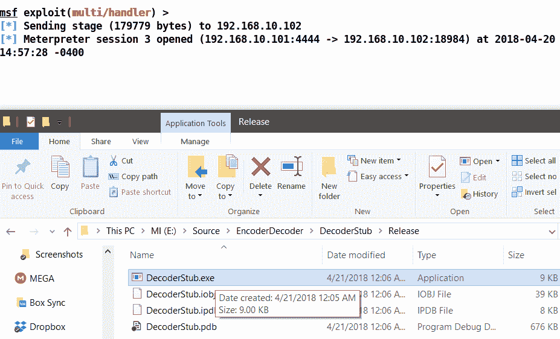
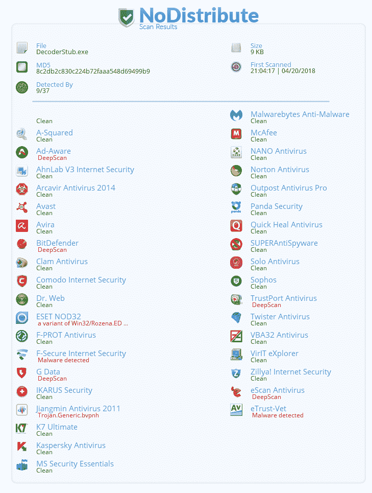
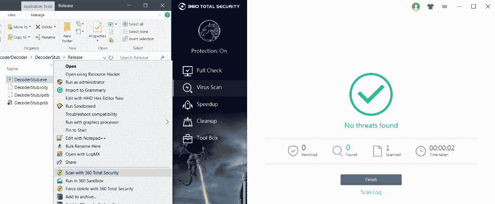
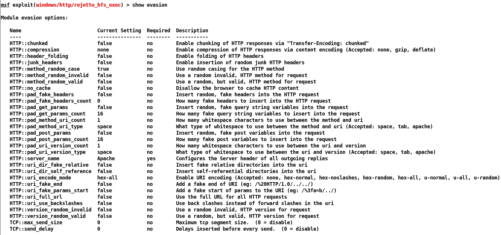
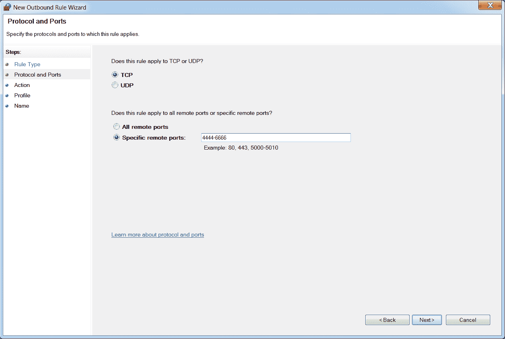
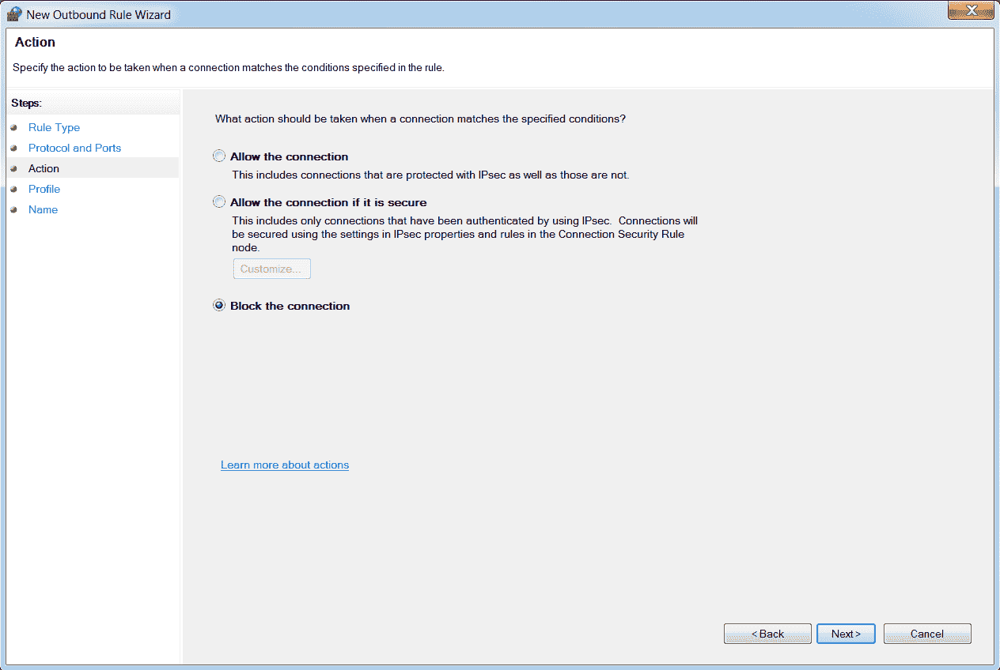
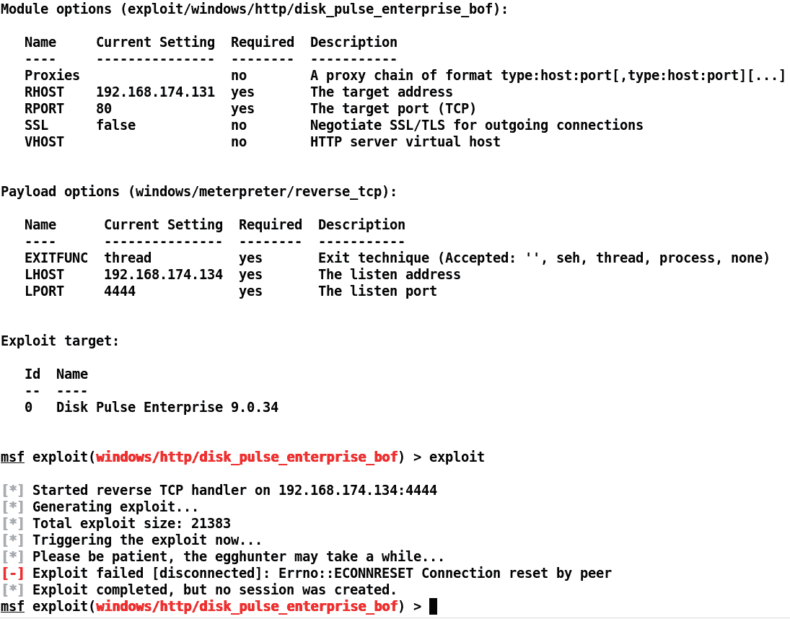
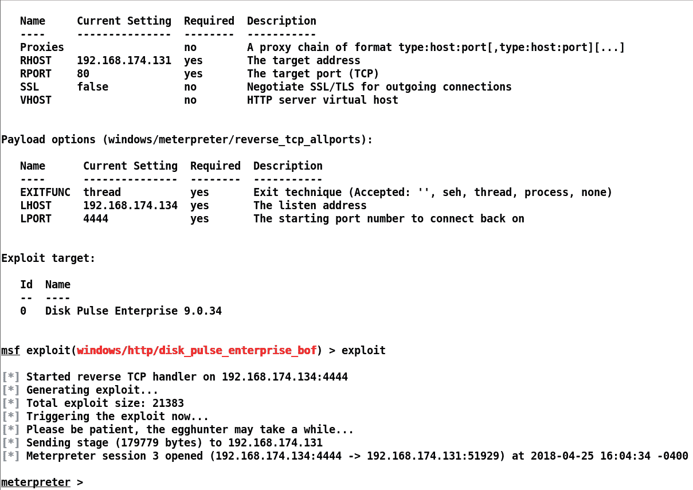

# Metasploit 的逃避

在过去的八章中，我们已经涵盖了渗透测试的主要阶段。在本章中，我们将包括渗透测试人员在现实场景中可能遇到的问题。过去的简单攻击可以在 Metasploit 中弹出一个 shell 的日子已经一去不复返。随着攻击面的增加，安全视角也逐渐增加。因此，需要巧妙的机制来规避各种性质的安全控制。在本章中，我们将探讨可以防止部署在目标端点的安全控制的不同方法和技术。在本章的整个过程中，我们将涵盖：

+   绕过 AV 检测 Meterpreter 负载

+   绕过 IDS 系统

+   绕过防火墙和被阻止的端口

所以，让我们开始逃避技术。

# 使用 C 封装和自定义编码器规避 Meterpreter

Meterpreter 是安全研究人员使用最广泛的负载之一。然而，由于其流行，大多数 AV 解决方案都会检测到它，并很快被标记。让我们使用 `msfvenom` 生成一个简单的 Metasploit 可执行文件，如下所示：

我们使用 `msfvenom` 命令创建了一个简单的反向 TCP Meterpreter 可执行后门。此外，我们已经提到了 `LHOST` 和 `LPORT`，然后是格式，即 PE/COFF 可执行文件的 EXE。我们还通过使用 `-b` 开关来防止空字符、换行和回车坏字符。我们可以看到可执行文件已成功生成。让我们将这个可执行文件移动到 `apache` 文件夹，并尝试在由 Windows Defender 和奇虎 360 杀毒软件保护的 Windows 10 操作系统上下载并执行它。但是，在运行之前，让我们按照以下方式启动匹配处理程序：

我们可以看到我们在端口 `4444` 上启动了一个匹配处理程序作为后台作业。让我们尝试在 Windows 系统上下载并执行 Meterpreter 后门，并检查是否能够获得反向连接：

哎呀！看起来 AV 甚至不允许文件下载。嗯，在普通 Meterpreter 负载后门的情况下，这是相当典型的。让我们快速计算 `Sample.exe` 文件的 MD5 哈希如下：

让我们检查一个流行的在线 AV 扫描器上的文件，比如 [`nodistribute.com/`](http://nodistribute.com/)，如下所示：

嗯！我们可以看到 27/37 个杀毒软件解决方案检测到了该文件。相当糟糕，对吧？让我们看看如何通过使用 C 编程和一点编码来规避这种情况。让我们开始吧。

# 在 C 中编写自定义 Meterpreter 编码器/解码器

为了规避目标的安全控制，我们将使用自定义编码方案，比如 XOR 编码，然后再加上一两种其他编码。此外，我们将不使用传统的 PE/COFF 格式，而是生成 shellcode 来解决问题。让我们像之前为 PE 格式那样使用 `msfvenom`。但是，我们将把输出格式改为 C，如下面的截图所示：

查看 `Sample.c` 文件的内容，我们有以下内容：

由于我们已经准备好 shellcode，我们将在 C 中构建一个编码器，它将使用我们选择的字节 `0xAA` 进行 XOR 编码，如下所示：

让我们看看如何创建一个 C 编码器程序，如下所示：

[PRE0]

这是一个直接的程序，我们将生成的 shellcode 复制到一个数组`buf[]`中，然后简单地迭代并对每个字节使用`0xAA`字节进行 Xor，并将其打印在屏幕上。编译和运行此程序将输出以下编码的有效负载：

现在我们有了编码的有效负载，我们需要编写一个解密存根可执行文件，它将在执行时将此有效负载转换为原始有效负载。解密存根可执行文件实际上将是交付给目标的最终可执行文件。要了解目标执行解密存根可执行文件时会发生什么，我们可以参考以下图表：

我们可以看到，在执行时，编码的 shellcode 被解码为其原始形式并执行。让我们编写一个简单的 C 程序来演示这一点，如下所示：

[PRE1]

再次，一个非常直接的程序；我们使用`VirtualAlloc`函数在调用程序的虚拟地址空间中保留空间。我们还使用`memcpy`将解码后的字节复制到`VirtualAlloc`指针保留的空间中。接下来，我们执行指针处保存的字节。所以，让我们测试一下我们的程序，看看它在目标环境中的运行情况。我们将按照相同的步骤进行；让我们找到程序的 MD5 哈希如下：

让我们尝试下载和执行程序如下：

下载没有问题！耶！这是一个正常的弹出窗口，显示文件未知；没有什么可担心的。让我们尝试执行文件，如下所示：

砰砰！我们成功获得了在 64 位 Windows 10 操作系统上运行奇虎 360 高级杀毒软件的目标的 Meterpreter 访问权限，完全受保护和补丁。让我们也在[`nodistribute.com/`](http://nodistribute.com/)上试一试：

我们可以看到，一些杀毒软件解决方案仍然将可执行文件标记为恶意软件。然而，我们的技术绕过了一些主要的参与者，包括 Avast、AVG、Avira、卡巴斯基、Comodo，甚至诺顿和麦克菲。其余的九个杀毒软件解决方案也可以通过一些技巧绕过，比如延迟执行、文件泵送等。让我们通过右键单击并使用奇虎 360 杀毒软件进行扫描来确认检查：

一切都没有问题！在整个过程中，我们看到了有效负载从可执行状态到 shellcode 形式的过程。我们看到了一个小型自定义解码器应用程序在绕过 AV 解决方案时的神奇效果。

# 使用 Metasploit 规避入侵检测系统

如果入侵检测系统存在，您在目标上的会话可能会很短暂。Snort，一种流行的 IDS 系统，可以在发现网络上的异常时生成快速警报。考虑以下利用启用了 Snort IDS 的目标的 Rejetto HFS 服务器的情况：

我们可以看到我们成功获得了 Meterpreter 会话。然而，右侧的图像显示了一些一级问题。我必须承认，Snort 团队和社区创建的规则非常严格，有时很难绕过。然而，为了最大限度地覆盖 Metasploit 规避技术，并为了学习的目的，我们创建了一个简单的规则来检测易受攻击的 HFS 服务器上的登录，如下所示：

[PRE2]

上述规则是一个简单的规则，建议如果来自外部网络的任何`GET`请求在 HTTP 端口上使用任何端口到目标网络，则必须显示消息。您能想到我们如何绕过这样一个标准规则吗？让我们在下一节讨论一下。

# 使用随机案例进行娱乐和利润

由于我们正在处理 HTTP 请求，我们可以始终使用 Burp repeater 来帮助快速测试。因此，让我们并排使用 Snort 和 Burp 进行一些测试：

我们可以看到，一旦我们向目标 URI 发送请求，它就会被记录到 Snort 中，这不是好消息。尽管如此，我们看到了规则，我们知道 Snort 试图将`GET`的内容与请求中的内容进行匹配。让我们尝试修改`GET`请求的大小写并重复请求如下：

没有生成新的日志！很好。我们刚刚看到了如何改变方法的大小写并愚弄一个简单的规则。但是，我们仍然不知道如何在 Metasploit 中实现这种技术。让我向你介绍规避选项：

我们可以看到有很多规避选项可供我们选择。我知道你已经猜到了这一点。但是，如果你没有，我们将在这里使用`HTTP::method_random_case`选项，并按以下方式重试利用：

让我们按以下方式利用目标：

我们很干净！是的！我们轻松地规避了规则。让我们在下一节中尝试一些更复杂的场景。

# 使用伪装目录来愚弄 IDS 系统

与以前的方法类似，我们可以在 Metasploit 中使用伪装目录来最终得出相同的结论。让我们看看以下规则集：

我们可以看到前面的 Snort 规则检查传入数据包中的`POST /script`内容。我们可以用多种方法做到这一点，但让我们使用一种新方法，即伪装目录关系。这种技术将在到达相同目录时添加以前的随机目录；例如，如果文件存在于`/Nipun/abc.txt`文件夹中，模块将使用类似`/root/whatever/../../Nipun/abc.txt`的内容，这意味着它使用了其他目录，最终又回到了相同的目录。因此，这使得 URL 足够长，以提高 IDS 的效率循环。让我们考虑一个例子。

在这个练习中，我们将使用 Jenkins `script_console`命令执行漏洞来利用运行在`192.168.1.149`上的目标，如下截图所示：

我们可以看到 Jenkins 运行在目标 IP `192.168.1.149`的端口`8888`上。让我们使用`exploit/multi/http/Jenkins_script_console module`来利用目标。我们已经设置了`RHOST`、`RPORT`和`TARGEURI`等选项。让我们来利用系统：

成功！我们可以看到我们轻松地获得了对目标的 Meterpreter 访问。让我们看看 Snort 为我们准备了什么：

看起来我们刚刚被发现了！让我们在 Metasploit 中设置以下规避选项：

现在让我们重新运行利用程序，看看 Snort 中是否有任何信息：

Snort 中没有任何信息！让我们看看我们的利用进行得如何：

不错！我们再次规避了 Snort！随意尝试所有其他 Snort 规则，以更好地了解幕后的运作方式。

# 绕过 Windows 防火墙封锁的端口

当我们尝试在 Windows 目标系统上执行 Meterpreter 时，可能永远无法获得 Meterpreter 访问。这在管理员封锁了系统上的特定端口时很常见。在这个例子中，让我们尝试用一个聪明的 Metasploit 有效载荷来规避这种情况。让我们快速设置一个场景如下：

我们可以看到我们已经设置了一个新的防火墙规则，并指定了端口号`4444-6666`。继续下一步，我们将选择阻止这些出站端口，如下面的屏幕截图所示：

让我们检查防火墙状态和我们的规则：

我们可以看到规则已经设置，并且我们的防火墙在家庭和公共网络上都已启用。考虑到我们在目标上运行了 Disk Pulse Enterprise 软件。我们已经在前几章中看到我们可以利用这个软件。让我们尝试执行利用：

我们可以看到利用确实运行了，但我们没有访问目标，因为防火墙在端口`4444`上阻止了我们。

# 在所有端口上使用反向 Meterpreter

为了规避这种情况，我们将使用`windows/meterpreter/reverse_tcp_allports`有效载荷，它将尝试每个端口，并为我们提供对未被阻止的端口的访问。此外，由于我们只在端口`4444`上监听，我们需要将所有随机端口的流量重定向到我们端口`4444`。我们可以使用以下命令来实现：

让我们再次使用反向`tcp meterpreter`有效载荷在所有端口上执行利用：

我们可以看到我们轻松地获得了对目标的 Meterpreter 访问。我们规避了 Windows 防火墙并获得了 Meterpreter 连接。这种技术在管理员对入站和出站端口采取积极态度的情况下非常有益。

此时，您可能会想知道前面的技术是否很重要，对吗？或者，您可能会感到困惑。让我们在 Wireshark 中查看整个过程，以了解数据包级别的情况：

我们可以看到最初，来自我们 kali 机器的数据被发送到端口`80`，导致缓冲区溢出。一旦攻击成功，目标系统与端口`6667`（在被阻止的端口范围之后的第一个端口）建立了连接。此外，由于我们将所有端口从`4444-7777`路由到端口`4444`，它被路由并最终回到端口`4444`，我们获得了 Meterpreter 访问权限。

# 总结和练习

在本章中，我们学习了使用自定义编码器的 AV 规避技术，我们绕过了 IDS 系统的签名匹配，还使用了所有 TCP 端口 Meterpreter 有效载荷避开了 Windows 防火墙封锁的端口。

您可以尝试以下练习来增强您的规避技能：

+   尝试延迟有效载荷的执行，而不使用解码器中的`sleep()`函数，并分析检测比率的变化

+   尝试使用其他逻辑操作，如 NOT，双重 XOR，并使用简单的密码，如 ROT 与有效载荷

+   绕过至少 3 个 Snort 签名并修复它们

+   学习并使用 SSH 隧道来绕过防火墙

下一章将大量依赖这些技术，并深入探讨 Metasploit。
