# 秘密特工的 Metasploit

本章介绍了执法机构将主要使用的各种技术。本章讨论的方法将扩展 Metasploit 的用途到监视和攻击性网络行动。在本章中，我们将探讨：

+   保持匿名的程序

+   在有效负载中使用混淆

+   使用 APT 技术实现持久性

+   从目标中获取文件

+   Python 在 Metasploit 中的力量

# 在 Meterpreter 会话中保持匿名性

作为执法人员，建议您在整个命令和控制会话中保持匿名性。然而，大多数执法机构使用 VPS 服务器来进行命令和控制软件，这是很好的，因为它们在其端点内引入了代理隧道。这也是执法人员可能不使用 Metasploit 的另一个原因，因为在您和目标之间添加代理是微不足道的。

让我们看看如何规避这种情况，使 Metasploit 不仅可用，而且成为执法机构的首选。考虑以下情景：

我们可以看到图中有三个公共 IP。我们的目标是`106.215.26.19`，我们的 Metasploit 实例正在`185.91.2xx.xxx`上的端口`8443`上运行。我们可以利用 Metasploit 的强大功能，在这里生成一个反向 HTTPS 有效负载，该有效负载提供了内置的代理服务。让我们创建一个简单的代理有效负载，如下面的屏幕截图所示：

我们可以看到，我们已经将`HTTPProxyHost`和`HTTPProxyPort`设置为我们的代理服务器，该服务器是运行 CCProxy 软件的基于 Windows 的操作系统，如下面的屏幕截图所示：

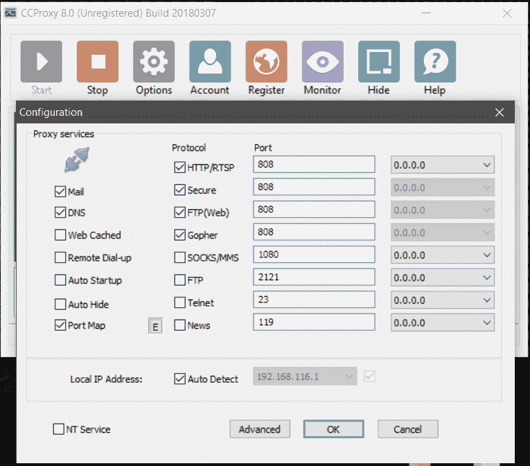

CCProxy 软件是 Windows 的代理服务器软件。我们可以轻松配置端口，甚至进行身份验证。通常最好实施身份验证，以便没有人可以在没有正确凭据的情况下使用您的代理。您可以在使用`HttpProxyPass`和`HttpProxyUser`选项生成有效负载时定义凭据。接下来，我们需要在`185.92.2xx.xxx`服务器上启动处理程序，如下面的屏幕截图所示：

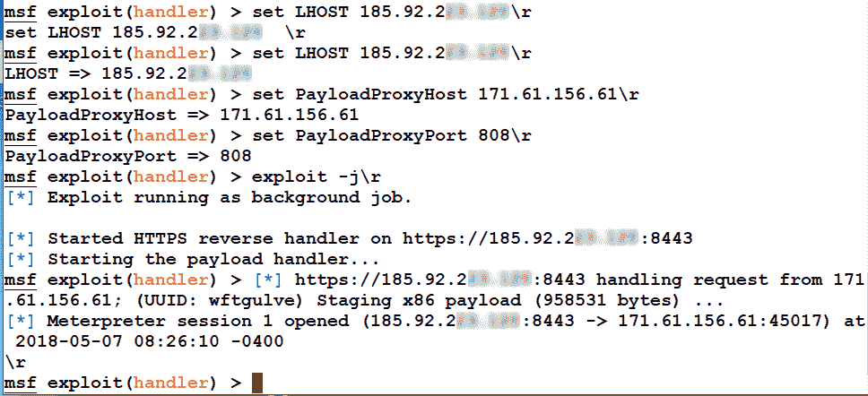

太棒了！我们可以看到我们很快就访问了我们的代理服务器。这意味着我们不再需要将我们的 Metasploit 设置从一个服务器移动到另一个服务器；我们可以有一个中间代理服务器，可以随时更改。让我们检查处理程序服务器上的流量，并检查我们是否从目标处获得任何直接命中：

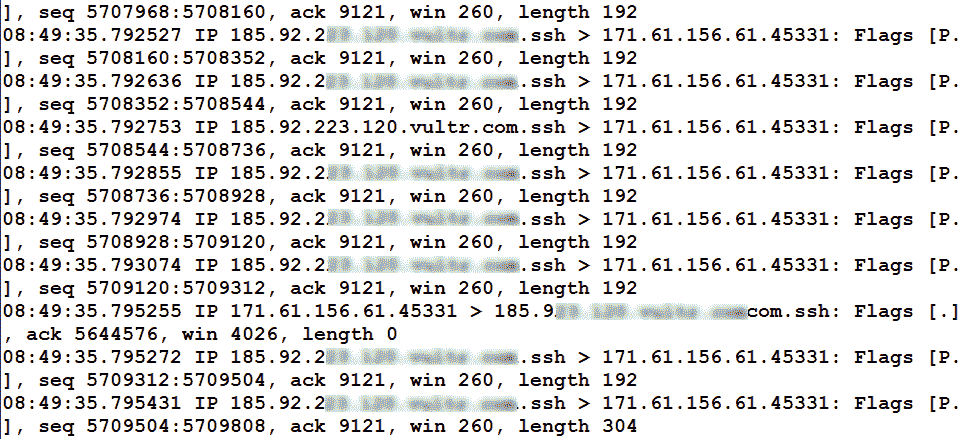

不。我们从代理服务器得到了所有命中。我们刚刚看到了如何使用中间代理服务器对我们的 Metasploit 端点进行匿名化。

# 利用常见软件中的漏洞保持访问

DLL 搜索顺序劫持/DLL 植入技术是我最喜欢的持久性获取方法之一，可以在长时间访问中躲避管理员的监视。让我们在下一节中讨论这种技术。

# DLL 搜索顺序劫持

顾名思义，DLL 搜索顺序劫持漏洞允许攻击者劫持程序加载的 DLL 的搜索顺序，并使他们能够插入恶意 DLL 而不是合法的 DLL。

大多数情况下，一旦执行软件，它将在当前文件夹和`System32`文件夹中查找 DLL 文件。然而，有时在当前目录中找不到 DLL 时，它们会在`System32`文件夹中搜索，而不是直接从`System32`加载它们。攻击者可以利用这种情况，在当前文件夹中放置一个恶意 DLL 文件，并劫持本来应该直接从`System32`加载 DLL 的流程。让我们通过下面的图示来理解这一点：

从前面的图表中，我们可以看到一个应用程序一旦执行，就会加载三个 DLL 文件，分别是 xx1、xx2 和 xx3。但是，它还会搜索一个当前目录中不存在的`yy1.dll`文件。在当前文件夹中找不到`yy1.dll`意味着程序将从`System32`文件夹跳转到`yy1.dll`。现在，假设攻击者将一个名为`yy1.dll`的恶意 DLL 文件放入应用程序的当前文件夹。执行将永远不会跳转到`System32`文件夹，并且将加载恶意植入的 DLL 文件，认为它是合法的。这些情况最终将为攻击者提供一个看起来很漂亮的 Meterpreter shell。因此，让我们尝试在标准应用程序（如 VLC 播放器）上进行如下操作：

让我们创建一个名为`CRYPTBASE.dll`的 DLL 文件。CryptBase 文件是大多数应用程序随附的通用文件。但是，VLC 播放器应该直接从 System32 引用它，而不是从当前目录引用它。为了劫持应用程序的流程，我们需要将此文件放在 VLC 播放器的程序文件目录中。因此，检查将不会失败，并且永远不会转到 System32。这意味着这个恶意的 DLL 将执行，而不是原始的 DLL。假设我们在目标端有一个 Meterpreter，并且我们可以看到 VLC 播放器已经安装：

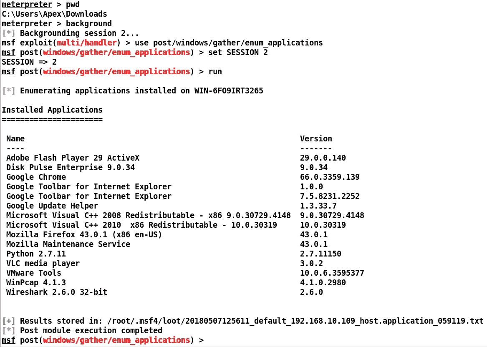

让我们浏览到 VLC 目录并将这个恶意的 DLL 上传到其中：

我们可以看到我们在目录上使用了`cd`并上传了恶意的 DLL 文件。让我们快速为我们的 DLL 生成一个处理程序：

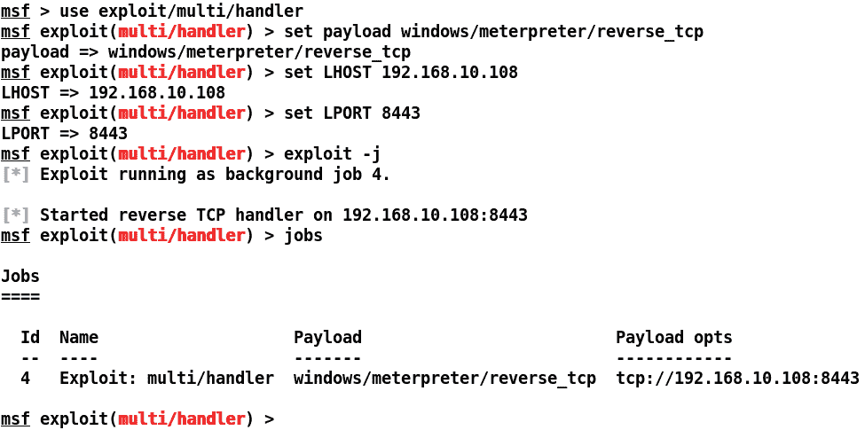

我们已经准备好了。一旦有人打开 VLC 播放器，我们就会得到一个 shell。让我们尝试代表用户执行 VLC 播放器如下：

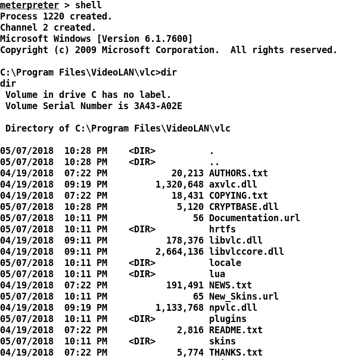

我们可以看到我们的 DLL 已成功放置在文件夹中。让我们通过 Meterpreter 运行 VLC 如下：

哇！我们可以看到，一旦我们执行了`vlc.exe`，我们就得到了另一个 shell。因此，我们现在可以控制系统，以便一旦有人执行 VLC，我们肯定会得到一个 shell。但是等等！让我们看看目标方面，看看一切是否顺利进行：

目标端看起来不错，但没有 VLC 播放器。我们需要以某种方式生成 VLC 播放器，因为损坏的安装可能很快被替换/重新安装。VLC 播放器崩溃是因为它无法从`CRYPTBASE.DLL`文件中加载正确的函数，因为我们使用了恶意 DLL 而不是原始 DLL 文件。为了解决这个问题，我们将使用后门工厂工具来设置原始 DLL 文件的后门，并使用它来代替普通的 Meterpreter DLL。这意味着我们的后门文件将恢复 VLC 播放器的正常功能，并为我们提供对系统的访问权限。

# 使用代码洞藏隐藏后门

当后门被隐藏在程序可执行文件和库文件的空闲空间中时，通常会使用代码挖掘技术。该方法掩盖了通常位于空内存区域内的后门，然后修补了二进制文件，使其从后门开始运行。让我们按照以下方式修补 CryptBase DLL 文件：

后门工厂随 Kali Linux 一起提供。我们使用`-f`开关定义要设置后门的 DLL 文件，使用`-S`开关指定有效载荷。`-H`和`-P`表示主机和端口，而`-o`开关指定输出文件。

`-Z`开关表示跳过可执行文件的签名过程。

一旦后门进程开始，我们将看到以下屏幕：

我们可以看到后门工厂工具正在尝试在具有长度为`343`或更长的 DLL 中找到代码洞。让我们看看我们得到了什么：

太棒了！我们得到了三个不同的代码洞，可以放置我们的 shellcode。让我们选择任意一个，比如说，第三个：

我们可以看到 DLL 现在已经被植入后门并修补，这意味着 DLL 的入口点现在将指向我们在`.reloc`部分中的 shellcode。我们可以将此文件放在易受攻击软件的`Program Files`目录中，这在我们的案例中是 VLC，并且它将开始执行，而不是像我们在前一节中看到的那样崩溃，这为我们提供了对机器的访问。

# 从目标系统中收集文件

在 Metasploit 中使用文件扫描功能非常简单。`enum_files`后渗透模块有助于自动化文件收集服务。让我们看看如何使用它：

我们可以看到我们使用了`enum_files`后渗透模块。我们使用`FILE_GLOBS`作为`*.docx OR *.pdf OR *.xlsx`，这意味着搜索将发生在这三种文件格式上。接下来，我们只需将会话 ID 设置为`5`，这只是我们的会话标识符。我们可以看到，一旦我们运行了模块，它就会自动收集搜索期间找到的所有文件并下载它们。

# 使用毒液进行混淆

在上一章中，我们看到了如何使用自定义编码器击败 AV。让我们再进一步谈谈 Metasploit 有效载荷中的加密和混淆；我们可以使用一个名为**venom**的强大工具。让我们创建一些加密的 Meterpreter shellcode，如下截图所示：

一旦在 Kali Linux 中启动毒液，您将看到前面截图中显示的屏幕。毒液框架是 Pedro Nobrega 和 Chaitanya Haritash（**Suspicious-Shell-Activity**）的创意作品，他们致力于简化各种操作系统的 shellcode 和后门生成。让我们按*Enter*继续：

正如我们所看到的，我们有各种操作系统的创建有效载荷的选项，甚至有创建多操作系统有效载荷的选项。让我们选择`2`来选择`Windows-OS 有效载荷`：

我们将看到在基于 Windows 的操作系统上支持多个代理。让我们选择代理编号`16`，这是 C 和 Python 的组合，并带有 UUID 混淆。接下来，我们将看到输入本地主机的选项，如下截图所示：

添加后，我们将获得类似的选项来添加 LPORT、有效载荷和输出文件的名称。我们将选择`443`作为 LPORT，有效载荷为`reverse_winhttps`，以及任何合适的名称如下：

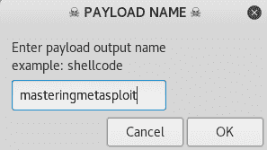

接下来，我们将看到生成过程开始，并且我们将有选择可执行文件图标的选项：

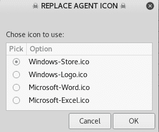

毒液框架还将为生成的可执行文件启动匹配处理程序，如下截图所示：

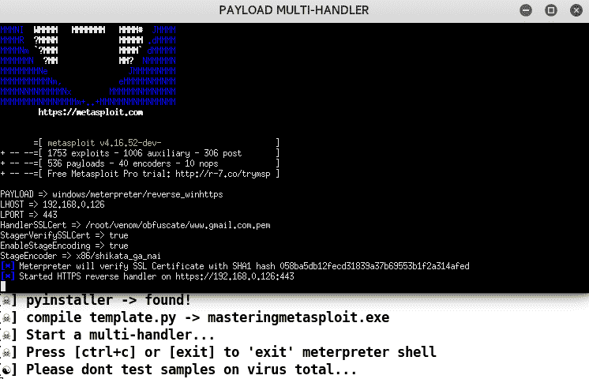

一旦文件在目标上执行，我们将得到以下结果：

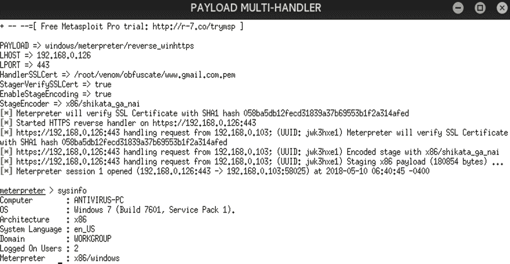

我们轻松地获得了访问权限。但我们可以看到毒液工具已经实现了最佳实践，例如使用来自 Gmail 的 SSL 证书、分段和用于通信的`shikata_ga_nai`编码器。让我们在[`virscan.org/`](http://virscan.org/)上扫描二进制文件如下：

我们可以看到检测几乎可以忽略不计，只有一个杀毒软件扫描器将其检测为后门。

# 使用反取证模块覆盖痕迹

Metasploit 确实提供了许多功能来覆盖痕迹。但是，从取证的角度来看，它们仍然可能缺乏一些核心领域，这些领域可能会揭示有关攻击的活动和有用信息。互联网上有许多模块，这些模块倾向于提供自定义功能。其中一些模块会成为核心 Metasploit 存储库的一部分，而另一些则会被忽视。我们将要讨论的模块是一个提供大量功能的反取证模块，例如清除事件日志、清除日志文件、操纵注册表、.lnk 文件、.tmp、.log、浏览器历史、**预取文件**（**.pf**）、最近文档、ShellBags、Temp/最近文件夹，以及还原点。该模块的作者 Pedro Nobrega 在识别取证证据方面进行了大量工作，并创建了这个模块，考虑到取证分析。我们可以从[`github.com/r00t-3xp10it/msf-auxiliarys/blob/master/windows/auxiliarys/CleanTracks.rb`](https://github.com/r00t-3xp10it/msf-auxiliarys/blob/master/windows/auxiliarys/CleanTracks.rb)获取此模块，并使用`loadpath`命令在 Metasploit 中加载此模块，就像我们在前几章中所做的那样，或者将文件放在`post/windows/manage`目录中。让我们看看在运行此模块时需要启用哪些功能：

我们可以看到我们在模块上启用了`CLEANER`、`DEL_LOGS`和`GET_SYS`。让我们看看当我们执行此模块时会发生什么：

我们可以看到我们的模块运行正常。让我们看看它执行的操作如下：

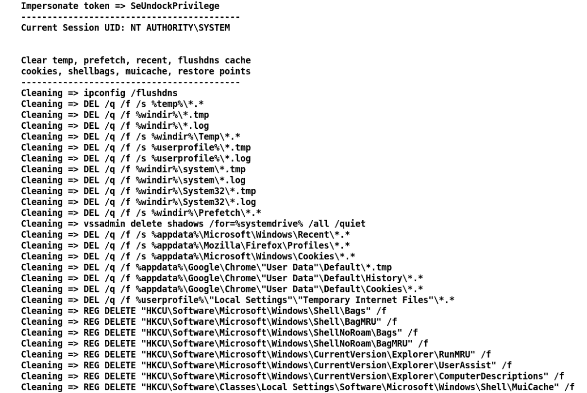

我们可以看到目标系统中的日志文件、临时文件和 shellbags 已被清除。为了确保模块已经充分工作，我们可以看到以下截图，显示了模块执行前的大量日志：

一旦模块被执行，系统中日志的状态发生了变化，如下截图所示：

除了我们在前面的截图中看到的部分，该模块的精选选项还包括：

`DIR_MACE` 选项接受任何目录作为输入，并修改其中存在的内容的修改、访问和创建时间戳。`PANIC` 选项将格式化 NTFS 系统驱动器，因此这可能很危险。`REVERT` 选项将为大多数策略设置默认值，而 `PREVENT` 选项将尝试通过在系统中设置这些值来避免日志记录，从而防止在目标上创建日志和生成数据。这是最受欢迎的功能之一，特别是在执法方面。

# 总结

在本章中，我们看了一些专门的工具和技术，可以帮助执法机构。然而，所有这些技术必须小心实践，因为特定的法律可能会限制您在执行这些练习时。尽管如此，在本章中，我们介绍了如何代理 Meterpreter 会话。我们研究了获得持久性的 APT 技术，从目标系统中收集文件，使用毒液来混淆有效载荷，以及如何使用 Metasploit 中的反取证第三方模块来覆盖痕迹。

尝试以下练习：

+   一旦官方修复，尝试使用 Metasploit 聚合器

+   完成代码洞练习，并尝试将合法的 DLL 绑定到有效载荷，而不会使原始应用程序崩溃

+   构建自己的后渗透模块，用于 DLL 植入方法

在接下来的章节中，我们将转向臭名昭著的 Armitage 工具，并尝试设置红队环境，同时充分利用 Armitage 的自定义脚本。
