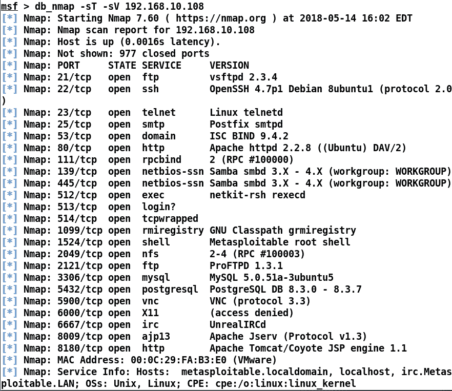
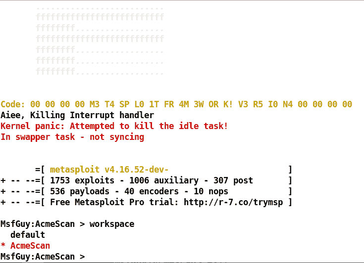
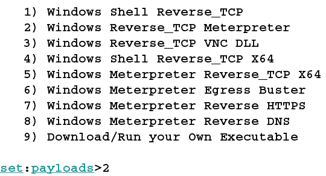

# 技巧和窍门

在本书中，我们讨论了许多围绕 Metasploit 的技术和方法。从利用开发到脚本化 Armitage，我们涵盖了所有内容。然而，为了在 Metasploit 中实现最佳实践，我们必须了解一些技巧和窍门，以充分利用 Metasploit 框架。在本章中，我们将介绍一些快速技巧和脚本，这些将有助于使用 Metasploit 进行渗透测试。在本章中，我们将涵盖以下主题：

+   自动化脚本

+   第三方插件

+   备忘单

+   最佳实践

+   使用简写命令节省时间

因此，让我们深入探讨这最后一章，并学习一些很酷的技巧和窍门。

# 使用 Minion 脚本进行自动化

我在 GitHub 上随机查找自动化脚本时发现了这个宝藏脚本。Minion 是 Metasploit 的一个插件，对于快速利用和扫描非常有用。可以从[`github.com/T-S-A/Minion`](https://github.com/T-S-A/Minion)下载 Metasploit 的`minion`插件。

下载文件后，将其复制到`~/.msf4/plugins`目录，并启动`msfconsole`：

在前几章中，我们看到了如何使用 load 命令快速加载插件到 Metasploit。同样，让我们使用`load minion`命令加载`minion`插件，如前面的截图所示。加载成功后，切换到您一直在工作的工作区，或者如果工作区中没有主机，则执行 Nmap 扫描：

因为`db_nmap`扫描已经填充了大量结果，让我们看看启用了哪些`minion`选项可以使用：

丰富！我们可以看到目标主机上有 MySQL 服务。让我们使用`mysql_enum`命令如下：

哇！我们从未加载过模块，填写过任何选项，或者启动过模块，因为`minion`插件已经为我们自动化了。我们可以看到目标主机的 MySQL 版本。让我们使用`minion`的 MySQL 攻击命令如下：

太棒了！Minion 插件为我们自动化了暴力攻击，结果成功登录到目标，用户名为 root，密码为空。脚本的美妙之处在于您可以编辑和自定义它，并添加更多模块和命令，这也将帮助您开发 Metasploit 的插件。

# 使用 Netcat 进行连接

Metasploit 提供了一个名为`connect`的很棒的命令，提供类似 Netcat 实用程序的功能。假设系统 shell 正在等待我们在目标系统的某个端口上连接，并且我们不想从 Metasploit 控制台切换。我们可以使用`connect`命令与目标连接，如下截图所示：

我们可以看到我们在 Metasploit 框架内部初始化了与监听器的连接，这可能在接收反向连接时很有用，其中初始访问并非通过 Metasploit 获得。

# Shell 升级和后台会话

有时，我们不需要即时与受损主机进行交互。在这种情况下，我们可以指示 Metasploit 在利用服务后立即将新创建的会话放入后台，使用`-z`开关，如下所示：

正如我们所看到的，我们已经打开了一个命令 shell，拥有类似 Meterpreter 提供的更好控制访问总是令人满意的。在这种情况下，我们可以使用`-u`开关升级会话，如下截图所示：

太棒了！我们刚刚将我们的 shell 更新为 Meterpreter shell，并更好地控制了目标。

# 命名约定

在一个庞大的渗透测试场景中，我们可能会得到大量的系统和 Meterpreter shell。在这种情况下，最好为所有 shell 命名以便于识别。考虑以下情景：

我们可以使用`-n`开关为 shell 命名，如下面的屏幕截图所示：

如前面的屏幕截图所示，命名看起来更好，更容易记住。

# 更改提示符并使用数据库变量

在您喜欢的渗透测试框架上工作并拥有您的提示符是多么酷？非常容易，我会说。要在 Metasploit 中设置您的提示符，您只需要将提示符变量设置为您选择的任何内容。撇开乐趣，假设您倾向于忘记当前使用的工作区，您可以使用数据库变量`%W`的提示符，以便轻松访问，如下面的屏幕截图所示：

此外，您始终可以像下面的屏幕截图中所示的那样做一些事情：

我们可以看到，我们已经使用`%D`显示当前本地工作目录，`%H`表示主机名，`%J`表示当前运行的作业数，`%L`表示本地 IP 地址（非常方便），`%S`表示我们拥有的会话数，`%T`表示时间戳，`%U`表示用户名，`%W`表示工作区。

# 在 Metasploit 中保存配置

大多数时候，我忘记切换到为特定扫描创建的工作区，最终将结果合并到默认工作区中。但是，使用 Metasploit 中的`save`命令可以避免这样的问题。假设您已经切换了工作区并自定义了提示符和其他内容。您可以使用`save`命令保存配置。这意味着下次启动 Metasploit 时，您将得到与上次相同的参数和工作区，如下面的屏幕截图所示：

让我们启动 Metasploit，看看我们上一个会话中的所有内容是否成功保存：

是的！一切都已在配置文件中收集。从现在开始，不再频繁切换工作区，再也不会有麻烦了。

# 使用内联处理程序和重命名作业

Metasploit 提供了使用`handler`命令快速设置处理程序的方法，如下面的屏幕截图所示：

我们可以看到，我们可以使用`-p`开关来定义有效载荷，使用`-H`和`-P`开关来定义主机和端口。运行处理程序命令将快速生成一个处理程序作为后台作业。说到后台作业，它们也可以使用`rename_job`命令进行重命名，如下面的屏幕截图所示：

# 在多个 Meterpreter 上运行命令

是的！我们可以使用`sessions`命令的`-c`开关在多个打开的 Meterpreter 会话上运行 Meterpreter 命令，如下面的屏幕截图所示：

我们可以看到，Metasploit 已经智能地跳过了一个非 Meterpreter 会话，并且我们已经使命令在所有 Meterpreter 会话上运行，如前面的屏幕截图所示。

# 自动化社会工程工具包

**社会工程工具包**（**SET**）是一组基于 Python 的工具，针对渗透测试的人为方面。我们可以使用 SET 执行钓鱼攻击，网页劫持攻击，涉及受害者重定向的攻击，声称原始网站已经移动到其他地方，基于文件格式的利用，针对特定软件进行受害者系统的利用，以及许多其他攻击。使用 SET 的最好之处在于菜单驱动的方法，可以在很短的时间内设置快速的利用向量。

SET 的教程可以在以下网址找到：[`www.social-engineer.org/framework/se-tools/computer-based/social-engineer-toolkit-set/`](https://www.social-engineer.org/framework/se-tools/computer-based/social-engineer-toolkit-set/)。

SET 在生成客户端利用模板方面非常快速。但是，我们可以使用自动化脚本使其更快。让我们看一个例子：

在前面的屏幕截图中，我们向`seautomate`工具提供了`se-script`，结果是生成了有效载荷并自动设置了利用处理程序。让我们更详细地分析`se-script`：

您可能想知道脚本中的数字如何调用有效载荷生成和利用处理程序设置过程。

正如我们之前讨论的，SET 是一个菜单驱动的工具。因此，脚本中的数字表示菜单选项的 ID。让我们将整个自动化过程分解为更小的步骤。

脚本中的第一个数字是`1`。因此，在处理`1`时选择了`社会工程攻击`选项：

脚本中的下一个数字是`4`。因此，选择了`创建有效载荷和监听器`选项，如下面的屏幕截图所示：

接下来的数字是`2`，表示有效载荷类型为`Windows Reverse_TCP Meterpreter`，如下面的屏幕截图所示：

接下来，我们需要在脚本中指定监听器的 IP 地址，即`192.168.10.103`。这可以手动可视化：

在下一个命令中，我们有`4444`，这是监听器的端口号：

我们在脚本中有`yes`作为下一个命令。脚本中的`yes`表示监听器的初始化：

一旦我们提供`yes`，控制就会转移到 Metasploit，并且利用反向处理程序会自动设置，如下面的屏幕截图所示：

我们可以像之前讨论的那样以类似的方式自动化 SET 中的任何攻击。在为客户端利用生成定制的有效载荷时，SET 节省了大量时间。但是，使用`seautomate`工具，我们使其变得超快。

# Metasploit 和渗透测试的备忘单

您可以在以下链接找到有关 Metasploit 的一些优秀的备忘单：

+   [`www.sans.org/security-resources/sec560/misc_tools_sheet_v1.pdf`](https://www.sans.org/security-resources/sec560/misc_tools_sheet_v1.pdf)

+   [`null-byte.wonderhowto.com/how-to/hack-like-pro-ultimate-command-cheat-sheet-for-metasploits-meterpreter-0149146/`](https://null-byte.wonderhowto.com/how-to/hack-like-pro-ultimate-command-cheat-sheet-for-metasploits-meterpreter-0149146/)

+   [`null-byte.wonderhowto.com/how-to/hack-like-pro-ultimate-list-hacking-scripts-for-metasploits-meterpreter-0149339/`](https://null-byte.wonderhowto.com/how-to/hack-like-pro-ultimate-list-hacking-scripts-for-metasploits-meterpreter-0149339/)

有关渗透测试的更多信息，请参考 SANS 海报[`www.sans.org/security-resources/posters/pen-testing`](https://www.sans.org/security-resources/posters/pen-testing)，并参考[`github.com/coreb1t/awesome-pentest-cheat-sheets`](https://github.com/coreb1t/awesome-pentest-cheat-sheets)获取有关渗透测试工具和技术的大多数备忘单。

# 进一步阅读

在本书中，我们以实用的方式涵盖了 Metasploit 和其他相关主题。我们涵盖了利用开发、模块开发、在 Metasploit 中移植利用、客户端攻击、基于服务的渗透测试、规避技术、执法机构使用的技术以及 Armitage。我们还深入了解了 Ruby 编程和 Armitage 中的 Cortana 的基础知识。

阅读完本书后，您可能会发现以下资源提供了有关这些主题的更多详细信息：

+   要学习 Ruby 编程，请参阅：[`ruby-doc.com/docs/ProgrammingRuby/`](http://ruby-doc.com/docs/ProgrammingRuby/)

+   有关汇编语言编程，请参阅：[`github.com/jaspergould/awesome-asm`](https://github.com/jaspergould/awesome-asm)

+   有关利用开发，请参阅：[`www.corelan.be/`](https://www.corelan.be/)

+   有关 Metasploit 开发，请参阅：[`github.com/rapid7/metasploit-framework/wiki`](https://github.com/rapid7/metasploit-framework/wiki)

+   有关基于 SCADA 的利用，请参阅：[`scadahacker.com/`](https://scadahacker.com/)

+   有关 Metasploit 的深入攻击文档，请参阅：[`www.offensive-security.com/metasploit-unleashed/`](https://www.offensive-security.com/metasploit-unleashed/)

+   有关 Cortana 脚本的更多信息，请参阅：[`www.fastandeasyhacking.com/download/cortana/cortana_tutorial.pdf`](http://www.fastandeasyhacking.com/download/cortana/cortana_tutorial.pdf)

+   有关 Cortana 脚本资源，请参阅：[`github.com/rsmudge/cortana-scripts`](https://github.com/rsmudge/cortana-scripts)
