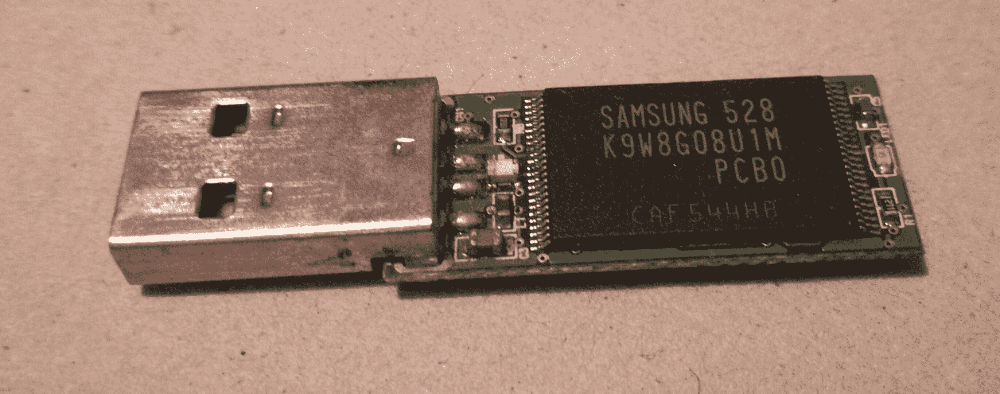
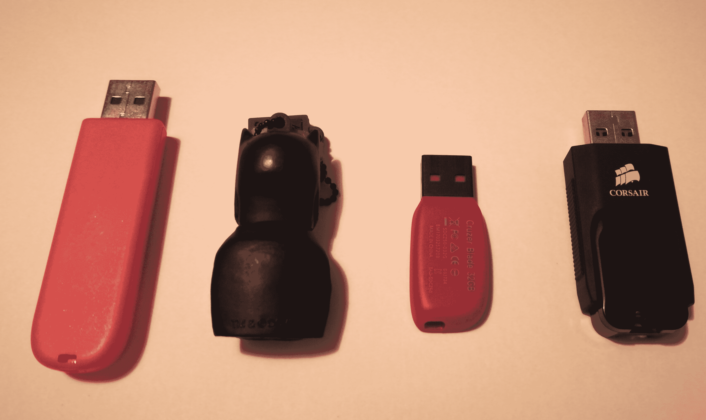
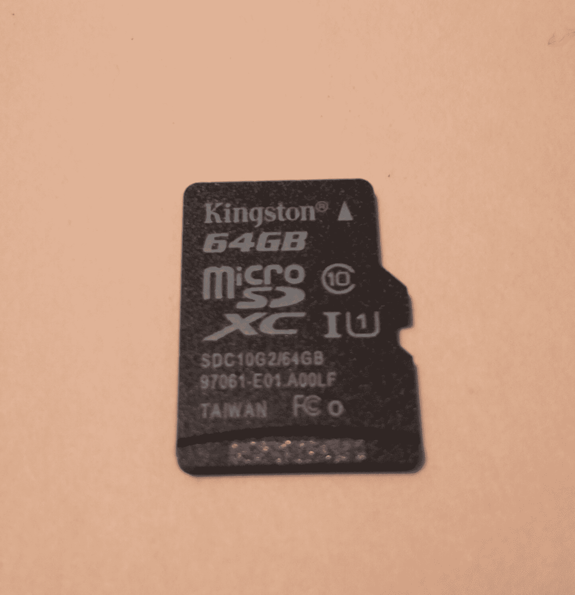
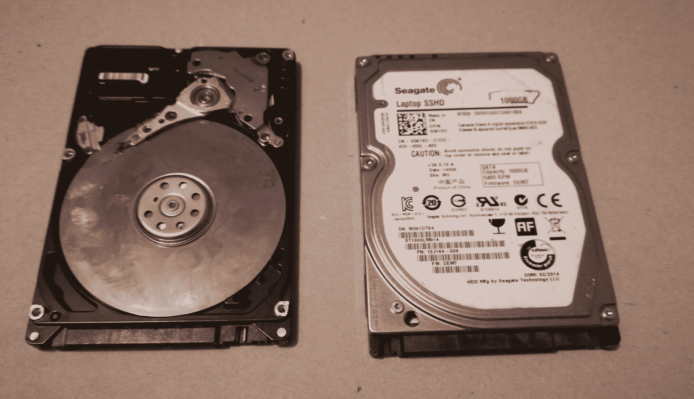
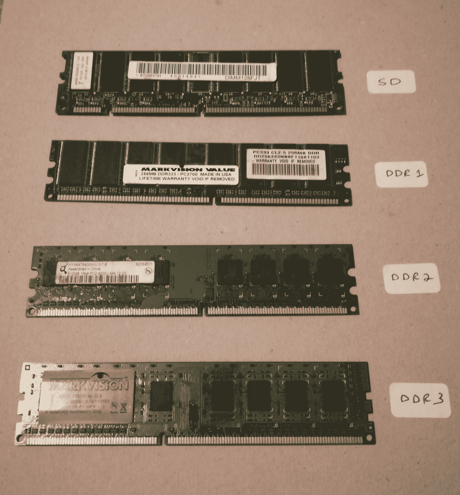

# 了解文件系统和存储介质

成为数字取证调查员需要的不仅仅是技术知识。案件本身还需要大量的研究、流程和分析。想象一下，你需要建造一座房子。当然，我们需要木材、钉子、水泥、金属、玻璃和所有其他原材料，我们还需要熟练的劳工和承包商来建造结构并将其组装在一起。除了材料、工具和资源之外，我们还需要进行研究，以确保我们了解这个项目成功所需的一切。

例如，我们必须获得建筑许可证，进行土壤分析，考虑天气，然后根据天气、位置、土壤类型等选择材料。毫无疑问，必须对该领域的基本概念有所了解，才能有效地完成任务。同样，我们需要了解文件系统、操作系统、数据类型和位置，以及保留数据、存储介质和一般证据的方法和程序。

在本章中，我们将学习以下主题：

+   存储介质的历史

+   文件系统和操作系统

+   数据呢？

+   数据的易失性

+   页面文件及其在数字取证中的重要性

# 存储介质

任何调查的最终结果都是证明某事是否存在或发生过。在笔记本电脑、台式机、移动设备和智能设备中，数据必须存储在某个地方，即使只是暂时的。我们大多数人可能熟悉笔记本电脑、台式机、移动设备等中的硬盘驱动器，但我们也需要关注可移动和便携式存储设备。这些包括 DVD、便携式驱动器、拇指或闪存驱动器、SD 和 microSD 卡，以及旧的介质，如 CD 和软盘等等。

我们还应该考虑，许多便携式闪存驱动器以新奇的形状和大小作为特色商品出现，可能不像普通的矩形驱动器那样。另一个需要考虑的问题是，这些存储介质设备多年来尺寸发生了变化，可能变得更小，通常是由于技术的进步。

# IBM 和存储介质的历史

在没有提到三个字母**IBM**的情况下，关于硬盘驱动器和存储介质的历史，就不可能有任何故事、日志、书籍，甚至讨论。我们都熟悉这个著名的科技巨头，但我们可能并不熟悉它的一些伟大成就。

**国际商用机器公司**，或者我们所知道的**IBM**，已经存在了相当长的时间。在 20 世纪初被称为**计算-制表-记录公司**（或**CTR**），IBM 更为人所知的是建造了第一台硬盘驱动器、第一台个人电脑、其服务器、台式机和笔记本电脑。

在 1956 年和 1957 年之间，IBM 在 305 RAMAC（**随机存取会计和控制方法**的缩写）的开发和发布方面取得了重大进展，该设备采用了第一代磁盘存储技术。这项革命性的技术重达约一吨，大约有 16 平方英尺大小。然而，这个庞然大物的磁盘容量只有 5 MB（兆字节 - 是的，我说的是*兆字节*）。

尽管按照今天的标准，5 MB 大约是使用移动设备拍摄的高清照片的大小，但总的来说，这确实是当时一个巨大的成就。在 IBM 的发明之前，数据是存储在可以达到数百万张卡的打孔卡上，只能容纳几兆字节的数据。

当时引入这种数字存储的一个主要问题是设备的大小。对于许多人来说，飞机和卡车运输可能不是一个选择；存储这些设备的空间也可能是一个问题。

随着技术的进步，IBM 在 1975 年宣布了一款更加便携的计算机，名为 IBM 5100 便携式计算机。在 1980 年代，特别是 1981 年，我们看到了 IBM 个人电脑的诞生。这款便携式计算机比前任轻得多，价格也更加实惠，介于 8000 至 20000 美元之间。

直到 1981 年 IBM 发布了第一台个人电脑，计算机的便携性才真正成为现实。售价为 1565 美元，用户可以获得键盘和鼠标，并可选择监视器、打印机和软盘驱动器。除了软盘驱动器，这是今天个人电脑的标准。

随着这种更新和更加便携的技术，多年来数据存储介质也有所改进，从磁带存储到软盘和磁盘、CD、DVD、蓝光光盘，当然还有机械和固态驱动器。

# 可移动存储介质

继续我们关于存储介质的话题，我首先想要讨论可移动存储介质，因为它们在当今世界的作用和固定存储介质一样重要。

# 磁带驱动器

IBM 在 1950 年代推出了**磁带**，这是一种简单而非常快速的存储数据的方式，速度与其处理时间相等。IBM 726 磁带读写器是第一批提供这种存储的设备之一，带密度为每英寸 100 位。 *英寸的磁带*应该可以说明磁带的大小，它缠绕在一个大轮子上，类似于旧的电影胶卷。

使用磁带存储介质，数据是在由间隔块分隔的帧中横跨磁涂层塑料带的宽度上写入的。磁带存储介质今天仍然被广泛使用，并且像许多其他存储介质类型一样，在尺寸上显著减小，容量和速度增加。

举个例子，截至 2017 年，IBM 已经开发出了新的磁带存储介质，每英寸带密度为 200 Gbps，单个磁带可以记录高达 333 GB 的数据。这些磁带（对于像我这样的老年人来说）的大小与盒式磁带相当，或者（对于年轻人来说）几乎和普通智能手机一样大，可以放在手中。

# 软盘

**软盘**再次由 IBM 推出，首次与软盘驱动器一同出现在 1971 年。尽管当时的大型计算机已经有硬盘驱动器和磁带存储介质，但是需要一种简单和更便宜的方式来保存和传递软件和指令给大型计算机，之前是使用速度慢得多的穿孔卡完成的。

软盘的核心是一个小磁盘，尽管当时比磁带存储和硬盘驱动器更便携，但存储容量远低于我们提到的其他介质。

# 软盘的演变

尺寸：8 英寸

推出年份：1971 年

最大容量：80 KB（千字节）

尺寸：5.25 英寸

推出年份：1976 年

最大容量：360 KB

尺寸：3.5 英寸

推出年份：1984 年

最大容量：1.2 MB（兆字节）

1986 年，软盘的容量增加到了 1.44 MB，一直保持到索尼（最后一家生产软盘的制造商）在 2011 年停产。

# 光学存储介质

**光学存储介质**之所以被这样称呼，是因为数据是通过使用不同类型的激光在磁盘表面上写入的。

尽管在没有默认标签的情况下可能有些难以区分各种光盘，但它们在颜色和色调上有些微的差异，这是由于用于将数据写入其中的激光的大小不同。

# 光盘

紧凑盘（或 CD）由坑和地形制成，作为盘的底部凸起，涂有一层薄铝，形成反射表面。数据被写入同心圆中，进一步分成每个 512 字节的扇区，每个扇区在盘的内部到外部（或边缘）被称为 CD 上的轨道：

+   直径：120 毫米

+   用于写入数据的激光类型：780 纳米（红外）激光

+   CD 的最大容量：650-700 MB

各种类型的 CD：

+   紧凑盘-只读存储器（CD-ROM）：这种盘上有程序、游戏、音乐等数据，只能读取

+   可记录紧凑盘（CD-R）：数据可以写入这个盘，但只能写入一次

+   紧凑盘-可重写（CD-RW）：数据可以多次写入这个盘

# 数字多功能光盘

数字多功能光盘（或 DVD），尽管直径相同，但可以存储比 CD 更多的数据：

+   直径：120 毫米（与 CD 相同）

+   用于写入数据的激光类型：650 纳米（红激光）

+   DVD 的最大容量：4.7 GB（千兆字节）和 15.9 GB（双层 DVD）

各种类型的 DVD：

+   数字多功能光盘-只读存储器（DVD-ROM）：DVD 上已经写入数据，就像 CD-ROM 一样。

+   数字多功能光盘-可记录（DVD-R）：数据可以写入一次到 DVD。

+   数字多功能光盘+可记录（DVD+R）：数据可以写入一次到 DVD。+R DVD 利用更先进的错误检测和管理技术。

+   数字多功能光盘-可重写（DVD-RW）：数据可以多次写入 DVD。

+   数字多功能光盘-可记录双层（DVD-R DL）：DVD 包含双层，导致存储容量更高，DVD-9 盘上为 7.95 GB，DVD-18 盘上为 15.9 GB。

+   数字多功能光盘-可记录双层（DVD+R DL）：与 DVD-R DL 相同，但被认为是更有效的格式，减少错误。

+   数字多功能光盘-随机存取存储器（DVD-RAM）：主要用于视频录制设备，因为它的弹性（可持续长达两十年）和重写数据的能力。这种盘比其他 DVD 格式更昂贵，也不兼容许多常见的 DVD 驱动器和播放器。

# 蓝光盘

可移动磁盘媒体的当前标准，蓝光盘得名于用于读取和写入盘的激光的颜色。由于蓝光盘的高容量存储，高清晰度（HD）内容可以轻松存储在蓝光盘上而不会失去质量：

+   直径：120 毫米（与 CD 和 DVD 相同）

+   用于写入数据的激光类型：405 纳米（蓝光）激光

+   DVD 的最大容量：27 GB（千兆字节）和 50 GB（双层蓝光）

# 闪存存储介质

闪存存储器之所以被称为闪存，是因为数据是通过电荷写入和擦除的。你可能听说过有人说他们不得不“刷”他们的移动设备。这与在智能手机和智能设备上擦除闪存存储介质类似，只是像 Android 和 iOS 等操作系统的设备需要更复杂的程序来刷写和重新安装它们的操作系统。然而，最终结果是非常相似的，即内存和存储区域被重置或擦除。

**闪存芯片**有两种类型，称为 NAND 和 NOR 闪存，负责在闪存媒体上高速和高容量地存储数据。它们是较新的**EEPROM**芯片（**电可擦可编程只读存储器**的缩写），而不是像较慢的 EEPROM 一样一次只擦除一个字节，而是可以擦除数据块或整个驱动器。这种闪存芯片是非易失性的，意味着即使芯片断电，数据仍然存储在芯片上。当通过一种称为**电路写入**的方法以电信号的形式发送特定指令到芯片时，数据会相应地被擦除。

以下图片显示了我旧的 1GB 闪存驱动器，上面有一个三星 NAND 芯片，用来存储数据。如果你想深入了解芯片的技术细节，可以查看这个芯片的数据表 PDF：[`datasheet.iiic.cc/datasheets-1/samsung_semiconductor_division/K9K4G08U0M-PCB00.pdf`](http://datasheet.iiic.cc/datasheets-1/samsung_semiconductor_division/K9K4G08U0M-PCB00.pdf)

闪存媒体存储到目前为止已经成为便携性的终极选择，有许多类型，从拇指大小到小指甲盖大小。闪存存储的寿命取决于使用情况，因为它们都有平均读写使用率，有时会显示在设备的包装上。读写速度也是目前一些最快的，这就是为什么硬盘驱动器已经从传统的机械盘机制转向了固态盘机制。本章后面将进一步讨论固态硬盘。

从 2GB 到 256GB 的闪存媒体容量，特别是 SD、microSD 和闪存驱动器，现在可以作为非常快速的可移动驱动器，上面可以安装操作系统，甚至可以使用各种工具进行分区。没错，Kali Linux 绝对可以安装到闪存驱动器、SD 卡或 microSD 卡上（并且可以制作成可启动的），只需 8GB 的存储空间。

# USB 闪存驱动器

**通用串行总线**（**USB**）端口或接口于 1995 年发布，已成为所有设备的标准，取代了旧设备，这些设备本来会连接到计算机上的特定并行端口。几乎可以看到几乎任何设备或外围设备都通过 USB 连接到计算机，包括鼠标、键盘、闪存驱动器、打印机、扫描仪、相机、移动设备以及几乎所有其他设备。

USB 端口的演变：

| **USB 版本** | **发布年份** | **数据传输速度** |
| --- | --- | --- |
| USB 1.0 和 1.1 | 1995 | 12 Mbps |
| USB 2.0 | 2000 | 480 Mbps |
| USB 3.0 | 2008 | 5 GBps |
| USB 3.1 | 2013 | 10 GBps |

USB 闪存驱动器如今有各种各样的形状和大小，从标准的矩形形状到各种想象得到的形状。USB 闪存驱动器使用 NAND EEPROM 芯片来存储数据，如今有各种版本可定义闪存驱动器的读/写速度。

以下图片显示了各种闪存驱动器，从最旧到最新，从左到右。前三个驱动器都是 USB 2.1；然而，前两个是 8GB 的闪存驱动器，第三个则明显较小，是 32GB 的闪存驱动器。第四个驱动器（海盗船）是一个 64GB 的 USB 3.1 驱动器：

我应该特别提到这里的大象在房间里，即新颖的闪存驱动器，它可以轻松地当作钥匙链或玩具，实际上可能对不允许员工携带闪存驱动器上班或离开的组织构成威胁，因为组织内的数据具有敏感性。

# 闪存卡

与闪存驱动器一样，**闪存存储卡**（或者称为存储卡）也使用 NAND 闪存存储器，正如我们之前了解的那样，这是一种非易失性固态存储器。然而，与 USB 闪存驱动器不同，这些卡不带有 USB 接口，必须使用适配器或存储卡读卡器。

多年甚至几十年来，我们的台式机，笔记本电脑，手机和其他设备，包括相机，MP3 播放器甚至玩具，都使用了几种格式的存储卡。尽管我只会介绍一些当今更流行的卡，但重要的是你至少要熟悉存储卡，并且能够识别它们。

闪存存储卡类型：

+   **Memory Stick PRO Duo**（**MSPD**，索尼开发的专有卡）

+   **Secure Digital**（**SD**）

+   **MicroSD**

+   **紧凑闪存**（**CF**）

+   **MultiMediaCard**（**MMC**）

+   **xD-Picture**（**xD**）

+   **Smart Media**（**SM**）

在上述中，我选择在下面的图片中展示我的收藏中的三个。左边的卡是索尼 Memory Stick PRO Duo。中间的卡是一个带有侧滑锁的 SD 卡，用于防止数据被覆盖。右边的卡是今天更常见的 microSD 卡：

我想简要比较一下 PRO Duo（左边的卡），SD（中间的卡）和 microSD 卡（右边的卡）。PRO Duo 卡至少有十年的历史，更老，容量为 2GB。尽管 SD 卡上看不到，它的容量是 4GB，而右边最小最新的 microSD 卡实际上有 64GB 的存储容量。

看一下下面的图片，可以近距离看到 microSD 卡。它显示了 64GB 的容量，以及 microSD 卡的等级（Class 10）。64GB 的数据放在指甲盖大小的东西上！不过，microSD 卡正在开发更大容量的 128GB 甚至 256GB：

各种等级的 microSD 卡标识了它们的读/写速度和建议用途。如果购买的话，我建议购买 Class 10 的 microSD 卡，因为 C10 比其他等级（2、4 和 6）要快得多，并支持持续的高清和甚至 4k 视频录制。

如前所述，闪存存储卡需要读卡器，它们通过 USB 端口连接到笔记本电脑，台式机和其他媒体播放器。下面的图片显示了我的许多读卡器之一，它支持紧凑闪存，Memory Stick PRO Duo，Secure Digital，甚至 Smart Media 卡：

# 硬盘驱动器

现在我们已经对包括磁带存储和闪存存储在内的非易失性存储有了很好的了解，让我们深入一点了解硬盘驱动器的世界，它们作为固定存储介质。我将尝试通过主要关注取证调查人员特别需要的知识来保持简单和简短。

硬盘驱动器技术肯定已经走过了一段很长的路，从最初在 IBM 大型机上看到的庞大存储设备，现在更加紧凑，更快，更实惠，容量达到了几 TB。

尽管新型固态驱动器使用与闪存存储设备相同类型的存储器，但与机械驱动器相比，它们仍然有点昂贵。这也许是老式机械驱动器技术仍在使用的原因之一。机械驱动器由包括盘片，臂和非常强大的磁铁在内的运动部件组成。尽管在今天的笔记本电脑和硬盘驱动器中仍然很常见，但它们比新型的固态驱动器慢得多，后者没有运动部件，看起来非常类似于 USB 闪存驱动器的芯片组。

在您的取证调查和冒险中，您可能会遇到或被呈现出使用不同接口和不同电缆技术连接到主板的旧 HDD。我们来看一看，好吗？

# IDE HDDs

在 20 世纪 80 年代中期，许多最早的个人电脑配备了使用**PATA**（**并行高级技术附件**的缩写）和**IDE**（**集成驱动电子学**的缩写）技术的硬盘。与当时的所有旧设备一样，采用了并行传输，导致吞吐量非常有限。识别旧 IDE 驱动器的简单方法是查看数据和电源电缆连接到驱动器的接口。

如下图所示，这些旧驱动器有四个用于电源的引脚，连接到一个 Molex 连接器，另外有八个用于将设备设置为主设备或从设备的引脚，然后是 40 个用于 IDE 数据电缆的引脚，用于将数据传输到主板：

1994 年，技术的进步导致了**EIDE**（**增强集成驱动电子学**的缩写）的发布，从 40 个引脚的数据电缆增加到 80 个引脚，同时将传输速度从 4 Mbps 提高到可能的 133 Mbps。

然而，IDE/EIDE 仍然限制每台计算机最多四个 IDE/EIDE 驱动器，因为驱动器上的跳线引脚只允许两个主要驱动器和两个次要驱动器，设置为主设备和从设备。还必须考虑到 CD-ROM 和 RW 设备以及 DVD-ROM 和 RW 设备当时也在使用 IDE/EIDE 技术。

# SATA HDDs

2002 年，希捷发布了一种 HDD 技术，称为**SATA**（**串行高级技术附件**的缩写），它使用串行传输而不是较慢的并行传输。而 PATA 驱动器的速度为 33/66/133 Mbps，SATA 驱动器的速度为 150/300/600 Mbps。这意味着最低的 SATA 传输速度 150 Mbps 比最高的 PATA 速度 133 Mbps 要快。

SATA 驱动器的连接接口也不同，但当时常见的是 SATA 驱动器同时具有 SATA 和 PATA 电源电缆的连接器，以实现向后兼容性。

SATA 数据电缆比 PATA 电缆要薄得多，因为它们只包含连接到七个引脚的七根导线。每个 SATA 设备使用一个电缆，而 PATA 设备连接在一个 IDE/EIDE 电缆上的两个驱动器以主/从配置连接。

以下图片显示了一个带有 SATA 数据和电源连接器的旧 SATA 驱动器，连接在右侧，以及一个传统的 IDE Molex 电源电缆（四个引脚）连接在左侧：

SATA 仍然是今天台式机和笔记本电脑驱动技术的标准，并且已经进行了几次修订，如下所列。列出的速度以 MBps 而不是 Mbps 为单位：

+   **SATA 1**：150 MBps

+   **SATA 2**：300 MBps

+   **SATA 3**：600 MBps

以下图片显示了两个 SATA 笔记本电脑 2.5 英寸驱动器。左侧的那个已经损坏，已经打开让我们看到中间的圆盘和顶部略微位置在圆盘上方的臂。在臂的末端是一个读/写头，实际上进行数据的读写。

图片中右侧的驱动器实际上是一个混合驱动器，或者**SSHD**（**固态混合硬盘**的缩写）。这实际上是一个像左侧那样的机械驱动器，但也在其中具有闪存内存，以便更快地访问盘片上的数据：

# 固态硬盘

如前所述，SSD 是非易失性存储介质，并使用 NAND 闪存内存阵列来存储数据。SSD 已经存在了相当长的时间；然而，由于驱动器的高成本，主流使用可能会受到很大阻碍。三星于 1996 年首次发布了一款带有 PATA 接口的 32GB SSD，随后是 SanDisk 的 32GB SSD，但采用 SATA 接口。

尽管 SSD 驱动器使用闪存内存，但所使用的材料比闪存驱动器中的材料更高端，这使得它非常适合用作硬盘，但同时也导致了非常高的成本。

SSD 的一些优势来自于 SSD 中没有移动部件这一事实。没有移动部件使得 SSD 在摔落或者快速踢到 PC 塔的情况下更加耐用，因为没有盘片或者臂部来被刮擦或者撞击。此外，更快的读/写速度和访问时间大大减少了设备启动或者启动所需的时间，甚至在使用资源密集型软件和游戏时提供了更好的体验。

就数字取证而言，SSD 仍然是一种相对较新的技术，将在未来一段时间内不断改进。重要的是要记住，你正在处理的不是机械驱动器，并且要记住，SSD 上的数据，就像闪存驱动器或存储卡上的数据一样，可能在几分钟甚至几秒钟内丢失或擦除。尽管传统工具可以用于从 SSD 中提取和恢复数据，但我强烈建议在进行任何取证活动之前研究任何 SSD 驱动器，以更好地了解其工作原理和复杂性，如去芯和磨损平衡算法。

# 文件系统和操作系统

现在我们已经涵盖了物理方面，让我们来谈谈逻辑！任何类型的存储介质都需要使用特定的文件系统进行格式化。所选择的文件系统还将确定可以安装在介质上的操作系统，以及文件和分区的大小。

一个简单的想法是将一张空白纸张想象成任何类型的新的或擦除的存储介质。我们可以在这张纸上放置多种类型的信息，但我们可能首先想要以一种使我们的数据易于理解、访问甚至存储的方式来组织或准备这张纸。我们可以选择在上面写字，从左到右用英语句子和段落，或者我们可以创建表格，使用行和列。我们甚至可以使用打印幻灯片来展示我们的数据，或者甚至使用图像、图表和流程图。此外，我们可以以最适合存储和使用的数据的方式格式化存储介质。

文件系统确保数据以一种易于识别和索引的方式组织。想象一下文件柜内的存储空间，有多个隔间。有些可能专门用于按字母顺序存储文件，其他按时间顺序，有些隔间用于存放文具用品，杂项，甚至随机物品。尽管用于存储不同的物品，它们都可以被标记和轻松识别，并且以一种可以轻松访问或者移除每个隔间内容的方式组织。

要在硬盘或可移动存储介质上安装任何操作系统，设备必须首先通过选择适当的文件系统进行格式化和准备。Windows、macOS、Android、Kali 等都有文件系统，可以组织存储介质，以便成功安装操作系统。

一些更受欢迎的操作系统及其文件系统是：

+   **Microsoft Windows**：

+   **文件系统**：**NTFS**（网络技术文件系统）

+   **支持的版本**：Windows 10、8、7、Vista、XP、2000、NT

+   **最大卷大小**：16 EB（艾字节）

+   **最大支持文件大小**：256 TB

+   **NTFS 功能**：压缩，**EFS**（加密文件系统），磁盘配额

较早版本的 Microsoft Windows 默认支持**FAT**（**文件分配系统**）文件系统。较新版本的 Windows 也支持 FAT 和 FAT32，但有驱动器大小限制（8 TB）和文件大小限制（4 GB）。exFAT 是为了消除 FAT32 的限制而创建的，但可能没有 FAT32 那么广泛地得到支持。

+   **Macintosh**（**macOS**）：

+   **文件系统**：**HFS+**（**分层文件系统**）

+   **支持的版本**：macOS 直到版本 10

+   **最大卷大小**：2 TB

+   **最大支持文件大小**：2 GB

在撰写本文时，苹果已经升级到了一个称为**APFS**（**Apple 文件系统**）的新文件系统，以取代 HFS+，专门针对 SSD 进行了优化。APFS 将在 macOS 10.12.4 和 iOS 10.3 中提供。

+   **Linux**：

+   **文件系统**：**Ext4**（第四扩展文件系统）。Linux 有几种文件系统可用，但如果您不确定应该使用哪种，我建议使用这种。

+   **支持的版本**：RedHat、Kali、Ubuntu 等

+   **最大卷大小**：1 EB

+   **最大支持文件大小**：16 TB

许多开源操作系统发行版都基于 Linux，包括 Kali Linux 和 Android，因此使用 ext2/ext3/ext4 文件系统。它们也能够使用 FAT32 文件系统。

FAT32 可以在任何平台上使用，包括较旧版本的 Windows、Mac 和 Linux，并且几乎任何带有 USB 端口的设备都支持它。

# 那么数据呢？

到目前为止，在本章中，我们已经看过了用于存储数据的各种介质。现在我想谈谈实际的数据本身，它的一些状态，以及在访问时会发生什么。

# 数据状态

首先，有**运动中的数据**，也称为**运动中的数据**。这只是描述正在移动的数据，可能在设备之间或者在存储介质之间穿行，积极地在不同位置之间移动。

然后是**使用中的数据**。在这种状态下的数据目前正在被用户访问，或者被 CPU 处理。当数据被访问或使用时，它会从硬盘中提取并临时存储在 RAM 中，这比硬盘（特别是机械硬盘）要快得多，并且只要用户访问它并且设备有电源，数据就会存储在那里。

当数据既不在运动中也不在使用中时，它被描述为**静态数据**。在这种状态下，数据*静止*或驻留在非易失性介质上，如硬盘驱动器、光盘、闪存驱动器和存储卡上。

# 元数据

元数据只是关于数据的数据。以仓库中存储的笔记本电脑为例。在仓库中的某个地方（可能还在其他地方，如云中），可能有关于笔记本电脑的几个信息片段，可以称为关于笔记本电脑的数据，甚至是笔记本电脑的元数据，例如：

+   笔记本电脑在仓库内的位置

+   笔记本电脑品牌和型号

+   制造日期

+   保修日期和信息

+   硬件和软件规格

+   颜色和大小

此外，数据可能至少包含一些基本信息，无论是静止还是运动中。在静止状态下，数据可能被索引在硬盘的文件表中，以确定数据的位置以及是否可供用户使用，或者正在等待被覆盖。在传输中的数据也会包含头部信息（将在后面的章节中讨论），其中包含有关源地址和目的地址以及数据大小的信息，仅举几例。

# 松弛空间

簇是存储介质上的最小磁盘空间或分配单元，用于存储数据。在格式化驱动器时，我们需要定义这些分配单元的大小，或者我们可以使用默认的 4 千字节簇大小。这就是松弛空间的作用。

**松弛空间**是包含数据但未完全填满数据的簇内的空闲未使用空间。要完全理解这一点，我们首先需要了解操作系统指定的默认簇大小。使用 NTFS 格式化的驱动器（用于 Windows）具有默认的簇大小为 4 KB。假设您将一个文件大小为 3 KB 的文本文件保存到磁盘上。这意味着您在该簇内仍有 1 KB 未使用的松弛空间。

松弛空间对于法医调查员来说是特别重要的，因为数据可以很容易地隐藏在松弛空间中。幸运的是，我们有几种可用的工具，例如**Sleuth Kit**和**Autopsy**，在 Kali Linux 中，可以帮助调查松弛空间并找到隐藏的文件。

# 数据易失性

在本节中，我们将看看为什么在易失性内存断电时会丢失数据。

只要存储数据的介质能够存储数据，数据就可以存在。硬盘驱动器（机械和固态）、闪存驱动器和存储卡都是非易失性存储介质。尽管 SSD 在数据访问时间方面已经取得并持续取得了巨大的改进，但到目前为止，RAM 仍然是更快的内存类型，通常只被称为设备内部的**内存**。

然而，RAM 是**易失性内存**。与硬盘驱动器和闪存驱动器中的非易失性内存不同，RAM 中存储的数据只在芯片提供电流的时间内暂时保留。我们需要了解的 RAM 有两种类型：**静态 RAM**（**SRAM**）和**动态 RAM**（**DRAM**）。

SRAM 优于 DRAM，但由于构建芯片所使用的材料广泛，因此比 DRAM 昂贵得多。SRAM 也比 DRAM 体积大得多。SRAM 可以在 CPU 缓存（**L1**或**1 级**）和主板上的一些芯片（**L2**/**L3**）中找到，尽管由于成本和物理尺寸的原因，它们的尺寸非常小（KB）。

尽管 DRAM 速度较慢，但由于成本较低，仍然是设备中主要内存使用的原因之一。RAM 易失性的原因是其组件，如**晶体管**和**电容器**。您们中的一些人可能已经从诸如**A+**的认证课程中熟悉了这个主题，但为了所有读者的利益，让我更详细地介绍一下。

DRAM 使用电容器，它们在刷新电路的一部分暂时存储电荷。芯片需要不断刷新以保持在访问时的数据。然而，在刷新之间，会创建一个等待状态，这使得 DRAM 比使用晶体管而不是电容器的 SRAM 更慢，后者不会有等待状态。

几十年来，已经有许多类型的 DRAM 或略有不同尺寸和增加的引脚与主板接触的内存条。按年龄顺序排列的一些 RAM 类型是：

+   **扩展数据输出 RAM**（**EDO RAM**）：早期的 DRAM 类型之一。

+   **同步动态 RAM**（**SDRAM**）：开始与 CPU 时钟速度同步。最大传输速率为 133 MT/s（每秒传输的百万次）。标记为 PC100、PC133、PC166。

+   **DDR-SDRAM**/**DDR** 1（**双倍数据传输速率** - **SDRAM**）：有效地将 SD RAM 的传输速率加倍。最大传输速率为 400 MT/s。

+   DDR2：最大传输速率为 800 MT/s。

+   DDR3：比 DDR2 消耗的电力少三分之一。最大传输速率为 1600 MT/s。

+   DDR4：最大传输速率为 3200 MT/s。

在今天的笔记本电脑和台式电脑中，主要可能会遇到 DDR3 和 DDR4，但可能也不罕见遇到具有 DD2 或（奇迹般地）DDR1 的传统机器。以下图片显示了不同类型的 RAM**DIMM**（**双列直插内存模块**）从上到下，SDRAM（顶部）、DDR1、DDR2，最后是 DDR3：

笔记本电脑也使用 DDR RAM，但以更紧凑的尺寸称为**SODIMM**（**小外形 DIMM**）模块。

# 分页文件及其在数字取证中的重要性

操作系统有能力使用硬盘的一部分作为 RAM 的扩展。这被称为**虚拟内存**，如果计算机或笔记本电脑的 RAM 有限，这通常是一个好主意。尽管硬盘比 RAM 慢得多，但磁盘上的交换文件或分页文件可以存储访问较少的文件和程序，使 RAM 可用于存储频繁访问的数据。这个过程涉及操作系统交换较少使用的数据页面，并将数据移动到硬盘上专用的分页文件区域。

在法证调查中，分页文件对我们非常重要。虽然不像 RAM 本身那样易失性，因为它存储在硬盘上，但它是 Windows 中的一个隐藏文件，称为`pagefile.sys`，应该始终使用您选择的工具进行检查，因为这个文件可能会揭示加密区域的密码，访问的网站信息，打开的文档，已登录的用户，打印的项目等等。

特别是机械驱动器上的数据以分散的方式存储；然而，分页文件或交换文件的优势在于数据可以以连续的方式存储，一个接一个地，从而实现更快的访问时间。

建议将分页文件的大小设置为内存量的 1.5 倍，并且如果可能的话，将其存储在一个单独的驱动器上，而不仅仅是一个单独的分区。

`Pagefile.sys`可以在 Windows 注册表路径中找到：`HKEY_LOCAL_MACHINE\SYSTEM\CurrentControlSet\Control\Session Manager\Memory Management`。

# 总结

在本章中，我们花时间介绍了一些关于非易失性存储介质的基础知识，即在介质没有供电时仍然存储数据。非易失性介质包括不同类型的硬盘驱动器，如机械和固态 PATA 和 SATA 驱动器、闪存驱动器和存储卡。

包括 SSD 在内的新型存储介质设备使用一种称为 NAND 闪存的特殊类型的闪存存储数据。这种闪存比传统的机械驱动器快得多，更耐用，因为设备不含有运动部件；然而，它们目前仍然相当昂贵。

我们还研究了与各种操作系统相关的各种文件系统，并看到数据的最小分配被称为簇，其中可以存在松弛空间。松弛空间是簇内未使用的空间，可以隐藏数据。数据本身具有不同的状态，可以是静止的、运动中的或正在使用的。无论数据的状态如何，始终存在一些关于数据本身的信息，称为元数据。

用户或操作系统访问的任何数据都会暂时存储在易失性内存或 RAM 中。尽管数据可以在非易失性内存上存储很长时间，但当易失性内存（RAM）的电荷丢失时，数据也会丢失。硬盘的一个区域称为分页文件，可以充当虚拟 RAM，使计算机认为其安装了更多的 RAM。

我鼓励您进行更多的研究，扩展您对这些主题的了解，让您对所涵盖的内容有更多的理解。现在让我们继续下一章，我们将学习有关调查程序和事件响应的最佳实践，例如获取易失性数据和处理和分析实时机器的程序。
