# 使用 Foremost、Scalpel 和 Bulk Extractor 进行文件恢复和数据切割

现在我们已经学会了如何创建证据的取证镜像，让我们来看看如何使用 Foremost、Scalpel 和 Bulk Extractor 进行文件恢复和数据切割。

上次我们讨论文件系统时，我们看到各种操作系统使用自己的文件系统来存储、访问和修改数据。同样，存储介质也使用文件系统来做同样的事情。

元数据，或关于数据的数据，帮助操作系统识别数据。元数据包括技术信息，如创建和修改日期，以及数据的文件类型。这些数据使定位和索引文件变得更加容易。

文件切割是从未分配空间中检索数据和文件，使用文件结构和文件头部等特定特征，而不是由文件系统创建或关联的传统元数据。

正如其名称所示，**未分配空间**是存储介质上被操作系统或文件表标记为空或未分配给任何文件或数据的区域。尽管文件的位置和信息不在，有时会损坏，但文件的头部和尾部仍然包含可以识别文件甚至文件片段的特征。

即使文件扩展名已更改或完全丢失，文件头包含的信息可以识别文件类型，并尝试通过分析头部和尾部信息来切割文件。数据切割是一个相当冗长的过程，应该使用自动化工具来节省时间。如果调查人员知道他们正在寻找的文件类型，这也有助于更好地聚焦和节省时间。尽管如此，这是取证工作，我们知道时间和耐心至关重要。

一些常见的文件类型，如十六进制格式在文件头中显示：

+   **联合图像专家组**（**JPEG**）：`FF D8 FF E0`

+   **便携式文档格式**（**PDF**）：`25 50 44 46`

虽然关于文件和头部的更多分析将在后面的章节中进行，让我们来看看 Kali Linux 中用于数据切割的三种工具。

# Foremost 和 Scalpel 中使用的取证测试镜像

对于这个工具，使用了由 Nick Micus 创建的数字取证工具测试镜像，专门用于测试数据切割工具。选择这个特定的镜像进行练习的主要原因之一是 Nick Mikus 被列为 Foremost 的贡献开发者之一。正如在 Foremost 的第一行中所看到的，显示了版本号以及作者 Jesse Kornblum 和 Kris Kendall。该镜像可以在[`dftt.sourceforge.net/test11/index.html`](http://dftt.sourceforge.net/test11/index.html)上免费下载。

一旦熟悉了这个练习，可以尝试从[`dftt.sourceforge.net/`](http://dftt.sourceforge.net/)上的其他镜像中提取数据。

# 使用 Foremost 进行文件恢复和数据切割

Foremost 是一个简单而有效的 CLI 工具，通过读取文件的头部和尾部来恢复文件。我们可以通过单击应用程序| 11-取证| Foremost 来启动 Foremost：

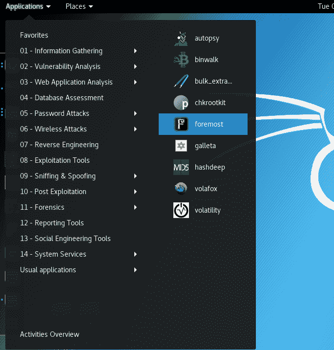

一旦 Foremost 成功启动，一个终端会打开，显示程序版本、创建者和许多用法开关。

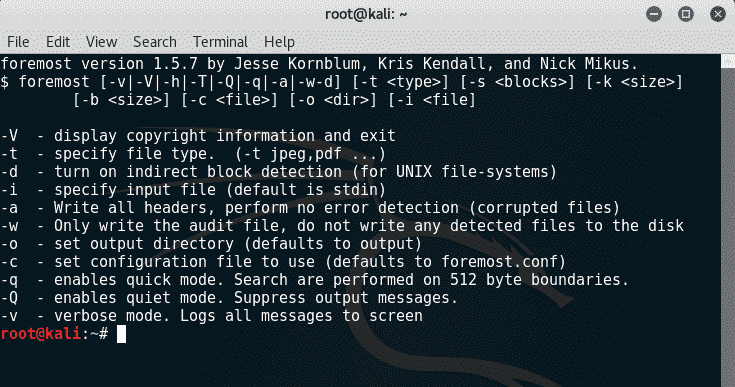

要更好地了解 Foremost 和使用的开关，请尝试浏览 Foremost 的`系统管理手册`。可以通过输入以下命令来完成：

[PRE0]

使用 Foremost 的语法如下：

[PRE1]

在这个例子中，我们指定了位于桌面上的`11-carve-fat.dd`文件作为输入文件（`-i`），并指定了一个名为`Foremost_recovery`的空文件夹作为输出文件（`-o`）。另外，还可以根据需要指定其他开关。

要开始使用 Foremost 切割`11-carve-fat.dd`图像，我们在终端中输入以下命令：

[PRE2]

虽然在处理过程中找到的字符看起来相当模糊，但结果将清晰地分类和总结在指定的输出文件夹中。

要快速访问 Foremost 中的一些命令，也可以使用`foremost -h`。

指定的输出文件夹必须为空，否则您将遇到问题，如下图所示：

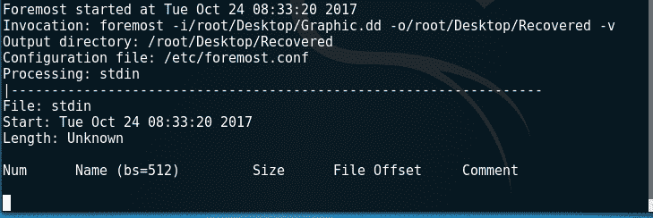

# 查看 Foremost 结果

一旦 Foremost 完成切割过程，我们就可以进入`Foremost_recovery`输出文件夹：

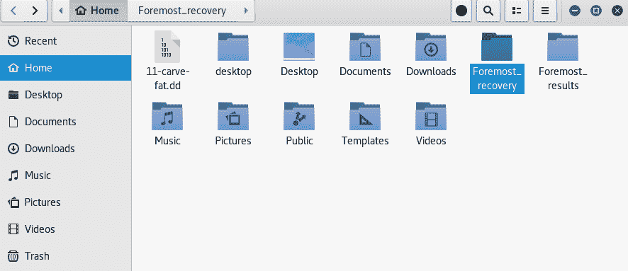

如果我们打开输出目录，我们可以看到按文件类型分类的切割项目，以及包含发现详细信息的`audit.txt`文件夹：

在`audit.text`文件中，我们看到了 Foremost 找到的项目的列表视图，以及它们的`大小`和`文件偏移`位置：

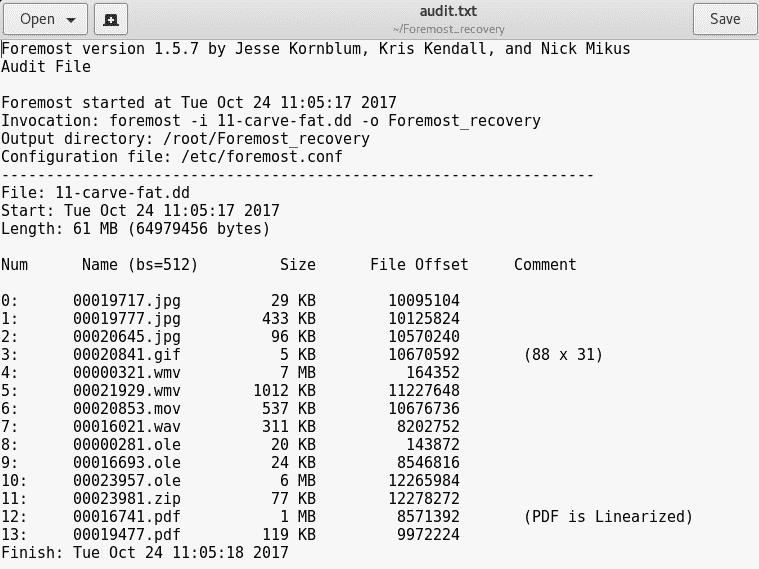

在`audit.txt`文件上滚动时，您应该看到找到的文件的摘要，这在切割较大的图像时特别有用：

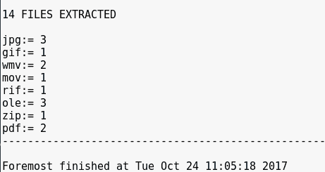

在`audit.txt`文件中列出的前三个文件是`.jpg`图像文件，我们可以在`Foremost_recovery`输出文件夹的`jpg`子文件夹中看到这些文件：

正如我们所看到的，Foremost 是一个非常强大的数据恢复和文件切割工具。文件切割可能需要很长时间，具体取决于驱动器或图像的大小。如果需要恢复的文件类型已知，可以使用`-t`选项指定该文件类型，以减少与搜索整个图像相比所需的时间。

在再次运行 Foremost 之前，请记住选择一个新的或空的输出文件夹。

# 使用 Scalpel 进行数据切割

Scalpel 是作为 Foremost 的一个较早版本的改进而创建的。Scalpel 旨在解决 Foremost 在切割数据时的高 CPU 和 RAM 使用问题。

# 在 Scalpel 中指定文件类型

与 Foremost 不同，调查人员必须在 Scalpel 配置文件中指定感兴趣的文件类型。该文件称为`scalpel.conf`，位于`etc/scapel/`：

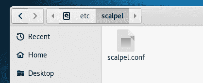

要指定文件类型，调查人员必须删除包含文件类型的行开头的注释，因为所有支持的文件类型都以文件类型开头的哈希标签进行注释。以下屏幕截图显示了默认的 Scalpel 配置文件（`scalpel.conf`），其中所有文件类型都被注释掉。请注意，每行都以井号开头：

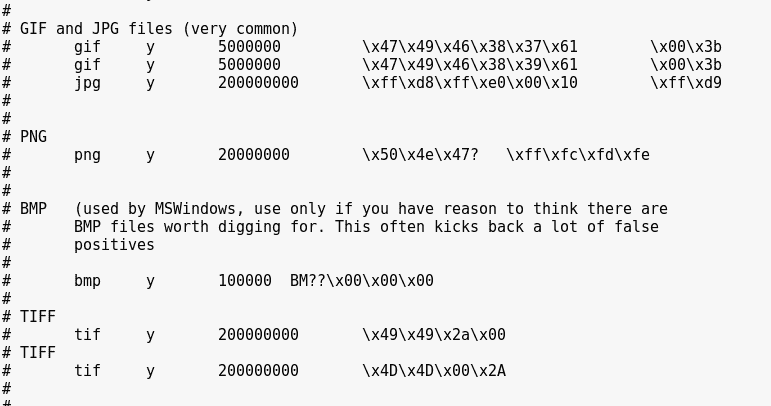

我们已经删除了一些行开头的哈希标签，以便让 Scalpel 知道搜索这些特定的文件类型，这也减少了搜索所有支持的文件类型所需的时间。以下屏幕截图显示了 Scalpel 将搜索 GIF 和 JPG 文件，因为注释已被删除：

在指定要切割的图像之前，请务必执行此步骤。未能这样做将向调查人员显示一个有用的错误消息，提醒他们这样做。

# 使用 Scalpel 进行文件切割

一旦我们对包括文件类型在内的更改并保存了`scalpel.conf`文件，我们就可以通过单击侧边栏上的“显示应用程序”按钮并在顶部出现的搜索框中输入`scalpel`来启动 Scalpel，如图所示。单击`scalpel`框开始：

一旦启动，终端会显示版本号（1.60）、作者（Golden G. Richard III），并且如前所述，它是基于 Foremost 0.69。与 Foremost 一样，Scalpel 的用法语法和其他选项也会显示出来：

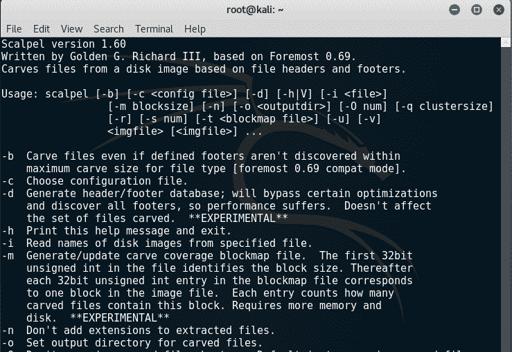

在这个例子中，使用了与 Foremost 相同的图像进行雕刻（`11-carve-fat.dd`）。与 Foremost 一样，必须指定输入文件和输出文件夹。要列出 Scalpel 中可用的选项和开关，请使用`scalpel -h`。

Scalpel 使用了以下语法：

[PRE3]

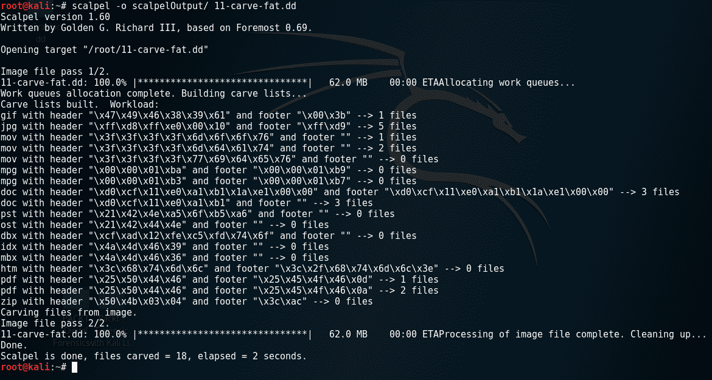

在前面的截图中，我们可以看到 Scalpel 构建了一个雕刻列表，显示了带有页眉和页脚信息的文件类型，以及雕刻出的文件数量。

仔细查看 Scalpel 输出产生的最后几行，我们可以看到雕刻过程完成了`100%`，共雕刻出了`18`个文件：

# 查看 Scalpel 的结果

现在我们可以转到名为`ScalpelOutput`的输出文件夹，查看雕刻出的文件：

Scalpel 输出的结果与 Foremost 类似，两个输出文件夹都包含各种子文件夹，其中包括雕刻文件以及一个包含发现细节的`audit.txt`文件：

在`jpg-1-o`文件夹中，我们可以看到五个`.jpg`文件，其中三个是实际图像：

尽管 Scalpel 的结果显示在运行工具时在雕刻列表中识别出了五个带有`.jpg`头和页脚的文件，但其中一些可能无法打开。这些文件很可能是误报：

以下截图显示了`audit.txt`文件的片段，显示了有关雕刻文件的信息：

# 比较 Foremost 和 Scalpel

尽管 Scalpel 返回的文件比 Foremost 多，但是请自行比较 Foremost 和 Scalpel 找到的雕刻文件。不幸的是，这两个工具返回的文件名不是原始文件名，在某些情况下，可能会有雕刻文件的重复，因为许多文件可能是碎片化的，看起来像是单独的文件。尝试手动查看 Foremost 和 Scalpel 输出文件夹中找到的文件，并进行自己的比较研究，看看哪个工具更成功。

在 Foremost 和 Scalpel 中使用的测试图像文件（`11-carve-fat.dd`）包含了各种类型的 15 个文件，如下载页面上所列出的那样（[`dftt.sourceforge.net/test11/index.html`](http://dftt.sourceforge.net/test11/index.html)）。这在比较雕刻文件时应该很有用：

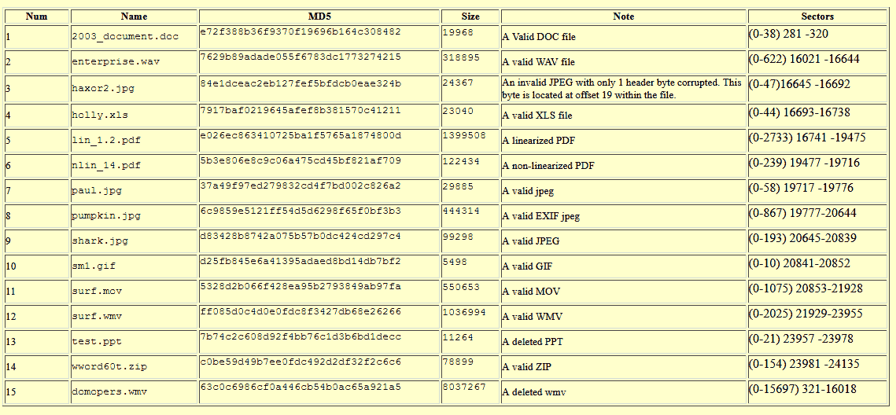

# Bulk_extractor

Bulk_extractor 是本章中我们将介绍的第三个也是最后一个工具。正如我们迄今所见，Foremost 和 Scalpel 在文件恢复和雕刻方面非常出色，但仅限于特定文件类型。为了进一步提取数据，我们可以使用 Bulk Extractor。

虽然 Foremost 和 Scalpel 可以恢复图像、音频、视频和压缩文件，但 Bulk Extractor 可以提取几种额外类型的信息，这在调查中可能非常有用。

尽管 Bulk Extractor 能够恢复和雕刻图像、视频和文档类型文件，但 Bulk Extractor 可以雕刻和提取的其他数据包括：

+   信用卡号码

+   电子邮件地址

+   网址

+   在线搜索

+   网站信息

+   社交媒体资料和信息

# 用于 Bulk_extractor 的取证测试图像

在这个例子中，我们将使用一个名为`terry-work-usb-2009-12-11.E01`的免费可用证据文件。

这个文件可以直接从数字语料库网站下载，该网站允许将法证图像用于法证研究。本练习中使用的文件可以直接从[`downloads.digitalcorpora.org/corpora/scenarios/2009-m57-patents/drives-redacted/`](http://downloads.digitalcorpora.org/corpora/scenarios/2009-m57-patents/drives-redacted/)下载。

所需的文件是下载页面上的最后一个文件，大小只有 32MB：

# 使用 Bulk_extractor

首先输入`bulk_extractor -h`来启动 Bulk Extractor，显示一些常用的参数和选项：

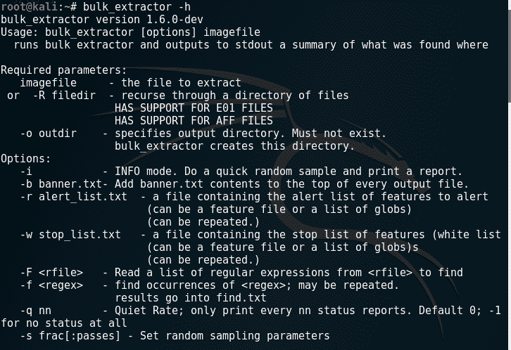

与 Foremost 和 Scalpel 一样，使用`bulk_extractor`的语法非常简单，只需要指定一个输出文件夹（`-o`）和法证图像。在本练习中，如前所述，我们将从`terry-work-usb-2009-12-11.E01`图像中提取数据，并将输出保存到名为`bulk-output`的文件夹中。

使用的语法如下：

[PRE4]

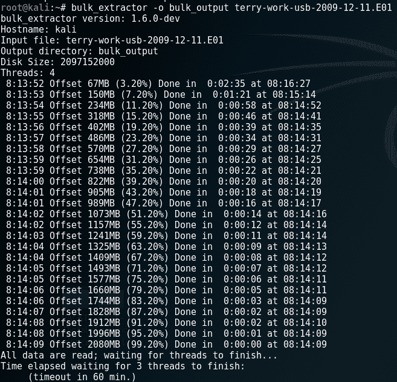

完成后，`bulk_extractor`指示所有线程已完成，并提供了过程的摘要，甚至还有一些发现。如下图所示，`bulk_extractor`显示了 MD5 哈希值，处理的总 MB 数，甚至报告找到了三个电子邮件特征：

# 查看 Bulk_extractor 的结果

要查看`bulk_extractor`的输出和发现，我们还可以在终端中显示目录列表，输入`ls -l`。我们可以看到`bulk_extractor`创建了`bulk_output`文件夹：

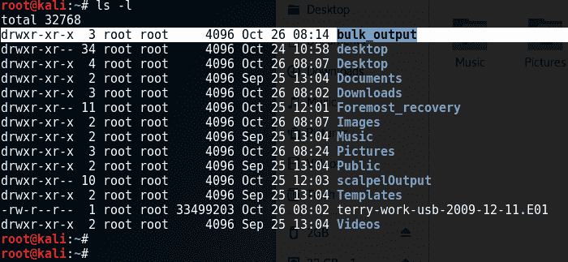

现在我们可以输入`ls -l bulk_output`来列出我们的输出文件夹（`bulk_output`）的内容：

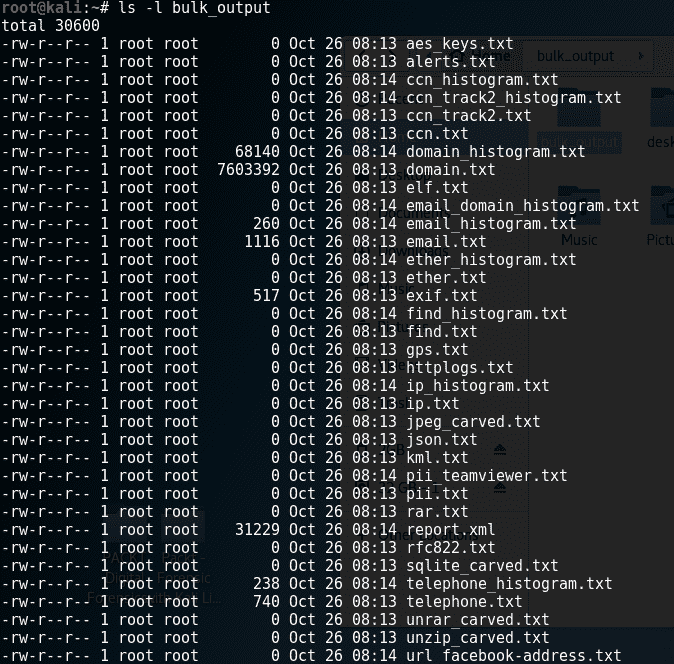

列表已分成两部分，显示了`bulk_extractor`找到的一些工件：

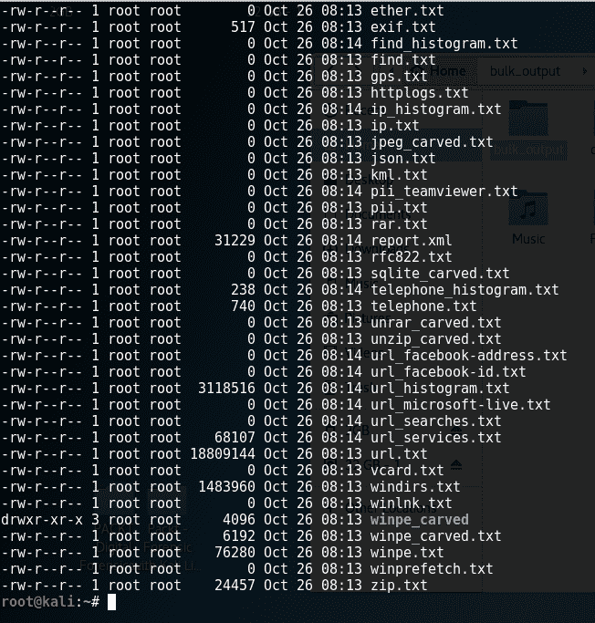

需要注意的是，并非所有列出的文本文件都包含数据。只有左侧数字大于`0`的文本文件名才会实际包含数据。

文本文件`ccn.txt`是**信用卡号**的缩写，其中包含可能被盗用、非法使用或存储以可能用于信用卡欺诈的信用卡信息。

如果我们浏览到输出文件夹位置，我们可以查看所有提取的数据，这些数据位于各个文本文件中。查看`telephone_histogram.txt`文件会显示电话号码：

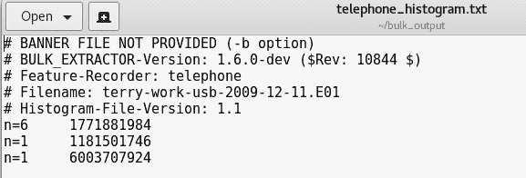

`url.txt`文件显示了访问的许多网站和链接：

这是一个简单的练习，使用了一个小的证据文件，请务必查看[`digitalcorpora.org/`](http://digitalcorpora.org/)上提供的许多其他文件，并查看`bulk_extractor`揭示了什么。如果您的带宽和存储允许，尽可能下载更多的图像，并使用其他章节中将使用的其他工具。

# 总结

在本章中，我们学习了使用 Kali Linux 中的三个现成可用的工具进行文件恢复和数据提取。我们首先使用了非常出色的 Foremost 进行文件刻录，它在文件头和尾部搜索支持的文件类型。然后我们使用了更新的 Scalpel 进行相同的操作，但需要稍作修改，选择我们希望刻录的文件类型。Foremost 和 Scalpel 都向我们呈现了一个`audit.txt`文件，总结了刻录列表及其详细信息，以及包含实际证据的子文件夹。

Bulk_extractor 是一个很棒的工具，它可以刻录数据，还可以找到诸如电子邮件地址、访问的 URL、Facebook 的 URL、信用卡号码以及各种其他信息。Bulk_extractor 非常适合需要文件恢复和刻录的调查，可以与 Foremost 或 Scalpel 一起使用，甚至两者都可以。

现在我们已经讨论了文件刻录和恢复，让我们转向更加分析性的内容。在下一章中，我们将探讨探索 RAM 和分页文件作为内存取证的一部分，使用非常强大的 volatility。到时见！
