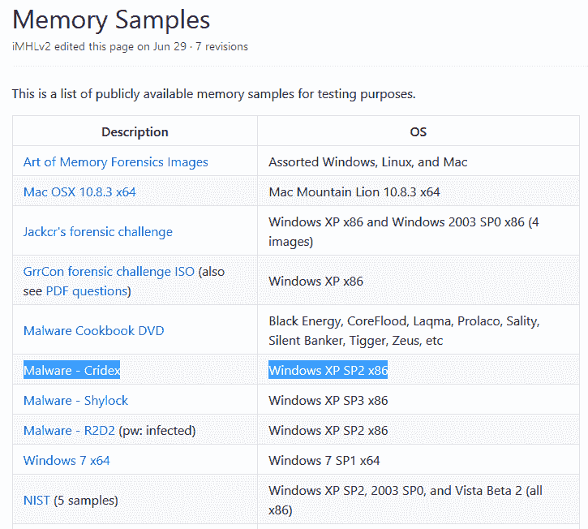
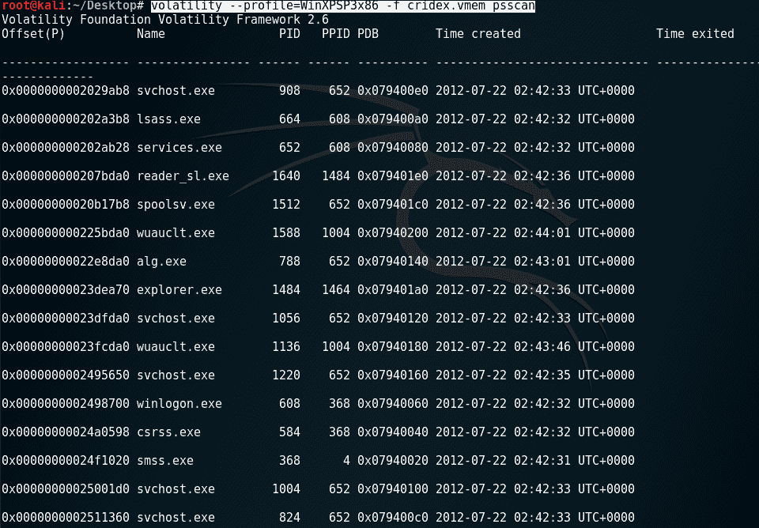
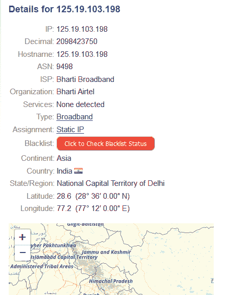

# 第七章：使用 Volatility 进行内存取证

在前几章中，我们看了各种类型的内存。这包括 RAM 和交换或分页文件，它是硬盘驱动器上的一个区域，虽然速度较慢，但作为 RAM。我们还讨论了 RAM 易失性的问题，这意味着当 RAM 芯片不再有电荷或电流时，RAM 中的数据很容易丢失。由于 RAM 上的数据最易失性，因此在易失性顺序中排名较高，并且必须作为高优先级的取证对象进行获取和保留。

许多类型的数据和取证物品驻留在 RAM 和分页文件中。正如前面讨论的，登录密码、用户信息、运行和隐藏进程，甚至加密密码只是在进行 RAM 分析时可以找到的许多有趣数据类型之一，进一步增加了对内存取证的需求。

在本章中，我们将看看功能强大的 Volatility 框架及其在内存取证中的许多用途。

# 关于 Volatility 框架

Volatility 框架是一个开源的、跨平台的、事件响应框架，提供了许多有用的插件，可以从内存快照（也称为内存转储）中为调查人员提供丰富的信息。Volatility 的概念已经存在了十年，除了分析运行和隐藏进程之外，还是恶意软件分析的一个非常受欢迎的选择。

要创建内存转储，可以使用 FTK imager、CAINE、Helix 和**LiME**（Linux Memory Extractor 的缩写）等多种工具来获取内存图像或内存转储，然后通过 Volatility 框架中的工具进行调查和分析。

Volatility 框架可以在支持 Python 的任何操作系统（32 位和 64 位）上运行，包括：

+   Windows XP，7，8，8.1 和 Windows 10

+   Windows Server 2003，2008，2012/R2 和 2016

+   Linux 2.6.11 - 4.2.3（包括 Kali、Debian、Ubuntu、CentOS 等）

+   macOS Leopard（10.5.x）和 Snow Leopard（10.12.x）

Volatility 支持多种内存转储格式（32 位和 64 位），包括：

+   Windows 崩溃和休眠转储（Windows 7 及更早版本）

+   VirtualBox

+   VMWare `.vmem` 转储

+   VMware 保存状态和挂起转储—`.vmss`/`.vmsn`

+   原始物理内存—`.dd`

+   通过 IEEE 1394 FireWire 直接物理内存转储

+   **专家证人格式**（EWF）—`.E01`

+   QEMU（快速模拟器）

Volatility 甚至允许在这些格式之间进行转换，并自称能够完成类似工具的所有任务。

# 下载用于 Volatility 的测试图像

在本章中，我们将使用一个名为`cridex.vmem`的 Windows XP 图像，可以直接从[`github.com/volatilityfoundation/volatility/wiki/Memory-Samples`](https://github.com/volatilityfoundation/volatility/wiki/Memory-Samples)下载。

选择带有描述列的链接，恶意软件 - Cridex，下载`cridex.vmem`图像：

此页面上还有许多其他图像可供分析。为了练习使用 Volatility 框架并进一步提高您的分析技能，您可能希望下载尽可能多的图像，并使用 Volatility 中提供的各种插件。

# 图像位置

正如我们将很快看到的，Volatility 框架中的所有插件都是通过终端使用的。为了使访问图像文件更加方便，不必指定图像的冗长路径，我们已将`cridex.vmem`图像移动到`桌面`：

我们还可以将目录更改为`桌面`，然后从那里运行 Volatility 框架及其插件。为此，我们打开一个新的终端并输入以下命令：

[PRE0]

我们还可以查看`桌面`的内容，以确保`cridex.vmem`文件存在，方法是输入`ls -l`：

# 在 Kali Linux 中使用 Volatility

要启动 Volatility Framework，请单击侧边栏底部的所有应用程序按钮，然后在搜索栏中键入`volatility`：

单击 Volatility 图标会在终端中启动程序。当 Volatility 启动时，我们看到正在使用的版本是`2.6`，并为我们提供了使用选项：

要获得所有插件的完整列表，打开一个单独的终端并运行`volatility -h`命令，而不是不得不滚动到您用于运行 Volatility 插件命令的终端的顶部：

以下截图显示了 Volatility Framework 中许多插件的片段：

在执行分析时，此列表非常有用，因为每个插件都带有自己的简短描述。以下截图显示了`help`命令的片段，其中提供了`imageinfo`插件的描述：

在 Volatility 中使用插件的格式是：

[PRE1]

如前一节所示，要使用`imageinfo`插件，我们将键入：

[PRE2]

# 在 Volatility 中选择配置文件

所有操作系统都将信息存储在 RAM 中，但是根据所使用的操作系统，它们可能位于内存中的不同位置。在 Volatility 中，我们必须选择最能识别操作系统类型和服务包的配置文件，以帮助 Volatility 识别存储工件和有用信息的位置。

选择配置文件相对简单，因为 Volatility 会使用`imageinfo`插件为我们完成所有工作。

# `imageinfo`插件

此插件提供有关所使用的图像的信息，包括建议的操作系统和`Image Type (Service Pack)`，使用的`Number of Processors`，以及图像的日期和时间。

使用以下命令：

[PRE3]

`imageinfo`输出显示`Suggested Profile(s)`为`WinXPSP2x86`和`WinXPSP3x86`：

+   **WinXP**：Windows XP

+   **SP2/SP3**：Service Pack 2/Service Pack 3

+   **x86**：32 位架构

图像类型或服务包显示为`3`，表明这是一个将用作案例配置文件的 Windows XP，Service Pack 3，32 位（x86）操作系统：

选择了配置文件后，我们现在可以继续使用 Volatility 插件来分析`cridex.vmem`图像。

# 进程识别和分析

为了识别和链接连接的进程，它们的 ID，启动时间和内存映像中的偏移位置，我们将使用以下四个插件来开始：

+   `pslist`

+   `pstree`

+   `psscan`

+   `psxview`

# `pslist`命令

此工具不仅显示所有运行中的进程列表，还提供有用的信息，如**进程 ID**（**PID**）和**父进程 ID**（**PPID**），还显示进程启动的时间。在本节显示的截图中，我们可以看到`System`，`winlogon.exe`，`services.exe`，`svchost.exe`和`explorer.exe`服务都是首先启动的，然后是`reader_sl.exe`，`alg.exe`，最后是`wuauclt.exe`。

PID 标识进程，PPID 标识进程的父进程。查看`pslist`输出，我们可以看到`winlogon.exe`进程的`PID`为`608`，`PPID`为`368`。`services.exe`和`lsass.exe`进程的 PPID（在`winlogon.exe`进程之后）都是`608`，表明`winlogon.exe`实际上是`services.exe`和`lsass.exe`的 PPID。

对于那些对进程 ID 和进程本身不熟悉的人，快速的谷歌搜索可以帮助识别和描述信息。熟悉许多启动进程也很有用，以便能够快速指出可能不寻常或可疑的进程。

还应该注意进程的时间和顺序，因为这些可能有助于调查。在下面的截图中，我们可以看到几个进程，包括`explorer.exe`、`spoolsv.exe`和`reader_sl.exe`，都是在`02:42:36 UTC+0000`同时启动的。我们还可以看到`explorer.exe`是`reader_sl.exe`的 PPID。

在这个分析中，我们可以看到有两个`wuauclt.exe`的实例，其父进程是`svchost.exe`。

使用的`pslist`命令如下：

[PRE4]

# pstree 命令

另一个可以用来列出进程的进程识别命令是`pstree`命令。该命令显示与`pslist`命令相同的进程列表，但缩进也用于标识子进程和父进程。

在下面的截图中，列出的最后两个进程是`explorer.exe`和`reader_sl.exe`。`explorer.exe`没有缩进，而`reader_sl`有缩进，表明`sl_reader`是子进程，`explorer.exe`是父进程：

# psscan 命令

查看运行进程列表后，我们通过输入以下命令运行`psscan`命令：

[PRE5]

`psscan`命令显示了可以被恶意软件使用的非活动甚至隐藏的进程，如 rootkits，这些进程以逃避用户和杀毒程序的发现而闻名。

`pslist`和`psscan`命令的输出应该进行比较，以观察任何异常情况：

# psxview 插件

与`psscan`一样，`psxview`插件用于查找和列出隐藏进程。然而，使用`psxview`，会运行各种扫描，包括`pslist`和`psscan`。

运行`psxview`插件的命令如下：

[PRE6]

# 分析网络服务和连接

Volatility 可以用于识别和分析活动的、终止的和隐藏的连接，以及端口和进程。所有协议都受支持，Volatility 还显示了进程使用的端口的详细信息，包括它们启动的时间。

为此，我们使用以下三个命令：

+   `connections`

+   `connscan`

+   `sockets`

# 连接命令

`connections`命令列出了当时的活动连接，显示了本地和远程 IP 地址以及端口和 PID。`connections`命令仅用于 Windows XP 和 2003 服务器（32 位和 64 位）。`connections`命令的使用如下：

[PRE7]

# connscan 命令

`connections`命令在那个时候只显示了一个活动连接。要显示已终止的连接列表，使用`connscan`命令。`connscan`命令也仅适用于 Windows XP 和 2003 服务器（32 位和 64 位）系统：

[PRE8]

使用`connscan`命令，我们可以看到相同的本地地址之前连接到另一个带有 IP`125.19.103.198:8080`的`远程地址`。`1484`的`Pid`告诉我们，连接是由`explorer.exe`进程建立的（如之前使用`pslist`命令显示的）。

可以使用 IP 查找工具和网站（例如[`whatismyipaddress.com/ip-lookup`](http://whatismyipaddress.com/ip-lookup)）获取有关远程地址的更多信息：

通过点击“获取 IP 详细信息”按钮，我们得到以下结果，包括 ISP 名称、洲和国家详情，以及显示设备大致位置的地图：

# sockets 插件

`sockets`插件可用于提供额外的连接信息监听套接字。尽管 UDP 和 TCP 是以下截图中输出的唯一协议，但`sockets`命令支持所有协议：

>

# DLL 分析

**DLL**（动态链接库）是特定于 Microsoft 的，包含可以同时供多个程序使用的代码。检查进程的运行 DDL 和文件和产品的版本信息可能有助于相关进程。还应分析进程和 DLL 信息，因为它们与用户帐户相关。

对于这些任务，我们可以使用以下插件：

+   `verinfo`

+   `dlllist`

+   `getsids`

# verinfo 命令

此命令列出了有关**PE**（**可移植可执行文件**）文件的版本信息（`verinfo`）。此文件的输出通常非常冗长，因此可以在单独的终端中运行，如果调查人员不希望不断滚动当前终端以查看过去的插件命令列表和输出。 

`verinfo`命令的使用如下：

[PRE9]

# `dlllist`插件

`dlllist`插件列出了内存中那个时间运行的所有 DLL。DLL 由可以同时供多个程序使用的代码组成。

`dlllist`命令的使用如下：

[PRE10]

# `getsids`命令

所有用户还可以通过**安全标识符**（**SID**）得到唯一标识。`getsids`命令按照进程启动的顺序有四个非常有用的项目（参考`pslist`和`pstree`命令的截图）。

`getsids`命令输出的格式为：

[PRE11]

例如，列表中的第一个结果列出了：

[PRE12]

+   `System`：进程

+   `(4)`：PID

+   `S - 1 - 5- 18`：SID

+   `用户`：本地系统

如果 SID 中的最后一个数字在 500 范围内，这表示具有管理员特权的用户。例如，`S – 1 – 5- 32-544`（管理员）。

`getsids`命令的使用如下：

[PRE13]

向下滚动`getsids`输出，我们可以看到一个名为`Robert`的用户，其 SID 为`S-1-5-21-79336058`（非管理员），已启动或访问`explorer.exe`，PID 为`1484`：

# 注册表分析

在注册表中可以找到有关每个用户、设置、程序和 Windows 操作系统本身的信息。甚至可以在注册表中找到哈希密码。在 Windows 注册表分析中，我们将使用以下两个插件。

+   `hivescan`

+   `hivelist`

# hivescan 插件

`hivescan`插件显示了可用注册表蜂巢的物理位置。

运行`hivescan`的命令如下：

<pre>**volatility --profile=WinXPSP3x86 -f cridex.vmem hivescan**

# hivelist 插件

对于有关注册表蜂巢和 RAM 内位置的更详细（和有用的）信息，可以使用`hivelist`插件。`hivelist`命令显示`虚拟`和`物理`地址的详细信息，以及更易读的纯文本名称和位置。

运行`hivelist`的命令如下：

[PRE14]

# 密码转储

使用`hivelist`插件还列出了**安全帐户管理器**（**SAM**）文件的位置，如下截图所示。`SAM`文件包含 Windows 机器用户名的哈希密码。`SAM`文件的路径如下截图所示为`Windows\system32\config\SAM`。在 Windows 中，系统开启时用户无法访问此文件。这可以进一步用于使用`wordlist`和密码破解工具（如**John the Ripper**，也可在 Kali Linux 中使用）破解`SAM`文件中的哈希密码：

# 事件时间线

Volatility 可以生成一个带有时间戳的事件列表，这对于任何调查都是必不可少的。为了生成这个列表，我们将使用`timeliner`插件。

# 时间线插件

`timeliner`插件通过提供图像获取时发生的所有事件的时间线来帮助调查人员。尽管我们对这种情况发生了什么有所了解，但许多其他转储可能会非常庞大，更加详细和复杂。

`timeliner`插件按时间分组详细信息，并包括进程、PID、进程偏移、使用的 DDL、注册表详细信息和其他有用信息。

要运行`timeliner`命令，我们输入以下内容：

[PRE15]

以下是`timeliner`命令的片段，当进一步滚动其输出时：

# 恶意软件分析

在 Volatility 令人印象深刻的插件阵容中，还有`malfind`插件。

正如其名称所示，`malfind`插件用于查找，或者至少指引调查人员找到可能已经注入到各种进程中的恶意软件的线索。`malfind`插件的输出可能特别冗长，因此应该在单独的终端中运行，以避免在审查其他插件命令的输出时不断滚动。

运行`malfind`的命令如下：

[PRE16]

`malfind`插件也可以直接在进程上使用`-p`开关运行。

正如我们发现的那样，`winlogon.exe`被分配了 PID`608`。要在 PID`608`上运行`malfind`，我们输入：

[PRE17]

# 总结

在本章中，我们使用了 Volatility Framework 中的许多可用插件进行内存取证和分析。在使用 Volatility 的工作中，首先也是最重要的一步是选择 Volatility 在整个分析过程中将使用的配置文件。这个配置文件告诉 Volatility 正在使用的操作系统类型。一旦选择了配置文件，我们就能够成功地使用这个多功能工具进行进程、网络、注册表、DLL 甚至恶意软件分析。正如我们所看到的，Volatility 可以在数字取证中执行几个重要的功能，并且应该与我们之前使用的其他工具一起使用，以进行深入和详细的取证分析和调查。

一定要下载更多公开可用的内存映像和样本，以测试您在这个领域的技能。尽可能多地尝试各种插件，并当然，一定要记录您的发现并考虑在线分享。

在我们的下一章中，我们将转向另一个功能强大的工具，它可以从获取到报告的所有工作。让我们开始使用 Autopsy—The Sleuth Kit®。
