# Autopsy - The Sleuth Kit

Autopsy 和 The Sleuth Kit 是相辅相成的。两者都是由 Brian Carrier 创建的。The Sleuth Kit 是一套功能强大的 CLI 取证工具，而 Autopsy 是坐落在 The Sleuth Kit 之上的 GUI，并通过 Web 浏览器访问。The Sleuth Kit 支持磁盘映像文件类型，包括 RAW（DD），EnCase（.01）和**高级取证格式**（**AFF**）。

The Sleuth Kit 使用命令行界面工具执行以下任务：

+   查找和列出分配的和未分配的（已删除）文件，甚至是被 rootkits 隐藏的文件

+   显示 NTFS **备用数据流**（**ADS**），文件可以隐藏在其他文件中

+   按类型列出文件

+   显示元数据信息

+   时间线创建

Autopsy 可以在法庭模式下从 Live CD/USB 上运行，作为实时分析的一部分，也可以在专用机器上用于死亡模式后期分析。

本章将涵盖以下主题：

+   在 Autopsy 中使用的示例图像文件

+   使用 Autopsy 进行数字取证

+   在 Autopsy 中创建一个新案例

+   使用 Autopsy 进行分析

+   在 Autopsy 中重新打开案例

# 介绍 Autopsy - The Sleuth Kit

Autopsy 提供对来自 The Sleuth Kit 的各种调查命令行工具的 GUI 访问，包括文件分析，图像和文件哈希，已删除文件恢复和案例管理等功能。安装 Autopsy 可能会有问题，但幸运的是，它已内置在 Kali Linux 中，并且非常容易设置和使用。

尽管 Autopsy 浏览器基于 The Sleuth Kit，但在使用 Windows 版本与 Linux 版本时，Autopsy 的功能有所不同。Kali Linux 中 The Sleuth Kit 和 Autopsy 2.4 提供的一些官方功能包括：

+   **图像分析**：分析目录和文件，包括文件排序，恢复已删除的文件和预览文件

+   **文件活动时间线**：根据文件的时间戳创建时间线，包括写入、访问和创建时间

+   **图像完整性**：创建使用的图像文件的 MD5 哈希，以及单个文件

+   **哈希数据库**：将未知文件（如疑似恶意的`.exe`文件）的数字哈希或指纹与 NIST **国家软件参考库**（**NSRL**）中的文件进行匹配

+   **事件排序器**：按日期和时间排序显示事件

+   **文件分析**：分析整个图像文件以显示目录和文件信息和内容

+   **关键字搜索**：允许使用关键字列表和预定义表达式列表进行搜索

+   **元数据分析**：允许查看文件的元数据详细信息和结构，这对数据恢复至关重要

# Autopsy 中使用的示例图像文件

用于分析的图像文件可以在[`dftt.sourceforge.net/`](http://dftt.sourceforge.net/)上公开下载。

我们将使用的文件是 JPEG 搜索测试＃1（Jun'04），如下面的屏幕截图所示：

该图像包含几个更改扩展名的文件以及其中的其他文件，如下面的下载描述所示：

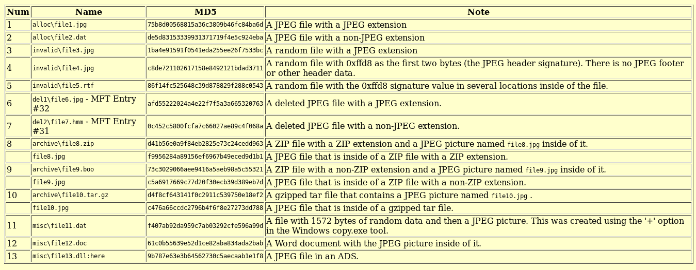

请务必注意下载示例文件的位置，因为稍后会需要它。

调查硬盘和设备时，务必遵循适当的获取程序，并使用经过预先测试的写阻塞器，以避免篡改原始证据。

# 使用 Autopsy 进行数字取证

现在我们已经下载了示例图像文件（或者甚至是我们自己的法庭获取的图像），让我们通过使用 Autopsy 浏览器进行分析，首先熟悉启动 Autopsy 的不同方法。

# 启动 Autopsy

Autopsy 可以通过两种方式启动。第一种方法是使用应用程序菜单，单击应用程序| 11-取证|尸检：

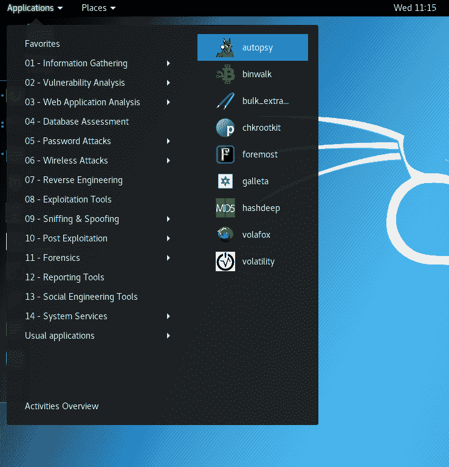

或者，我们可以单击显示应用程序图标（侧边菜单中的最后一项）并在屏幕顶部中间的搜索栏中键入`autopsy`，然后单击尸检图标：

一旦点击了尸检图标，就会打开一个新的终端，显示程序信息以及打开尸检法医浏览器的连接详细信息。

在下面的屏幕截图中，我们可以看到版本号列为 2.24，`证据保险箱`文件夹的路径为`/var/lib/autopsy`：

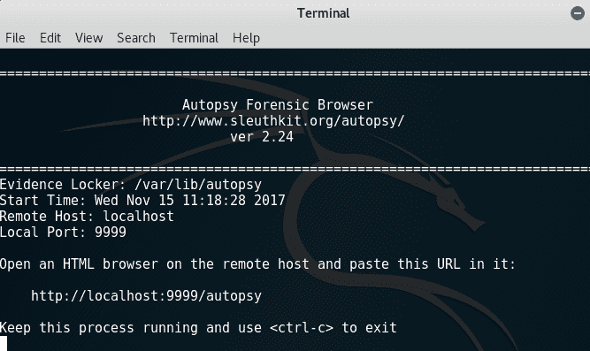

要打开 Autopsy 浏览器，请将鼠标放在终端中的链接上，然后右键单击并选择“打开链接”，如下面的屏幕截图所示：

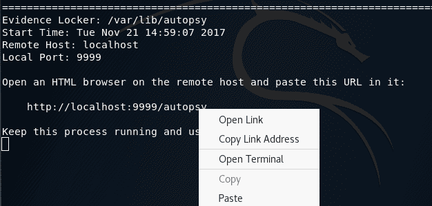

# 创建新案例

要创建新案例，请按照给定的步骤操作：

1.  打开尸检法医浏览器后，调查员将看到三个选项。

1.  单击“新案例”：

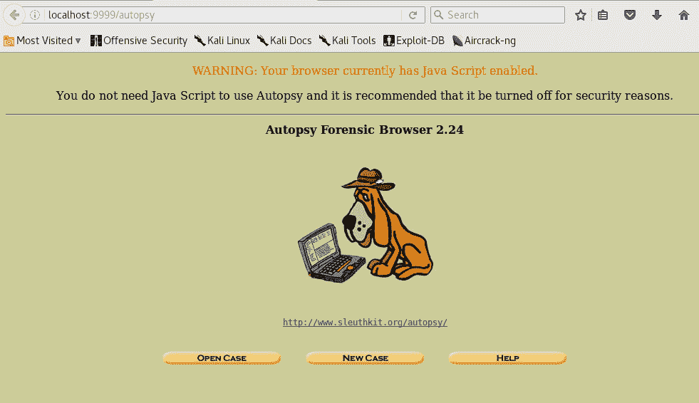

1.  输入案例名称、描述和调查员名称的详细信息。对于案例名称，我输入了`SP-8-dftt`，因为它与图像名称（`8-jpeg-search.dd`）非常匹配，我们将在此调查中使用。输入所有信息后，单击“新案例”：

有几个调查员名称字段可用，因为可能有几个调查员一起工作的情况。

案例目录和配置文件的位置将显示并显示为已创建。重要的是要注意案例目录的位置，如屏幕截图所示：案例目录（/var/lib/autopsy/SP-8-dftt/）已创建。单击“添加主机”继续：

1.  输入主机名（正在调查的计算机的名称）和主机描述的详细信息。

1.  可选设置：

+   时区：如果未指定，默认为本地设置

+   时间偏移调整：添加一个以秒为单位的值来补偿时间差异

+   警报哈希数据库路径：指定已知恶意哈希的创建数据库的路径

+   忽略哈希数据库路径：指定已知良好哈希的创建数据库的路径，类似于 NIST NSRL：

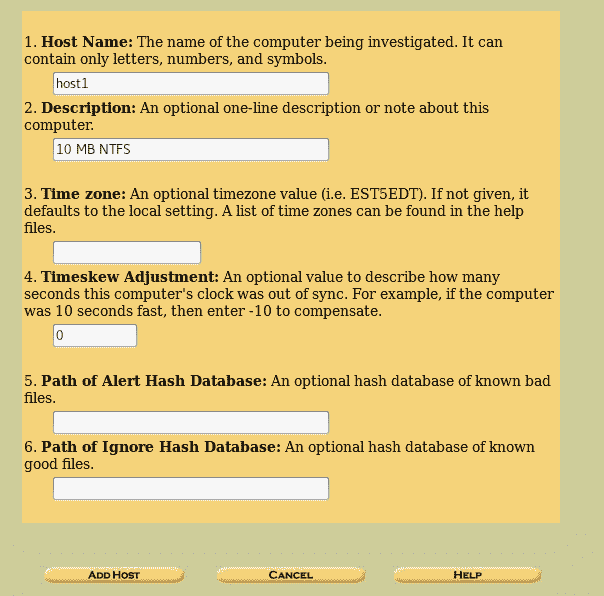

1.  单击“添加主机”按钮继续。

1.  添加主机并创建目录后，我们通过单击“添加图像”按钮添加要分析的法医图像：

1.  单击“添加图像文件”按钮添加图像文件：

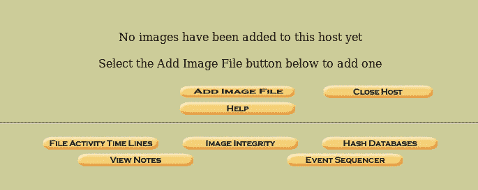

1.  要导入图像进行分析，必须指定完整路径。在我的机器上，我将图像文件（`8-jpeg-search.dd`）保存到`桌面`文件夹中。因此，文件的位置将是`/root/Desktop/ 8-jpeg-search.dd`。

对于导入方法，我们选择符号链接。这样，可以将图像文件从当前位置（`桌面`）导入到证据保险箱，而不会出现与移动或复制图像文件相关的风险。

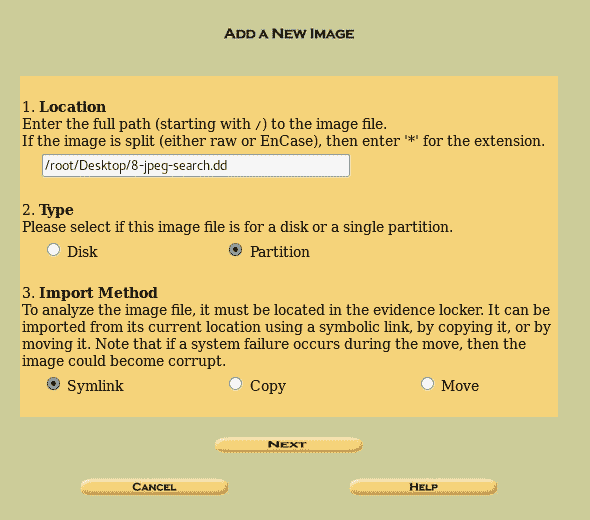

1.  如果出现以下错误消息，请确保指定的图像位置正确，并且使用正斜杠（`/`）：

1.  单击**下一步**后，将显示图像文件详细信息。要验证文件的完整性，请选择计算此图像的哈希值的单选按钮，并选择导入后验证哈希值的复选框。

1.  文件系统详细信息部分还显示图像是 ntfs 分区的。

1.  单击“添加”按钮继续：

1.  单击前面屏幕截图中的“添加”按钮后，尸检将计算 MD5 哈希并将图像链接到证据保险箱。按“确定”继续：

1.  此时，我们几乎准备好分析图像文件了。如果在画廊区域列出了任何之前调查中的多个案例，一定要选择`8-jpeg-search.dd`文件和案例：

1.  在继续之前，我们可以点击“图像详情”选项。该屏幕提供了图像名称、卷 ID、文件格式、文件系统等详细信息，并允许提取 ASCII、Unicode 和未分配数据以增强和加快关键字搜索。点击浏览器中的返回按钮返回上一个菜单，并继续分析：

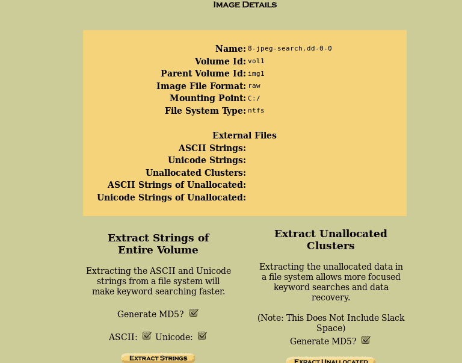

1.  在点击“分析”按钮开始我们的调查和分析之前，我们还可以通过点击“图像完整性”按钮创建 MD5 哈希来验证图像的完整性：

还有其他选项，如文件活动时间线、哈希数据库等。我们可以随时返回这些选项进行调查。

1.  点击“图像完整性”按钮后，将显示图像名称和哈希值。点击“验证”按钮验证 MD5 哈希：

1.  验证结果显示在 Autopsy 浏览器窗口的左下角：

1.  我们可以看到我们的验证成功了，结果中显示了匹配的 MD5 哈希。点击“关闭”按钮继续。

1.  开始我们的分析，我们点击分析按钮：

# 使用 Autopsy 进行分析

现在我们已经创建了我们的案例，添加了适当目录的主机信息，并添加了我们获取的图像，我们可以进行分析了。

点击“分析”按钮（参见上一个截图）后，我们将看到几个选项以开始我们的调查：

点击图像详情选项卡，查看图像的详细信息。在下面的片段中，我们可以看到卷序列号和操作系统（版本）列为 Windows XP：

接下来，点击“文件分析”选项卡。这种模式打开为文件浏览模式，允许检查图像中的目录和文件。图像中的目录默认列在主视图区域中：

在文件浏览模式中，目录列出为当前目录指定为`C:/`。

对于每个目录和文件，都有显示该项的写入、访问、更改和创建时间的字段，以及其大小和元数据：

+   写入：文件上次写入的日期和时间

+   访问：文件上次访问的日期和时间（只有日期是准确的）

+   更改：文件的描述数据修改的日期和时间

+   创建：文件创建的日期和时间

+   META：描述文件和文件信息的元数据：

为了完整性，可以通过点击“生成文件的 MD5 列表”按钮生成所有文件的 MD5 哈希。

调查人员还可以通过点击“添加注释”按钮对文件、时间、异常等进行注释：

左侧窗格包含我们将使用的四个主要功能：

+   **目录搜索**：允许搜索目录

+   **文件名搜索**：允许通过 Perl 表达式或文件名搜索文件

+   **所有已删除的文件**：搜索已删除的文件

+   **展开目录**：展开所有目录以便查看内容

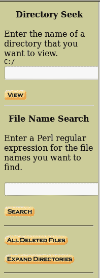

通过点击 EXPAND DIRECTORIES，所有内容都可以在左窗格和主窗口内轻松查看和访问。目录旁边的+表示可以进一步展开以查看子目录（++）及其内容：

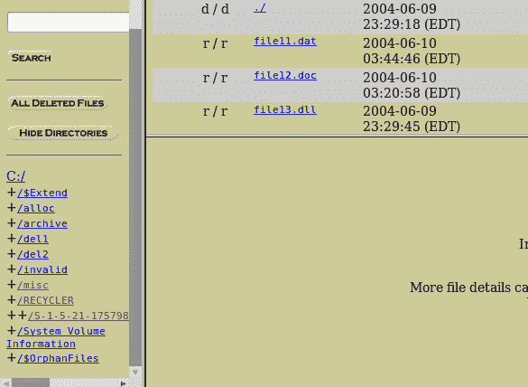

要查看已删除的文件，我们点击左窗格中的 ALL DELETED FILES 按钮。已删除的文件标记为红色，并且遵循相同的格式：写入、访问、更改和创建时间。

从下面的截图中，我们可以看到图像包含两个已删除的文件：

我们还可以通过点击其 META 条目查看有关此文件的更多信息。通过查看文件的元数据条目（最右侧的最后一列），我们还可以查看文件的十六进制条目，即使扩展名已更改，也可以了解真实的文件扩展名。

在上述截图中，第二个已删除的文件（`file7.hmm`）具有一个奇特的文件扩展名`.hmm`。

点击 META 条目（31-128-3）以查看元数据：

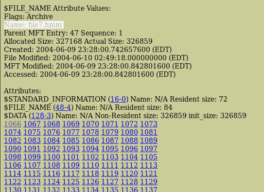

在属性部分，点击标有 1066 的第一个簇以查看文件的头部信息：

我们可以看到第一个条目是**.JFIF**，这是**JPEG 文件交换格式**的缩写。这意味着`file7.hmm`文件是一个图像文件，但其扩展名已更改为`.hmm`。

# 文件排序

检查每个文件的元数据可能在大型证据文件中不太实际。对于这种情况，可以使用 FILE TYPE 功能。此功能允许检查现有（已分配）、已删除（未分配）和隐藏文件。点击 FILE TYPE 选项卡继续：

点击按类型对文件进行分类（将默认选项保持不变），然后点击 OK 开始排序过程：

排序完成后，将显示结果摘要。在下面的片段中，我们可以看到有五个 Extension Mismatches：

要查看排序后的文件，我们必须手动浏览到`output`文件夹的位置，因为 Autopsy 2.4 不支持查看排序后的文件。要显示此位置，请点击左窗格中的 View Sorted Files：

`output`文件夹的位置将根据用户在首次创建案例时指定的信息而有所不同，但通常可以在`/var/lib/autopsy/<case name>/<host name>/output/sorter-vol#/index.html`找到。

打开`index.html`文件后，点击 Extension Mismatch 链接：

列出的五个扩展名不匹配的文件应该通过查看元数据内容进行进一步检查，并由调查人员添加注释。

# 在 Autopsy 中重新打开案例

案例通常是持续进行的，可以通过启动 Autopsy 并点击 OPEN CASE 来轻松重新开始：

在 CASE GALLERY 中，请确保选择正确的案例名称，然后继续您的检查：

# 总结

在本章中，我们使用 Autopsy Forensic Browser 和 The Sleuth Kit 进行取证。与单个工具相比，Autopsy 具有案例管理功能，并支持各种类型的文件分析，搜索和对分配的、未分配的和隐藏文件进行排序。Autopsy 还可以对文件和目录级别进行哈希处理，以保持证据的完整性。

接下来，我们使用另一个非常强大的 GUI 工具**Xplico**对互联网和网络遗物进行分析。请参阅第九章，*使用 Xplico 进行网络和互联网捕获分析*。
