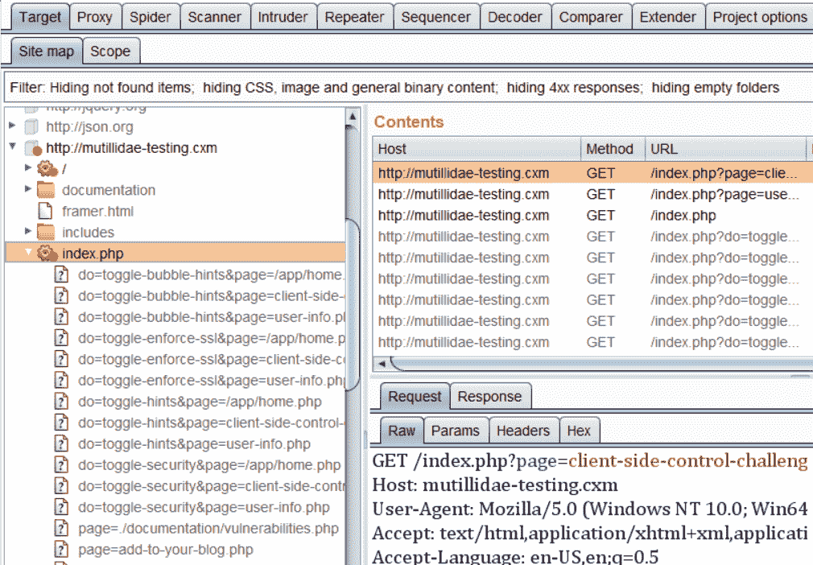
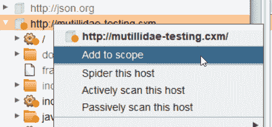
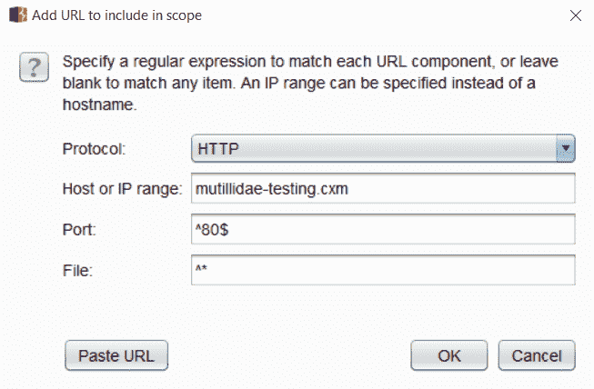
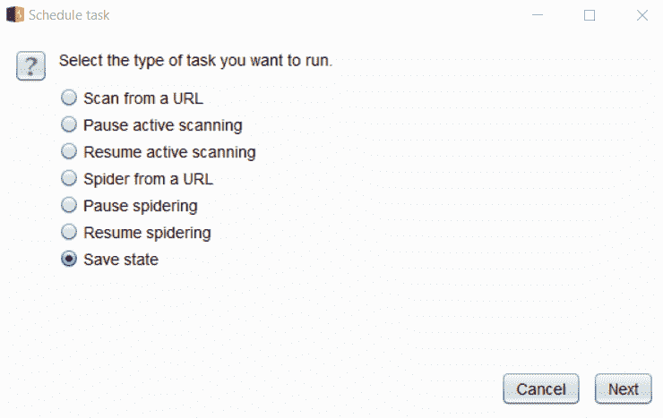
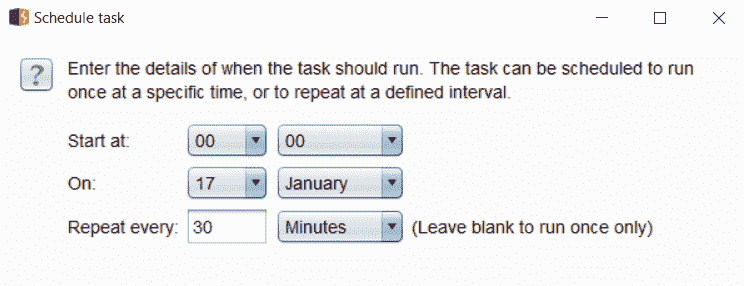

# 第一章：配置 Burp Suite

在开始应用程序渗透测试之前，必须准备用于攻击最终应用程序的系统。这涉及配置 Burp Suite 成为各种客户端和流量来源的拦截代理。

与确定目标范围一样，减少我们收集的数据中的噪音非常重要。我们将使用目标白名单技术，并使用 Burp 目标功能来过滤和减少测试现代应用程序可能引入的混乱。

Burp 或 Burp Suite 是用于测试 Web 应用程序安全漏洞的图形工具。该工具是用 Java 编写的，由 Dafydd Stuttard 在 PortSwigger 的名义下创建。Burp Suite 现在由他的公司 PortSwigger 积极开发...

# 了解 Burp Suite

可以从 PortSwigger 网站[`portswigger.net/burp`](https://portswigger.net/burp)下载 Burp 适用于所有主要操作系统。对于 Windows 系统，提供了 x64 位和 x32 位的安装程序。还提供了一个独立的 Java JAR 文件，以便您可以将 Burp 作为便携式应用程序运行。

当您启动 Burp Suite 时，您将被提示在开始使用该工具之前设置 Burp 项目的设置。

可用的三个选项如下：

+   临时项目：如果您想要使用 Burp 进行快速检查或不需要保存的任务，请选择此选项并点击“下一步”即可立即开始。

+   磁盘上的新项目：对于良好执行的渗透测试，能够记录和检索作为测试一部分的请求和响应的日志非常重要。此选项允许您在磁盘上创建一个文件，该文件将存储在开始测试时在 Burp 中设置的所有配置数据、请求和响应以及代理信息。可以提供描述性名称以便将来加载此文件。一个良好的经验法则是创建一个提供有关项目本身信息的名称。**ClientName-TypeOfTest-DDMMYYYY**是一个很好的起点。

+   打开现有项目：此选项允许您加载以前使用磁盘上的新项目创建的任何现有项目文件。您可以选择暂停蜘蛛和扫描器模块，以便以非活动状态加载项目。

单击“下一步”将带您到一个页面，您可以选择以前的任何保存配置或继续使用 Burp 默认值。当 Burp 启动时，您还可以选择禁用扩展。

单击“启动 Burp”继续。

# 设置代理监听器

要将 Burp 用作应用程序渗透测试工具，必须将其设置为**中间人**（**MITM**）代理。中间人代理位于客户端和服务器之间，并允许用户篡改或丢弃通过的消息。在其最简单的形式中，Burp Suite 是 HTTP(S)流量的中间人代理。

默认情况下，Burp 将在本地 IP 的端口`8080`上监听`127.0.0.1`。然而，这可以很容易地更改为系统上任何可用 IP 地址上的任意空闲端口。要做到这一点，请按照以下步骤进行：

1.  导航到代理|选项选项卡。

1.  在代理监听器下，确认“运行”复选框被选中...

# 管理多个代理监听器

如果有必要，Burp Suite 可以提供多个代理监听器接口。这只是意味着 Burp 可以同时在不同端口和不同 IP 地址上启动监听器，每个监听器都有自己的配置和设置。

例如，如果您正在测试的厚客户端应用程序有多个组件，其中一些可以配置为使用代理，而另一些则不能，或者如果其通信端口是硬编码的，或者如果需要捕获来自基于网络的浏览器或服务的流量，那么可以创建多个代理监听器，每个监听器都有自己的配置。

如果需要，您可以通过取消选中接口名称旁边的复选框来禁用代理监听器。接下来，我们将了解非代理感知客户端的工作原理。

# 与非代理感知客户端一起工作

在这种情况下，非代理感知客户端是指发出 HTTP 请求但没有简单方法配置代理选项，或根本没有代理支持的客户端。

非代理感知客户端的常见示例是不使用浏览器代理选项的厚客户端应用程序或浏览器插件。Burp 对隐形代理的支持允许非代理感知客户端直接连接到代理监听器。这允许 Burp 拦截和修改基于目标映射的流量。

从架构上讲，这是通过为非代理感知客户端通信的远程目标设置本地 DNS 条目来实现的。这个 DNS 条目可以在本地 hosts 文件中进行设置，如下所示：

[PRE0]

客户端...

# 在 Burp Suite 中创建目标范围

目标范围设置可以在目标|范围选项卡下找到。这允许您为当前执行的渗透测试配置范围内的目标。

将项目添加到目标范围可以影响 Burp 中各个功能的行为。例如，您可以执行以下操作：

+   您可以设置显示过滤器，仅显示范围内的项目。这在处理使用大量第三方代码的应用程序时非常有用，可在目标|站点地图和代理|历史下找到。

+   Spider 模块仅限于范围内的目标。

+   您可以配置代理仅拦截范围内项目的请求和响应。

+   在 Burp 的专业版中，甚至可以自动启动对范围内项目的漏洞扫描。

基本上有两种添加范围项目的方法。第一种，也是推荐的方法，是从代理历史中获取目标。为此，采取以下方法：

1.  设置浏览器和 Burp 进行通信。

1.  关闭 Burp 中的拦截模式并浏览应用程序。

从主页开始浏览每个链接；登录到经过身份验证的区域并注销；提交每个表单；导航到`robots.txt`中列出的每个路径，以及应用程序站点地图中的每个链接（如果可用）；如果适用，以不同的用户身份访问应用程序（具有相同或不同的权限级别）。

这样做将填充应用程序站点地图，如下图所示：在目标|站点地图选项卡下，如下图所示：

一旦在站点地图选项卡中填充了目标和 URL，您可以右键单击任何项目并将该项目添加到范围。这可以通过目标|站点地图或代理|历史选项卡进行。

第二种方法是直接将项目添加到目标|范围选项卡。检查使用高级范围控制以启用范围添加的旧接口，这允许对范围条目进行更精细的控制。

让我们举个例子，为想象中的渗透测试创建我们的范围。假设范围内的应用程序位于`http://mutillidae-testing.cxm/`。使用目标|范围选项卡，我们可以通过设置以下内容将此应用程序和以后的所有 URL 添加到范围：

+   协议：HTTP

+   主机或 IP 范围：`mutillidae-testing.cxm`

+   端口：`⁸⁰$`

+   文件：`^*`

这将添加端口`80`上使用 HTTP 协议的应用程序和任何 URL 到范围内。

您还可以通过目标|范围页面上的加载按钮加载包含需要在范围内的 URL 列表的文件。此列表必须是由换行符分隔的 URL/目标。大文件可能需要一些时间来加载，Burp 在加载和解析文件后可能会出现冻结的情况，但在文件加载和解析完成后将恢复工作。

# 使用目标排除

就像我们可以在 Burp 中添加范围项目一样，我们也可以添加需要明确设置为超出范围的项目。与范围内项目一样，这可以通过两种方法添加。第一种是通过右键单击上下文菜单从代理|历史记录选项卡添加：

第二个是在目标范围选项卡中的排除范围部分。例如，如果您想要排除`/javascript`目录下的所有子目录和文件，则可以应用以下选项：

+   协议：HTTP

+   主机或 IP 范围：`mutillidae-testing.cxm`

+   端口：`⁸⁰$`

+   文件：`^/javascript/.*`

这将排除`/javascript/`目录下的所有 URL...

# 开始测试前的快速设置

这一部分突出了五个可以在开始测试之前启用/设置/配置的快速设置，以立即提高生产力：

+   **启用服务器响应拦截**：默认情况下，Burp 未配置为拦截服务器响应。但是，可以在代理|选项下的拦截服务器响应选项中启用。启用在请求|被修改时和请求|被拦截时拦截响应。

+   **启用取消隐藏的表单字段并选择突出显示未隐藏字段选项**：这可以在代理|选项|响应修改面板下找到。当浏览一个存储或使用隐藏的 HTML 表单字段来做出应用程序决策的应用程序时，这非常有用。

隐藏字段在页面上可见，并且非常显眼地突出显示，允许您根据需要直接在页面上编辑内容。

+   **启用如果超出范围则不将项目发送到代理历史记录或其他 Burp 工具选项**：此选项可以在代理|选项|其他中找到。启用此选项可以防止 Burp 将超出范围的请求和响应发送到代理|历史记录和其他 Burp 工具，如扫描器和目标。这些请求和响应被发送和接收，但不会记录在 Burp 的任何功能集中。

+   **设置发出 Repeater 请求的键盘快捷键**：这是一个非常有用的设置，可以在使用 Burp 的 Repeater 模块时启用，以避免使用鼠标单击“Go”按钮。Burp 已经允许通过代理|历史记录选项卡使用*Ctrl* + *R*将项目发送到 Repeater。使用*Ctrl* + *Shift* + *R*可以切换到 Repeater 窗口。添加一个快捷键以使用 Repeater 发送请求完成了从代理|历史记录中选择项目并将其发送的按键链。

+   **安排保存状态操作**：Burp 有一个任务调度程序，可以用于某些任务，例如恢复和暂停扫描和爬行。您可以从项目选项|其他|计划任务中打开任务调度程序。

+   任务调度程序支持的关键操作之一是自动保存状态。选择保存状态并单击下一步：

+   1.  选择一个将包含保存状态的文件，并且如果需要，选择仅显示范围内项目复选框，如下图所示：

+   1.  选择何时开始任务和间隔。在繁忙的工作中，每 30 分钟保存一次是一个不错的开始间隔：

+   1.  单击完成以激活计划任务，如下截图所示：

# 摘要

在本章中，我们学习了如何准备 Burp Suite 应用程序。我们配置了 Burp Suite，使其成为各种客户端和流量来源的拦截代理。在下一章中，我们将学习如何配置客户端并设置移动设备。
