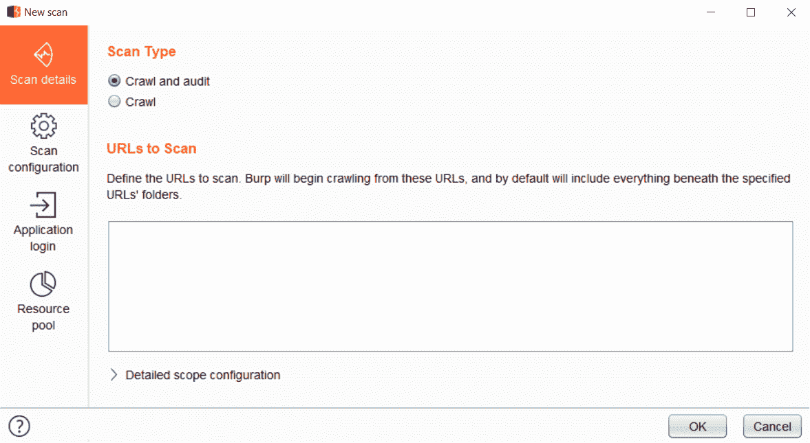
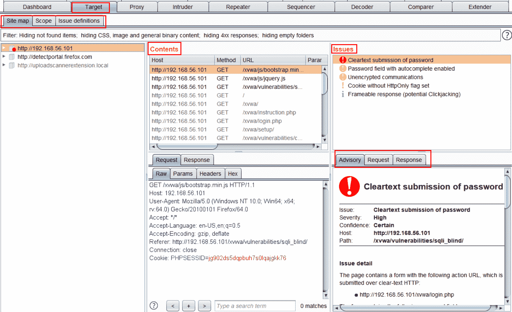
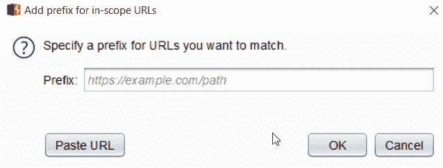
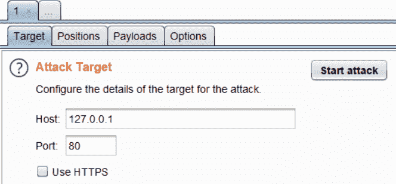
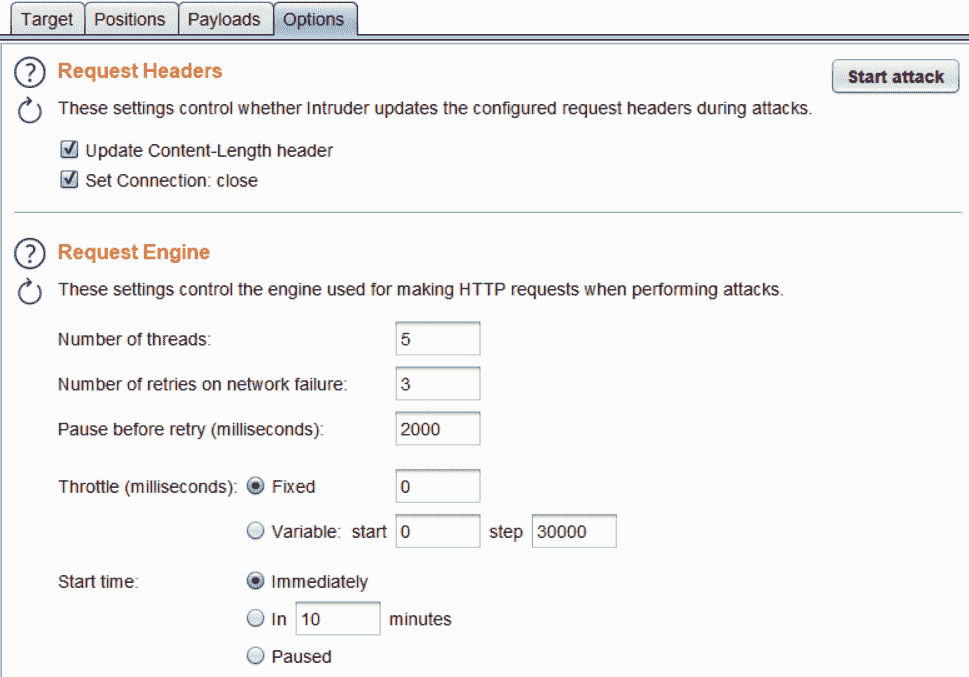
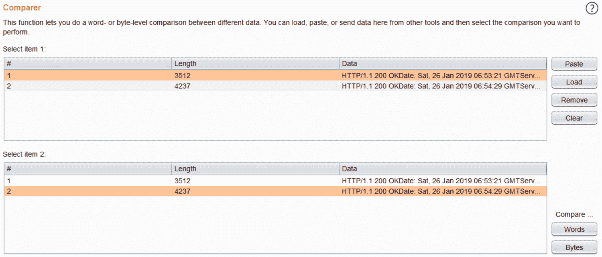
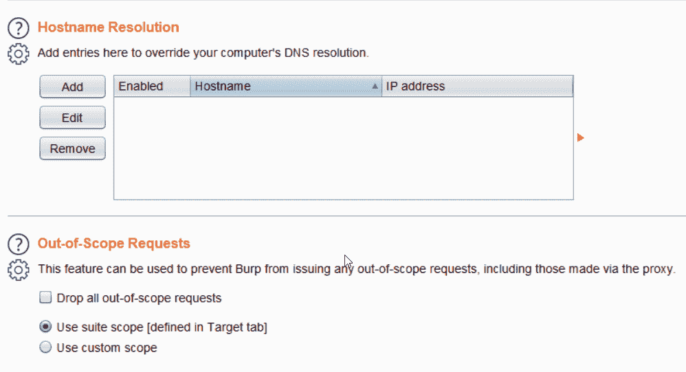

# 探索应用程序渗透测试的阶段

在本章中，我们将了解应用程序渗透测试涉及的阶段，并对 Burp Suite 工具进行广泛概述。基于这些知识，我们将枚举并收集有关我们目标的信息。

本章将涵盖以下主题：

+   应用程序渗透测试的阶段

+   更好地了解 Burp Suite

# 应用程序渗透测试的阶段

理解应用程序渗透测试的阶段是微不足道的，因为它奠定了基础，并确保渗透测试人员覆盖所有可能的端点并进行有效的扫描。Web 应用程序渗透测试通常分为以下阶段：

+   规划和侦察

+   客户端端代码分析

+   手动测试

+   自动化测试

+   利用发现的问题

+   深入挖掘数据外泄

+   获取外壳

+   报告

在这些阶段中，规划和侦察阶段是最重要的阶段，因为测试人员可能会错过应用程序的关键入口端点，并且这些区域可能会未经测试。让我们更详细地探讨一下发生了什么...

# 规划和侦察

在规划和侦察阶段，我们定义了渗透测试的范围。这个初始阶段需要大量的规划，您需要回答诸如：

+   渗透测试的范围是什么？

+   受限制的 URL 是什么？

+   范围内的各个子域是什么？

+   同一域中是否托管了多个应用程序，位于不同的文件夹中？

+   此应用程序是否在其他平台上托管（即移动应用程序，Web 应用程序，桌面应用程序等）

一旦您回答了这些问题，您将对应该测试什么和不应该测试什么有一些清晰的认识。根据是黑盒还是白盒测试，进一步的枚举将会发生。在任何一种情况下，我们都必须继续并发现范围内应用程序的所有文件和文件夹，并识别端点。稍后，在下一章中，我们将看到如何使用 Burp 发现新文件和文件夹。

# 客户端端代码分析

根据测试类型，我们也可以进行代码分析。对于作为白盒测试一部分托管的应用程序，整个代码将对测试人员可用，并且他可以使用自定义工具执行整个代码审查，并根据代码逻辑找到漏洞。假设它是黑盒，并且需要进行代码分析。在黑盒情况下，唯一进行的代码分析是客户端端代码和 JavaScript 库引用。根据分析，测试人员可以绕过这些脚本实施的某些验证逻辑，并使我们能够执行某些攻击。

在下一章中，我们将详细讨论如何通过代码操纵绕过客户端逻辑。...

# 手动测试

这是测试人员的头脑存在帮助他发现应用程序中各种漏洞的阶段。在这个阶段，攻击者通过模糊不同的输入字段并检查应用程序响应来手动测试漏洞。有时扫描程序无法找到某些漏洞，用户干预是非常必要的，这就是手动测试取得成功的地方。某些漏洞往往会被自动扫描器忽略，例如：

+   各种业务逻辑缺陷

+   二次 SQL 注入

+   渗透测试加密参数

+   权限提升

+   敏感信息披露

# 各种业务逻辑缺陷

每个应用程序都有自己的逻辑来完成一些功能。业务逻辑通常是完成工作所需的一系列步骤。让我们举个例子，如果用户想在购物网站上购买产品，他必须按照一系列步骤进行操作：

1.  选择一个项目

1.  指定产品的数量

1.  输入交付信息

1.  输入卡片详细信息

1.  完成支付网关程序

1.  购买完成

1.  交付待定

1.  交付完成

正如你所看到的，涉及很多步骤，这就是自动化扫描仪失败的地方。

# 二阶段 SQL 注入

SQL 二阶段工作方式不同；网页应用程序中的一个页面接受恶意用户输入，然后在另一个页面或另一个应用程序中的某个其他功能检索此恶意内容，并将其解析为查询的一部分。自动化扫描仪无法检测此类问题。然而，Burp 具有一个实现的逻辑，可以帮助攻击者发现 SQL 二阶段漏洞。

# 渗透测试加密参数

在信息被发送到第三方的应用程序中，比如从购物门户到支付网关的端点，比如信用卡详细信息，信息是通过双方同意的密钥加密的。自动化扫描仪将无法扫描这种情况。如果应用程序意外地暴露了任何端点，那么通过手动分析，渗透测试人员可以测试这些加密参数是否存在漏洞。

# 利用发现的问题

正如前面讨论的，一旦应用程序使用自动化扫描仪和手动测试进行扫描，然后就会进入这个阶段。发现的问题，如 SQL 注入文件上传绕过，XXE 攻击等，允许攻击者/测试者获得进一步挖掘并攻击应用程序以获取 shell 的能力。因此，一旦在这个阶段发现了问题，渗透测试人员将继续利用这些问题，以查看可以提取信息的程度。这是攻击者可以链接多个漏洞以查看是否可以引起更大漏洞的阶段。HackerOne 上有许多提交报告显示了测试人员如何链接多个漏洞，最终导致远程代码执行。

# 权限提升

自动化扫描仪不了解应用程序中可用角色或访问级别的知识，因此永远无法发现这些漏洞。因此，始终需要手动干预。

# 敏感信息泄露

自动化扫描仪的知识来确定信息是否敏感通常是通过一些关键词和正则表达式的组合来完成的，比如信用卡正则表达式或电话号码正则表达式。除此之外，都需要人工干预。

下一章将详细介绍如何进行手动分析。

# 自动化测试

自动化扫描是在网络和网络上进行的一个阶段。自动化扫描仪有助于发现从输入验证绕过到 SQL 注入等多个缺陷。自动化扫描需要加快多个发现的速度。在自动化扫描中，扫描仪模糊化所有输入参数，以找到 OWASP 前 10 名中的漏洞，特别是过时的插件和版本。它有助于找到敏感文件，比如根据其提供的字典找到管理员登录。应该注意，应用程序渗透测试不应该仅仅基于自动化扫描实践来得出结论。应该始终进行手动干预来验证发现。很多时候...

# 深挖数据外泄

有时用户无法获取 shell，或者可能出现应用程序可能容易受到盲目 SQL 或 XXE 攻击的情况；那么现在该怎么办呢？嗯，在这种情况下，攻击者仍然可以尝试使用带外技术或简单技术来外泄信息。使用这些技术，攻击者可以外泄大量信息，比如从数据库中提取用户凭据，通过 XXE 注入读取文件等。在后面的章节中，我们将看到如何使用 Burp 的带外技术进行数据外泄。

# 获取 shell

好吧，这是所有渗透测试人员最喜欢的部分，当他们对渗透测试活动感到满意时。一旦测试人员通过任何漏洞（如 SQL、RFI、文件上传、LFI 等）获得了 shell，他就可以尝试看看自己是否能够提升在服务器上的权限。如果他能够成为系统或根用户，那么这就是完全的妥协，测试可以被认为是完全成功的。

# 报告

一旦测试完成，接下来就是最重要的阶段：报告。报告必须尽可能准确和详细地进行，以向组织解释漏洞及其影响。这是因为组织只会通过提交的报告来理解测试人员的努力。您还可以添加测试的攻击以及应用程序如何防御这些攻击，让组织/开发人员了解应用程序的强大程度。

# 更好地了解 Burp Suite

在本节中，我们将看一下 Burp Suite 为测试人员提供的丰富功能和能力。我们还将看一下帮助自动化整个渗透测试过程的快速修复功能，以减少误报的数量。这将帮助初学者了解 Burp 在 Web 应用程序渗透测试方面的强大功能。

# Burp Suite 的特性

Burp Suite 有各种选项，可以让我们有效地进行渗透测试。一旦打开 Burp Suite，您会看到以下选项卡：

+   仪表板

+   目标

+   代理

+   入侵者

+   重复器

+   顺序器

+   解码器

+   比较器

+   扩展器

+   项目选项

+   用户选项

这是 Burp Suite 上的样子：

让我们逐一了解所有这些选项，以便在以后的章节中进行渗透测试时，我们能够充分了解这些功能。

# 仪表板

Burp Suite 仪表板分为以下三个部分：

+   任务

+   问题活动

+   咨询

+   事件日志

这使用户可以完全了解在测试人员运行自动扫描时发生了什么。仪表板看起来像下面的截图：

在任务选项中，测试人员可以点击“新扫描”并指定要扫描的网站。除了网站名称，还有其他选项，如配置扫描设置。一旦点击“新扫描”按钮，你会看到一个像这样的屏幕：

...

# 目标

**目标**选项卡允许您查看在范围内的应用程序的整个站点地图。它向用户显示了应用程序上检测到的所有文件夹和文件以及构建逻辑。目标选项卡还有许多其他功能。映射可以通过两种方式进行；一种是手动浏览，另一种是通过自动爬虫。如果测试人员正在进行手动浏览，请关闭代理拦截并浏览应用程序。随着不同页面的请求和响应不断在 Burp Suite 中出现，目标选项卡会显示检测到的结构。这使用户可以了解应用程序的外观以及整个应用程序中的文件夹和文件命名约定。嗯，正如我们所知，对于一个有很多页面的大型网站，使用自动爬虫是最合适的选择，如下面的截图所示：

您可以在目标选项卡中看到有三个子部分，**站点地图**，**范围**和**问题定义**。让我们看看**范围**选项卡提供了哪些功能。**范围**选项卡提供了两个关键功能；一个是要包含在范围内的 Web URL，另一个是要从范围中排除的 Web URL。

在这里，测试人员可以输入 Web URL 的特定文件夹，或者如果范围是主 URL，则可以输入整个 URL 本身。例如，假设要测试的应用程序位于[www.website.com/pentesting/](http://www.website.com/pentesting/)，那么范围可以限制在 pentesting 文件夹中。如果是整个网站，那么可以输入网站名称本身，如下所示：

要添加 URL，只需单击**添加**，然后输入 URL 或带有文件夹路径的 URL。用户单击**添加**后，将看到以下屏幕：

同样，**从范围中排除**可以确保不会向**从范围中排除**的 URL 发送任何测试或额外的请求。当应用程序中存在可能是敏感页面的某些文件夹时，这是有效的，例如忘记密码功能或注册功能。

在生产环境中进行测试时，如果包括在测试中，那么将会有大量的垃圾信息，清除这些信息将是繁琐的，客户也不会欣赏。因此，请确保使用此功能。另一种方法是右键单击特定文件，然后选择是否要将其排除或包括在范围内。例如，如果需要将某些内容包括在范围内，可以按照下面的屏幕截图所示进行操作：

如果您需要从范围中排除特定路径或文件，可以通过右键单击 URL 并选择**从范围中删除**来完成，如下面的屏幕截图所示：

还有一个高级范围控制功能。当您在范围选项卡中启用它时，它可以让您输入协议类型，即 HTTP 或 HTTPS，然后是 IP/IP 范围，以及端口号和文件，如下面的屏幕截图所示：

问题定义包含 Burp 可以检测到的所有漏洞的定义。这让我们对 Burp Suite 发现如此多漏洞的丰富检测能力有了很好的了解，如下面的屏幕截图所示：

Burp 还在站点地图中提供了过滤器，确定要显示什么和需要隐藏什么。例如，请求应该如何过滤，然后显示的 MIME 类型，然后是状态代码。还有其他选项，例如按搜索词、按扩展名和按注释进行过滤。这些都很容易理解，并且可以根据用户的要求进行配置，如下面的屏幕截图所示：

这有助于清晰地了解站点地图。

# 代理

这是整个工具的核心；Burp Suite 上发生的一切都是通过这个地方进行的。代理选项卡允许您拦截请求并通过编辑和发送到重复器、入侵者或任何 Burp 测试模块来进行操作。这是您可以决定测试人员想要对请求做什么的地方。**代理**选项卡如下屏幕截图所示：

拦截请求后，可以以不同的方式查看。对于简单的 HTTP 请求，可用的选项包括原始、参数、标头和十六进制。根据请求的类型，如果是 Web 套接字请求，则会有一个 Web 套接字选项卡...

# 入侵者

这是应用程序的核心功能。Burp 的这一功能允许用户自动执行用户想要的过程。自动化用于对 Web 应用程序执行攻击。这一功能非常可定制，可用于各种任务，从暴力破解到利用 SQL 注入和操作系统命令注入等。

Intruder 有四个子标签，分别是：

+   **Target**

+   **Positions**

+   **Payloads**

+   **Options**

**Target**标签显示了请求发送到的 IP 和端口，以及**Start attack**按钮。这个按钮被点击一次，为要测试的特定请求进行设置，如下所示：

**Positions**标签在**Intruder**中用于选择有效载荷位置。如下截图所示，`txtUsername`和`txtPassword`的**Value**参数被突出显示。**Add**按钮添加分隔符；两个分隔符之间的任何内容都成为一个攻击点。如我们在示例请求中看到的，自动化需要完成的地方有两个。**Clear**按钮从请求中删除所有注入点，**Auto**按钮添加 Burp 突出显示的所有可攻击的参数。

这个标签中最有趣的是攻击类型。Burp 支持四种不同的攻击类型：

+   **Sniper**

+   **Battering Ram**

+   **Pitchfork**

+   **Clusterbomb**

让我们更详细地了解一下攻击类型。

**狙击手**：狙击手支持单一组有效载荷。它将一次发送一个有效载荷。所以假设我们希望对一个位置进行模糊测试，那么狙击手是最适合进行攻击自动化的。它不适用于两个攻击点，因为狙击手只会向第一个攻击点发送一个有效载荷。一旦有效载荷集用尽，它将把有效载荷发送到第二个攻击点，将第一个点保留为默认值。狙击手总是用于单一输入攻击点。如果我们在前面的截图中使用狙击手，它将首先对用户名进行模糊测试，将密码保持为`admin`，然后对密码字段进行模糊测试，将用户名字段保持为默认值，即 admin。

**Battering Ram**：Battering Ram 也使用单一组有效载荷。这里有趣的是 Battering Ram 会在多个位置传递相同的有效载荷。这意味着一旦有效载荷列表被指定，它将在所有需要进行模糊测试的标记位置发送第一个有效载荷值，以此类推，直到最后一个有效载荷。生成的有效载荷数量等于提供的有效载荷数量，而不管模糊测试的位置如何。

**Pitchfork**：此攻击使用多组有效载荷。假设我们已经标记了两个模糊测试的位置，类似于前面的截图，并且给出了两组有效载荷；一个是用户名，另一个是密码。当攻击开始时，有效载荷集中的第一个有效载荷被设置在第一个位置，第二个有效载荷集中的第一个有效载荷被设置在第二个位置，攻击随之增加。攻击的总次数将等于有效载荷集中有效载荷最少的数量。

**ClusterBomb**：此攻击使用多组有效载荷。它是所有有效载荷位置的完全排列组合。假设有两个有效载荷位置，用户名和密码，以及两个不同的有效载荷集，用户名集和密码集。攻击发生的方式是，位置 1 的第一个有效载荷与位置 2 的所有有效载荷集一起测试。一旦用尽，那么第二个有效载荷将设置在位置 1，并且所有第二组有效载荷将针对它进行测试。因此，总共生成的请求数量将是有效载荷集中有效载荷数量的乘积。假设我们对位置 1 有 10 个有效载荷，对位置 2 有 10 个有效载荷：将发送的请求总数将是 100。

接下来的标签是**Payloads**标签。它包含四种不同的设置，分别是：

+   **Payload Sets**

+   **Payload Options**

+   **Payload Processing**

+   **Payload Encoding**

**负载集**：**负载集**允许您指定在哪个负载位置输入什么类型的负载。

**负载选项**：此设置允许您设置负载。测试人员可以从可用的 Burp 列表中设置，如果是专业版，否则可以使用**加载...**选项加载自定义文件集，如下图所示

**负载处理**：此设置允许用户在使用每个负载之前执行不同的任务。在开始攻击之前可以配置规则，如下图所示：

**负载编码**：此设置允许将自动编码设置为打开或关闭，并借助复选框。用户可以指定在发送到测试时需要对其进行 URL 编码的字符，根据正在测试的应用程序的依赖性，例如：

最后一个选项卡是**选项**选项卡，允许测试人员配置攻击自动化的其他设置。它包含以下设置：

+   **请求头**

+   **请求引擎**

+   攻击结果

+   **Grep 匹配**

+   **Grep 提取**

+   **Grep 负载**

+   重定向

**请求头**：此设置允许用户根据负载的长度自动**更新 Content-Length 头**，并设置**Set Connection: close**的头，以便不通过将其置于等待状态来利用应用程序的资源。

**请求引擎**：请求引擎允许用户通过指定要使用的线程数、在网络故障时要进行的重试次数、暂停、节流等来控制测试速度，如下图所示：

攻击结果：此设置允许测试人员根据攻击结果选择要捕获的信息。

**Grep-Match**：此设置允许用户突出显示某些字段，以快速查看特定表达式的调用。例如，如果用户成功登录，则会有注销选项，因此如果用户在此处添加表达式注销并启用此设置，那么请求将被突出显示并易于发现，如下所示：

Grep 负载：此设置用于标记包含与提交的负载相同值的结果。

**重定向**：此设置告诉 Burp 在发送请求时检测到重定向时该做什么。

# **Repeater**

**Repeater**允许测试人员通过对其进行修改并检查服务器响应来递归地提交相同的请求。假设测试人员正在测试特定请求的一个参数上的 SQL 注入或命令注入漏洞。测试人员可以在**代理**中捕获请求并将其发送到**Repeater**，操纵参数并将其发送到服务器以检查响应，然后再次操纵它并检查响应。这就像一个手动调试器。查看以下屏幕截图，以清楚了解第一个请求，即一个简单的登录请求：

它以**OK**作为响应。但是，如果我更改用户名的值...

# 比较器

Burp Comparer 是 Burp 的一个功能，用于基于单词或字节比较的差异比较。比较可以在许多条件下使用。例如，假设用户想要比较成功和失败的登录响应之间的差异。比较器将显示字节差异的区域。我们可以想到的另一个用途是用于测试 SQL 注入以查看差异。有两种类型的比较。要将响应发送到比较器，只需右键单击响应，然后选择“发送到比较器”。参考以下截图：

为了澄清，我们已将两个不同的响应发送到比较器：一个是成功登录，另一个是失败登录。**比较器**工具栏将如下所示：

测试人员可以从项目 1 中选择一个响应，从项目 2 中选择另一个响应，然后点击“按单词比较”和“按字节比较”。该工具将进行单词对单词的比较，并显示删除、修改和添加等差异，例如：

比较以颜色编码的方式显示，如前面截图中所示的**修改**、**删除**和**添加**。

# Sequencer

**Sequencer**用于分析会话 cookie、CSRF 令牌和密码重置令牌的随机性。当我们使用**Sequencer**对**会话**令牌进行分析时，我们将更详细地讨论这一点。

有关 Burp Suite Sequencer 的更多信息，请访问[`www.preflexsol.com/burpsuite.shtml`](http://www.preflexsol.com/burpsuite.shtml)

# 解码器

这个 Burp 实用程序允许测试人员在应用程序中遇到数据时对其进行编码、解码和哈希处理。支持不同类型的编码器和哈希，例如：

| 编码器/解码器 | 明文 | URL | HTML | Base64 | ASCII 十六进制 | 十六进制 | 八进制 | 二进制 | Gzip |
| --- | --- | --- | --- | --- | --- | --- | --- | --- | --- |

以下是使用解码器中的**编码为...**选项对字符串密码进行 base64 编码的示例：

支持多种类型的哈希，从 SHA 到 SHA3-512，然后是 MD5、MD2 等。尝试使用解码器，它在渗透测试中将是一个非常方便的实用工具。

# 扩展程序

Burp 的这一功能允许测试人员使用独立开发的不同扩展，作为 Burp 功能的附加功能。Burp 非常可扩展；用户甚至可以编写自己的代码来创建 Burp 扩展，并将其嵌入以更充分地利用 Burp。为了充分利用这些扩展，用户必须提供 Jython 和 JRuby JAR 文件的路径。我们很快将看到如何做到这一点。让我们看看以下 Burp Extender 页面：

在 Extender 部分，转到**选项**页面，并提供下载的 Jython JAR 文件的路径。可以从[`www.jython.org/downloads.html ...`](http://www.jython.org/downloads.html)下载 Jython JAR。

# 项目选项

项目选项类似于用户选项，但此选项卡特定于已启动的特定项目。它包含以下子选项卡：

+   **连接**

+   **HTTP**

+   **SSL**

+   **会话**

+   **其他**

**连接**选项卡包含以下项目列表：

+   **平台认证**

+   **上游代理服务器**

+   **SOCKS 代理**

+   **超时**

+   **主机名解析**

+   ****超出范围的请求****

**平台认证**: **平台认证**包括通常在用户访问应用程序之前存在的认证（例如，HTTP 认证、NTLMv1、NTLMv2 认证、摘要认证等）。因此，如果在**用户选项**选项卡中未进行配置，则可以在此处使用设置。我们将在**用户选项**菜单中详细了解可用的不同选项。

**上游代理服务器**: 假设在一个组织中，需要配置代理才能访问特定应用程序。然而，由于我们将流量重定向到 Burp 作为我们的代理，用户如何将请求重定向到组织代理通过特定应用程序？这就是上游代理服务器发挥作用的地方。上游代理服务器允许您配置组织的代理，以便请求可以发送到代理后面的特定应用程序。

**超时**: 在进行测试时，Burp 发送了许多请求到应用程序。但是它如何理解请求是否已经完成，是否应该等到服务器响应，或者如果服务器无法访问，或者对于某些特定请求响应不可用会怎么样？Burp 用于测试的所有线程可能最终会被利用并处于等待状态。因此，超时功能允许用户根据情况指定何时终止特定请求。如下截图所示，有四种不同类型的超时。普通、无限期响应、域名解析和失败的域名解析：

**主机名解析**: 假设有一种情况，用户想要为托管在特定 IP 上的特定应用程序提供别名。通常 DNS 解析发生在主机文件或 DNS 服务器级别。Burp 还允许用户指定这样的能力，用户可以在此配置中说`127.0.0.1`解析为 pentest，当用户输入`http://pentest/`时，将显示本地主机内容。这种配置可以在**主机名解析**页面中完成。

**超出范围的请求**: Burp 提供了一个功能，可以阻止 Burp 发出任何超出范围的请求。提供的两个功能是丢弃所有超出范围的请求或使用**目标**选项卡中定义的范围。

**HTTP**选项卡中的下一个子选项卡是**HTTP**。如果在用户选项部分尚未配置，则包含所有与 HTTP 相关的设置。**HTTP**选项卡如下所示：

**HTTP**选项卡包含以下三个设置：

+   **重定向**

+   **流式响应**

+   **状态 100 请求**

**重定向**: 在 Burp 中，这些设置允许 Burp 考虑和相应地处理的重定向类型。

**流式响应**: 这些设置用于指定返回无限期响应的 URL。Burp 将直接将这些响应传递给客户端。

**状态 100 响应**: 通过此设置，用户可以控制 Burp 处理带有状态 100 的 HTTP 响应的方式。用户可以选择理解响应 100，或者删除 100 继续头。

下一个选项卡是**SSL**选项卡。在这里，可以设置特定项目的所有与 SSL 相关的配置，如果在**用户选项**选项卡中尚未配置，例如：

以下三个选项可用：

+   **SSL 协商**

+   **客户端 SSL 证书**

+   **服务器 SSL 证书**

**SSL 协商**：用户经常因为**SSL 协商**错误而无法看到应用程序。在这里，用户可以指定特定的协商，手动指定要使用的密码。如果单击“使用自定义协议和密码”，用户将获得所有可用密码的列表，然后可以取消选择导致错误的密码，然后访问应用程序，如下截图所示：

如果仍然无法工作，那么也有可用的解决方法。用户可以选择在协商失败时自动选择兼容的 SSL 参数，或允许使用重新协商，甚至禁用 SSL 会话。

**客户端 SSL 证书**：有时应用程序需要特定的证书，否则无法呈现应用程序内容。这些也称为客户端 SSL 证书。Burp 提供了一个功能，用户可以添加客户端证书，以便每当主机请求时，可以将其发送到主机。**客户端 SSL 证书**选项卡如下所示：

**服务器 SSL 证书**：此面板显示从 Web 服务器接收的唯一 SSL 证书的列表。可以双击该项目以查看整个证书。

接下来是**会话**选项卡，它处理特定项目的所有与会话相关的信息。**会话**选项卡中有三种不同的设置，如下所示：

+   **会话处理规则**

+   **Cookie Jar**

+   **宏**

**会话处理规则**：会话规则允许用户为每个 HTTP 请求让 Burp 执行某些任务。每个规则都有一个定义的范围，用户点击**会话处理规则**设置的**添加**按钮后，定义就可用。可以执行许多操作，例如添加会话 cookie，登录应用程序，检查会话有效性等。以下屏幕截图显示了会话处理规则中可用的定义：

**Cookie jar**：Burp 将网站发出的所有 cookie 存储在 cookie jar 中。会话处理规则利用这些 cookie，甚至更新它们以维持与应用程序的有效会话。在这里，测试人员可以选择从哪里获取和维护所有 cookie，即**代理**，**扫描器**，**重复器**，**入侵者**，**顺序器**和**扩展器**。

**宏**：简单来说，宏就像是一个以上请求的一系列序列。它们可以在会话处理中使用，或者执行诸如获取反 CSRF 令牌之类的操作。当我们谈论 Burp 及其宏时，我们将更详细地了解这一点。

下一个选项卡是**其他**选项卡，其中包含特定项目设置的所有杂项设置。以下屏幕截图显示了**其他**选项卡：

**其他**中有以下三个主要设置：

+   **定时任务**

+   Burp Collaborator 服务器

+   **日志**

**定时任务**：在定时任务部分，用户可以指定要执行的特定活动，主要涉及执行方案。用户可以选择在特定时间暂停或恢复执行，以确保时间约束。设置如下截图所示：

**Burp Collaborator Server**：Burp Collaborator 是一个外部服务，用于获取带外类型的漏洞。Burp 有一个默认的协作服务器，但如果用户希望，他可以使用此设置配置自己的协作服务器，并可以使用**运行健康检查**选项来了解是否已正确配置。当我们谈论**带外注入**攻击时，我们将更详细地了解 Burp Collaborator。

**日志记录**：这很简单明了。此设置允许用户控制 HTTP 请求的日志记录。用户可以选择需要记录的工具的请求和响应的部分。

这涵盖了**项目** **选项**部分。在扫描期间，除非需要特殊配置，否则大多数情况下这些都不会被更改，因此了解所有这些设置以更好地理解在出现情景时该怎么做是很有必要的。让我们继续下一个选项卡，**用户选项**选项卡。

# 用户选项

**用户选项**选项卡包含用户可以配置的所有设置，以便 Burp 在每次启动时都能默认运行。大多数设置与**项目** **选项**中看到的设置类似；唯一的区别是这是每次运行 Burp 时的永久配置，而**项目选项**仅在项目有特殊要求时配置。

**用户选项**中有以下四个选项卡：

+   **连接**

+   **SSL**

+   **显示**

+   **其他**

让我们看一下以下屏幕截图，以查看**连接**选项卡的可用设置：

**连接**选项卡有以下一组选项：

+   **平台认证 ...**

# 侦察和文件发现

在本模块中，我们将看到如何通过 Burp 进行侦察，以便检测应用程序中的文件和文件夹。这个阶段很重要，因为它有助于映射整个站点结构，因为可能有一些文件夹通过站点超链接不可用，但有时在应用程序上是可用的。通常人们最终会发现很多敏感文件和文件夹托管在网络应用程序的范围内。检测这些文件和文件夹的能力完全取决于可用的字典的强度。让我们继续看看如何使用 Burp Suite 来做到这一点。

# 使用 Burp 进行内容和文件发现

对于本模块，我们将使用**OWASP BWA**并发现可用应用程序中的所有文件和文件夹。我们将看到如何配置和设置 Burp 上必要的参数以执行内容发现。

启动 OWASP BWA VM 并记录 IP 地址，在浏览器中访问应用程序，并在 Burp Suite 中检查您的站点地图。它应该看起来像这样：

继续右键单击 URL 地址，然后选择参与工具，然后单击发现内容。它将显示您可以指定以开始自动化...的不同参数集。

# 摘要

简而言之，我们已经看到了应用程序渗透测试的不同阶段，现在我们将开始查看不同的漏洞以及如何使用 Burp 来发现这些漏洞。除此之外，我们还看到了 Burp 中可用的不同功能以及为用户提供的配置，以便轻松使用代理拦截。

在下一章中，我们将规划应用程序渗透测试的方法
