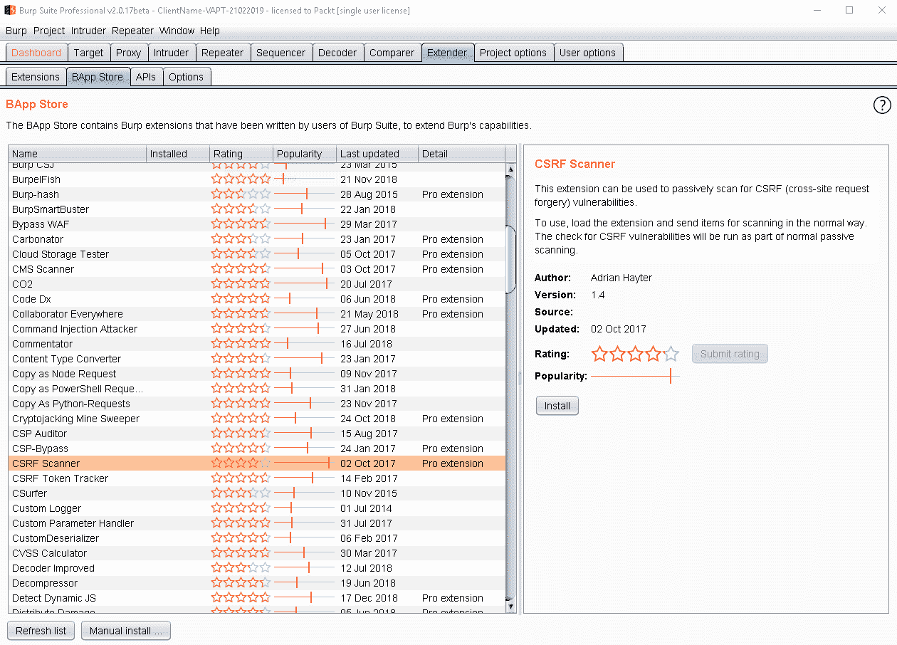
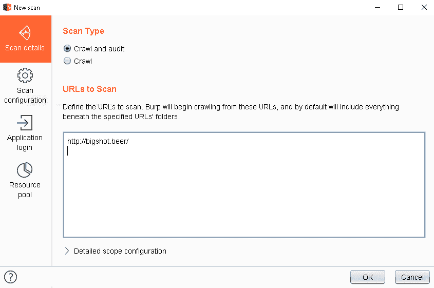
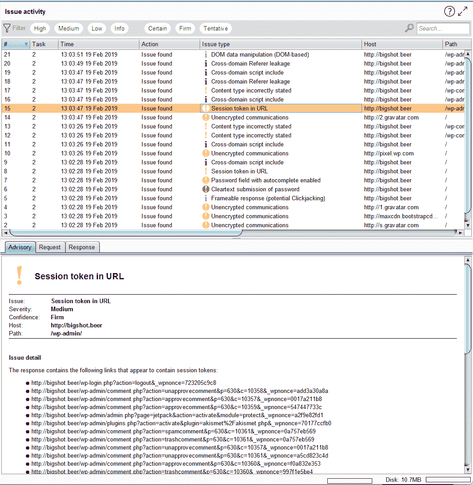
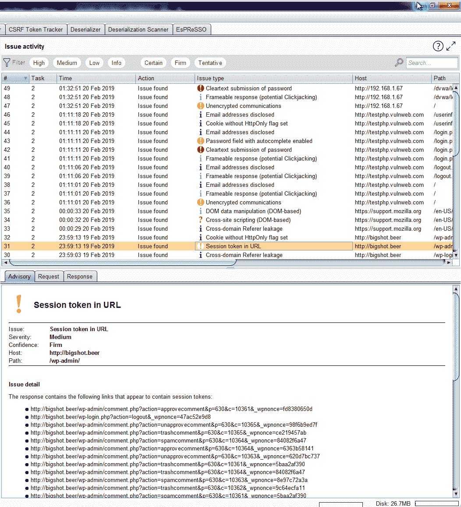

# 第七章：使用 Burp Suite 检测漏洞

正如我们在上一章中看到的，Burp Suite 对于识别不同类型的漏洞非常有用。在上一章中，大部分漏洞都是使用 Intruder 工具检测到的输入验证错误。在本章中，我们将检查与输入验证弱点无关的错误。

本章将涵盖以下主题：

+   检测 CSRF

+   检测不安全的直接对象引用

+   检测安全配置错误

+   检测不安全的反序列化

+   检测与 OAuth 相关的问题

+   检测破损的身份验证

# 检测 CSRF

**跨站请求伪造**（**CSRF**）是一种漏洞，允许恶意用户使用其他应用程序中存储的信息在应用程序中执行操作。例如，想象一下，您只使用一个网络登录到不同的应用程序，这是一个社交网络。如果您向其他站点发送请求，它们将应用更改或操作，因为它们正在使用您提供给**中央**应用程序的信息。

因此，恶意用户可以通过创建一个虚假表单或虚假 URL 来利用应用程序，在该应用程序中执行操作。这迫使用户在不知情的情况下执行应用程序。例如，看看这段 HTML 代码，其中隐藏了一个链接到``标签中：

[PRE0]

一开始，你觉得没什么不同，它只是一个无害的 HTML 标记。但是当它被解析时，浏览器会获取标记指向的资源并执行 URL。因此，如果恶意用户隐藏了包含在此标记中的操作的 URL，例如更改密码，操作将被执行。

# 使用 Burp Suite 检测 CSRF

要检测 CSRF 漏洞，首先需要映射所有可能的授权操作。这是因为您需要测试每个操作，以发现是否可能使用存储的信息执行其中任何一个。要映射所有这些操作，您可以使用 Target 工具。

Burp Suite 使用不同类型的方法来映射应用程序。手动地，Burp Suite 可以以被动的方式收集所有请求、资源和 URL；但当然，它仅限于用户的范围。Burp Suite 还可以使用蜘蛛和爬行技术进行自动映射。

在下面的截图中，您可以看到 Burp Suite 正在创建一个应用程序树，其中包含所有操作。...

# 使用 Burp Suite 检测 CSRF 的步骤

当然，Burp Suite 扫描程序能够检测 CSRF 缺陷，但可能会使用参数信息调用函数。为了更可靠地检测，我们将使用代理工具和名为 CSRF 扫描程序的扩展。

1.  要安装 CSRF 扫描程序，请转到 Burp Suite 的 Extender 选项卡，并在 BApp Store 中查找 CSRF Scanner，然后单击安装，如下所示：

1.  安装后，Burp Suite 将显示一个新选项卡，显示该工具，如下所示：

1.  要检测 CSRF，请进入我们认为存在漏洞的应用程序，并使用拦截按钮拦截请求。请记住，对于所有 CSRF 漏洞，您需要登录或建立会话。右键单击“Engagement tools”，然后生成 CSRF PoC。将打开一个新窗口，其中包含使用请求中公开的数据生成的 HTML 表单，如下所示：

1.  验证所有参数是否包含在表单中，然后将其复制到记事本或其他文本编辑器中，并将其保存为 HTML 文件。然后在 Web 浏览器中打开它。你将只看到一个空白网站和一个按钮，如下所示：

1.  单击“提交请求”，表单将被发送到网站。由于这是一个**概念验证**（**PoC**），页面是故意留空的，但如果需要创建一个更真实的页面，只需将表单添加到页面中。如果操作被执行，该 URL 就容易受到 CSRF 攻击。

最后一个提示是，如果发现应用程序使用了反 CSRF 令牌，请尝试检测漏洞，因为有时开发人员会忘记为所有功能使用令牌，可能会找到一个有漏洞的功能。

# 检测不安全的直接对象引用

当参数获得对某个资源的访问权限时，就会出现**不安全的直接对象引用**（**IDOR**）漏洞。通过修改此参数，可以访问未经授权的其他资源。通常受影响的参数用作应用程序流程的控制，例如命名为`id`、`uid`、`r`、`url`、`ur`等。

可以使用 Burp Suite 中的“目标”工具来检测这些漏洞。与 CSRF 检测类似，您检测到的 URL 越多，发现漏洞的可能性就越大：

1.  将目标添加到范围中，转到 Burp Suite，并使用鼠标的辅助按钮，单击“添加到范围”选项。

1.  然后转到...

# 检测安全配置

安全配置是相对的。在这个类别中，引入了很多可能的错误，使用 Burp Suite 检测它们的最简单和准确的方法是通过扫描器。

1.  打开 Burp Suite，当主仪表板显示时，单击“新扫描”。在这里可以定义要扫描的 URL 和一些选项，比如登录应用程序的凭据，如下面的屏幕截图所示：

1.  测试按类别分类。扫描完成后，我们可以看到一些与安全配置有关的问题，如下面的屏幕截图所示：

正如我们所看到的，有一些问题，比如未加密通信或明文提交密码，我们无法通过分析请求来检测，但扫描器标记了一个问题。

让我们回顾一些常见的安全配置错误，我们将在接下来的章节中详细讨论。

# 未加密通信和明文协议

有一个常见的问题，大多数开发人员和系统管理员没有考虑到；即未加密通信渠道的使用。有些协议以明文形式发送信息，如果恶意用户拦截网络中的流量（这相对容易），则可以查看所有信息，无论其是否敏感。这个问题通常被忽视，因为 Web 应用程序是公开的；但请记住，其中一些是内部的，也可以从公共网络访问。

# 默认凭据

另一个重要问题是可以用来完全控制托管应用程序的服务器的默认凭据。许多 Web 服务器、邮件服务器、数据库服务器、CMS、电子商务工具等在安装时都设有默认密码。对于恶意用户来说，访问这些服务和应用程序是非常容易的。

# 无人值守安装

有时，当系统管理员安装软件时，该软件会附带其他软件包，用于测试目的或作为主要软件的一部分。重要的是要对这些安装进行清单，以便禁止访问或删除，如果可能的话。恶意用户可以发现这些未经监控的安装，并利用它们的漏洞。

# 测试信息

一些应用程序和软件包具有测试信息，如果激活，可能会为恶意用户提供访问权限。例如，一个常见的情况是 Oracle DBMS，它有一个用于测试目的的数据库，其中有一个名为`tiger`的数据库管理员，密码为`scott`。

# 默认页面

应用程序，主要是 Web 服务器，具有默认页面，可能会被恶意用户检测到并作为横幅抓取。

尽管 Burp Suite 扫描器在检测这种问题方面很有用，但我建议使用专注于基础设施的漏洞扫描器，例如 Nessus、Qualys、Outpost24、OpenVAS 等。

# 检测不安全的反序列化

**反序列化**是将某种类型的数据传递给其他数据，由应用程序进行管理的过程，例如，传递一个 JSON 格式的请求，由应用程序解析并以 XML 格式进行管理。此外，还存在涉及开发中使用的技术的反序列化漏洞。这些漏洞将某种类型的资源传递给二进制对象。

要了解漏洞，请查看下面的代码片段，发布在 CVE.2011-2092 中：

[PRE1]

这段代码是称为**JFrame**的数据类型的类定义。在下面的代码片段中，我们可以看到它是如何使用的：

[PRE2]

问题在于任何类型的数据都可以输入到属性中，因为它们没有经过验证，如下面的代码行所示：

[PRE3]

漏洞源于拒绝服务，因此应用程序无法管理输入。这是一种不安全的反序列化漏洞。

# Java Deserialization Scanner

Java Deserialization Scanner 是 Burp Suite 的一个扩展，用于检测以下问题：

+   Apache common collections 3 和 4

+   Spring

+   Java 6、7 和 8

+   Hibernate

+   JSON

+   Rome

+   BeanUtils

1.  要获得它，转到`Extender`工具，单击 BApp Store，然后安装包。安装完成后，Burp Suite 将在界面上显示一个新选项卡，显示工具如下：

1.  单击“配置”选项卡，然后我们可以看到插件中激活的扫描：

1.  现在，要测试一个...

# 检测与 OAuth 相关的问题

OAuth 是一种开放标准，允许在不同应用程序之间共享授权信息，而不共享用户身份。这是 Facebook、Google、Twitter、Plurk 等当前使用的标准。

与 OAuth 相关的最常见问题如下：

+   **不安全的存储机密信息**：OAuth 是存储在客户端的信息。如果应用程序没有以正确的方式存储 OAuth 信息，它会暴露给多个应用程序的访问权限。

+   **缺乏保密性**：OAuth 是一种协议，可以将认证信息与多个应用程序共享，但是，如果与错误的应用程序共享会发生什么呢？嗯，它可能会被其他应用程序重用以窃取用户的访问权限。

+   **URL 重定向**：如果应用程序存在允许重定向的漏洞，恶意用户可以窃取 OAuth 信息。

# 检测 SSO 协议

有一个名为**EsPReSSO**的扩展，可以在 BApp Store 中找到，它可以检测应用程序使用的 SSO 协议并对其进行分类。检测到的协议如下：

+   OpenID

+   BrowserID

+   SAML

+   OAuth

+   OpenID-Connect

+   Facebook Connect

+   Microsoft Account

安装 EsPReSSO 后，当 Burp Suite 检测到 SSO 协议的使用时，它将被标记，并且您可以单击它将其发送到 EsPReSSO 工具以分析它是何种协议，如下面的截图所示：

# 使用 Burp Suite 检测 OAuth 问题

与 OAuth 相关的问题是如此不同，我们将在以下部分分析其中一些。

# 重定向

打开 Burp Suite，并使用代理工具，检测应用程序中可能的重定向。例如，想象一下，你有一个可以使用社交网络访问的应用程序。这个应用程序有以下 URL：

[PRE4]

拦截请求，并将标头中的 URL 修改为以下内容：

[PRE5]

社交网络只验证字符串[site.tv](http://site.tv)，并信任应用程序。这是一个漏洞。

# 不安全的存储

Burp Suite 可以检测是否通过不受信任的渠道发送了敏感信息；如果 OAuth 令牌通过明文协议或未加密的渠道发送，它可能会被拦截和重用。

OAuth 问题非常具体，但是考虑到前面提到的问题，可以检测到这些弱点。

# 检测破损的身份验证

破损的身份验证是影响应用程序的一组问题。其中一些列在这里：

+   凭证的弱存储

+   可预测的登录凭证

+   会话 ID 暴露在 URL 中

+   会话 ID 容易受到会话固定攻击的影响

+   错误的超时实现

+   会话在注销后没有被销毁

+   通过不受保护的渠道发送的敏感信息

我们将解释如何使用 Burp Suite 检测这些问题。

# 检测凭证的弱存储

关于身份验证的信息存在一个大问题；它不仅存储在服务器端，还需要存储在客户端，也许不是以用户名和密码的形式，而是以令牌、会话 ID 或应用程序用于跟踪用户和提供访问的其他形式。

使用 Burp Suite，可以分析这些信息存储在哪里。例如，将信息存储在 cookie 中是非常常见的，如下面的截图所示：

这是基本身份验证的一个例子，这是内部应用程序常用的身份验证方法。这种方法的一个大问题是，它将凭证以 base64 形式存储到标头中，因此任何有权访问标头的人都可以获取密码，并将其解码为明文。

这不是唯一的问题；还有一些应用程序直接存储凭证。例如，看下面的请求：

[PRE6]

在这里，我们可以直接看到每个客户端请求发送到应用程序的凭证。

还有其他安全的地方可以存储凭证。例如，在移动应用程序的情况下，通常使用内部或外部设备存储中的文件，这些文件由应用程序读取。

关键是要使用代理工具理解应用程序的流程，以确定应用程序如何接收凭证以及工具对其进行了什么操作，使用了什么方法，它们存储在哪里，是否被重用，以及应用程序用于跟踪用户的什么类型的令牌或跟踪 ID。

# 检测可预测的登录凭证

一些应用程序使用可预测的登录，这意味着恶意用户可以猜测下一个或上一个已注册的用户名。例如，想象一下，一个在线银行使用账号作为其应用程序的用户名；恶意用户可以创建一个可能的账号列表，这些账号大多是连续的，以猜测用户名。

检测这种漏洞的一个很好的工具是 Intruder，它在 Payloads 部分，并有一个创建连续列表的选项，如下面的截图所示：

此外，还可以创建连续的日期，甚至...

# 会话 ID 暴露在 URL 中

这不是一个很常见的问题，但过去有很多应用程序在 URL 中添加会话 ID。例如，看下面的截图：

一旦检测到用于存储会话 ID 的变量，就可以应用过滤器来检测 URL 中的所有会话。

看下一张截图。在这里，扫描器检测到了一个令牌，Burp Suite 列出了所有暴露的令牌：

# 会话 ID 容易受到会话固定攻击的影响

当应用程序只使用一个 ID 来跟踪会话时的主要问题是，这个 ID 可以被用来窃取会话。例如，如果你使用 Burp Suite 代理工具，你可以拦截发送会话 ID 的请求。这个会话 ID 只为一个用户创建。例如，看下面的请求：

[PRE7]

现在，使用另一个...

# 超时实施

要检测这个问题，你不需要使用 Burp Suite 这样的工具；只需打开应用程序，登录，并等待知道自动关闭会话需要多长时间。像在线银行这样的应用程序需要按照合规要求在一定时间内关闭会话。

在一段时间后关闭会话是一个好主意；在用户窃取了会话的情况下，可以减少对应用程序的影响。

# 在注销后会话没有被销毁

要检查应用程序是否正确关闭了会话，使用 Burp Suite 打开应用程序，然后使用有效的凭据登录应用程序：

1.  如你从以下截图中所见，应用程序创建了一个作为访客用户使用的会话：

1.  现在，访问应用程序，你会发现应用程序现在创建了一个新的会话作为已登录用户。

1.  关闭会话，如下所示：

1.  如果应用程序正确销毁了会话，就不可能重新发送请求。前往...

# 总结

在本章中，我们回顾了如何检测特定的漏洞。在上一章中，通过检测模式来检测漏洞，而在这种情况下，漏洞需要更多关于应用程序流程的理解。

本章中解释的缺陷可以用来获取敏感信息，突破授权和认证，并成为更大妥协的一部分。在下一章中，我们将利用 Burp 工具和扩展来利用不同类型的漏洞。
