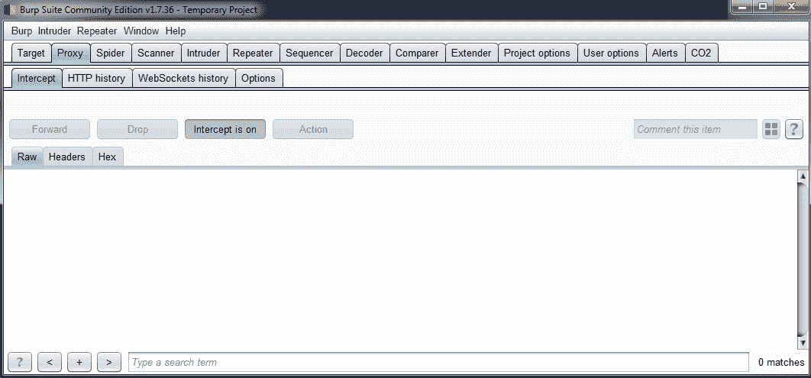

# 利用 Burp Suite 进行漏洞利用-第 1 部分

Burp Suite 是一个优秀的工具，用于检测漏洞。正如我们在之前的章节中所看到的，它有各种各样的工具和选项，当然还有扩展，可以帮助我们在查找应用程序中的漏洞时更加准确和高效。然而，Burp Suite 也有选项来帮助我们利用漏洞，生成关于利用的证据，并在需要时重现利用。

在本章中，我们将检查如何利用 Burp Suite 的选项以及在某些情况下使用工具和扩展来利用不同类型的漏洞。本章将涵盖以下主题：

+   通过盲布尔型基于布尔的数据泄露...

# 通过盲布尔型基于布尔的 SQL 注入进行数据泄露

SQL 注入是基于输入验证错误的漏洞，允许恶意用户将意外的 SQL 语句插入应用程序以执行不同的操作。例如，提取信息，删除数据或修改原始语句。

有三种类型的 SQL 注入，如下所示：

+   带内 SQL 注入：这种类型的 SQL 注入具有可以使用发送语句的相同通道进行分析的特点。这意味着由数据库管理系统（DBMS）生成的响应是在相同的分析应用程序中接收的。

+   推断性：这种类型的 SQL 注入与前一种不同，因为在应用程序的响应中无法看到错误或结果。我们需要推断应用程序后端发生了什么，或者使用外部通道获取信息。同时，推断性 SQL 注入进一步分为两种类型：

+   基于布尔的盲 SQL 注入：在这种类型的 SQL 注入中，语句集中于改变应用程序中的布尔值以获得不同的响应。即使 SQL 注入结果没有直接显示，HTTP 响应内容也可能会改变以推断结果。

+   基于时间的盲 SQL 注入：这种推断性 SQL 注入取决于数据库服务器生成响应所经过的时间。通过时间变化，可以推断 SQL 注入是否成功。为此，恶意用户插入包含在 DBMS 中的函数，以确定后端发生了什么。

+   盲注 SQL 注入：在这种类型的 SQL 注入中，不可能使用相同的通道来查看错误响应或直接推断结果。因此，我们需要使用外部通道来知道 SQL 注入是否成功。例如，使用第二个数据存储来接收结果，比如使用 DNS 解析来推断请求中经过的时间，这是在应用程序中无法看到的。

我们将看到如何使用 Burp Suite 来利用基于布尔的 SQL 注入漏洞。

# 漏洞

分析以下 PHP 代码片段：

[PRE0]

这段代码使用`$id`变量，这是一个数字，将信息传递给直接在数据库中执行的查询中的`SELECT`语句。`$id`变量用于`WHERE`表达式，以查找用户传递的确切`$id`变量，并根据变量`$id`中的数字仅显示过滤后的信息。

关于最重要的事情...

# 利用

假设这个数据库只有 10 条记录，所以如果用户将数字`1`作为值传递给`$id`变量，应用程序将返回第一条记录。当用户输入数字`10`时，应用程序将返回最后一条记录。然而，当用户输入值`11`时，应用程序没有记录可以显示，但它也不显示任何错误来解释为什么不显示任何内容，因为没有更多内容可以显示。输出什么也不做。

由于应用程序未验证输入到`$id`变量的值，用户可以输入任何类型的信息。例如，`'1`或`1=1--`字符串，这是用于检测 SQL 注入漏洞的常见字符串。但是，正如我们所说，应用程序不会显示错误。

忘记应用程序不显示错误，为什么可以输入`'1`或`1=1--`这样的字符串？我们将在这里给出的流程中看到：

1.  当用户输入`'1`或`1=1--`字符串时，这个字符串被转换为一个真值，应用程序将其解释为数字`1`，因此应用程序返回第一个注册。

1.  如果我们传递一个超出 1 到 10 的值会发生什么？如果我们将数字`11`传递给`$id`变量，`WHERE`条件将尝试查找第 11 个注册，但由于缺少，`$query_statement`变量将不会有一个存储在其中的注册。当 PHP 代码中的以下`if`语句验证存储在`$query_statement`变量中的注册时，应用程序将失败。

1.  我们知道，当应用程序接收到 1 到 10 之间的数字时，应用程序将工作；而且，我们知道当结果是 1 到 10 之间的数字时，我们可以传递任意语句。牢记这一点，如果我们传递`11-1`值是有效的。

1.  *11-1*的结果是*10;*因此，当`WHERE`条件验证`$id`值时，它将有一个数字`10`，因此应用程序将显示最后一个值。这是利用此漏洞的关键！

现在，使用更复杂的语句，如下：

[PRE1]

这个声明产生了最终的数字`10`作为值传递给`$id`；现在，还要考虑以下声明：

[PRE2]

前面的声明产生了相同的结果。因此，两者都可以被接受，由后端执行而不显示结果。此外，如果我们生成一个被执行的语句，但最终值不是 1 到 10，错误将不会显示。

有了这个声明作为基础，我们可以使用 Burp Suite 在以下部分执行数据外泄。

# 使用 Burp Suite 进行数据外泄

执行以下步骤使用 Burp Suite 执行数据外泄：

1.  首先，配置 Burp Suite 以拦截应用程序发出的请求，并在发送`$id`值的请求时停止，使用代理选项卡中的`拦截打开`选项，如下面的屏幕截图所示：

1.  请求停止后，右键单击它，然后选择发送到入侵者选项，如下所示：

默认情况下，Burp Suite 为请求中检测到的每个变量创建通配符，并创建值...

# 使用 SQL 注入执行操作系统命令

SQL 注入攻击最严重的影响之一是在操作系统级别执行命令。大多数情况下，如果用户执行系统命令，这将导致整个服务器和应用程序被攻破。

# 漏洞

SQL 注入中的命令注入漏洞通常发生是因为 DBMS 具有存储过程或允许的本地选项，直接与操作系统交互。例如，在 SQL Server 上的`xp_cmdshell`，或者为 Oracle 开发的特殊存储过程。

在某些情况下，应用程序还可能存储通过查询提取并执行的数据库字符串；因此，如果我们可以更新数据库，我们可以向服务器注入命令。但是，正如我提到的，这不是常见情况。

一旦我们发现与命令注入相关的漏洞，我们可以使用 Burp Suite 来利用它。例如，让我们检查应用程序的以下请求：

这个请求是...

# 执行带外命令注入

正如我们已经多次提到的那样，Burp Suite 最重要的功能是自动化能力。正如我们将在本书的后面探讨的那样，我们可以创建自己的插件来扩展 Burp Suite，或者我们可以找到社区制作的许多扩展。

有一个名为**SHELLING**的扩展，专注于为命令注入攻击创建有效负载列表。我们将在下一节更仔细地研究这个问题。

# SHELLING

SHELLING 是一个在 BApps Store 中不可用的插件，因此您需要转到 GitHub 获取它[`github.com/ewilded/shelling`](https://github.com/ewilded/shelling)。下载`.jar`文件并使用 Burp Suite 中的 Extender 选项安装它：

1.  要做到这一点，点击 Extender 选项卡，然后点击手动安装按钮。Burp Suite 将启动一个窗口来选择`.jar`文件。因为 SHELLING 不是官方扩展的一部分，Burp Suite 将启动以下警告消息以确认您是否要安装它：

1.  安装完成后，您在 Burp Suite 实例上看不到任何不同之处。这是因为 SHELLING 不会修改...

# 利用 XSS 窃取会话凭据

XSS 是一种可以用于许多目的的漏洞。它会弹出一个消息框，以控制受 XSS 影响的计算机。常见的攻击是利用 XSS 窃取凭据或会话。

# 利用漏洞

想象一下，我们有以下易受攻击的请求，其中`name`参数容易受到 XSS 攻击：

[PRE3]

您可以使用 Burp Suite 的代理捕获它，并使用常见的测试字符串修改参数的值，如下所示：

[PRE4]

退出拦截...

# 利用 XSS 控制用户的浏览器

正如我之前提到的，XSS 的最大影响可能是控制受影响的用户。

这基本上取决于 Web 浏览器允许使用 JavaScript 或其他客户端交互执行操作的操作方式，这些操作方式可以通过 XSS 由恶意用户传递。实际上，不需要直接执行 JavaScript。例如，可以在 Internet Explorer 中利用 XSS 执行 ActiveX 控件，如下所示：

[PRE5]

此代码将在远程计算机中启动另一个程序，因此可以在客户端执行任何类型的攻击。

# 利用 XXE 漏洞提取服务器文件

XXE 是一种影响解析 XML 并在解析具有对 XXE 的引用时出现错误的应用程序的漏洞。

# 利用漏洞

想象一下，我们有一个容易受到 XXE 漏洞影响的应用程序，其中我们有一个易受攻击的请求，如下面的屏幕截图所示：

在这里，`xml`参数容易受到 XXE 的影响，如下面的块所示：

[PRE6]

这意味着这是一个接受 XML 作为输入的请求。因此，我们将使用 Burp Suite 的代理修改输入，以查看应用程序是否接受我们的测试字符串。为此，我们将使用以下输入：

[PRE7]

如果被接受，应用程序将显示我们在 XML 输入中传递的消息。因此，使用此输入修改`xml`参数，并点击拦截以发送请求。结果将显示在 HTML 网站中，如下所示：

[PRE8]

现在，我们知道漏洞是可利用的，所以我们将发送一个字符串来从服务器中提取文件。要使用 XXE 攻击提取文件，我们需要更多关于托管应用程序的服务器的信息，至少是操作系统。使用响应中包含的标头，可以知道操作系统是什么，如下所示：

[PRE9]

如果您怀疑，可以使用网络工具（如 Nmap ([www.nmap.org](http://www.nmap.org)））来确认，此标头可能会被系统管理员修改。

在这种情况下，服务器是 Debian Linux。因此，我们需要使用符合类 Unix 文件系统的测试字符串进行攻击，如下所示：

[PRE10]

使用这个，我们将检索`/etc/passwd`文件，在某些情况下，它们作为密码哈希值存储在 Linux 系统中。因此，将原始请求发送到 Repeater 工具，使用此字符串修改`xml`参数，并单击“Go”，如下截图所示：

目前，并非所有的 Linux 系统都使用`/etc/passwd`文件来存储哈希值；过去，作为渗透测试人员，呈现类似前面的截图是展示漏洞风险的完美证据。然而，如今有很多 Linux 系统将它们的哈希值存储在`/etc/shadow`中，该文件是加密的，或者在许多情况下，限制了服务器用户对文件系统的访问。

根据应用程序的上下文，您需要确定要提取哪些文件。例如，作为提示，从 Web 服务器的根目录中提取文件非常有用，以便访问源代码。

# 使用 XXE 和 Burp Suite collaborator 执行过时数据提取

Burp Suite collaborator 是一个用于检测漏洞的服务，主要是当应用程序尝试与外部服务进行交互时。Burp Suite 分析与外部系统的交互并检测异常行为。为了分析应用程序，Burp Suite collaborator 向应用程序发送输入或有效载荷，并等待响应。

因此，在这种情况下，Burp Suite 正在工作一个服务器，应用程序使用常见服务进行交互，如 DNS、SMTP 或 HTTP。

# 使用 Burp Suite 来利用漏洞

在主仪表板选项卡中打开 Burp Suite，单击“新扫描”选项，如下截图所示。请记住，这些选项仅在 Burp Suite 专业版中可用，而不在社区版中可用：

当您使用扫描器 Burp Suite 测试应用程序的漏洞时，您可以修改有关扫描器工作方式的选项，并配置用于自动登录的凭据。这对于大多数应用程序来说非常重要，因为它们大多数都有身份验证控制。为了利用 XXE，我们将对我们拥有的 URL 进行简单的扫描。单击“确定”按钮后，扫描开始。

当扫描完成时，Burp Suite 将在 URL 中显示检测到的 XXE，如下截图所示：

在上述列表中，我们可以看到一些包含短语“External service interaction”的问题，后面跟着使用的协议。如果我们选择其中一个问题，Burp Suite 将显示一个名为 Collaborator interaction 的新选项卡，如下截图所示：

Burp Suite collaborator 允许用户配置自己的服务器，但如果您没有配置一个，collaborator 将默认使用 Portswigger 的服务器。通过分析请求，我们可以检测到 collaborator 发送了以下参数：

[PRE11]

响应如下：

[PRE12]

collaborator 使用一个字符串来识别漏洞。如果我们审查 collaborator 的请求和响应，而不是 HTTP 请求，它是不同的。我们可以看到使用的字符串如下：

阅读响应中的 HTML 代码，我们可以找到以下字符串：

[PRE13]

# 利用 SSTI 漏洞执行服务器命令

SSTI 是一种漏洞，当应用程序使用框架来显示其呈现给用户的方式时发生。这些模板是输入，如果这些输入没有得到正确验证，它们可能会改变行为。

这些漏洞在很大程度上取决于开发人员用来创建应用程序的技术，因此并非所有情况都相同，作为渗透测试人员，您需要识别这些差异以及其对漏洞利用的影响。

# 使用 Burp Suite 来利用这个漏洞

假设您有一个易受 SSTI 攻击的应用程序正在使用 Twig。Twig ([`twig.symfony.com/`](https://twig.symfony.com/)) 是一个在 PHP 中开发的模板引擎。

我们可以通过源代码检测引擎的使用。考虑以下代码片段：

[PRE14]

在这里，我们可以看到应用程序正在等待数据以向用户呈现最终网站。当 PHP 读取模板时，它会执行其中包含的所有内容。例如，2015 年，James Kettle 发布了一个漏洞，允许使用以下字符串在 Twig 中注入后门：

[PRE15]

遵循相同的思路，可以使用以下字符串执行任何命令，甚至获取 shell：

[PRE16]

这是因为在代码中，可以注入任何 PHP 函数，而不需要验证。Kettle 在源代码中展示了漏洞，如下所示：

[PRE17]

基本上，该代码接受任何类型的 PHP 函数，因此，在字符串中，Kettle 输入了`exec()`函数来直接向服务器执行命令。

Twig 并不是唯一存在问题的引擎。Kettle 研究的其他引擎包括 Smarty，另一个 PHP 引擎，理论上不允许直接使用`system()`函数。然而，Kettle 发现它允许调用其他类中的方法。

易受攻击的代码片段如下截图所示：

在这段代码片段中，我们可以看到`getStreamVariable()`方法可能容易读取任何文件，具体取决于服务器权限。此外，我们还可以调用其他方法。

因此，为了在服务器上执行命令，Kettle 向我们展示了以下测试字符串：

[PRE18]

我们可以在`$_GET`变量中添加命令。

在 Burp Suite 中，我们可以将这些测试字符串添加到不同模板引擎的列表中，然后使用 Intruder 工具中的负载选项发动攻击，如下面的截图所示：

# 总结

在本章中，我们学习了 Burp Suite 用于利用不同类型漏洞的常规工具。特别是，我们探讨了盲 SQL 注入、OS 命令注入、利用 XSS、利用 XSS 窃取会话、利用 XSS 控制 Web 浏览器、利用 XXE、利用 XXE 从服务器提取文件以及通过模板引擎利用 SSTI。

在下一章中，我们将利用其他类型的漏洞，展示 Burp Suite 中更多的选项和功能。
