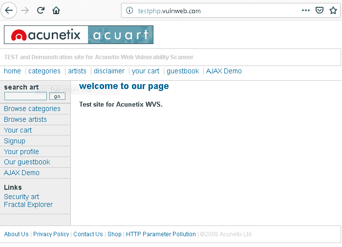
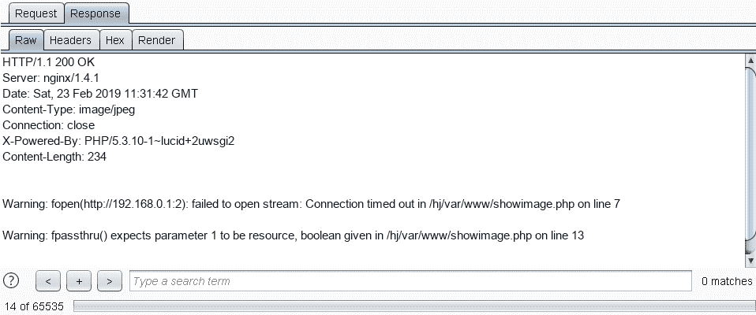
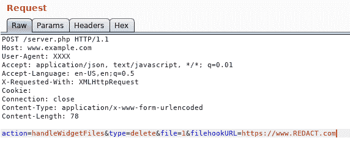
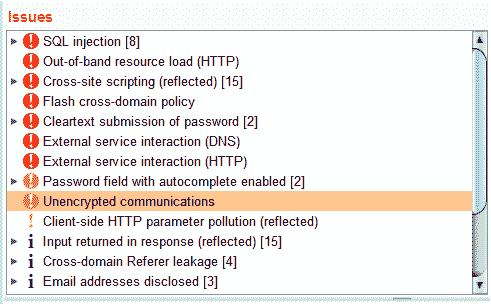
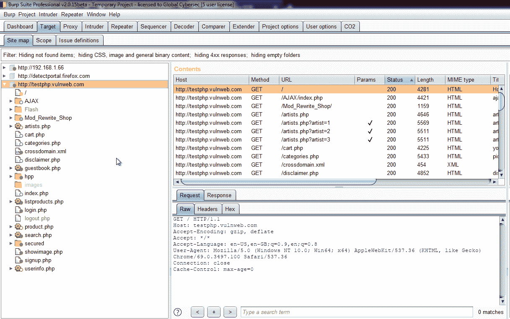
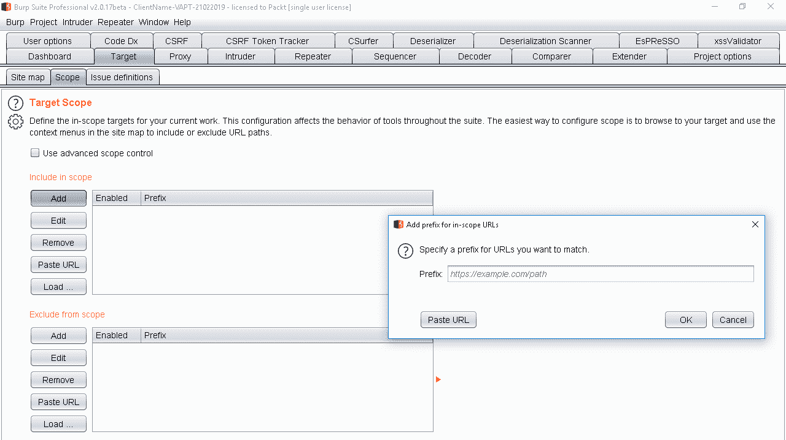
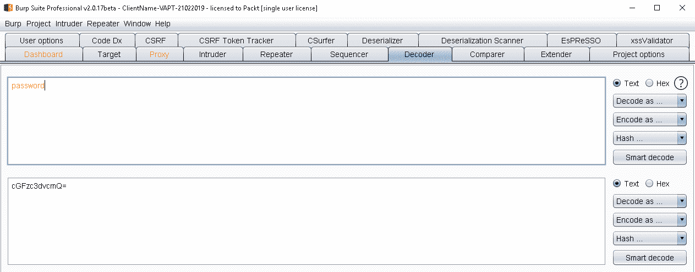
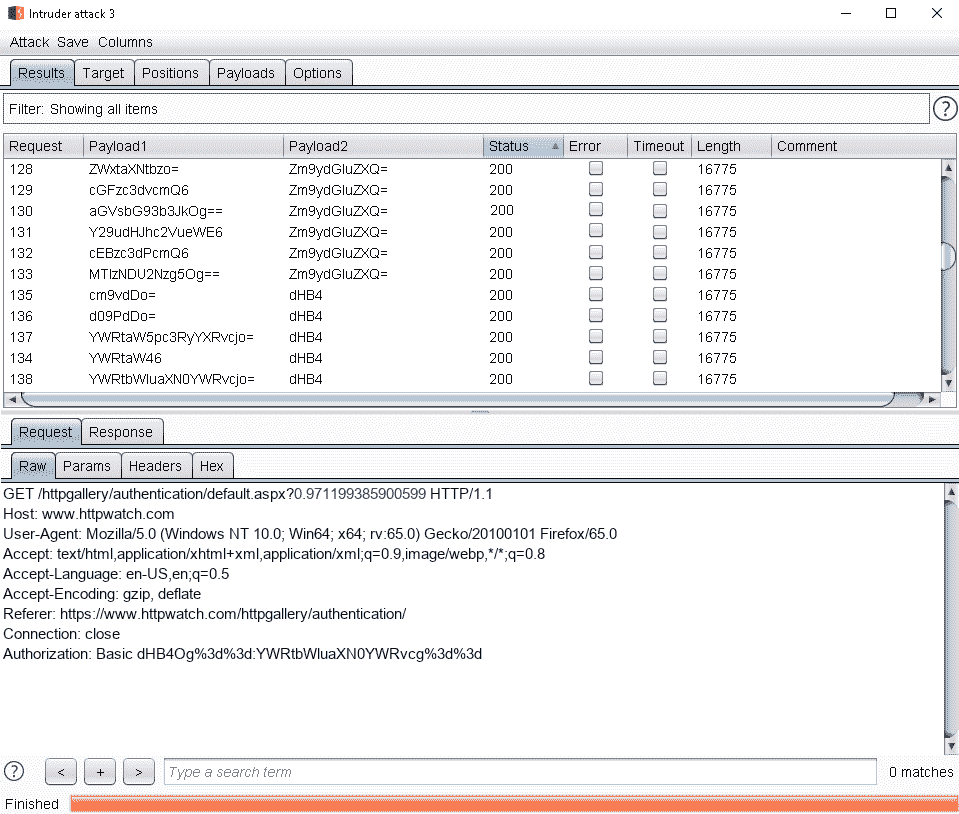

# 使用 Burp Suite 利用漏洞 - 第 2 部分

正如我们在上一章中看到的，Burp Suite 是一个灵活的工具，用于检测和利用漏洞。在本章中，我们将利用其他类型的漏洞，展示 Burp Suite 的更多选项和功能。

在本章中，我们将涵盖以下主题：

+   使用 SSRF/XSPA 执行内部端口扫描

+   使用 SSRF/XSPA 从内部机器提取数据

+   使用不安全的直接对象引用（IDOR）漏洞提取数据

+   利用安全配置错误

+   使用不安全的反序列化来执行操作系统命令

+   利用加密漏洞

+   暴力破解 HTTP 基本身份验证

+   暴力破解表单

+   绕过文件上传限制

# 使用 SSRF/XSPA 执行内部端口扫描

**服务器端请求伪造**（SSRF）是一种漏洞，恶意用户可以向托管应用程序的服务器发送手动请求，通常是从用户角度无法直接访问的服务器。

目前，这是一个备受欢迎的漏洞，因为它对使用 Elasticsearch 和 NoSQL 数据库等技术的云基础设施产生了巨大影响。

在以下代码片段中，我们可以看到它的效果：

[PRE0]

这段代码是有漏洞的，因为它在没有验证的情况下接收`url`参数，然后...

# 执行对后端的内部端口扫描

端口扫描是在评估网络时进行网络发现的最基本和最有用的活动之一。在应用程序中，安全评估受到评估范围的限制，但 SSRF 和 XSPA 允许用户从应用程序中执行端口扫描。为了演示您如何执行此技术，我们将使用 Acunetix 创建的一个有漏洞的测试应用程序，您可以在[`testphp.vulnweb.com/`](http://testphp.vulnweb.com/)找到。

这是一个有漏洞的应用程序，您可以用来学习一些攻击和测试脚本或工具，如下面的屏幕截图所示：

1.  打开 Burp Suite 的仪表板，然后点击新扫描。将 Acunetix 的 URL 添加到范围中，然后点击开始，如下面的屏幕截图所示：

1.  扫描应用程序后，Burp Suite 检测到 URL（[`testphp.vulnweb.com/showimage.php`](http://testphp.vulnweb.com/showimage.php)）对 SSRF 存在漏洞。这个 PHP 文件接受 URL 作为参数，如下行所示：

[PRE1]

1.  要执行自动端口扫描，我们可以使用 Intruder。首先，停止请求，并将其发送到 Intruder，如下面的屏幕截图所示：

1.  清除默认创建的通配符，并按照您自己的方式添加一个新的，如下面的屏幕截图所示：

[PRE2]

现在，您可以将您的有效负载定义为一个列表，从 0 到 65,535，并选择随机选项。为什么？因为一些**入侵防护系统**（IPS）会检测对同一 IP 的顺序请求，因此通过使用随机选项，我们可以尝试避免被检测到：

1.  现在，启动攻击，如下面的屏幕截图所示：

为什么有效？如果您查看响应，就可以看到连接是否成功，如下所示：

当端口打开时，响应不会显示任何错误。作为提示，您可以分析长度列，以检测响应何时发生变化，并查看错误是否出现。

# 使用 SSRF/XSPA 从内部机器提取数据

SSRF 和 XSPA 漏洞也可以用于其他操作，例如从服务器中提取信息到后端所在的网络，或从托管应用程序的服务器中提取信息。让我们分析以下请求：

在这里，`filehookURL`参数是易受攻击的，因此将其发送到 Repeater 工具，使用鼠标的辅助按钮，修改参数以提取一个文件，如`/etc/passwd`，如下所示：

[PRE3]

将其发送到应用程序。如果有效，应用程序将显示...

# 利用不安全的直接对象引用（IDOR）漏洞提取数据

IDOR 是一种漏洞，允许恶意用户访问托管应用程序的服务器中的文件、数据库或敏感文件。

要识别易受 IDOR 攻击的应用程序，需要测试每个管理应用程序路径的变量。让我们看一个如何利用这种漏洞的例子。

# 利用 Burp Suite 的 IDOR

在以下的截图中，你有一个易受攻击的应用程序，并且你已经拦截了下一个请求：

我们在这个请求中有它们的参数；登录、操作和秘密。这里易受攻击的参数是登录。`secret`变量是用户在注册时分配的数据；存在的漏洞是，如果恶意用户修改了登录参数，应用程序会在不经过验证的情况下更改用户指定的秘密值。因此，我们创建了另一个名为**vendetta2**的用户，试图修改与该个人相关的秘密值，如下所示...

# 利用安全配置错误

“配置错误”这个术语是如此开放，它可能意味着与安全相关的许多事情。同时，确定这些漏洞的影响是如此困难；其中一些漏洞可能只是信息性的，显示有关用于构建应用程序的技术的信息，而其他一些可能非常关键，提供对服务器或应用程序的访问，从而暴露所有内容。

因此，在本节中，我们将展示不同的常见错误，以及如何使用 Burp Suite 来利用它们。

# 默认页面

通常，服务器管理员安装 Web 服务器或其他应用程序时，他们没有配置它们以避免显示默认页面，因此，通常会发现以下页面：

这个默认页面可能是通用的，但它显示了信息，根据环境的不同，可能会很有用。例如，在这种情况下，我们看到了 Apache Tomcat 的默认页面。Tomcat 是一个应用服务器，有一个管理部分，Tomcat 有一个默认的用户名和密码。因此，如果您检测到这个默认页面，您只需要输入`tomcat`凭据，就可以看到所有选项。一个常见的攻击包括...

# 目录列表

系统管理员和开发人员通常会在文件系统中分配不正确的访问权限，允许用户访问敏感文件，如备份、配置文件、源代码文件，或者只是一个允许用户了解服务器和应用程序所在位置的目录。

为了发现所有这些结构，我们可以使用三种主要方法，如下所示：

+   扫描

+   映射应用程序

+   入侵者

让我们详细探讨每种方法。

# 扫描

扫描器，包括 Burp Suite 扫描器，具有检测敏感路径和常见文件的算法；实际上，常见文件可以用作横幅抓取，以检测潜在的漏洞。

如果检测到敏感文件，它将在扫描结果中显示为一个问题，如下截图所示：

# 映射应用程序

在 Burp Suite 中，您可以在目标工具中找到所有不同的文件，它会创建一个包含所有网站结构的树。如果您点击一个文件，它将在右侧详细显示，详细说明它是否可访问，以及它是什么类型的文件：

这种映射基本上是自动的；您只需在应用程序中工作，而 Burp Suite 会缓存所有请求并创建这个树，但 Burp Suite 也有一个专门用于此目的的工具。

在目标工具中，有一个名为 Scope 的选项卡；在这里，可以定义 URL 或路径作为范围，以便进行深度映射。当您发出请求时，该请求会有许多链接到其他资源的资源。Burp Suite 分析请求和响应，寻找这些链接，并使用它们可以检索到的信息来映射站点，如下面的屏幕截图所示：

如果应用程序有经过身份验证的部分，建议您提供凭据，因为每次 Burp Suite 尝试访问经过身份验证的部分时，代理都会弹出一个可能会让人讨厌的弹窗。当这种情况发生时，只需输入凭据，代理将保存它们以备将来使用。

# 使用 Intruder

我认为 Intruder 是 Burp Suite 工具中最灵活的。您可以用它做任何事情。在使用 Burp Suite 社区版时，您没有高级选项和工具，Intruder 可以提供所有这些功能，但有一些限制，这意味着执行任务需要更多时间，但它可以执行任何类型的任务。

因此，为了检测目录列表和敏感文件，我们将使用常见的列表。例如，我们可以有一个包含常见目录的列表，例如**内容管理系统**（**CMS**）、电子商务应用程序中的常用路径，以及自制应用程序中使用的常规路径，例如`/users/`、`/admin/`、`/administrator/`、`process.php`、`/config/`等等。

另一方面，我们需要有一个包含常见……

# 默认凭据

如前所述，在本节中，有些应用程序在安装时具有默认凭据。其中一些是因为它们不是直接安装的，而是使用操作系统的软件包，或者是其他应用程序的一部分。例如，一些**集成开发环境**（**IDE**）在其安装中具有 Web 或应用程序服务器，用于测试目的。

此外，还有一些测试工具或包使用**数据库管理系统**（**DBMS**），但这些系统存在漏洞或默认访问权限暴露它们。

经过一些侦察之后，您将能够了解应用程序、服务器和技术背后的应用程序，并且只需搜索默认密码一词即可找到正确的凭据，或者访问存储它们的网站，如下面的屏幕截图所示：

要识别正确的内容，您只需将它们作为 Intruder 中的有效负载加载并启动应用程序，我们将在本章中更详细地介绍。

# 不受信任的 HTTP 方法

HTTP 协议有不同的方法，通常我们用来了解`GET`、`POST`和`CONNECT`方法，因为它们是最常用的。然而，还有其他方法可以用来获取有关服务器的信息，上传和删除文件到应用程序中，或者获取调试信息。

使用 Burp Suite 测试这些方法很容易。只需从代理中修改请求如下：

[PRE4]

实际上，`OPTIONS`是一种方法，允许我们知道 Web 服务器上允许使用哪些方法。可能出现的方法有`PUT`、`DELETE`、`TRACE`、`TRACK`和`HEAD`。利用这些方法超出了本书的范围，因为很多事情取决于应用程序的环境。

# 使用不安全的反序列化来执行操作系统命令

序列化是一种过程，在一些编程语言中，用于将对象的状态转换为字节流，这意味着 0 和 1。反序列化过程将字节流转换为内存中的对象。

在 Web 技术中，还有更简单的情况，例如，常见的反序列化是将 JSON 格式转换为 XML 格式。这很简单，但真正的问题在于使用本机对象的技术，例如 Java，在这些技术中，我们可以直接在内存中进行调用。

事实上，漏洞发生在应用程序对无效输入进行反序列化时，创建了一个可能对应用程序有潜在风险的新对象。

# 利用漏洞

想象一下，您有一个使用 pickle 库的易受攻击的应用程序。这是一个实现不同函数进行序列化和反序列化的 Python 模块。然而，这个模块本身并没有实现保护。它需要开发人员进行验证实现。看看以下易受攻击的代码片段：

[PRE5]

这段代码读取一个 YAML 文件而没有任何验证。恶意用户可以输入一个可能执行其他操作的输入，例如一个命令，如下所示：

[PRE6]

# 利用加密漏洞

除了利用与加密相关的漏洞外，Burp Suite 还允许用户进行分析以检测弱算法。

要执行此分析，我们需要创建一个捕获。这个捕获只是一个导航，我们在应用程序中登录和注销，以创建会话、令牌和 ID。想法是尽可能创建最大的捕获，以便有一个样本。

创建捕获后，在 Burp Suite 中使用正常历史记录，转到 Sequencer 工具，然后点击“立即分析”，如下截图所示：

在这里，您可以看到最终分析，如下所示：

最终分析

现在，您可以根据熵、字符集和概率来确定所使用的算法是否弱。

# 暴力破解 HTTP 基本身份验证

基本身份验证是一种在内部环境中广泛使用的访问控制类型，用于限制网站中受限区域的访问。它有很多弱点，包括以下内容：

+   基本身份验证以明文发送信息。这意味着恶意用户可以拦截客户端发送到服务器的信息并提取凭据。

+   密码受 Base64 编码保护。这并不意味着密码被加密；任何人都可以使用解码器获取明文密码，就像 Burp Suite 中包含的解码器一样，如下截图所示：

# 使用 Burp Suite 进行暴力破解

我们将展示如何使用 Burp Suite 攻击基本身份验证。想象一下，我们有一个用于在家中提供互联网的家用路由器。这些设备中的大多数使用基本身份验证。因此，访问 URL 路由器和 Web 浏览器将显示一个窗口，如下截图所示：

现在，配置 Burp Suite 以拦截发送到服务器的凭据，如下截图所示：

在这里，您可以看到标头中的参数授权。因此，复制分配给参数的值，并将其粘贴到解码器部分以了解其含义。请记住，基本身份验证使用 Base64 编码来保护信息：

现在，我们知道基本身份验证使用的结构是`user:password`，因此为了暴力破解控制，我们需要按照这个结构发送凭据。我们将使用潜在用户和密码的列表，并将它们存储在 TXT 文件中，以便将它们用作有效负载。我建议您在常见服务中寻找泄露的密码，如 Facebook、LinkedIn 和 Yahoo，因为它们是真实的密码，而不仅仅是常见的词典，所以您更有可能能够访问受限区域。这里有一个小例子列表如下：

现在我们有了密码和用户列表，点击鼠标的辅助按钮，将原始请求发送到入侵者工具：

1.  首先，我们将选择“集群炸弹”选项来发送我们的请求。由于我们只有一个列表，我们希望 Burp Suite 测试列表中的所有可能组合，如下面的截图所示：

1.  然后，我们将选择授权参数分配的值作为通配符。然而，诀窍是在同一个参数上创建通配符，因为我们必须为密码和用户插入值，如下面的截图所示：

1.  然后，转到有效负载选项卡，在这里，我们将选择我们的列表。然而，最重要的一步是，我们需要使用基本身份验证的结构对我们的输入进行 Base64 编码。首先，在有效负载集部分，选择使用两个有效负载集。我们将使用相同的列表并不重要，但我们需要将它们用作单独的有效负载，如下面的截图所示：

1.  然后，选择第一个有效负载列表，在第 1 个位置的文本框分隔符中添加`:`字符。这将在第一个值之后插入，如下面的截图所示：

1.  然后，点击“添加有效负载处理规则”来对有效负载进行编码。在这里，选择列表中的“编码”选项，然后选择 Base64 编码。通过这种配置，我们所有的有效负载都将以 Base64 编码发送，如下面的截图所示：

1.  现在，返回到有效负载集部分，并选择第二个位置。在这里，选择用户和密码列表，但在文本框中留空第 2 个位置的文本框分隔符。还要创建规则来对有效负载进行编码。返回到位置选项卡，然后点击开始攻击，如下面的截图所示：

当入侵者显示 HTTP 错误代码 200 时，这意味着组合是正确的。

# 暴力破解表单

如前所述，基本身份验证由于其安全问题而不可取。更常见的是使用身份验证表单。这些身份验证表单包括 HTML 或其他客户端技术表单，将其传递到后端，那里处理凭据以确定用户是否有权访问资源。

重要的是要注意，确定用户是否有效的所有处理都将在后端进行。有时，在客户端使用结构验证是可取的，只是为了限制错误尝试的次数。

# 使用 Burp Suite 进行自动化

要在表单上执行暴力破解，我们将停止上传凭据到应用程序的请求，如下面的代码块所示，用户正在访问登录部分：

[PRE7]

在这个请求中，我们可以确定应用程序接收用户名和密码的参数。因此，使用鼠标的辅助按钮，点击弹出菜单，并选择发送到 Intruder。在这里，我们将在参数所在的位置创建通配符。请注意，这不是一个常见的`POST`请求，其中参数被分配为值。在这里，我们有一个不同的结构，但它的工作方式相同。

在这种情况下，应用程序没有使用任何编码。我们只需将负载配置为正常列表，选择集群炸弹作为攻击类型，并使用我们之前的列表，如下面的屏幕截图所示：

最后，点击开始攻击。Intruder 将启动一个窗口，我们可以在其中看到结果。有一些应用程序，当凭据不正确时，会以 302 错误代码响应，将用户重定向到登录页面。在这种情况下，应用程序总是以 200 错误代码响应，因此需要详细分析响应。为了简单起见，我们可以检查列长度，并寻找指示不同结果的值的变化，如下面的屏幕截图所示：

# 绕过文件上传限制

许多应用程序允许用户上传文件。管理这些文件有不同的方式：一些应用程序直接将文件作为二进制文件上传，而其他应用程序对文件进行编码以减小大小并在数据库中进行管理。让我们探讨如何修改应用程序建立的文件限制。

# 绕过类型限制

当一个应用程序允许您上传文件时，通常开发人员知道允许上传哪种类型的文件，因此验证恶意用户不能上传其他类型的文件非常重要。验证这一点的常见方法是使用文件扩展名。因此，如果一个应用程序管理文档，也许开发人员允许 PDF 文件和 DOCX 文档，但这安全吗？

文件扩展名不是应用程序需要进行的唯一验证。恶意用户可以上传带有有效扩展名的恶意文件；例如，传播恶意软件。

首先，我们将使用一个名为 Metasploit 的工具创建一个恶意 PDF。Metasploit 是一个利用框架，允许攻击漏洞，主要是基础设施；但它也有辅助模块来执行一些任务，比如创建带有嵌入恶意代码的二进制文件。您可以在[`www.metasploit.com/`](https://www.metasploit.com/)上获取 Metasploit 的副本。

要安装它，您只需要在一个目录中解压文件。要创建 PDF，请按照以下步骤操作：

1.  使用`adobe_utilprintf`工具，它将把我们的 PDF 转换为恶意 PDF。您可以使用任何 PDF 来做到这一点。

1.  选择要使用的 PDF 来使用指令集。

1.  选择要使用的负载。Metasploit 有不同的负载来执行文件执行时的操作，或者在这种情况下，打开时的操作。最简单的负载是从打开文件的计算机到远程计算机创建连接。这是一个反向 shell。

1.  设置远程 IP 地址和端口，如下面的屏幕截图所示：

1.  选择所有选项后，使用 exploit 指令创建文件，如下面的屏幕截图所示：

打开您正在使用 Burp Suite 评估的应用程序，并拦截一个用户被允许上传文件的部分的请求。想象一下我们有以下易受攻击的请求：

一个易受攻击的请求示例

在这个请求中，我们可以看到有两个限制。首先，我们有一个大小限制，这是为了避免上传最大的文件。我们可以在以下行中看到这个限制：

[PRE8]

因此，如果我们修改这些值，就有可能上传比用户预期的更大的文件。

另一个限制是文件，如下所示：

[PRE9]

该应用程序正在等待特定的扩展名，如果我们上传另一个文件，比如我们修改过的 PDF 文件，看看会发生什么。

您将看到文件是以二进制方式上传到服务器的。在这一点上，服务器有一个恶意的 PDF 文件，其他用户可以下载，这将导致感染。为了确认文件是否相同，您可以下载它并将下载的文件与您自己的文件进行比较。

对于这一点的结论是，文件只是应用程序中的另一种输入类型，您可以像表单中的输入一样使用 Burp Suite 来修改它。

# 总结

在本章中，我们学习了 Burp Suite 用于利用不同类型漏洞的常规工具。特别是，我们利用 SSRF 和 XSPA 来执行命令，提取信息并在内部网络中执行任务。此外，我们还回顾了这些漏洞的起源。我们回顾了 IDOR 漏洞，学会了如何手动利用它，以及如何使用 Intruder 自动化其利用。接下来，我们回顾了一些与配置相关的漏洞；它们可能是关键的，也可能不是关键的，以及我们如何自动化其中一些漏洞。

我们还进行了暴力破解，以寻找两种不同类型认证的有效凭据。我们创建了一个恶意的 PDF 文件，并学会了如何将其上传到网站上...
