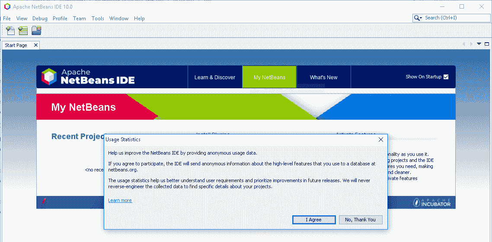

# 编写 Burp Suite 扩展

其他 HTTP 代理提供了良好的性能，但是 Burp Suite 无疑是最好的工具，因为它具有扩展功能。正如我们在前面的章节中所看到的，扩展添加了许多功能，因此它们可以专注于特定的问题。

创建扩展的能力为用户在自动化测试活动中提供了极大的帮助。Burp Suite 支持 Java、Python 和 Ruby 来开发扩展，因此它在为开发人员提供便捷访问方面非常灵活。

在本章中，我们将回顾新扩展的开发过程，并提供一些在我们的 Burp Suite 安装中进行此操作的技巧和提示。

在本章中，我们将涵盖以下主题：

+   设置开发环境

+   编写 Burp Suite 扩展

+   执行扩展

# 设置开发环境

要开发自己的扩展，可以使用 NetBeans 或 Eclipse 等开源**集成开发环境**（**IDE**）。选择最适合自己的 IDE。在这种情况下，我们将使用 NetBeans：

1.  转到 NetBeans 网站（[`netbeans.org/`](https://netbeans.org/)）并下载最新版本。不需要安装，因为 NetBeans 是用 Java 开发并作为 JAR 文件分发的；只需解压下载文件并单击 netbeans-bin 图标，如下截图所示：

1.  在开始使用 NetBeans 之前，转到[`www.oracle.com/technetwork/java/javase/downloads/`](https://www.oracle.com/technetwork/java/javase/downloads/)并...

# 编写 Burp Suite 扩展

Burp Suite 扩展的基本类结构如下代码所示，由 PortSwigger 提供：

[PRE0]

这基本上是用于创建所有 Burp Suite 扩展的类定义。现在，让我们开始修改代码。

# Burp Suite 的 API

请记住，所有扩展都是通过采用 PortSwigger 提供的结构（如前所示）作为代码基础来开发的，您的扩展的入口点如下：

[PRE1]

如果要调用自己的扩展，需要使用以下方法：

[PRE2]

以下代码显示了字节实用程序。它们对于管理字符串、搜索子字符串、编码、解码等非常有用：

[PRE3]

# 使用扩展修改用户代理

现在让我们分析一下扩展的代码，以修改 HTTP 请求中的用户代理，使用 PortSwigger 提供的基本结构。

# 创建用户代理（字符串）

我们需要修改用户代理的第一件事是使用替代用户代理。在代码的下一部分中，我们创建了一个默认用户代理列表，用于在扩展中使用；扩展还提供了使用包含字符串的 XML 文件的选项，如下所示：

[PRE4]

# 创建 GUI

PortSwigger 简化了将扩展与 Burp Suite 集成以创建新的 Burp Suite 选项卡的方式，这些元素只需要几行代码。

首先，我们需要在 Burp Suite 窗口中为我们的扩展定义一个新选项卡，如下所示：

[PRE5]

我们还需要创建一个框，用于放置所有选项，以及每个选项的标签，如下所示：

[PRE6]

此外，需要补充说明的是，没有默认值的应用程序或扩展在打开时无法向用户呈现，如下所示：

[PRE7]

# 操作

前面的代码块显示了所有扩展内容和图形界面，但以下行显示了扩展本身的操作：

首先，我们设置初始变量和组件，如下所示：

[PRE8]

# 发现认证弱点

在服务、端口和技术检测之后，下一步是导航和了解应用程序的流程。在这里，我们将重点放在认证部分。

1.  因此，打开 Burp Suite，并在配置 Web 浏览器后，转到[`www.mercadolibre.com.mx/`](https://www.mercadolibre.com.mx/)。

1.  正如我们之前提到的，Mercado Libre 是一个大型在线零售商，是卖家和买家之间的中间商，提供包裹服务和金融服务。

1.  在登录部分输入有效的凭据，以了解其工作原理。

1.  关于认证流程的简要介绍在这里：

+   用户输入电子邮件地址或用户名和密码

+   用户已登录

+   如果用户关闭会话，下次进入登录部分时，他们只需要输入密码，因为他们的用户名已经被占用。

1.  让我们检查登录请求：

[PRE9]

让我们也来看看这个登录请求的响应：

[PRE10]

使用上述代码块，我们可以检测到以下内容：

+   该应用程序正在使用负载均衡器或反 DDoS 服务。我们可以在响应中看到请求是如何被重定向到一个确定的服务器的。

+   该应用程序使用令牌来跟踪请求；可能无法利用 CSRF 等漏洞。

+   该应用程序具有 XSS 保护，可以避免信息的提取。例如，使用 JavaScript 提取用户的会话。

+   该应用程序包括一个 SAMEORIGIN 策略。在本书中，我们还没有涉及这个。这个控制用于避免来自外部实体的执行操作。

+   用户凭据被发送到请求的主体中。

+   该应用程序使用 XML 格式。这意味着该应用程序正在使用内部 API。

现在，我们有一些关于认证流程的信息。在实际评估中，您需要映射整个应用程序和完整的应用程序流程。

现在，我们将审查与认证相关的问题。

# 执行扩展

在编写完扩展后，启动 Burp Suite 应用程序，然后单击 Run | Run Project。应用程序将启动，并在其中运行我们的扩展。

对于这个扩展，您需要创建一个会话处理并在用户代理选项卡中配置选项，如下截图所示：

如您在以下截图中所见，该应用程序运行时没有出现错误：

如果您想要...

# 总结

在本章中，我们分析了如何创建我们自己的扩展以及 PortSwigger 提供的不同函数和方法，这不仅帮助我们创建了一个新的扩展，还向我们展示了如何修改现有的扩展，以适应我们的要求。

下一章将介绍一个真实案例，说明一个大型在线零售商是如何因为认证实现的破坏而受到影响的。
