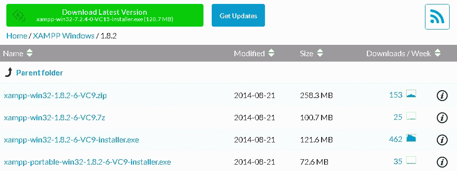
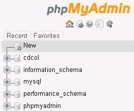
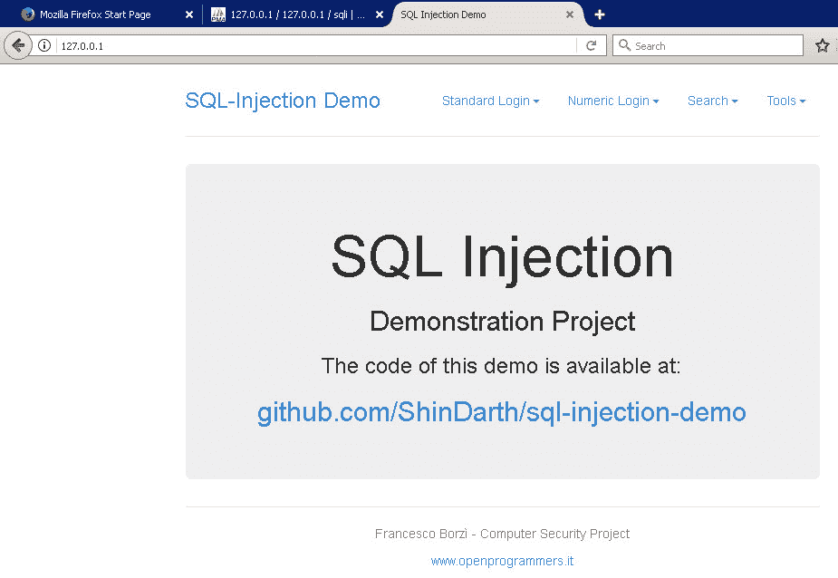

# 在 AWS 上设置渗透测试实验室

本章旨在帮助无法直接访问渗透测试目标的渗透测试人员在 AWS 内部设置易受攻击的实验室环境。这个实验室将允许测试人员使用 Metasploit 进行各种利用技术的实践，并使用 Kali 内的多个工具进行基本扫描和漏洞评估。本章重点介绍在 AWS 上设置易受攻击的 Linux VM 和通用 Windows VM，将它们放在同一个网络上。

在本章中，我们将涵盖以下主题：

+   在云上设置个人渗透测试实验室进行黑客攻击

+   配置和保护虚拟实验室以防止意外访问

# 技术要求

在本章中，我们将使用以下工具：

+   可恶的易受攻击的 Web 应用程序

+   **非常安全的文件传输协议守护程序**（**vsftpd**）版本**2.3.4**

# 设置易受攻击的 Ubuntu 实例

作为我们将要创建的两台易受攻击的机器中的第一台，易受攻击的 Ubuntu 实例将包含一个易受攻击的 FTP 服务，以及一些其他服务。

# 提供一个 Ubuntu EC2 实例

在云中设置易受攻击的实验室的第一步将是提供一个运行易受攻击操作系统的实例。为此，我们可以使用 Ubuntu LTS 版本。这可以从 AWS Marketplace 快速部署。

我们将使用 Ubuntu 16.04 来实现这一目的：

一旦单击“继续订阅”按钮，我们将提示配置要启动的实例。由于这是一个非常标准的镜像，我们将使用默认设置，除了区域和 VPC 设置。

对于区域，您可以使用距离自己最近的 AWS 区域。但是，请记住，您在 AWS 上创建的所有其他实例都需要托管在同一个区域，否则它们无法成为同一网络的一部分。

对于 VPC，请确保您记下了用于设置此实例的 VPC 和子网 ID。我们需要为实验室中的所有其他主机重复使用它们。在这种情况下，我将使用以下内容：

应该注意的是，VPC ID 和子网 ID 对每个人都是唯一的。完成后，我们可以通过单击“一键启动”按钮来部署 EC2 实例。

完成后，下一步是使用以下命令 SSH 到新创建的 VM：

[PRE0]

连接后，运行以下命令：

[PRE1]

这些命令将更新存储库列表和实例上安装的所有软件包，因此我们不必处理任何旧软件包。

# 在 Ubuntu 上安装易受攻击的服务

对于这个 Ubuntu 主机，我们将安装一个易受攻击版本的 FTP 服务器`vsftpd`。发现 2.3.4 版本的这个 FTP 软件被植入了后门。在本章中，我们将安装这个带有后门的版本，然后将尝试使用我们将在下一章中设置的渗透测试盒来识别它，最后我们将利用它。

为了使事情变得更容易，`vsftpd 2.3.4`的后门版本被存档在 GitHub 上。我们将使用该代码库来安装易受攻击的软件。首先，我们需要克隆`git`存储库：

[PRE2]

接下来，我们需要安装用于设置主要构建环境的软件包。为此，我们运行以下命令：

[PRE3]

现在，我们`cd`进入`vsftpd`文件夹以从源代码构建它。但是，在这之前，我们需要对`Makefile`进行一些小改动。需要添加`-lcrypt`值作为链接器标志：

完成后，保存文件并运行`make`。

如果一切顺利，我们应该在同一个文件夹中看到一个`vsftpd`二进制文件：

接下来，我们需要在安装`vsftpd`之前设置一些先决条件。即，我们需要添加一个名为`nobody`的用户和一个名为`empty`的文件夹。要做到这一点，请运行以下命令：

[PRE4]

完成后，我们可以通过执行以下命令来运行安装：

[PRE5]

完成后，我们需要执行`vsftpd`二进制文件，以确认我们是否可以连接到`localhost`：

下一步是设置 FTP 服务器的匿名访问。为此，我们需要运行以下命令：

[PRE6]

最后，通过对`/etc/vsftpd.conf`进行以下更改，启用对`vsftpd`服务器的本地登录：

# 设置易受攻击的 Windows 实例

通过设置易受攻击的 Linux 服务器，我们现在通过运行易受攻击的 Web 应用程序的 Windows 服务器来设置一个攻击向量。该应用程序将提供两个环境，读者可以在其中尝试他们的手，而无需实际的测试环境。

# 配置易受攻击的 Windows 服务器实例

为了本实验宿主的目的，我们将使用 AWS Marketplace 上的 Server 2003 实例：

配置步骤与我们之前设置 Linux 实例的步骤基本相同。应注意 VPC 设置与我们为以前的实例使用的设置相似。这将稍后允许我们配置 VM 以处于相同的网络上。

在验证 VPC 设置和区域后，我们继续启动实例，就像我们之前做的那样。最后，我们设置一直在使用的密钥对，然后就可以开始了。实例启动后，我们需要遵循稍有不同的流程来远程访问 Windows 实例。由于**远程桌面协议**（**RDP**）不支持基于证书的身份验证，我们需要提供私钥来解密并获取密码，以便我们可以登录。只需右键单击实例，然后选择获取 Windows 密码：

在接下来的屏幕上，我们需要上传之前下载的私钥：

完成后，只需单击“解密密码”即可为我们提供密码，我们可以使用该密码远程桌面连接到我们的 Windows 服务器实例。完成后，只需启动远程桌面并使用显示的凭据连接到 IP 地址即可。

一旦我们登录，下一步是在 Windows 服务器上设置 XAMPP，这样我们就可以在服务器上托管一个易受攻击的网站。但在继续之前，我们需要在服务器上安装最新版本的 Firefox，因为随 Windows Server 2003 捆绑的 Internet Explorer 版本相当陈旧，不支持一些网站配置。要下载 XAMPP，只需访问[`www.apachefriends.org/download.html`](https://www.apachefriends.org/download.html)并下载适用于 XP 和 Windows Server 2003 的版本：

请注意，您需要向下滚动并下载正确版本的 XAMPP：

最后，我们需要按照默认安装过程进行，然后我们将获得一个可用的 PHP、Apache 和 MySQL 安装，以及一些必要的实用程序，用于管理网站。

# 在 Windows 上配置易受攻击的 Web 应用程序

在本节中，我们将为渗透测试实验室设置一个极易受攻击的 Web 应用程序。首先，让我们通过访问`C:\xampp\htdocs`来清理 XAMPP 托管文件夹。

创建一个名为`_bak`的新文件夹，并将所有现有文件剪切并粘贴到该文件夹中。现在，让我们下载易受攻击的网站源代码。为此，我们将使用 GitHub 上提供的众多易受攻击的 PHP 示例之一：[`github.com/ShinDarth/sql-injection-demo/`](https://github.com/ShinDarth/sql-injection-demo/)。

最快获取文件的方法是直接下载 ZIP 文件：

下载源代码

下载后，只需将 ZIP 文件的内容复制到`C:\xampp\htdocs`文件夹中。如果操作正确，文件结构应如下所示：

文件结构

完成后，下一步是为应用程序创建数据库并将数据导入其中。为了实现这一点，您需要访问 phpMyAdmin 界面，该界面可在`http://127.0.0.1/phpmyadmin`访问。在这里，选择最近的“新建”选项：

在这里，我们创建一个名为`sqli`的新数据库：

接下来，要将数据导入到新创建的数据库中，我们进入导入选项卡，并浏览到刚刚提取到`htdocs`文件夹中的`database.sql`文件：

点击 Go 后，我们将看到一个成功的消息。现在，如果我们在浏览器中浏览`http://127.0.0.1`，我们将能够访问易受攻击的网站：

恭喜，您已成功在 Windows 服务器上配置了一个易受攻击的 Web 应用程序！下一步将是在我们的 VPC 内设置网络规则，以便易受攻击的主机可以从其他 EC2 实例访问。

# 在实验室内配置安全组

现在我们已经设置了两个易受攻击的服务器，下一步是配置网络，使我们的 Web 应用程序对外部不可访问，同时使其他实验室机器可以相互通信。

# 配置安全组

我们最初将所有 EC2 实例设置为在同一个 VPC 上。这意味着 EC2 实例将位于同一子网上，并且可以通过内部 IP 地址相互通信。但是，AWS 不希望允许同一 VPC 上的所有 4,096 个地址相互通信。因此，默认安全组不允许 EC2 实例之间的通信。

为了允许 Ubuntu 实例连接到 Windows 实例（您可以在下一章中为 Kali 实例重复这些步骤），第一步是获取 Ubuntu 主机的私有 IP 地址：

显示私有 IP 的描述选项卡

接下来，我们需要修改第一个 Windows 实例的安全组规则。只需在摘要窗格中点击安全组名称即可进入安全组屏幕：

安全组屏幕

现在我们只需要点击编辑按钮，添加规则允许从 Kali Linux 实例中访问所有流量：

完成后，只需保存此配置。为了确认 Kali 现在可以与 Windows 服务器通信，让我们运行一个`curl`命令，看看网站是否可访问：

[PRE7]

确保用您的 Windows IP 地址替换 IP 地址。如果一切顺利，应该会有一堆 JavaScript 作为响应：

在下一章中，一旦 Kali PentestBox 设置完成，可以使用上述步骤在 Ubuntu 和 Windows 服务器实例上将 Kali Linux IP 地址列入白名单，以便开始对实验室环境进行黑客攻击！

# 摘要

在本章中，我们已经建立了一个实验室，对于没有测试环境或实际实验经验的初学者渗透测试人员来说，这可能是有用的。在我们的实验室中，我们设置了一个运行易受攻击服务的 Ubuntu 主机，还设置了一个运行易受攻击 Web 应用程序的 Windows 服务器主机。这代表了任何环境中攻击的两个最大的表面区域。此外，我们还经历了建立各个实例之间的网络连接的过程。通过这些步骤，用户可以在云中设置任何操作系统实例，设置安全组以配置网络，并防止未经授权的访问。

在下一章中，我们将研究如何设置 Kali PentestBox，使用它可以对我们设置的两个易受攻击的 EC2 实例进行扫描、枚举和利用。

# 进一步阅读

+   漏洞和利用数据库：[`www.rapid7.com/db/modules/exploit/unix/ftp/vsftpd_234_backdoor`](https://www.rapid7.com/db/modules/exploit/unix/ftp/vsftpd_234_backdoor)

+   Amazon 虚拟私有云（用户指南）：[`docs.aws.amazon.com/AmazonVPC/latest/UserGuide/VPC_Introduction.html`](https://docs.aws.amazon.com/AmazonVPC/latest/UserGuide/VPC_Introduction.html)
