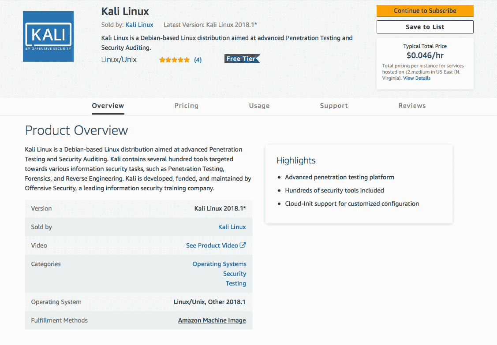
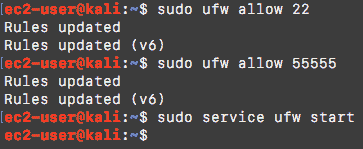

# 第三章：在云上设置 Kali PentestBox

有一个现成的**Amazon Machine Image**（**AMI**）在亚马逊市场上运行 Kali Linux。这意味着渗透测试人员可以快速在亚马逊云上设置 Kali Linux 实例，并随时访问它进行任何类型的渗透测试。本章重点介绍在 Amazon EC2 实例上创建一个实例，使用 Kali Linux AMI 进行设置，并以各种方式配置对此主机的远程访问。一旦设置好，渗透测试人员可以远程访问属于 AWS 帐户的**虚拟私有云**（**VPC**），并在该 VPC 内和任何远程主机上使用 Kali 进行渗透测试。

在本章中，我们将学习以下内容：

+   如何在亚马逊云上运行 Kali Linux

+   通过 SSH 远程访问 Kali

+   通过无客户端 RDP 远程访问 Kali

# 技术要求

在本章中，我们将使用以下工具：

+   AWS EC2 实例

+   Kali Linux AMI

+   Apache Guacamole ([`guacamole.apache.org`](https://guacamole.apache.org))

+   SSH 客户端和浏览器

# 在 AWS EC2 上设置 Kali Linux

在本节中，我们将介绍在云上设置虚拟渗透测试机器的最初步骤，以及设置远程访问以便随时进行渗透测试。渗透测试机器将与第一章中设置的渗透测试实验室*在 AWS 上设置渗透测试实验室*相辅相成，该实验室允许您对这些主机进行渗透测试和利用。

# Kali Linux AMI

AWS 提供了一个令人着迷的功能，允许在亚马逊云上快速部署**虚拟机**（**VMs**）—**Amazon Machine Images**（**AMIs**）。这些作为模板，允许用户在 AWS 上快速设置新的 VM，而无需像传统 VM 那样手动配置硬件和软件。然而，这里最有用的功能是 AMIs 允许您完全绕过操作系统安装过程。因此，决定需要什么操作系统并在云上获得一个完全功能的 VM 所需的时间总量减少到几分钟——和几次点击。

Kali Linux AMI 是最近才添加到 AWS 商店的，我们将利用它来快速在亚马逊云上设置我们的 Kali VM。使用现成的 AMI 设置 Kali 实例非常简单——我们首先访问 AWS Marketplace 中的 Kali Linux AMI：

前面的截图显示了以下信息：

+   我们正在使用的 AMI 版本（2018.1）

+   在默认实例中运行这个的典型总价格

+   AMI 的概述和详细信息

值得注意的是，Kali Linux 的默认推荐实例大小是 t2.medium，如我们在定价信息下所见：

在页面的下方，我们可以看到 t2.medium 实例的大小包括两个 CPU 虚拟核心和 4GiB 的 RAM，这对于我们的设置来说已经足够了：

一旦确认我们根据要求设置了镜像，我们可以继续点击“继续订阅”选项来进行实例设置。

# 配置 Kali Linux 实例

在前一节中，我们确认了要使用的 AMI 以及我们将使用的机器的规格，以启动我们的 Kali 机器。一旦选择了这些，就是启动我们的机器的时候了。

这将带我们到 EC2 页面。这里包含一些需要设置的选项：

+   **我们将使用的 AMI 版本**：通常建议使用市场上可用的最新版本的 AMI。通常情况下，这不是默认选择的 Kali Linux 版本。在撰写本文时，最新版本是 2018.1，构建日期是 2018 年 2 月，如下所示：

自 2019.1 版本发布后，您需要下载最新版本的 Kali Linux。

+   **我们将部署实例的区域**：如在第一章中所讨论的，在 AWS 上设置渗透测试实验室，我们需要将区域设置为地理位置最接近当前位置的数据中心。

+   **EC2 实例大小**：这已经在上一步中验证过了。我们将在本书的后面部分更深入地研究各种实例类型和大小。

+   **VPC 设置**：VPC 和子网设置需要设置为使用我们在第一章中设置渗透测试实验室时使用的相同 VPC。这将使我们的黑客工具箱与我们之前设置的易受攻击的机器处于同一网络中。设置应该与上一章中配置的相匹配：

+   **安全组**：之前，我们设置了安全组，以便未经授权的外部人员无法访问实例。然而，在这种情况下，我们需要允许远程访问我们的 Kali 实例。因此，我们需要将 SSH 和 Guacamole 远程访问端口转发到一个新的安全组：

+   密钥对：我们可以使用在第一章中设置实验室环境时创建的相同密钥对，*在 AWS 上设置渗透测试实验室*。

有了这些设置，我们就可以点击“一键启动”来启动实例了：

然后 AWS 将启动 Kali 机器并分配一个公共 IP。然而，我们需要能够访问这台机器。在下一节中，我们将看到如何使用 OpenSSH 来访问 Kali 机器。

# 配置 OpenSSH 进行远程 SSH 访问

AWS 已经为他们的 Kali AMI 设置了默认的 SSH 访问形式，使用公钥的`ec2-user`帐户。然而，这对于通过移动设备访问并不方便。对于希望通过移动应用程序直接以 root 权限方便地 SSH 到他们的 Kali 实例的用户，以下部分将介绍该过程。然而，需要注意的是，使用具有 PKI 身份验证的有限用户帐户是通过 SSH 连接的最安全方式，如果保护实例是优先考虑的话，不建议使用具有密码的 root 帐户。

# 设置 root 和用户密码

在 Kali Linux 实例上配置 root SSH 的第一步是设置 root 密码。通常情况下，使用具有`sudo`权限的`ec2-user`帐户的`ec2`实例不会为 root 帐户设置密码。然而，由于我们正在设置来自移动 SSH 应用程序的 SSH 访问，这需要设置。然而，需要注意的是，这会降低 Kali 实例的安全性。

更改 root 密码就像在 SSH 终端上运行`sudo passwd`一样简单：

同样，当前用户的密码也可以通过在 SSH 上运行`sudo passwd ec2-user`来更改：

这将有助于在不支持身份验证密钥的 SSH 客户端应用程序中作为`ec2-user`进行 SSH。然而，在我们能够以 root 身份 SSH 到 Kali 实例之前，还有另一步需要完成。

# 在 SSH 上启用 root 和密码身份验证

作为增强的安全措施，OpenSSH 服务器默认情况下禁用了 root 登录。启用这一点是一个简单的过程，涉及编辑一个配置文件，`/etc/ssh/sshd_config`：

其中关键的部分是两个条目：

+   PermitRootLogin：如果要以 root 身份登录，可以将其设置为`yes`

+   PasswordAuthentication：需要将其设置为`yes`，而不是默认的`no`，以便使用密码登录。

完成更改后，您需要重新启动 ssh 服务：

[PRE0]

有了这个，我们在云上的 Kali 机器已经启动并运行，并且可以通过密码进行 SSH 访问。但是，SSH 只能为您提供命令行界面。

在下一节中，我们将看看如何设置远程桌面服务以获得对 Kali 机器的 GUI 访问。

# 设置 Guacamole 进行远程访问

Apache Guacamole 是一种无客户端的远程访问解决方案，它将允许您使用浏览器远程访问 Kali Linux 实例。这将使您能够即使在移动设备上也可以访问 PentestBox，而无需担心远程访问周围的其他复杂性。访问此类服务器的传统方式是通过 SSH，但是当从移动设备访问时，这将无法提供 GUI。

# 加固和安装先决条件

设置远程访问虚拟机可能是一件危险的事情，因此建议安装和设置防火墙和 IP 黑名单服务，以防范针对互联网的暴力破解和类似攻击。我们将安装的服务是`ufw`和`fail2ban`。它们非常容易设置：

1.  您只需要运行以下命令：

[PRE1]

1.  安装了`ufw`防火墙后，我们需要允许用于远程访问的两个端口：`22`用于 SSH 和`55555`用于 Guacamole。因此，我们需要运行以下命令：

[PRE2]

1.  完成后，我们需要重新启动`ufw`服务：

1.  接下来，我们需要安装 Apache Guacamole 的先决条件。您可以通过执行以下命令来实现：

[PRE3]

1.  安装后，我们需要修改 Apache Tomcat 的配置，使其监听端口`55555`（与我们的安全组设置相匹配），而不是默认的`8080`。为此，我们需要运行以下命令：

[PRE4]

1.  在这个文件中，`Connector port`需要从`8080`更改为`55555`，如下面的截图所示：

1.  接下来，我们需要在 Kali 实例上设置 RDP 服务。通过以下命令安装`xrdp`可以轻松实现这一点：

[PRE5]

1.  接下来，我们需要允许所有用户访问 RDP 服务（X 会话）。这需要编辑一个文件：

[PRE6]

1.  在这个文件中，将`allowed_users`的值编辑为`anybody`：

[PRE7]

1.  最后，我们需要设置`xrdp`服务自动启动并`enable`服务：

[PRE8]

1.  完成这一步后，我们需要从[`guacamole.apche.org/releases/`](https://guacamole.apache.org/releases/)下载 Apache Guacamole 服务器的源代码。

请记住，您需要下载最新的`guacamole-server.tar.gz`和`guacamole.war`文件。在撰写本文时，最新版本是`0.9.14`，我们可以使用以下命令下载：

[PRE9]

1.  一旦这些文件被下载，我们需要通过执行以下代码来提取源代码：

[PRE10]

1.  进入提取的目录后，我们需要构建和安装软件包。可以通过执行以下代码实现：

[PRE11]

1.  一旦成功运行，Guacamole 就安装完成了。但是，为了完全设置远程访问，还需要进行进一步的配置。

# 为 SSH 和 RDP 访问配置 Guacamole

Guacamole 的默认配置目录是`/etc/guacamole`。它需要一个名为`guacamole.properties`的文件才能正常运行。还有一些其他目录，我们可能想要放在配置目录中，但对于当前的设置来说，它们是不需要的。

1.  Guacamole 属性文件应包含有关`guacamole 代理`地址的信息：

[PRE12]

1.  除此之外，我们还需要在同一目录中添加一个名为`user-mapping.xml`的文件，其中包含 Guacamole 将进行身份验证的用户名和密码列表：

[PRE13]

1.  完成后，是时候部署我们之前下载的 war 文件了。我们需要将它移动到`tomcat8/webapps`文件夹中，以便自动部署：

[PRE14]

1.  现在，我们只需重新启动`guacd`和`tomcat8`服务，就可以让 Apache Guacamole 正常运行了！要做到这一点，使用以下命令：

[PRE15]

1.  还有最后一个配置步骤是必需的——将认证信息复制到 Guacamole 客户端目录中。执行以下代码即可完成：

[PRE16]

1.  现在，如果我们将浏览器指向`ipaddr:55555/guacamole`，我们就能访问 Guacamole 了！我们会看到以下屏幕：

1.  我们必须使用在`user-mapping.xml`文件中设置的相同凭据登录。

1.  一旦我们成功登录，只需简单地选择我们想要访问服务器的技术：

恭喜，您已成功在云上设置了 Kali PentestBox，并可以在任何地方使用浏览器远程访问！

# 摘要

通过阅读本章，您将能够成功在亚马逊云上设置 Kali Linux PentestBox，这将有助于您在接下来的章节中进行练习。我们学会了如何通过 SSH、RDP 和 Apache Guacamole 设置远程访问云实例。本章还着重介绍了有关云实例加固的某些信息，这将帮助您更好地理解本书后续有关 EC2 服务的一些高级安全概念。

在下一章中，我们将介绍如何使用我们在第一章中设置的 PentestBox 对我们的渗透测试实验室进行自动化和手动渗透测试的步骤。

# 问题

1.  与使用`tightvnc`等服务相比，使用 Guacamole 进行远程访问的优势是什么？

1.  使用当前设置，任何知道 IP 地址的人都可以轻松访问 Guacamole 界面。有没有办法保护服务器免受这种访问？

1.  在 Guacamole 编译过程中添加的`-Wno-error`标志的目的是什么？

1.  为什么默认的`sshd_config`将 PermitRootLogin 值设置为`no`？

1.  为什么 AWS 禁用基于密码的登录？

1.  我们可以使用 SSH 隧道来提高此设置的安全性吗？

# 进一步阅读

+   SSH 隧道：[`www.ssh.com/ssh/tunneling/`](https://www.ssh.com/ssh/tunneling/)

+   SSH 中的 PKI：[`www.ssh.com/pki/`](https://www.ssh.com/pki/)

+   代理 Guacamole：[`guacamole.apache.org/doc/gug/proxying-guacamole.html `](https://guacamole.apache.org/doc/gug/proxying-guacamole.html)
