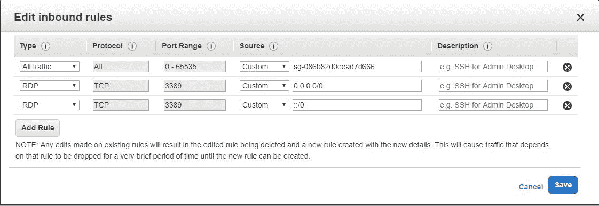
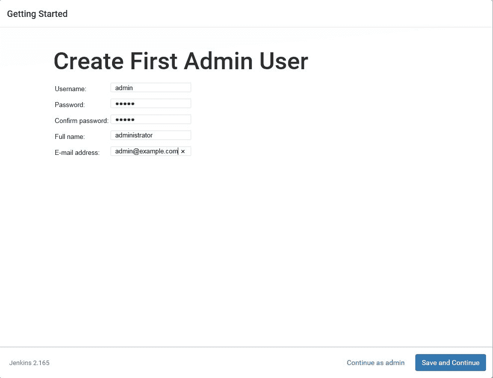
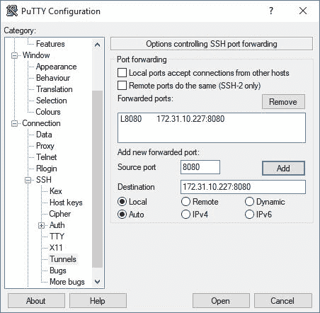
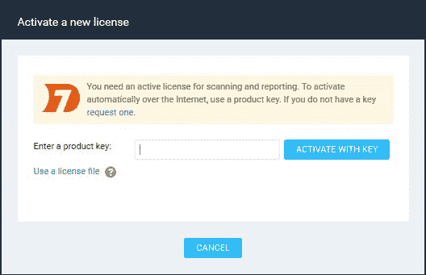
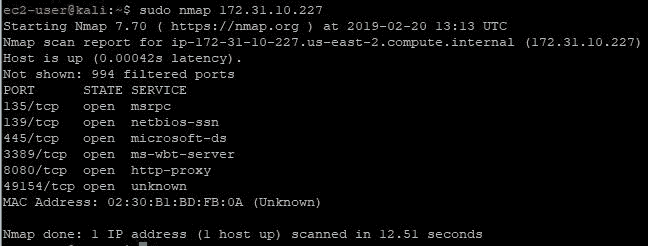
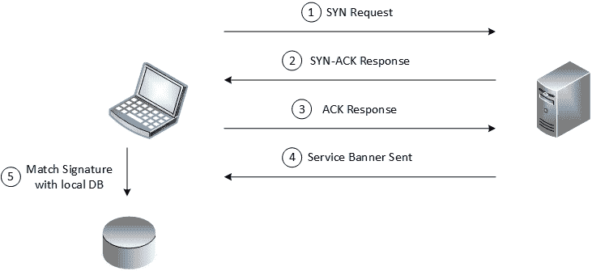
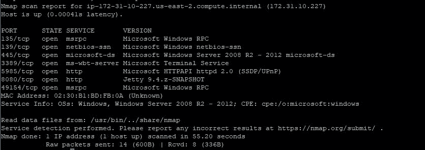
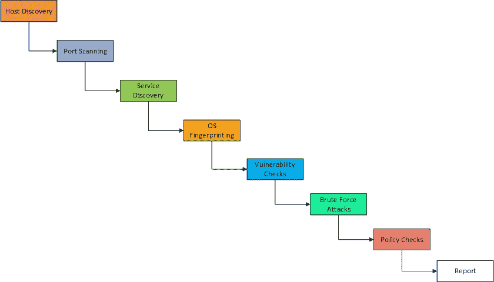
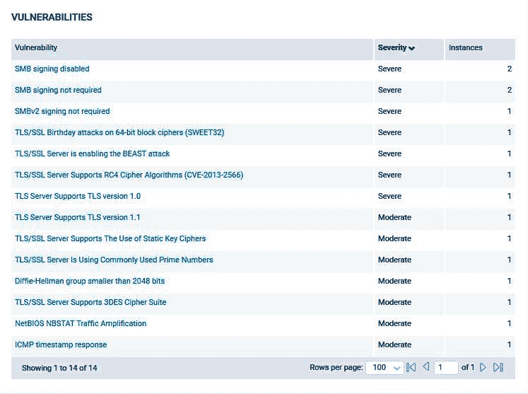
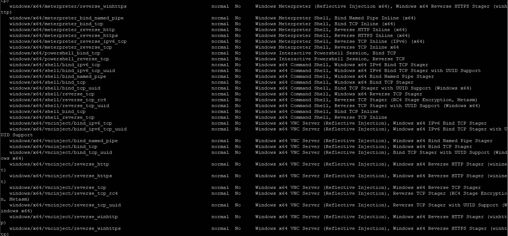

# 第七章：使用 Kali Linux 对 EC2 实例进行渗透测试

在第三章中，*在 Kali Linux 上利用云进行渗透测试*，我们学习了如何对在 AWS 上运行的脆弱机器进行渗透测试。本章旨在帮助读者为高级渗透测试和更多实际场景设置一个脆弱的实验室。这个实验室将让我们了解 DevOps 工程师在**持续集成和持续交付** (**CI/CD**)流水线中常见的安全配置错误。

本章重点介绍在 Linux **虚拟机** (**VM**)上设置一个脆弱的 Jenkins 安装，然后使用我们在第三章中学到的技术进行渗透测试。此外，我们还将介绍一些用于扫描和信息收集的技术，以帮助我们进行渗透测试。最后，一旦我们妥协了目标，我们将学习技术来进行枢纽和访问云中的内部网络。

在本章中，我们将涵盖以下内容：

+   在我们的虚拟实验室中设置一个脆弱的 Jenkins 服务器

+   配置和保护虚拟实验室，以防止意外访问

+   对脆弱机器进行渗透测试，并学习更多的扫描技术

+   妥协我们的目标，然后执行后渗透活动

# 技术要求

本章将使用以下工具：

+   Nexpose（需要手动安装）

+   Nmap

+   Metasploit

+   Jenkins

# 在 Windows 上安装一个脆弱的服务

Jenkins 是 DevOps 环境中 CI/CD 流水线的一个非常重要的组件，主要作为自动化服务器。Jenkins 的主要任务是在软件开发过程中提供持续集成并促进持续交付。Jenkins 可以与 GitHub 等版本管理系统集成。在典型情况下，Jenkins 会获取上传到 GitHub 的代码，构建它，然后部署到生产环境中。要了解更多关于 Jenkins 的信息，请参阅[`www.cloudbees.com/jenkins/about.`](https://www.cloudbees.com/jenkins/about)

Jenkins 提供了在其构建控制台中提供自定义构建命令和参数的选项。这些命令直接发送到**操作系统**（**OS**）的 shell。在这种情况下，我们可以将恶意代码注入构建命令中，以妥协运行 Jenkins 的服务器，从而访问目标网络。

我们将首先启动一个 Windows Server 2008 实例（您可以选择任何层级；但是，免费层级应该足够）。对于本教程，默认存储空间就足够了。让 EC2 实例启动。

我们将配置实例使其脆弱。因此，在传入/传出规则部分，确保只有端口`3389`对外部网络开放。此外，为了确保我们的 Kali 机器能够访问 Jenkins 服务器，允许来自 Kali 机器 IP 的传入连接，而不允许其他地方。

您的 Jenkins 机器的防火墙规则应该是这样的：

Jenkins 机器的防火墙规则

在这里，所有的流量只允许来自 Kali 机器的安全组。这只是一个安全措施，以确保没有其他人可以访问我们脆弱的 Jenkins 机器。

一旦实例启动，就是在目标机器上设置一个脆弱的 Jenkins 服务的时候了。远程桌面连接到您刚创建的机器，然后按照以下步骤操作：

1.  从[`mirrors.jenkins.io/windows/latest`](http://mirrors.jenkins.io/windows/latest)下载 Jenkins 安装包：

1.  只需双击 Jenkins 安装文件。按照屏幕上的说明进行操作：

安装 Jenkins

1.  保持安装位置默认，然后点击下一步：

目标文件夹

1.  最后，点击安装：

安装完成后，浏览器将自动打开并提示您配置 Jenkins 安装：

在安装过程中，Jenkins 安装程序会创建一个初始的 32 个字符长的字母数字密码。

1.  打开位于`C:\Program Files (x86)\Jenkins\secrets\`的`initialAdminPassword`文件：

1.  复制文件中的密码，粘贴到管理员密码字段中，然后点击“继续”：

在下一个屏幕上，设置向导将询问您是否要安装建议的插件或选择特定的插件。

1.  点击“安装建议的插件”框，安装过程将立即开始：

安装插件后，将提示您设置第一个`admin`用户。

1.  为了使其成为一个易受攻击的实例，我们正在使用用户名`admin`和密码也是`admin`来设置帐户。填写所有其他必需的信息，然后点击“保存并继续”：

我们希望我们的 Jenkins 服务可以在`本地连接`接口上使用。

1.  使用命令提示符中的`ipconfig`命令查找您的 Windows Server 2008 EC2 实例的 IP 地址：

1.  注意 IPv4 地址，并在配置 URL 时在 Jenkins 配置页面中填写 IP：

1.  点击“保存并完成”，然后点击“开始使用 Jenkins”。此时，您已成功在系统上安装了 Jenkins。登录后，您将被重定向到 Jenkins 仪表板。

要测试 Jenkins 登录是否可以从 Kali 机器访问，请执行以下操作：

1.  使用 PuTTY 在 Kali 机器上创建一个 SSH 隧道

1.  将本地端口`8080`转发到 Jenkins 机器的端口`8080`：

1.  打开浏览器，指向`http://localhost:8080`

您将看到 Jenkins 登录页面。这意味着我们的 Jenkins 机器可以从 Kali 机器访问。

# 在易受攻击的 Jenkins 机器后面设置一个目标机器

为了模拟一个位于内部网络或另一个子网中的机器，我们将设置一个 Ubuntu 机器，并使其只能从 Jenkins 服务器访问。

为了最终可视化我们的网络应该是什么样子，请参考以下图表：

我们已经设置好了**AWS Jenkins 机器**；现在，我们只需要设置内部机器并将其与**AWS Kali 机器**隔离开来。

让我们看看如何做到：

1.  创建一个 Ubuntu EC2 实例

1.  在安全组设置中，编辑入站规则，并只允许来自 Jenkins 机器的安全 ID 的所有流量

确保 SSH 端口对所有人都是可访问的，以便在需要时可以登录到实例：

最后，我们的网络已经设置好了。网络看起来完全符合我们的预期。在下一节中，我们将安装 Nexpose 进行漏洞扫描。

# 在我们的 Kali 机器上设置 Nexpose 漏洞扫描器

在第三章 *在 Kali Linux 上利用云进行利用*中，我们看到了如何在我们的 Kali 实例上远程设置 Nessus。远程设置 Nexpose 也是一样的。为什么我们需要 Nexpose 以及 Nessus？自动化漏洞扫描器通过匹配服务版本号和操作系统签名来识别漏洞。然而，这有时可能导致误报，甚至更糟糕的是漏报。为了进行双重检查并获得更全面的漏洞评估结果，使用多个漏洞扫描器总是一个好主意：

1.  首先访问[`www.rapi`](https://www.rapid7.com/products/insightvm/download/)[d7.com/products/insightvm/download/](https://www.rapid7.com/products/insightvm/download/)[ 并注册许可证。许可证将发送到您提供的电子邮件地址。](https://www.rapid7.com/products/insightvm/download/)

1.  Nexpose 安装程序可以从[`www.rapid7.com/products/insightvm/download/thank-you/`](https://www.rapid7.com/products/insightvm/download/thank-you/)下载。

1.  我们将下载 Linux 64 位安装程序。您可以将其下载到您的计算机，然后通过 SCP 传输，就像我们在第三章中所做的那样，*在 Kali Linux 上利用云进行利用*，或者您可以直接从 Kali 实例的终端上使用`wget`进行下载，如下所示：

[PRE0]

1.  我们收到的文件是一个 POSIX shell 脚本可执行文件。我们需要给它执行权限，然后运行它。只需以`sudo`身份运行以下命令：

[PRE1]

按照屏幕上的说明进行操作。在提示要安装哪些组件时，请确保选择带有本地扫描引擎的安全控制台[1，输入]。让其余的配置保持默认。

在安装程序提示时输入您的详细信息，并确保为您的帐户设置凭据：

最后，为了能够登录到安全控制台，我们需要创建一个带有用户名和密码的配置文件。在终端上提示时，输入用户名和密码。安装将完成：

您可以选择在安装后立即初始化和启动服务。或者您可以稍后手动执行以下命令：

[PRE2]

安装完成后，从本地端口`3780`设置一个 SSH 端口转发到 Kali 机器上的端口`3780`，并将浏览器指向端口`localhost:3780`。您将看到登录页面。

登录，然后在下一页上输入许可证密钥：

激活后，我们可以继续进行扫描。

# 使用 Nmap 进行扫描和侦察

在本节中，我们将查看扫描子网，并使用 Nmap 对网络进行侦察。Nmap 是网络中主机和服务的侦察、发现和识别的瑞士军刀。在我们进行扫描之前，让我们看看 Nmap 是如何工作的。

当发现网络中的活动主机时，ping 扫描非常方便。这种类型的扫描涉及向网络中的每个主机发送**ICMP ECHO 请求**，然后根据响应识别哪些主机是活动的：

从图中，我们可以看到一些主机响应了**ICMP ECHO 回复**，而有些没有。根据哪些主机回复，我们可以确定哪些主机是活动的。

在 ping 扫描中，我们向 Nmap 提供一个网络范围，通常是一个网络地址及其 CIDR 形式的子网。我们的 AWS 机器托管在 AWS 的默认子网中。子网被指定为`172.31.0.0/20`。这意味着网络地址是`172.31.0.0`，`20`是 CIDR 值。换句话说，网络的子网掩码是`255.255.255.240`，可以容纳总共`4094`个 IP 地址。

让我们继续在我们的网络中进行 ping 扫描。为了这样做，我们将使用`nmap`的`-sn`标志。`-sn`标志指示`nmap`执行 ping 扫描，`172.31.0.0/20`输入告诉`nmap`这是一个网络范围。SSH 进入 Kali 机器并发出以下命令：

[PRE3]

前面命令的输出如下：

从输出中，我们可以看到`nmap`已经识别出五个活动的主机。不包括`172.31.0.1`和`172.31.0.2`地址，我们可以看到网络中有三个活动的主机：我们的 Kali 机器，易受攻击的 Windows 机器和 Ubuntu 机器。

接下来，我们将学习如何扫描特定主机上的开放端口并识别服务。

# 使用 Nmap 识别和指纹开放端口和服务

继续上一节的内容，我们现在将扫描一个主机的开放端口，然后尝试识别运行在目标上的服务。在这个练习中，我们将使用 Nmap 的**SYN**扫描`-sS`标志。这是默认和最常用的扫描技术。为什么？因为这种扫描速度快，可以在不受防火墙干扰的情况下进行。扫描也是隐蔽的，因为它不完成 TCP 握手。扫描可以在开放、关闭和被过滤的端口之间产生明显和准确的结果。那么这种扫描是如何工作的呢？让我们来看一下。

**SYN**扫描使用半开放的 TCP 连接来确定端口是开放还是关闭。**SYN**扫描过程可以通过以下图表可视化：

每次端口扫描都是从 Nmap 向指定端口发送**SYN**数据包开始的。如果端口是开放的，目标会以**SYN-ACK**数据包作为响应。然后 Nmap 会将该端口标记为开放，然后立即通过发送**RST**数据包关闭连接。

在关闭的端口的情况下，当 Nmap 发送**SYN**数据包时，目标会用**RST**数据包做出响应；然后 Nmap 会将该端口标记为关闭，如下图所示：

当 Nmap 向一个端口发送**SYN**数据包并且没有收到任何响应时，它会进行重试。如果仍然没有响应，那么该端口将被标记为被过滤；也就是说，它受到了防火墙的保护。另一种情况是，如果 Nmap 收到 ICMP 不可达的错误，而不是没有响应，那么该端口将被标记为被过滤：

1.  让我们从对 Jenkins 机器进行简单的`nmap`扫描开始。发出以下命令：

[PRE4]

正如我们所看到的，我们得到了`nmap`发现的开放端口的列表。然而，我们只扫描了默认的端口列表。这留下了一些未经检查的端口。识别所有开放的端口是至关重要的，所以让我们看看还有哪些端口是开放的。

1.  发出以下命令：

[PRE5]

`-T4`用于多线程以加快速度。`-p-`标志告诉`nmap`扫描所有`65535`个端口。您可以选择添加`-v`标志使输出更详细，并打印有关目标的更多信息：

正如我们所看到的，我们在之前的扫描中错过了一个开放的端口，端口`5985/tcp`。这说明扫描所有`65535`个端口以寻找开放的端口是很重要的。

我们的下一步是识别这些开放端口上运行的服务。那么 Nmap 是如何识别这些端口上运行的服务的呢？Nmap 执行完整的 TCP 握手，然后等待端口上运行的服务返回其服务横幅。Nmap 有自己的探测数据库来查询服务并匹配响应以解析运行的服务是什么。然后 Nmap 将尝试根据收到的信息来识别协议、服务和底层操作系统。

以下图解释了握手和数据交换的过程：

1.  下一步是识别这些端口上运行的所有服务。发出以下命令：

[PRE6]

在这个命令中，我们指定了要扫描的端口`135`、`139`、`445`、`3389`、`5985`、`8080`和`49154`，因为它们是唯一开放的端口。我们可以使用`-p`参数指定要扫描的特定端口或端口范围：

Nmap 从扫描结果中打印出大量信息。我们可以看到所有开放的端口都已经被扫描以运行服务。在这些中，我们对 2 个端口感兴趣。注意端口`445/tcp` - Nmap 已经确定了服务为 SMB，并确定目标机器是运行 Windows Server 2008 R2 或 2012 的服务器。这是非常重要的，以确定我们的目标正在运行什么操作系统，因此相应地规划我们的下一步。

操作系统也可以通过使用`-O`标志来确定。Nmap 可以通过从服务接收到的响应，使用 CPE 指纹，或通过分析网络数据包来识别目标操作系统。

# 使用 Nexpose 执行自动化漏洞评估

在前面的*在我们的 Kali 机器上设置 Nexpose 漏洞扫描器*部分中，我们学习了如何在我们的 Kali 攻击者机器上设置 Nexpose 扫描器。在本节中，我们将看看如何使用 Nexpose 对目标机器执行自动化的漏洞扫描。

但首先，Nexpose 如何识别目标中的漏洞？

这个想法与 Nmap 在服务发现期间所做的非常相似。但是，Nexpose 的工作规模要比仅识别特定端口上运行的服务大得多。整个过程可以总结如下：

1.  **主机发现**：Nexpose 发送 ICMP 数据包以确定主机是否存活。根据响应，目标被标记为存活。

1.  **端口扫描**：确认主机存活后，Nexpose 发送大量 TCP 数据包以识别正在侦听 TCP 的开放端口。同时，它发送 UDP 流量以识别仅在 UDP 上侦听的端口。Nexpose 可以发送流量到所有端口，或者发送到扫描模板中预定义的端口列表。扫描响应和网络数据包被分析以识别目标上运行的操作系统类型。

1.  **服务发现**：Nexpose 然后与 TCP 和 UDP 上的开放端口进行交互，以识别正在运行的服务。

1.  **操作系统指纹识别**：分析来自端口和服务扫描的数据，以识别目标系统的操作系统。这并不总是非常准确，因此 Nexpose 使用评分系统来表示扫描结果的确定程度。

1.  **漏洞检查**：最后，已识别的服务将被扫描以查找未确认和已确认的漏洞。为了检查任何未确认的漏洞，Nexpose 从服务横幅中识别出补丁和版本。然后，这些信息将与可能影响该特定软件版本的任何已知漏洞进行匹配。例如，如果 Nexpose 发现目标的端口 80 上运行着 Apache HTTP 2.4.1，Apache 将获取这些信息并交叉参考其漏洞数据库，以确定该版本是否存在任何已知漏洞。基于此，它将列出分配给该特定漏洞的**常见漏洞和暴露**（**CVEs**）。然而，这些是未经确认的，因此需要手动测试以确认漏洞是否存在。另一方面，已确认的漏洞可能类似于某些软件使用默认密码。Nexpose 将检查软件是否仍在使用默认密码运行，尝试登录，并仅在成功登录时将其报告为漏洞。

1.  **暴力破解攻击**：Nexpose 的扫描模板默认设置为测试诸如 SSH、Telnet 和 FTP 之类的服务，以查找默认用户名和密码组合，例如`'admin':'admin'`或者`'cisco':'cisco'`。任何这样的发现都将被添加到报告中。

1.  **策略检查**：作为额外的奖励，Nexpose 检查目标机器的配置，以验证它们是否符合 PCI DSS、HIPAA 等基线。

1.  **报告**：最后，所有发现都被放入报告并显示在屏幕上。

总结整个过程，以下是该过程的瀑布模型：

Nexpose 可以选择配置为执行 Web 扫描，发现 Web 服务，检查 SQLi 和 XSS 等漏洞，并执行 Web 蜘蛛。

让我们开始扫描目标服务器：

1.  在本地端口`3780`转发到 Kali 机器上的端口`3780`，创建一个 SSH 隧道

1.  如果 Nexpose 服务没有运行，你可以通过发出以下命令来启动它：

[PRE7]

1.  将你的浏览器指向`https://localhost:3780`

初始化完成后，我们将看到 Nexpose 的主屏幕：

1.  在这里，我们需要点击“创建新站点”来在之前设置的 Jenkins 目标上开始一个新的扫描。给站点取任何你想要的名字：

1.  现在添加你的目标 IP 地址。目标 IP 地址可以是一系列 IP、用逗号分隔的单个 IP 或整个子网及其 CIDR 值：

1.  将扫描类型设置为详尽。有许多可用的扫描类型。我们使用详尽扫描，以便 Nexpose 检查所有端口，找到任何打开的端口，无论是 TCP 还是 UDP。每种单独的扫描类型都可以用于特定的用例。例如，**发现扫描**可以用于仅发现网络中的主机，而**HIPAA 合规性**将仅检查目标的配置和策略，以查看它们是否符合 HIPAA 基线。开始扫描并等待其完成：

与第三章中的 Nessus 一样，*使用 Kali Linux 在云上进行利用*，Nexpose 提供了大量信息，包括我们目标上运行的服务：

我们还看到它识别出了一些漏洞：

然而，它未能检测到我们的有漏洞的 Jenkins 服务。通常，需要对 Jenkins 服务进行暴力破解，以找到一组有效的凭据。然而，我们假设我们已经有了登录凭据。在下一节中，我们将看到如何利用这样一个有漏洞的服务并拥有目标服务器。

# 使用 Metasploit 进行自动化利用

在这个演示中，我们将使用 Metasploit 来利用 Jenkins 服务器，并在其上获取一个 meterpreter shell。Jenkins 有自己的脚本控制台，用户可以在其中输入和运行任意代码。如果用户的凭据被盗，这是危险的，因为任何人都可以使用脚本控制台运行任意代码。我们将使用的 Metasploit 模块利用了这一点，并尝试运行代码，以创建到远程机器的连接。

让我们看看如何进行利用：

1.  通过发出以下命令，通过 SSH 登录到 Kali 机器并加载 Metasploit 框架：

[PRE8]

1.  接下来，我们将搜索 Metasploit 是否有与 Jenkins 相关的任何利用：

[PRE9]

前面命令的输出如下：

我们看到了一些与 Jenkins 相关的模块。

1.  在这种情况下，我们将使用`jenkins_script_console`利用。发出以下命令：

[PRE10]

1.  让我们设置利用并配置我们的目标服务器。逐一发出以下命令：

[PRE11]

`目标 0`表示这是一台 Windows 机器。

1.  要查看所有可用的有效载荷列表，请发出以下命令：

[PRE12]

列出所有有效载荷供我们审阅：

1.  我们将使用反向 TCP 有效载荷进行此利用。由于我们的 Windows 机器是 64 位的，我们将选择 64 位有效载荷进行传递。然后，将你的`LHOST`设置为你的 Kali IP 地址：

[PRE13]

一旦所有这些都完成了，你可以发出`show options`命令来检查是否填写了所有必需的数据：

1.  现在，简单地运行利用。你将进入一个 meterpreter shell：

我们已成功获得了对目标机器的 shell 访问。在接下来的部分，我们将看到如何进行特权升级和枢纽，以及使我们的后门持久化。

# 使用 Meterpreter 进行特权升级、枢纽和持久性

现在是我们练习的第二阶段。一旦我们有了 meterpreter shell，我们将尝试进行特权升级，并在目标服务器上获得尽可能高的特权。

但首先，让我们更多地了解一下我们的目标服务器。运行以下命令：

[PRE14]

上述命令的输出如下：

我们得到了一堆信息，比如这台机器正在运行的 Windows 版本、域等等。

现在是时候进行特权升级了，输入以下命令：

[PRE15]

如果成功，你通常会得到这样的响应：

[PRE16]

这意味着我们的特权升级成功了。为了验证，我们可以输入以下命令：

[PRE17]

如果我们是最高特权用户，我们应该得到一个`Server username: NT AUTHORITY\SYSTEM`的响应。

现在我们完全控制了服务器，让我们开始在内部网络上寻找机器。为此，我们将枢纽我们的 meterpreter 会话，并在我们的 Kali 机器上为内部网络创建一个桥接：

1.  首先将你的 meterpreter shell 后台化：

[PRE18]

1.  添加`target`和`session`的路由 ID：

[PRE19]

1.  接下来，为了验证我们已经枢纽，我们将尝试使用 Metasploit 对隐藏的 Ubuntu 机器进行端口扫描：

[PRE20]

上述命令的输出如下：

从扫描结果中，我们可以看到有许多端口是开放的。这意味着我们成功地枢纽了我们的受损机器。我们可以得出这样的结论，因为只有端口`22`（SSH）是公开的；从任何其他机器进行的扫描只会显示端口`22`是开放的。一旦枢纽成功，我们可以通过我们的受损 Windows 机器在内部网络中执行大量攻击。

现在是我们练习的最后一部分——我们如何确保我们对受损机器有持久访问？我们可以使用后渗透模块来实现。首先，我们需要创建一个恶意的`.exe`文件，它将连接回我们的 Kali 机器。为此，我们将使用 Metasploit 套件中的另一个工具`msfvenom`：

1.  如果你在 meterpreter 会话中，将其后台化，并输入以下命令：

[PRE21]

使用`msfvenom`，我们创建了一个需要传输到受害者机器的`exe`文件。

1.  重新进入 meterpreter 会话，输入以下命令：

[PRE22]

上述命令的输出如下：

让我们检查一下我们的持久性是否有效。为了验证这一点，在 meterpreter 会话中，重新启动目标服务器并退出 meterpreter 会话。从 meterpreter 会话中输入以下命令：

[PRE23]

通过运行`exit`命令退出 meterpreter 会话。

现在，我们设置 Metasploit 监听传入连接。依次输入以下命令：

[PRE24]

我们从目标服务器获得了一个新的传入连接：

因此，我们成功地为我们的受损服务器创建了一个后门，并创建了持久访问。这结束了我们的练习。这种持久访问现在可以用于横向移动，并允许我们攻击网络中的其他机器。

# 摘要

本章介绍了如何设置一个易受攻击的 EC2 环境，模拟一个受限网络，然后对其进行渗透测试。我们学习了如何以易受攻击的方式配置 Jenkins 服务器。随后，我们学习了如何设置 Nexpose 漏洞扫描器，然后对我们易受攻击的 Jenkins 服务器进行了漏洞扫描。此外，我们学习了如何使用 Metasploit 对 Jenkins 进行自动化利用，并使用 meterpreter 有效载荷来在受限网络内进行主机转移和横向移动。

这就是第五章的结束。在下一章中，我们将学习关于 EBS 卷、磁盘加密和卷快照。此外，我们将学习如何进行取证分析，并从 EBS 卷中恢复丢失的数据。

# 进一步阅读

+   [`www.packtpub.com/networking-and-servers/mastering-metasploit`](https://www.packtpub.com/networking-and-servers/mastering-metasploit)

+   [`nexpose.help.rapid7.com/docs/security-console-quick-start-guide`](https://nexpose.help.rapid7.com/docs/security-console-quick-start-guide)

+   [`jenkins.io/doc/tutorials/`](https://jenkins.io/doc/tutorials/)
