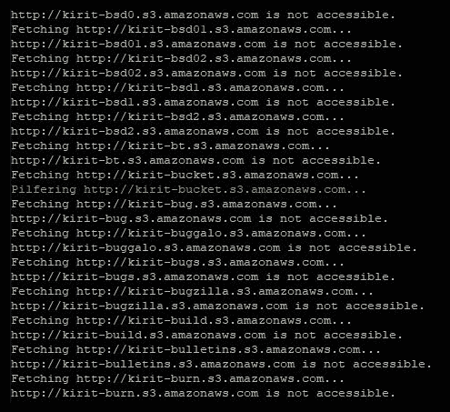

# 第十一章：利用宽松的 S3 存储桶进行娱乐和利润。

利用 S3 存储桶并不仅限于读取敏感信息。例如，包含在 S3 存储桶中的 JavaScript 可以被设置后门，以影响加载受感染 JavaScript 的 Web 应用程序的所有用户。

本章将介绍利用易受攻击的 S3 存储桶的过程，以识别被 Web 应用程序加载的 JS 文件，并在其中设置后门以获得全用户妥协。除此之外，还将重点放在识别易受攻击的 S3 存储桶中存储的敏感凭据和其他数据机密，并利用这些内容来实现对连接应用程序的进一步妥协。

在本章中，我们将涵盖以下主题：

+   从暴露的 S3 存储桶中提取敏感数据

+   向 S3 存储桶注入恶意代码

+   为了持久访问后门 S3 存储桶

# 从暴露的 S3 存储桶中提取敏感数据

在之前的第七章中，*侦察-识别易受攻击的 S3 存储桶*，我们学习了如何通过使其公开可用来创建易受攻击的存储桶。在本章中，我们将学习如何识别易受攻击的存储桶，并尝试从每个存储桶中提取数据。

因此，一旦存储桶设置好，我们将尝试从外部人员的角度攻击易受攻击的存储桶。为了实现这一点，我们将使用`AWSBucketDump`工具。这是一个非常方便的工具，用于识别易受攻击的 S3 存储桶。`AWSBucketDump`工具可以在 GitHub 页面[`github.com/jordanpotti/AWSBucketDump`](https://github.com/jordanpotti/AWSBucketDump)上找到。

让我们看看如何使用`AWSBucketDump`提取敏感数据：

1.  克隆该工具并`cd`到该文件夹中：

```
git clone https://github.com/jordanpotti/AWSBucketDump
cd AWSBucketDump
```

接下来，我们将需要配置工具使用字典来暴力破解并找到易受攻击的 S3 存储桶。

1.  在任何文本编辑器中打开`BucketNames.txt`文件。该文件包含一个有限的单词列表，用于识别开放的存储桶。但是，您可以使用更大的单词列表来增加击中开放存储桶的机会。

1.  为了演示目的，我们将在单词列表中添加`bucket`关键字。

这里的单词非常常见，那么我们如何识别与我们目标组织特定的存储桶？我们将把组织的名称作为这些单词的前缀。由于我们的存储桶名为`kirit-bucket`，我们将在单词列表中的每个单词前添加`kirit`作为前缀。为此，我们将使用`vim`来使我们的工作更容易。

1.  在`vim`中打开`BucketNames.txt`文件：

```
vim BucketNames.txt
```

1.  在`vim`中，为每个单词添加前缀，发出以下命令：

```
:%s/^/kirit-/g
or :%s/^/<<prefix>>/g 
```

1.  使用以下命令保存文本文件：

```
:wq
```

1.  创建一个空文件：

```
touch found.txt
```

1.  在运行`AWSBucketDump`之前，我们需要确保满足所有 Python 依赖关系。为此，有一个名为`requirements.txt`的文本文件，其中列出了所有所需的 Python 模块。我们只需要安装它们。使用以下命令：

```
sudo pip install -r requirements.txt
```

1.  现在，是时候运行`AWSBucketDump`了。发出以下命令：

```
python AWSBucketDump.py -D -l BucketNames.txt -g interesting_Keywords.txt
```

脚本将使用单词列表，然后尝试暴力破解并找到公开的 S3 存储桶。然后将列出的任何开放的存储桶使用`interesting_Keywords.txt`中的关键字进行搜索。

从脚本输出中，我们可以看到`AWSBucketDump`找到了开放的存储桶：



在下一节中，我们将看到如何可以在一个易受攻击的 S3 存储桶中设置后门并注入恶意代码。

# 向 S3 存储桶注入恶意代码

如果一个 Web 应用程序正在从一个公开可写的 S3 存储桶中获取其内容会发生什么？让我们考虑这样一个情景，您有一个 Web 应用程序，它从一个 S3 存储桶中加载所有内容（图像、脚本等）。如果这个存储桶偶然被公开给全世界，攻击者可以上传他的恶意`.js`文件到 S3 存储桶，然后被 Web 应用程序渲染。

为了演示目的，我们将设置一个非常基本的 HTML 页面，链接到托管在 S3 存储桶上的 JavaScript 文件：

```
<!DOCTYPE html>
 <html >
 <head>
<!--Link JavaScript---->
 <script type="text/javascript" src="img/vulnscript.js"></script>
 <!--Vulnerable JavaScript-->
</head>
 <body><!-- Your web--></body>
 </html>
```

正如你所看到的，页面调用了托管在 S3 上的.js 文件（[`s3.us-east-2.amazonaws.com/kirit-bucket/vulnscript.js`](https://s3.us-east-2.amazonaws.com/kirit-bucket/vulnscript.js)）。我们已经找出了如何识别有漏洞的 S3 存储桶。如果这个存储桶也有漏洞，我们可以上传我们自己的恶意 vulnscript.js 文件。

当下次网页加载时，它将自动运行我们的恶意.js 脚本：

1.  首先创建一个恶意的.js 脚本，弹出一个警报，类似于 XSS 攻击。为了演示，我们将使用以下 Javascript 代码：

```
alert("XSS")
```

1.  把它放在一个文件中，并以与在 HTML 代码中找到的文件相同的名称保存。

1.  在最后一章中，我们学习了如何使用 AWS CLI 上传文件。同样地，将你的 js 文件上传到有漏洞的存储桶：

```
aws s3 cp vulnscript.js s3://kirit-bucket/vulnscript.js --acl public-read
```

1.  现在，再次访问 Web 应用程序，它将加载和呈现有漏洞的脚本。你应该会得到一个典型的 XSS 弹出警报：


在接下来的部分，我们将看到如何在 S3 存储桶中设置后门，以侵害用户的计算机。

# 为了持久访问后门 S3 存储桶

S3 存储桶有时可能被遗弃。也就是说，可能存在应用程序和/或脚本向不存在的 S3 存储桶发出请求。

为了演示这样的情况，让我们假设一个 S3 存储桶的 URL 是[`s3bucket`](http://storage.example.com.s3-website.ap-south-1.amazonaws.com/)*.*[example.com.s3-website.ap-south-1.amazonaws.com](http://example.com.s3-website.ap-south-1.amazonaws.com/)。

这个 URL 可能绑定到组织的子域（例如[`data.example.net`](https://storage.example.net/)），以混淆 AWS S3 URL。这是通过添加替代域名（CNAMEs）来实现的。

然而，随着时间的推移，绑定到 URL 的存储桶[`data.example.net`](https://data.example.net)可能被删除，但 CNAME 记录仍然存在。因此，攻击者可以创建一个与未认领存储桶同名的 S3 存储桶，并上传恶意文件以提供服务。当受害者访问 URL 时，他将得到恶意内容。

你如何识别这个漏洞？

1.  寻找一个错误页面，上面显示 404 Not Found 的消息和 NoSuchBucket 消息。为了实现这一点，我们可以枚举特定主机的子域，并寻找说存储桶未找到的错误页面，如下面的截图所示：


1.  一旦发现了这样一个未认领的存储桶，就在与 URL 相同的地区创建一个同名的 S3 存储桶。

1.  在新创建的 S3 存储桶上部署恶意内容。

当网站的任何用户尝试访问有漏洞的 URL 时，攻击者存储桶中的恶意内容将呈现在受害者的网站上。攻击者可以上传恶意软件到存储桶，然后提供给用户。

让我们假设一个应用程序正在调用一个未被认领的 S3 存储桶。该应用程序请求安装程序文件，下载它们，然后执行脚本。如果存储桶被遗弃，攻击者可以劫持存储桶并上传恶意软件，从而提供持久访问。

在 HackerOne 的漏洞赏金计划中可以找到这样的案例研究[`hackerone.com/reports/399166`](https://hackerone.com/reports/399166)。

正如我们所看到的，脚本从 S3 存储桶中获取.tgz 文件，解压并在受害者的设备上执行文件。攻击者可以利用这个漏洞上传一个持久的后门到 S3 存储桶中：


当受害者运行脚本时，它将下载包含恶意脚本的.tgz 文件，解压并在受害者的计算机上执行恶意软件。

进一步阅读

# [`github.com/jordanpotti/AWSBucketDump`](https://github.com/jordanpotti/AWSBucketDump)

然而，需要注意的是，这种漏洞高度依赖于调用未声明的 S3 存储桶的脚本。

在下一章中，我们将学习如何对 AWS Lambda 进行渗透测试。我们将研究如何利用有漏洞的 Lambda 实例，并学习端口利用方法，比如从受损的 AWS Lambda 中进行枢轴攻击。

# [`hackerone.com/reports/172549`](https://hackerone.com/reports/172549)

+   在上一章的延续中，我们学习了如何利用有漏洞的 S3 存储桶。我们进行了`AWSBucketDump`的演示，以及如何使用它来从有漏洞的 S3 存储桶中转储数据。此外，我们还学习了如何利用未声明的 S3 存储桶，以及如何在有漏洞和/或未声明的 S3 存储桶中植入后门和注入恶意代码。

+   总结

+   [`aws.amazon.com/premiumsupport/knowledge-center/secure-s3-resources/`](https://aws.amazon.com/premiumsupport/knowledge-center/secure-s3-resources/)
