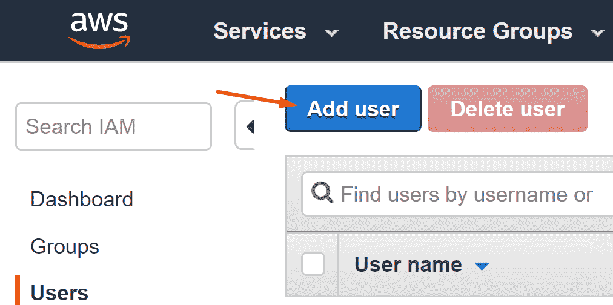
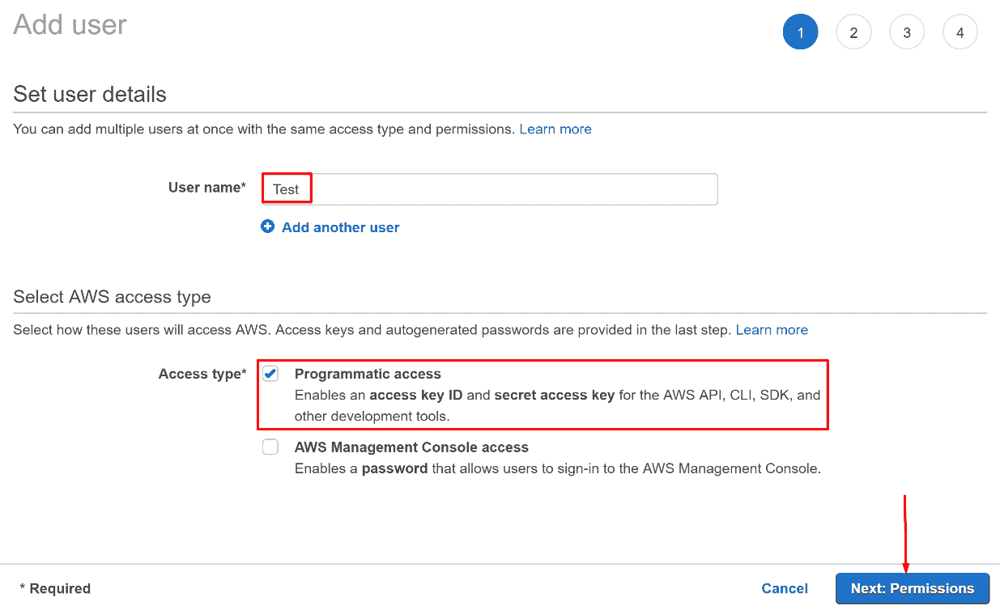
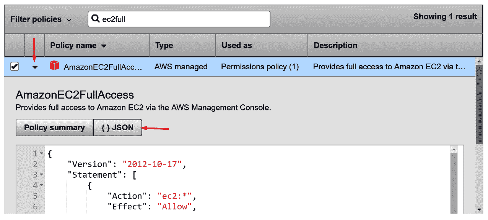
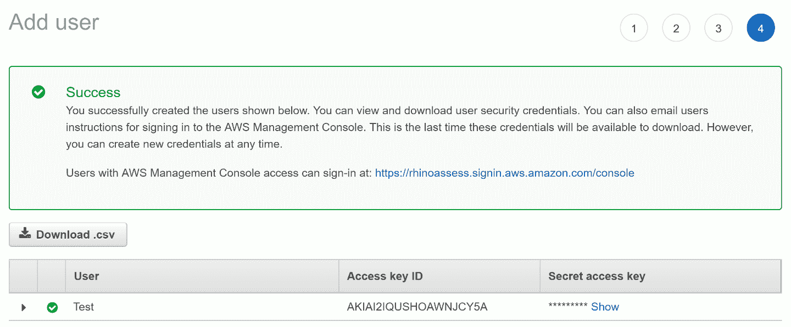
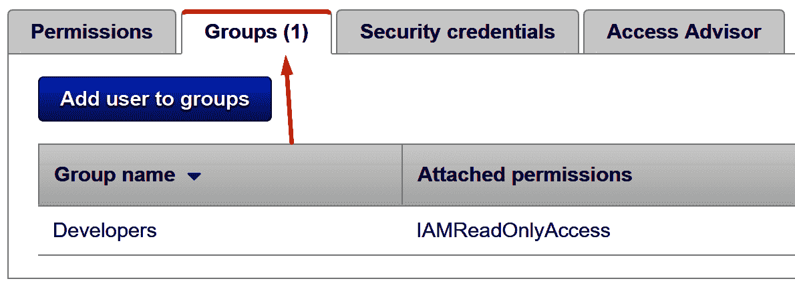
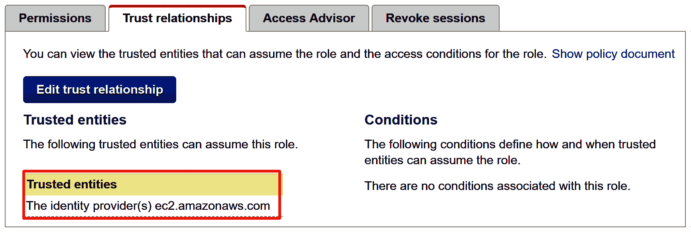
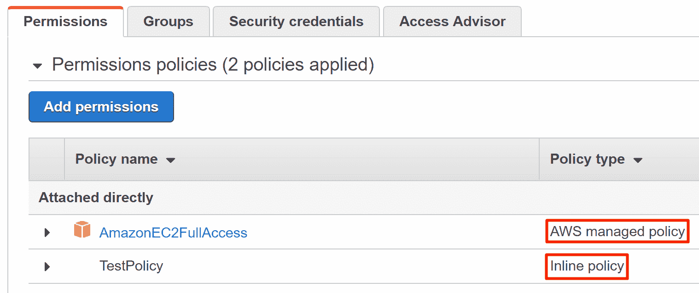
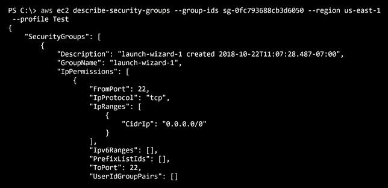

# AWS 上的身份访问管理

AWS 提供了许多不同的方法供用户通过 IAM 服务对其帐户进行身份验证，其中最常见的包括用户帐户和角色。IAM 用户提供了为需要长期访问环境的内容设置凭据的手段。用户可以通过使用用户名和密码进行 Web UI 身份验证来访问 AWS API，也可以通过使用 API 密钥（访问密钥 ID 和秘密访问密钥）来以编程方式发出请求。

另一方面，角色提供了将临时凭据委派给用户/服务/应用程序的手段。具有`sts:AssumeRole`权限的 IAM 用户可以假定角色以获取一组 API 密钥（访问密钥 ID、秘密访问密钥和会话令牌），这些密钥仅在短时间内有效。默认情况下，密钥的生命周期设置为在这些密钥到期之前的一小时。这些密钥将具有被分配给被假定角色的权限，并且通常用于完成某些任务。通过使用这种模型，环境中的 AWS 用户不会始终拥有他们可能需要使用的每个权限；相反，他们可以根据需要请求角色具有的权限。这允许更严格的审计和权限管理。

AWS IAM 还有一种称为**组**的资源。组可用于将一组用户委派给一组权限。在 AWS 环境示例中，可能会有一个名为**开发人员**的组，该组提供公司开发人员需要访问的服务。然后，用户可以添加到该组，并且他们将继承与之关联的权限。只要他们是相关组的成员，用户将保留所提供的权限。单个用户最多可以成为 10 个不同组的成员，单个组最多可以容纳允许的用户总数。

IAM 用户、角色和组对我们的攻击过程和对 AWS 基础设施的基本理解至关重要。本章旨在提供有关 IAM 服务一些常见功能以及我们如何作为常规 AWS 用户和攻击者使用它们的见解。

在本章中，我们将使用 IAM 服务来涵盖以下主题：

+   如何创建 IAM 用户、组、角色和相关权限

+   如何限制特定角色可访问的 API 操作和资源

+   使用 IAM 访问密钥

+   签署 AWS API 请求

# 创建 IAM 用户、组、角色和相关权限

当您登录到 AWS Web 控制台时，可以通过导航到 IAM 服务页面来创建用户、组和角色：

1.  要进入 IAM 页面，请单击页面左上角的“服务”按钮，然后搜索并单击 IAM 页面的相关链接：

在 AWS Web 控制台的服务下拉菜单中搜索 IAM 服务

1.  以下图显示了 IAM 仪表板上用户、组和角色的相关链接。单击“用户”继续：

IAM 仪表板上的相关链接

1.  要创建 IAM 用户，请单击页面左上角的“添加用户”按钮：

用户仪表板上的“添加用户”按钮

然后，您将看到一个页面，要求输入用户名和要为新用户提供的访问类型。您可以选择的两种访问类型之一是程序访问，它会为用户创建访问密钥 ID 和秘密访问密钥，以便他们可以通过 AWS CLI 或为各种编程语言提供的 SDK 访问 AWS API。另一种是 AWS 管理控制台访问，它将自动生成密码或允许您设置自定义密码，以便用户可以访问 AWS Web 控制台。

1.  对于我们的示例，让我们创建一个名为`Test`的用户，允许访问 AWS API。填写完毕后，您可以点击“下一步：权限”继续：

图 4：创建一个名为 Test 的新用户，允许访问 AWS API

1.  继续后，您将看到三个选项来设置这个新用户的权限。

如果您想创建一个没有任何权限的用户（例如，如果您打算稍后处理这些权限），您可以直接点击“下一步：审核”跳过此页面。

提供的三个选项允许您执行以下操作：

+   +   将用户添加到 IAM 组

+   复制另一个现有用户的权限

+   直接将现有的 IAM 策略附加到用户

点击第三个选项，直接将现有策略附加到用户：

图 5：选择直接将现有策略附加到新用户的选项

这样做后，您将看到一个 IAM 策略列表。

1.  在出现的搜索框中，输入`AmazonEC2FullAccess`并勾选出现的策略左侧的框。这个策略将为用户提供对 EC2 服务的完全访问权限，以及通常与 EC2 一起使用的其他服务。如果您有兴趣查看此策略的 JSON 文档，可以点击策略名称旁边的箭头，然后点击{} JSON 按钮：

图 6：查看我们选择的 IAM 策略的 JSON 文档

IAM 策略是以 JSON 格式的文档，指定了允许或拒绝的权限、这些权限适用的资源以及这些权限对某个用户、组或角色有效的条件。

有两种 IAM 策略：AWS 管理的策略和客户管理的策略。AWS 管理的策略是 AWS 管理的预定义权限集。AWS 管理的策略可以通过策略名称旁边的小橙色 AWS 符号来识别。客户不允许修改这些 AWS 管理的策略，它们被提供作为设置权限时的便利方法：

图 7：选择了 AWS 管理策略 AmazonEC2FullAccess

客户管理的策略与 AWS 管理的策略相同，只是它们必须在任何时候创建，并且可以完全自定义。这些策略允许您将对各种 IAM 用户、组和角色的细粒度访问权限委托给您的帐户。

1.  现在，我们可以点击窗口底部右侧的“下一步：审核”按钮继续。接下来的页面将是我们刚刚设置的摘要，所以我们可以继续点击窗口底部右侧的“创建用户”按钮。

1.  接下来，您将看到一个绿色的成功消息，并有选择查看或下载与这个新用户相关的访问密钥 ID 和秘密访问密钥的选项：

图 8：创建新 IAM 用户后呈现的成功页面

这是这些凭证唯一可用的时间，因此重要的是将这些信息安全地存储在只有您可以访问的地方。

同样的一般过程也可以用来创建角色和组。

如果我们想创建一个组并将我们的新用户添加到其中，我们可以按照以下步骤进行：

1.  在 AWS Web 控制台的 IAM 页面的“组”选项卡中导航，然后点击左上角的“创建新组”。

1.  为这个组提供一个名称；在我们的示例中，它将是`Developers`。

1.  我们将被要求选择一个要附加到该组的 IAM 策略，我们将搜索并将 IAMReadOnlyAccess AWS 管理策略添加到我们的组中。

1.  点击下一步，我们将看到一个我们想要创建的组的摘要，我们可以通过点击右下角的“创建组”来完成这个过程，如下面的屏幕截图所示：

图 9：创建名为 Developers 的新组，并附加 IAMReadOnlyAccess 策略

1.  现在组已经创建，我们可以从 IAM 组页面点击它，然后会看到类似下面的屏幕截图，我们可以点击“添加用户到组”按钮来添加我们的新用户：

我们新创建的组目前还没有任何用户

1.  然后我们可以搜索并勾选我们之前创建的`Test`用户旁边的复选框，然后点击“添加用户”按钮，如下面的屏幕截图所示，来完成这个过程：

选择并将我们的 Test 用户添加到我们的新 Developers 组中

1.  现在，如果我们导航到我们`Test`用户的用户页面，我们可以看到我们之前附加的 AmazonEC2FullAccess AWS 托管策略附加到了我们的用户，以及另一个部分，来自组附加，其中包括我们的用户从`Developers`组继承的 IAMReadOnlyAccess AWS 托管策略：

直接附加到我们的用户的策略和从 Developers 组继承的策略

1.  如果我们想知道我们的用户属于哪些组，以及我们的用户从这些组中继承了哪些策略，我们可以点击“组（1）”选项卡，它会给我们这些信息：

我们的用户所属的组以及我们从这些组中继承的策略

角色不能添加到组中，但 IAM 策略可以以与为用户和组相同的方式附加和移除。角色具有一个额外的重要特性，称为**信任关系**。信任关系指定谁可以假定（请求临时凭证）所讨论的角色，并在什么条件下可以发生。

我创建了一个角色，与 AWS EC2 服务创建了信任关系，这意味着 EC2 资源可以请求此角色的临时凭证。查看特定角色时，下面的屏幕截图显示了信任关系选项卡：

信任关系选项卡

在突出显示的部分，我们可以看到我们有一个受信任的实体，它是身份提供者 ec2.amazonaws.com。

信任关系在一个名为**假定角色策略**文档的 JSON 文档中指定。我们的示例角色有以下假定角色策略文档：

[PRE0]

策略及其支持的键将在下一节中更详细地描述，但基本上，这个 JSON 文档表示 EC2 服务（主体）被允许（效果）在针对此角色时运行`sts:AssumeRole`操作。主体还可以包括 IAM 用户、其他 AWS 服务或其他 AWS 账户。这意味着您可以假定跨账户角色，这是攻击者在账户中建立持久性的常见方式。这将在第十一章中进一步描述，*使用 Boto3 和 Pacu 维持 AWS 持久性*。我们现在将继续查看如何使用 IAM 策略限制 API 操作和可访问资源。

# 使用 IAM 策略限制 API 操作和可访问资源

IAM 策略是如何授予账户中的用户、角色和组权限的。它们是简单的 JSON 文档，指定了明确允许或拒绝的权限，这些权限可以/不能在哪些资源上使用，以及这些规则适用的条件。我们可以使用这些来在我们的 AWS 环境中执行细粒度的权限模型。

# IAM 策略结构

以下的 JSON 文档是一个示例，用来描述 IAM 策略文档的一些关键特性：

[PRE1]

这个策略包含了 IAM 策略的一些最常见的特性。首先，我们有`Version`键，它指定了正在使用的策略语言的版本。最佳实践是使用最新版本，目前是`2012-10-17`，除此之外不需要考虑太多。

接下来，我们有`Statement`键，它是一个称为语句的 JSON 对象列表。语句是关于权限和与之相关的设置的单独声明。一个语句可以包括`Sid`、`Effect`、`Action`、`NotAction`、`Principal`、`Resource`和`Condition`键。

`Sid`是一个可选字段，是您选择的字符串，用于帮助区分策略中不同的语句。它不需要被提供，但如果提供了，它基本上只是为了让读者更容易理解策略。在前面的策略中，`MyGeneralEC2Statement` Sid 旨在表明该语句是 EC2 服务的一般语句。

`Effect`键是一个必需的字段，可以设置为`Allow`或`Deny`，它声明了列出的 AWS 权限（在`Action`或`NotAction`下）是显式允许还是显式拒绝的。在前面示例策略中的所有语句都明确允许相关权限。

`Action`或`NotAction`中的一个键是必需的，它包含一组 AWS 权限。几乎每次都会看到`Action`被使用而不是`NotAction`。在前面示例策略中的第一个语句明确允许了`ec2:*`操作，使用了 IAM 策略的通配符字符（`*`）。

权限以`[AWS 服务]:[权限]`的格式设置，因此`ec2:*`权限指定了与 AWS EC2 服务相关的每个权限（例如`ec2:RunInstances`和`ec2:CopyImage`）。通配符字符可以在 IAM 策略的各个地方使用，比如在以下权限中：`ec2:Describe*`。这将代表以`Describe`开头的每个 EC2 权限（例如`ec2:DescribeInstances`和`ec2:DescribeImages`）。`NotAction`稍微复杂一些，但基本上它们是`Action`的相反。这意味着`NotAction ec2:Modify*`将代表除了以`Modify`开头的所有 EC2 权限之外的所有 AWS 服务的每个 API 调用（例如`ec2:ModifyVolume`和`ec2:ModifyHosts`）。

`Principal`键适用于不同类型的 IAM 策略，超出了我们到目前为止所看到的内容（例如在上一节中的假定角色策略文档）。它代表了该语句所适用的资源，但它在用户、角色和组的权限策略中是自动隐含的，所以我们现在将跳过它。

`Resource`键是一个必需的字段，是指定在`Action`/`NotAction`部分下指定的权限适用于哪些 AWS 资源的列表。这个值通常只被指定为通配符字符，代表任何 AWS 资源，但对于大多数 AWS 权限来说，最佳实践是将其锁定到必须使用的资源。在我们的示例策略中列出的第二个语句中，我们将资源列为`arn:aws:iam::123456789012:user/TestUser`，这是帐户中用户的 ARN，帐户 ID 为`123456789012`，用户名为`TestUser`。这意味着我们只允许（效果）对帐户中具有`123456789012` ID 和`TestUser`用户名的用户执行`iam:GetUser` API 调用（操作）（资源）。请注意，尽管资源中列出了帐户 ID，但许多 API 调用不能用于属于不同 AWS 帐户的资源，即使通配符存在，而不是帐户 ID。

“条件”键是一个可选字段，指示规则说明适用的条件。在我们之前的示例的第三个语句中，我们有一个名为`aws:MultiFactorAuthPresent`的`Bool`条件（布尔值，即`true`/`false`）设置为 true。这意味着对于这个语句适用（允许在任何资源上使用`sts:AssumeRole`权限），用户/角色必须使用 AWS 进行多因素身份验证；否则，该权限是不允许的。还有许多其他可以指定的条件，比如要求任何 API 调用需要特定的源 IP 地址，要求 API 调用在特定时间范围内进行，以及许多其他条件（参见[`docs.aws.amazon.com/IAM/latest/UserGuide/reference_policies_elements_condition_operators.html`](https://docs.aws.amazon.com/IAM/latest/UserGuide/reference_policies_elements_condition_operators.html)）。

# IAM 策略的目的和用途

作为攻击者，了解 IAM 策略的工作原理很重要，因为一旦您能够阅读它们，您就可以确定对环境有什么样的访问权限，以及为什么您进行的某些 API 调用会因为访问被拒绝而失败，即使看起来它们应该被允许。可能是您正在攻击未在策略中指定的资源，您没有进行多因素身份验证，或者可能是其他各种原因。

当我们在攻击中检查受损密钥时，我们喜欢看到以下的语句：

[PRE2]

这个语句给了我们管理员级别的权限。因为它允许使用`*`权限，并且因为`"*"`字符是通配符，这意味着任何与 AWS 服务相关的权限都是允许的。资源也是通配符，所以我们可以对目标账户中的任何资源运行任何 API 调用。有一个具有这些权限的 AWS 托管 IAM 策略，称为`AdministratorAccess`策略。该策略的 ARN 是`arn:aws:iam::aws:policy/AdministratorAccess`。

在测试时管理用户的权限，您可以将 IAM 策略附加到您的用户、角色或组，以提供或拒绝策略中设置的权限。到目前为止，我们已经看到的策略类型可以被重用并附加到多种不同类型的资源上。例如，同一个 IAM 策略可以同时附加到用户、组和/或角色上。

还存在内联策略，与托管策略不同，内联策略不是独立资源，而是直接创建在用户、角色或组上。内联策略不能像托管策略那样被重用，因此，安全最佳实践是尽量避免使用内联策略。作为攻击者，我们可以出于几种不同的恶意原因使用它们，但因为它们只适用于单个资源，所以在攻击中创建一个内联策略时更加隐蔽。它们的工作方式与托管策略相同，但需要一组不同的权限来进行交互。有时，您可能会发现受损的用户/角色可能具有使用内联策略但没有使用托管策略的权限，或者反之。

以下截图来自 AWS Web 控制台，显示了我设置的一个 IAM 用户，该用户既有一个托管策略（AmazonEC2FullAccess），又有一个内联策略（TestPolicy）附加：

AWS 托管策略和附加到 IAM 用户的内联策略

# 使用 IAM 访问密钥

现在我们已经创建了一个用户和访问密钥，并了解了 IAM 策略的工作原理，是时候让它们发挥作用，进行一些 AWS API 调用了：

1.  首先，让我们安装 AWS **命令行界面**（**CLI**）。最简单的方法（如果您的计算机上已安装 Python 和`pip`）是运行以下`pip`命令：

[PRE3]

1.  然后，您可以通过运行以下命令来检查安装是否成功：

[PRE4]

有关您操作系统的更具体说明，请访问：[`docs.aws.amazon.com/cli/latest/userguide/installing.html`](https://docs.aws.amazon.com/cli/latest/userguide/installing.html)。

1.  要将用户凭据添加到 AWS CLI 中，以便我们可以进行 API 调用，我们可以运行以下命令，将我们的凭据存储在`Test`配置文件下（请注意，配置文件允许您从命令行管理多组不同的凭据）：

[PRE5]

1.  您将被提示输入一些不同的值，包括您的访问密钥 ID 和秘密密钥，这是我们在之前创建我们的`Test`用户后呈现的。然后，您将被要求输入默认区域名称，在我们的示例中，我们将选择`us-west-2`（俄勒冈）区域。最后，您将被要求输入默认输出格式。我们将选择`json`作为我们的默认格式，但还有其他可用的值，如`table`。以下截图显示了我们在新安装的 AWS CLI 中为`Test`配置文件设置凭据：

使用我们新创建的凭据创建 Test 配置文件

我们的新配置文件现在将存储在 AWS CLI 凭据文件中，该文件位于以下文件中：`~/.aws/credentials`。

1.  更新该配置文件的凭据/设置，您可以再次运行相同的命令，并在您获取新的凭据时，只需将配置文件的名称从`Test`更改为适合您添加的密钥的名称。现在我们已经安装了 AWS CLI 并设置了我们的`Test`配置文件，开始使用我们的凭据非常简单。需要记住的一件事是，因为我们使用 AWS CLI 配置文件，您需要记住在所有 AWS CLI 命令中包含`--profile Test`参数，以便使用正确的凭据进行 API 调用。

1.  一个非常有用的命令是由**安全令牌服务**（**STS**）提供的`GetCallerIdentity` API（[`docs.aws.amazon.com/STS/latest/APIReference/API_GetCallerIdentity.html`](https://docs.aws.amazon.com/STS/latest/APIReference/API_GetCallerIdentity.html)）。这个 API 调用提供给每个 AWS 用户和角色，不能通过 IAM 策略拒绝。这允许我们使用此 API 来枚举有关我们密钥的一些常见账户信息的方法。继续运行以下命令：

[PRE6]

您应该看到以下截图的输出：

从我们的 Test 配置文件运行 sts:GetCallerIdentity 命令

输出包括当前用户的用户 ID、账户 ID 和 ARN。用户 ID 是您在 API 后端引用用户的方式，通常在我们进行 API 调用时不需要。账户 ID 是此用户所属账户的 ID。

在您有账户 ID 的情况下，有方法可以枚举账户中存在的用户和角色，而不会在目标账户中创建日志，但这种攻击通常在后期利用场景中并不是非常有用，更有助于社会工程。当前用户的**Amazon 资源名称**（**ARN**）包括账户 ID 和用户名。

我们使用 AWS CLI 进行的所有其他 API 调用都将以类似的方式运行，并且大多数 AWS 服务都受到 AWS CLI 的支持。列出您可以定位和引用的服务以及如何引用它们的一个小技巧是运行以下命令：

[PRE7]

基本上，这个命令尝试定位`a`服务，但因为那不是一个真实的服务，AWS CLI 将打印出所有可用的服务，如下截图所示：

运行 AWS CLI 命令针对无效服务列出可用服务

这个技巧也可以用来列出每个服务的可用 API。假设我们知道我们想要针对 EC2 服务，但我们不知道我们想要运行的命令的名称。我们可以运行以下命令：

[PRE8]

这将尝试运行`a` EC2 API 调用，但这个调用不存在，所以 AWS CLI 将打印出您可以选择的所有有效 API 调用，就像您在以下截图中看到的那样：

运行无效的 AWS CLI 命令以列出我们目标服务（EC2）支持的命令

有关 AWS 服务或 API 调用的更多信息，例如描述，限制和支持的参数，我们可以使用`help`命令。对于 AWS 服务，您可以使用以下命令：

[PRE9]

对于特定的 API 调用，您可以使用以下命令：

[PRE10]

为了完成本节，让我们使用之前附加到我们用户的 AmazonEC2FullAccess 策略：

1.  如果我们想要列出默认区域（我们之前选择了`us-west-2`）中的所有实例，我们可以运行以下命令：

[PRE11]

如果您的帐户中没有运行任何 EC2 实例，您可能会看到类似以下截图中显示的输出：

尝试描述目标区域没有任何 EC2 实例的结果

1.  如果没有指定区域，那么将自动针对`us-west-2`区域进行目标，因为我们在设置凭据时将其作为默认输入。这可以通过使用`--region`参数手动每个 API 调用来完成，就像以下命令中那样：

[PRE12]

我们的测试帐户在`us-east-1`中运行了一个 EC2 实例，所以这次输出将会有所不同。它将看起来像以下截图：

在`us-east-1`区域描述 EC2 实例时返回的部分输出

数据将以 JSON 格式返回，因为这是我们在设置凭据时指定的默认格式。它将包括许多与在区域和目标帐户中找到的 EC2 实例相关的信息，例如实例 ID，实例大小，用于启动实例的映像，网络信息等等。

这些信息的各个部分可以被收集和在后续请求中重复使用。其中一个例子是注意到每个实例附加了哪些 EC2 安全组。您将获得安全组的名称和 ID，然后可以在尝试描述应用于这些组的防火墙规则的请求中使用它们。

1.  在我们的`ec2:DescribeInstances`调用结果中，我们可以看到`sg-0fc793688cb3d6050`安全组附加到我们的实例。我们可以通过将该 ID 输入`ec2:DescribeSecurityGroups` API 调用来获取有关此安全组的信息，就像以下命令中那样：

[PRE13]

现在，我们展示了应用于我们之前描述的实例的入站和出站防火墙规则。以下截图显示了命令和一些应用于我们实例的入站流量规则：

命令和一些入站流量规则

我们可以看到，在`IpPermissions`键下，允许从任何 IP 地址（`0.0.0.0/0`）对端口 22 的入站访问。在截图中未显示的是`IpPermissionsEgress`键，该键指定了从 EC2 实例发出的出站流量的规则。

# 手动签署 AWS API 请求

大多数 AWS API 调用在发送到 AWS 服务器之前都需要对其中的某些数据进行签名。这是出于几个不同的原因，比如允许服务器验证 API 调用者的身份，保护数据在传输到 AWS 服务器时免受修改，并防止重放攻击，即攻击者拦截您的请求并自行运行它。默认情况下，签名请求有效期为五分钟，因此在这五分钟窗口关闭之前，如果请求被拦截并重新发送，重放攻击是可能的。AWS CLI 和 AWS SDK（例如`boto3` Python 库）会自动处理所有请求签名，因此您无需考虑这些问题。

然而，有一些情况下您可能需要手动签署 API 请求，因此本节将简要概述如何进行操作。您需要这样做的唯一真正情况是，如果您使用的编程语言没有 AWS SDK，或者您希望完全控制发送到 AWS 服务器的请求。支持两个版本的签名（v2 和 v4），但对于我们的用例，我们几乎总是使用 v4。

有关签署请求和具体信息，请访问 AWS 文档的以下链接：[`docs.aws.amazon.com/general/latest/gr/signing_aws_api_requests.html`](https://docs.aws.amazon.com/general/latest/gr/signing_aws_api_requests.html)。

基本上，使用签名 v4 手动签署 AWS API 请求的过程包括四个独立的步骤：

1.  创建规范请求

1.  创建要签名的字符串

1.  计算该字符串的签名

1.  将该签名添加到您的 HTTP 请求

AWS 文档中有一些很好的示例，说明如何进行这个过程。

以下链接包含示例 Python 代码，展示了整个过程并解释了每个步骤：[`docs.aws.amazon.com/general/latest/gr/sigv4-signed-request-examples.html`](https://docs.aws.amazon.com/general/latest/gr/sigv4-signed-request-examples.html)。

# 总结

在本章中，我们介绍了 IAM 服务的一些基础知识，如 IAM 用户、角色和组。我们还研究了如何使用 IAM 策略来限制环境中的权限，以及 IAM 用户访问密钥和 AWS CLI。此外，还介绍了手动签署 AWS HTTP 请求的信息，以备您偶尔需要时使用。

这些基础主题将在本书中不断出现，因此重要的是要对 AWS IAM 服务有一个牢固的掌握。本章中我们没有涵盖 IAM 服务的更多功能、复杂性和细节，但其中一些更重要的内容将在本书的其他章节中单独讨论。本章内容的主要目的是为您在以后深入学习 AWS 的更高级主题和服务时提供知识基础。

在下一章中，我们将研究如何使用 AWS 的`boto3` Python 库和窃取的访问密钥来枚举我们自己的权限，以及将它们提升到管理员级别！我们还将介绍 Pacu，这是一个 AWS 利用工具包，它已经自动化了许多这些攻击过程，并使您更容易自动化它们。权限枚举和特权提升对于 AWS 渗透测试至关重要，所以做好准备！
