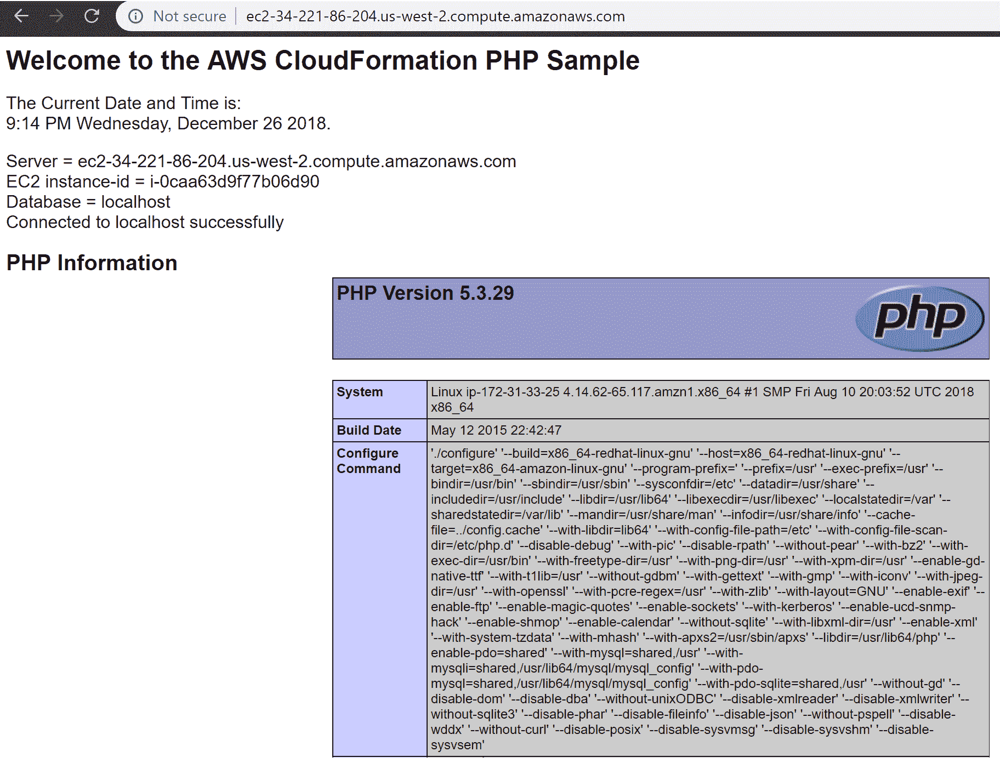

# 第十九章：针对其他服务

AWS 提供了各种各样的服务，并且不断更新这些服务，同时发布新的服务。这本书不可能覆盖所有这些服务，但本章旨在介绍一些不太主流的服务以及它们如何被滥用以使我们作为攻击者受益。

需要注意的是，每个 AWS 服务都有可能存在某种利用方式，当将其视为攻击者时，这本书没有涵盖的服务并不意味着您不应该调查它。每项服务都可能出现各种安全问题，因此最好的做法是查看服务并确定它在现实世界中的使用方式，然后寻找常见的错误、不安全的默认设置或者只是为了使自己受益而遵循的不良实践。

本章将介绍的四种不同服务包括 Route 53，一个可扩展的 DNS/域管理服务；**简单邮件服务**（**SES**），一个托管的电子邮件服务；CloudFormation，一个基础设施即代码服务；以及**弹性容器注册表**（**ECR**），一个托管的 Docker 容器注册表。

在本章中，我们将涵盖以下主题：

+   Route 53

+   SES

+   CloudFormation

+   ECR

# Route 53

Route 53 是一个很好的服务，有几个不同的原因值得花时间研究。主要原因是侦察，因为它允许我们关联 IP 和主机名，并发现域和子域，这就是我们要在这里介绍的内容。它也是一项非常有成效的服务，用于一些更恶意的攻击，我们不会深入讨论，因为它们对于我们作为渗透测试人员来说没有用处，但我们会在最后介绍它们，以让您意识到一旦获得访问权限，真正的恶意黑客可能会尝试做些什么。

# 托管区域

我们首先要做的是获取 Route 53 中托管区域的列表。我们可以使用以下 AWS CLI 命令收集这些信息（我们可以在 Route 53 中省略`--region`参数）：

[PRE0]

输出应该看起来像这样：

[PRE1]

因此，我们发现了一个公共托管区域（我们可以看到`"PrivateZone"`设置为`false`），并且在其中创建了五个记录集（因为`"ResourceRecordSetCount"`为`5`）。接下来，我们可以使用`ListResourceRecordSets`命令来查看为`"test.com"`托管区域设置了哪些记录：

[PRE2]

响应可能会相当长，取决于有多少记录集。它应该包括一个`"ResourceRecordSets"`列表，其中包括名称、类型、**生存时间**（**TTL**）和资源记录列表。这些记录可以是任何类型的 DNS 记录，例如 A 记录、**规范名称**（**CNAME**）记录和**邮件交换器**（MX）记录。这些记录集列表可以与来自 EC2 之类的已知 IP 地址进行比较，以便您可以发现与您可以访问的某些服务器相关的主机名，甚至发现未知的 IP、域和子域。

这很有用，因为许多 Web 服务器在直接访问服务器的 IP 地址时无法正确加载，因为它需要主机名，我们可以使用 Route 53 来找出并正确解析。

这在查看 Route 53 中的私有托管区域时也很有用，可以帮助您发现内部网络中可用的主机和 IP，一旦获得访问权限。

Route 53 中可能发生许多恶意攻击，因此重要的是对这项服务的访问进行严格限制。这些类型的攻击可能不会在渗透测试中使用，但对于你和你的客户的安全来说，了解这些攻击是很重要的。最简单的攻击可能就是改变与 A 记录相关的 IP 地址，这样任何访问该域的用户（例如`test.com`）都会被重定向到你自己的攻击者 IP 地址，然后你可以尝试网络钓鱼或其他各种攻击。相同的攻击也可以适用于 CNAME 记录，只需将你目标的子域指向你自己的攻击者托管的网站。当你控制一个网站的 DNS 记录时，可能有无穷无尽的可能性，但要小心不要搞砸并对你正在测试的 AWS 环境造成严重问题。

# 域名

Route 53 支持注册各种顶级域的新域名。作为攻击者，你理论上可以使用目标 AWS 账户注册一个新域名，然后将该域名转移到另一个提供商进行管理，在那里你可以为任何你想要的东西创建一个一次性网站。这可能永远不会在渗透测试期间执行，只会用于恶意目的。

# 解析器

Route 53 DNS 解析器可用于在使用中的不同网络和 VPC 之间路由 DNS 查询。作为攻击者，这可能为我们提供有关未在 AWS 中托管的其他网络或可能在 VPC 内的服务的见解，但通常对这些服务的实际攻击只会用于恶意目的，而不是我们作为渗透测试人员所希望的。

# 简单电子邮件服务（SES）

SES 是一个小巧但实用的服务，允许管理从你拥有的域和电子邮件账户发送和接收电子邮件，但作为拥有 SES 访问权限的攻击者，我们可以利用这项服务进行信息收集和社会工程。根据你受损用户对 SES 的访问权限以及已注册的不同验证域/电子邮件账户的相关设置，它可以允许对我们目标公司的员工和客户进行一些严重的网络钓鱼和社会工程。

# 网络钓鱼

我们将假设我们受损的账户对 SES 拥有完全访问权限，以便我们可以进行所有攻击，但根据你在现实场景中发现的访问权限的类型，可能需要进行调整。我们首先要做的是查找已验证的域和/或电子邮件地址。这些可能被隔离到单个区域或在几个不同的区域之间分开，因此在运行这些 API 调用时检查每个区域是很重要的。我们可以通过运行以下 AWS CLI 命令来发现这些已验证的域/电子邮件地址，以获取`us-west-2`区域的信息：

[PRE3]

输出将包含已添加到该区域的域和电子邮件地址，无论它们的状态如何。域/电子邮件地址的状态表示它是否已验证、待验证、验证失败等等，域/电子邮件地址必须在可以与 SES 提供的其他功能一起使用之前进行验证。这是为了确认设置它的人拥有他们正在注册的东西。该命令的输出应该类似于以下内容：

[PRE4]

如果通过 SES 设置和验证了电子邮件地址，那么它就可以单独用于发送/接收电子邮件，但是如果设置和验证了整个域，那么该域的任何子域中的任何电子邮件地址都可以使用。这意味着如果`test.com`被设置和验证，可以从`admin@test.com`、`admin@subdomain.test.com`、`test@test.com`或任何其他变体发送电子邮件。这是攻击者喜欢看到的，因为我们可以根据需要定制我们的网络钓鱼攻击。这些信息可能很有帮助，因为我们可能能够发现以前不知道的电子邮件/域，从而更容易制定看起来真实的网络钓鱼攻击。

接下来，一旦我们找到了已验证的域名和/或电子邮件地址，我们将希望确保在同一区域中启用了电子邮件发送。我们可以使用以下 AWS CLI 命令检查：

[PRE5]

这应该返回`True`或`False`，取决于`us-west-2`区域是否启用了电子邮件发送。如果发送被禁用，没有其他已验证域名/电子邮件帐户的区域，并且我们具有`"ses:UpdateAccountSendingEnabled"`权限，我们可以使用该权限重新启用发送，以便执行我们的网络钓鱼攻击。以下命令将实现这一点：

[PRE6]

但是，在他人的环境中运行此命令时要小心，因为可能出于非常特定的原因禁用了发送，再次启用可能会导致未知问题。如果此命令成功，AWS CLI 不会做出任何响应；否则，您将看到一个解释问题的错误。

接下来，我们需要确认该区域中的域名/电子邮件地址是否已验证，可以使用以下命令完成：

[PRE7]

我们应该收到一个响应，指示`"admin@example.com"`和`"test.com"`是否已验证。输出应该如下所示：

[PRE8]

正如我们所看到的，`"test.com"`仍在等待验证，因此我们不能用它发送电子邮件，但`admin@example.com`已成功验证。

因此，我们已经找到了在启用发送的区域中成功验证的身份；现在我们需要检查其身份策略。我们可以使用以下命令完成：

[PRE9]

如果返回一个空的策略名称列表，那么这意味着没有策略应用于此身份，这对我们来说是个好消息，因为对于此身份的使用没有限制。如果应用了策略，其名称将显示在响应中，这意味着我们需要跟进使用`GetIdentityPolicies`命令：

[PRE10]

这应该返回一个 JSON 文档，指定了我们指定的身份(`admin@example.com`)可以做什么。就像我们过去看到的那样，这个 JSON 策略将作为一个转义字符串返回给我们，放在另一个 JSON 对象中。该策略应该看起来像这样（将其从转义字符串转换为真正的 JSON 对象以便更容易查看）：

[PRE11]

这向我们表明，具有`"arn:aws:iam::000000000000:user/ExampleAdmin"` ARN 的 IAM 用户是唯一可以使用`admin@example.com`发送电子邮件的实体。这是一个我们需要通过修改此策略来提升我们权限的情况的示例，因为即使我们具有`"ses:SendEmail"`权限，该策略也阻止我们使用它（因为我们假设我们不是`ExampleAdmin` IAM 用户）。

为了实现这一点，我们需要修改该策略，将我们自己的用户添加为受信任的主体。为了添加我们自己，我们只需要将 Principal | AWS 的值更改为一个数组，然后将我们自己的用户的 ARN 添加为受信任的主体。这样做之后，策略应该如下所示：

[PRE12]

在此策略中，我们已授予`"CompromisedUser"`IAM 用户访问权限，我们假设这是我们在渗透测试中受到影响的用户。另一个选择是允许访问您自己的 AWS 帐户，因为 SES 身份策略支持跨帐户发送电子邮件，因此在添加您其他帐户的 ARN 后，您甚至不需要目标帐户的凭据。

我们可以使用 SES `PutIdentityPolicy` API 更新此策略。

[PRE13]

`ses-policy-document.json`文件包括我们之前添加的受损用户信任的 JSON。如果更新成功，将不会有任何输出；否则，错误将解释发生了什么。

如果成功，那么我们基本上通过将自己添加为受信任的实体来提升了我们的 SES 身份权限。现在策略允许我们发送电子邮件，并且我们有`ses:SendEmail`权限，我们几乎准备好进行钓鱼了。

我们需要考虑的最后一件事是当前帐户是否仍在 SES 沙箱中。目前还没有一个很好的方法可以在 AWS CLI 中确定这一点，而不是尝试发送电子邮件，但如果您有 AWS Web 控制台访问权限，那么您将能够找到这些信息。SES 沙箱限制发送电子邮件到您已验证的电子邮件帐户/域之外的任何电子邮件帐户/域。通常，您只能从 SES 中的已验证电子邮件帐户/域发送电子邮件，但如果您的帐户仍在 SES 沙箱中，那么您只能从已验证的电子邮件帐户/域发送电子邮件，并且只能发送到已验证的电子邮件帐户/域。这意味着，在我们的演示帐户中，如果它仍然在 SES 沙箱中，我们只能从`admin@example.com`发送电子邮件到`admin@example.com`。必须手动请求解除此限制，因此如果您遇到正在使用 SES 的帐户，很可能会发现他们已经出于自己的业务需求而脱离了 SES 沙箱。

如果您发现一个仍然在 SES 沙箱中但已经验证了域身份的帐户，这意味着您仍然可以从该域的任何电子邮件帐户发送电子邮件到该域的任何电子邮件帐户，这意味着您可能仍然可以滥用这种访问权限来对员工进行内部钓鱼攻击。

如果您使用受损的帐户访问 AWS Web 控制台，可以通过访问 SES 控制台的发送统计页面来检查沙箱访问权限。您需要检查您发现已验证身份的每个区域，以防一个区域仍然在沙箱中，而另一个区域不在。如果帐户仍然在沙箱中，您将在以下截图中看到以下消息：

此截图中的 AWS 帐户仍受限于 us-west-2 的沙箱

当您准备开始发送钓鱼邮件时，值得查看目标可能在其 SES 配置中保存的任何电子邮件模板。这可以让您了解此电子邮件帐户通常在发送电子邮件时使用的格式，以及通常发送的内容类型。您并不总是会在 SES 中找到保存的模板，但当您找到时，它们可能非常有用。我们可以使用`ListTemplates` API 查找任何现有模板：

[PRE14]

然后我们可以使用`GetTemplate` API 来查看内容：

[PRE15]

然后，我们可以围绕一个看起来有希望的模板构建我们的钓鱼邮件。

当所有这些都说完了，我们最终可以使用 SES `SendEmail` API 发送我们的网络钓鱼邮件。有关设置 CLI 发送电子邮件的更多信息，请参阅 SES 文档中的指南：[`docs.aws.amazon.com/cli/latest/reference/ses/send-email.html`](https://docs.aws.amazon.com/cli/latest/reference/ses/send-email.html)。现在，我们已经成功从合法域名发送了网络钓鱼邮件，使用了合法的模板，几乎可以肯定地欺骗一些最终用户/员工透露敏感信息。

# 其他攻击

即使我们无法使用 SES `SendEmail` API，或者我们不想吸引防御者的注意，如果他们使用电子邮件模板，我们仍然可以滥用 SES 进行网络钓鱼。我们可以使用 SES `UpdateTemplate` API 来更新 SES 中已创建的电子邮件模板的文本/HTML。作为攻击者，我们可以利用这一点基本上建立后门网络钓鱼电子邮件。假设 Example Co.使用 SES 模板发送营销电子邮件。作为攻击者，我们可以进入并修改特定模板，插入恶意链接和内容。然后，每当`Example Co.`发送他们的营销电子邮件时，我们的恶意链接和内容将被包含在内，大大增加我们的攻击成功的几率。

可以执行的另一个攻击是设置一个收据规则，确定对已验证的电子邮件/域名的传入电子邮件的处理方式。通过使用 SES `CreateReceiptRule` API，我们可以设置一个收据规则，将所有传入的消息发送到我们攻击者帐户中的自己的 S3 存储桶，然后我们可以读取敏感内容，或者使用收据规则支持的其他选项，如触发 Lambda 函数。

# 攻击所有 CloudFormation

CloudFormation 是一个非常有用的服务，最近已经成熟了很多。它基本上让你编写代码，然后将其转换为 AWS 资源，使您可以轻松地启动和关闭资源，并从一个中央位置跟踪这些资源。CloudFormation 似乎遇到了一些常规源代码的问题，包括硬编码的秘密，过度宽松的部署等，我们将在这里进行介绍。

在渗透测试 CloudFormation 时有很多要注意的事情。以下列表是我们将在本节中涵盖的内容：

+   堆栈参数

+   堆栈输出值

+   堆栈终止保护

+   已删除的堆栈

+   堆栈导出

+   堆栈模板

+   传递的角色

对于这一部分，我们已经启动了一个简单的 LAMP 堆栈，基于简单的 LAMP 堆栈 CloudFormation 示例模板，但进行了一些修改。

我们要做的第一件事是使用 CloudFormation `DescribeStacks` API 来收集每个区域的堆栈信息。同样，这些 API 是按区域划分的，因此可能需要在每个区域运行它们，以确保发现所有的堆栈。我们可以通过运行以下 AWS CLI 命令来实现这一点：

[PRE16]

这个命令的好处是它将为每个堆栈返回我们想要查看的多个内容。

# 参数

我们将要检查的第一条有趣信息是存储在`"Parameters"`下的内容。可用参数在堆栈模板中定义，然后在使用该模板创建新堆栈时传递值。这些参数的名称和值与关联的堆栈一起存储，并显示在`"Parameters"`键下的 DescribeStacks API 调用响应中。

我们希望找到一些敏感信息被传递到参数中，然后我们可以使用它来进一步访问环境。如果遵循最佳实践，那么理想情况下我们不应该能够在堆栈的参数值中找到任何敏感信息，但我们发现最佳实践并不总是被遵循，某些敏感值偶尔会被漏掉。最佳实践是在定义 CloudFormation 模板中的参数时使用`NoEcho`属性，这可以防止传递给该参数的值被回显给运行`DescribeStacks` API 调用的任何人。如果使用`NoEcho`并将其设置为`true`，那么在描述堆栈时该参数仍将显示在`Parameters`下，但其值将被用几个``"*"``字符进行屏蔽。

对于我们为此演示创建的堆栈，返回以下参数：

[PRE17]

从这些信息中我们可以得出一些不同的东西。一些基本的信息收集让我们看到有一个名为``"MySSHKey"``的 SSH 密钥正在使用，允许从``"0.0.0.0/0"``进行 SSH 访问，有一个名为``"CustomerDatabase"``的数据库，以及一个``"t2.small"``类型的 EC2 实例。除此之外，我们还看到一些数据库密码和数据库用户名。

我们可以看到``DBUser``的值为``"****"``，这很可能意味着`DBUser`参数已经将``"NoEcho"``设置为`true`，因此在尝试从中读取时其值将被屏蔽。`DBUser`的值也可能是``"****"``，但可以通过查看堆栈的模板来轻松确认这一点，我们可以在那里审查为`DBUser`参数设置的约束和属性。

由于``"DBPassword"``和``"DBRootPassword"``下的`明文`值，我们知道设计这个 CloudFormation 模板的人犯了一些错误。他们忘记为这两个参数设置``"NoEcho"``，因此每当有人描述当前堆栈时，`明文`密码都会被返回。这对我们攻击者来说是好事，因为现在我们有了常规数据库用户和数据库根用户的`明文`密码。我们可以再次分析模板，找出这个数据库可能在哪里或者我们如何访问它，但我们稍后会到达那里。

除了`明文`密码之外，我们还看到``"SSHLocation"``被设置为``0.0.0.0/0``，我们可以假设这意味着某个服务器被设置为允许来自该 IP 范围的 SSH 访问，这意味着任何人都可以访问 SSH 服务器，因为`0.0.0.0/0`代表所有存在的 IPv4 地址。这对我们来说也是有用的信息，因为也许我们将能够利用服务器上过时的 SSH 软件来获取访问权限或类似的东西。

# 输出值

接下来，我们将要检查在之前描述 CloudFormation 堆栈时在``Outputs``下的值。我们正在查看与``"Parameters"``中基本相同的东西，但这些值是在堆栈创建过程中生成的。同样，我们要寻找敏感信息。对于某些堆栈可能没有输出值，因此如果遇到这种情况，我们在演示的这部分中就没有什么可看的了。在我们的演示中，当我们描述它时，这是显示在堆栈的`Outputs`部分下的内容：

[PRE18]

正如我们所看到的，这里没有太敏感的东西，但它确实给了我们一个 EC2 实例的公共端点，很可能是在创建堆栈时创建的。鉴于``"SSHLocation"``参数被设置为`0.0.0.0/0`，我们很可能会在这台服务器上找到一个开放的 SSH 端口（`22`）。我们可以使用`nmap`运行服务扫描（`-sV`）来验证这一点：

22 端口被发现是开放的，并且运行着 OpenSSH 版本 7.4

我们已经验证了服务器上有一个开放的 SSH 端口，就像我们预期的那样。仅通过查看 CloudFormation 堆栈的输出值，我们就能够识别出这个 EC2 实例的公共端点，该端点的端口`22`是“开放”的，运行着一个 SSH 服务器。

输出值可能包含敏感信息，例如凭据或 API 密钥。例如，当模板需要为新的 IAM 用户创建一组访问密钥时，这可能会发生。然后，这些访问密钥可能会显示在堆栈的输出值中，因为在创建堆栈后，用户需要某种方式来访问它们（https://docs.aws.amazon.com/AWSCloudFormation/latest/UserGuide/quickref-iam.html#scenario-iam-accesskey）。这些密钥可能会使我们能够进一步访问环境，以期提升我们已有的权限。

# 奖励-发现 NoEcho 参数的值

正如我们之前讨论的那样，使用参数上的`NoEcho`属性可以防止在使用 DescribeStacks API 时显示其值，以便敏感值不会暴露给可以调用该 API 的任何用户。有时（大多数情况下），具有`NoEcho`属性设置为`true`的值对我们作为攻击者可能是有用的，因为通常它们可能是密码或 API 密钥。但并非一无所获，因为在拥有适当权限的情况下，您可以揭示用于部署账户中存在的 CloudFormation 堆栈的那些参数的值。

为此，您至少需要具有`cloudformation:UpdateStack`权限。如果我们想要从先前提到的演示堆栈中揭示`NoEcho`参数`DBUser`，我们首先需要使用`GetTemplate`API 命令下载该堆栈的模板。如果我们没有`GetTemplate`权限，我们可以创建自己的模板，但这实际上会删除堆栈创建的每个资源，而我们没有包含在自定义模板中，因此我们不会涉及到这一点。

将模板保存到当前目录中的`template.json`中，然后就像前一节一样，创建包含以下数据的`params.json`：

[PRE19]

这样我们就可以更新堆栈的模板，而不修改已传递的参数的值，包括`"DBUser"`。

然后，需要做的就是删除`DBUser`参数上的`"NoEcho"`属性，或将其设置为`false`。此时，如果我们尝试更新堆栈，我们可能会收到以下消息：

[PRE20]

这是因为 CloudFormation 没有识别`"NoEcho"`参数对`DBUser`的删除/更改。最简单的方法就是在模板的某个地方更改一些字符串。确保不会引起任何问题，比如在某些代码的注释中添加一个空格之类的。确保不要将其插入到某些配置中，这样在重新部署资源时不会引起任何问题。然后，我们可以运行与之前相同的命令来使用这个新模板更新堆栈：

[PRE21]

现在，一旦堆栈更新完成，我们应该能够再次描述堆栈，并且可以访问之前在创建堆栈时输入的未经审查的值：

[PRE22]

从运行 DescribeStacks 的部分输出中可以看出，`"DBUser"`的值已经被解除掩码，并且显示它被设置为`"admin"`的值。我们做到了所有这些，并且在不对环境造成任何干扰的情况下发现了秘密值，所以这对我们来说是双赢的。

# 终止保护

终止保护是一种可以启用的设置，它阻止 CloudFormation 堆栈被删除。要删除启用了终止保护的堆栈，您首先需要禁用它，然后尝试删除堆栈，这需要一组不同的权限，您可能没有这些权限。通常最好在 CloudFormation 堆栈上启用终止保护，因此，尽管它不会直接影响我们作为攻击者（除非我们试图删除所有内容），但检查每个堆栈的终止保护并将其作为环境中的潜在错误配置是很好的做法。要检查此值，我们仍然使用`DescribeStacks` API，但它要求我们在 API 调用中明确命名堆栈。我们的演示堆栈名为`Test-Lamp-Stack`，因此要确定该堆栈的终止保护设置，我们可以运行以下 AWS CLI 命令：

[PRE23]

结果应该与我们之前看到的类似，但它们将包括`EnableTerminationProtection`键，该键设置为`true`或`false`，指定了是否启用了终止保护。

# 删除的堆栈

CloudFormation 还允许您检查已删除的堆栈，但在 CLI 上的过程有点不同。从 AWS Web 控制台 CloudFormation 堆栈页面，有一个下拉框，允许您显示所有已删除的堆栈，就像下面的截图所示：

在 AWS Web 控制台上列出已删除的 CloudFormation 堆栈

从 CLI，我们首先需要运行 CloudFormation `ListStacks`命令，使用 AWS CLI 看起来像这样：

[PRE24]

该命令将提供与`DescribeStacks`命令类似的输出，但它不太冗长。`ListStacks`命令还包括已删除的 CloudFormation 堆栈，可以通过查看特定堆栈的 StackStatus 键来识别，其中值将为`DELETE_COMPLETE`。

要获取有关已删除堆栈的更多详细信息，我们必须明确地将它们传递到`DescribeStacks`命令中。与活动堆栈不同，已删除的堆栈不能通过它们的名称引用，只能通过它们的唯一堆栈 ID 引用。唯一的堆栈 ID 只是`ListStacks`输出中`"StackId"`键下的值。它将是一个类似于这样格式的 ARN：

[PRE25]

然后我们可以运行`DescribeStacks`命令，并将该值传递给`--stack-name`参数，就像这样：

[PRE26]

该命令的输出应该看起来很熟悉，我们现在可以查看与已删除堆栈相关联的参数值和输出值。检查已删除的堆栈是否包含秘密信息非常重要，其中一个原因是，删除堆栈的原因可能是开发人员犯了错误，意外地暴露了敏感信息或类似情况。

# 导出

CloudFormation 导出允许您在不必担心引用其他堆栈的情况下共享输出值。任何导出的值也将存储在导出它的堆栈的`"outputs"`下，因此，如果您查看每个活动和已删除堆栈的输出值，您已经查看了导出。查看聚合导出列表可能会有所帮助，以查看每个堆栈可用的信息类型。这可能会更容易了解目标环境和/或 CloudFormation 堆栈的用例。要检索这些数据，我们可以使用 AWS CLI 的`ListExports`命令：

[PRE27]

输出将告诉您每个导出的名称和值以及导出它的堆栈。

# 模板

现在我们想查看用于创建我们看到的 CloudFormation 堆栈的实际模板。我们可以使用 CloudFormation `GetTemplate`命令来实现这一点。此命令的工作方式类似于`DescribeStacks`命令，我们可以将模板名称传递给`--stack-name`参数，以检索该特定堆栈的模板。如果要检索已删除堆栈的模板，也需要指定唯一的堆栈 ID 而不是名称。要获取我们的演示堆栈的模板，我们可以运行以下 AWS CLI 命令：

[PRE28]

响应应包括用于创建我们命名的堆栈的 JSON/YAML 模板。

现在我们可以做一些事情，但手动检查模板是最有效的。在开始手动检查之前，对模板本身运行安全扫描可能是有用的，以尝试发现其中指定的资产中的任何安全风险。为此创建的一些工具旨在在**持续集成**（**CI**）/ **持续部署**（**CD**）环境中设置和使用，例如 Skyscanner 的`"cfripper"`（[`github.com/Skyscanner/cfripper/`](https://github.com/Skyscanner/cfripper/)）。在此示例中，我们将使用 Stelligent 的`"cfn_nag"`（[`github.com/stelligent/cfn_nag`](https://github.com/stelligent/cfn_nag)），它也可以针对包含 CloudFormation 模板的单个文件/目录运行。这些工具通常不会捕捉所有内容，但它们可以帮助识别某些不安全的配置。

要使用`cfn_nag`（在撰写本文时，这可能会随着工具的更新而改变），我们将假设已安装 Ruby 2.2.x，因此我们可以使用以下命令安装`cfn_nag` gem：

[PRE29]

然后，我们可以将从 AWS API 检索到的模板保存到文件中，例如`template.json`或`template.yaml`，具体取决于您的模板类型。对于我们的演示，我们将其保存到`template.json`，因此我们可以运行以下命令来扫描模板：

[PRE30]

输出应该看起来像这样：

使用 cfn_nag 扫描我们的 CloudFormation 模板的结果

输出显示，我们扫描的模板输出了`1`个失败和`2`个警告。所有三个都与`"WebServerSecurityGroup"`及其入站/出站规则集相关联。两个警告是关于允许通过该安全组的入站规则过于宽松，但如果该安全组还定义了 SSH 入站规则，那么这两个警告出现是有道理的。这是因为我们知道允许从`0.0.0.0/0`范围访问 SSH 入站，这不是`/32` IP 范围，这意味着允许世界访问。即使有了这些信息，手动检查仍然是值得的。

`cfn_nag`报告的失败可能在找到一种妥协 EC2 实例的方法之前是无关紧要的，然后我们将开始关心设置了什么出站访问规则。鉴于`cfn_nag`没有指定规则，这意味着允许所有出站互联网访问，我们不需要担心。

扫描模板后，很可能是时候进行手动检查了。手动检查将为我们提供有关模板设置的资源的大量信息，可能会发现存储在其中的其他敏感信息。在我们喜爱的文本编辑器中打开模板后，我们可以考虑一些事情。我们应该再次检查参数，看看是否有任何硬编码的敏感默认值，但也因为我们可能可以得到有关该参数的确切描述。

正如我们之前预期的那样，查看`"SSHLocation"`参数，我们可以看到有一个描述，说明可以用于 SSH 到 EC2 实例的 IP 地址范围。我们之前的猜测是正确的，但这是确认这类事情的好方法。`"Default"`键包含`"0.0.0.0/0"`值，这意味着我们一直在查看的堆栈正在使用`"SSHLocation"`参数的默认值。也许我们可以在某些情况下在模板中找到默认密码或 IP 地址的硬编码。

接下来，我们将要检查此模板中定义的资源。在这里，有各种可能遇到的事情。其中一个例子是为创建的 EC2 实例启动脚本。我们可以阅读这些内容，寻找任何敏感信息，同时了解这个堆栈部署的环境的设置/架构。

我们用于堆栈的模板有一些设置脚本，似乎是设置了一个 MySQL 数据库和一个 PHP Web 服务器。理想情况下，我们可以访问其中一个或两个，因此我们可以滚动到之前`cfn_nag`标记的`"WebServerSecurityGroup"`，我们看到以下内容：

[PRE31]

这告诉我们 Web 服务器安全组允许从任何 IP 地址（`0.0.0.0/0`）对端口`80`进行入站访问，并允许从`"SSHLocation"`参数对端口`22`进行入站访问，我们知道`"SSHLocation"`参数也设置为`0.0.0.0/0`。现在我们可以回到之前检查这个堆栈的输出值，再次获取服务器的主机名，现在我们知道端口`80`是开放的。如果我们在浏览器中导航到该 URL（[`ec2-34-221-86-204.us-west-2.compute.amazonaws.com/`](http://ec2-34-221-86-204.us-west-2.compute.amazonaws.com/)），我们将看到以下页面：

由 CloudFormation 堆栈部署的 EC2 实例上托管的 Web 服务器

除了我们刚刚做的事情之外，CloudFormation 模板可以被检查以确定堆栈部署的各种资源的设置，这可以帮助我们识别资源、错误配置、硬编码的秘密等，而无需具有授予对这些实际资源访问权限的 AWS 权限。

# 通过的角色

创建 CloudFormation 堆栈时，有一个选项可以为其传递 IAM 角色进行部署过程。如果传递了角色，则将使用该角色创建堆栈，但如果没有传递角色，则 CloudFormation 将只使用当前用户的权限来部署堆栈。这打开了通过已经在创建时传递了角色的堆栈进行权限提升的可能性。

假设我们被入侵的用户具有`"cloudformation:*"`权限，但没有`"iam:PassRole"`权限。这意味着我们无法通过创建一个新的堆栈并传递给它比我们拥有的更高权限的角色来提升我们的权限（因为这需要`"iam:PassRole"`权限），但这意味着我们可以修改现有的堆栈。

要确定是否有 CloudFormation 堆栈已经传递了角色，我们可以回到`DescribeStacks`命令的输出。如果一个堆栈具有`"RoleARN"`键，并且其值是 IAM 角色的 ARN，则该堆栈已经传递了一个角色。如果该键没有显示，则在创建时该堆栈没有传递角色。我们创建的演示堆栈已经传递了一个角色。

现在，如果我们有必要的 IAM 权限，我们可以使用 IAM API 来确定传递给该堆栈的角色具有哪些权限，但如果没有，我们可以根据一些不同的事情进行推断。首先，角色的名称可能是一个小提示，比如如果它包括`"EC2FullAccessForCloudFormation"`，那么可以安全地假设该角色对 EC2 具有完全访问权限。更可靠但不一定完整的权限集可以根据堆栈部署的资源进行推断。如果某个堆栈部署了一个 EC2 实例，为其创建了安全组，创建了一个 S3 存储桶，并设置了一个 RDS 数据库，那么可以安全地假设该角色有权执行所有这些操作。在我们的情况下，这比`"cloudformation:*"`更多地访问了 AWS API，因此我们可以滥用该堆栈来进一步访问环境。

有几种方法可以检查，包括仅查看我们之前查看的原始 CloudFormation 模板，或者我们可以使用`DescribeStackResources`命令列出该堆栈创建的资源，然后从那里进行我们的访问假设。这可以通过从 AWS CLI 运行以下命令来完成：

[PRE32]

我们的演示堆栈的输出如下：

[PRE33]

我们可以看到这里创建了一个 EC2 实例和一个 EC2 安全组，因此我们可以假设附加到该堆栈的角色至少具有执行这两项操作的权限。然后，为了利用这些权限并提升我们自己的权限，我们可以使用`UpdateStack`命令。这允许我们更新/更改与我们正在定位的堆栈相关联的模板，从而允许我们添加/删除资源到列表中。为了在环境中造成较小的干扰，我们可以从堆栈中提取现有模板，然后只向其中添加资源，以尽可能少地造成干扰。这是因为未更改的现有资源将不会被修改，因此我们不会造成拒绝服务。

在这一点上，下一步取决于情况。如果发现某个堆栈具有 IAM 权限，可以向模板添加一些 IAM 资源，以允许您提升访问权限，或者如果发现某个堆栈具有 EC2 权限，就像我们在这里所做的那样，可以添加一堆带有您自己 SSH 密钥的 EC2 实例。如果我们继续向我们的演示堆栈添加一些 EC2 实例，可能会获得对它们用于这些资源的 VPC 内部的访问权限，然后可能会进一步授予我们对环境的更高特权访问。

执行此攻击的示例命令可能如下所示：

[PRE34]

`template.json`文件将包括您更新的 CloudFormation 模板，`params.json`将包括一些指示堆栈使用所有已提供的参数而不是新参数的内容：

[PRE35]

现在，堆栈将更新并创建您的新资源，您将成功地使用传递的角色权限在 AWS 中执行 API 操作，有效地提升了自己的权限。

# 弹性容器注册表（ECR）

ECR 被描述为一个完全托管的 Docker 容器注册表，使开发人员可以轻松存储、管理和部署 Docker 容器映像（[`aws.amazon.com/ecr/`](https://aws.amazon.com/ecr/)）。它使用的权限模型可以允许一些令人讨厌的错误配置，如果存储库没有正确设置，主要是因为按设计，ECR 存储库可以被设置为公共或与其他帐户共享。这意味着，即使我们只有少量访问权限，错误配置的存储库也可能根据其托管的 Docker 映像中存储的内容，向我们授予对环境的大量访问权限。

如果我们正在针对另一个账户中的公共仓库，那么我们需要的主要信息是仓库所在的账户 ID。有几种获取它的方法。如果您拥有您正在针对的账户的凭据，最简单的方法是使用**Simple Token Service**（**STS**）`GetCallerIdentity` API，它将为您提供一些包括您的账户 ID 在内的信息。该命令将如下所示：

[PRE36]

这种方法的问题在于它被记录到了 CloudTrail 中，并清楚地显示您正在尝试收集有关您的用户/您所在账户的信息，这可能会引起防御者的警觉。还有其他方法，特别是基于 Rhino Security Labs 的研究，他们发布了一个脚本来枚举有关当前账户的少量信息，而不会触及 CloudTrail。这是通过某些服务披露的冗长错误消息来完成的，而这些服务尚不受 CloudTrail 支持，因此没有记录 API 调用的记录，但用户收集了一些信息，包括账户 ID（[`rhinosecuritylabs.com/aws/aws-iam-enumeration-2-0-bypassing-cloudtrail-logging/`](https://rhinosecuritylabs.com/aws/aws-iam-enumeration-2-0-bypassing-cloudtrail-logging/)）。

如果您正在针对您已经入侵并使用这些凭据进行这些 API 调用的账户中的仓库，则账户 ID 将无关紧要，因为在大多数情况下它将自动默认为当前账户。我们首先要做的是列出账户中的仓库。这可以通过以下命令完成（如果您正在针对不同的账户，请将账户 ID 传递给`--registry-id`参数）：

[PRE37]

这应该列出当前区域中的仓库，包括它们的 ARN、注册表 ID、名称、URL 以及创建时间。我们的示例返回了以下输出：

[PRE38]

然后我们可以使用`ListImages`命令获取存储在该仓库中的所有镜像。对于我们之前找到的`example-repo`，它将看起来像这样：

[PRE39]

这个命令将给我们一个镜像列表，包括它们的摘要和镜像标签：

[PRE40]

现在我们可以（希望）将这个镜像拉到我们的本地机器并运行它，以便我们可以看到里面有什么。我们可以通过运行以下命令来完成这个操作（再次，如果需要，请在`--registry-id`参数中指定外部账户 ID）：

[PRE41]

AWS 命令返回所需的 docker 命令，以便将您登录到目标注册表，并且其中的`$()`将自动执行该命令并将您登录。运行后，您应该在控制台上看到`登录成功`的打印输出。接下来，我们可以使用 Docker 来拉取镜像，现在我们已经通过仓库进行了身份验证：

[PRE42]

现在 Docker 镜像应该被拉取，并且如果您运行`docker images`来列出 Docker 镜像，它应该是可用的。

在将其拉下来后，列出`example-repo` Docker 镜像

接下来，我们将要运行这个镜像，并在其中的 bash shell 中放置自己，这样我们就可以探索文件系统并寻找任何好东西。我们可以通过以下方式来完成这个操作：

[PRE43]

现在我们的 shell 应该从本地机器切换到 Docker 容器，作为 root 用户：

使用 Docker 运行命令进入我们正在启动的容器中的 bash shell

这是您可以使用常规渗透测试技术搜索操作系统的地方。您应该寻找诸如源代码、配置文件、日志、环境文件或任何听起来有趣的东西。

如果其中任何命令由于授权问题而失败，我们可以继续检查我们所针对的仓库相关的策略。这可以通过`GetRepositoryPolicy`命令来完成：

[PRE44]

如果尚未为存储库创建策略，则响应将是错误；否则，它将返回一个指定 AWS 主体可以针对存储库执行什么 ECR 命令的 JSON 策略文档。您可能会发现只有特定帐户或用户能够访问存储库，或者您可能会发现任何人都可以访问它（例如如果允许`"*"`主体）。

如果您有正确的对 ECR 的推送权限，另一个值得尝试的攻击是在现有图像中植入恶意软件，然后推送更新到存储库，这样任何使用该图像的人都将启动带有您的恶意软件运行的图像。根据目标在幕后使用的工作流程，如果操作正确，可能需要很长时间才能发现其图像中的此类后门。

如果您知道使用这些 Docker 图像部署的应用程序/服务，比如通过弹性容器服务（ECS），那么值得寻找您可能能够外部利用的容器内的漏洞，然后获得对这些服务器的访问权限。为了帮助解决这个问题，使用 Anchore Engine（[`github.com/anchore/anchore-engine`](https://github.com/anchore/anchore-engine)）、Clair（[`github.com/coreos/clair`](https://github.com/coreos/clair)）或其他许多在线可用工具对各种容器进行静态漏洞分析可能会很有用。这些扫描的结果可以帮助您识别可能能够利用的已知漏洞。

# 摘要

在攻击 AWS 环境时，重要的是要列出他们正在使用的 AWS 服务的明确清单，因为这可以让您更好地制定攻击计划。除此之外，重要的是要查看部署在所有这些服务上的配置和设置，以找到错误配置和滥用的功能，并希望将它们链接在一起以获得对环境的完全访问权限。

没有服务太小，不值得关注，因为如果您有与它们交互的权限，那么可能在每个 AWS 服务中都存在攻击向量。本章旨在展示一些对一些不太常见的 AWS 服务器的攻击（与 EC2、S3 等相比），并试图表明许多服务都有处理权限的策略文档，比如 SES 身份策略或 ECR 存储库策略。这些服务都可以通过错误配置的策略或通过自己更新来滥用。

在下一章中，我们将研究 CloudTrail，这是 AWS 的中央 API 日志记录服务。我们将看看如何安全地配置您的跟踪，并如何攻击它们作为渗透测试人员进行信息收集，并在试图保持低调时避免被记录。
