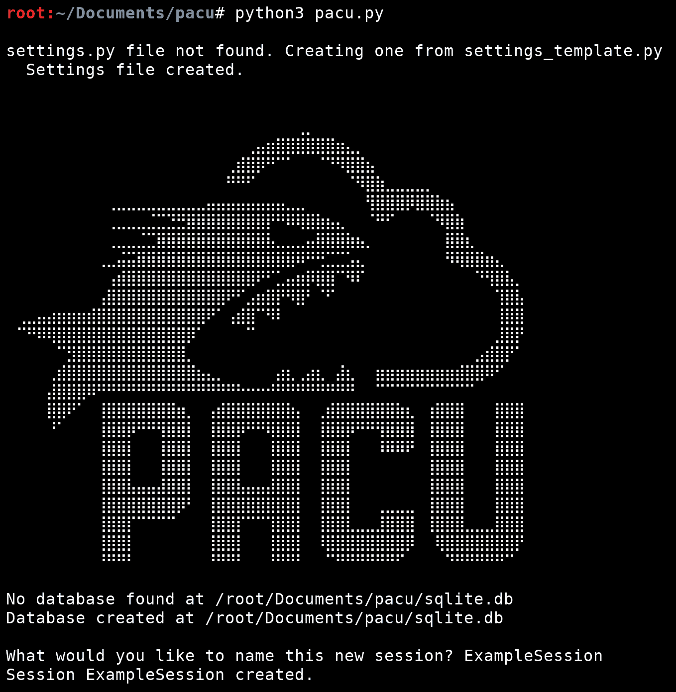
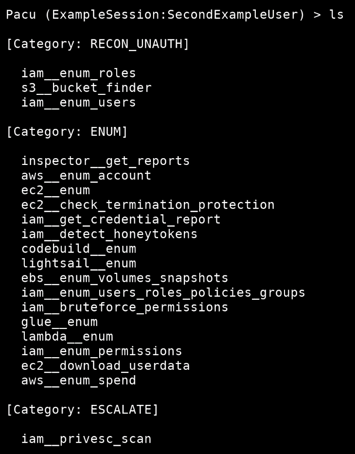
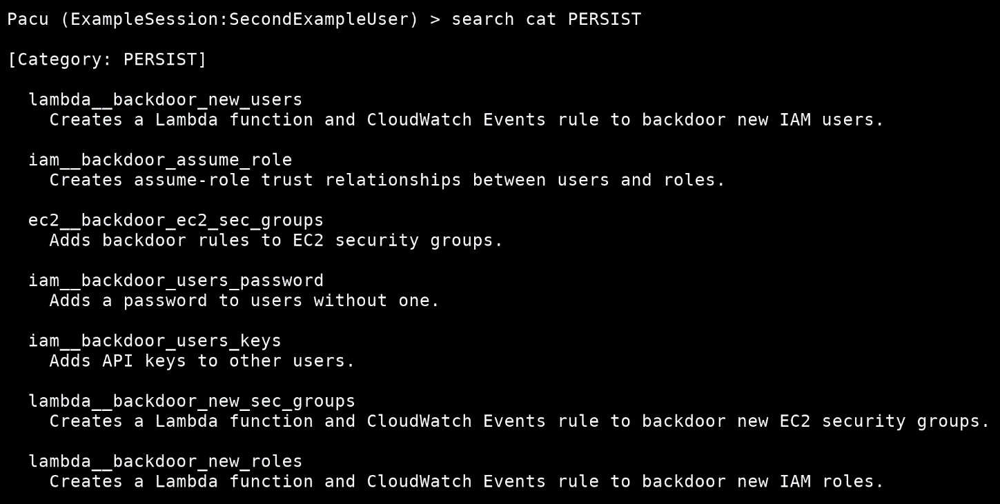
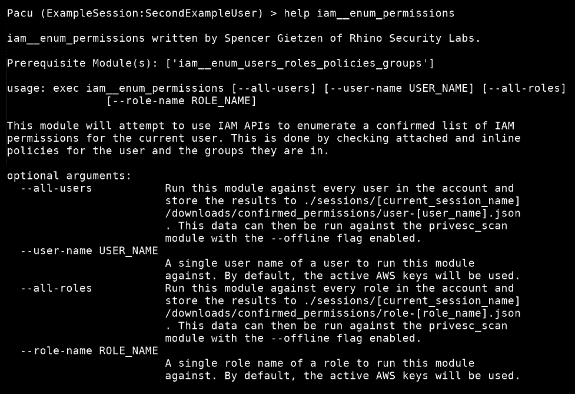
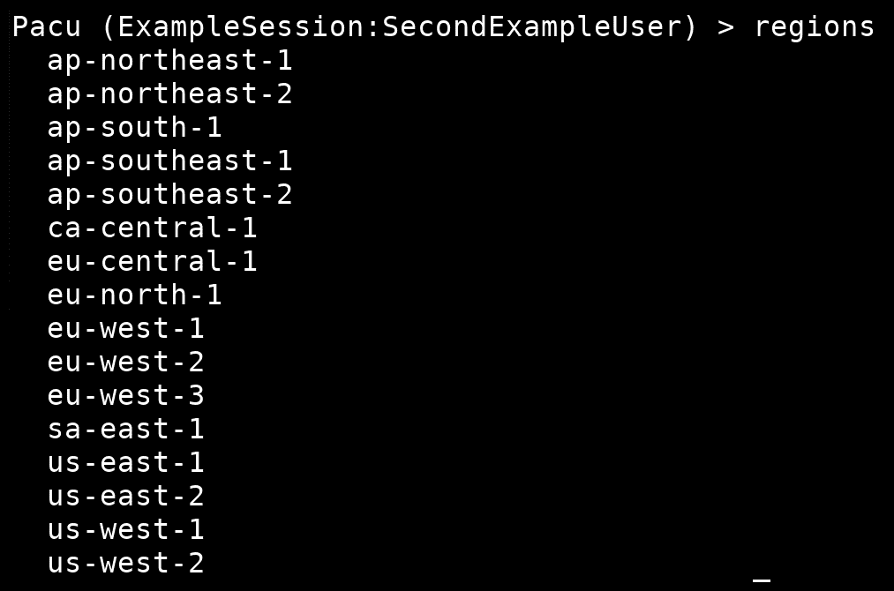

# 第二十五章：使用 Pacu 进行 AWS 渗透测试

尽管我们在本书中一直在使用 Pacu，但本章将从头开始讨论 Pacu。理想情况下，在本章结束时，您应该能够理解并能够利用 Pacu 提供的大部分功能。这意味着您将能够利用 Pacu 的一些更高级的功能，并且可以为项目贡献自己的模块和研究。

在本章中，我们将深入了解 AWS 开发工具包 Pacu，我们将了解以下几点：

+   Pacu 是什么，为什么它重要，以及如何设置它

+   Pacu 提供的命令以及我们如何利用它们使我们受益

+   我们如何可以自动化我们自己的任务并将它们添加到 Pacu 作为一个模块

+   PacuProxy 及其目的的简短介绍

对于渗透测试领域的任何事情，尽可能自动化是有帮助的。这使我们能够在不需要手动运行多个 AWS 命令行界面（CLI）命令的情况下，对环境进行攻击和枚举。这种工具可以节省时间，让我们有更多时间花在测试过程的手动方面。有时这些工具可能会复杂，需要对工具及其目标有深入的了解才能充分利用它。这就是为什么写了这一章，帮助您更好地了解 Pacu 提供了什么以及如何最好地利用这些功能。

# Pacu 历史

从最开始说起，Pacu 是一个攻击性的 AWS 开发框架，由 Rhino Security Labs 的一小群开发人员和研究人员编写。Pacu 及其模块是用 Python 3 编写的，是开源的，并在 GitHub 上以 BSD-3 许可证提供（[`github.com/RhinoSecurityLabs/pacu`](https://github.com/RhinoSecurityLabs/pacu)）。

Pacu 的最初想法源于 Rhino 渗透测试团队的研究积累。发现越来越多的客户正在使用云服务器提供商，如 AWS，并且有许多未被开发的领域似乎可以被利用。随着 Rhino 团队内的想法、攻击向量和脚本的积累，很明显需要一种框架来汇总所有这些研究，并使其易于使用。作为渗透测试人员，还决定它应该能够很好地处理项目和渗透测试，即使同时进行的是不同的项目。

在内部提案和拟议项目的原型之后，Pacu 被接受，团队开始了导致 Pacu 今天的过程。为了与 AWS 的不断发展的服务和相关攻击向量保持一致，并确保 Pacu 与之保持最新，Pacu 被开发时考虑了可扩展性。这是为了允许对项目进行简单的外部贡献，并提供一个简单的管理基础设施，处理问题并为这些问题提供简单的解决方案。

# 开始使用 Pacu

设置 Pacu 时需要的第一件事是确保已安装 Git、Python 3 和 Pip 3。完成后，您可以按照简单的三个步骤安装和运行 Pacu。从您的操作系统的 CLI（我们使用的是 Kali Linux）中运行以下命令：

[PRE0]

请注意，Pacu 不是官方支持的 Windows 操作系统。

现在 Pacu 应该启动并经过配置和数据库创建的过程。它应该首先告诉您它创建了一个新的 `settings.py` 文件，然后是一个消息，它创建了一个新的本地数据库文件。最后，它会要求您为新的 Pacu 会话命名。在这个例子中，我们将会话命名为 `ExampleSession`：

Pacu 在 Kali Linux 上首次启动

现在我们创建了新的会话；Pacu 中的`session`本质上是一种在您正在进行的不同项目之间隔离数据、活动和凭据的方式。Pacu 使用本地 SQLite 数据库来管理会话和其中的数据，并允许创建任意数量的会话。作为渗透测试人员，会话可以被视为参与或公司，因为您可以同时在两个不同的 AWS 渗透测试中工作，因此您需要两个 Pacu 会话来分隔这两个。然后，每个 Pacu 会话将保存属于该特定参与或公司的所有数据、活动和凭据。这使您可以在 Pacu 的多个不同用途中使用相同的数据，需要更少的 API 调用到 AWS API，这意味着您在日志中更隐蔽。

`SQLAlchemy` Python 库用于管理 Pacu 与数据库之间的交互，但我们稍后会详细介绍。

接下来，您应该会看到 Pacu 输出了大量的帮助信息，解释了 Pacu 具有的不同命令和功能。我们现在将跳过这一部分，稍后再回来。

之后，如果你像我们一样在运行 Kali Linux，你应该会看到类似以下的消息：

Pacu 中的内置 GuardDuty 防御

正如我们在第十六章中讨论的那样，*GuardDuty*，这条消息是因为 Pacu 检测到它正在运行在 Kali Linux 主机上。GuardDuty 可以检测到 AWS API 调用是否来自 Kali Linux 服务器，并根据此标记警报，因此 Pacu 通过修改发送到 AWS 服务器的用户代理自动解决了这个问题。因此，当我们开始攻击时，GuardDuty 不会立即警报我们。同样的检查和解决方案过程也适用于 Parrot 和 Pentoo Linux。

之后，您应该会进入 Pacu CLI，看起来像这样：

[PRE1]

这一行正在等待我们输入命令，并且它显示我们在`ExampleSession` Pacu 会话中，没有设置任何 AWS 密钥。对于 Pacu 的大部分功能，需要一组 AWS 密钥，因此我们将使用`set_keys` Pacu 命令添加一些。在运行此命令时，我们将被要求输入密钥别名、访问密钥 ID、秘密访问密钥和 AWS 凭据的会话令牌。正如我们之前在书中讨论过的那样，会话令牌字段是可选的，因为只有临时 AWS 凭据使用会话令牌。常规 IAM 用户只有访问密钥 ID 和秘密访问密钥，因此在这种情况下，您将留空会话令牌字段。密钥别名是我们可以分配给正在添加的访问密钥集的任意名称。这仅供我们（和 Pacu）参考，因此选择一个对您有意义的名称。以下截图显示了在 Pacu 数据库中运行`set_keys`命令添加我们的 AWS 访问令牌时提供的输出和输入。在我们的示例中，我们选择了`ExampleUser`，因为这是为其创建密钥的用户的用户名。

将我们的示例用户添加到 Pacu 数据库

如你所见，我们已经将密钥集命名为`ExampleUser`，然后在 Pacu CLI 提示符处替换了`No Keys Set`，这表明`ExampleUser`密钥对是我们的活动集。活动密钥集用于 Pacu 与 AWS API 进行任何身份验证。您可以使用相同的`set_keys`命令添加其他密钥集，但使用不同的密钥别名。如果在设置一对密钥时指定了现有的密钥别名，它将用您输入的内容覆盖该密钥别名下的任何现有值。

如果我们想在 Pacu 中切换密钥对，我们可以使用名为`swap_keys`的 Pacu 命令。这将允许我们从在此 Pacu 会话中设置的密钥对列表中进行选择。假设在此示例中，我们已经在 Pacu 中设置了`ExampleUser`和`SecondExampleUser`作为密钥对，并且我们想要从`ExampleUser`切换到`SecondExampleUser`。我们只需要运行`swap_keys`命令并选择我们想要的密钥对即可：

在会话中切换 Pacu 密钥

如前面的截图所示，Pacu CLI 上的`ExampleUser`已更改为`SecondExampleUser`，这表明我们有了一组新的激活的 AWS 密钥。

此时 Pacu 基本上已经设置好并准备就绪，但如果我们愿意，我们还可以做一些事情来定制我们的会话，但我们将在下一节中介绍这些命令。

# Pacu 命令

Pacu 具有各种 CLI 命令，允许灵活定制和与当前会话以及 Pacu 提供的任何可用模块进行交互。在当前状态下，Pacu 提供以下命令：

+   `list/ls`

+   `search`

+   `help`

+   `whoami`

+   `data`

+   `services`

+   `regions`

+   `update_regions`

+   `set_regions`

+   `run/exec`

+   `set_keys`

+   `swap_keys`

+   `import_keys`

+   `exit/quit/Ctrl+C`

+   `aws`

+   `proxy`

以下各小节将介绍这些命令，包括描述、使用示例和实际用例。

# list/ls

`list`和`ls`命令是相同的，它们列出所有可用的 Pacu 模块，以及它们的类别。以下截图显示了运行`ls`命令时返回的部分输出：

运行 ls 或 list 时返回的一些模块和类别

# search [[cat]egory] <search term>

`search`命令正是你所想的 - 它搜索模块。它基本上与`ls`命令相同，通过返回类别和模块，但它还返回每个搜索的模块的一行描述，以便让您更好地了解某个模块的功能。其原因是搜索的输出几乎肯定比仅运行`ls`要小，因此有更具体的输出空间。

您还可以通过类别搜索来列出该类别中的所有模块，方法是在搜索中使用`cat`或`category`关键字作为部分字符串。

以下示例将返回名称中包含`ec2`的所有模块：

[PRE2]

以下示例将返回`PERSIST`类别中的所有模块：

[PRE3]

因为`category`也可以被指定为`cat`，获取`PERSIST`类别中所有模块的简便方法如下：

[PRE4]

以下截图显示了`search cat PERSIST`命令的输出：

返回 PERSIST 类别中的所有模块

# help

`help`命令简单地输出 Pacu 的帮助信息，其中包括可用命令和每个命令的描述。这打印了在每次 Pacu 启动时自动打印的相同数据。

# help <module name>

`help`命令还有另一种变体，您可以提供模块名称，它将返回该特定模块的帮助信息。这些数据包括长描述（比搜索模块时显示的一行描述更长），先决条件模块，编写模块的人员，以及所有可用或必需的参数。在继续使用特定模块之前阅读特定模块的帮助文档总是一个好主意，因为您可能会错过一些功能和怪癖。

以下截图显示了`iam__enum_permissions`模块的`help`输出：

iam__enum_permissions 模块的帮助输出

# whoami

`whoami`命令将输出有关当前活动 AWS 密钥集的所有信息。这意味着如果我们的活动集是`SecondExampleUser`用户，那么我将只看到该用户的信息，而不是其他人的。以下屏幕截图显示了`whoami`命令作为`SecondExampleUser`用户的输出：

！

*图 8*：SecondExampleUser 用户的 whoami 输出

正如你所看到的，几乎所有内容都是空的或 null。这是因为在当前会话中尚未运行任何模块。随着运行提供此列表中信息的模块，它将被填充。举个例子，我刚刚运行了`iam__detect_honeytokens`模块，它填写了有关我的用户的一些标识信息。以下屏幕截图显示了收集此信息后`whoami`命令的更新输出：

！

从 iam__detect_honeytokens 模块填充的部分输出

我们可以看到`UserName`，`Arn`和`AccountId`字段已更新，因为这是`iam__detect_honeytokens`模块在运行时获取的信息。其他模块在此输出中填入不同的信息，但`iam__enum_permissions`模块将填写最多的信息，因为它枚举了有关当前用户的大量信息并将其保存到本地数据库。

# 数据

`data`命令将输出存储在当前活动会话中的所有数据，其中包括已枚举的 AWS 服务数据，以及在会话期间定义的配置设置。以下屏幕截图显示了我们目前所处位置的`data`命令的输出（即，尚未枚举任何 AWS 服务数据）：

！

*图 10*：没有枚举任何 AWS 数据的数据命令的输出

我们可以看到我们添加到会话中的两个 AWS 密钥，会话的一些标识信息，我们修改后的用户代理（因为我们在 Kali Linux 上），我们活跃的密钥集，会话区域（在`set_regions`命令部分讨论），以及代理数据（在`proxy`命令部分讨论）。

如果我运行`run ec2__enum --instances`命令来枚举目标帐户中的 EC2 实例，我应该能够在数据库中填充一些 EC2 数据，这将改变`data`命令的输出。以下屏幕截图显示了枚举 EC2 实例后`data`命令的新输出：

！

枚举 EC2 实例后数据命令的新输出

# 服务

`services`命令将输出存储在数据库中的任何 AWS 服务。鉴于我们只枚举了 EC2 实例，EC2 应该是唯一在数据库中存储数据的服务：

！

服务命令向我们显示数据库中存在 EC2 数据

这个命令与`data`命令的另一种形式很搭配，该形式在下一节中有解释。

# 数据<服务>|代理

这个版本的`data`命令允许您请求比广泛的`data`命令更具体的信息，特别是因为在数据库中存储了多个服务和数据类型，`data`命令的输出可能会变得相当大。我们可以向该命令传递任何在数据库中具有数据的 AWS 服务，以获取有关该特定服务的信息，或者我们可以传递`proxy`关键字以获取有关`PacuProxy`的信息（如在`proxy`命令部分中概述）。我们知道`services`输出`EC2`是我们唯一具有数据的服务，因此我们可以运行`data EC2`来获取相关的 EC2 数据：

！

使用数据命令获取 EC2 数据

我们也可以运行`data proxy`，但我们要等到以后再讨论。

# 区域

`regions`命令将列出 Pacu 支持的所有区域，通常是 AWS 用户可用的每个公共区域。此命令可在针对一组特定区域运行模块或使用`set_regions`命令时提供帮助，后者将在后面的部分中讨论：

运行 regions 命令时，列出了此时支持的所有区域

# update_regions

通常不需要由普通 Pacu 用户运行`update_regions`命令，但重要的是要了解它的作用，以便在认为可能需要使用它时了解它的作用。

此命令运行一个 bash 脚本，将执行以下操作：

1.  使用`python3 -m pip install --upgrade botocore`来将您的 botocore Python3 库更新到最新可用版本。

1.  使用`python3 -m pip show botocore`来定位 botocore 安装文件夹。

1.  然后，它将读取存储在 botocore 文件夹中的`endpoints.json`文件，以解析出哪些服务可用以及为这些服务支持哪些区域。

1.  然后，它将将解析后的数据保存到 Pacu 文件夹中的`./modules/service_regions.json`文件中。

Pacu 将此作为其支持的服务和区域的指南。Pacu 开发人员将随着推送到 GitHub 存储库的任何更新而更新区域列表，但在两次 Pacu 更新之间可能会有新区域得到支持的情况。在这种情况下，可能有必要运行`update_regions`命令，但否则，您可能可以将其留给开发人员。以下屏幕截图显示了运行`update_regions`命令的输出，该命令获取 botocore Python 库的最新版本，然后从中提取最新的区域列表：

Botocore 由 update_regions 命令更新

# set_regions <region> [<region>...]

`set_regions`命令是在学习使用 Pacu 时最重要的命令之一。正确使用时，它可以大大减少对目标环境进行的 API 调用数量，最终使我们在环境中的足迹更小。

`set_regions`命令控制`session regions`配置选项的值。基本上，此命令用于告诉 Pacu，您只想在当前会话中针对区域*x*、*y*和*z*。一个例子是，当您攻击一个只在其整个基础架构中使用了几个区域的环境时，这可能会派上用场。默认情况下，当使用`--regions`参数运行模块时，Pacu 会提示您确保是否要针对每个区域进行目标，但如果您已经知道只有几个区域会有有效结果，为什么要这样做呢？最终，这将导致`浪费`API 调用，从而使我们被检测到，并几乎没有任何好处。

使用`set_regions`命令时，您需要提供一个或多个 AWS 区域（这些区域在`regions`命令的输出中列出）。然后，Pacu 将只针对这些区域进行 API 调用。如果您知道您的目标只在两个区域使用 EC2，即`us-west-2`和`us-east-1`，那么您将运行`set_regions us-west-2 us-east-1`，如下面的屏幕截图所示：

将我们的会话区域设置为 us-west-2 和 us-east-1

现在，如果我们愿意，我们可以再次运行`data`命令，`session_regions`的值将与我们之前看到的不同。现在它将包含两个字符串：`us-west-2`和`us-east-1`。

设置会话区域后，Pacu 在运行模块时会做出相应的反应。当运行接受`--regions`作为参数的模块，但省略该参数时，Pacu 将首先获取被定位的服务的所有支持的区域，然后将该列表与用户设置的会话区域列表进行比较。然后，它只会定位两个列表中都存在的区域。这可以防止您对不受特定 AWS 服务支持的区域运行模块，并防止您对任何您不打算运行模块的区域运行模块。

会话区域集可以随时更改，`all`关键字可用于返回到目标每个区域（默认）。它将像区域一样使用，如`set_regions all`：

！

在使用 set_regions 命令修改我们的目标之前，我们正在针对每个 AWS 区域发出警告

# run/exec <模块名称>

`run`和`exec`命令做同样的事情，即运行模块。假设我们想运行`ec2__enum`模块。我们可以首先运行`help ec2__enum`来获取一些关于它的信息，包括支持的参数。然后，我们可以使用`run`或`exec`运行模块，并通过该命令传递任何参数。

如果我们想要枚举`us-east-1`区域中的 EC2 实例，我们可以运行以下命令：

[PRE5]

！

使用实例和区域参数运行 ec2__enum 模块

如您所见，我们指定了`--instances`参数，只枚举 EC2 实例，并指定了`--regions`参数，只枚举`us-east-1`区域中的 EC2 实例。

前面的屏幕截图还提出了模块输出的另一个重要点-模块摘要部分。每个模块都有一个模块摘要，其目的是在一个小的输出部分中提供模块的输出。有时，根据您运行的模块的配置，输出可能跨越多个屏幕，并且可能如此之长，以至于超出了您的终端历史记录。为了帮助解决这个问题，引入了模块摘要，以提供模块在执行过程中的发现或操作的摘要。

# set_keys

我们在本书中已经多次使用了`set_keys`命令。此命令用于向当前 Pacu 会话添加密钥集，或更新任何现有的密钥集。如前所述，如果您在没有设置任何密钥的情况下运行`set_keys`命令，您将设置 Pacu 中的第一个或默认密钥集。之后，`set_keys`命令将自动尝试使用它提供的默认值更新活动密钥集，但您可以通过修改提示的密钥别名来更改以添加另一个密钥集。

与一组密钥相关联的密钥别名实质上仅供您自己使用，因此当准备好时，您可以识别它们是什么密钥。通常，这意味着将密钥别名设置为拥有密钥的用户或角色的名称是最合理的。在其他情况下，可能更有意义的是描述提供的密钥集的访问权限。假设一位客户发送给您两组密钥，一组具有管理员级别访问权限，另一组具有开发人员级别的访问权限。在这种情况下，将它们命名为“管理员”和“开发人员”，或者类似的名称，而不是他们的用户名，可能更有意义。

正如您可能已经注意到的那样，Pacu 存储您的秘密访问密钥的任何地方，它需要反映到屏幕上，Pacu 将对该值进行审查。这样秘密访问密钥就不会被记录到 Pacu 命令/错误日志中，这样任何其他日志或偷窥者也无法访问。

# 交换密钥

我们已经看过 `swap_keys` 命令，但是当使用包含多组活动密钥的会话时，这个命令非常有用。通过运行 `swap_keys`，您将看到一个可用密钥列表，您可以选择其中一个成为活动密钥集。活动密钥集是在运行任何需要进行身份验证的 AWS 模块时使用的密钥集。

# import_keys <profile name>|--all

`import_keys` 命令旨在使 Pacu 和 AWS CLI 之间的桥梁更加容易。此命令将从 AWS CLI 导入凭据配置文件，并在活动会话中创建一个新的密钥集。如果要导入单个 AWS CLI 配置文件，可以在命令中直接命名，就像下面的屏幕截图中运行 `import_keys default` 一样：

导入 AWS CLI 默认配置文件的密钥

如前面的屏幕截图所示，我们将 `default` AWS CLI 配置文件导入为 `imported-default` 键别名，以指示这些密钥已被导入，并且配置文件名称为 `default`。我们还可以看到活动密钥集从 `SecondExampleUser` 切换到 `imported-default`。如果需要，我们可以使用 `swap_keys` 命令将它们切换回来。

我们还可以使用 `--all` 标志而不是 AWS CLI 配置文件名称，Pacu 将导入它可以找到的每个 AWS CLI 配置文件：

使用 --all 参数从 AWS CLI 导入多个密钥对

# exit/quit/Ctrl + C

输入 `exit` 或 `quit` 命令，或按下键盘上的 *Ctrl* + *C* 键，如果您在主菜单上，Pacu 将会优雅地退出：

退出 Pacu 并返回到我的终端

*Ctrl* + *C* 还有另一个用途；当模块正在执行时按下 *Ctrl* + *C*，该模块的执行将退出，您将返回到主要的 Pacu CLI。以下屏幕截图显示了使用 *Ctrl* + *C* 退出 `ec2__enum` 模块的执行（`^C` 是 *Ctrl* + *C* 在终端中显示的方式）：

使用 *Ctrl* + *C* 组合键退出 ec2__enum 模块

# aws <command>

`aws` 命令与其他 Pacu 命令有些不同。这本质上是一个直接将 AWS CLI 集成到 Pacu 中的命令，因此您可以在不退出 Pacu 的情况下运行 AWS CLI 命令。它的工作方式是，如果 Pacu 检测到以 `aws` 开头的命令作为第一个单词运行，它将把整个命令传递到主机上的 bash shell。这意味着您可以将 Pacu 中的任何 `aws` 命令视为 `bash` 命令，因为它就是。这使您可以将 AWS CLI 命令的输出管道或重定向到系统上需要的任何位置。

非常重要的一点是，Pacu 和 AWS CLI 使用两种不同的凭据存储方法。Pacu 独立处理其凭据，而 AWS CLI 单独处理其凭据。这意味着，如果您在 Pacu 中使用 `SecondExampleUser` 作为活动密钥集，AWS CLI 将**不会**使用相同的凭据，除非您在 AWS CLI 中正确指定。AWS CLI 将正常运行，就好像您从 `bash` 命令行中运行它一样，这意味着将自动使用 `default` AWS CLI 配置文件，除非您使用 `--profile` 参数指定其他配置文件。

下面的屏幕截图显示了在 Pacu 中运行 `aws ec2 describe-instances` 命令，并且因为它被传递到 bash shell，然后被传递到 `grep`，以便可以搜索 `ImageId` 一词，并且我们可以看到找到的 EC2 实例的镜像 ID：

从 ec2 describe-instances API 调用的输出中提取 ImageId

我们没有指定要使用的 AWS CLI 配置文件，因此它自动使用了默认配置文件，而不是`SecondExampleUser`的 Pacu 密钥对。

# proxy <command>

`proxy`命令与内置的命令和控制功能`PacuProxy`相关联。`proxy`命令接受几个不同的子命令：

+   `start <ip> [port]`

+   `stop`

+   `kill <agent_id>`

+   `list/ls`

+   `use none|<agent_id>`

+   `shell <agent_id> <command>`

+   `fetch_ec2_keys <agent_id>`

+   `stager sh|ps`

我们不会深入研究这些命令各自的功能，但我们将在本章末尾的*PacuProxy 简介*部分更深入地了解 PacuProxy。这是因为`PacuProxy`仍在开发中，当前发布版本不一定是最终版本，但其总体主题和目标保持不变。如果您有兴趣了解 Pacu 和 PacuProxy 的更高级功能，可以访问 GitHub 上 Pacu Wiki 的*高级功能*部分：[`github.com/RhinoSecurityLabs/pacu/wiki/Advanced-Capabilities`](https://github.com/RhinoSecurityLabs/pacu/wiki/Advanced-Capabilities)。

在尝试处理目标 AWS 帐户中受损的 EC2 主机时，将使用这些代理命令，但我们稍后会探讨这一点。

# 创建一个新模块

Pacu 旨在允许外部对其自身和其中包含的模块进行贡献。这就是为什么它是以这种方式构建的，并在 BSD-3 开源许可下发布的原因。它是用 Python3 编写的，因此它的所有模块也都是用 Python3 编写的。

Pacu 带有一个模板，存储在`./modules/template.py`文件中，这使得您可以轻松开始编写自己的模块。它包括使您的模块工作所需的一切，以及一些示例，说明您可以如何使用 Pacu 核心程序公开的不同 API 来使构建您的模块更容易。

# API

在开始之前，了解通过 Pacu 核心 API 可用的方法是很有用的。以下是一些更重要的方法：

+   `session/get_active_session`

+   `get_proxy_settings`

+   `print/input`

+   `key_info`

+   `fetch_data`

+   `get_regions`

+   `install_dependencies`

+   `get_boto3_client/get_boto3_resource`

# session/get_active_session

`session`变量是在每个 Pacu 模块的主函数开始时创建的。通过调用`get_active_session` Pacu API（导入为`pacu_main`）来定义。此变量包含有关当前 Pacu 会话的所有信息，包括身份验证信息、AWS 服务数据以及 Pacu 存储的任何其他信息。

您可以使用以下方式复制存储在 EC2 服务中的所有数据：

[PRE6]

然后，您可以对`ec2_data`进行修改，当您准备将其写入数据库时，可以在`session`上使用`update`方法：

[PRE7]

这行代码实际上是使用`ec2_data`中存储的内容更新`pacu_main.database`数据库中的`EC2`部分。最好将会话对象视为数据不可变，然后在最后进行更新，以防止模块在执行过程中遇到错误时出现数据库内容问题。

# get_proxy_settings

`pacu_main.get_proxy_settings`方法用于获取当前会话中`PacuProxy`的信息。这种方法在任何正常使用情况下的模块中可能不会被使用，并且在需要与会话的代理设置进行交互/读取的`PacuProxy`特定模块中可能更有意义。

# print/input

`print`和`input`方法是从`pacu_main`导入的，并且用于覆盖 Python 默认的`print`和`input`方法。这两个覆盖允许将打印到屏幕的任何文本或输出写入 Pacu 活动日志。它们还添加了一些参数，让您可以自定义打印方式。例如，也许您只想将某些内容打印到命令日志，而不是屏幕；在这种情况下，您可以使用`output='file'`参数。或者，也许您只想将输出打印到屏幕，但不要将其记录到命令日志中，在这种情况下，您可以使用`output='screen'`参数。

`print`命令还将接受 JSON 字典作为其值，然后使用`json`库将输出转储为格式化的、易于阅读的视图。在这些情况下，输出是字典时，`print`函数将递归扫描字典，查找`SecretAccessKey`的任何出现。如果找到任何内容，它将在打印或记录之前对其进行审查，以便您的秘密密钥不以明文形式记录到 Pacu 屏幕/命令日志中。

# key_info

`key_info`方法用于获取当前会话中活动的 AWS 密钥集的信息。返回的数据与 Pacu CLI 中`whoami`命令的输出非常相似，但这提供了一个用于检索数据的编程接口。您可以将名为`user`的变量的值设置为`key_info()`，然后就可以访问当前用户的标识信息（如名称、ARN 和帐户 ID），以及从`iam__enum_permissions`模块枚举的权限。

# fetch_data

`fetch_data`方法用于允许模块开发人员以特定目标编写模块。例如，编写一个更改 EC2 实例设置的模块的人不应该担心枚举 EC2 实例。他们应该能够假设数据可用，并编写代码以便与之一起使用。在幕后，`fetch_data`函数接受您传递的参数，包括请求的数据、如果数据不可用则枚举该数据的模块，以及在运行该模块时传递给该模块的任何其他参数。

让我们考虑以下代码块：

[PRE8]

在第一行，我们看到一个`if`语句正在检查`fetch_data`的返回值是否为 false，然后报告先决条件模块未成功运行，因此正在退出当前模块。

如果您想在自己的模块中使用 EC2 安全组，您将使用此代码块来获取该数据。首先，`fetch_data`方法将检查本地 Pacu 数据库，看它是否已经枚举了 EC2 安全组的任何内容。如果有，它将返回`true`，模块编写者可以假设数据现在在数据库中。如果`fetch_data`在数据库中找不到数据，它将运行作为第二个参数传递的模块，并使用作为第三个参数传递的标志。在这种情况下，如果找不到 EC2 安全组，它将运行`ec2__enum`模块，并传递`--security-groups`参数。

然后模块将执行并枚举所需的数据。如果成功，它将返回`true`，原始模块将继续执行。但是，如果不成功，它将返回`false`，表示无法枚举必要的数据，应向用户显示原因。

# 获取区域

`get_regions`方法是为了让模块开发者不需要担心需要或想要定位的区域。你只需要编写你的模块，就好像每次运行时都会针对一系列区域运行一样。你可以使用`get_regions`来获取区域列表，只需要提供一个 AWS 服务名称。`get_regions('EC2')`将返回支持 EC2 服务的所有区域。

如果用户使用`set_regions`命令设置了会话区域，那么`get_regions('EC2')`将只返回支持 EC2 并在会话区域列表中的区域。因此，作为模块开发者，你实际上不需要考虑区域，只需要假设可能需要定位任意数量的区域，并且在编写模块时没有提供这些信息。

# install_dependencies

`install_dependencies`方法基本上已经被弃用，因为在撰写本文时，只有一个模块使用它，并且已经有计划以不同的方式整合这个功能。目前，它用于安装模块所需的外部依赖。

例如，使用这种方法的模块之一是`s3__bucket_finder`模块，它使用 Git 克隆一个第三方工具，并下载一个它所需的单词列表。如果一个依赖项本身是另一个 Git 存储库，或者太大而无法定期包含在 Pacu 中，这可能是有帮助的。

由于这种方法的使用缺乏和其他安全问题，这个功能很可能很快就会从 Pacu 中移除。

# get_boto3_client/get_boto3_resource

`get_boto3_client`和`get_boto3_resource`方法允许你与 boto3 Python 库进行交互，而无需担心一大堆配置选项。由于`PacuProxy`、GuardDuty Kali/Parrot/Pentoo 用户代理绕过和身份验证的要求，所有复杂的配置选项都已经从模块开发者看到的内容中抽象出来。在后台，仍然可以修改这些配置，但是模块很少需要这种粒度的配置。

这些函数使得在单个区域创建`boto3`客户端可以从以下混乱开始：

[PRE9]

你可以将它转换成更简洁、更短的代码行：

[PRE10]

在 Pacu 中，这两行代码本质上是做同样的事情，但第一行要长得多，并且需要很多你作为模块开发者不必担心的信息。

# 模块结构和实现

通过查看 Pacu 附带的模板模块文件中的内容，可以很容易了解 Pacu 模块结构。该文件中的每一行和部分都有注释，描述了它在做什么以及为什么要这样做。如果你更喜欢具体的例子，那么检查一些枚举模块的代码可能是有意义的，因为它们往往更简单，并且它们都与数据库交互。

假设我们想编写一个模块，枚举账户中存在的存储桶，并将该信息保存到 Pacu 数据库中。总的来说，这应该是一个非常简单的模块。我们将进一步进行一步，甚至考虑已经编写了一个枚举 S3 存储桶并打印出它们的脚本。该脚本可能如下所示：

[PRE11]

这是一个非常简单的脚本，带有一些小的错误处理，但在使用上并不是非常灵活，因为目前它只会使用默认的 AWS CLI 配置文件进行身份验证，因为在创建 boto3 客户端时没有指定凭据。

现在，让我们来看一个干净的模块模板。这是在删除所有命令和一些我们不会使用的示例脚本后模板的样子：

[PRE12]

我们已经填写了`module_info`变量，其中包含解释我们的 S3 枚举模块所需的数据，所以现在我们只需要移植我们的代码。此外，我们已经从`pacu_main`中删除了任何在此模块中不会使用的导入，例如`input`覆盖。这是因为我们不会在模块中要求用户输入，但我们会打印文本，所以我们保留`print`覆盖。

如果我们回到我们原来的 S3 脚本，我们基本上只需将 try/except 块复制到 Pacu 模块的`main`方法中。然后，我们需要做一些更改。我们不再想用`boto3.client`创建一个 boto3 客户端，而是想使用`pacu_main.get_boto3_client`，所以我们将`client = boto3.client('s3')`替换为`client = pacu_main.get_boto3_client('s3')`。您可能已经注意到在模板文件的顶部`from botocore.exceptions import ClientError`，这意味着我们可以将我们的错误处理从`botocore.exceptions.ClientError`更改为`ClientError`，它将像以前一样工作。

我们不想打印出存储桶，而是想将它们存储在某个地方，以便我们可以在摘要中引用，在函数中引用，并在 Pacu 数据库中引用。

为了做到这一点，我们将声明一个`data`变量，它将在模块执行期间保存所有相关数据，并且它将有一个`Buckets`键，该键保存从 AWS 返回的存储桶信息。

现在我们的 S3 脚本已经从之前看到的内容改变为以下内容：

[PRE13]

现在我们有了存储桶名称的列表，所以我们将使用`session`变量将它们存储在数据库中。在这种情况下，我们不关心数据库中已经存储的 S3 数据，因为我们正在枚举一个新列表，而不是更新任何现有的内容。因此，我们不需要将数据从数据库中复制出来，更新它，然后再放回去。我们可以直接用我们的更新覆盖它。

这将看起来像这样：

[PRE14]

完成后，数据库将保存一个包含 S3 部分中 S3 存储桶列表的对象，并且对当前会话的任何用户都可以获取。

现在模块已经完成。要将其集成到 Pacu 中，我们只需在 Pacu 的模块文件夹中创建一个名为`s3__enum`的新文件夹（因为我们在`module_info`部分中命名为这样），将模块脚本保存为该文件夹中的`main.py`，在该文件夹中也创建一个空的`__init__.py`文件，然后启动 Pacu。我们现在应该能够在列出模块或搜索模块时看到我们的模块，这意味着我们现在也能够执行它并接收有效的结果：

搜索并运行我们的新模块

这很简单，但在几分钟内，我们就能够将一个普通的 Python 脚本转换为一个 Pacu 模块，几乎没有什么麻烦。

整个模块的最终代码看起来是这样的：

[PRE15]

现在，最后注意一点，如果我们在之前的同一个会话中运行`services`命令，它现在应该包含 EC2 和 S3 的数据，正如预期的那样：

服务现在输出 EC2 和 S3，因为它们现在都在数据库中有数据

这也意味着我们可以运行`data S3`命令来获取任何 S3 数据，如果我们愿意的话。

# PacuProxy 简介

**PacuProxy**在本书中已经多次提到，但通常只是随意地提及。这是因为 PacuProxy 旨在解决攻击 AWS 环境时的一个非常特定的问题，这通常超出了大多数转向云端的公司的安全姿态。在非常基本的层面上，PacuProxy 只是另一个命令和控制框架，例如 PowerShell Empire 和 Meterpreter，但 PacuProxy 比其他类似工具更加面向云端。

PacuProxy 的重要特性（除了一般的 C2 功能，如负载生成、代理处理和模块）是它直接集成到 Pacu 的工作流程中。这意味着当您妥协了一个服务器，比如一个 EC2 实例，您可以使用 PacuProxy 作为您的 C2 通道，基本上通过受损的实例代理您的 Pacu 流量。这使您可以从自己的计算机使用 Pacu 提供的所有功能，但所有流量都经过受损的主机。当防御者查看日志并注意到您的恶意流量时，受损的 EC2 实例将显示为流量的来源，这看起来比一个他们不熟悉的随机 IP 地址更不可疑。

PacuProxy 也有自己的一套模块，可以运行，并且可以将功能集成到普通的 Pacu 模块中。一个例子是`systemsmanager__rce_ec2`模块。该模块滥用 AWS Systems Manager 服务，试图在 EC2 实例上远程执行代码，但与 PacuProxy 的集成已经内置，因此如果您运行该模块而没有指定要在实例上运行的命令，并且您有 PacuProxy 在监听，它将自动生成一个一行的分段，并在主机上执行，使您完全控制它。

PacuProxy 特定模块的一个例子是从 EC2 元数据服务中窃取凭据。您可以运行该模块，它将向该服务器的元数据服务发出 HTTP 请求，以获取可能存在的任何凭据，然后在 Pacu 中创建一组新的密钥，使用这些凭据。然后，您可以通过受损的主机路由所有这些请求，从未警告 GuardDuty 或其他人发生了妥协，即使一切都安装并在您自己的主机上运行。

PacuProxy 仍处于最初创建时设想的早期阶段，因此本节中已隐瞒了更多技术细节，因为其中任何一个提供的细节可能很快就会过时。

# 总结

Pacu 提供了广泛的功能和扩展现有功能的能力。它是为渗透测试 AWS 环境而创建的第一个模块化攻击工具，由于有人支持，它应该会长时间发展下去。在攻击 AWS 环境时，它是一个很好的资产，但它并非万能，因此重要的是要学习攻击 AWS 的基础知识，而不是依赖别人为您自动化一切。

Pacu 仍在积极开发中，因此自编写以来，功能可能已经发生变化，添加或删除，因此在遇到问题时考虑这一点是很重要的。Pacu 的开发人员可以回应在 GitHub 中打开的问题和拉取请求，因此这可能是运行 Pacu 时获得支持的最佳资源。

在本章中，我们介绍了 Pacu 的基本用法和提供的命令。我们还看了一下为其编写我们的第一个模块。希望您能从本章中学到如何有效地使用 Pacu，在 AWS 渗透测试期间执行各种攻击。

在下一章中，我们将进一步探讨并覆盖从头到尾进行 AWS 渗透测试的过程。这将帮助我们了解真实世界的 AWS 渗透测试场景，以及我们何时如何使用 Pacu 等工具，以及如何满足客户的需求和愿望。
