# 第二十六章：将所有内容整合在一起-真实世界的 AWS 渗透测试

在本章中，我们将从头到尾看一个真实的 AWS 渗透测试。这应该有助于将本书中许多章节联系在一起，并演示渗透测试 AWS 环境的流程。我们将跳过许多技术细节，因为它们已经在本书的各自章节中进行了概述。

在对 AWS 环境进行渗透测试时，重要的是要彻底调查每种可能的攻击，并利用你所获得的访问权限。这确保了在参与结束时向客户提供的结果是全面的、完整的和有用的，并且让他们确信他们可以放心地知道他们的基础设施得到了广泛的调查。

在本章中，我们将在不同的地方引用两个 IAM 用户。一个 IAM 用户将被称为`PersonalUser`。`PersonalUser`是我们在自己的攻击者控制的 AWS 账户中创建的 IAM 用户，用于跨账户枚举等活动。此用户需要具有`iam:UpdateAssumeRolePolicy`和`s3:ListBucket`权限，以使跨账户侦察正常工作。另一个 IAM 用户将被称为`CompromisedUser`，这个用户是我们在这次攻击场景中被攻陷的用户，并且我们将在整个正常过程中使用。我们的情景将模拟一个使用 AWS 的公司`Acme Co.`，来到我们的渗透测试公司，寻求 AWS 渗透测试。

在本章中，我们将涵盖以下主题：

+   渗透测试启动

+   未经身份验证的侦察

+   经过身份验证的侦察加上权限枚举

+   权限提升

+   持久性

+   后期利用

+   合规性和最佳实践审计

# 渗透测试启动

在进行渗透测试和黑客攻击之前，与客户一起进行启动过程非常重要，以确保每个人都了解渗透测试的范围、对环境的访问权限类型、渗透测试的目标等。这个过程是必要的，因为在渗透测试业务中没有人喜欢意外，沟通可以让每个人都满意。在本节中，我们将涵盖在渗透测试开始之前需要做的一些重要方面。

# 范围确定

AWS 渗透测试（或任何类型的渗透测试）最重要的一个方面是确定参与范围。在传统的范围确定方法方面，如 IP 地址数量、用户数量、Web 应用程序大小等，AWS 参与范围很难确定。这需要一些更个人化的方法，因为无论规模大小，我们都可以运行一些扫描程序并结束一天，但这并不是渗透测试的全部内容，如果这是你处理事情的方式，将会给你的公司带来负面影响。需要大量手动工作来进行 AWS 渗透测试，以深入挖掘并发现潜在的漏洞，因此很重要适当确定范围，以便有足够的时间进行深入评估，但不要浪费自己和客户的时间和金钱。

很难提供一个确切的方法来确定 AWS 参与范围，但以下问题清单可以帮助提供客户环境的背景信息，以帮助确定其规模。

+   您是否为此环境使用了多个 AWS 账户？

+   有多少个？

+   您是否有兴趣让它们全部进行测试，还是只是部分？

+   环境将提供什么样的访问权限？

+   您使用了哪些 AWS 服务？有多少个？

+   您的资源跨越了多少个地区？

+   您使用了多少个 EC2 实例/ Lambda 函数？

+   您有多少个 IAM 用户、角色和组？

+   您的用户如何访问您的环境？（常规 IAM 用户、SSO | AssumeRole 等）

除了这些问题，还可以询问关于他们正在使用的其他 AWS 服务的更具体的问题。您有多少 RDS 数据库？如果他们甚至没有使用 RDS 服务，这个问题就没有意义，但类似于您有多少 Lightsail 实例？可能会有意义。除非客户告诉您他们使用 Lightsail，否则这种情况通常不会出现。

这些问题旨在让您对您计划攻击的 AWS 环境有一个基本的了解。然后，这可以帮助您确定完全测试需要多长时间。

这些问题非常具体，它们可能会因客户而异。这是因为，例如，您可能正在测试一个拥有 5000 个 EC2 实例、300 个 Lambda 函数和 100 个 RDS 数据库的环境，但客户只想为一个具有 IAM 权限和一些 Lightsail 权限的单个用户提供访问权限。在这一点上，EC2、Lambda 和 RDS 背后的数字几乎是无关紧要的，因为除非您能在环境中提升权限，否则根据客户的期望，您将不会触及这些服务。

# AWS 渗透测试规则和指南

在开始进行 AWS 渗透测试之前，确认您不会违反 AWS 关于渗透测试的规定非常重要。截至 2019 年 3 月，AWS 不再要求对多个不同服务进行渗透测试的批准，但仍然有一份在其渗透测试页面上列出的禁止活动清单。有关渗透测试 AWS 基础架构的有用信息，例如您必须遵循的限制，可以在这里找到：[`aws.amazon.com/security/penetration-testing/`](https://aws.amazon.com/security/penetration-testing/)。我们不希望在不了解规则的情况下开始渗透测试，因为那样我们就有可能违反 AWS 的可接受使用政策([`aws.amazon.com/aup/`](https://aws.amazon.com/aup/))，这可能会导致目标账户被暂停或完全终止。这些信息必须在我们与客户合作之前传达给我们的客户，否则我们可能会延迟开始。

需要注意的是，AWS 规定我们的政策只允许在他们的渗透测试页面上测试以下资源：EC2、RDS、Aurora、CloudFront、API Gateway、Lambda、Lightsail 和 Elastic Beanstalk。这一部分听起来好像我们不能对整个 AWS 环境进行渗透测试，但是指的是传统的渗透技术，比如端口扫描、CVEs/漏洞利用、暴力破解等。它并不是指我们在本书中所指的渗透测试的一切，因为其中大部分只是使用 AWS API 在账户中执行特定操作，这并不违反 AWS 的可接受使用政策。例如，我们可以尝试利用 AWS 系统管理器中的配置错误，通过使用 AWS API 来尝试远程访问 EC2 实例，但我们不能对 AWS ElastiCache 实例进行端口扫描并尝试利用缓冲区溢出，因为这些规则。

# 凭据和客户期望

在处理 AWS 渗透测试授权表格之后（或在过程中），下一步将是确定客户对 AWS 渗透测试期望的具体内容。这是一个红队风格的合作吗，我们的活动将受到蓝队的积极监视和防御？这只是对配置的审计吗？这是一种尽可能深入的合作，没有对我们进行积极的防御？

除此之外，客户是否提供给我们凭据？如果是，有多少用户的凭据以及我们得到了关于他们的什么信息？如果没有，我们是否应该进行社会工程来获取访问权限？

其他重要的问题可能包括以下内容：

+   这是一个测试/开发/生产环境吗？

+   在环境中有什么是我们不应该触碰的？

+   是否有其他用户正在积极使用这个环境？

还有许多其他关于范围的问题需要问，这最终取决于您作为渗透测试公司的做法以及您的客户作为您的客户的需求。在本章中，我们将假设一个情景，即我们为单个 IAM 用户提供了一组密钥，没有其他内容。这意味着我们不知道可以期望什么样的访问权限，以及他们的基础架构从内部是如何工作的。此外，在我们的情景中，我们将假设没有一个正在试图阻止和关闭我们访问的活跃的蓝队，但我们将受到账户中现有工具的监视。出于所有这些原因，这意味着我们应该将这次参与视为我们刚刚窃取了他们提供给我们的密钥的访问权限，并且模拟攻击，就好像我们是一个真正的攻击者，尽管我们知道蓝队不会阻止我们。

这些类型的参与对客户来说可能非常有用，因为它为他们提供了各种信息。它为我们渗透测试人员提供了充分的能力来展示*可能发生的情况*，当他们的密钥被泄露时，它为他们提供了（云）日志和活动的记录，以查看他们正在检测到的攻击类型，他们错过了什么，甚至允许他们分析这些数据，就好像这是一种事件响应/取证类型的情况。如果蓝队在参与期间积极地关闭我们，我们可能无法发现 AWS 环境中的所有实际漏洞，因为我们的访问被阻止了。没有蓝队的干扰，我们可以尽可能深入地进行，它还允许我们对账户中的服务和资源执行配置和最佳实践审核。在真实的**红队**类型的情况下，检查某些配置问题和最佳实践是没有意义的，因为它不会直接有益于我们的攻击，只会在我们的活动中留下更多的记录。

除了攻击叙述之外，提供审计和配置检查对客户来说可能非常有用，以符合账户内的合规性和安全性，因此最好能够提供这些信息。另一方面，客户想要什么是最重要的，因此必须根据他们的要求修改这个攻击叙述。

一旦客户端期望已确定，AWS 渗透测试授权表已获批准，并且您已收到凭证，您几乎可以开始了。

# 安装

在开始任何实际工作之前，我们需要确保我们已正确设置。这种设置可能看起来不同，但对于这种情况，我们需要确保 AWS CLI 和 Pacu 都已安装在我们的系统上。如何执行此操作的说明已在前几章中进行了审查，但作为提醒，您可以从其 GitHub 页面获取 Pacu，通过 Python `pip`获取 AWS CLI：

+   [`github.com/RhinoSecurityLabs/pacu`](https://github.com/RhinoSecurityLabs/pacu)

+   [`docs.aws.amazon.com/cli/latest/userguide/cli-chap-install.html`](https://docs.aws.amazon.com/cli/latest/userguide/cli-chap-install.html)

安装了这些工具之后，我们将希望将我们可用的 AWS 密钥集成到这些工具中。这样做的最简单方法是使用 AWS CLI 创建凭据配置文件，然后将该配置文件导入 Pacu。对于我们之前提到的`PersonalUser`和`CompromisedUser`一组密钥，我们将使用`aws configure`命令，并使用`--profile`参数，指定每个名称，如下所示：

[PRE0]

然后，我们将输入我们的密钥。之后，我们可以使用 Python3 启动 Pacu 并创建一个新会话。我们将命名会话为`Acme`，因为这次参与是为 Acme Co。然后，我们可以使用 Pacu 命令`import_keys`将我们的两对密钥从 AWS CLI 导入 Pacu：

[PRE1]

我们将我们自己的个人用户添加到 AWS CLI 和 Pacu 中是为了当我们对目标执行未经身份验证的侦察时，因为这些模块通常需要目标账户之外的密钥。

如果客户告诉我们他们只使用特定的一组区域，那么我们也可以使用`set_regions`命令在 Pacu 中设置这一点，但对于我们的情况，我们会说我们还没有这个信息（但愿）。

在这一点上，我们已经准备好进行未经身份验证的（跨账户）侦察。 

# 未经身份验证的侦察

AWS 内的大多数未经身份验证的侦察在技术上并不是未经身份验证的，因为需要凭据。不同之处在于，对于未经身份验证的侦察，我们使用我们自己的攻击者 AWS 密钥，因此我们对目标环境未经身份验证，我们的枚举/尝试的任何日志都将只出现在我们自己的账户中。这在枚举 AWS 资源时几乎是未经身份验证的，除了像开放的 S3 存储桶之类的情况，但即使在这种情况下，某种凭据也可以帮助该过程，因为某些存储桶的权限设置方式。

对于大多数未经身份验证/跨账户攻击来说，了解目标 AWS 账户 ID 是至关重要的。账户 ID 允许我们将资源与我们自己的特定账户关联起来。这意味着我们对 AWS 的第一个 API 调用实际上将来自`CompromisedUser`而不是我们的`PersonalUser`。原因是因为我们还没有账户 ID，我们需要它。幸运的是，已经进行了研究，以获取有关一组密钥的信息，而不记录任何内容到 CloudTrail，就像我们在第十五章中介绍的那样，*Pentesting CloudTrail*。

我们将使用`iam__detect_honeytokens`模块来收集我们需要的信息：

1.  作为`CompromisedUser`，我们将运行 Pacu 命令`run iam__detect_honeytokens`。原因是因为该模块使用一个未记录到 CloudTrail 的 AWS API 调用来枚举当前用户的 ARN，其中包含了账户 ID，我们将在他们不知情的情况下获取了账户 ID。以下屏幕截图显示了在我们的测试环境中运行该模块时的输出：

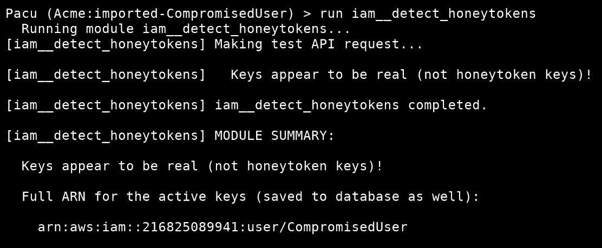

iam__detect_honeytokens 模块在不记录到 CloudTrail 的情况下获取我们的 ARN

我们可以看到我们的`CompromisedUser`的用户名是`CompromisedUser`，它位于账户 ID`216825089941`中。如果我们想这样做，我们现在可以运行`whoami`命令来查看这些信息是否已添加到 Pacu 数据库。现在我们有了账户 ID，我们可以开始进行未经身份验证的侦察。这部分未经身份验证的侦察将涉及在账户中枚举 IAM 用户和角色，以及可能与公司或账户关联的 S3 存储桶。

1.  我们将首先注意到我们刚刚枚举的账户 ID，然后通过运行`swap_keys`命令在 Pacu 中将密钥切换到`PersonalUser`来启动它。

1.  作为`PersonalUser`，我们将运行`iam__enum_users`模块，以尝试检测目标账户中的任何用户。我们将向该模块传递我们刚刚获得的账户 ID，以便它知道在哪里查找用户。我们还将向`--role-name`参数传递`Test`作为值，因为我们的个人账户中有一个名为`Test`的角色，并且它是`UpdateAssumeRolePolicy` API 调用所必需的。最终命令将是`run iam__enum_users --role-name Test --account-id 216825089941`。将在您自己账户的 CloudTrail 中创建许多日志，但不会在目标账户中创建。以下屏幕截图显示了该命令的执行，我们可以看到发现了三个独立的 IAM 用户：

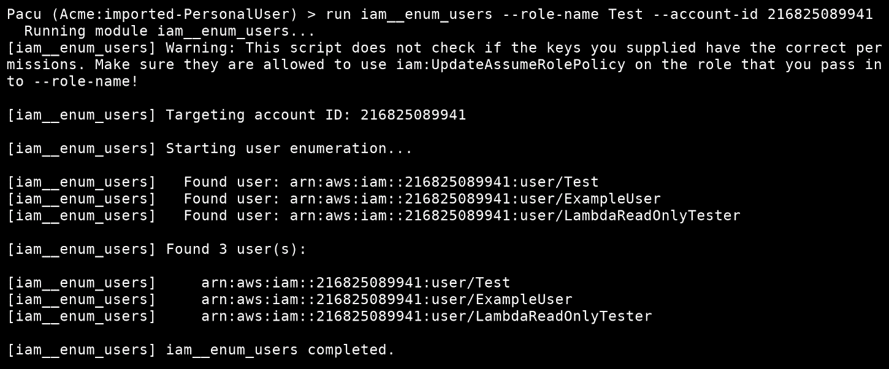

从`iam__enum_users`模块的一些输出中，表明我们在目标账户中发现了三个用户

1.  接下来，我们将使用`iam__enum_roles`模块运行以下命令来执行相同的操作：`run iam__enum_roles --role-name Test --account-id 216825089941`。以下屏幕截图显示了该模块的执行，我们可以看到枚举了四个 IAM 角色：

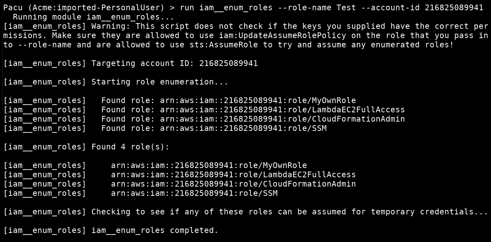

`iam__enum_roles`模块的部分输出，表明找到了四个角色，但没有一个可以用于凭据

现在，让我们看看我们枚举的用户和角色名称。我们找到了三个用户：

+   `Test`

+   `ExampleUser`

+   `LambdaReadOnlyTest`

`Test`和`ExampleUser`在我们的侦察中并不是很有帮助，但`LambdaReadOnlyTest`表明我们的目标可能在其账户中使用 Lambda 服务。

我们还发现了四个角色：

+   `MyOwnRole`

+   `LambdaEC2FullAccess`

+   `CloudFormationAdmin`

+   `SSM`

这些角色名称比我们枚举的用户更有帮助。`MyOwnRole`有点无用，但`LambdaEC2FullAccess`表明 Lambda 在他们的环境中正在使用，就像我们从一个用户推断出的那样，但这个角色名称还表明了另外两个潜在的可能性：

+   可能存在被启动到 VPC 中的 Lambda 函数，使它们内部访问该网络

+   可能存在直接与 EC2 服务交互的 Lambda，这意味着我们的目标也可能在其环境中使用 EC2 服务

`CloudFormationAdmin`角色表明在环境中可能使用了 CloudFormation，因此在我们开始攻击时，我们需要牢记这一点。它可能能够帮助我们通过少量的 API 调用收集有关目标环境的更多信息。

`SSM`角色表明此角色是为系统管理员创建的。我们可以假设这意味着他们在其环境中使用系统管理员远程控制/管理 EC2 实例或本地服务器。

现在，在目标账户中不创建任何日志的情况下，我们已经枚举了多个存在的用户和角色，并收集了关于他们的基础设施可能如何在不同的 AWS 服务中设置的合理数量的信息。

我们未经身份验证的侦察的最后一部分将是使用 Pacu 的`s3__bucket_finder`模块查看 S3 存储桶。假设我们的目标 Acme Co.拥有域名`acme.com`，因此我们将将其传递给此模块以查找现有的存储桶。我们可以使用以下命令来执行此操作：

[PRE2]

输出应该向我们显示是否发现了任何存储桶，然后是否有任何这些存储桶可以列出。不幸的是，我们的扫描没有提供任何可操作的结果，如下面的截图所示：

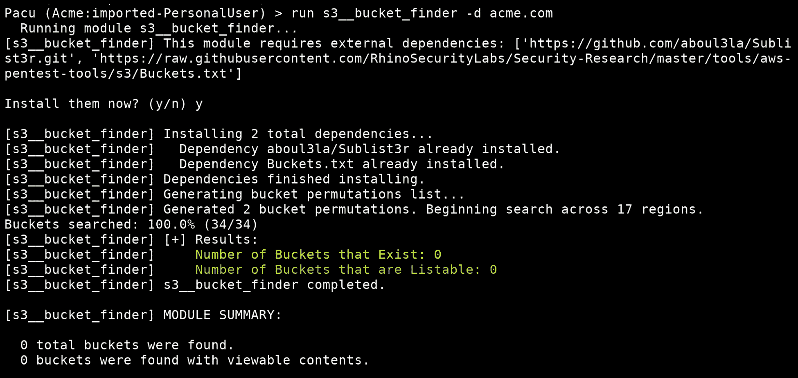

该模块未找到任何存储桶供我们查看

如前面的截图所示，该模块具有外部依赖性。目前，这是唯一一个使用`install_dependencies`函数的模块，它这样做是为了 Git 克隆`Sublist3r`进行子域变异和`Buckets.txt`进行存储桶暴力破解。因为我们只使用了`-d`参数，所以这两个外部依赖都没有被使用。

现在，我们已经尽了我们在目标账户外的所能。是时候获取`CompromisedUser`凭据并开始我们两部分侦察的经过身份验证的阶段了。

# 经过身份验证的侦察加上权限枚举

要开始我们评估的经过身份验证的侦察部分，我们需要使用`swap_keys` Pacu 命令从我们的`PersonalUser`切换到`CompromisedUser`：

1.  在 Pacu 中运行`swap_keys`以切换到`CompromisedUser`。

1.  经过身份验证的侦察的第一件事是找出我们自己的权限，以便我们知道我们对 AWS 账户有什么样的访问权限。这可以通过使用`iam__enum_permissions` Pacu 模块来完成。对于我们当前的目的，它不需要任何参数，因此我们可以运行以下命令：

[PRE3]

1.  接下来，我们可以查看使用`whoami`命令枚举的权限：

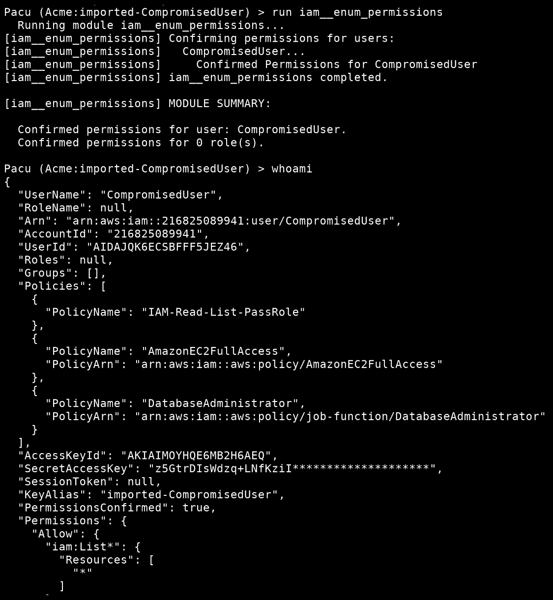

运行`iam__enum_permissions`并使用`whoami`命令检查枚举的数据

我们可以看到我们的用户附加了三个 IAM 策略，其中两个是 AWS 托管策略（`AmazonEC2FullAccess`，`DatabaseAdministrator`），另一个是内联策略（`IAM-Read-List-PassRole`）。我们可以确定这些是 AWS 托管策略，因为在`whoami`命令的结果的`Policies`部分中包含了 ARN。`IAM-Read-List-PassRole`策略没有列出 ARN，这意味着它是一个内联策略，而不是托管策略。

如果我们向下滚动，我们将看到我们的用户被允许/拒绝的权限列表，以及这些权限适用的资源/条件。

现在，我们已经枚举了我们自己的权限，并将其保存到数据库中，我们可以看到我们对 AWS EC2 拥有完全访问权限，`DatabaseAdministrator`策略授予我们的任何访问权限（如果我们愿意，我们可以直接从我们自己的个人账户查看此策略，或者我们可以查看 Pacu 提供的权限列表），以及`IAM-Read-List-PassRole`策略授予我们的任何访问权限（我们可以假设它授予我们对 IAM 服务的读取和列出权限，以及将 IAM 角色传递给其他 AWS 服务/资源的权限）。所有这些都可以通过审查 Pacu 在`whoami`命令中提供的权限列表来确认。

枚举我们自己用户的权限非常重要，但要注意，枚举这些权限可能会触发基于 IAM 枚举的 GuardDuty 警报。然而，我们不仅想要我们自己的权限；我们还想查看账户中每个其他用户和角色的权限，以便为客户提供环境中可能的所有可能的配置错误的完整列表。我们可以使用`iam__enum_users_roles_policies_groups`模块来做到这一点，但这只会枚举每个 IAM 资源的基本信息。我们宁愿再次使用`iam__enum_permissions`模块来收集环境中每个用户/角色的完整权限集。

1.  我们可以通过使用`--all-users`和`--all-roles`参数开始枚举所有用户和角色的权限，可以在以下命令中看到：

[PRE4]

现在，Pacu 将循环遍历账户中的每个用户和角色，并将它们的权限转储到我们 Pacu 文件夹中的 JSON 文件中。然后，可以手动审查这些信息，或者将其传递给 Pacu 特权升级模块，以检查所有这些用户/角色的特权升级向量：

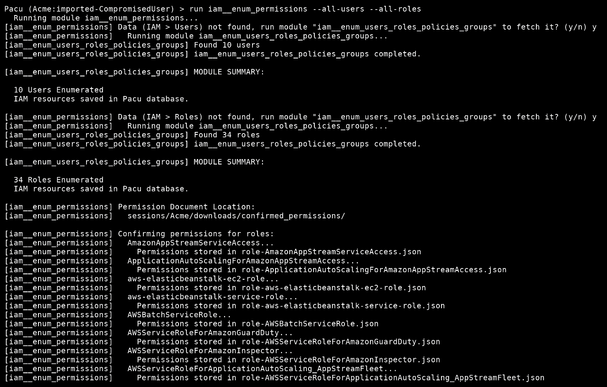

当针对所有用户和角色时，`iam__enum_permissions`模块的输出

在前面的截图中，我们可以看到 Pacu 尚未枚举目标账户中的用户和角色，因此在执行之前询问我们是否要这样做。然后，我们可以看到它正在将每个用户和角色的权限保存到 Pacu 文件夹中的`sessions/Acme/downloads/confirmed_permissions/`文件夹中。当模块完成时，我们可以检查这些文件，查看这些用户/角色的权限，其格式类似于我们自己用户的`whoami`命令的输出：

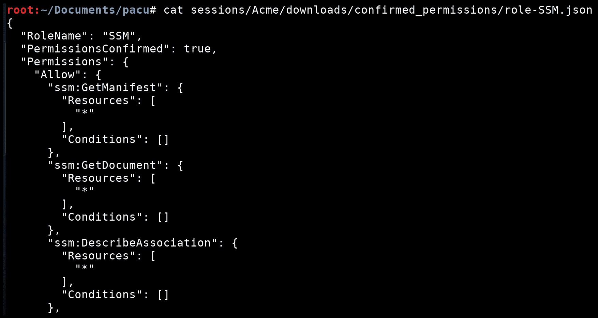

JSON 文件中包含 SSM 角色权限的部分内容

枚举的下一步理论上可以等到我们准备攻击特定服务时再进行，但也可以在那之前一次性完成。在这一点上运行的一对很好的模块可能是`aws__enum_account`和`aws__enum_spend`模块，以提供有关用户所在组织和在各种 AWS 服务上花费的资金类型的见解。这些数据可以为您提供信息，让您能够确定正在使用哪些 AWS 服务（以及在多大程度上），而无需查询这些特定的服务本身。例如，如果我们可以看到总账户支出为$1,000.00，EC2 服务的支出为$750.00，那么我们可以假设他们的大部分资源驻留在 EC2 上。您的假设可能并不总是 100%准确，但通常可以提供对预期情况的高层次概述。

1.  现在，在 Pacu 中运行`run aws__enum_account`命令，然后运行`run aws__enum_spend`命令，以接收类似于以下截图所示的输出：

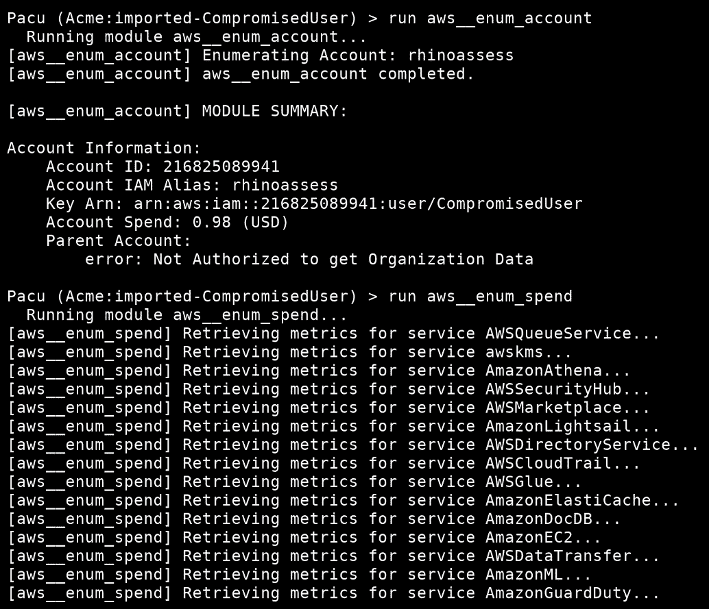

`aws__enum_account`模块的输出和`aws__enum_spend`模块的部分输出

我们可以看到`aws__enum_account`模块为我们提供了美元（$）的总账户支出，为$0.98，但我们未被授权收集有关账户组织的任何信息。我们还可以看到`aws__enum_spend`模块的输出开始部分，该模块正在检查每个 AWS 服务的指标，以确定在其上花费的资金。结果显示在以下截图中：

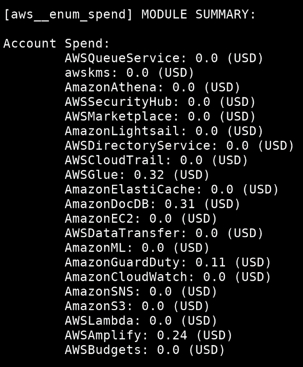

目标账户的 AWS 账户支出

我们可以看到大部分账户支出出现在 AWS Glue 服务和 Amazon Document DB 服务中，还有一些在 GuardDuty 和 AWS Amplify 中。尽管这些信息很有帮助，但不应该依赖它们作为 100%的事实，因为符合 AWS 免费套餐资格的任何支出都不会在这里记录；这不是账户支出的最新实时清单，也不是所有 AWS 资源都需要花钱。因此，仍然值得直接检查特定服务，但从这个列表开始可能会有所帮助。

1.  通常情况下，我们可以根据`aws__enum_spend`模块返回的数据来制定攻击计划，但在这种情况下，我们的示例公司 Acme Co.在参与之前曾讨论过 EC2。基于这些信息，以及 EC2 通常是最有成效的服务之一，我们将运行`ec2__enum`模块来发现账户中的任何 EC2 资源。我们可以使用以下命令来执行：

[PRE5]

因为我们还没有在 Pacu 中设置任何会话区域，所以我们将被提示并询问是否要针对每个 AWS 区域进行操作，我们会回答是。这是因为我们还不知道使用了哪些区域，所以值得检查每一个，直到我们可以找到这些信息为止：

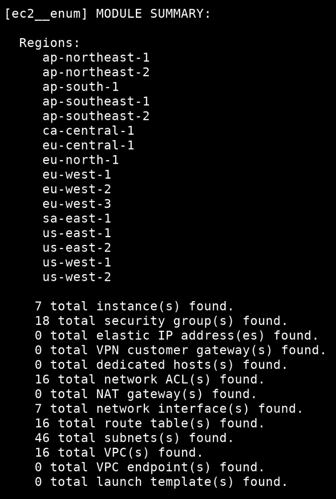

`ec2__enum`模块的摘要结果

我们可以看到在扫描中发现了七个 EC2 实例。如果我们在结果中向上滚动，我们可以确定`us-east-1`有一个 EC2 实例，`us-west-2`有六个 EC2 实例。

如果我们想假设整个 AWS 账户只使用`us-east-1`和`us-west-2`，我们可以将 Pacu 会话区域设置为这两个区域，但仅基于单个服务很难做出这样的假设，所以我们不打算这样做。

现在我们已经枚举了存在的 EC2 资源，我们将查看每个实例的`EC2 userdata`，因为这是针对 EC2 实例运行的最简单但最有成效的安全检查之一。通常情况下，我们可以找到私人信息（不应该在其中）或其他一般信息，这些信息可以帮助我们更好地了解环境中发生了什么。

1.  要执行此操作，请在 Pacu 中运行`run ec2__download_userdata`命令。以下屏幕截图显示我们在环境中枚举的两个实例中找到了`userdata`：

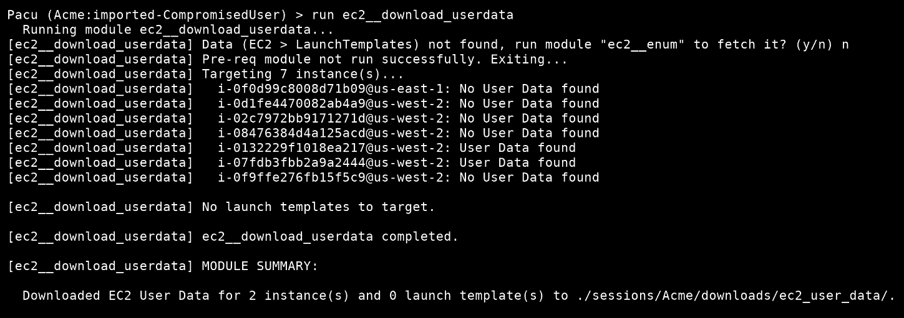

使用 ec2__download_userdata 模块的结果

从前面的屏幕截图中可以看到，该模块首先询问我们是否要枚举`EC2 LaunchTemplates`（也可以保存`userdata`），因为数据库中没有，我们回答否，因为我们知道我们已经枚举过了（使用`ec2__enum`），并且没有找到。然后，我们可以看到七个 EC2 实例中有两个附加了`userdata`，然后存储在我们的 Pacu 文件夹中：`./sessions/Acme/downloads/ec2_user_data`。

1.  让我们通过查看这些文件来检查`userdata`，看看其中是否有什么有趣的内容。我们将使用`cat`命令来执行此操作，该命令将输出我们指定的文本文件的内容到屏幕上：

输出这两个包含 EC2 用户数据的文件的内容

根据第一个实例（`i-07fdb3fbb2a9a2444`）的输出，我们可以看到它在启动时使用`apt-get`安装了 AWS CLI，然后使用它将文件从私有 S3 存储桶复制到根文件夹。这告诉我们，该 EC2 实例可能附加了 IAM 角色，因为在`userdata`中没有设置凭据，但我们可以通过 Pacu 中的`data EC2`命令来确认这一点，从中我们可以找到该实例的详细信息。

我们查看的第二个实例的`userdata`看起来很有趣。它正在使用`curl`程序从 Acme.com 的 API 获取授权令牌。它正在使用基本身份验证，因此我们可以在命令中直接看到管理员用户名（`admin`）和密码（`P@ssW0rd`）。现在，我们可以对 Acme.com 网站进行一些简单的侦察，以找出管理员帐户将为我们提供什么访问权限。完成后，我们可以使用相同的凭据和 API 请求我们自己的授权令牌，然后我们可以将访问权限转移到主`Acme.com`网站。

攻击随机的 Web 应用程序超出了本书的范围，但如果满足一些条件，这将是进行 AWS 渗透测试的一个非常有效的攻击路径。首先，Web 应用程序应该托管在我们攻击的 AWS 环境中，才能被视为在范围内，其次，我们需要确定这是否符合客户的期望。如果其中任何一个是有问题的，值得联系我们的客户直接询问。如果允许这种攻击，我们可能能够升级这种攻击以控制 Web 应用程序，或者根据我们在其中找到的内容，我们可能能够进一步扩展我们的 AWS 访问权限。

我们可以在 Pacu 中枚举其他服务和运行其他枚举模块，但现在我们将继续查看特权升级。在我们尝试通过常规手段滥用用户权限进行特权升级之后，将是时候审查账户中的其他服务，并尝试使用这些服务进行特权升级（和/或其他攻击）。

# 特权升级

我们已经枚举了我们自己用户的权限，以及我们正在针对的帐户中的每个其他用户和角色的权限。现在我们可以将`iam__enum_permissions`模块生成的信息传递给`iam__privesc_scan`模块，以检查帐户内是否存在特权升级的情况。我们首先使用`--offline`参数，以便模块知道我们正在检查每个人的特权升级路径。如果没有该参数，它将只检查我们自己用户的特权升级路径，然后尝试利用它们以获得对环境的提升访问权限。以下截图显示了`iam__privesc_scan`模块的输出，其中它已经确定了多个用户已经具有对环境的管理员特权，并且多个用户容易受到几种不同特权升级的攻击：

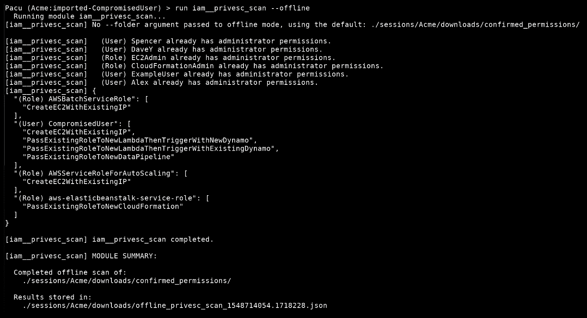

使用--offline 参数运行 iam__privesc_scan 模块

我们可以从这个输出中得出一些结论。我们可以看到用户`Spencer`，`DaveY`，`ExampleUser`和`Alex`以及角色`EC2Admin`和`CloudFormationAdmin`都已经具有对环境的管理员访问权限。之后，我们可以看到角色`AWSBatchServiceRole`，`AWSServiceRoleForAutoScaling`和`aws-elasticbeanstalk-service-role`以及用户`CompromisedUser`可能容易受到各种特权升级方法的攻击。

好消息是我们自己的用户`CompromisedUser`可能容易受到四种不同的升级方法的攻击，这意味着我们很可能能够进一步访问环境。如果我们想以后再次查看这些数据，我们可以导航到 Pacu `./sessions/Acme/downloads/`文件夹，以查看生成的 JSON 文件，其中存储了特权升级数据，如模块输出底部所示。当我们完成渗透测试（在验证特权升级扫描结果后），我们将要确保将这些信息报告给客户，即使我们自己的用户并非直接易受攻击。

特权升级扫描的结果旨在通过它们的名称自我解释，但如果您对每种特权升级方法的具体情况感兴趣，建议您查看此链接：[`rhinosecuritylabs.com/aws/aws-privilege-escalation-methods-mitigation/`](https://rhinosecuritylabs.com/aws/aws-privilege-escalation-methods-mitigation/)。该模块是围绕该博客文章的内容构建的，因此您可以将特权升级方法与博客文章中解释的手动指南进行匹配。

如果我们查看我们的`CompromisedUser`易受攻击的`privesc`方法，它告诉我们它可能容易受到四种不同方法的攻击。`CreateEC2WithExistingIP`方法意味着我们可能有权限启动新的 EC2 实例并将现有实例配置文件传递给它，然后我们将能够访问与实例配置文件关联的 IAM 角色凭据。`"PassExistingRoleToNewLambdaThenTriggerWithNewDynamo"`和`"PassExistingRoleToNewLambdaThenTriggerWithExistingDynamo"` `privesc`方法意味着我们可能有权限创建新的 Lambda 函数，传递 IAM 角色，然后通过新的或现有的 DynamoDB 事件源映射调用该函数。

`PassExistingRoleToNewDataPipeline`方法告诉我们，我们可能有权限启动新的数据管道以执行 AWS CLI，就像我们传递的角色一样。我们可以手动查看这些方法中的每一个，以尝试获得更多的访问权限，但使用`iam__privesc_scan`模块的利用功能将更加高效，它将自动尝试使用可用方法提升我们用户的权限。

要自动利用特权升级方法，我们只需运行以下命令：

[PRE6]

然后，它将自动找到我们用户的脆弱的`privesc`方法，并循环遍历每一个，直到成功获得额外的权限。由于某些特权升级方法的复杂性，可能需要在各个点输入用户输入。当我们第一次运行它时，它将再次找到那些特权升级方法，然后深入到`CreateEC2WithExistingIP`特权升级方法中，可以在以下截图中看到：

privesc 扫描模块尝试通过第一种方法获得特权

它正在要求一个区域，因为我们还没有为 Pacu 会话设置任何会话区域，所以我们将提供`15`来定位`us-west-2`区域：

EC2 特权升级方法希望我们选择要附加到实例的实例配置文件

正如我们在前面的截图中所看到的，有六个 EC2 实例配置文件有资格附加到我们的实例。我们想选择具有最高权限的那个，因为这是我们通过这种方法获得访问权限的角色。我们可以通过查看之前的完整账户`iam__enum_permissions`模块的输出来确定这些信息，但是如果我们回顾一分钟前的完整账户特权升级扫描，我们将看到它告诉我们`EC2Admin`角色已经具有管理员权限。这使得这个问题的选择变得显而易见：

在选择实例配置文件后，我们被问到的下一个问题

接下来，我们将被提出一个问题，并提供五个选项供选择。问题是问我们如何使用这个 EC2 实例来提升我们的权限。选项一是在启动时向我们自己的服务器打开一个反向 shell，允许我们在实例内部做我们想做的事情。选项二是从目标实例内部运行 AWS CLI 命令，使用我们附加到实例的角色凭据。选项三是从 EC2 实例向我们自己的服务器发出包含 IAM 角色当前凭据的 HTTP 请求。选项四是在 AWS 中创建一个新的 SSH 密钥，提供给您私钥，然后使用该密钥启动实例，以允许您 SSH 进入它。最后，选项五是跳过这个`privesc`方法，转移到下一个。根据您的个人设置和环境的设置，您将不得不选择最适合您的方法。

对于这次渗透测试，我将选择选项一，即反向 shell，因为它不会触发 GuardDuty，而且只需要默认的 EC2 安全组允许我们指定的端口的出站互联网访问（而不是像选项四那样需要入站端口`22`）。从反向 shell，我们可以在实例内部使用 AWS CLI，从 EC2 元数据 API 中获取角色凭据，或者任何其他我们想要的东西：

使用反向 shell 选项进行特权升级方法

在上一张截图中，我们可以看到我们提供了攻击者拥有的服务器的 IP 地址（已屏蔽）和端口。然后，该模块输出了它创建的 EC2 实例的详细信息。现在，我们所需要做的就是等待我们的反向 shell 出现：

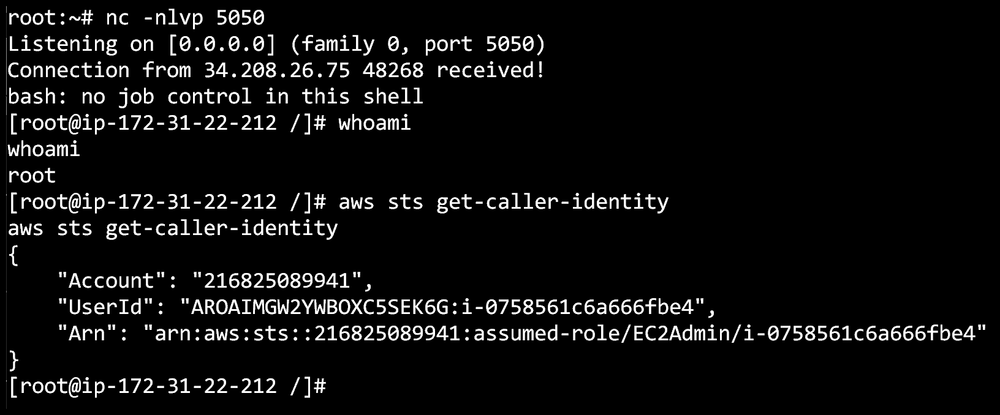

设置我们的 netcat 监听器，在那里我们接收我们的反向 shell 作为 root 用户

正如我们在前面的截图中所看到的，我们使用 netcat 监听端口`5050`，运行`whoami`命令以查看我们是 root 用户，然后使用 AWS CLI 运行`STS GetCallerIdentity`命令。该命令的输出显示我们正在作为假定角色`EC2Admin`进行 AWS 身份验证，我们知道该角色对环境拥有完整的管理员权限。

尽管我们在 AWS 环境中有管理员权限，但这只是暂时的。我们可能随时失去这个 EC2 实例，或者凭据在我们能够对其进行有用操作之前就会过期，因此我们需要迅速采取行动，提升我们原始的`CompromisedUser`权限并将 EC2 实例保存为备份。基本上，一旦我们提升了自己用户的权限，EC2 实例将作为账户中的伪持久性，有可能在将来再次获得管理员级别权限。

为了将我们自己的用户提升为管理员，我们将运行以下 AWS CLI 命令，将`AdministratorAccess` AWS 托管的 IAM 策略附加到我们的`CompromisedUser`：

[PRE7]

如果成功，该命令不会返回任何输出，因此我们可以再次回到`iam__enum_permissions` Pacu 模块，以确认我们是管理员：

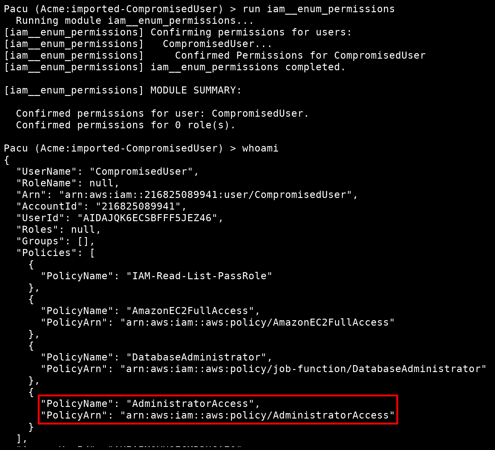

重新运行 iam__enum_permissions，然后运行 whoami，并查看我们是否附加了 AdministratorAccess IAM 策略

如果我们想进一步确认，我们可以尝试运行一个我们之前没有访问权限的 AWS CLI 命令或 Pacu 模块，但我们的用户附加的策略表明我们实际上是管理员。

到目前为止，我们已经枚举了 IAM 和 EC2 数据，启动了一个后门 EC2 实例以允许特权升级，然后使用 EC2 实例将我们的`CompromisedUser`提升为环境中的管理员。在这一点上，我们应该在继续使用其他 AWS 服务之前建立一些持久性。

# 持久性

尽管我们已经有一个我们可以访问的 EC2 实例，并且可以在环境中提供给我们管理员级别角色的访问权限，但出于几个原因，我们不应该仅依赖它作为我们唯一的持久性方法。角色随时可能发生变化，例如如果被删除或者其权限被修改，这将移除或削弱我们的持久性访问。

EC2 实例随时可能被标记为可疑并关闭，移除我们的持久性访问。此外，EC2 安全组规则可能被修改，阻止实例的出站访问，这意味着我们将不再接收到反向 shell。最后，我们可能会失去反向 shell 连接，这意味着我们需要等待实例重新启动才能再次获得反向 shell 连接。即使没有防御者试图阻止我们，事情也可能出错很多种方式，因此附加角色的 EC2 实例并不是一个可靠的持久性方法，尽管它至少在短时间内有效。

为了彻底/安全起见，我们将在目标帐户中启动几种不同的持久性方法：

1.  我们将使用的第一种持久性方法是使用`iam__backdoor_users_keys` Pacu 模块为帐户中的另一个或两个用户创建新的访问密钥对，通过运行`run iam__backdoor_users_keys`命令：

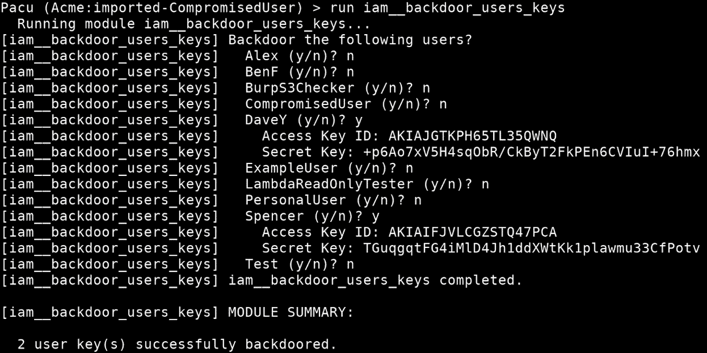

使用`iam__backdoor_users_keys`模块为 DaveY 和 Spencer 用户设置后门

正如我们在前面的截图中所看到的，该模块将提示我们，询问我们想要为哪些用户创建后门 AWS 密钥。

1.  我们选择了`DaveY`和`Spencer`作为示例，因为当我们之前运行特权升级扫描程序时，他们显示为管理员用户，这意味着只要这些密钥存活，我们将具有提升的持久性。

1.  接下来，我们将在帐户中创建一个新的 Lambda 后门，以便后门任何新创建的 IAM 角色，以便我们可以跨帐户假定其凭据。我们可以使用`lambda__backdoor_new_roles` Pacu 模块来实现这一点。我们需要一个具有 IAM `UpdateAssumeRolePolicy`和`GetRole`权限的角色，以便我们的后门，因此我们将将该权限添加到允许 Lambda 被假定的现有角色。我们可以通过运行以下命令使用 AWS CLI 来实现这一点，该命令针对`LambdaEC2FullAccess`角色：

[PRE8]

1.  还有一件事要做。该模块告诉我们，CloudTrail 必须在`us-east-1`地区启用我们的后门功能才能触发，因此我们应该再次检查一下，以防万一。以下命令可以满足我们的要求：

[PRE9]

在我们的情况下，有一个位于`us-east-1`的角色，因此我们可以使用后门模块，如下截图所示：

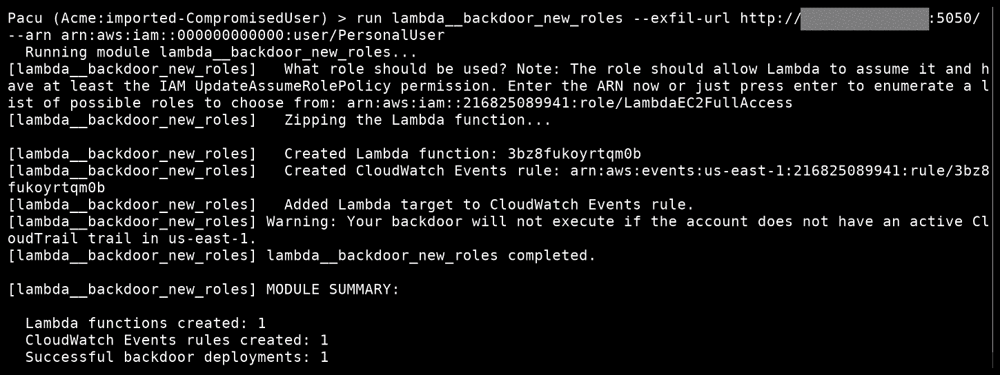

创建一个后门 Lambda 函数和 CloudWatch Events 规则

正如我们在前一个屏幕截图中看到的，我们运行了以下 Pacu 命令：

[PRE10]

该命令假定我们在 IP `x.x.x.x`（已编辑）的端口`5050`上托管了 HTTP 监听器，并且我们的`PersonalUser` AWS 用户驻留在 AWS 帐户 ID`000000000000`中。运行时，Pacu 将为 Lambda 函数生成代码，对其进行压缩，然后将其上传到 Lambda。之后，它将创建一个 CloudWatch Events 规则，该规则会触发任何 IAM `CreateRole` API 调用。现在，每当创建新的 IAM 角色时，我们的 CloudWatch Events 规则将被触发，这将导致我们的 Lambda 函数被调用，然后将使用 IAM `UpdateAssumeRolePolicy` API 将我们的外部用户（`PersonalUser`）添加为可以假定的受信任实体。完成后，它将将新角色的 ARN 外泄到我们在命令中提供的 URL，以便我们随时可以使用它来访问帐户。

等待片刻后，我们最终收到了一个 IAM 角色 ARN 的请求，这意味着已经创建了一个角色，并且我们使用我们的 Lambda 函数自动设置了后门：

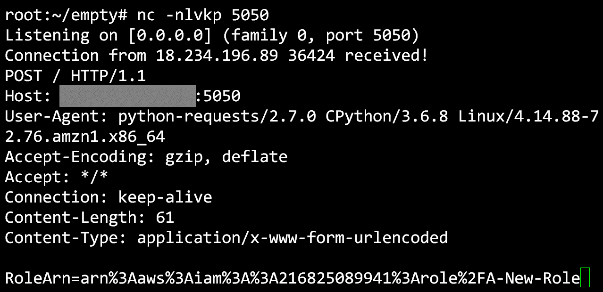

我们自己的服务器在端口 5050 上监听来自我们后门 Lambda 函数的 IAM 角色 ARN

正如我们在前面的屏幕截图中看到的，我们的服务器收到了一个`HTTP` `POST`请求，其中包含一个 URL 编码的 IAM 角色 ARN（名为`A-New-Role`）。

如果我们想要请求此后门角色的凭据，我们将使用 STS `AssumeRole` API。我们可以通过运行以下 AWS CLI 命令，使用我们的`PersonalUser`的凭据来实现这一点：

[PRE11]

我们可以使用相同的命令来处理任何其他最终被创建并外泄到我们服务器的角色；我们只需要修改其中的 ARN。

现在我们是帐户中的管理员，我们有几种提升的持久性形式，并且我们还在帐户中执行了一些基本的侦察。现在，我们准备进入服务利用阶段。

# 后利用

后利用（或服务利用）阶段基本上是我们尽可能地针对 AWS 服务，以尝试发现弱点、错误配置和不良实践。我们将在本节中介绍一些主要的 AWS 服务，但任何 AWS 服务都有可能被利用和错误配置，因此查看任何正在使用的服务或资源几乎总是值得的，即使您可能对该服务本身不熟悉。

# EC2 利用

我们已经开始处理一些与 EC2 相关的内容，因此我们将从这里开始。EC2 也是您在渗透测试中经常遇到的服务之一，因此熟悉它并进行测试是一个好主意。当错误配置时，EC2 也可能产生一些高影响的发现，因此以它作为您的主要服务开始是没有错的。

我们可以首先检查有哪些 EC2 实例具有公共 IP 地址。在 AWS Web 控制台中，这很简单，因为您可以通过实例的公共 IP 地址对结果进行排序。如果我们想要从我们的`CompromisedUser`获得控制台访问权限，我们可以使用 IAM 的`CreateLoginProfile` API 为我们创建一个登录密码，但如果我们不想这样做，我们可以使用 Pacu 中的`data EC2`命令来查看我们之前执行的枚举的结果。

然后，对于每个具有公共 IP 地址的实例，我们可以查看附加到它们的 EC2 安全组。理想情况下，我们可以浏览安全组规则，尝试找到可能在实例上运行的任何服务。如果我们看到端口 80 对某个 IP 地址开放，我们知道该实例上可能正在运行 Web 服务器。如果我们看到端口 22 对某个 IP 地址开放，我们知道该实例上可能正在运行 SSH 服务器（等等）。如果其中任何端口对公共开放，我们可以尝试访问这些端口，并寻找任何低 hanging-fruit，例如弱/缺乏身份验证，已知的漏洞，或者您在网络风格渗透测试中可能寻找的其他任何内容。

如果满足了正确的条件，我们甚至可以在没有公共 IP 地址的实例上执行相同的任务，但是有管理员访问权限，我们可能可以使任何事情都能够运行。我们已经在账户中启动了一个 EC2 实例，用于特权升级，所以我们可能在其他 EC2 实例的 VPC 内。如果不是这样，我们可以启动另一个实例并以这种方式获得访问权限。从那个实例，我们可以访问其他 EC2 实例的内部 IP，所以我们可能可以通过这种方式获得进一步的访问权限。

如果这些都不起作用，我们可以修改这些实例的安全组规则，以允许我们访问。您可以使用 EC2 的`AuthorizeSecurityGroupIngress` API 手动执行此操作，或者我们可以使用`ec2__backdoor_ec2_sec_groups`模块创建允许我们访问任何端口的后门规则。使这一切发生的 Pacu 命令如下，我们正在为所有安全组向`1.1.1.1` IP 地址（模拟为我们自己的 IP）打开每个端口：

[PRE12]

现在，如果我们的 IP 地址是`1.1.1.1`，我们应该能够访问任何实例上的任何端口。在这一点上，我们可以像在常规内部网络渗透测试中那样攻击这些服务。

如果我们想直接在任何 EC2 实例上获得 RCE，我们可以尝试几种方法。如果您不在乎重新启动任何 EC2 实例（您应该在乎，因为我们通常不希望对客户服务器执行此操作），那么您可以使用`ec2__startup_shell_script` Pacu 模块停止所有（或指定）EC2 实例，修改它们的`userdata`以在启动时输入`root/SYSTEM`的反向 shell，然后重新启动所有这些实例。它们只会离线几分钟，但如果您不熟悉环境的设置，这可能会导致重大问题，因此通常不建议这样做。

如果我们想要在 EC2 实例上获得 RCE，并且满足了正确的条件，我们可以在 Pacu 中使用`systemsmanager__rce_ec2`模块。它尝试识别哪些 EC2 实例安装了系统管理器代理（默认或非默认），然后如果识别到任何实例，它将尝试将系统管理器角色附加到它们上。一旦完成这一步，满足正确条件的实例将显示为系统管理器`run`命令的可用目标，这允许您在目标实例上以`root/SYSTEM`用户的身份执行代码。一个示例 Pacu 命令，在 Linux 目标上运行反向 bash shell，可能看起来像这样：

[PRE13]

提供给`--command`参数的值是一个 bash 反向 shell，将调用`1.1.1.1` IP 地址的`5050`端口。在我的服务器上（假设我控制`1.1.1.1`），我将运行一个 netcat 监听器，比如`nc -nlvp 5050`，等待我的 shell 进来。请记住，这只适用于单个实例，如果您想在多个实例上放置某种恶意软件或反向 shell，您可能需要修改您的有效载荷。您还可能需要为 Windows 主机准备另一个有效载荷。

如果在运行此模块时启用并监听`PacuProxy`，则可以省略`--command`参数。如果这样做，Pacu 将自动使用其自定义的 Linux/Windows 单行分段器来控制目标服务器。这样，您就不需要担心目标操作系统或自己想出命令。

如果我们想测试其他保护/监控功能，或者我们只是想要恶意行为，我们可以尝试启动多个 EC2 实例，用于加密货币挖矿等操作，但由于这种攻击的成本影响，几乎不应在渗透测试期间执行。只有在您的客户完全理解并希望您执行的测试时，才执行此类攻击。

我们可能想尝试的另一种攻击是检查帐户中的 EBS 卷和快照。我们可以通过几种方式来做到这一点，但基本上这些是步骤：

1.  创建您想要查看的 EBS 卷的快照。

1.  与攻击者帐户共享该快照，或在受损帐户中创建一个 EC2 实例。

1.  从您创建的快照创建一个新的 EBS 卷。

1.  在您的 EC2 实例上挂载 EBS 卷。

1.  在挂载的卷的文件系统中搜索秘密。

跨帐户共享 EBS 快照的好处是，您可以在自己的帐户中使用 EC2 来检查所有内容，但通常共享/公共 EBS 快照会被许多配置检查器审计，这意味着您可能会被标记并被发现。在受损帐户中使用 EC2 实例的好处是，您可以避免跨帐户共享快照，但您可能会在任何时候被发现并删除。

`ebs__explore_snapshots` Pacu 模块是为了自动化这个过程而构建的。您只需运行它，并传入帐户中 EC2 实例的实例 ID 和其可用区，然后它将循环遍历帐户中的所有 EBS 卷（每次几个），将它们挂载到您的 EC2 实例，然后等待您完成搜索文件系统。完成后，它将分离所有附加到您的实例的卷，删除它们，然后还将删除它创建的任何快照。运行此模块的示例命令可能如下所示：

[PRE14]

然后，它将逐步将 EBS 卷附加到该实例的可用区`us-east-1a`，允许您一次检查它们的小组，并在此之后为您清理一切。

# Lambda 中的代码审查和分析

Lambda 是另一个非常常见和非常富有成效的服务，就像我们在 Lambda 渗透测试章节中看到的那样。

我们要做的第一件事是使用`lambda__enum` Pacu 模块在目标帐户中枚举 Lambda 函数。我们可以像这样运行它，不带任何参数：

[PRE15]

完成后，我们可以运行`data Lambda`来查看枚举的函数数据。要开始审查过程，我们应该循环遍历每个函数，并查看与之关联的环境变量，以尝试找到一些可能在我们的攻击中有用的敏感数据/值。

在检查环境变量以获取有趣数据后，如果我们发现了任何内容，比如发现了 API 密钥或密码，那么我们将希望截图并做笔记，以便向客户报告。如果我们发现的内容在某种程度上可以被滥用，那么现在可能是这样做的时候，但只有在仍然在您的参与范围内时才这样做。有时，您发现的秘密将属于第三方服务，您可能不应该攻击它们，但其他时候，如果您可以通过特权升级或跨 AWS 账户访问某个地方，那么确认与您的客户联系人后，这可能是值得的。

完成后，您可以浏览 Pacu Lambda 数据并下载每个 Lambda 函数的代码进行本地分析。下载后，您可以运行静态源代码安全工具，例如 Python 的 Bandit，尝试发现代码中的任何固有弱点。

在对代码进行自动化和手动审查后，如果发现了潜在的漏洞，现在就是利用它们来确认发现的时候。如果您发现一个 Lambda 函数由 S3 触发，然后将用户可控数据放入不安全的操作系统命令中，您可以使用此方法在 Lambda 函数上实现远程代码执行，以窃取附加 IAM 角色的 IAM 凭据。

# 在 RDS 中通过身份验证

凭借正确的 RDS 权限，我们有可能以管理员用户的身份获得对目标账户中任何 RDS 数据库实例的完全访问权限，这将授予我们对存储在其中的数据的完全访问权限。

这种攻击过程可以手动完成，也可以使用`rds__explore_snapshots` Pacu 模块。目标是滥用 RDS 数据库实例的备份，以创建现有数据库的新副本，并具有我们自己的私有访问权限。如果我们获得了对 RDS 的访问权限，并且只有一个实例且没有备份，那么该过程将包括以下步骤：

1.  创建运行中数据库实例的快照。

1.  将该快照恢复到一个新的数据库实例。

1.  将我们新数据库实例的主密码更改为我们知道的内容。

1.  将数据库更改为公开访问，并修改任何安全组规则以允许我们入站访问正确的端口。

1.  使用我们设置的凭据连接到数据库。

1.  使用类似`mysqldump`的工具来外泄整个数据库。

一旦连接，它将是账户中单个生产数据库的完整副本，这意味着我们可以随心所欲地使用它。根据数据库中的数据量，一个明智的举措是使用类似`mysqldump`的工具将 SQL 数据库外泄到手动检查或导入到另一个外部数据库，这样就不会有任何访问被撤销的风险。确保在完成时删除您创建的原始数据库的快照和数据库实例；否则，您可能会在目标账户中产生一些费用。这可能有几个原因不好，包括让您的客户生气和/或被计费警报捕捉到您的活动。

这是一个可以手动完成的简单过程，但通常最好自动化，这样您就不会在过程中犯任何手动错误并搞砸生产数据库。您可以简单地运行以下 Pacu 命令来自动化大部分数据库实例的过程（使用`--region`标志指定特定区域）：

[PRE16]

`rds__explore_snapshots`模块的一部分输出

前面的截图显示了`rds__explore_snapshots`模块的部分输出。它将扫描您指定的区域以查找 RDS 实例，给出它们的名称，然后提示您是否要复制它。如果选择是，它将创建该数据库的快照，将该快照恢复到一个新的数据库，修改主密码，然后提供连接凭据。然后，您可以使用`mysqldump`之类的工具转储数据库，或者从数据库中获取您需要的特定数据。之后，您可以按*Enter*键在 Pacu 中继续进行下一个可用的数据库，然后该模块将删除它刚刚创建的数据库快照和数据库实例。如果模块在任何过程中出现故障，它将尝试清理之前运行时留下的任何未完成的资源。这样，您就不需要担心删除为攻击创建的任何资源。

关于对 RDS 的这次攻击的另一个有趣的点是，修改主密码与一大堆其他配置更改捆绑在一起，因此并不一定是一个高度监控的 API 调用。它使用 RDS 的`ModifyDbInstance` API 来更改主密码，但同样的 API 也用于修改网络设置、监控设置、认证设置、日志设置等等。

# S3 的认证方面

关于 AWS S3 已经有大量的研究，但从认证方面来看，情况有所不同。在利用阶段进入 S3 时，大部分过程都围绕着识别不应该公开的公共资源（存储桶/对象），但它不仅仅是如此。现在是时候审查围绕 S3 构建的自动化，并看看它是否可以被利用，也是时候审查各种存储桶的内容，看看你是否可以从中获得进一步的访问权限。

客户知道他们的开发人员可以访问 X、Y 和 Z 的 S3 存储桶可能会有所帮助，你发现存储在 Y 存储桶中的私有 SSH 密钥导致了 EC2 实例的受损，进而提供了更多的 AWS 凭证等等。不遵循最小权限原则的客户往往会面临各种攻击，特别是在 S3 中。

在审查存储在 S3 中的文件时，通常需要花费太长时间来查看每个存储桶中的每个文件，因此最好优先考虑您要寻找的内容。通常，存储桶、文件和文件夹名称将是判断文件是否值得查看的最佳指标。像`names.txt`这样的文件可能不值得您的时间，但像`backup.sql`这样的文件可能值得您的时间。通常，最好搜查这些文件以查找凭据、API 密钥、客户数据或任何敏感内容。您可以使用这些数据来显示权限升级路径、跨账户妥协攻击等等，具体取决于您找到的数据类型。也许它为您提供了访问他们企业网站的权限，或者他们内部 VPN 的权限。可能性是无穷无尽的，这一切取决于您找到了什么。

在寻找公共资源时，最好通知客户所有发现，即使内容并不敏感。如果整个存储桶设置为公开，某人可能会不小心上传一个不应该公开的文件，或者如果存储桶是公开可列出的，找到存储桶名称的用户将能够枚举存储桶中的每个文件。重要的是要注意，即使存储桶中的文件需要公开，存储桶也不需要公开可列出。

在审查围绕 S3 构建的自动化时，最好检查每个存储桶上的 S3 事件和日志记录。这样，你可以看到它们如何对其私有存储桶中的活动做出反应（或不做出反应）。

S3 存储桶和文件名也可以作为环境内的一种类型的侦察。通常，您可以根据 S3 存储桶名称发现账户内正在使用某些 AWS 服务。许多服务和功能将自动创建具有模板名称的 S3 存储桶，因此在这种情况下很容易进行相关性分析。

# 合规审计和最佳实践

除了对 AWS 服务和资源的直接利用之外，还重要的是在尽可能多的位置为您的客户提供一般的安全审计。这些类型的检查通常属于一小组类别：

+   **公共访问**：

+   X 是否可以公开访问？这是否应该是可能的？

+   **加密**：

+   Y 是否在静止状态下加密？Z 是否在传输中加密？

+   **日志**：

+   C 的日志是否已启用？是否对这些日志进行了处理？

+   **备份**：

+   D 是否已备份？备份频率如何？

+   **其他安全控制**：

+   是否使用 MFA？

+   密码策略强度？

+   对正确的资源进行删除保护？

当然，除了这几个之外，还有更多内容，但通常这些是最常见的发现类型。

已经有许多工具可以提供对环境的这种洞察，包括以下内容：

+   Prowler

+   Security Monkey

+   Scout2/ScoutSuite

还有许多其他工具，它们都与下一个工具有些不同，因此最终选择使用哪一个通常是个人选择。

# 摘要

AWS 渗透测试是一个需要广泛知识和奉献精神的复杂过程，而且它确实是一个永无止境的过程。AWS 始终会发布新的服务和功能，因此对于这些服务总会有新的安全检查和攻击。

作为渗透测试人员，很难说您已经完成了对 AWS 环境的渗透测试，因为它们可能是如此庞大和复杂，因此重要的是尽可能攻击尽可能多的不同服务，同时要在您与客户达成的时间表内完成。

您进行的每次真实世界渗透测试可能会大不相同。由于 AWS 及其提供的规模和复杂性，人们在任何地方都会以不同的方式进行操作，因此重要的是永远不要感到舒适，而是始终期望学习、教导和取得成功。

我们希望您在本章关于真实世界的 AWS 渗透测试中所学到的内容可以帮助您在自己的工作中推动整个 AWS 安全社区向前发展。我们涵盖了初始渗透测试启动以及未经身份验证和经过身份验证的侦察，包括枚举我们的权限。然后，我们继续通过 IAM 配置错误来提升这些权限，然后使用我们提升的访问权限在环境中建立持久性手段。在我们的访问权限得到保障后，我们继续进行 AWS 服务的一般后渗透，这是真正的魔术发生的地方。除此之外，我们简要介绍了如何识别和汇总合规性和最佳实践检查，以向我们的客户提供全面有用的报告。

AWS 渗透测试是一个有趣而复杂的过程，只能不断扩展，所以现在我们需要您走出去，贡献您的知识和经验，为所有用户创造一个安全的 AWS 体验。
