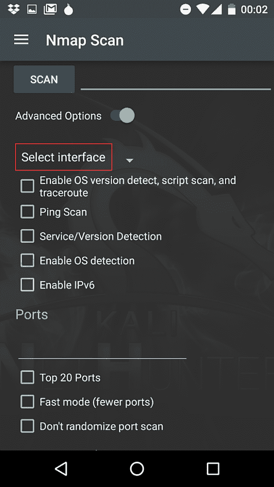
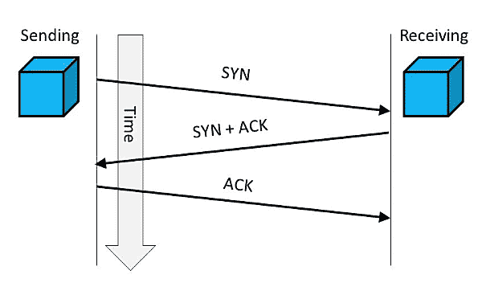
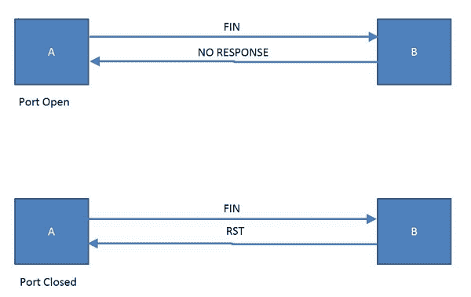
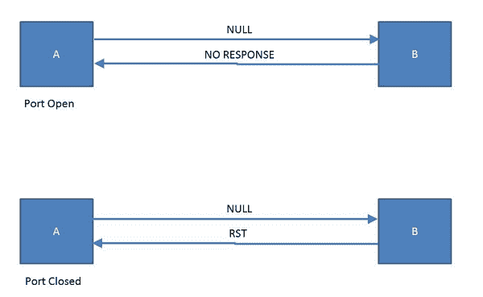
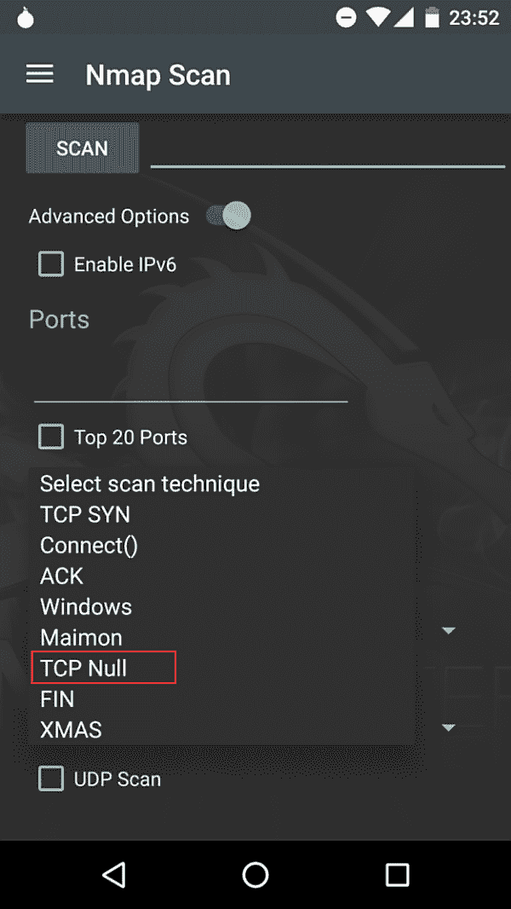
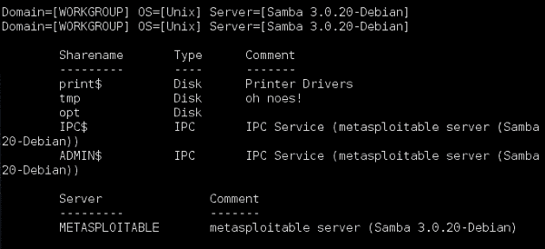

# 扫描和枚举工具

在本章中，我们将讨论概述和扫描技术。如果我们回顾一下第二章，*理解渗透测试过程的阶段*，扫描是黑客的第二阶段。什么是扫描？它使渗透测试人员能够识别网络中在线/活动的设备，并识别开放和关闭的服务端口、服务版本和漏洞；这些只是它的一些好处。Nmap 和 hping3 是一对著名的扫描工具。

此外，渗透测试人员通常需要提取信息，以快速识别目标系统上的攻击点。信息可以是网络共享、设备的路由表、用户和组以及 DNS 记录。这种提取信息的方式被称为枚举。一些强大且易于使用的枚举工具是 nbtstat、nbtscan、enum4linux 和 nslookup。

在本章中，我们将探讨以下主题：

+   确定主机是上线还是下线

+   使用 Nmap

+   端口扫描

+   横幅抓取

+   使用 NetHunter 进行枚举

+   使用 SMB

# 技术要求

为了完成本章，您需要安装 Kali NetHunter。有关在 Android 设备上设置 Kali NetHunter 的详细说明，请参阅第一章，*Kali NetHunter 简介*。

# 扫描

当我们想要利用使用 NetHunter 本地和外部工具收集的信息时，我们通常会从一系列扫描开始。为了探测目标，我们将使用一系列旨在执行不同类型扫描的工具，每个工具旨在使用特定标准对信息进行分组。这些扫描将帮助我们定位有效的主机目标、网络结构、运行的服务和漏洞。扫描过程进一步细化和处理了我们从第三章获得的信息，*情报收集工具*，以便更好地了解目标，并帮助您选择更好地执行枚举过程的区域（在*使用 NetHunter 进行枚举*部分中更多内容）。

扫描可以帮助我们收集以下重要信息，这些信息将在后续的利用过程中证明有用：

+   系统的 IP 地址

+   打开和关闭的端口

+   操作系统及其版本

+   WHOIS 信息

+   软件版本

+   MAC 地址

# 进行扫描

那么，我们所说的**扫描**是什么意思？让我们来分解这个过程。要更好地理解它，请参考*端口扫描*部分。在本章的后面，我们将使用 Nmap 工具和各种扫描技术来查看扫描的实际方面。需要执行以下步骤来进行扫描：

+   分析一系列 IP 地址以定位活动系统，即，目标设备将对 ICMP ECHO Replay 的 ping 扫描做出响应。如果目标上禁用了 ICMP，使用 Nmap，我们可以发送探测来检测目标是否会做出响应，Nmap 分析响应以帮助我们确定系统是否在线。这个阶段帮助我们避免扫描不在线的 IP 地址，因此无法进行扫描。

+   接下来，我们进行端口扫描，以针对特定 IP 地址并探测其开放或关闭的端口，这将用于稍后提取信息。

+   更仔细地探测开放的端口，以确定该端口上是否实际运行了服务或应用程序，以及可以提取什么信息。这个过程类似于给公司打电话并按下分机号，然后听语音信箱是否提供了有关该分机号的信息。

+   对开放端口进行漏洞扫描，以识别可能提供系统入口的弱点。请注意，此扫描发现了弱点，但并未利用它们。

在扫描中要有创造性；尝试新的工具和组合以获得不同的结果。NetHunter 包含了许多扫描工具，还可以运行许多其他工具，其中许多可以免费下载和安装。虽然许多专业人士、网站和书籍都会集中使用特定的扫描工具，但不要犹豫尝试其他工具。

# 故障扫描结果

如果您没有得到列表上的所有内容怎么办？在大多数情况下，您应该能够轻松获得 IP 地址、WHOIS 信息等。然而，如果您发现缺乏实质性或有用的信息，您可能需要回到收集阶段，看看是否忽略了什么，或者需要采取不同的信息收集方法。收集大量信息将使您的评估更加准确，从而在扫描阶段获得更多回报。

# 确定主机是活动的还是离线的

如果您要尝试进入一个系统，首先需要有一个要检查和探索的目标，这需要找出哪些主机是在线或活动的，哪些不是。

# 练习-使用 ping

在这个练习中，我们将使用`ping`实用程序来检查活动目标：

1.  在 Windows 上打开命令提示符，或者在 Linux 上打开终端。

1.  Ping `-c <ping 次数> <目标 IP 或主机名>`。

1.  按*Enter*。

1.  查看结果。

如果省略了`-c`，`ping`命令将继续对提供的主机名或地址进行 ping，直到您按下*Ctrl* + *C*。

如果您从目标处收到成功的回复，则主机被认为是活动的。如果收到请求超时消息，则意味着两种情况之一：目标处于离线状态，或者目标已禁用 ICMP 响应。系统管理员通常出于安全原因禁用 ICMP 响应；如果一个脚本小子尝试进行 ping 扫描，他们会认为目标处于离线状态并继续前进。然而，一个熟练的渗透测试人员会使用另一种方法来确定目标的真实状态。

使用 ping 实用程序有两种主要方法：使用 ping 后跟目标 IP 地址，或者使用主机名。如果您 ping 一个主机名并且没有收到任何响应，可能是您的 DNS 设置有问题。如果 DNS 设置正确，目标可能确实处于离线状态。因此，最好使用 IP 地址进行 ping。

好的，让我们做一个练习，看一下 nmap，这是一个你即将非常熟悉的实用工具。

让我们探索一种使用名为 nmap 的新工具来执行 ping 的不同方法。

# 使用 Nmap

Nmap（网络映射器）就像所有网络扫描工具中的王者。Nmap 具有许多功能，例如使渗透测试人员能够扫描开放端口，确定服务及其版本，检测目标操作系统和版本，以及检测网络嗅探器和漏洞。

NetHunter 为我们提供了几种选项来执行扫描，但在这里我们将专注于可能是最强大和最知名的一个，名为 nmap。由于其灵活性、强大性、易用性和可扩展性，Nmap 已被证明是跨大多数主要操作系统上非常受欢迎的端口扫描实用程序。多年来，许多渗透测试人员和网络管理员已经依赖这款软件应用程序。如果您以前从未使用过它，您可能会在 NetHunter 中使用它后更加依赖它。

NetHunter 预装了 nmap，就像本书中涵盖的所有工具一样。我建议在本节中，您可以从命令行或 NetHunter 应用程序中打开 nmap。

如果您熟悉 Kali Linux 上的 nmap 或在 Microsoft Windows 上使用 nmap，您会发现打开终端允许您发出与您习惯的完全相同的命令。

# 练习-使用 Nmap 执行 Ping 扫描

在这个练习中，我们将在本地子网上执行 ping 扫描，以检查是否有活动的主机设备：

1.  在 NetHunter 中，通过点击应用程序右上角的三条水平线来打开终端或访问 Nmap：

NetHunter 应用程序中的 Nmap

1.  从 nmap 菜单中选择以下选项：

注意 Ping 扫描选项，只需点击它以启用扫描类型

1.  输入一个 IP 地址（例如`192.168.1.1`）或一个 IP 地址范围（例如`192.168.1.1-130`）。

1.  点击**扫描**按钮，这将打开一个终端窗口并显示执行的命令和结果：

。

扫描完成后，结果将显示在屏幕上。

如果扫描没有执行，可能需要选择一个接口来执行扫描。如果是这种情况，请从接口下拉菜单中选择接口（例如`wlan0`），如 nmap 窗口中所示：

显示接口下拉菜单窗口

# 端口扫描

在确定了活跃系统之后，是时候检查目标上是否有任何开放的端口了。

那么，端口是什么？首先，让我们假设我们网络上的每个主机都有一个分配给它的唯一地址，称为 IP 地址。这个地址是分配给主机的唯一数字，用于区分网络上的其他主机。

当信息从系统发送到系统时，我们也需要关注的是计算机如何接受这些信息。答案是端口。我将使用`192.168.1.4`作为我们的目标系统的 IP 地址：

[PRE0]

那么，系统上有多少个端口可用？有 65,535 个端口号。一些网络服务使用 TCP 端口来确保它们的数据传递给接收方，而其他网络服务使用 UDP 进行快速通信，但不像 TCP 那样保证快速传递。我们使用的端口范围如下：

+   知名端口范围从`1` - `1024`。这些端口最常用，例如端口`80`用于 HTTP 流量，所有 Web 服务器默认都开放端口`80`。

+   注册端口范围是`1025` - `49151`。这些端口被分配和保留给特定的供应商和应用程序使用。

+   动态端口范围是`49152` - `65535`。这些端口在通信期间临时使用。

**数据包**是在正常网络通信期间传输的信息片段。数据包就像一个信封，里面有发送者和接收者的地址信息，而在数据包内部，就像在信封里一样，是要传递的消息。

以下表格是一些常见端口的示例，但实际上还有更多端口没有列在这里：

一些常见端口的示例

在我们之前的讨论中，我们谈到了 TCP/IP 套件的一些具体内容，特别是 TCP 和 UDP。**传输控制协议**（**TCP**）和**用户数据报协议**（**UDP**）存在于 OSI 参考模型和 TCP/IP 协议套件的传输层中。这些协议的目的是提供一种机制，从一个设备向另一个设备传递数据。

请记住，三次握手是使用 TCP 协议进行的，而不是使用 UDP 协议。

在 TCP 三次握手期间，会发生以下动作：

1.  A 发送一个**SYN**数据包给 B 以初始化一个会话。

1.  B 会回复一个**SYN+ACK**。B 还会回复一个 ACK，并发送一个 SYN 来尝试建立连接。

1.  B 会回复一个**ACK**来确认。以下图显示了 TCP 三次握手的过程：

TCP 三次握手

TCP 为每个数据段提供序列编号。这确保了接收设备能够按顺序重新组装接收到的比特片段并重建数据。

UDP 与 TCP 有些不同。UDP 在网络上发送消息而不提供任何交付保证，并且不提供任何序列编号。因此，有时消息会以无序的方式接收。

我们需要扩展对标志的知识，其中一些我们已经遇到了。标志在每个数据包中设置，以通知接收者有关数据包的特性以及应该如何处理它。

下表显示了各种标志：

| **名称** | **描述** |
| --- | --- |
| SYN | 用于启动会话 |
| ACK | 用于确认消息 |
| URG | 意味着高优先级 |
| PSH | 立即发送所有数据 |
| FIN | 通知远程设备优雅地结束会话 |
| RST | 重置数据包用于重置连接。 |

因此，让我们把我们对标志和端口的知识结合起来进行一些端口扫描。正如我们之前学到的，端口是连接和传输信息到系统的一种方式，比如网站流量。通过端口扫描，我们试图确定哪些端口是“打开”的，哪些是“关闭”的。那是什么意思呢？简单地说，如果一个服务端口是打开的，它可以接收进入的流量；然而，如果一个端口是关闭的，就像一扇关闭的门，不允许任何流量进入。

您想要了解每种扫描的优缺点。每种扫描都有利有弊；你需要知道它们的优缺点，这样你才能确定何时使用其中一种而不是其他的。

# 完全打开/TCP 连接扫描

在所有的扫描中，完全打开扫描非常容易可视化和理解，因为我们已经有点看到了。完全打开扫描在执行任何端口扫描之前，与目标系统建立了 TCP 三次握手，目标是确定它们的状态是否打开和关闭。

这种类型的扫描能够快速确定端口是打开还是关闭，因为它与目标建立了 TCP 三次握手。

当发起者不再想与目标通信时，发起者将发送一个 TCP FIN 数据包，以通知目标它希望优雅地结束会话：

关闭和打开端口的响应

如果目标设备上的端口打开，目标会用一个 ACK 数据包回应。如果端口关闭，会发送一个 RST 数据包。

要执行完全连接扫描，请在 NetHunter 应用程序的 nmap 窗口中从列表中选择**Connect ()**，并输入目标 IP 地址：

TCP SYN 选项

# 隐形扫描

**隐形扫描**（有时称为半开放扫描）与完全打开扫描非常相似，只是有一个小的区别，使得它在受害者设备上不那么可疑。主要的区别是不会发生完整的 TCP 三次握手。看下面的图表，发起者（设备 A）会向设备 B 发送一个 TCP SYN 数据包，以确定端口是否打开。如果端口打开，设备 B 将向发起者（设备 A）发送一个 SYN/ACK 数据包。接下来，设备 A 将发送一个 RST 来终止连接。如果端口关闭，设备 B 将发送一个 RST 数据包：

隐形扫描显示打开和关闭的服务端口

使用这种类型的扫描的好处是减少被检测到的机会。

要执行隐形扫描，在 NetHunter 应用程序的 nmap 窗口中从列表中选择（**TCP SYN**），并输入目标 IP 地址：

TCP SYN 的选择

# XMAS 扫描

在这种扫描中，**ACK**，**SYN**，**URG**，**RST**和**FIN**标志都同时设置在同一个数据包上。问题在于，由于所有标志都被设置，目标系统可能难以解释它收到的数据包。下面的图表显示了这个过程：

XMAS 树扫描

要执行 XMAS 扫描，请从 NetHunter 应用程序中的 nmap 窗口中的列表中选择**XMAS**，并输入目标 IP 地址：

从下拉菜单中选择 XMAS 扫描

# FIN 扫描

**FIN 扫描**是指攻击者仅启用 FIN 标志的数据包。如果攻击者向目标发送 FIN 数据包，这意味着攻击者请求连接被终止，但没有建立的连接需要关闭。这将使目标感到困惑。如果目标不做出响应，这意味着端口是打开的。如果目标以 RST 数据包回复，则目标上的端口是关闭的。以下图示了这个过程：

FIN 扫描检测到关闭和打开的端口

要执行 FIN 扫描，请从 NetHunter 应用程序中的 nmap 窗口中的列表中选择**FIN**，并输入目标 IP 地址：

从下拉菜单中选择 FIN 扫描

# 空扫描

在空扫描中，攻击者向目标发送一个没有设置任何标志的数据包。目标再次会感到困惑，并且不会做出响应。这将表明目标上的端口是打开的。但是，如果目标以**RST**数据包做出响应，这意味着设备上的端口是关闭的。以下图示了这个过程：

要执行空扫描，请从 NetHunter 应用程序中的 nmap 窗口中的列表中选择**TCP Null**，并输入目标 IP 地址：

TCP 空扫描从下拉菜单中选择

# ACK 扫描

扫描的另一个有趣的方法是在数据包中启用 ACK 标志。这种技术用于确定网络安全设备（如防火墙）可能执行的任何形式的过滤。

虽然我们还没有讨论防火墙，但稍后我们会讨论。但是，就目前而言，我们可以说防火墙会对来自一个网络到另一个网络（例如，从互联网到您的本地局域网）的流量进行过滤。

在渗透测试期间，我们可能位于组织的外部网络，例如互联网。大多数组织在其边界部署防火墙，位于互联网和其本地局域网（LAN）之间，以帮助防止任何威胁进入或离开其网络。

我们可以使用 ACK 扫描来帮助我们确定我们的目标组织是否有防火墙。要执行 ACK 扫描，请从 NetHunter 应用程序中的 nmap 窗口中的列表中选择**ACK**，并输入目标 IP 地址：

从下拉菜单中选择 ACK 扫描

# 调整和优化

当然，到目前为止，我们使用 nmap 的只是冰山一角。Nmap 允许对扫描进行非常高度的定制。让我们看看一些选项。

执行空扫描，从 NetHunter 应用程序中的 nmap 窗口中的列表中选择**NULL**，并输入目标 IP 地址：

Kali NetHunter 上 Nmap 应用程序中的菜单和选项

在此行中，您可以以不同的方式输入要扫描的端口，例如范围；我们使用`-p`开关来指示我们正在扫描特定端口，然后跟随端口`21`、`22`和`45`以及目标的 IP 地址：

[PRE1]

另一个选项是扫描一系列端口，例如端口`1`到`100`：

[PRE2]

想要扫描特定端口并检测操作系统和服务吗？Nmap 会向目标设备发送一系列 TCP 和 UDP 数据报；每个响应都会被仔细分析。结果将与 Nmap OS 数据库进行比较，该数据库包含超过 2600 个操作系统指纹。有关使用 Nmap 进行操作系统检测的更多信息，请参阅[`nmap.org/book/man-os-detection.html`](https://nmap.org/book/man-os-detection.html)。

如下图所示，在 Nmap 窗口中选中复选框：

OS 检测选项

这里显示的开关比实际更多，但知道您可以组合开关以进一步完善扫描，以获得更好和更有效的结果。

# UDP 扫描

在本节中，我们将讨论 UDP 扫描的概念及其对渗透测试人员的好处。我们首先需要了解的是，在 UDP 扫描中遇到开放或关闭的端口时会发生什么。答案显示在以下表中：

| **端口状态** | **结果** |
| --- | --- |
| 开放 | 无响应 |
| 关闭 | ICMP 端口不可达消息返回 |

在 Nmap 中执行基于 UDP 的扫描很容易。为此，我们从 Nmap 窗口中选择 UDP 扫描选项，如下截图所示：

UDP 扫描选项

尽管这些类型的扫描值得尝试，但是网络管理员已知会对基于其感知性能问题的 UDP 扫描付出较少关注，比如不吸引攻击者。

# 横幅抓取

横幅抓取是一种识别系统上正在运行的服务的技术。例如，假设您对目标进行了基本的端口扫描，发现端口 80 是开放的，这意味着有一个提供 HTTP 服务的 Web 服务器。但是，如果我们想要确定/检索 Web 服务器平台（IIS、Apache 或 Nginx）及其版本号，我们就必须进行横幅抓取。

# 使用 Telnet 进行横幅抓取练习

在这个练习中，我们将使用 Telnet 来确定目标系统上的 Web 服务器类型。我们将能够看到它是 IIS、Apache 还是 Nginx。让我们开始：

1.  打开命令控制台。

1.  在控制台中，输入以下命令：

[PRE3]

1.  按*Enter*。

1.  输入`GET/ http/1.0`命令。

1.  按*Enter*。

1.  查看结果。

您的目标可能会有所不同，但结果将以类似以下格式呈现：

[PRE4]

查看输出，您会注意到在标有 server 的行中，有关服务器类型的信息，即在 UNIX 或 Red Hat/Linux 上运行的 Apache/2.0.46。这些信息看似无害，但对于以后针对 Web 服务器或操作系统的行动是有用的，因为我们对两者都有一些信息。

# 练习-使用 nmap 进行横幅抓取

现在我们将使用 NMap 来帮助我们检索目标设备的横幅：

1.  打开命令控制台。

1.  在控制台中，输入以下命令：

[PRE5]

1.  按*Enter*。

1.  查看结果。

您会注意到，与 Telnet 的结果相比，这些结果有些简略，但它们提供了有关开放端口上正在运行的服务的基本信息。如果您想要更深入的结果，可以按以下方式变化命令：

+   **更积极的服务检测**：`nmap -sV --version-intensity 5 <目标 IP 地址或主机名>`

+   **轻量级横幅抓取检测**：`nmap -sV --version-intensity 0 <目标 IP 地址或主机名>`

版本强度使用 0-9 之间的值。较低的数字使用探针，往往更有效地对常见服务进行更广泛的测试。较高的数字使用探针，很少或有时有用。但是，使用较高的数字会增加完成扫描所需的时间，但会增加正确识别服务的机会。

还有另一种使用 nmap 获取有关服务的详细信息的方法，即使用以下命令：

[PRE6]

这在早些时候被提到过，作为检测操作系统和服务的一种方式，但在这里也应该再次提到。

# 使用 NetHunter 进行枚举

一旦您从扫描中收集到信息，例如开放端口和有关运行服务的信息，您可以进行枚举。在此过程中，您可以期望获得更多可以稍后采取行动的信息。如果您幸运并且取得了巨大成功，您可能会发现自己拥有用户帐户、设备主机名、网络共享和服务等信息。值得注意的是，您正在增加自己的可见性，并伴随着被检测到的可能性，因此您希望尽量小心行事，并在行动中谨慎。

以下是在枚举过程中收集到的一些信息的列表：

+   网络共享

+   用户和组

+   运行的服务及其横幅

+   DNS 记录

# 枚举 DNS

由于 DNS 是您可能遇到的任何网络中的核心服务，因此它被列入您潜在目标的清单是有道理的。DNS 对于渗透测试人员来说是一个宝贵的信息来源，因为可以在其中发现信息。请记住，DNS 负责将主机名解析为 IP 地址，反之亦然，分别称为正向查找和反向查找。该服务在许多网络中起着重要作用，因为它简化了管理，并且使得记住主机名而不是 IP 地址成为可能。该服务还对目录服务的正常运行至关重要，例如微软的 Active Directory 产品和其他产品。DNS 中包含的有关主机和服务的信息使其成为渗透测试人员的一个吸引人的目标。幸运的是，NetHunter 提供了一些用于处理该服务的工具。

让我们看一个非常有效且简单的工具 DNSenum，来开始这个过程。**DNSenum**被创建用于从目标域中收集信息。收集到的信息以 DNS 记录的形式呈现，其中将包括 IP 地址和主机名等信息。此外，该工具还可以为目标收集主机地址，并尝试从服务该域的 DNS 服务器进行区域传输。

要使用该工具，您需要在终端窗口中执行`dnsenum`命令，但是您需要选择使用哪些开关来自定义结果。

例如，让我们对`www.setset.com`域运行一个基本查询，并将结果输出到名为`dns.xml`的文件中：

[PRE7]

一旦该命令完成，我们可以在文本编辑器或专门用于读取 XML 文件的应用程序中打开生成的 XML 文件。返回并写入文件的结果将包括以下内容：

+   主机地址

+   名称服务器

+   邮件服务器

+   尝试和成功的区域传输

关于区域传输，其中一些更有用的信息是关于区域传输。如果区域传输成功，您可以期望获得从 DNS 中提取的记录列表，其中将包含有关主机、服务和存储在名称服务器中的其他项目的信息。然而，在您第一次尝试区域传输之前，不要过于兴奋，要意识到在大多数现代环境中，未知主机的区域传输请求将不被允许。为什么呢？首先，端口`53` TCP 必须是打开的，DNS 必须存在，才能成功地连接到系统。其次，大多数 DNS 服务器已被配置为默认拒绝未经授权的区域传输请求。即使可能不成功，尝试仍然是值得的，也值得让 DNSenum 做出努力。

另一个可以执行相同类型功能的工具是 DNSrecon。该实用程序可以执行 DNSenum 无法执行的额外步骤，即检索 SRV 或服务记录以及其他一些记录。**SRV**是最有趣的记录之一，因为许多应用程序使用它，例如微软的 Active Directory，以及即时通讯、电话应用程序和语音/视频服务等服务。这类记录可以帮助渗透测试人员定位和识别许多有用的项目。

要执行 DNSrecon 的基本操作，请在命令行中输入以下内容：

[PRE8]

# 枚举 SMTP

**SMTP**是用于传输消息的协议，在邮件服务器和邮件客户端中通常使用。该协议的简单性和可靠性导致了它的广泛采用，并自 1982 年首次引入以来进行了一些修订。

在消息系统的上下文中，SMTP 有两种不同的用法。在邮件服务器的情况下，该协议用于将消息从一个服务器传输到另一个服务器，直到它到达收件人邮箱所在的服务器，然后存储以供以后检索。在邮件客户端方面，该协议用于向邮件服务器发送消息，并利用其他协议从服务器检索消息。

对于渗透测试人员来说，SMTP 可以代表一个宝贵的信息来源，特别是用户名和电子邮件地址。我们将在这里使用的技术旨在查询 SMTP 服务并检索用户名以及域名。你可能没有意识到，但你在电子邮件地址中一直看到这些信息，形式为两部分；`@`之前的部分是用户名，之后的是域名。

这种格式在遵循模式的用户名环境中是标准的，比如名字点姓氏或者其他变体。例如，john.doe 作为`@`符号前的名称。

那么，我们如何使用 NetHunter 中的工具从 SMTP 中提取电子邮件地址信息呢？嗯，一切都始于我们从 DNS 枚举中获得的邮件交换或 MX 记录。

根据您使用的工具，结果在屏幕上可能会以稍有不同的方式显示，但您要寻找的是一个（或在某些情况下是多个）特别标记为 MX 的记录。一旦找到这些记录，您要查找分配给每个记录的 IP 地址。如果您有多个 MX 服务器，您将想要查看哪一个分配了最低的优先级数字，因为这将是该域的主要服务器。如果主要服务器不起作用，可以尝试枚举的下一个最高优先级。

在实践中，我们通常选择优先级数字最低的服务器，这在这种情况下是第一条记录。MX 优先级数字在 SMTP 的正常操作中用来指示应该首先使用哪个服务器。数字越低，优先级越高，因此两条记录中一个设置为值`1`，另一个设置为`50`，将首先尝试`1`，然后是`50`。虽然我们可以使用其他的，但按照邮件路由服务的使用顺序使用它们是有意义的。一旦我们有了这个，我们可以转到结果的第二部分并关注这些行。

# 练习-使用 NMAP 进行枚举

一旦你有了 MX 记录的 IP 地址，我们就可以开始提取信息（或尝试）。我们可以通过使用 nmap 工具以及其内置的脚本能力来做到这一点。我们可以在控制台输入以下内容：

[PRE9]

如果你仔细看这个命令，你会看到`-script`开关的添加，它指示 nmap 工具运行一个 NSE 脚本。nmap 的 NSE 组件代表 Nmap 脚本引擎，它允许创建自定义脚本，使用预安装的脚本，或者从第三方获取脚本。在这种情况下，选择的脚本是预安装的，并从 SMTP 服务器中提取名称。

一句警告：许多公司不再托管他们的电子邮件服务器，而选择将它们移交给第三方提供商，如谷歌或微软。如果您看到指向客户以外的域名的 MX 记录，请不要瞄准这些服务器。虽然工具可能有效，并为您提供信息，但您可能没有权限侵入这些服务器，因为它们是第三方拥有的。在这些情况下，客户无法授权您对这些资产进行渗透测试，因为他们不拥有这些资产。请与托管提供商联系，评估这些资产的安全性以及如何在获得许可的情况下继续进行。

# 练习-使用 smtp-user-enum

我们可以使用的第二个工具是`smtp-user-enum`，这是一个 Perl 脚本，旨在通过 SMTP 确定用户名称，以及其他任务。要运行`smtp-user-enum`，打开终端并使用所需的开关发出`smtp-user-enum`命令。让我们看一些脚本命令的示例。

以下示例使用了与之前相同的服务器地址和 nmap（这里我用`<IP>`标签而不是完整地址来标注地址，以便更清楚）：

[PRE10]

您应该注意到这些命令中有一系列开关；让我们看看这三个正在使用的命令。首先，`-U`通知脚本您要使用包含在`names.txt`文件中的用户列表。下一个开关是`-t`，它将信息传递给脚本，指定它将瞄准哪个服务器。最后，`-M`告诉实用程序它正在运行的模式。让我们仔细看看这三种模式：

+   **VRFY**（默认）：此模式仅通过观察 SMTP 服务器返回的响应来验证用户名列表，当返回有效和无效的用户名时。

+   **EXPN**：此模式选择接受用户名，如果存在，则展开以显示“username@domain”的全名。

+   **RCPT**：运行此命令时，它将使用预期用户的全名（电子邮件地址）。如果用户存在，服务器将以代码 250 做出响应，否则将返回代码 550。请注意，许多 SMTP 服务器倾向于禁用 VRFY 和 EXPN 命令，因此 RCPT 可能是最佳选项。

那么为什么要使用 SMTP 命令从 SMTP 服务器中提取和验证信息？简单地说，使用这种方法是从运行 SMTP 的目标中提取有效用户名列表的许多方法之一。每个经过验证的用户名都会提供即时反馈，表明我们已经发现了一个活跃的帐户，应该记下以备后续行动。

# 使用 SMB

**服务器消息块（SMB）**主要用于在计算机、服务器和其他网络设备（如打印机）之间提供网络和文件共享。但是，SMB 是公共互联网文件系统（CIFS）的前身。

# 练习-使用 enum4linux

enum4linux 是 NetHunter 附带的一个工具，非常适用于从启用 SMB 的系统中提取信息。使用 SMB 的系统主要是 Windows，但也可以是启用 Samba 的系统，如 Linux 和 UNIX。

该工具提供了几个重要的功能：

+   RID 循环

+   用户列表

+   列出组成员

+   列出网络共享

+   检测主机是在工作组还是域中

+   识别远程计算机的操作系统

如果您已对目标进行了端口扫描，并发现以下端口中的任何一个是开放的，您可能希望尝试使用此工具：

+   TCP 端口`445`

+   UDP 端口`137`，`138`和 TCP 端口`137`，`139`（TCP/IP 上的 NetBIOS）

要执行工具以检索用户列表，请发出以下命令：

[PRE11]

结果将如下所示：

从 enum4linux 返回的用户列表

要执行搜索可用共享的搜索，我们可以发出以下命令：

[PRE12]

以下屏幕截图显示了命令的结果：

enum4linux 中-S 开关的结果

如果您想获取更详细的信息，可以使用`-d`开关：

[PRE13]

但是，如果您想在一个命令中检索所有信息，您可以简单地使用以下命令。

[PRE14]

期望有大量信息需要整理，但幸运的是，`enum4linux`呈现得很好，让您可以浏览其中寻找有用的信息。

请注意，`enum4linux`提供有关打印机、密码策略、域或工作组成员资格以及许多其他项目的信息。所呈现的信息将取决于系统设置和目标环境。

在 Windows 2000 及以后的系统中，使用此工具进行扫描的结果将取决于两个因素：防火墙设置和注册表设置。

首先，如果在 Windows 系统上启用或禁用了防火墙，您将获得不同的结果。其次，如果系统将`RestrictAnonymous`注册表设置为 1 或 2（可以设置为 0,1 或 2），则某些信息将无法被访问。

还有一件事：如果系统的所有者简单地禁用 SMB 服务和 NetBIOS，这个实用程序将无法工作。

# 练习-使用 acccheck

如果您已经从运行`enum4linux`中检索到用户信息，现在可以尝试基本密码破解。在这一点上可以使用的工具称为`acccheck`，非常适合破解与 SMB 协议相关的密码。虽然我们不会在以后进行更高级的密码破解，但现在至少可以尝试基本的密码破解。

在这个例子中，我将以用户名`user`为目标；我可以通过发出以下命令来实现这一点：

[PRE15]

在这个命令中，开关向我们显示了以下内容：

+   `-v`用于详细信息

+   `-t`用于目标 IP

+   `-u`后跟指定的用户名

+   `-P`用于包含要尝试的密码列表的文本文件

在 NetHunter Linux 中，密码字典通常位于`usr/share/dirb`目录中。在这种情况下，我使用了 common.txt 文件，这是一个流行密码和这些密码变体的列表。

执行此命令后，将继续针对目标系统上的“user”帐户尝试密码，直到运行完文件中的所有名称或找到匹配项。

在某些情况下，您可能会被目标系统上的“帐户锁定”设置所阻止，该设置旨在在一定数量的尝试失败后锁定帐户。

# 练习-使用 SMBmap

让我们专注于使用 enum4linux 检索到的共享。这些共享（如果您返回了共享信息）可以使用 smbmap 进一步检查。SMBMap 允许您列出共享驱动器和权限，提供上传和下载功能，甚至执行远程命令。

但是，让我们看看如何使用 smbmap 来识别共享的权限。我们可以通过像这样使用 smbmap 来做到这一点：

1.  打开终端窗口。

1.  输入`smbmap -H <IP 地址>`命令。

1.  按*Enter*。

这将显示目标系统上的共享列表以及它们各自的权限。请记住，您在没有远程系统的用户名或密码的情况下查看这些内容，因此您可能看不到所有内容。如果我们想使用或尝试使用一组凭据来查看更多内容，我们可以这样做。让我们通过使用`user`作为用户名和`user`作为密码（从我们在 acccheck 尝试中收到的内容）来做到这一点。

在这里，我们将使用前面的命令和这些凭据。

[PRE16]

根据帐户的权限，您可能会看到更多信息。正如您可以确定的那样，`-u`和`-p`标志用于在执行命令期间定义要使用的用户名和密码。让我们通过向此命令添加更多内容来进一步进行：

[PRE17]

在这个最后的例子中，`-r`开关显示了有关每个共享的详细信息，它在磁盘上的位置以及分配给它的权限。再次强调，您用于执行此命令的帐户将决定显示多少信息。

# 总结

扫描和随后对目标的枚举是入侵系统的重要步骤。通过这个过程，您将了解环境，哪些端口是开放的，以及可能从这些端口背后的服务中提取的信息。这些信息将帮助您比以往更好地和更准确地规划下一步。

扫描将告诉您活动目标的位置，以及哪些端口已经被打开，而枚举则将您移动到尝试提取有用和有意义信息的下一步。使用诸如 nmap、nslookup 和 smtp-user-enum 之类的工具，可以揭示有关主机及其周围网络的用户、组和其他信息。

在下一章中，我们将探讨通过发现漏洞来获取对目标系统的访问权限。

# 进一步阅读

查看以下链接，了解本章涵盖的主题的更多信息：

+   [`tools.kali.org/`](https://tools.kali.org/)
