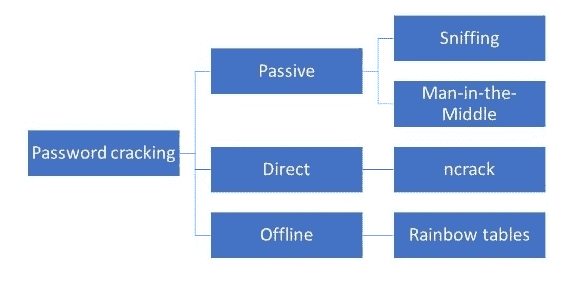

# 渗透目标

到目前为止，我们通过一些侦探工作收集了信息，扫描了目标以了解活动目标的位置和它们留下的开放端口，然后尝试通过枚举提取更详细的信息。在这个过程中，我们学到了不少，但我们仍然有更多要学习，包括关于过程和 Kali NetHunter 如何帮助我们的更多信息。我们现在正在进入实际将渗透测试中的渗透放入渗透测试的步骤，尝试获取对目标本身的访问权限。到目前为止，一切都让我们能够计划、学习和准备成功尝试进入。

我们的目标是获取主机的访问权限，如果到目前为止我们做得不错，我们积累的信息将会帮助我们。当我们获得对系统的访问权限时，有看似无穷无尽的方法可以实现这一点，但我们将把重点限制在其中一些方法上，并展示 Kali Nethunter 如何在执行这些方法时有所帮助。在这个过程的这一部分，您可以期待执行各种任务，这些任务旨在破解或恢复密码、提升权限、执行应用程序、隐藏文件、覆盖踪迹，以及以其他方式掩盖您的行动证据。这都是每天的工作，所以让我们启动 Kali Nethunter 并开始吧。

在本章中，我们将涵盖以下主题：

+   选择破解方法

+   在目标上执行应用程序

+   捕获机密信息

+   密码破解技术

+   执行应用程序

+   提升权限

+   运行后门

# 技术要求

在本章中，您将需要 Kali NetHunter（默认安装即可）。

# 关于密码

获取系统访问权限的一个常见第一步是使用您在系统上获得的帐户的密码。当然，获取这个密码是重要的，因为您必须找到一种方法来获取有效帐户的密码。这就是所谓的密码破解或密码恢复的过程发挥作用的地方。

那么，术语*密码破解*的定义是什么呢？尽管电影和电视对这个话题有所描述，但密码破解是一个用于获取这一信息的一组技术的总称。在这个过程中，您可以期待使用任何个别或组合的方法，每种方法都有其优缺点。您可以盲目猜测密码，或者您可能对系统所有者有一些信息，这可能会使猜测过程变得更容易。获取密码的其他技术可能涉及反复猜测或利用系统中的安全漏洞。

# 选择破解方法

为了让事情变得更容易，让我们把密码破解分解成几个主要类别，然后将我们的技术分类。我们将根据操作方法将技术分类，作为主要特征。请注意，每个类别和其中的技术不仅提供独特的方法，还有各自的优缺点，我们将在遇到它们时进行讨论。以下图表显示了密码破解攻击的分类：

密码破解技术的类别如下：

+   **被动技术**：这个类别中的任何攻击都是通过简单地监听和避免与目标直接交互来执行的。离线密码攻击旨在利用密码存储方式中固有的设计缺陷和缺陷。

+   **直接技术**：这种技术需要更积极和直接地与目标进行交互。这些类型的攻击可能非常有效，但被发现的风险更高。

# 被动技术

在这个第一类别中，我们有那些采用低风险方法耐心等待的技术。这个过程和最终结果的有效性取决于所采用的方法、密码的强度和目标系统。

**嗅探**是一种非常有效的获取信息的方法，因为你只需插入到网络中，打开一个嗅探器，它将观察并捕获流经数据包流的信息。这种技术之所以特别有效，是因为如果你针对的是通过不安全方法传输的凭据，比如使用较旧的网络协议（如文件传输协议（FTP）、Telnet 或简单邮件传输协议（SMTP））传输的凭据。许多这些长期存在且常用的协议因缺乏任何可感知的保护而容易受到攻击。例如，HTTP 发送的是明文信息，你可以使用诸如 Wireshark 之类的工具来嗅探数据包并查看数据包内的内容：

上图显示了嗅探器可以放置在网络上的位置。

# 中间人攻击

在嗅探的基础上，我们有**中间人攻击**（**MITM**）。当两个设备正在进行通信，第三个设备从监听状态转变为主动参与状态时，就会发生这种攻击。下图显示了中间人攻击的概念：

这种类型的攻击对捕获网络流量和协议很有用。然而，一些协议也被发现存在漏洞，比如用于保护许多电子商务和类似应用的安全套接层（SSL）。

在 Kali NetHunter 中，你会找到一些工具能够帮助你执行中间人攻击，比如 SSL 剥离和 Burp Suite。为了演示中间人攻击，让我们使用 SSL 剥离。

SSL 是一个广泛使用的标准，它诞生于 1990 年代初，并且从 1995 年起公开可用。该协议的最新版本是 SSL 3.0，于 2015 年中期被弃用，不应再使用，因为存在成功的妥协，比如公开的 POODLE 攻击。为了确保安全通信，SSL 应该被新的**传输层安全**（**TLS**）1.2 版本所取代，以保持最强大的安全级别。

所以，在我们开始实际攻击之前，让我们先了解一些细节，以便充分欣赏它。

**地址解析协议**（**ARP**）欺骗，将利用 ARP 协议（如果你还记得你的基本网络经验，它将 IP 地址与特定 MAC 地址关联起来）使我们针对的系统相信我们是路由器（而实际上并非如此）。

由于我们使用 ARP 欺骗，我们在网络上使用伪造的 ARP 消息，目的是改变系统上的 ARP 缓存。在正常情况下，当系统发送 ARP 请求时，它正在寻找与给定 IP 地址对应的 MAC 地址。当得到响应时，返回的消息将包括与请求匹配的系统的 IP 地址和 MAC 地址，然后将被缓存在请求者的系统中。当我们毒化这些缓存时，我们发送一条消息，重写缓存为不同的 MAC 地址，这将使流量以与网络所有者意图不同的方式进行路由。这将导致流量以多种不同的方式进行定向。

通过这种简单的行为，客户端将把它们的流量转发到我们的系统，我们可以在将其转发之前执行我们的中间人攻击，而不是将其发送到实际的路由器。

**流量分析**：在幕后，我们使用 SSL 剥离来检测通过我们系统流动的使用 SSL 协议的 URL 的请求。符合我们标准的流量将被拦截和修改。

**拦截和修改请求**：基本上，当涉及到 SSL 剥离检测请求时，它会剥离 SSL，然后修改请求或者简单地收集信息。

因此，如果我们把所有这些放在一起，我们就可以看到在运行**SSL 剥离**时发生了什么：

1.  攻击者通过欺骗路由器的 MAC 地址使自己看起来像路由器。

1.  客户端像往常一样向网站或其他位置发出请求。

1.  应直接发送到路由器的请求，而是发送到攻击者的模拟系统。

1.  SSL 剥离（在攻击者的系统上运行）观察流量，并寻找任何发送到使用 SSL 的位置的请求。

1.  当发出 SSL 请求时，它将被剥离其保护，并检索私人信息。

1.  然后请求重新应用其 SSL 层并转发到服务器。

1.  服务器响应并将 SSL 保护的内容发送回攻击者，攻击者剥离请求的 SSL 并收集返回的信息。

1.  然后将响应返回给客户端，客户端对此一无所知。

因此，让我们使用 SSL strip。

# 练习-使用 SSL strip

为了准备好使用 SSL strip，我们需要提前设置一些东西-幸运的是，我们已经具备了这样的技能。我们将设置以下内容：

+   IP 转发

+   IP 表重定向`80`到`8080`

+   查找网关 IP

+   查找目标 IP

+   Arpspoof

应执行以下步骤来设置 IP 转发：

1.  在终端窗口中输入以下内容：

[PRE0]

1.  设置重定向，将端口`80`的请求重定向到`8080`。在终端窗口中，输入以下命令：

[PRE1]

1.  通过在终端窗口中输入以下内容来查找路由器 IP：

[PRE2]

1.  从列表中选择一个目标。为了针对客户端进行定位，我们需要找到一个客户端并获取其 IP。您可以通过使用 nmap、嗅探或其他方式来完成此操作。一旦获得此 IP，就可以进行下一步。

1.  通过在终端窗口中输入以下内容来重定向流量通过托管 SSL Strip 的攻击计算机：

[PRE3]

1.  保持终端窗口打开。

1.  打开第二个终端窗口并保持第一个窗口打开。

1.  在第二个终端窗口中输入`sslstrip -l 8080`启动`sslstrip`；这将告诉`sslstrip`通过`-l`开关监听端口`8080`。如果回顾我们之前的步骤，我们重定向到端口 8080，因此我们正在观察流向该端口的流量。

1.  在目标系统（在*步骤 4*中找到的系统）上打开一个使用 SSL 的网站（您可以通过站点地址中的`https`来判断）。Gmail 等网站是一个例子。

1.  访问该网站并输入您的帐户或其他项目的凭据；您会注意到在 sslstrip 系统上捕获的数据。

1.  在 Kali NetHunter 系统上捕获一些流量，切换到运行 sslstrip 的窗口，并按*Ctrl* + *C*停止进程，并自动将结果写入名为`sslstrip.log`的文件。

结果可以在任何文本编辑器中打开，例如 nano。

# 主动技术

主动密码破解技术直接在目标系统上或对目标系统进行。使用这种类型的技术的缺点是增加被检测到的机会。

# 使用 Ncrack

进行此类攻击的一种方法是使用 Kali NetHunter 附带的 Ncrack 实用程序。该实用程序旨在对网络上的主机进行审计，以查找可能被利用来攻击主机或网络设备的弱密码。该实用程序基于命令行，可以使用不同组合的开关和选项来精细化破解过程。此外，该实用程序支持许多主要协议和服务，包括 RDP、SSH、HTTP(S)、SMB、POP3(S)、VNC、FTP、SIP、Redis、PostgreSQL、MySQL 和 Telnet。

# 练习-使用 Ncrack

为了使用 Ncrack，我们可以利用迄今为止在活动系统、端口扫描和用户名上收集的信息来开始工作：

1.  查找活动系统。

1.  查找 Ncrack 支持的运行服务的端口。

1.  执行对端口的横幅抓取，使用 telnet 或您选择的横幅抓取工具（如 nmap）对服务进行指纹识别。

1.  使用任何用户名，例如您从 SMTP 枚举中收集的用户名，并将它们保存到一个文本文件中。将文件保存为您可以记住的名称，例如`usernames.txt`。

1.  创建第二个文本文件，其中包含您要尝试的密码。您还可以通过查找`密码列表`或`单词列表`来从互联网上下载此文件。将其保存到一个您可以记住的文本文件中，例如`passwords.txt`。

完成后，我们可以使用 Ncrack 来查看我们能够吓唬出什么结果：

[PRE4]

在这个例子中，我们使用以下内容：

+   `-vv` 用于在命令运行时增加输出细节。

+   `-U` 用于指定要尝试的用户名文件。

+   `-P` 用于指定要使用的密码文件。

+   IP 地址和 Ncrack 支持的服务的端口。

+   `CL` 用于指定与目标同时打开的连接数。更多的连接可能会增加速度。

如果命令对某个帐户成功，你的结果将被打印在屏幕上，如下所示：

[PRE5]

正如您所看到的，用户名是`schmuck`，密码是`aesop`。

# 离线攻击

**离线攻击**不是直接针对目标进行的，而是针对攻击者的系统本身。离线密码破解非常消耗 CPU。

# 彩虹表

离线攻击功能和力量的一个非常有效的演示是通过一种称为彩虹表的技术。这种类型的攻击利用了使用给定哈希方法创建的所有不同字符组合的预计算哈希。在实践中，彩虹表将由渗透测试人员创建，他将选择创建哈希的参数。例如，定义密码的最小和最大长度的参数，以及字符集和哈希类型将被定义。结果将是一个可以用来找到正确密码的表。

那么我们如何使用表找到正确的密码呢？简单！我们从受害者的本地存储中检索一个哈希密码，或者通过嗅探从网络中捕获它。

彩虹表的缺点是必须在执行恢复密码的尝试之前生成它们。彩虹表的另一个失败是，尝试恢复的密码越长，生成的表越大，生成它所需的时间就越长。

# 练习 - 创建彩虹表

利用彩虹表破解方法的第一步是实际创建表本身。为此，我们将使用`rtgen`来生成我们指定的参数的表。

# 练习 - 使用 rtgen

要使用`rtgen`命令，我们必须打开一个终端窗口并提供所需的参数。以下是`rtgen`提供的选项列表：

[PRE6]

如果我们想生成一个彩虹表，我们输入：

[PRE7]

在创建彩虹表时，每个表都是针对给定的哈希类型，例如 MD5 或 SHA1。`rtgen`程序支持许多哈希算法，例如 MD5 和 SHA1。

在前面的例子中，我们生成了 SHA1 彩虹表，这将加快破解 SHA1 哈希的速度。

命令执行后，您将在执行命令的文件夹中留下扩展名为.rt 的文件。下一步是使用以下命令对文件进行排序：

[PRE8]

这将在我们使用它们之前对文件进行排序。

现在我们将使用以下命令恢复密码。这是第一个：

[PRE9]

或者，您可以使用此命令：

[PRE10]

此命令将尝试恢复提供的哈希密码。

# 将它们放在一起

要成功破解密码，您必须有一个计划；仅仅通过不同的技术来尝试可能会取得“成果”，但更有可能不仅不成功，而且可能在过程中被检测到。因此，让我们考虑一种策略，以利用我们在 Kali NetHunter 中强大的工具。

首先，您应该了解，您尝试破解密码的哈希很可能存在于不同的位置，这取决于您的方法和目标环境。

在使用 Microsoft Windows 的环境中，这些位置是 SAM 文件，它存在于本地计算机文件系统中，也存在于 Active Directory 中，如果环境使用域。

那些基于 Linux 或 UNIX 环境的环境通常将它们的哈希存储在完全不同的位置。这些系统将它们的哈希存储在一个名为`/etc/shadow`的位置，这也是在本地文件系统上。

在这两种情况下，哈希是一种单向加密，为每个密码生成唯一的输出或指纹。当然，尽管哈希是不可逆的，我们已经解释过彩虹表可以用来查找生成哈希的内容；然而，还有一个问题没有解决。这个问题是有多种哈希算法，相同的输入会在每种算法上产生不同的结果。因此，我们需要在走得太远之前确定哈希算法；幸运的是，我们有办法做到这一点。

例如，基于 Linux 的系统使用众所周知的 MD5 算法，而 Windows 系统使用 HMAC-MD5，一些其他技术使用 SHA1、MD4、NTLM 等。

一种方法是使用 Kali NetHunter Linux 中的一个工具，称为 hash-identifier。这个工具可以通过在 Kali NetHunter 中打开命令提示符并输入以下命令来运行：

[PRE11]

hash-identifier 工具将尝试识别哈希并列出可能的类型。

另一个选择是使用 John the Ripper 密码破解工具（也包含在 Kali NetHunter 中）。然而，在其他流行的密码破解工具中，自动检测不是一个选项，因此需要指定哈希类型，因此需要 hash-identifier。

# 练习-使用 hashcat 恢复密码

让我们使用 Kali NetHunter Linux 和 hashcat 来恢复我们的第一组密码。**Hashcat**被认为是最快的基于 CPU 的密码恢复工具之一。虽然最初是专有的，但现在这个软件完全免费，不仅在 Linux 中广泛使用，在 OS X 和 Windows 中也广泛使用。它还配备了一个可以利用系统的 CPU 的版本，但也有能力利用更快的图形处理单元（GPU）。hashcat 支持的哈希算法的例子包括 Microsoft 的 LM 哈希、MD4、MD5、SHA 系列、Unix Crypt 格式、MySQL、Cisco PIX。

要在 Kali NetHunter 中启动密码破解过程，请转到`应用程序` | `Kali NetHunter Linux` | `密码攻击` | `离线攻击` | `hashcat`。

这将打开一个带有一些帮助信息的终端窗口。

在屏幕顶部，您将看到 hashcat 的语法：

[PRE12]

其中一些最重要的是-m（哈希类型）和-a（攻击模式）。

让我们分析 hashcat 的语法和重要的选项，这些选项可以用来定制和调整使用 hashcat 进行破解的过程。这些规则可以接受您创建的单词列表文件，并应用大写规则、特殊字符、单词组合以及附加和前置数字。这些技术中的每一种都会增加破解更复杂密码的可能性。事实上，hashcat 将允许您定制用于尝试在目标上恢复密码的自定义字符集和选项。

您还将被要求选择正在破解的哈希类型。如果您知道您正在瞄准的系统上的哈希类型，或者已经使用了哈希标识符，那么可以这样做。

最后，我们必须选择我们要尝试破解的哈希类型。Hashcat 给了我们很多选择。当准备好瞄准哈希时，您将从 hashcat 呈现的列表中选择（按编号）正在瞄准的哈希类型。

您可以从网上下载一个单词列表，或者您可以使用 locate 命令在您的 Kali NetHunter 系统中搜索内置的单词列表。您可以使用以下语法来做到这一点：

[PRE13]

一旦我们准备好了 hashcat 和一个单词列表，我们可以通过以 root 用户登录并查看`/etc/shadow`来获取一些哈希。在 Linux 中，可以这样做：

[PRE14]

一旦执行了这个命令，我们就可以看到带有哈希的 shadow 文件。

有了这些信息，现在我们需要确定系统使用的是什么类型的哈希。幸运的是，我们可以通过发出以下命令相当容易地做到这一点：

[PRE15]

通过按 Enter 键向下滚动文件约 80%，直到看到一个标记为`ENCRYPT_METHOD`的条目，其后通常是 SHA512 的值。这很重要，因为 hashcat 将需要这些信息来显示哈希。

有了哈希的位置信息以及系统使用的哈希算法的知识，现在可以开始破解哈希的过程了。

首先，我们想把哈希放入一个我们将命名为`hash.lst`的文件中，我们通过发出以下命令来创建这个文件：

[PRE16]

为了确保一切都被复制过去，让我们发出以下命令：

[PRE17]

如果一切顺利完成，您应该看到哈希已经按预期复制到`hash.lst`文件中。

在我们尝试破解此文件中的哈希之前，我们需要剥离一些信息以清理一下。基本上，我们将删除任何不是哈希的东西。默认情况下，文件将包括用户名信息，在此过程中不需要。

为了确保这个过程将会成功，您需要删除用户名和紧接用户名的冒号。在您删除了这个之后，您将删除一切：去到行的末尾并删除任何以冒号开头的东西。为了进一步解释，让我们考虑以下截图：

我们需要清理一下，只显示高亮的哈希值：

在最后一步，您现在可以开始破解哈希的过程了。以下是启动此过程的命令：

[PRE18]

+   `-m 1800`指定了我们要破解的哈希类型（SHA-512）。

+   `-a 0`指定了字典攻击。

+   `-o cracked.txt`是破解密码的输出文件。

+   `--remove`告诉 hashcat 在破解后删除哈希。

+   `hash.lst`是我们的哈希输入文件。

+   `/usr/share/sqlmap/txt/wordlist.txt`是我们用于此字典攻击的单词列表的绝对路径。

一旦破解过程开始，您可以通过按下*Enter*键来查看进展情况。这个过程将需要不同的时间，这取决于您的安卓设备的性能以及同时运行在系统上的其他内容。

# 执行应用程序

在本节中，我们将讨论如何远程运行应用程序以及您可以利用这种能力做些什么。

作为渗透测试人员，您应该对此时将要做的事情有一个很好或明确的想法，比如运行一个应用程序或执行。需要执行以下任务：

+   **后门**：在入侵系统后，黑客会在受损的计算机中创建多个入口。这是为了确保攻击者始终有一种方式进入计算机，无论是出于远程访问目的还是为了外泄数据。这就是所谓的后门。后门通常是当特洛伊木马病毒安装在主机计算机上时创建的。

+   **键盘记录器**：这是一种软件或硬件设备，具有从用户键盘记录按键的能力。

# 提升权限

在入侵操作系统（如 Windows）之后，您将在系统上拥有有限的特权。这意味着如果您尝试执行某些命令或运行应用程序，内置安全性将拒绝此类操作。如果您能够破坏用户帐户，它可能也是一个具有有限特权的标准用户。作为渗透测试人员，我们希望能够在受害机器上执行任何命令和应用程序，而不受任何限制。

因此，根据渗透测试的目标，您可能需要在 Windows 环境中获得"管理员"特权，或者在基于 Linux 的系统上获得 root 级别访问权限。

# 在目标上执行应用程序

一旦获得访问权限并获得足够的特权，就该执行受害者上的应用程序了。在这一点上执行哪些类型的应用程序或操作是您需要决定的，但您可以做的事情非常多。

# 练习-使用 Netcat 种植后门

**Netcat**就像 TCP/IP 堆栈中的瑞士军刀。它是一个非常受欢迎的网络工具，为网络和安全专业人员提供了许多功能；其中一些功能包括以下内容：

+   能够在网络上传输数据

+   能够传输文件

+   打开服务端口

+   进行端口扫描和横幅抓取

Netcat 并不特定于操作系统；它适用于 Windows 和 Linux 平台。在本节中，我们将看一些 Netcat 的例子和用法。

要连接到另一台机器，请执行以下操作：

[PRE19]

要监听入站连接，请发出以下命令：

[PRE20]

只需用远程系统上的任何未使用的有效端口替换端口号。

在您希望连接的系统上运行以下命令：

[PRE21]

这个命令表示要联系远程系统，然后连接到您告诉`nc`在远程系统上监听的端口。

让我们再深入一点。

现在让我们在目标系统上创建一个后门，我们可以随时使用。根据您是否针对 Linux 或 Windows 系统，命令会略有不同。

对于 Windows，我们使用以下命令：

[PRE22]

对于 Linux，我们使用这个：

[PRE23]

在这两个命令中，使用-e 开关来在连接到命令 shell 时执行命令。这意味着我们将在本地获得一个 shell，我们可以用它来向远程系统发送命令。然后，在我们的攻击系统上，我们输入以下内容：

[PRE24]

在这一点上，如果您成功执行了命令，您将看到一个命令提示符，允许您与远程系统进行交互。

Netcat 也可以用于从目标中转移文件和数据。我们可以使用隐蔽连接将数据慢慢复制到我们的本地系统。在这个例子中，我们将转移一个名为`passwords.xls`的文件，可能是一个包含密码的 Excel 文件。

从源系统，我们输入以下内容：

[PRE25]

这个命令表示要显示`passwords.xls`文件，然后将其管道(`|`)到 netcat (nc)到`192.168.1.104`远程 IP 地址通过端口`6996`。

从目标系统，我们输入以下内容：

[PRE26]

这个命令表示要在端口(`p`)`6996`上创建一个监听器(`l`)，然后将在此监听器上接收到的数据发送到名为`passwords.xls`的文件中。

# 总结

我们开始时看了如何利用在前几步中收集的有关目标的信息。在前几章中收集的信息是通过与目标的直接交互来逐渐增加的。我们的目的是获得更多信息，以便在尝试更少侵入性的情况下利用系统。

通常我们会先破解或恢复密码，以获取账户访问权限，然后尝试通过特权升级来获得对系统的额外访问权限。有了这种增加的访问权限，就有可能执行更具侵入性的任务。攻击者通常可能尝试执行的常见操作包括安装软件、安装远程软件，或者创建其他后门以便以后访问。

在下一章中，我们将学习如何清除痕迹并从目标系统中删除证据。

# 进一步阅读

请参考 Kali Linux/Kali NetHunter 工具列表：[`tools.kali.org`](http://tools.kali.org)。
