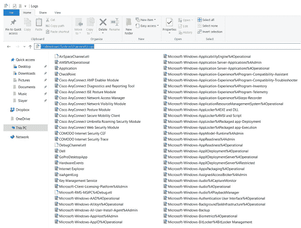
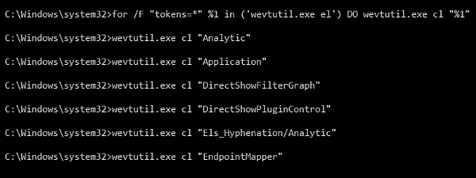

# 第八章：清除目标上的痕迹和移除证据

渗透测试过程中最重要的一个方面是确保系统上没有任何被入侵的痕迹。就像黑客一样，你的目标可能是入侵目标系统或网络，然而，在终止连接或退出受害者系统时，确保没有任何日志或残留数据留下是非常重要的。此外，在渗透测试期间，可能会生成额外的数据，这些数据会在系统和网络上留下痕迹。

在本章中，我们将涵盖以下主题：

+   清除 Windows 上的日志

+   清除 Linux 上的日志

+   从目标中删除文件

让我们深入研究一下！

# 清除痕迹

网络安全领域正以指数级增长；需要专业人员来帮助打击和保护组织和公民免受网络威胁和威胁行为者的需求非常高。网络攻击可以是任何来自网络钓鱼邮件、恶意软件感染，甚至勒索软件攻击；网络安全组织和认证机构，如 EC-Council 和 GIAC，认识到数字世界中取证对于调查是多么重要，以确定发生了什么事情，攻击是如何发生的，威胁行为者等等细节，这些都可以帮助检察机关在法庭上进行起诉。

在网络安全领域，安全事件是由组织的系统或网络触发的事件，表明存在被入侵的迹象。安全事件的一个例子是员工计算机上运行的恶意文件。反恶意软件保护软件将检测并触发警报以进行调查。

数字取证领域为许多新工作打开了大门，例如第一响应者、事件处理者、网络取证调查员和恶意软件研究员。这些职称都有一个共同的目标：确定系统是如何被威胁行为者入侵的。对于系统上的任何操作，无论是用户还是应用程序，都会生成并存储系统日志消息以供核算目的。在取证调查期间，检查员通常会尝试从系统中检索日志。日志消息将指示安全事件的整个历史。

# 日志类型及其位置

在本节中，我们将讨论渗透测试人员应考虑删除的各种类型的日志以及这些日志的位置。

# DHCP 服务器日志

这些日志保留了网络上 IP 地址分配的记录。此日志存储了潜在的 DHCP 客户端和 DHCP 服务器之间发生的所有交易。最重要的是，客户端的**媒体访问控制**（**MAC**）地址将存储在日志消息中。以下是 DHCP 服务器日志的位置：

+   Windows 系统中的 DHCP 日志存储在`%SystemRoot%\System32\dhcp`目录中。

+   在 Linux 上，要查看 DHCP 日志，我们可以使用`cat /var/log/syslog | grep -Ei 'dhcp'`命令。

# Syslog 消息

当组织内发生网络攻击时，无论是中间人攻击还是系统充当僵尸机器并成为僵尸网络的一部分，都会进行调查。取证调查员不仅对计算机、笔记本电脑和服务器进行调查和分析，还对网络进行调查。对于网络上发生的每个会话或交易，诸如防火墙、入侵检测/防御系统（IDS/IPS）和其他网络安全设备都会为所有流量生成日志。设备使用**Syslog**协议和框架以统一格式生成日志消息，其中包含网络专业人员所需和理解的所有必要细节。

在 Linux 系统上，Syslog 位于`/var/log/syslog`。

# 数据包分析

此外，深入研究网络取证，调查员进行数据包分析，观察网络段上的任何异常情况。数据包分析允许调查员确定以下内容：

+   攻击来源

+   上传和下载的文件

+   网络上的流量类型

+   攻击时间

+   提取的文物，如文件

+   URL 和域名

+   攻击期间的受害机器

+   遥测信息

# Web 服务器日志

这些日志存储了 Web 服务器和客户端 Web 浏览器之间的所有 Web 活动的日志消息。以下是每个 Web 服务器的位置：

+   **Internet Information Server** (**IIS**)日志文件位于`%SystemDrive%\inetpub\logs\LogFiles`。

+   Red Hat、CentOS 和 Fedora 中的 Apache 日志存储在`**/**var/log/httpd/access_log`和`/var/log/httpd/error_log`中。

+   对于 Debian 和 Ubuntu 系统，Apache Web 服务器日志可以在`/var/log/apache2/access_log`和`/var/log/apache2/error_log`中找到。

+   FreeBSD Apache 日志位于`/var/log/httpd-access.log`和`/var/log/httpd-error.log`。

# 数据库日志

在渗透测试期间，您可能会被要求操纵目标数据库，无论是创建、修改、删除还是提取信息。在这样做的过程中，数据库会生成自己的一套日志消息。

Microsoft SQL Server 的数据库日志可以在`\\Microsoft SQL Server\MSSQL11.MSSQLSERVER\MSSQL\DATA\*.MDF`和`\\Microsoft SQL Server\MSSQL11.MSSQLSERVER\MSSQL\DATA\*.LDF`找到。调查人员可以检查数据库的错误日志以查找任何可疑活动，这些可以在`\\Microsoft SQL Server\MSSQL11.MSSQLSERVER\MSSQL\LOG\ERRORLOG`找到。

# 事件日志

事件日志是对系统上采取的行动的记录，无论是否有用户干预。事件日志记录了用户是否成功访问系统或登录尝试失败的安全日志，应用程序日志记录了操作系统上启动或终止程序的情况。事件日志记录了系统上发生的一切，从开机到关机。

在 Windows 10 操作系统中，事件日志存储在注册表中的以下位置：

`HKLM\System\ControlSet00x\Services\EventLog`

要查看 Windows 10 上可用的事件日志列表，使用`wevtutil el`命令：

此外，使用`wevtutil gl <name of log>`命令将呈现所选日志的配置信息：

此外，Windows 系统日志存储在本地系统的`C:\Windows\System32\winevt\Logs`中：

简单地修改或删除这些位置存储的日志文件将对取证调查团队构成挑战；难以确定攻击的实际顺序，并降低被抓到的机会。

# 在 Windows 上清除日志

在 Windows 操作系统中，**Event Viewer**是一个应用程序，它在一个仪表板中呈现了所有**Application**、**Security**、**Setup**和**System logs**。要访问**Event Viewer**，点击**Start** | **Windows Administrative Tools** | **Event Viewer**：

在 Windows 上打开**Event Viewer**的另一种方法是，只需在键盘上按 Windows + *R*，打开**Run**提示，然后键入`eventvwr.msc`并单击**OK**。

从**Event Viewer**窗口，可以通过在**Action**窗格上选择**Clear Log**功能来清除日志。要清除特定类别的日志，例如所有位于**Application**组中的日志，只需右键单击组名，然后选择**Clear Log**。

# 使用 PowerShell 在 Windows 上清除日志

PowerShell 是一个非常强大的命令行界面，可以让系统管理员在 Windows、MacOS 和 Linux 操作系统上快速执行和自动化操作和任务。

首先，点击 Windows 图标，即桌面左下角的开始图标，然后键入`powershell`。Windows PowerShell 应用程序将出现，只需点击它以进行操作，如下图所示：

确保您以**Windows PowerShell**管理员身份运行。以管理员权限运行程序或应用程序将消除标准用户遇到的任何限制。这些限制将包括安全权限。

现在，让我们做一些练习来清除日志：

+   **练习 1：清除所有事件日志**

使用`wevtutil el | Foreach-Object {wevtutil cl “$_”}`命令将清除 Windows 上的事件日志：

执行命令后，日志现在已被清除，如**事件查看器**中所见：

+   **练习 2：从计算机中清除特定日志**

`Clear-EventLog`命令允许管理员清除/擦除特定事件类别的所有日志消息。使用此命令的语法是`Clear-EventLog <LogName>`：

如果您回忆起，使用`wevtutil el`命令将为您提供系统上日志类别的列表。

使用`Get-Help`参数后跟`Clear-EventLog`cmdlet 将为您提供其他选项：

我们已经完成了 PowerShell 练习。接下来我们将看看如何使用命令提示符来清除下一节中的日志。

# 使用命令提示符在 Windows 中清除日志

在本节中，我们将看看如何使用命令提示符来清除 Windows 操作系统上的日志：

+   **练习 1：清除单个日志**

以前，我们在 Windows 命令提示符上使用`wevtutil el`命令来查看日志类型/类别的列表。我们可以使用`wevtutil cl`后跟特定日志来擦除/清除日志类别中的条目：

此外，`clear-log`语法可以用作`cl`的替代：

+   **练习 2：使用单个脚本清除所有日志**

当我们运行`wevtutil el`命令时，我们看到了一个很长的事件日志类别列表。然而，清除每个类别是非常耗时的，因此在执行时使用以下脚本清除每个类别：

[PRE0]

如前面的屏幕截图所示，在执行我们的命令后，每个日志文件都被清除了。在下一节中，我们将讨论在 Linux 中清除日志的方法。

# 在 Linux 中清除日志

与所有操作系统一样，Linux 系统上也会生成和存储日志。日志文件是系统上发生的所有活动的记录。以下是 Linux 日志文件的一般位置：

以下是 Linux 系统上的其他日志位置：

+   **示例 1：使用 null 清除日志**

在这个例子中，我们将使用 null，一个不存在的对象，来删除文件的内容。我们将清除 Linux 系统上 Apache `access.log`文件的日志。空对象是操作系统中没有任何属性或特征的实体。

要发现文件的位置，请使用`locate`命令后跟文件名。在这个练习中，我们使用`locate access.log`命令来显示包含`access.log`字符串序列的所有文件的位置：

此外，我们可以使用`locate apache2 | grep “access.log”`命令来发现属于 Linux 包的文件并过滤我们的搜索。

接下来，我们将使用`cat`命令后跟文件路径来确定是否有任何日志条目：

正如我们所看到的，前面的屏幕截图中包含了`access.log`文件中的条目。此外，我们使用`du –sh <filename>`命令来确定文件大小；如果是 0 KB，则文件为空，如果文件大小大于 0 KB，则文件包含条目：

现在我们将使用`cd /var/log/access.log`命令切换到`access.log`文件的位置，并将 null 重定向到文件：

如果我们再次对文件使用`cat`命令，我们会看到没有条目，文件大小为 0 KB：

+   **练习 2：使用 True 实用程序清除日志**

另一种清除/删除文件中日志的技术是使用`True`实用程序。我们已经向我们的 Web 服务器生成了一些流量，如下面的屏幕截图所示：

目前，我们的文件大小为 8 KB：

使用`true`命令后跟文件名或带有文件的路径将擦除条目：

`true`命令/实用程序有一个描述，说它不做任何工作或什么都不做，成功。

我们现在可以验证文件中没有条目，文件大小为 0 KB：

+   **使用 Meterpreter 清除 Windows 日志**

在 Metasploit 框架中，存在一个非常先进和动态可扩展的有效载荷，称为**Meterpreter**。在渗透测试的利用阶段使用这个实用程序，它将允许您在目标系统上执行分段有效载荷，这可以在目标系统和攻击者的机器之间创建绑定甚至反向 shell。

Metasploit 是由 Rapid7 创建的一个开发框架（[www.rapid7.com](http://www.rapid7.com)）。它允许渗透测试人员收集有关目标的信息，发现漏洞，创建和传递利用和有效载荷到目标，并创建后门。这就像一个渗透测试人员的工具包，用于发现和利用漏洞。

Meterpreter 旨在具有隐秘性、强大性和可扩展性。一旦成功利用了系统，您可以使用`clearev`命令清除以下日志：`Application`，`System`和`Security`：

如前面的屏幕截图所示，Meterpreter 正在清除目标系统上每个类别的日志。清除的条目数也列出。

# 总结

在本章中，我们讨论了在渗透测试期间保持隐秘的方法，同时模拟对目标系统和网络的攻击。我们讨论了各种类型的日志及其位置。此外，我们看了一些场景，我们在其中使用各种技术清除了 Windows 和 Linux 操作系统上的日志。

在下一章中，我们将介绍*数据包嗅探和流量分析*。我们将使用不同的技术来捕获流量，并使用各种工具进行分析，以获取机密信息。
