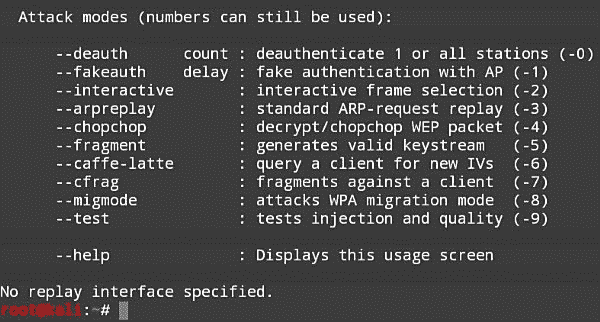
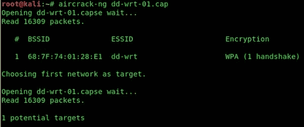
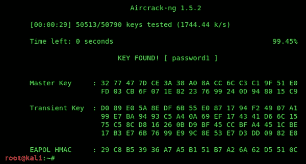

# 第十一章：

十年前，世界上没有那么多移动设备。那时，只有笔记本电脑使用无线网络技术，直到智能手机行业起步。现代组织正在采用“自带设备”（BYOD）概念，即组织允许员工安全地连接他们的个人移动设备，如智能手机、平板电脑或笔记本电脑，到企业网络，这将提高整体生产力。

随着越来越多的移动设备进入企业网络，这引发了一些安全问题，威胁着企业无线和有线网络基础设施的安全姿态。此外，无线网络设备（如接入点（AP）或无线路由器）的配置可能不符合公司的标准。有时，网络管理员可能会忘记应用安全配置，或者仅仅使用默认设置在生产网络中部署设备。

在本章中，我们将讨论以下主题：

+   无线网络类型

+   无线标准

+   

+   无线加密标准

+   无线威胁

+   在“独立基本服务集”（IBSS）中，这种设计/拓扑中没有接入点或无线路由器。每个客户端设备都通过 IEEE 802.11 标准与其他设备建立连接。这被称为自组织网络：

+   蓝牙黑客

在无线网络出现之前，每个设备都需要一根物理电缆，将设备的网络接口卡（NIC）连接到网络交换机，以便与其他设备通信和共享资源。使用有线网络的主要限制是，诸如计算机或服务器等终端设备受到网络电缆长度的限制。与大多数类别（CAT）电缆一样，如 CAT 5、5e 和 6，最大电缆长度为 100 米。此外，不得不携带非常长的电缆四处移动有时对某些用户来说太令人沮丧了。

IEEE 802.11 标准的创建，使用无线电信道，为现代无线网络铺平了道路。

以下是使用 IEEE 802.11 无线网络的一些优势：

+   它消除了需要为每个终端设备布线的需求

+   它为难以铺设网络电缆的区域提供网络连接

+   它允许设备在接入点（AP）或无线路由器的范围内漫游

然而，使用无线网络也会引发一些问题。以下是使用 IEEE 802.11 的一些缺点：

+   由于安全漏洞，无线加密可能会被破解

+   无线网络的带宽通常低于有线网络

+   无线认证模式

+   信号随距离减弱

# 无线网络拓扑

在本节中，我们将讨论各种类型的无线网络拓扑。在攻击无线网络之前，渗透测试人员应该了解无线网络设计以及客户端如何相互连接。

# 独立基本服务集

受其他无线发射设备的干扰

无线攻击

# 基本服务集

在“基本服务器集”（BSS）设计中，所有客户端都通过无线路由器或接入点相互连接。无线路由器或接入点负责在客户端和有线网络之间传输网络流量。这种类型的拓扑也被称为基础设施模式：

# 扩展服务集

“扩展服务集”（ESS）模式与 BSS 非常相似。在 ESS 中，有多个接入点或无线路由器连接到同一有线网络。这种设计对于在建筑物或园区内延伸无线信号非常有用，允许用户在漫游时访问网络内的资源：

针对无线设备和网络

# 无线标准

**电气和电子工程师学会**（**IEEE**）在计算和信息技术行业内制定了许多标准。一个非常受专业人士欢迎的标准是 IEEE 802.11 标准，该标准规定了无线通信在 2.4 GHz 和 5 GHz 频率上的操作方式。普通消费者则以另一个名称了解这项技术：Wi-Fi。

以下表格概述了 IEEE 802.11 标准的不同变体，以及它们的操作频率和最大带宽容量：

如果您的目标是在 5 GHz 频率上运行的无线网络，而您的无线网络适配器使用的是标准频率，即仅在 2.4 GHz 上运行，您将无法成功对目标网络执行任何攻击。

# 服务集标识符

**服务集标识符**（**SSID**）通常被称为无线网络的名称，它被笔记本电脑、智能手机和其他移动设备所看到。 SSID 用于帮助我们区分一个特定的网络与另一个网络。接入点或无线路由器通过广播消息不断地广告其 SSID，而客户端（如笔记本电脑）捕获这些广播消息（更为人所知的是信标）以获取其中包含的 SSID。

SSID 通常是人类可读的文本或最大长度为 32 字节的字符。以下是安卓平板电脑发现的 SSID 示例：

# 无线认证模式

在无线网络上，客户端设备通常有三种不同的方式可以对无线路由器或接入点进行认证：

+   开放认证

+   共享密钥认证

+   集中式认证

开放认证系统非常简单。无线路由器或接入点未配置密码，只是向附近的所有人广播其 SSID。希望连接的客户端可以自由连接，无需在获得无线网络访问权限之前提供任何凭据或身份。开放认证的一个例子是公共区域和场所（如咖啡店）中的免费热点服务。

在共享密钥认证系统中，无线路由器或接入点配置了预共享密钥（PSK）。这种方法允许客户端只有在能够提供正确密钥的情况下才能连接到无线网络。没有适当密钥的客户端将被拒绝访问。这种方法在家庭网络中最常见。

在集中式认证中，使用集中式认证服务器来管理网络用户帐户、权限和计费。无线路由器或接入点未配置秘密密钥，而是与集中式认证系统通信，以查询无线网络上的每次登录尝试。假设用户想要将其笔记本电脑连接到无线网络，因此他们选择适当的 SSID 并尝试连接。无线路由器向用户发送登录请求。用户被提示输入他们的网络用户凭据；然后无线路由器将登录凭据发送到认证服务器进行验证。如果通过，认证服务器告诉无线路由器允许访问并为用户分配某些特权。如果帐户无效，认证服务器告诉无线路由器不要授予网络访问权限。这种方法通常在企业网络中找到：

**远程认证拨号用户服务（RADIUS）**和**终端访问控制器访问控制系统加强版（TACACS+）**都是集中式认证服务器的例子。

# 无线加密标准

作为渗透测试人员，了解各种无线加密及其标准是很重要的。

# 有线等效隐私

**Wired Equivalent Privacy**（**WEP**）标准是在 IEEE 802.11 网络中实施的第一个加密标准。它旨在在接入点和客户端之间的所有无线通信中提供数据机密性。WEP 使用**RC4**加密密码/算法来确保传输过程中的机密性；然而，WEP 加密标准使用**24 位初始化向量（IV）**。在这种情况下，IV 用于为 RC4 加密算法创建密码流。

以下是 WEP 的各种密钥大小：

+   64 位 WEP 使用 40 位密钥

+   128 位 WEP 使用 104 位密钥

+   256 位 WEP 使用 232 位密钥

WEP 多年来以其设计缺陷而闻名，并且在应用于 IEEE 802.11 网络时被认为是安全漏洞。

# Wi-Fi Protected Access

**Wi-Fi Protected Access**（**WPA**）是为 IEEE 802.11 网络设计的另一种加密标准，是 WEP 标准的后继者。WPA 利用**暂态密钥完整性协议**（**TKIP**），使用**RC4**密码（每个数据包 128 位）进行数据加密（机密性）。然而，TKIP 通过简单地增加**初始化向量**（**IVs**）的大小并混合它们的功能来减轻了 WEP 的漏洞。**128 位暂态密钥**与客户端设备的**媒体访问控制**（**MAC**）地址和 IVs 相结合，然后用于数据加密。

# Wi-Fi Protected Access 2

**Wi-Fi Protected Access 2**（**WPA2**）是 IEEE 802.11 无线网络的 WPA 加密标准的后继者。该标准使用**高级加密标准**（**AES**），比 RC4 加密密码套件更优越。AES 提供更强的数据块加密以确保数据机密性。此外，WPA2 应用**计数器模式与密码块链接消息认证码协议**（**CCMP**），比 TKIP 更优越。CCMP 使用 128 位密钥进行数据加密，以与 AES 一起提供机密性，从而创建 128 位数据块。

有关无线安全标准的更多信息可以在 Wi-Fi 联盟网站上找到：[`www.wi-fi.org/discover-wi-fi/security`](https://www.wi-fi.org/discover-wi-fi/security)。

# 无线威胁

在使用无线网络时存在以下安全威胁：

+   **Rogue access point**：有时，渗透测试人员需要检查公司无线网络的安全状况和员工的安全意识。**Rogue access point**是指渗透测试人员设置一个*假*接入点，带有一个 SSID 来欺骗用户建立连接。想象一下，在一个**Rogue access point**上创建一个名为*Company XYZ VIP Access*的 SSID，并将其保持开放。看到这个名字的很多人会认为这个无线网络上有特殊资源。这种技术将允许渗透测试人员轻松地嗅探流量并获取敏感数据。

+   **Evil twin**：**Evil twin**设置与**Rogue access point**配置有些相似。然而，使用**Evil twin**，渗透测试人员在企业网络中部署一个接入点，使用与实际组织相同的 SSID。当用户连接时，他们将能够访问本地资源，而不会意识到他们已连接到未经授权的接入点。这将允许渗透测试人员轻松地拦截和嗅探流量。

+   **AP 和客户端 MAC 欺骗**：渗透测试人员可以记录接入点和关联的客户端的 MAC 地址。捕获这些信息将允许渗透测试人员模仿接入点欺骗受害者连接，或者使用客户端的 MAC 地址与启用 MAC 过滤功能的接入点建立连接。

+   **去认证攻击**：渗透测试人员向接入点发送特制的数据包，目的是在接入点和其连接的客户端设备之间创建一个取消关联。简而言之：去认证攻击将导致接入点踢掉一个或多个客户端。这种攻击还有以下好处：

+   发现隐藏的 SSID。这是通过监视客户端设备发送的探测包及其与接入点的关联来完成的。

+   捕获用于破解无线网络密码的 WPA2 握手。

# 无线攻击

对于以下大多数攻击，我们将使用 aircrack-ng 套件工具来帮助我们实现我们的目标。

**Aircrack-ng**可以在[www.aircrack-ng.org](http://www.aircrack-ng.org)找到。

# 练习-检查无线网卡是否支持注入

确定您的无线网卡是否支持数据包注入的一种快速简便的方法是使用`aireplay-ng`工具。使用`aireplay --test <*interface*>`命令将测试数据包注入。

以下是使用该命令的演示。如您所见，我们的网卡支持数据包注入：

此外，可以使用`-9`参数代替`--test`。

如果您仔细观察输出，您会看到每个接入点的数据包丢失比例。

# 练习-检测接入点及其制造商

我们可以检测到 Kali NetHunter 设备范围内的每个接入点。我们将能够确定以下内容：

+   接入点的 MAC 地址或 BSSID

+   通过显示 PWR 值来显示其信号评级

+   其加密标准、密码和认证方法

+   网络名称或 ESSID

要开始，请确保您的无线网络适配器处于监控模式。在启用监控模式之前，我们需要确保没有任何可能妨碍此过程的进程。因此，我们使用以下命令来终止任何此类进程：

[PRE0]

现在我们可以使用以下命令将我们的网络适配器配置为监控模式：

[PRE1]

您的设备将开始在空中捕获信标和探测包：

按下键盘上的*A*键将允许您循环浏览各种过滤器。这些过滤器包括仅查看接入点、仅查看客户端、仅查看接入点和客户端，最后，仅查看接入点、客户端和确认消息。

让我们确定一个产品的制造商，可以帮助研究有关特定供应商产品的已知漏洞。**airodump-ng**工具将识别特定制造商的接入点，我们可以使用`airodump-ng <*interface*> --manufacturer`命令来实现这一点：

# 练习-发现接入点的 WPS 版本

在这个练习中，我们将在 Kali NetHunter 上使用**airodump-ng**工具的附加参数。使用`--bssid`语法指定要定位的接入点，`-c`告诉无线网络适配器监听特定信道，将帮助我们监视特定的无线网络。我们将使用`--wps`来指示目标接入点的 WPS 模式和版本：

[PRE2]

运行上述命令后，我们将得到以下输出：

执行我们的命令后，我们得到以下结果：

我们可以看到这个接入点已启用 WPS 并且正在使用版本 2。

# 练习-去认证攻击

去认证攻击只是试图将所有关联/连接的客户端从接入点踢出。在这个练习中，我们将使用**aireplay-ng**工具来帮助我们完成我们的任务：

1.  确保您的无线网卡处于监控模式。

1.  使用**airodump-ng**获取您的目标的 BSSID。

1.  使用`aireplay -0 0 –a <*目标的 BSSID*> <*监控接口*>`命令向目标接入点发送持续的去认证帧流。结果将使所有连接的客户端从网络中断开：

aireplay-ng 工具支持许多攻击模式。以下截图来自 aireplay-ng 的*手册*页面：

# 练习-去认证特定客户端

如果你在无线网络上针对特定客户端，我们可以使用以下命令向接入点发送去认证帧，但只断开指定的客户端。

使用`airodump-ng --bssid <*目标的 BSSID*> -c <*频道号*> <*监控接口*>`命令来主动监视目标网络：

如你所见，有一些与接入点关联的站点（客户端）。让我们尝试客户端解关联：

[PRE3]

+   `-0`表示我们正在执行去认证攻击。

+   `0`具体指持续攻击。如果使用`2`，这意味着只向目标发送 2 个去认证消息。

+   `-c`允许你指定一个特定的站点（客户端设备）进行去认证。如果没有这个参数，攻击将使与接入点关联的所有客户端解关联。

运行上述命令后，我们将得到以下截图：

# 练习-检测去认证攻击

在本书的前面，我们看过了一个叫做**tcpdump**的神奇工具来捕获网络流量。使用这个工具的另一个好处是检测去认证攻击。由于攻击发生在空中，我们将能够看到它并确定其目标。

为此，我们可以使用`tcpdump -n -e -s0 -vvv -i wlan0 | grep DeAuth`命令。

+   `-n`指定不解析 IP 地址

+   `-e`表示打印 IEEE 802.11 和以太网流量类型的 MAC 地址

+   `-v`表示详细程度

+   `-i`指定接口

运行上述命令后，我们将得到以下输出：

上述截图中显示的 BSSID 表示受害者接入点。如果这是你的接入点，这表明你正受到黑客的攻击。

# 练习-发现隐藏的 SSID

许多组织倾向于在接入点上禁用其 SSID 的广播。十多年前，我们认为这是无线网络的安全配置。然而，通过先进的渗透测试工具和技术，渗透测试人员或安全审计员可以在几分钟内发现任何隐藏的 SSID。作为渗透测试人员，如果目标的无线网络对移动设备隐藏，你需要执行以下步骤：

1.  在无线网络适配器上启用监视模式。

1.  使用`airodump-ng <*监控接口*>`命令来显示所有附近的 ESSIDs。注意有一个网络的名称格式不寻常，`<length: 6>`。这表示接入点已禁用了 SSID 的广播：

1.  监视特定接入点，以确定是否有任何关联或连接的客户端。使用以下命令：

[PRE4]

运行上述命令后，我们将得到以下输出：

正如我们所看到的，目前有一个客户端连接。

1.  创建一个简短的去认证攻击，以在断开连接时强制客户端重新连接。在下面的截图中，我们将向目标接入点发送一个只有 20 帧的去认证攻击：

在我们的去认证攻击中途，客户端暂时断开连接并发送探测请求以寻找`dd-wrt`网络。一旦连接重新建立，airodump-ng 将探测信息（由站点/客户端发送）与 ESSID 和 BSSID 信息进行匹配。正如我们所看到的，SSID/ESSID 已经被揭示：

# 练习-破解 WEP 和 WPA

破解 WEP 和 WPA 的第一步是从目标无线网络中捕获足够的数据。我建议您使用`airodump-ng`捕获至少 15,000 个数据帧。我们可以使用以下命令来捕获并离线存储数据：

[PRE5]

使用`-w`参数将允许`airodump-ng`将其数据写入指定的文件。我们将捕获足够的帧直到获得 WPA 握手：

正如您所看到的，我们能够捕获 WPA 握手。为增加客户端重新认证的可能性，您可以尝试使用去认证攻击；这将确保客户端在认证过程中提供秘钥。

使用`aircrack-ng <*file name*>`命令来验证无线接入点 ESSID、BSSID 以及是否已获取握手：

我们的下一步是尝试从捕获的数据中恢复预共享密钥（PSK）。我们将使用带有密码字典文件的**aircrack-ng**。要快速定位 Kali NetHunter 或 Kali Linux 中的预构建字典文件，请使用`locate`以下命令：

[PRE6]

运行上述命令后，我们将得到以下输出：

现在是时候恢复预共享密钥（PSK）了；让我们使用以下命令：

`aircrack-ng dd-wrt-01.cap –w /usr/share/metasploit-framework/data/wordlists/password.lst`

一旦您在键盘上按下*Enter*，**aircrack-ng**将尝试进行字典攻击：

正如您所看到的，预共享密钥（PSK）已成功获取。

# 破解 WEP 加密

破解 WEP 密码类似于破解 WPA/WPA2。在本小节中，我们将演示这种方法：

1.  要执行先前提到的数据包捕获，我们可以再次使用以下命令：

[PRE7]

我建议您至少捕获 15,000 个数据帧并确保已获取握手。

1.  一旦握手获取到，确保您的.cap 文件已经离线保存。使用`ls -l *cap`命令查看我们目录中的所有.cap 文件：

我们可以看到有两个捕获文件。在我们的练习中，我们将使用`ptw.cap`文件。

1.  让我们尝试一些 WEP 破解技术。要启动`aircrack-ng`，请使用以下命令：

[PRE8]

一旦您按下*Enter*，`aircrack-ng`将尝试恢复 WEP 密钥：

正如您所看到的，我们已经找到了我们的密钥。

# 蓝牙黑客攻击

与 IEEE 802.11 网络上的无线黑客攻击类似，IEEE 802.15 网络上也存在蓝牙黑客攻击。众所周知，蓝牙连接是通过建立临时网络来实现的，距离较短：

以下是各种类型的蓝牙攻击的简短列表：

+   **Bluejacking**：这允许恶意用户向另一台蓝牙连接的蓝牙设备发送未经请求的消息。

+   **Bluesnarfing**：这是指攻击者能够访问另一台蓝牙设备上的信息。信息可能包括受害者的电子邮件消息、他们的通讯录详细信息或短信消息。

+   **Bluesniffing**：搜索蓝牙启用设备的战争驾驶概念。

+   **蓝牙窃听**：这是指攻击者能够控制受害者的蓝牙设备。这使得攻击者能够监听电话通话并从受害者的设备发送消息。

# 摘要

在本章中，我们讨论了各种无线拓扑结构，因为渗透测试人员在攻击阶段之前和期间了解这些结构是很重要的。我们涵盖了当前的无线认证模式和加密标准，并研究了它们的相似之处和不同之处。此外，我们深入讨论了无线威胁，并探讨了各种渗透测试攻击。最后，我们涵盖了各种蓝牙攻击。

在下一章中，我们将讨论如何避免被检测到。您将学习各种在渗透测试期间保持隐秘的方法。
