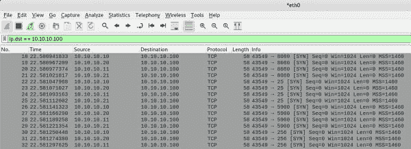
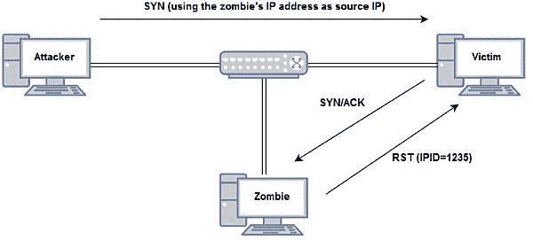
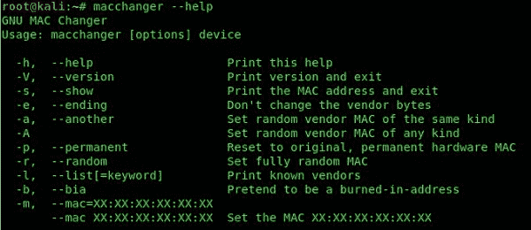
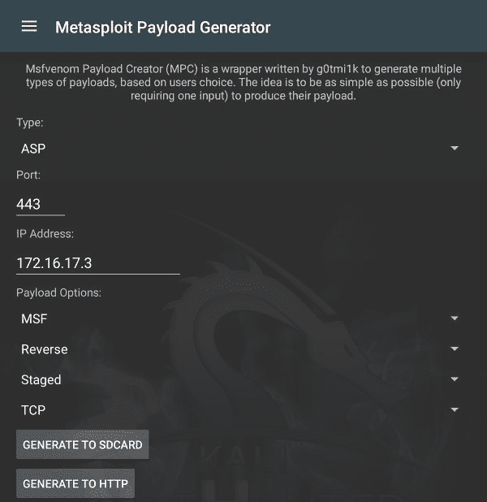

# 第十二章：避免被检测

在本书的过程中，我们讨论了许多关于渗透测试阶段的主题，从获取利用信息到掩盖我们的踪迹。要执行成功的渗透测试而不被目标的安全团队察觉，您必须像黑客一样隐秘。

除了在渗透测试期间检测和利用漏洞外，组织还使用这种类型的服务来测试其现有的安全控制和检测率。

如 第二章 中所述，蓝队负责监视、检测和缓解母公司内的任何安全威胁。如果蓝队未能检测到渗透测试人员的活动，这意味着两件事：渗透测试人员非常隐秘，且组织的安全控制需要一些调整。

在本章中，我们将涵盖以下主题：

+   隐蔽扫描

+   使用诱饵

+   分段

+   空闲扫描

+   加密

让我们深入研究！

# 扫描

黑客的第二阶段是扫描阶段。如 [第二章](https://cdp.packtpub.com/hands_on_penetration_testing_with_kali_nethunter/wp-admin/post.php?post=35&action=edit#post_27) 中所讨论的，*了解渗透测试过程的阶段*，扫描阶段帮助渗透测试人员获取有关目标系统和/或网络的许多详细信息。可能获取的一些信息包括操作系统和构建编号、开放和关闭的服务端口、正在运行的应用程序及其服务版本，以及系统或设备组上是否存在特定的漏洞。

然而，扫描的过程将涉及我们的机器直接与目标系统或网络进行交互。作为一名有抱负的渗透测试人员，很重要的是要非常隐秘，并尽可能避免被目标安全系统检测到。

在对客户的网络基础设施进行渗透测试时，客户组织可能有一个积极监视安全局势的蓝队。如果您在渗透测试的早期或后期阶段被检测到，这将破坏模拟真实世界攻击的目的，因为黑客会尝试窃取数据和破坏系统。

在扫描阶段，渗透测试人员使用许多技术来避免被检测。以下是其中一些技术：

+   隐蔽扫描

+   使用诱饵

+   空闲扫描

+   欺骗

+   分段

# 隐蔽扫描

如果渗透测试人员尝试扫描目标，那么在实际扫描目标之前，TCP 三次握手建立的机会很高。**TCP 三次握手**最初是为网络上的所有基于 TCP 的通信建立的；一旦建立，数据的正常流动就会发生。

以下是一个演示两个设备之间 TCP 三次握手的图表。为了进一步解释 TCP 三次握手，让我们想象一下网络上有两个设备 A 和 B。假设设备 A 想要与设备 B 进行通信；设备 A 将发送一个 TCP **SYN**包给设备 B，作为启动对话的方法。当设备 B 收到 TCP **SYN**包时，它将用一个**SYN/ACK**包回应设备 A。当设备 A 收到一个**SYN/ACK**包后，它将通过发送一个 ACK 包来确认。在这一点上，这两个设备之间建立了一个 TCP 连接。

在 TCP 连接期间，无论是 A 还是 B 设备收到的每个数据包，接收方都必须通过发送 TCP **ACK**数据包来确认接收，作为成功交付的指示。如果我们在执行端口扫描的同时与目标设备建立 TCP 会话，那么我们（攻击者）试图进行的侵入性行为就会变得明显。换句话说，这被认为是有噪音的。

在渗透测试的扫描阶段中，我们有 Nmap（网络映射器）工具来帮助我们。NMap 被誉为网络扫描器之王，因为它不仅是那些简单的 ping 扫描器之一，而且还可以包含许多对网络和安全专业人员非常有用的功能。其中一个功能是它能够在目标系统或网络上执行*隐形扫描*。

隐形扫描是如何工作的？：如第四章中所述，*扫描和枚举工具*，攻击者的机器会部分尝试与受害者的机器创建完整的 TCP 三次握手，发送一个 SYN 数据包；受害者会用一个**SYN/ACK**数据包回应，然而，攻击者不会完成握手，而是发送一个**RST**数据包。

受害者在收到**RST**数据包后，会关闭连接，认为攻击者的机器不再想要通信，但实际上攻击者是在挑衅受害者做出回应并提供一个开放端口的列表。一个开放的端口就像房子里敞开的门；留着一扇门开着，窃贼就可以轻易进入。这意味着如果一个端口被打开，攻击者可以利用这个开放的端口作为他们进入系统的途径。下面的图表展示了隐形扫描的工作原理：

使用 Nmap，我们可以通过输入命令`nmap –sS <*受害者 IP 地址*>`来执行隐形扫描：

`–sS`参数表示我们正在执行隐形扫描。隐形扫描有时被称为 TCP **SYN**扫描或全开放扫描。

# 欺骗

正如我们已经注意到的，每当渗透测试人员对目标设备或网络进行扫描时，攻击者的 IP 地址和 MAC 地址会被记录在受害者的机器上。这将使得在网络上识别攻击者的机器变得相当容易。在扫描时伪装自己的一种技术是使用欺骗，以使受害者在试图识别实际攻击者机器时产生困惑。

Nmap，网络扫描器之王，再次来帮助我们。Nmap 有能力在发送给目标设备的探测中插入多个源 IP 地址。为了更详细地说明，让我们想象一下，你给某人寄了一封虚假的信，然而在寄件人地址中，你在信封上加上了你的地址和其他几个地址。当信件被送到时，收件人不会确定实际寄件人，因为有多个来源地址。这使得确定探测的正确来源变得更加困难。要使用 Nmap 的欺骗功能，我们可以使用命令`nmap –D <欺骗 1, 欺骗 2, 欺骗 3…> <目标 IP 地址>`。

`-D`允许您指定多个源地址作为欺骗：

让我们使用 Wireshark 来查看攻击者机器和受害者之间实际发生的交易。攻击者机器的 IP 地址是 10.10.10.11，受害者机器是 10.10.10.100。我们使用了一个过滤器，只看 Wireshark 上发送到我们目标的流量：

正如我们在截图中看到的，有多个通过欺骗地址发送的探测，真实的 IP 地址被发送到目标。

# 空闲扫描

一种更老但仍然可用的扫描方法是使用空闲扫描技术。在空闲扫描中，攻击者机器（设备 A）向僵尸机器（设备 B）发送一个**SYN/ACK**数据包，以获取其分片标识号。

**IPID**有时被称为**IP 分片 ID**。在 TCP/IP 堆栈中，在设备将数据报（消息）发送到网络之前，它会被分成较小的片段，然后每个片段被发送到目的地。IPID 被分配给消息的这些较小片段（位），以指示它们属于同一个数据报或消息。

由于攻击者机器没有使用**SYN**数据包而是使用**SYN/ACK**数据包发起连接，因此僵尸机器知道它没有收到来自**SYN**数据包的正式初始化，因此发送一个带有僵尸机器的 IPID（设备 B）的**RST**数据包：

每次设备发送 IP 数据包时，**IPID**都会增加。

此时，攻击者机器从网络中的僵尸机器获得了 IPID（1234）。接下来，攻击者将使用僵尸机器的欺骗 IP 地址向实际受害者机器发送**SYN**数据包（检查是否有开放端口）。受害者将以**SYN/ACK**响应僵尸。僵尸知道它之前没有从受害者那里收到**SYN**数据包，然后将带有 IPID 的**RST**数据包响应：

如果受害者的端口关闭，目标将向僵尸发送**RST**而不是**SYN/ACK**数据包：

最后，攻击者将再次探测僵尸以获取僵尸的 IPID。攻击者将发送**SYN/ACK**数据包。如果僵尸以 1236 的 IPID 响应，则受害者的端口已打开：

在最后阶段，如果僵尸的 IPID 没有增加 2（1,234 + 2 = 1,236），则受害者机器上的端口关闭。由于数据包在攻击者、僵尸和受害者机器之间发送，因此僵尸和目标的分片 ID 将增加，因为它们正在通信。我们可以使用 Nmap 执行空闲扫描，命令的语法是`nmap –Pn –sI <zombie IP addr> <target IP addr>`**。**

僵尸机器在这种扫描方法中是理想的，因为目标会认为探测是由僵尸机器而不是实际的攻击者机器进行的。

通过运行上述命令，您将获得以下屏幕截图：

您可以使用`man nmap`命令查看 Nmap 的手册页面，或者在终端窗口中键入`nmap`并按*Enter*。

# MAC 地址欺骗

正如我们所了解的，欺骗就是简单地让目标相信流量或请求是来自另一个设备或受信任的来源。由于 TCP/IP 协议套件并未设计用于现代安全威胁，因此 IP 和 MAC 地址都可以很容易地被欺骗。

为了防止网络中的 MAC 地址欺骗，网络安全专业人员可以在 Cisco IOS 交换机上实施**动态 ARP 检查（DAI）**。

要为接口生成和分配随机 MAC 地址，我们必须执行以下操作：

1.  使用`ifconfig wlan0 down`命令逻辑地关闭接口：

1.  使用`macchanger --show wlan0`命令验证指定接口的当前和永久 MAC 地址：

1.  使用**`macchanger --random wlan0`**命令为我们的`wlan0`接口生成和分配 MAC 地址：

1.  使用`ifconfig wlan0 up`命令重新启用接口：

此外，您可以使用**`macchanger –-help`**命令查看所有可用选项。

通过运行**`macchanger –-help`**命令，您将获得以下截图：

如您所见，生成随机 MAC 地址以隐藏您的身份的可能性非常容易。

# 分段

黑客和渗透测试人员用来避免被检测的另一种方法是**分段**。分段将消息（数据包）分成小块。由于这些消息的小片段通常能够绕过几乎所有用于主动观察网络流量和安全威胁的安全设备和监控工具，因此这些片段被放入网络中。

在分段攻击中，攻击者可以修改防火墙或**入侵防范系统**（IPS）中每个比特发送的**生存时间**（TTL）或超时值。这将导致安全设备不容易检测到威胁，并在重新组装过程中混淆设备。

攻击者可以向受害者机器发送有效负载的片段，并使其重新组装成有效负载，而完全不被检测到。

Nmap 允许我们对目标设备进行分段的端口扫描。我们可以使用`nmap –f <目标 IP 地址>`命令：

使用 Wireshark，我们可以看到每个探测被分成较小的片段，然后发送到目标。

这种技术可以降低网络中存在 IDS、IPS 或防病毒软件时被检测到的几率。

# Metasploit 有效负载生成器

在本书中，我们涵盖了各种主题和工具。Kali NetHunter 平台中的一个特定工具是**Metasploit Payload Generator**。这个工具的名称基本上描述了它的功能：使用 Metasploit 框架生成有效负载。在 Kali NetHunter 中打开应用程序后，我们会看到以下内容：

如您所见，我们可以选择要生成的有效负载类型、IP 地址和端口号，以及其他有效负载选项。如果我们点击**类型**的下拉菜单，我们将看到以下选项：

有许多不同的类型可供选择。利用此功能的一个示例是，如果要为 Microsoft Windows 系统创建有效负载，则可以选择 Windows (.exe)类型。这将使目标/受害设备（在本例中是 Windows 操作系统）相信`.exe`文件是可信的，因为它看起来像是本机可执行文件。

根据渗透测试的目标操作系统和目标，渗透测试人员可以在上述截图中看到多个选项。

# 加密流量

大多数组织会部署**IPS**来主动监视出站和入站流量，特别关注本地或其他类型的安全威胁中的任何恶意流量。

一种规避 IPS 和反恶意软件系统的技术是使用加密。大多数防火墙默认情况下无法检测加密数据包中的恶意软件。然而，下一代防火墙具有一个称为深度数据包检查（DPI）的功能，通常会解开每个数据包的内容，并对其进行扫描和分析。如果没有检测到威胁，它会重新打包并将数据包发送到目的地。如果检测到威胁，防火墙将对其进行隔离，并在其管理控制台界面和任何其他日志记录系统上发送警报。

此外，大多数 IPS 没有解密消息以查看其内容的能力。这将允许攻击者加密恶意有效载荷并通过 IPS 设备而不被检测到。以下图表显示了公司网络的典型设置；如果防火墙上禁用了 DPI，它将允许加密文件（恶意有效载荷）通过：

渗透测试人员可以使用 VirusTotal 网站（www.virustotal.com）来测试其加密的有效载荷在各种反恶意软件引擎中的检测水平。作为渗透测试人员的目标是确保您的有效载荷在所有或大多数反恶意软件程序中都是不可检测的。通过修改有效载荷的编码，我们还可以降低检测水平。

# 总结

在本章中，我们讨论了一些渗透测试人员可以使用的避免检测的技术，例如欺骗 MAC 地址和扫描目标而不暴露我们的真实身份。然而，渗透测试人员不应该局限于仅使用本章提到的技术和方法。作为渗透测试领域的网络安全专业人员，攻击者可以尝试各种无限的方式来保持隐秘，这是一个很棒的地方。

在下一章中，我们将介绍加固技术和对策。在那里，您将学习如何保护 Windows、Linux 和移动操作系统。
