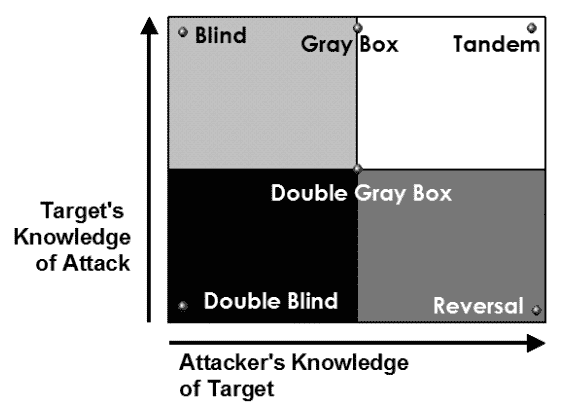

# Web 应用程序渗透测试简介

在今天的世界中，有自动化工具和 SaaS 解决方案可以测试系统或应用程序的安全性。当应用程序需要测试业务逻辑漏洞时，自动化通常在逻辑层面失败。重要的是要了解渗透测试人员如何帮助组织在网络攻击之前保持一步，并且为什么组织需要遵循严格的补丁管理周期来保护他们的资产。

在本书中，您将学习如何使用著名的 Metasploit 框架对构建在不同平台上的 Web 应用程序进行渗透测试。由于我们大多数人都听说过这个工具及其在常规渗透测试中的重要性，本书将重点介绍如何使用 Metasploit 框架对各种 Web 应用程序进行渗透测试，如内容管理系统（CMS）和内容交付和内容集成系统（CD/CI）。要了解更多关于工具和技术的信息，我们首先需要了解渗透测试的基础知识。

在本章中，我们将涵盖以下主题：

+   什么是渗透测试？

+   渗透测试类型

+   渗透测试阶段

+   重要术语

+   渗透测试方法论

+   常见弱点枚举（CWE）

# 什么是渗透测试？

渗透测试，也称为 pen 测试，是对计算机系统进行的授权攻击，旨在评估系统/网络的安全性。测试旨在识别漏洞及其带来的风险。典型的渗透测试是一个五阶段的过程，识别目标系统、它们的漏洞以及每个漏洞的可利用性。目标是尽可能发现更多的漏洞，并以客户能够理解的普遍可接受的格式报告。让我们在下一节中看看不同类型的渗透测试。

# 渗透测试类型

根据客户的要求，渗透测试可以分为三种类型：

+   白盒

+   黑盒

+   灰盒

我们将在以下部分讨论每个阶段。

# 白盒渗透测试

白盒渗透测试，又称玻璃盒或透明盒渗透测试，是一种测试类型，其中客户完全共享有关目标系统、网络或应用程序的信息和细节，例如系统的登录凭据、网络设备的 SSH/Telnet 登录以及需要测试的应用程序源代码。由于从客户那里获取的关于他们的系统、网络或应用程序的信息非常敏感，建议您将所有信息以加密格式保存。

# 黑盒渗透测试

黑盒渗透测试是一种模拟攻击测试，渗透测试人员将扮演一个没有关于目标系统、网络或应用程序的内部信息的威胁行为者。这种类型的测试真正关注于渗透测试的第一阶段——侦察。渗透测试人员能够获取有关目标组织的信息越多，结果就会越好。在这种类型的测试中，渗透测试人员不会获得任何架构图、网络布局或任何源代码文件。

# 灰盒渗透测试

灰盒渗透测试是白盒和黑盒测试之间的中间点。在典型的灰盒测试中，渗透测试人员获得了一些关于应用程序、系统或网络的知识。由于其性质，这种类型的测试非常高效，并且更专注于有截止日期的组织。使用客户提供的信息，渗透测试人员可以专注于风险更大的系统，并节省大量时间进行自己的侦察。

现在我们清楚了可以进行的渗透测试类型，让我们看看渗透测试的阶段。

# 渗透测试阶段

为了更好地理解渗透测试，让我们来看看这个过程的各个阶段：

+   阶段 1：侦察

+   阶段 2：枚举

+   阶段 3：漏洞评估和分析

+   阶段 4：利用（包括利用后期）

+   阶段 5：报告

这可以在以下图表中看到：

每个阶段都有自己的一套工具和技术，可以用来高效地进行测试。

# 侦察和信息收集

侦察是进行渗透测试的第一个阶段。在这个阶段，渗透测试人员将尽力识别所涉及的系统或应用程序，并尽可能多地获取有关它的信息。这是测试的最关键阶段，因为这一步骤定义了攻击面。在白盒测试中，侦察可能并不重要，因为客户已经提供了有关范围内目标的所有信息。

黑盒测试在很大程度上依赖于这个阶段，因为测试人员没有得到任何信息。在 Web 应用程序渗透测试的情况下，我们将专注于识别 Web 应用程序使用的技术、域/子域信息、HTTP 协议侦察和枚举，以及任何其他可能帮助我们提高效率的细节。在这个阶段通常会定义目标和目标。

以下是可以用来对 Web 应用程序执行侦察的工具列表：

+   识别运行在非标准端口（用户自定义自定义端口）上的应用程序：Amap，Nmap 等

+   识别 DNS 和子域：dnsenum，dnsmap，dnswalk，dnsrecon，dnstracer，Fierce，dnscan，Sublist3r 等

+   识别技术平台：BlindElephant，Wappalyzer，WhatWeb 等

+   识别内容管理系统：WPScan，Joomscan，CMScan，Drupscan 等

现在，让我们来看看枚举。

# 枚举

在枚举阶段，前一个阶段（侦察）中识别的每个应用程序、系统或网络都将被扫描以寻找不同的攻击面，例如，在 Web 应用程序的情况下进行文件和目录枚举，在网络设备的情况下进行端口和服务枚举。这个阶段将帮助测试人员识别攻击向量。攻击向量是攻击者获取访问或渗透目标系统的路径或方法；在这种情况下，是渗透测试人员。最常用的攻击向量包括钓鱼邮件、恶意软件和未打补丁的漏洞。

渗透测试人员可以执行文件和目录枚举、HTTP 方法枚举、主机枚举和其他一些枚举方法，以找到可能存在漏洞的插入点。在白盒测试中，这个阶段并不真正起到重要作用，因为所有的信息和细节都已经提供给了测试人员，但这并不意味着你不应该进行这个阶段。即使所有的细节都已经提供，进行枚举和扫描也是一种良好的实践。这将帮助测试人员找到过时的攻击路径，这些攻击路径可能不受应用程序支持，但可能帮助测试人员渗透网络。

这个阶段对于黑盒测试和灰盒测试非常关键，因为通过对目标系统或应用程序进行侦察所检索到的所有信息都被渗透测试人员识别出来。如果手动进行枚举，这个过程可能会变得很繁琐，因此有一些公开可用的工具和一些 Metasploit 模块可以用来快速枚举应用程序。

以下是可以用来对 Web 应用程序执行枚举的工具列表：

+   文件和目录枚举：Dirsearch，dirb，dirbuster，Metasploit Framework，BurpSuite，gobuster 等

+   HTTP 协议支持的方法枚举：Nmap，BurpSuite，Metasploit Framework，wfuzz 等

+   **限制速率测试**：BurpSuite、ffuf、wfuzz 等

现在让我们来看看漏洞评估。

# 漏洞评估和分析

一旦我们确定了攻击向量，我们需要进行漏洞扫描，这发生在渗透测试的这个阶段。对 Web 应用程序进行漏洞评估，以识别网页、目录、HTTP 协议方法、HTTP 标头等的漏洞。扫描可以使用公开可用的工具或付费许可的工具进行。所有类型的测试——白盒、黑盒和灰盒——都严重依赖于这个阶段。

一旦进行了漏洞扫描，我们需要评估和分析找到的每个漏洞，然后过滤掉虚假阳性。过滤掉虚假阳性有助于渗透测试人员处理实际存在的漏洞，而不是因为时间延迟或扫描器错误而发现的漏洞。所有的漏洞过滤都发生在这个阶段。

以下是可以用于对 Web 应用程序进行漏洞评估和扫描的工具列表：

+   **系统和网络漏洞评估**：Nessus、OpenVAS 等

+   **Web 应用程序漏洞评估**：Nikto、Acunetix、BurpSuite、Nessus 等

# 利用

利用阶段是侦察阶段之后的第二个最关键的阶段。这个阶段证明了前一阶段发现的某个漏洞是否可利用。渗透测试人员可以通过利用发现的漏洞来确定渗透测试项目的成功。利用可以使用特定工具自动完成，例如 Metasploit Framework 和 Canvas。这是因为我们不知道某个 Web 应用程序或系统在使用有效载荷时会有怎样的行为。

通常，在所有类型的测试中，我们需要向客户确认是否被授权执行基于内存的利用，例如利用缓冲区/堆溢出和运行内存破坏利用。这样做的优势是，通过运行特定的利用，我们可以访问目标系统（只有在目标系统对这个特定的利用存在漏洞时才有效）。使用这种利用的问题是，系统/服务器/Web 应用程序可能会崩溃，这可能会导致业务连续性问题。

一旦我们利用了系统或 Web 应用程序，我们可以选择停止，或者（如果得到客户授权）进行利用后工作，以进入网络（枢纽）并找到业务关键服务器。

请确保所有有效载荷、Web shell、文件和脚本都上传到目标系统以进行利用，以便在拍摄适当的**概念证明**（**PoC**）截图后进行清理。这应该始终如此；否则，真正的攻击者可能会找到 Web shell 并轻松使用它们来攻击组织。

# 报告

报告阶段是渗透测试过程的最后阶段，涉及报告在目标（范围内）发现的每一个漏洞。报告的漏洞将根据**通用漏洞评分系统**（**CVSS**）定义的严重程度级别进行列出，这是一个用于评估漏洞的免费开放标准。

作为渗透测试人员，我们需要了解这个阶段对客户来说有多么重要。测试人员在客户系统上所做的所有工作都应该以结构化的格式报告。报告应包括测试的简短介绍、工作范围、参与规则、简短而简洁的摘要、发现的漏洞以及每个漏洞的概念证明，以及一些推荐和来自参考链接的修补技术。

有一些公开可用的工具，如 Serpico、Magic Tree、BurpSuite 和 Acunetix，可以用来简化报告过程。由于这是渗透测试的重要阶段，测试期间发现的所有细节都应包含在报告中。

我们可以提供两种不同类型的报告：一份供管理层使用的**执行报告**和一份供技术团队使用的**技术报告**。这可以帮助组织的管理层和技术团队了解并修复渗透测试人员发现的漏洞。

# 重要术语

既然我们熟悉了标准，现在让我们来介绍一下我们在接下来的章节中将经常使用的重要术语：

+   **漏洞**：系统中可能允许攻击者未经授权访问的弱点。

+   **欺骗**：一个个体或程序成功地将数据伪装成其他东西，以获取不法利益的情况。

+   **利用**：利用漏洞获取未经授权的系统/应用程序访问权限的代码片段、程序、方法或一系列命令。

+   **有效载荷**：在利用过程中/之后在系统上执行的实际代码，以执行所需的任务。

+   **风险**：任何可能影响数据的机密性、完整性和可用性的事物。未打补丁的软件、配置错误的服务器、不安全的互联网浏览习惯等都会增加风险。

+   **威胁**：任何可能对计算机系统、网络或应用程序造成严重危害的事物。

+   **黑盒**：测试方法，测试人员对系统的内部结构或功能没有任何信息。

+   **白盒**：测试方法，测试人员完全了解系统的内部结构和功能。

+   **漏洞赏金**：漏洞赏金计划是许多网站和开发者提供的一项协议，允许个人因报告漏洞而受到荣誉和奖励，特别是与利用和漏洞相关的漏洞。

+   **SAST**：**静态应用安全测试**（**SAST**）是一种依赖于检查应用程序源代码的安全测试形式。

+   **DAST**：**动态应用安全测试**（**DAST**）是一种用于检测应用程序在运行状态下的安全漏洞的技术。

+   **模糊测试**：一种自动化测试技术，将无效、意外或随机数据提供为应用程序的输入。

既然我们已经了解了这个重要的术语，让我们继续学习测试方法。

# 渗透测试方法

众所周知，没有明确定义的官方渗透测试标准；然而，我们的安全社区已经为所有安全人员引入了一些标准。一些常见的标准包括**开放源代码安全测试方法手册**（**OSSTMM**）、**渗透测试执行标准**（**PTES**）和**信息系统安全评估框架**（**ISSAF**）。它们大多遵循相同的方法，但它们的阶段名称不同。我们将在接下来的章节中逐个查看它们，并详细介绍 PTES。

# 开放源代码安全测试方法手册（OSSTMM）

OSSTMM 的定义在它们的官方网站上提到，网址为[`www.isecom.org/OSSTMM.3.pdf`](https://www.isecom.org/OSSTMM.3.pdf)：

这是一个经过同行评审的安全测试和分析手册，其结果是经过验证的事实。这些事实提供了可操作的信息，可以显著改善您的运营安全。

使用 OSSTMM，审计将提供对操作层面安全的精确估计，清除假设和不可靠的证据。它用于彻底的安全测试，并旨在保持一致和可重复。作为一个开源项目，它向所有安全测试人员开放，鼓励越来越准确、可操作和高效的安全测试。

OSSTMM 包括以下关键部分：

+   运营安全指标

+   信任分析

+   人员安全测试

+   物理安全测试

+   无线安全测试

+   电信安全测试

+   数据网络安全测试

+   合规法规

+   **安全测试审计报告**（STAR）的报告

# 运营安全指标

OSSTMM 的这一部分涉及需要保护的内容以及攻击面的暴露程度。这可以通过创建 RAV（攻击面的公正事实描述）来衡量。

# 信任分析

在运营安全中，信任是指在范围内目标之间的互动，可以被任何恶意人士利用。为了量化信任，我们需要理解并进行分析，以做出更加理性和合乎逻辑的决策。

# 人员安全测试

**人员安全**（HUMSEC）是**物理安全**（PHYSSEC）的一个子部分，包括**心理操作**（PSYOPS）。测试安全的这一方面需要与能够访问受保护资产的个人进行沟通，例如门卫。

# 物理安全测试

**物理安全**（PHYSSEC）指的是物理领域内的物质安全。测试这个通道需要与障碍物和人类（门卫）进行非沟通式互动。

# 无线安全测试

**频谱安全**（SPECSEC）是包括**电子安全**（ELSEC）、**信号安全**（SIGSEC）和**辐射安全**（EMSEC）的安全分类。测试这个通道需要分析师在目标附近。

# 电信安全测试

**电信安全**是 ELSEC 的一个子集，描述了组织在有线电信上的通信。测试这个通道涵盖了分析师和目标之间的互动。

# 数据网络安全测试

关于**数据网络安全**（通信安全[**COMSEC**]）方面的测试需要与能够访问用于控制对财产的访问的运营数据的个人进行互动。

# 合规法规

所需的合规性类型取决于所在地区和当前执政政府、行业和业务类型，以及支持的立法。简而言之，合规性是由立法或行业定义的一组通用政策，这些政策是强制性的。

# 使用 STAR 进行报告

**安全测试审计报告**（STAR）的目的是作为执行摘要，陈述在特定范围内测试的目标的攻击面。

# OSSTMM 测试类型

OSSTMM 根据测试者所知信息的多少将测试类型分为六大类：

+   **盲测**：在这种测试中，分析师对目标一无所知，但目标知道审计并拥有分析师的所有细节。这可以被视为对分析师知识的测试。

+   双盲测试：在这种测试中，分析师对目标、其防御、资产等一无所知。目标也不会被通知审计。这种测试用于检查分析师的知识和技能，以及目标对未知威胁的准备情况。这也被称为黑盒测试。

+   **灰盒**：在这个测试中，分析员对目标的防御措施了解有限，但对目标的资产和运作有完全的了解。目标方在这种情况下已经为审计做好了充分的准备，并且知道其全部细节。这个测试也被称为**漏洞测试**。

+   **双灰盒**：也被称为白盒测试。目标方对范围和时间有先进的了解，但对有效载荷和测试向量一无所知。

+   **串联**：也被称为内部审计或水晶球测试。在这个测试中，目标方和分析员都知道审计的全部细节，但这个测试不检查目标方对未知变量或向量的准备情况。

+   **逆向**：在这个测试中，攻击者全面了解目标的流程和运营安全，但目标方对审计何时以及如何进行一无所知。这也被称为红队演习。

这些类型在图中表示如下：

来源：https://www.isecom.org/OSSTMM.3.pdf

许可：https://creativecommons.org/licenses/by/3.0/

现在我们已经阅读了不同的 OSSTMM 测试类型，让我们来看看 ISSAF。

# 信息系统安全评估框架（ISSAF）

ISSAF 并不是非常活跃，但他们提供的指南非常全面。它旨在评估信息安全政策以及组织对 IT 行业标准、法律和监管要求的遵守情况。当前版本的 ISSAF 是 0.2。

它涵盖了以下阶段：

+   项目管理

+   指南和最佳实践-预评估、评估和后评估

+   评估方法论

+   信息安全政策和安全组织审查

+   风险评估方法论评估

+   技术控制评估

+   技术控制评估-方法论

+   密码安全

+   密码破解策略

+   Unix /Linux 系统安全评估

+   Windows 系统安全评估

+   Novell netware 安全评估

+   数据库安全评估

+   无线安全评估

+   交换机安全评估

+   路由器安全评估

+   防火墙安全评估

+   入侵检测系统安全评估

+   VPN 安全评估

+   反病毒系统安全评估和管理策略

+   Web 应用安全评估

+   **存储区域网络**（**SAN**）安全

+   互联网用户安全

+   As 400 安全

+   源代码审计

+   二进制审计

+   社会工程

+   物理安全评估

+   事件分析

+   日志/监控和审计流程审查

+   业务连续性规划和灾难恢复

+   安全意识和培训

+   外包安全问题

+   知识库

+   安全评估项目的法律方面

+   **保密协议**（**NDA**）

+   安全评估合同

+   请求提案模板

+   桌面安全检查表-窗口

+   Linux 安全检查表

+   Solaris 操作系统安全检查表

+   默认端口-防火墙

+   默认端口-IDS/IPS

# 渗透测试执行标准（PTES）

这个标准是最广泛使用的标准，几乎涵盖了与渗透测试相关的一切。

PTES 分为七个阶段：

+   预先互动

+   情报收集

+   威胁建模

+   漏洞分析

+   利用

+   后期利用

+   报告

让我们简要了解一下每个阶段涉及的内容。

# 预先互动

预先互动是在活动开始之前进行的，比如定义活动的范围，通常涉及映射网络 IP、Web 应用程序、无线网络等。

一旦确定范围，就会建立供应商和事件报告流程之间的沟通渠道，并最终确定报告流程。这些互动还包括状态更新、电话、法律程序以及项目的开始和结束日期。

# 情报收集

情报收集是一个过程，用于收集有关目标的尽可能多的信息。这是渗透测试最关键的部分，因为我们拥有的信息越多，我们就可以使用更多的攻击向量来执行活动。在白盒活动的情况下，所有这些信息已经提供给测试团队。

# 威胁建模

威胁建模是一种识别和列举潜在威胁并对缓解措施进行优先排序的过程。威胁建模取决于收集的信息的数量和质量；有了这些信息，活动可以分解成阶段，然后使用自动化工具和逻辑攻击进行执行。

以下是威胁模型的思维导图：

！

（来源：[`www.pentest-standard.org/index.php/Threat_Modelling `](http://www.pentest-standard.org/index.php/Threat_Modelling)

许可证：[GNU 自由文档许可证 1.2](http://www.gnu.org/licenses/old-licenses/fdl-1.2.txt) ）

现在让我们来看一下漏洞分析。

# 漏洞分析

漏洞分析是发现攻击者可以利用的缺陷的过程。这些缺陷可以是从开放端口和服务配置错误到 SQL 注入的任何东西。有很多可用的工具可以帮助进行漏洞分析，例如 Nmap、Acunetix 和 Burp Suite。每隔几周就会发布新工具。

# 利用

利用是通过规避基于漏洞评估的保护机制来获得对系统的访问的过程。利用可以是公开的或零日的。

# 后期利用

后期利用是确定妥协的重要性，然后保持访问以供将来使用的阶段。这个阶段必须始终遵循保护客户和保护自己的规则（根据活动的要求覆盖踪迹）。

# 报告

报告是最重要的阶段之一，因为修补所有问题完全取决于报告中呈现的细节。报告必须包含三个关键元素：

+   漏洞的重要性

+   重现错误所需的步骤

+   补丁建议

总之，渗透测试生命周期阶段可以如下所示：

！

在下一节中，我们将讨论通用弱点枚举（CWE）和两个顶级 CWE。

# 通用弱点枚举（CWE）

在本节中，我们将讨论**通用弱点枚举**（**CWE**）。CWE 是计算机软件中发现的弱点的通用在线词典。在本节中，我们将介绍两个著名的 CWE——OWASP 十大和 SANS 25 强。

# OWASP 十大

**开放式 Web 应用程序安全项目**（**OWASP**）是一个为计算机和互联网应用程序提供公正、实际和具有成本效益的信息的组织。

2020 年的当前列表包含以下错误：

+   注入

+   破损的身份验证

+   敏感数据暴露

+   **XML 外部实体**（**XXE**）

+   破损的访问控制

+   安全配置错误

+   **跨站脚本**（**XSS**）

+   不安全的反序列化

+   使用已知漏洞的组件

+   日志记录和监控不足

# SANS TOP 25

SANS 25 强列表是 SANS 研究所、MITRE 和美国和欧洲许多顶级软件安全专家之间的合作。它包括以下漏洞：

+   在网页生成期间未对特殊元素进行适当中和（'SQL 注入'）

+   在操作系统命令中未对特殊元素进行适当中和（'操作系统命令注入'）

+   在检查输入的大小时进行缓冲区复制（'经典缓冲区溢出'）

+   在网页生成期间未对输入进行适当中和（'跨站脚本'）

+   关键功能缺少身份验证

+   授权缺失

+   使用硬编码凭据

+   敏感数据加密缺失

+   不受限制地上传危险类型的文件

+   在安全决策中依赖不受信任的输入

+   以不必要的权限执行

+   **跨站请求伪造**（**CSRF**）

+   将路径名限制不当到受限目录（'路径遍历'）

+   在没有完整性检查的情况下下载代码

+   不正确的授权

+   包含来自不受信任控制领域的功能

+   对关键资源的权限分配不正确

+   使用潜在危险的函数

+   使用破损或风险的加密算法

+   缓冲区大小的错误计算

+   不正确限制过多的身份验证尝试

+   将 URL 重定向到不受信任的站点（'开放重定向'）

+   未受控制的格式字符串

+   整数溢出或环绕

+   使用不带盐的单向哈希

我们将在本书的后面章节详细介绍其中一些漏洞。

# 摘要

在本章中，我们从渗透测试及其类型和阶段的介绍开始。我们介绍了渗透测试方法和生命周期，并了解了一些重要术语。然后，我们看了 OWASP 十大和 SANS 二十五强。

在下一章中，我们将学习 Metasploit 的基本知识，包括 Metasploit 框架、安装和设置。

# 问题

1.  是否有一个维护**通用弱点枚举**（**CWE**）列表的数据库？

1.  我在哪里可以找到 OWASP 十大和 SANS 二十五强列表？

1.  执行渗透测试所需的工具是否免费？

1.  OSSTMM 和 PTES 基础的渗透测试有何不同？

# 进一步阅读

+   **安全和开放方法研究所**（**ISECOM**）：[`www.isecom.org/`](http://www.isecom.org/)

+   渗透测试标准网站：[`www.pentest-standard.org/index.php/Main_Page`](http://www.pentest-standard.org/index.php/Main_Page)
