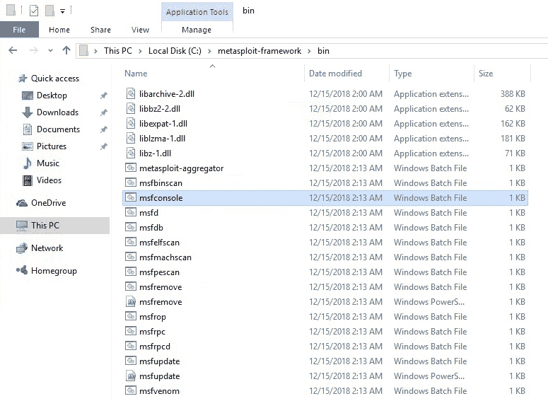
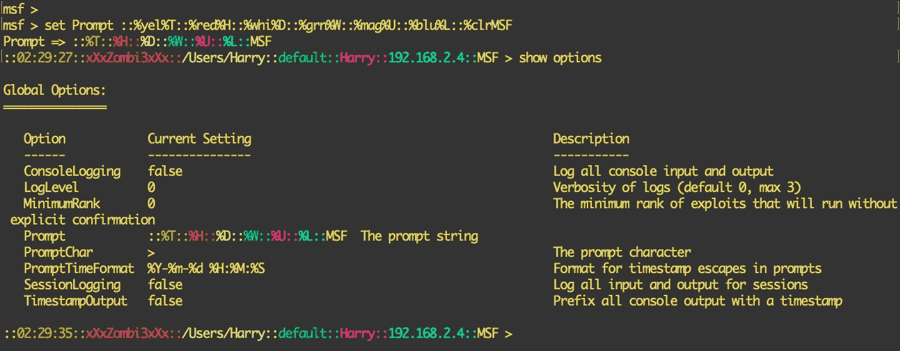
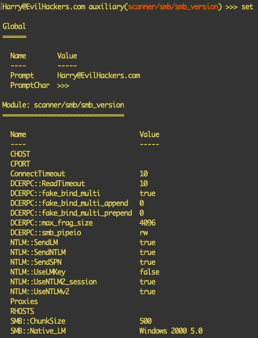
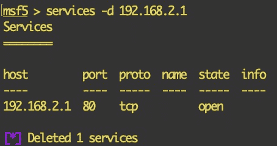
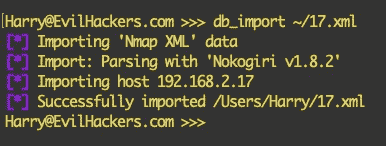
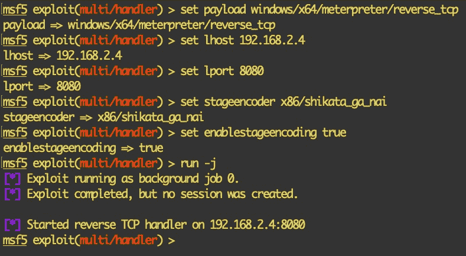

# 第三章：Metasploit 基础知识

Metasploit 项目是用于渗透测试和 IDS 签名捕获的工具。在这个项目下有 Metasploit Framework 子项目，它是开源和免费使用的。它具有针对目标开发和执行利用代码的能力。Metasploit 最初是由 H.D Moore 在 2003 年创建的，并于 2009 年被 Rapid7 收购。Metasploit Framework 是十年来最广泛使用的工具之一。无论您是在网络中执行适当的侦察还是进行后期利用，几乎所有的渗透测试都使用 Metasploit。

在本章中，我们将从介绍 Metasploit Framework 的基本术语开始，然后安装和设置 Metasploit 在不同平台上，以便学习如何使用一些基本命令与 Metasploit Framework 进行交互。

我们将在本章中涵盖以下主题：

+   Metasploit Framework 介绍

+   Metasploit Framework 术语

+   Metasploit 安装和设置

+   开始使用 Metasploit Framework

# 技术要求

以下是本章所需的技术要求：

+   Metasploit Framework v5.0.74 ([`github.com/rapid7/metasploit-framework`](https://github.com/rapid7/metasploit-framework))

+   基于*nix 系统或 Microsoft Windows 系统

+   Nmap

# Metasploit Framework 介绍

Metasploit 是我们在考虑渗透测试或利用时首先想到的工具。Metasploit Framework 是 Metasploit 项目的一个子项目。Metasploit 项目通过提供有关漏洞的信息以及帮助我们进行渗透测试来帮助我们。

Metasploit 首次出现在 2003 年。它是由 H.D Moore 使用 Perl 开发的，但后来在 2007 年转移到了 Ruby。到 2009 年 10 月，Rapid7 已经收购了 Metasploit 项目。然后 Rapid7 添加了 Metasploit Express 和 Metasploit Pro 的商业版本。这是 Metasploit Framework 演变的开始。

Metasploit Framework 是一个开源框架，允许我们编写、测试和执行利用代码。它也可以被认为是用于渗透测试和利用的一套工具。

在本章中，我们将介绍安装和使用 Metasploit Framework 的基础知识。

# Metasploit Framework 术语

现在，让我们来了解 Metasploit Framework 的基本术语。我们将在本书中经常使用这些术语，所以最好在深入研究**Metasploit Framework**（**MSF**）及其用法之前彻底理解它们：

+   **Exploits**：当 Metasploit 启动时，它显示了框架中已经可用的公开利用的数量。利用是利用漏洞并给出我们想要的输出的代码片段。

+   **Payload**：这是通过利用传递到目标系统或应用程序的代码片段，以执行我们选择的操作。有效载荷实际上可以分为三种主要类型：单个、分段和阶段：

+   **Singles**：这些有效载荷是独立的，通常用于执行简单的任务，比如打开`notepad.exe`文件和添加用户。

+   **Stagers**：这在两个系统之间建立连接。然后，它们将阶段下载到受害者的机器上。

+   **Stages**：这些可以被认为是有效载荷的组成部分。它们提供不同的功能，比如访问命令 shell、运行可执行文件以及上传和下载文件，并且不需要有大小限制。这种功能的一个例子是 Meterpreter。

其他类型的有效载荷如下：

+   +   **Inline (non-staged)**：包含完整 shellcode 的利用代码，用于执行特定任务。

+   **Staged**：这与阶段有效载荷一起工作，执行特定任务。分段器在攻击者和受害者之间建立通信通道，并发送一个将在远程主机上执行的分段有效载荷。

+   **Meterpreter**：这是*Meta Interpreter*的缩写，通过 DLL 注入运行。它加载在内存中，不留下磁盘上的痕迹。

+   **PassiveX**：这使用 ActiveX 控件创建 Internet Explorer 的隐藏实例。它通过 HTTP 请求和响应与攻击者通信。

+   **NoNX**：这用于绕过 DEP 保护。

+   **Ord**：这些是在所有版本的 Windows 上都可以工作的极小型有效载荷。但是，它们不稳定，并依赖于`ws2_32.dll`在利用过程中被加载。

+   **IPv6**：这是为 IPv6 主机设计的。

+   **Reflective DLL Injection**：由 Stephen Fewer 创建，这是一种技术，其中分段有效载荷被注入到运行在内存中的受损主机进程中，而从不触及主机硬盘。

+   **Auxiliary**：Metasploit 框架配备了数百个辅助模块，可用于执行不同的任务。这些模块可以被视为不利用任何东西的小工具。相反，它们在利用过程中帮助我们。

+   **Encoders**：编码器将信息（在这种情况下是汇编指令）转换为另一种形式，执行后将给我们相同的结果。编码器用于避免在传递到目标系统/应用程序时检测有效载荷。由于大多数在组织网络中配置的 IDS/IPS 都是基于签名的，因此在对有效载荷进行编码时，它将改变整个签名并轻松地绕过安全机制。最著名的编码器是`x86/shikata_ga_nai`。这是一种多态的 XOR 加反馈编码器，这意味着每次使用时都会生成不同的输出。它在首次推出时是最难检测到的。当与多次迭代一起使用时，它仍然非常有用。但是，必须小心使用迭代，并始终首先进行测试；它们可能不会按预期工作，并且随着每次迭代，有效载荷的大小都会增加。

+   **NOP 生成器**：NOP 生成器用于生成一系列随机字节，这些字节等同于传统的 NOP 滑梯，只是它们没有任何可预测的模式。NOP 滑梯也可以用于绕过标准的 IDS 和 IPS NOP 滑梯签名（`NOP Sled - \x90\x90\x90`）。

+   **Project**：这是一个容器，用于在渗透测试活动期间存储数据和凭据。在 Metasploit Pro 版本中更常用。

+   **Workspace**：工作区与项目相同，但仅在 Metasploit 框架中使用。

+   **Task**：这是我们在 Metasploit 中执行的任何操作。

+   **Listener**：监听器等待来自被攻击目标的传入连接，并管理连接的目标 shell。

+   **Shell**：Shell 是一个控制台，比如一个接口，它让我们可以访问远程目标。

+   **Meterpreter**：在官方网站上，Meterpreter 的定义如下：

“一种高级的、动态可扩展的有效载荷，使用内存中的 DLL 注入分段器，并在运行时通过网络进行扩展。它通过分段器套接字进行通信，并提供全面的客户端端 Ruby API。”

既然我们已经了解了基本术语，让我们看看如何安装 Metasploit 并设置它。

# 安装和设置 Metasploit

安装 Metasploit 非常容易，并且其设置过程受到不同操作系统的支持。Metasploit 可以安装在以下系统上：

+   *nix 系统（Ubuntu、macOS 等）

+   基于 Windows 的系统

安装 Metasploit 的步骤对所有支持的操作系统几乎是相同的。唯一的区别是在需要执行命令行安装时。

# 在*nix 上安装 Metasploit 框架

在我们开始使用 Metasploit 之前，我们需要安装它。按照以下步骤进行：

1.  在*nix 上安装 Metasploit 可以通过下载并执行适用于 Linux 和 macOS 系统的 Metasploit 夜间安装程序，或者使用以下命令（CLI）来完成：

[PRE0]

以下截图显示了上述命令的输出：

前面的命令将下载一个 shell 脚本，该脚本将导入 Rapid7 签名密钥（PGP）并安装所有支持的 Linux 和 macOS 系统所需的软件包：

1.  安装过程完成后，运行 Metasploit 非常简单。在终端中，只需输入以下命令：

[PRE1]

下面的屏幕截图显示了前面命令的输出：

注意：Metasploit Framework v5.0.0 发布了许多新功能。您可以在[`blog.rapid7.com/2019/01/10/metasploit-framework-5-0-released/`](https://blog.rapid7.com/2019/01/10/metasploit-framework-5-0-released/)上查看这些功能和更多信息。

我们现在应该看到 Metasploit Framework 已经启动。当首次加载 MSF 控制台时，它会自动使用 PostgreSQL 创建一个数据库。如果我们执行扫描、利用等操作，该数据库将用于存储收集到的任何数据。

1.  每周都会向 Metasploit 添加新的利用和其他模块，因此定期更新 Metasploit 是一个很好的主意。可以使用以下命令来完成：

[PRE2]

下面的屏幕截图显示了前面命令的输出：

在撰写本书时，Metasploit Framework 提供了 1,991 个利用模块，1,089 个辅助模块，340 个后置模块，560 个有效载荷模块，45 个编码器模块，10 个 nops 和 7 个规避模块。

# 在 Windows 上安装 Metasploit Framework

现在我们已经学会了如何在*nix 系统上安装 Metasploit Framework，让我们快速看一下如何在 Windows 环境中安装 Metasploit Framework：

1.  首先，我们需要从以下 URL 下载 Windows 的 Nightly 安装程序：

[PRE3]

输入此 URL 后，您应该看到以下输出：

1.  下载完成后，我们可以通过双击 MSI 文件来安装它。一个新窗口将打开，如下面的屏幕截图所示。

1.  我们需要按照标准的安装步骤（下一步，下一步，我同意，然后安装）在 Windows 上安装 Metasploit：

建议您阅读该工具的条款和条件。

安装完成后，我们仍然无法从命令提示符中运行 Metasploit，如下面的屏幕截图所示。这是因为路径变量尚未设置，因此系统不知道在执行命令时在哪里查找`msfconsole`二进制文件：

1.  让我们找到`msfconsole`二进制文件。在我们的情况下，可以在这里找到：

[PRE4]

前面命令的输出可以在下面的屏幕截图中看到：

1.  现在，我们需要通过输入以下命令将此目录添加到我们的路径中：

[PRE5]

这可以在下面的屏幕截图中看到：

现在路径变量已经设置，我们将能够从命令提示符中启动 Metasploit：

运行上述命令将启动 Metasploit 及其控制台。现在我们已经获得了对 MSF 控制台的访问权限，让我们开始了解 Metasploit Framework 的基础知识。

# 开始使用 Metasploit Framework

安装完成后，我们可以继续查看 Metasploit Framework 的使用。与 Metasploit Framework 进行交互的最常见方式是通过`msfconsole`。控制台提供了一个非常简单的命令行，用于进行高效的测试和利用（渗透）的所有功能和选项。

# 使用 msfconsole 与 Metasploit Framework 进行交互

您可以以**正常模式**或**安静模式**运行 MSF 控制台。这两种模式之间唯一的区别是控制台中没有错误、警告和横幅。在**正常模式**下，将出现一个很酷的 MSF 横幅。在**安静模式**下，您可以与 MSF 控制台交互，方法是执行`msfconsole -q`命令：

根据您的情况和需求，还有其他可用的 MSF 控制台选项。例如，如果您想要在没有任何数据库支持的情况下运行 MSF 控制台，您可以随时执行`**msfconsole -qn**`命令。

如果数据库尚未初始化，则无法执行任何带有`db_`前缀的命令或加载任何插件：

当您尝试从控制台加载插件时，您将收到以下未初始化错误：

在这里，我们在`msfconsole`中使用了`-x`选项。正如你可能已经猜到的那样，这个开关用于在控制台内执行 MSF 支持的命令。我们还可以在控制台中执行 shell 命令，因为 Metasploit 会将这些命令传递给我们的默认 shell 以用作参数：

在上述命令中，我们从 MSF 控制台中回显了`WELCOME TO METASPLOIT FRAMEWORK`字符串并退出。要查看所有可用的选项，可以执行`msfconsole -h`命令。现在让我们来看看在 MSF 控制台中使用的最基本和最常用的命令。

# MSF 控制台命令

MSF 控制台命令可以分为以下几类：

+   **核心 MSF 控制台命令：**这些命令是在 MSF 控制台中使用的最常见和通用的命令。

+   **模块管理命令：**使用这些命令管理 MSF 模块。您可以使用这些命令编辑、加载、搜索和使用 Metasploit 模块。

+   **MSF 作业管理命令：**使用这些命令，您可以处理 Metasploit 模块作业操作，比如使用处理程序创建作业，列出后台运行的作业，杀死和重命名作业。

+   **资源脚本管理命令：**在使用资源脚本时，可以使用这些命令在控制台中执行脚本。您可以为执行提供一个存储的脚本文件，或者将在 MSF 控制台启动时使用的命令存储到文件中。

+   **后端数据库命令：**这些命令用于管理数据库；即检查 DB 连接，设置连接并断开连接，在 MSF 中还原/导入 DB，从 MSF 中备份/导出 DB，并列出与目标相关的保存信息。

+   **凭据管理命令：**您可以使用`creds`命令查看和管理保存的凭据。

+   **插件命令：**可以使用插件命令管理 MSF 控制台中的插件。这些命令适用于所有加载的插件。

要了解如何使用`msfconsole`命令，请参考以下网址：[`www.offensive-security.com/metasploit-unleashed/msfconsole-commands/`](https://www.offensive-security.com/metasploit-unleashed/msfconsole-commands/)。

MSF 控制台不仅允许我们利用其中的大量模块，还允许我们根据用户的需求自定义控制台。让我们看看如何自定义控制台。

# 自定义全局设置

在自定义控制台之前，我们需要了解当前（默认）应用于控制台的全局设置：

1.  当 Metasploit Framework 启动时，可以使用`show options`命令来完成这个操作：

1.  我们可以从这些设置中更改提示（`msf`文本）。要更改提示和提示字符，可以执行`set Prompt`和`set PromptChar`命令：

1.  我们甚至可以使用一些扩展格式来配置更高级的提示，如下所示：

以下是可以使用的扩展格式：

| **文字** | **描述** |
| --- | --- |
| `％D` | 当前目录 |
| `％U` | 当前用户 |
| `％W` | 当前工作区 |
| `％T` | 当前时间戳 |
| `％J` | 当前运行的作业数 |
| `％S` | 当前打开的会话数 |
| `％L` | 本地 IP |
| `％H` | 主机名 |
| `％red` | 将颜色设置为红色 |
| `％grn` | 将颜色设置为绿色 |
| `％yel` | 将颜色设置为黄色 |
| `％blu` | 将颜色设置为蓝色 |
| `％mag` | 将颜色设置为洋红色 |
| `％cya` | 将颜色设置为青色 |
| `％whi` | 将颜色设置为白色 |
| `％blk` | 将颜色设置为黑色 |
| `％und` | 下划线 |
| `％bld` | 粗体 |

相同的格式也可以用于设置提示字符。

# MSF 中的变量操作

Metasploit Framework 中的变量操作可以帮助用户充分利用模块的功能。作为渗透测试人员，有时我们需要扫描大量目标，并且在几乎所有的测试场景中，我们都必须设置 Metasploit 模块所需的选项。这些选项，例如远程主机 IP/端口和本地主机 IP/端口，是为正在使用的特定 Metasploit 模块设置的。我们越早学习变量操作，就能越有效地使用模块。

可以使用数据存储来实现变量操作。数据存储是一种具有以下功能的变量类型：

+   以键/值对的形式存储数据

+   使 MSF 控制台能够在模块执行时配置设置

+   使 MSF 能够将值传递给其他模块内部

数据存储由各种类使用，以保存选项值和其他状态信息。有两种类型的数据存储：

+   **模块数据存储**：此数据存储仅保存与加载的模块相关的信息和选项（本地声明）。在 MSF 控制台中，您可以使用`set`命令保存模块选项，并使用`get`命令获取已保存的值：

如前面的屏幕截图所示，加载了`smb_version`模块，并将`RHOSTS`选项设置为`192.168.2.17`。但是一旦我们卸载了模块（使用`back`命令），全局上就没有值来设置 RHOSTS 选项。要全局设置这些选项，我们需要使用全局数据存储。

+   **全局数据存储**：此数据存储将信息和选项保存到所有模块（全局声明）。在 MSF 控制台中，您可以使用`setg`命令保存模块选项，并使用`getg`命令获取：

在前面的屏幕截图中，我们将值`192.168.2.17`全局保存在 RHOSTS 选项中，这意味着在使用另一个模块时将设置 RHOSTS 选项。如果使用`setg`，我们可以始终通过使用`get`或`getg`来检索数据。

在模块中只执行`set`命令将显示所有已保存的可用选项（用于模块数据存储和全局数据存储）：

在删除数据存储中的值的情况下，您可以始终使用`unset`和`unsetg`命令。

注意：如果使用`setg`全局设置选项，则无法使用`unset`命令将其删除。相反，您需要使用`unsetg`。

# 探索 MSF 模块

Metasploit Framework 中提供的所有选项和模块都可以使用`show`命令访问。让我们来看一下：

1.  要查看此命令的所有有效参数，您需要在 MSF 控制台中执行`show -h`命令，如下所示：

1.  要显示 Metasploit Framework 中可用的辅助功能，执行`show auxiliary`命令，如下所示：

1.  相同的命令用于列出其他模块和特定于模块的参数。或者，您可以始终按两次键盘上的*Tab*按钮以查看`show`命令的可用参数：

1.  对于特定于模块的参数，只需加载要使用的模块，然后在其中执行`show`命令。在这种情况下，我们使用了`smb_version`辅助模块，并按两次*Tab*按钮以查看`show`命令可用的所有参数：

1.  使用`show evasion`命令可以查看此特定模块可用的所有规避选项：

注意：这些选项通常用于绕过网络过滤终端，如入侵检测/预防系统（IDS/IPS）。

# 在 MSF 中运行 OS 命令

Metasploit Framework 的一个功能是我们可以从控制台执行普通的 shell 命令。您可以执行任何由您的 shell 支持的 shell 命令（bash/sh/zsh/csh）。在这种情况下，我们从控制台执行了`whoami && id`命令。命令已执行，并且结果显示在控制台本身中，如下面的屏幕截图所示：

我们还可以使用控制台中的交互式 bash 脚本，使用`/bin/bash -i`命令或者`/bin/bash`（`-i`开关用于以交互模式运行 bash）：

注意：要在 Windows 中获得交互式命令提示符，请在控制台中执行`cmd.exe`。

# 在 Metasploit Framework 中设置数据库连接

Metasploit Framework 最酷的功能之一是使用后端数据库来存储与目标相关的所有内容。在运行 MSF 时，按照以下步骤设置数据库：

1.  使用`db_status`命令从控制台检查数据库是否连接到 MSF，如下所示：

1.  如前面的屏幕截图所示，数据库尚未连接。我们可以通过使用数据库配置文件、一行命令或使用 RESTful HTTP API 数据服务（MSF 5 的新功能）来连接到数据库。默认情况下，不会有`database.yml`文件，但是您可以从`database.yml.example`文件中复制内容。您可以像这样编辑文件：

注意：如果您不初始化和安装数据库，则此方法将无法工作。有关更多信息，请访问[`fedoraproject.org/wiki/Metasploit_Postgres_Setup`](https://fedoraproject.org/wiki/Metasploit_Postgres_Setup)。

1.  编辑并保存文件后，可以在`db_connect`命令中使用`-y`开关连接到数据库：

1.  让我们再次检查状态：

正如你所看到的，控制台现在已连接到后端数据库。

# 在 MSF 中加载插件

插件是 Metasploit Framework 中的扩展功能。它们用于通过利用 Ruby 语言的灵活性来扩展 MSF 的范围。这允许插件几乎可以做任何事情，从构建新的自动化功能到提供数据包级内容过滤以绕过 IDS/IPS。插件还可以用于集成第三方软件，如 Nessus、OpenVAS 和 Sqlmap 到框架中。按照以下步骤：

1.  要加载插件，您需要使用`load`命令：

1.  默认情况下，Metasploit 带有一些内置插件。在使用`load`命令后，可以通过按两次*Tab*按钮找到这些插件：

注意：所有可用的内置插件都可以在此处找到：[`github.com/rapid7/metasploit-framework/tree/master/plugins`](https://github.com/rapid7/metasploit-framework/tree/master/plugins)

1.  通过在控制台中执行`**load openvas**`命令来加载 OPENVAS 插件。此插件将在后续章节中介绍：

1.  插件成功加载后，您可以在控制台中执行`**help**`命令，并查找“OpenVAS Commands”以查看此特定插件的所有支持命令：

您可以通过将`.rb`插件文件复制到`<MSF_INSTALL_DIR>/plugins/`目录中，并使用插件名称执行`load`命令来加载自定义插件。

# 使用 Metasploit 模块

Metasploit 模块非常易于使用。简而言之，任何人都可以按照此过程熟悉模块：

在这种情况下，让我们使用`smb_version`辅助模块：

1.  通过执行`use auxiliary/scanner/smb/smb_version`命令，我们已经在控制台中加载了模块：

1.  现在，我们需要根据需要配置模块。可以使用`show options`命令查看`smb_version`的可用选项：

1.  我们可以使用`set/setg`命令来配置模块选项。`smb_version`的高级选项也可用，并且可以通过使用`show advanced`命令来显示：

1.  为了规避 IDS/IPS 端点，您可以为`smb_version`模块设置规避选项。使用`show evasion`命令列出此模块的所有支持的规避选项：

1.  现在配置完成后，您可以通过执行`show missing`命令来最后一次检查缺少的选项，然后运行模块：

1.  在这种情况下，我们将在`192.168.2.17`中设置 RHOSTS，然后通过使用`run`命令或`execute`命令来执行模块：

注意：除非已配置了所有必需的设置，否则模块将不会运行。

# 在 MSF 中搜索模块

在 Metasploit 中进行搜索非常容易。`search`命令接受用户的字符串值。如下截图所示，搜索`windows`字符串将列出所有用于 Windows 操作系统的模块：

Metasploit 搜索还允许我们根据模块类型进行搜索。例如，键入`**search windows type:exploit**`将显示所有 Windows 漏洞利用的列表。同样，我们可以定义 CVE。要搜索 2018 年发布的 Windows 漏洞利用，可以键入`search windows type:exploit cve:2018`，如下截图所示：

接下来，我们将学习如何在 MSF 中检查主机和服务。

# 在 MSF 中检查主机和服务

到目前为止，我们已经介绍了`msfconsole`的基础知识。现在，让我们继续学习如何管理主机和服务：

1.  要查看已添加的所有主机的列表，请使用`hosts`命令：

1.  要添加新主机，我们可以使用`hosts -a <IP>`命令，如下截图所示：

1.  要删除主机，我们使用`hosts -d <IP>`命令，如下截图所示：

同样，`services`命令允许我们查看已添加到 Metasploit 的所有主机上可用的所有服务的列表。让我们来看一下：

1.  首先，我们需要使用`services`命令：

1.  要查看单个主机的服务列表，我们可以使用`services <IP>`命令，如下面的屏幕截图所示：

我们不能一次添加多个端口。这样做会引发错误-需要精确一个端口-如前面的屏幕截图所示。

Metasploit 还允许我们使用`services -a -p <port number>`命令手动添加自定义服务，如下面的屏幕截图所示：

接下来，让我们看看使用 MSF 进行 Nmap 扫描。

# 使用 MSF 进行 Nmap 扫描

一旦我们将主机添加到 Metasploit 中，下一步就是扫描。Metasploit 具有 Nmap 的内置包装器，它在 Metasploit 控制台中为我们提供了与 Nmap 相同的功能。这个包装器的好处是它默认将输出保存在数据库中。

要对主机运行扫描，我们可以使用`db_nmap <IP>`命令。在这里，我们使用了`--open`标志来查看只打开的端口。`-v`用于详细，`-Pn`用于执行无 ping 扫描，`-sV`用于执行服务扫描，`-sC`用于针对发现的端口运行脚本扫描：

以下屏幕截图显示了在主机上运行的扫描的输出：

Metasploit 还允许我们使用`db_import`将由 Nmap 完成的外部扫描导入其数据库：

目前，MSF 支持将数据导入其数据库的以下格式：Acunetix、Amap Log、Amap Log -m、Appscan、Burp Session XML、Burp Issue XML、CI、Foundstone、FusionVM XML、Group Policy Preferences Credentials、IP Address List、IP360 ASPL、IP360 XML v3、Libpcap Packet Capture、Masscan XML、Metasploit PWDump Export、Metasploit XML、Metasploit Zip Export、Microsoft Baseline Security Analyzer、NeXpose Simple XML、NeXpose XML Report、Nessus NBE Report、Nessus XML（v1）、Nessus XML（v2）、NetSparker XML、Nikto XML、Nmap XML、OpenVAS Report、OpenVAS XML、Outpost24 XML、Qualys Asset XML、Qualys Scan XML、Retina XML、Spiceworks CSV Export 和 Wapiti XML。

# 在 MSF 中设置有效载荷处理

在启动模块之前，我们需要设置处理程序。这个处理程序是一个存根，用于处理在 Metasploit Framework 之外启动的利用程序：

1.  通过输入`use exploit/multi/handler`命令加载处理程序模块：

1.  接下来，我们使用`show options`命令查看可用选项，如下面的屏幕截图所示：

正如我们所看到的，选项目前为空。一旦我们定义了有效载荷，这些选项就会加载。例如，我们将在这里使用`windows/x64/meterpreter/reverse_tcp`有效载荷，并设置有效载荷的标准选项，如`LHOST`和`LPORT`。`stageencoder`和`enablestageencoding`选项被设置为对处理程序发送的第二阶段进行编码：

首先，在选择编码器之前，我们设置`LHOST`和`LPORT`，该编码器将使用`shikata_ga_nai`编码器对分段器进行编码。我们使用分段器编码机制的原因是为了通过对分段器进行编码来绕过 IPSes/DPSes，从而在飞行中更改签名。

我们还需要通过将其值设置为`true`来启用阶段编码**。**此选项将使用我们选择的编码器启用第二阶段编码过程。设置了`stageencoding`选项后，执行`run -j`命令以在后台启动处理程序。

运行处理程序的另一种方法是使用控制台中可用的`handler`命令，并向其传递参数：

因此，用于执行具有所有先前讨论的设置的处理程序的一行命令将是`handler -H <IP> -P <Port> -e <encoder> -p <payload>`，如下图所示：

接下来，我们将看一下 MSF 负载生成。

# MSF 负载生成

负载生成是 Metasploit Framework 中最有用的功能之一。从简单的 shellcode 生成到完全武装的 EXE/DLL 文件，Metasploit 可以在一条命令中生成。负载可以通过两种方式生成。

# 使用 msfconsole 生成 MSF 负载（一行命令）

通过使用 MSF 控制台并执行负载生成命令，您可以生成任何 MSF 支持的负载。使用此技术的一个优点是您不必单独启动负载处理程序。这可以通过一条命令完成。要生成负载并启动处理程序，请执行以下代码：

[PRE6]

以下屏幕截图显示了上述命令的输出：

上述命令将生成`reverse_https` Meterpreter 负载。列出它以确认生成的负载，并在端口`9090`上启动处理程序以进行传入连接。生成负载的另一种方法是使用 MSFvenom。

在上述命令中，使用`-q`开关以安静模式启动 MSF，`-x`在启动后在控制台中执行命令。

# 使用 msfvenom 生成 MSF 负载

MSFvenom 是一个内置工具，可以生成和混淆负载，无需启动 MSF。执行`msfvenom -p <MSF 支持的负载> lhost=<IP> lport=<PORT> -f <输出文件格式> -o <负载文件名>`命令以生成 EXE 格式的`reverse_https` Meterpreter 负载并保存文件：

在这两种情况下，我们使用了`ls -alh https_2.exe`。

现在可以将此负载上传/执行到受害者系统上，以通过安全的 HTTPS 隧道与我们建立反向 Meterpreter 连接。

# 总结

在本章中，我们学习了 Metasploit Framework 的基本术语，以及如何在*nix 和基于 Windows 的系统上安装和设置它。然后，我们看了 MSF 的用法。我们加载了模块/辅助工具，设置了目标值，并对主机运行了它们。最后，我们学习了如何使用 MSFvenom 生成用于利用目的的负载。

在下一章中，我们将学习如何使用 Metasploit，但使用 Web 界面**用户交互**（**UI**）选项。这对于那些对**命令行界面**（**CLI**）不太了解的人来说真的很有帮助。

# 问题

1.  Metasploit Framework 可以免费使用吗？

1.  我可以加密我的负载以逃避反病毒软件吗？

1.  我正在使用 MySQL 作为我的渗透测试后端。我可以将 MySQL 或任何其他非 PostgreSQL 数据库与 Metasploit 集成吗？

1.  我有多个安装了 Metasploit Framework 的系统。我可以为每个 Metasploit 实例集中数据库吗？

# 进一步阅读

以下链接将帮助您了解更多关于 Metasploit 的信息，所有这些信息都来自其官方博客和文档：

+   [`www.offensive-security.com/metasploit-unleashed/`](https://www.offensive-security.com/metasploit-unleashed/)

+   [`resources.metasploit.com/`](http://resources.metasploit.com/)

+   [`metasploit.help.rapid7.com/docs`](https://metasploit.help.rapid7.com/docs)
