# 使用 Metasploit 进行侦察

信息收集或**侦察**（**recon**）是渗透测试周期中最关键和耗时的阶段。在渗透测试 Web 应用程序时，您需要收集尽可能多的信息。信息越多越好。信息可以是任何类型 - 网页服务器横幅、IP 地址、运行 Web 应用程序服务的已打开端口列表、任何支持的 HTTP 标头等。这种信息将帮助渗透测试人员对 Web 应用程序进行测试检查。

在本章中，我们将介绍使用 Metasploit 进行侦察。我们将看一下可以用来执行侦察的模块。

我们将涵盖以下主题：

+   侦察介绍

+   主动侦察

+   被动侦察

# 技术要求

以下是本章的先决条件：

+   安装了 Web 界面的 Metasploit **社区版** (**CE**)

+   *nix 系统或 Microsoft Windows 系统中的任何一个

+   访问 Shodan 和 Censys 账户以获取 API 密钥

# 关于侦察的介绍

简而言之，*recon*是渗透测试人员将收集与他们正在测试的 Web 应用程序相关的尽可能多的信息的阶段。侦察可以分为两种类型：

+   **主动侦察**：收集目标和来自目标的信息

+   **被动侦察**：通过第三方来源收集目标的信息

让我们在接下来的章节中详细看一下它们。

# 主动侦察

主动侦察（或*主动攻击*）是一种侦察类型，测试人员在此期间与目标服务器/系统进行通信，可以是从他们自己的系统或通过预先拥有的**虚拟专用服务器**（**VPS**）进行通信。在本章中，我们将看一些我们可以使用 Metasploit 内置脚本来执行主动和被动侦察的方式。

# 横幅抓取

横幅抓取是一种用于获取有关网络设备的信息的技术，例如操作系统、开放端口上运行的服务、使用的应用程序或版本号。它是信息收集阶段的一部分。Metasploit 有许多模块可以用来从不同类型的服务中收集横幅。

在下面的例子中，我们将使用`http_version`模块，它可以检测给定 IP 上运行的 HTTP 协议的服务的版本号和名称：

1.  从项目选项卡栏中转到模块，并在搜索模块框中输入`http_version`：

1.  现在，点击模块名称。这将把我们重定向到模块选项，我们可以在那里指定目标地址和其他设置，如下面的屏幕截图所示。

在我们的例子中，我们将选择端口`80`，因为我们知道 HTTP 协议正在端口`80`上运行。这个值可以更改为任何 HTTP 运行的端口号：

1.  一切准备就绪后，点击前面屏幕截图中显示的运行模块按钮。将创建一个新任务。点击项目选项卡中的任务，以查看任务的状态：

1.  当模块完成执行时，我们可以返回到分析选项卡，点击我们运行模块的主机 IP：

1.  我们将看到模块已经检测到并打印出了在端口`80`下运行的横幅，如下面的屏幕截图所示：

接下来，让我们看看如何检测 Web 应用程序的 HTTP 标头。

# HTTP 标头检测

现在让我们尝试检测 Web 应用程序的 HTTP 标头。HTTP 标头可以透露关于应用程序的许多信息，比如正在使用的技术、内容长度、cookie 到期日期、XSS 保护等：

1.  转到模块部分，搜索`http_header`：

1.  点击模块名称将带我们到选项页面，我们可以在那里指定目标地址、端口号、线程等：

1.  在配置设置后，点击“运行模块”，将启动一个新任务：

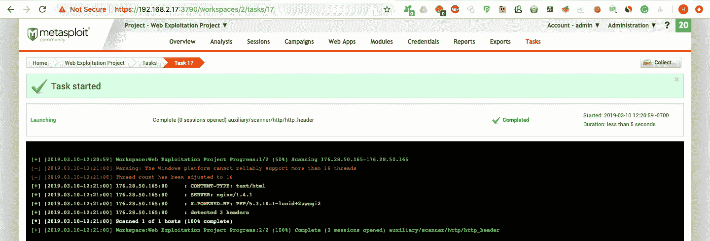

1.  任务完成后，我们可以转到分析选项卡，在“注释”部分，我们将能够看到扫描模块发现的所有标头：

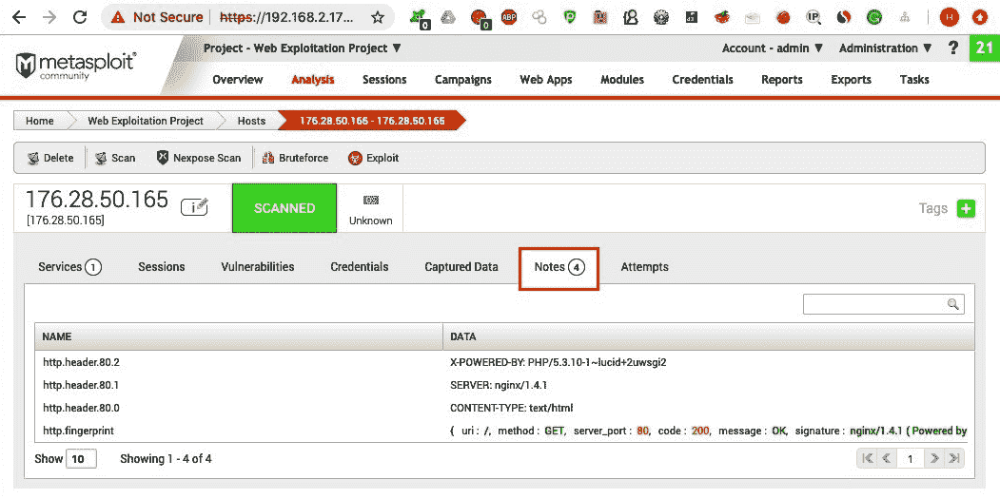

接下来，让我们看看网页机器人页面枚举。

# 网页机器人页面枚举

`robots.txt`（或*robots 排除标准*）是网站用来与爬虫或机器人通信的方法。让我们看看以下步骤中是如何进行枚举的：

1.  要阻止`Googlebot`访问子文件夹，我们将使用以下语法：

[PRE0]

1.  要告诉所有机器人不要爬取网站，我们可以将以下数据放入文本文件中：

[PRE1]

在这一部分，我们将使用`robots_txt`辅助程序来获取网站的`robots.txt`文件的内容：

1.  首先搜索带有`robots_txt`关键字的模块：

1.  点击模块将重定向我们到选项页面，在那里我们可以设置目标地址、RPORT、路径、VHOST 等。在我们的案例中，我们使用了`www.packtpub.com`作为 VHOST 的示例：

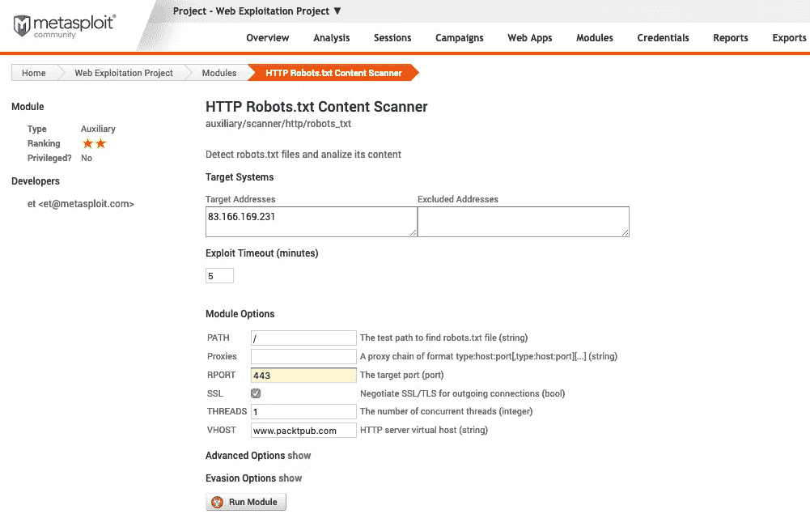

1.  点击“运行模块”后，将创建一个新任务，我们将能够在任务窗口中看到脚本运行的状态：

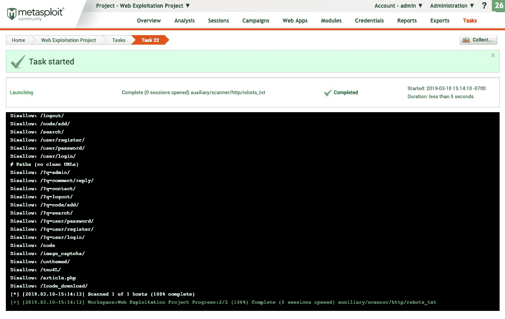

1.  任务完成后，我们可以返回到分析选项卡，点击目标主机的“注释”部分，查看网站的`robots.txt`文件中列出的所有目录的列表，如下图所示：

接下来，让我们在给定网站上查找一些配置错误的 Git 存储库。

# 查找隐藏的 Git 存储库

有时，在将代码从 Git 部署到生产服务器时，开发人员会将`git`文件夹留在公共目录中。这很危险，因为它可能允许攻击者下载应用程序的整个源代码。

让我们看看`git_scanner`模块，它可以帮助我们发现网站上配置错误的存储库：

1.  首先搜索`git_scanner`关键字：

1.  点击模块将重定向我们到模块选项页面，在那里我们指定目标地址和端口，然后点击“运行模块”：

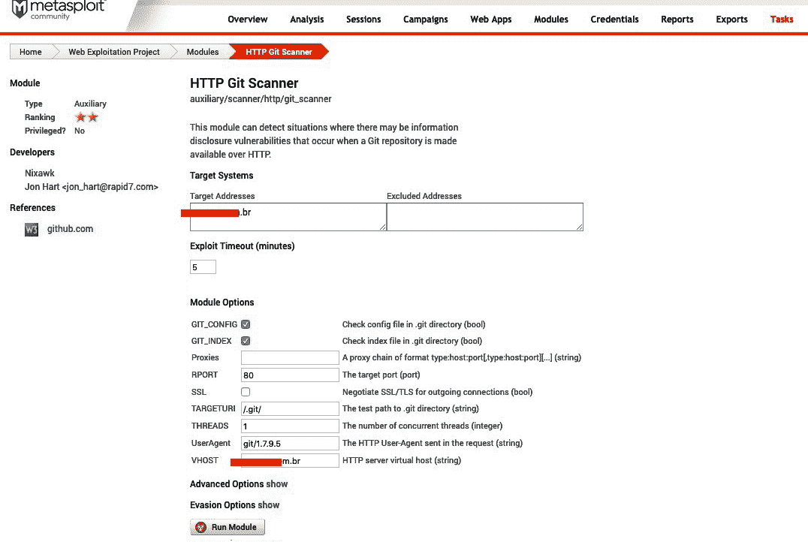

1.  如下图所示，创建了一个新任务：

1.  任务完成后，我们可以转到分析选项卡，点击我们的主机。在“注释”部分，我们看到辅助程序找到了存储库的`config`和`index`文件：

1.  接下来，我们可以转到“捕获的数据”选项卡，查看辅助程序找到的文件的内容：

1.  点击“查看”将显示`config`文件的内容，其中包含`git` URL、版本和一些分支信息。这些信息也可以用来下载应用程序的整个源代码：

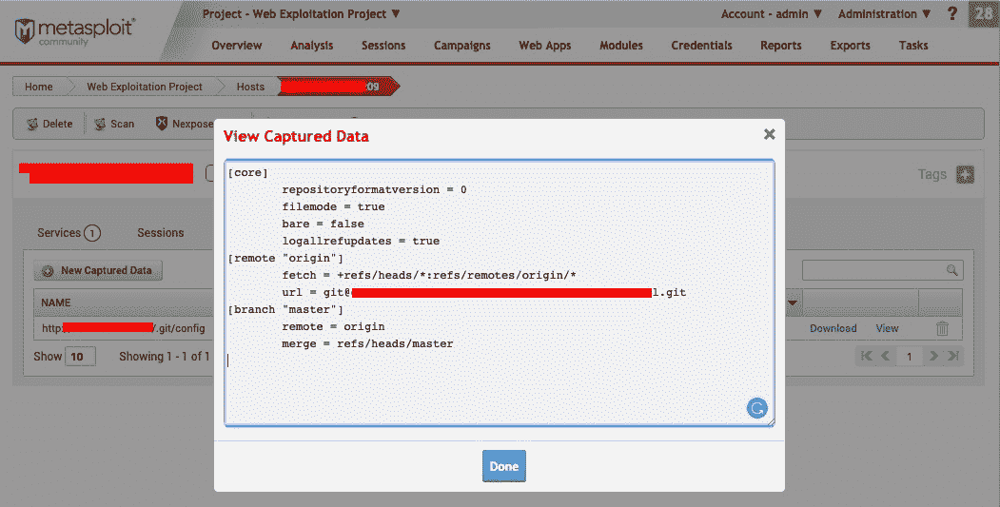

接下来，我们将检查开放代理服务。

# 开放代理检测

这是一个非常简单的脚本。它允许我们检查我们在端口上找到的代理服务是否是开放代理。如果代理服务是开放代理，我们可以使用服务器作为代理执行不同的攻击，并且可以避免检测，特别是在红队活动期间。按照以下步骤来看看这是如何完成的：

1.  首先在模块选项卡中搜索`open_proxy`关键字，如下图所示：

1.  点击模块名称，我们将被重定向到选项页面，在那里我们设置 IP、端口和 URL 以检查代理设置。

1.  点击运行模块将创建一个新任务：

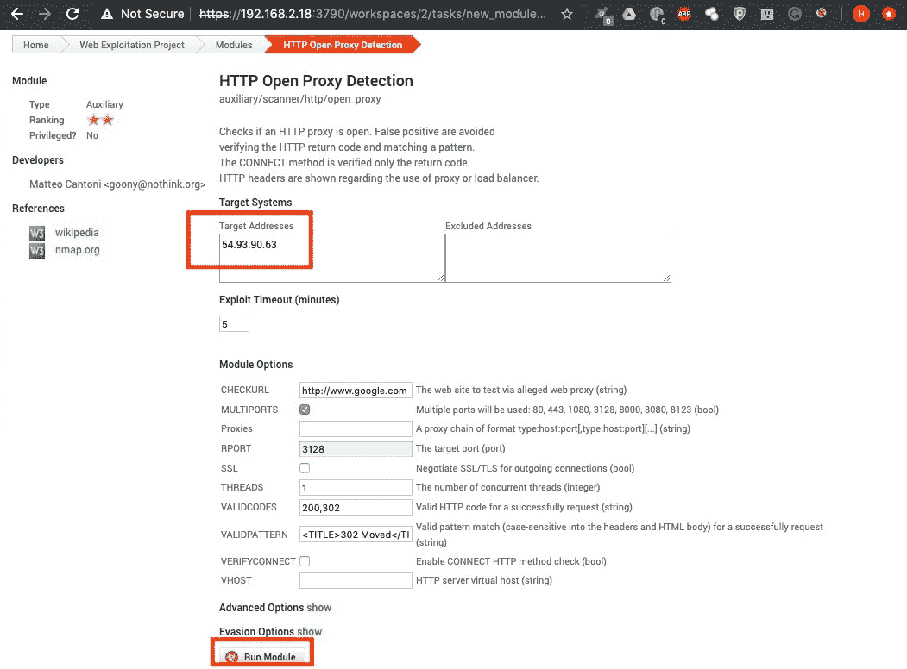

如果代理是开放的，我们将在任务窗口中看到一条消息，如下截图所示：

现在我们对使用 Metasploit 进行主动侦察有了更好的理解，让我们继续学习被动侦察的下一个主题。

# 被动侦察

被动侦察是一种在不主动与系统接触的情况下收集有关目标的信息的方法。我们不会直接接触系统。相反，我们将使用间接方法收集有关目标的信息，例如通过 Shodan 和 Censys。

Metasploit 有许多辅助程序，可以帮助进行被动侦察。在本节中，我们将看一些使用 Metasploit 辅助程序进行被动侦察的方法。

# 存档的域名 URL

存档的域名 URL 是执行被动侦察的最佳方式之一，因为它们告诉我们有关网站历史和其 URL 的信息。有时，网站会更改，但一些旧文件和文件夹会留在服务器上；这些可能包含漏洞，并允许我们获得访问权限。Archived.org 和 Google Cache 是我们可以使用来搜索存档的域名 URL 的两个服务。

Metasploit 还有一个专门用于此目的的内置辅助程序：

1.  我们可以在搜索模块屏幕中使用`enum_wayback`关键字来找到我们需要的辅助程序：

1.  点击模块，我们将被重定向到选项页面，在那里我们可以输入网站域名。然后，点击运行模块：

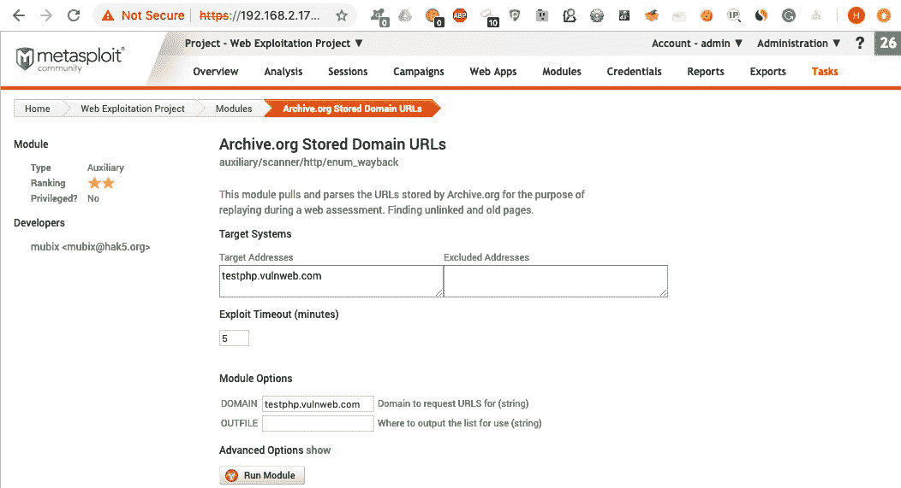

创建一个新任务，并且模块成功运行，打印出它在任务窗口中找到的输出，如下截图所示：

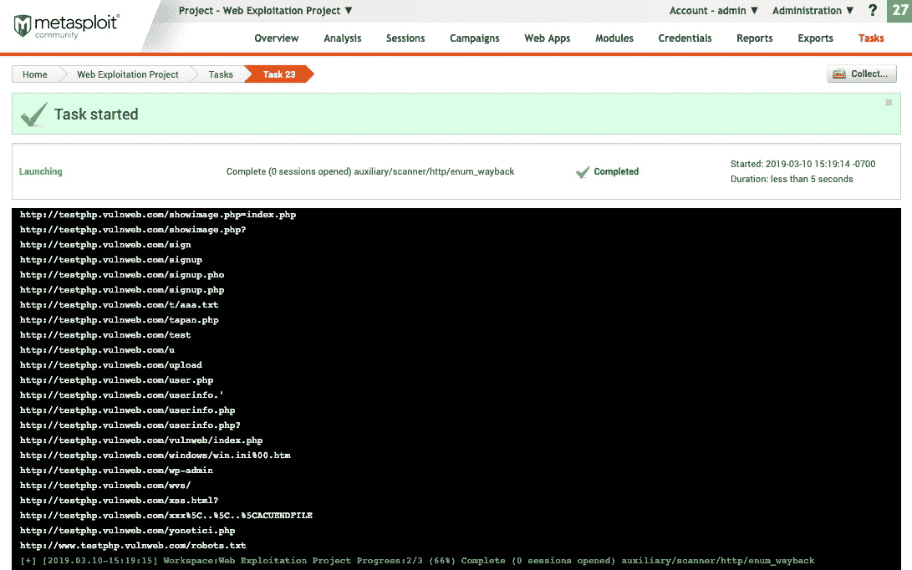

接下来，您将了解 Censys。

# Censys

Censys 是一个用于连接到互联网的设备的搜索引擎。Censys 于 2015 年在密歇根大学由开发 ZMap 的安全研究人员创建。

Censys 不断扫描和记录互联网上的设备：

1.  Metasploit 还有一个内置的辅助程序，可以进行 Censys 扫描。我们可以在模块搜索中使用`censys`关键字来定位脚本：

1.  点击模块将带我们到选项页面，但在这之前，我们需要登录到`censys.io`上的帐户，并获取 API ID 和 Secret，这将在模块中使用：

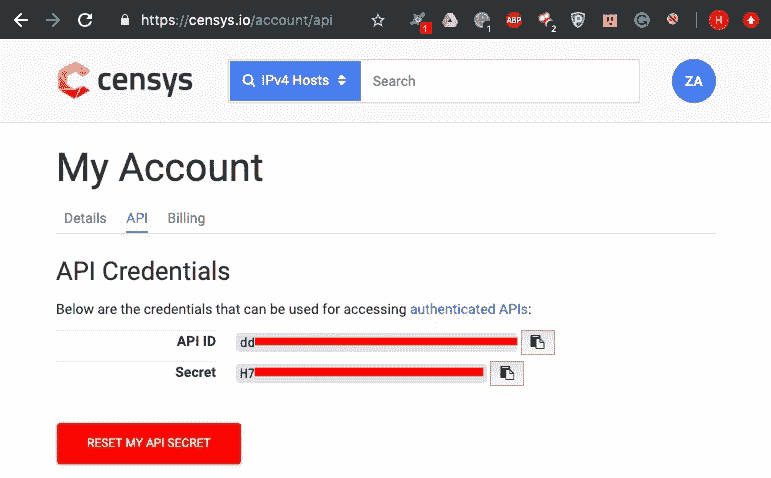

1.  我们在模块选项中输入 API ID 和 Secret，并将域名指定为目标地址。我们以`packtpub.com`为例：

1.  点击运行模块将创建一个新任务。辅助程序将搜索不同的主机和它们的端口。结果将如下截图所示打印出来：

Metasploit 还有模块可以搜索 Shodan 和 Zoomeye 数据库，如下截图所示：

以下截图显示了`shodan_search`模块的输出：

1.  要运行 Zoomeye 模块，我们可以搜索`zoomeye`关键字，并像我们为 Shodan 做的那样运行模块。如下截图所示：

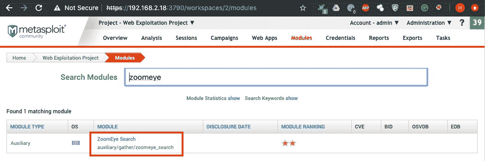

接下来，我们将学习 SSL 侦察。

# SSL 侦察

**安全套接字层**（**SSL**）被组织用来确保服务器和客户端之间的加密通信。在本节中，我们将看看 Metasploit 模块，该模块使用 SSL Labs 的 API 来收集有关主机上运行的 SSL 服务的情报：

1.  我们可以在模块搜索中搜索`ssllabs`关键字，以找到模块，如下面的屏幕截图所示：

1.  单击模块名称将重定向到选项页面。在这里，我们设置目标并单击运行模块：

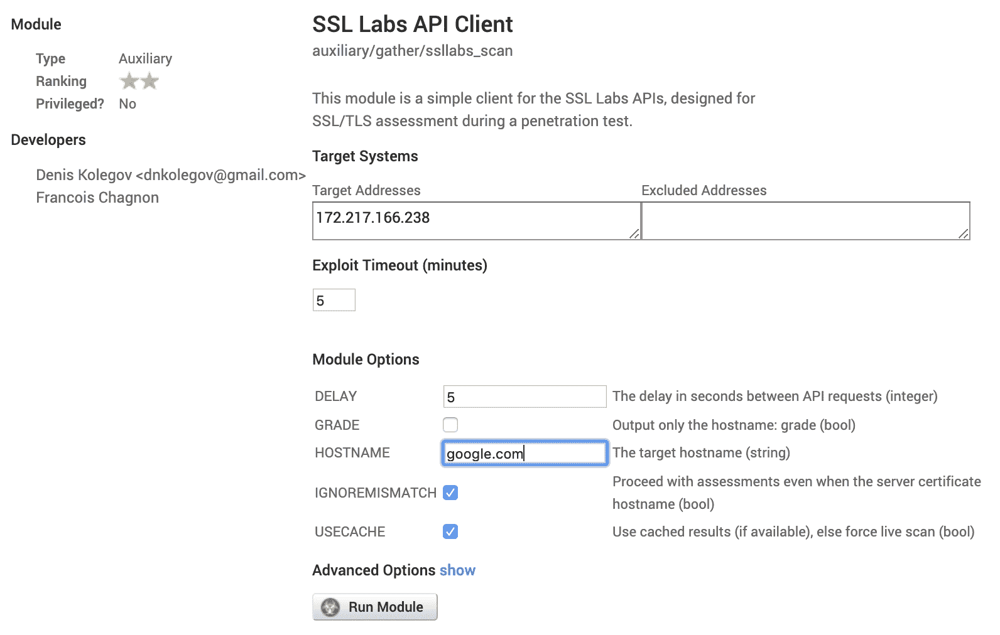

将创建一个新任务，该任务将显示我们的扫描结果和输出，如下面的屏幕截图所示：

SSL 可以透露很多东西，比如证书颁发机构、组织名称、主机和内部 IP。我们可以使用相同的模块来了解服务器上运行的 SSL 版本，检查服务器允许的密码，以及检查目标站点是否启用了**HTTP 严格传输安全**（**HSTS**）。

# 总结

在本章中，我们学习了侦察过程。我们从使用 HTTP 头和发现 Git 仓库的主动侦察开始。然后，我们转向被动扫描，查看 Shodan 和 SSL 分析，并使用存档的网页获取与目标相关的信息。

在下一章中，我们将学习如何使用 Metasploit 执行基于 Web 的枚举。我们将专注于 HTTP 方法枚举、文件和目录枚举、子域枚举等。

# 问题

1.  HTTP 头检测模块没有显示任何输出。这是否意味着模块没有正常工作？

1.  Metasploit Web 界面中的端口扫描有点有 bug。你能对此做些什么？

1.  您能在 Metasploit Web 界面中加载自定义模块，就像在 Metasploit 框架中使用它们一样吗？

1.  我的组织为我提供了安装在 VPS 上的 Metasploit Web 界面。我怎样才能确保 Web 界面的登录页面受到保护？

# 进一步阅读

要了解更多关于这个主题的信息，您可以查看以下网址：

+   [`metasploit.help.rapid7.com/docs/replacing-the-ssl-certificate`](https://metasploit.help.rapid7.com/docs/replacing-the-ssl-certificate)

+   [`github.com/rapid7/metasploit-framework/wiki/Metasploit-Web-Service`](https://github.com/rapid7/metasploit-framework/wiki/Metasploit-Web-Service)

+   [`www.offensive-security.com/metasploit-unleashed/scanner-http-auxiliary-modules/`](https://www.offensive-security.com/metasploit-unleashed/scanner-http-auxiliary-modules/)
