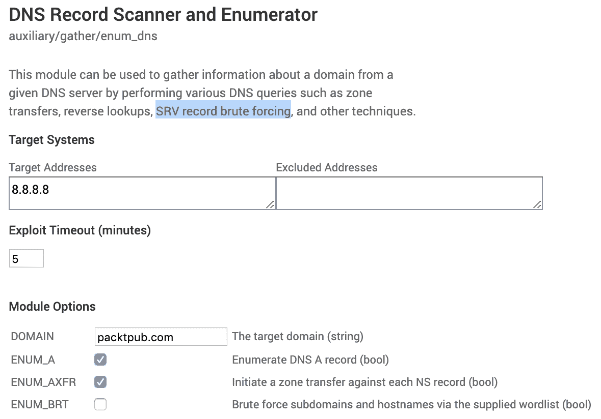
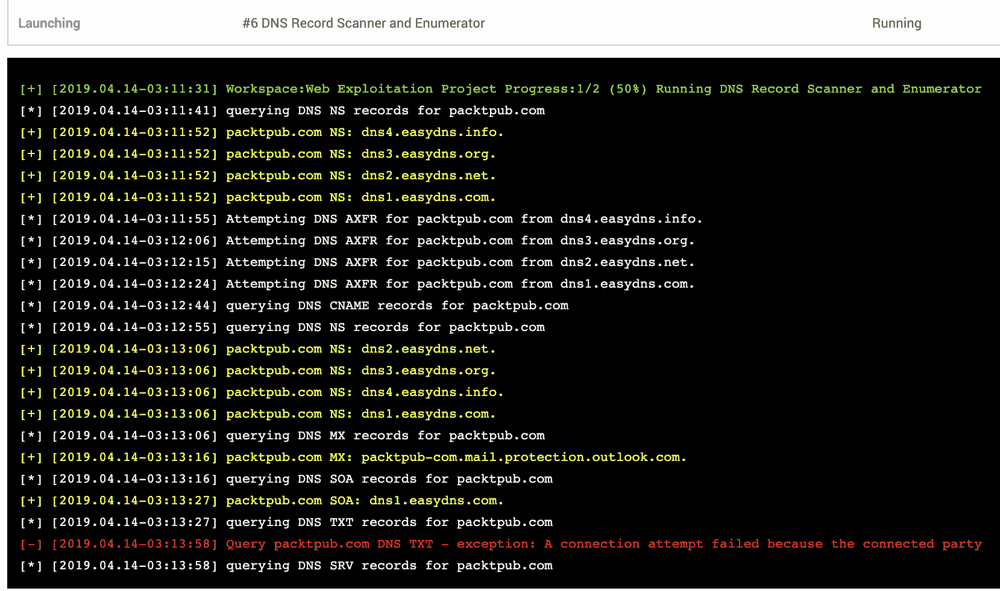
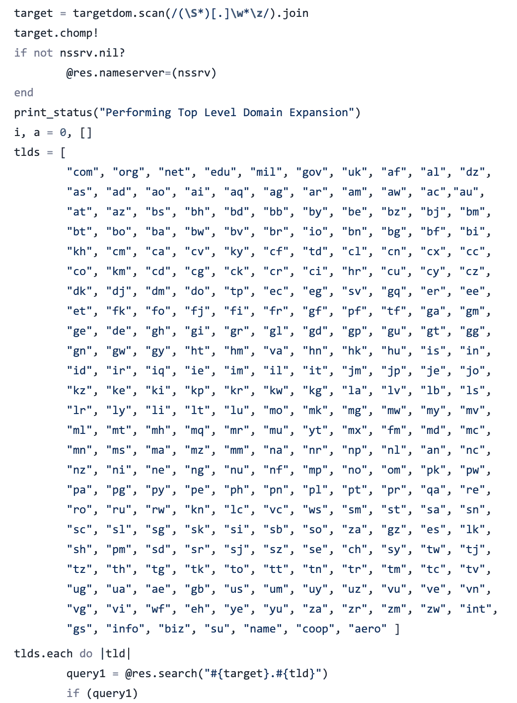
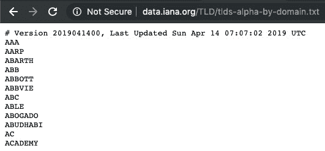
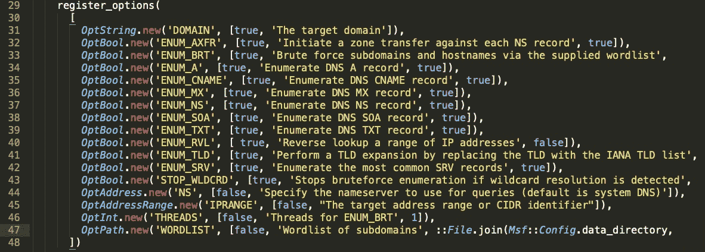
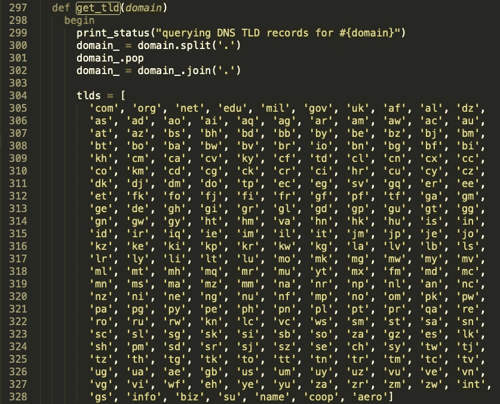
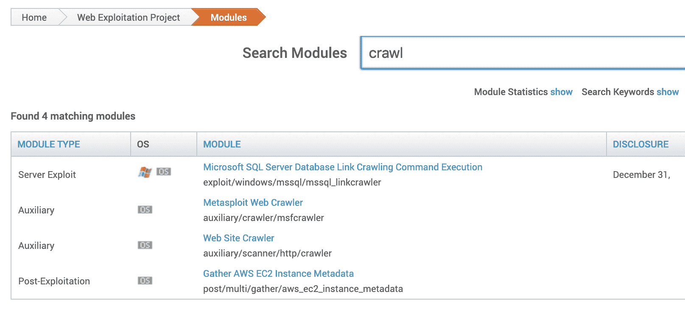
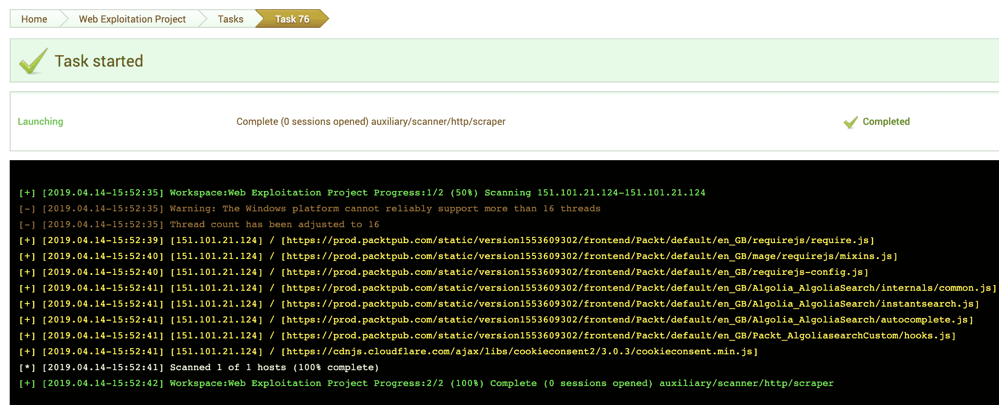

# 使用 Metasploit 进行 Web 应用程序枚举

枚举是足迹的一个子集，属于**渗透测试执行标准**（PTES）情报收集的第二阶段。执行枚举的主要优势是找到攻击端点，从中我们可以发动攻击或发动伪攻击有效负载，以确认漏洞是否存在于同一端点。在大多数渗透测试案例中，测试人员花费大约 60-70%的时间寻找信息。测试人员使用这些信息来识别一些新的漏洞。枚举越好，渗透测试的结果就越好。在本章中，我们将涵盖以下主题：

+   枚举简介

+   DNS 枚举

+   枚举文件

+   使用 Metasploit 进行爬取和抓取

# 技术要求

以下是本章的先决条件：

+   安装了 Metasploit 社区版（CE）的 Web 界面

+   基于*nix 系统或 Microsoft Windows 系统

+   用于枚举的通用单词列表-推荐使用 SecLists

# 枚举简介

在枚举过程中，我们从最初的足迹/侦察中检索到的所有信息将首次使用。对于渗透测试 Web 应用程序，我们需要对枚举过程有很好的理解。越好的侦察和枚举，我们就越快、越容易地找到 Web 应用程序中的漏洞。使用枚举，我们可以找到以下内容：

+   隐藏文件和目录

+   备份和配置文件

+   子域和虚拟主机

让我们首先看一下 DNS 枚举以及如何使用 Metasploit 进行 DNS 枚举。

# DNS 枚举

Metasploit 还可以用于从 DNS 记录中获取有关主机的信息，使用`dns_enum`辅助功能。此脚本使用 DNS 查询来获取信息，如**MX**（邮件交换器）、**SOA**（授权起始）、**SRV**（服务）记录。它可以在网络内外使用。有时，DNS 服务配置为可被公众访问；在这种情况下，我们可以使用`dns_enum`来查找内部网络主机、MAC 地址和 IP 地址。在本节中，我们将看一下`dns_enum`的用法：

1.  我们可以在模块搜索选项中使用`enum_dns`关键字来查找辅助功能：

1.  单击模块名称将重定向我们到选项页面，如下图所示：

在这里，我们可以设置目标详细信息，例如我们正在使用的 DNS 服务器、域名以及我们希望脚本获取的记录。

1.  单击“运行模块”将创建一个新任务，输出将显示在下面的截图中：

现在让我们看看如何进一步改进以满足我们的需求，并使模块获取更多结果。

# 额外的工作-编辑源代码

Metasploit 中的`enum_dns`模块有点过时（我们可以检查 TLD 单词列表是否有更新）。因此，让我们定制模块以满足我们的需求。我们的想法是为`enum_dns`提供**顶级域**（TLD）单词列表，然后解析并检查条目以查询记录。从辅助功能的源代码中可以看到，它寻找的 TLD 不包括最近推出的新 TLD：

这可以在*第 302 行*中看到，在`modules/auxiliary/gather/enum.dns.rb`文件中，也可以通过访问以下链接在线访问：

[`github.com/rapid7/metasploit-framework/blob/f41a90a5828c72f34f9510d911ce176c9d776f47/modules/auxiliary/gather/enum_dns.rb#L302`](https://github.com/rapid7/metasploit-framework/blob/f41a90a5828c72f34f9510d911ce176c9d776f47/modules/auxiliary/gather/enum_dns.rb#L302)

从前面的源代码中，我们可以看到 TLD 存储在`tlds[]`数组中。让我们编辑代码以通过以下步骤更新 TLD。更新的 TLD 列表可以从**互联网编号分配机构**（**IANA**）网站找到：[`data.iana.org/TLD/tlds-alpha-by-domain.txt`](http://data.iana.org/TLD/tlds-alpha-by-domain.txt)：

1.  从上述 URL 下载 TLD 文件并删除以`#`开头的第一行：

1.  在修改 Metasploit 模块之前，使用以下命令备份`enum_dns.rb`文件：

[PRE0]

请注意，Metasploit 框架安装在`/usr/local/share`目录中。在我们的情况下，我们已将文件命名为`enum_dns.rb.bak`。

1.  现在，使用您选择的任何文本编辑器打开`enum_dns.rb`文件并转到第 29 行：

1.  让我们向代码添加另一个注册条目，以便我们可以将我们的 TLD 单词列表提供给 Metasploit 模块：

在这个模块中，默认情况下禁用了 TLD 枚举。正如我们从上面的屏幕截图中所看到的，当`ENUM_TLD`选项设置为`TRUE`时，`ENUM_TLD`选项将通过用 IANA TLD 列表（旧列表）替换 TLD 来执行 TLD 扩展。

1.  让我们搜索`ENUM_TLD`字符串以查找`function()`，这将在启用 TLD 枚举选项时调用。

正如我们从下面的屏幕截图中所看到的，如果`ENUM_TLD`设置为`TRUE`，将调用`get_tld()`函数：

1.  现在让我们看看`get_tld()`函数：

1.  现在让我们添加一个代码部分，它将加载最新的 TLD 单词列表并将其保存在`tlds[]`数组中。请注意，我们已经从前面的屏幕截图中清空了 TLD 数组：

我们在这里做了什么？以下表格解释了前面屏幕截图中使用的函数和代码结构：

| **代码** | **描述** |
| --- | --- |
| `tlds = []` | 这声明了一个数组。 |
| `tld_file = datastore['TLD_WORDLIST']` | 这将单词列表文件名（带位置）保存在`tld_file`变量中。 |
| `File.readlines(tld_file).each do &#124;tld_file_loop&#124;` | 这逐行读取 TLD 单词列表。 |
| `tlds << tld_file_loop.strip` | 这会从每行中剥离`\n`并将其保存在`tlds[]`数组中。 |

1.  现在，保存文件并在 msfconsole 中执行`reload`命令以重新加载框架中的模块：

1.  现在让我们使用定制的`enum_dns`模块并执行`show options`：

正如我们从前面的屏幕截图中所看到的，我们已经将域设置为`google.com`以查找 Google 的 TLD。我们还将`TLD_WORDLIST`选项设置为我们更新的 TLD 单词列表。让我们执行它：

太棒了！更新后的 Metasploit 模块现在向我们显示了 TLD，这些 TLD 是提供给模块本身的。现在让我们继续下一节，在那里我们将使用 Metasploit 枚举文件和目录。

# 枚举文件

在渗透测试活动期间，枚举文件和目录是最重要的步骤之一。服务器端的小配置错误可能导致我们找到以下文件：

+   隐藏文件

+   备份文件

+   配置文件

+   重复文件

+   包含重要信息的文件，例如凭据文件、密码备份、错误日志、访问日志和调试跟踪

这些文件中包含的信息可以帮助我们计划对组织的进一步攻击。

以下是 Metasploit 框架中可用的一些辅助功能，可以帮助我们收集信息：

+   `dir_scanner`

+   `brute_dirs`

+   `prev_dir_same_name_file`

+   `dir_listing`

+   `copy_of_file`

+   `Backup_file`

以下是前述辅助功能的一些示例：

1.  我们可以使用 HTTP 目录扫描模块来查找目录列表，以及隐藏目录。我们可以使用`dir_scanner`关键字来查找模块，如下面的屏幕截图所示：

1.  单击模块名称将带我们到选项页面，在那里我们可以指定目标 IP/域名和端口号，如下面的屏幕截图所示：

1.  单击运行模块将创建一个新任务，我们可以在任务窗口中看到输出：

前面的屏幕截图显示了脚本发现的不同目录。

1.  扫描完成后，我们还可以在主机标签中查看目录列表：

1.  我们转到分析标签，并选择进行扫描的主机。

1.  单击漏洞标签将显示辅助工具找到的所有目录的列表，如下面的屏幕截图所示。同样，我们可以使用本节开头列出的其他模块来执行进一步的枚举：

在接下来的部分，我们将学习使用 web 辅助程序进行爬行和抓取。

# 使用 Metasploit 进行爬行和抓取

Metasploit 还允许我们使用辅助程序进行爬行和抓取网页。当我们想要通过定义的模式从网站的源代码中抓取内容时，抓取是很有用的。它可以为我们提供诸如在注释中提到的目录、开发人员电子邮件和后台进行的 API 调用等信息：

1.  对于爬行，我们可以使用`crawl`关键字来查找模块：

1.  我们将使用`msfcrawler`。单击模块将重定向我们到选项页面，在那里我们定义我们的目标、端口和深度。然后，单击运行模块：

1.  将创建一个新任务，并在任务窗口中看到找到的页面列表：

1.  同样，我们可以使用 HTTP Scrape 模块`auxiliary/scanner/http/scraper`来抓取网页：

模式字段是我们定义的用于查找我们想要的任何元素的正则表达式。在我们的情况下，我们想要抓取[`prod.packtpub.com/`](https://prod.packtpub.com/)网站上脚本标记内的所有内容，所以我们的模式是`<script \ type=\"text\/javascript\" \ src=\"(.*)\"><\/script>)`。

运行模块将创建一个新任务，辅助程序将提取脚本标记中列出的所有数据，如下面的屏幕截图所示：

接下来，让我们扫描虚拟主机。

# 扫描虚拟主机

Metasploit 还允许我们扫描配置在同一 IP 上的虚拟主机。虚拟主机是在单个服务器上托管多个域名，并且每个域名都配置有不同的服务。它允许单个服务器共享资源：

1.  我们将使用 Metasploit 控制台进行此模块。要搜索`vhost`模块，我们可以使用`vhost_scanner`关键字：

1.  我们设置`rhosts`和`domain`。在我们的情况下，我们使用了`packtpub.com`域和`151.101.21.124` IP：

1.  我们通过输入`run`来运行模块。辅助程序将进行扫描，并打印出所有找到的`vhosts`：

这个辅助工具也可以用于内部网络，以查找托管在同一服务器上但配置有不同域的不同内部应用程序。

# 总结

在本章中，我们涵盖了枚举，这是渗透测试生命周期中最重要的部分。我们从使用 Metasploit 模块枚举 DNS 开始，然后转向枚举文件和目录。最后，我们还研究了爬行模块以及`vhost`查找模块。

在下一章中，我们将学习如何使用 Web 应用程序扫描工具或 WMAP。WMAP 是一个用于对目标 Web 应用程序进行漏洞扫描的 Metasploit 插件。

# 问题

1.  我们可以使用自定义字典来枚举文件和目录吗？

1.  我们可以定制 Metasploit 有效载荷以一次性自动执行所有枚举吗？

1.  我们真的需要为抓取 HTTP 页面提供正则表达式吗？

# 进一步阅读

以下是一些可以供进一步阅读的网址：

+   [`www.offensive-security.com/metasploit-unleashed/`](https://www.offensive-security.com/metasploit-unleashed/)

+   [`resources.infosecinstitute.com/what-is-enumeration/`](https://resources.infosecinstitute.com/what-is-enumeration/)
