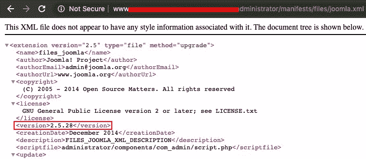
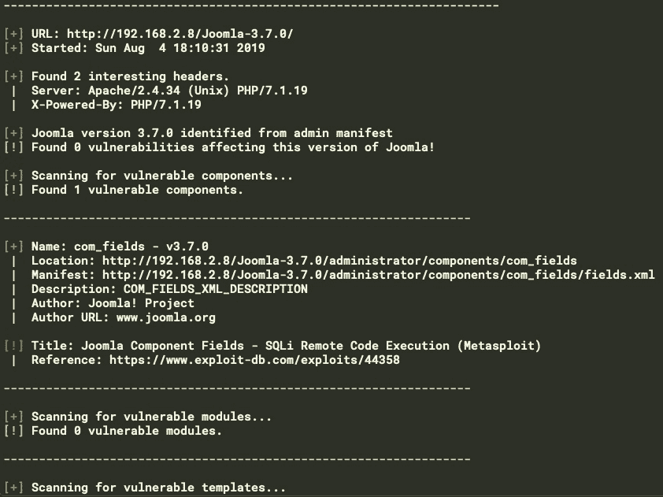
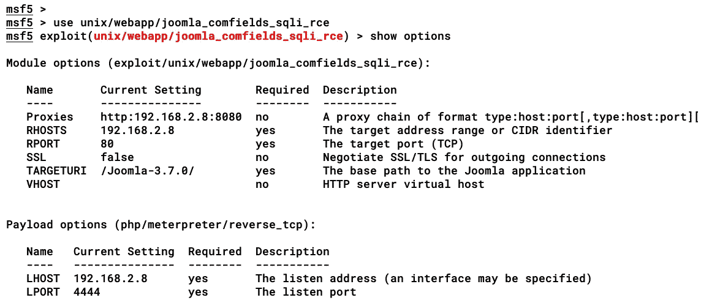
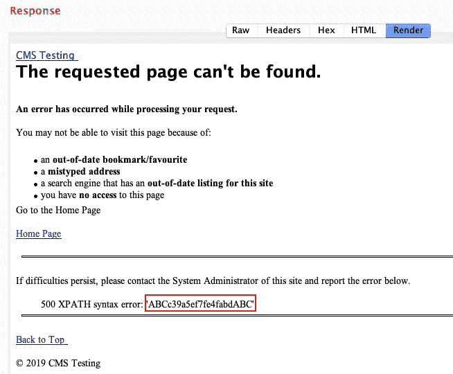
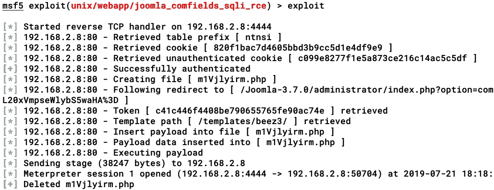
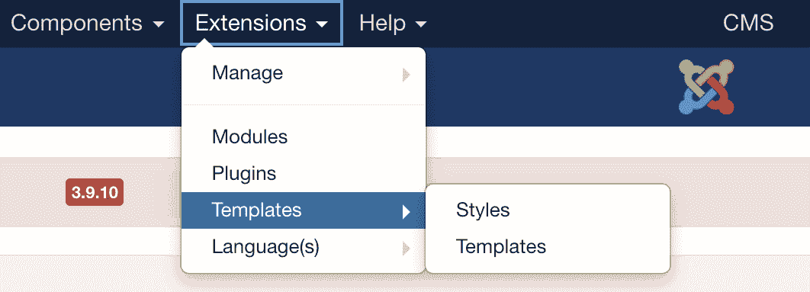
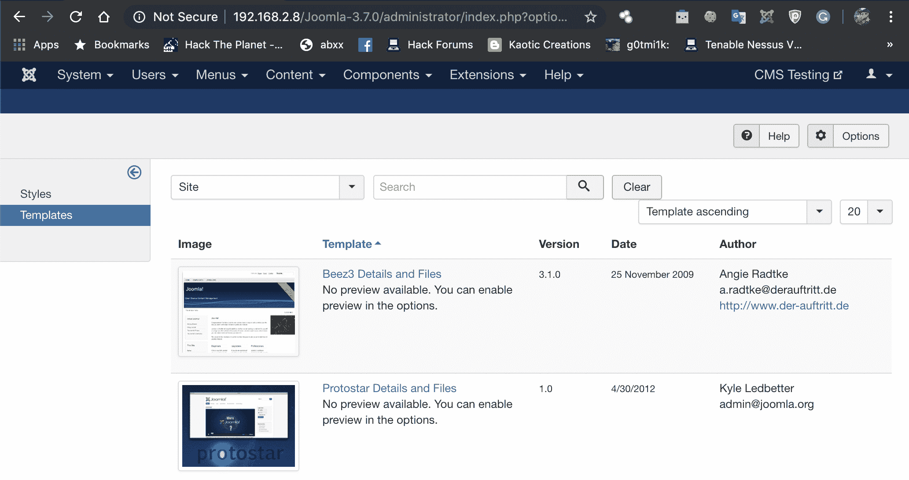

# 第十二章：渗透测试 CMS - Joomla

在上一章中，我们学习了如何对 WordPress 进行**渗透测试**（**pentesting**）。就像 WordPress 一样，还有另一个被组织广泛使用来管理其网站门户的**内容管理系统**（**CMS**）- Joomla。在本章中，我们将学习 Joomla，其架构以及可用于测试基于 Joomla 的网站安全性的模块。以下是本章将涵盖的主题：

+   Joomla 简介

+   Joomla 架构

+   侦察和枚举

+   使用 Metasploit 枚举 Joomla 插件和模块

+   使用 Joomla 进行漏洞扫描

+   使用 Metasploit 进行 Joomla 利用

+   Joomla shell 上传

# 技术要求

以下是本章的技术先决条件：

+   Metasploit 框架（[`github.com/rapid7/metasploit-framework`](https://github.com/rapid7/metasploit-framework)）

+   Joomla CMS（[`www.joomla.org/`](https://www.joomla.org/)）

+   已安装的数据库；推荐使用 MySQL（[`www.mysql.com/`](https://www.mysql.com/)）

+   对 Linux 命令的基本了解

# Joomla 简介

Joomla 是一个由 Open Source Matters，Inc.创建的免费开源 CMS，用于发布 Web 内容。它基于**模型-视图-控制器**（**MVC**）Web 应用程序框架，可以独立于 CMS 使用。 Joomla 成立于 2005 年 8 月 17 日，是 Mambo 分支的结果。

Joomla 有成千上万的扩展和模板，其中许多是免费提供的。 Joomla 的一些功能包括以下内容：

+   它是多语言的。

+   它提供开箱即用的**搜索引擎优化**（**SEO**）并且是**搜索引擎友好**（**SEF**）的。

+   它是免费使用的，遵循**通用公共许可证**（**GPL**）。

+   它具有访问控制列表，允许您管理网站的用户以及不同的用户组。

+   它具有菜单管理，因此可以创建尽可能多的菜单和菜单项。

现在我们已经简要介绍了 Joomla，让我们看看它的架构，以深入了解软件。

# Joomla 架构

Joomla 的架构基于 MVC 框架。我们可以将架构分为四个主要部分：

+   **显示**：这是用户访问网站时看到的前端。它包含 HTML 和 CSS 文件。

+   **扩展**：扩展可以进一步分为五种主要类型：

+   **组件**：组件可以被视为迷你应用程序；它们既适用于用户也适用于管理员。

+   **模块**：这些是可以用于呈现页面的小型灵活扩展。一个例子是登录模块。

+   **插件**：这些是更高级的扩展，也被称为事件处理程序。这些事件可以从任何地方触发，并执行与该事件相关联的插件。

+   **模板**：模板负责网站的外观。有两种类型的模板—前端和后端。后端模板由管理员用于监视功能，而前端模板向访问者/用户呈现网站。

+   **语言**：这些处理网站文本的翻译。 Joomla 支持 70 多种语言。

+   **框架**：框架由 Joomla 核心组成。这些是负责应用程序的主要功能的 PHP 文件，例如配置文件。

+   **数据库**：数据库存储用户信息，内容等。 Joomla 支持 MySQL，**Microsoft Server SQL**（**MSSQL**）和 PostgreSQL 等。

# 文件和目录结构

Joomla 中的目录名称非常简单。我们可以通过查看其名称来猜测目录的内容。 Joomla 文件和目录具有以下结构：

+   `根`：这是我们提取 Joomla 源代码的地方。它包含一个执行安装过程的索引文件。

+   `管理员`：此文件夹包含 Joomla 管理员界面的所有文件（组件、模板、模块、插件等）。

+   `缓存`：此文件夹包含 Joomla 缓存的文件，以增加 CMS 的性能和效率。

+   `组件`：此文件夹包含所有用户组件（不包括管理员），包括登录和搜索。

+   `图像`：此目录包含 Joomla 界面使用的所有图像，以及用户上传的图像。

+   `包含`：此目录包含核心 Joomla 文件。

+   `安装`：此文件夹包含安装 Joomla 所需的文件。安装后应删除它。

+   `语言`：此文件夹包含所有语言文件。Joomla 以简单的 INI 格式文件存储翻译。

+   `库`：此文件夹包含整个核心库，以及 Joomla 的第三方库。它包含描述文件系统、数据库等的文件。

+   `日志`：此文件夹包含应用程序日志。

+   `媒体`：此目录存储所有媒体文件，如 Flash 和视频。

+   `模块`：模块放置在 Joomla 模板中，如面板。此文件夹包含所有前端模块的文件。一些常见的模块包括登录、新闻和投票。

+   `插件`：此文件夹包含所有插件文件。

+   `模板`：此文件夹包含所有前端模板文件。每个模板都按名称组织在文件夹中。

+   `Tmp`：此文件夹存储管理员和用户界面使用的临时文件和 cookie。

我们现在已经了解了 Joomla 的架构。接下来，我们将看一下侦察和枚举。

# 侦察和枚举

在使用 Joomla 之前，要执行的第一步是确认 Web 应用程序是否由其提供动力。有各种方法可以检测 CMS 的安装，其中一些列在这里：

+   通过搜索`<meta name="generator" content="Joomla! - Open Source Content Management" />`

+   通过探索`X-Meta-Generator HTTP`标头

+   通过检查`RSS/atom feeds: index.php?format=feed&type=rss/atom`

+   通过 Google Dorks：`inurl:"index.php?option=com_users`

+   通过查找`X-Content-Encoded-By: Joomla`标头

+   通过查找`joomla.svg/k2.png/SOBI 2.png/SobiPro.png/VirtueMart.png`

接下来，让我们找出安装了哪个版本的 Joomla。

# 版本检测

现在我们已经对 Joomla 有了足够的了解，我们可以开始 CMS 渗透测试（我们在上一章中学到了，第八章，*Pentesting a CMS – WordPress*）。渗透测试 Joomla CMS 的第一步是找出目标服务器上安装的版本。以下是我们可以检测安装了哪个版本的方法：

+   通过元标记进行检测

+   通过服务器标头进行检测

+   通过语言配置进行检测

+   通过`README.txt`进行检测

+   通过`manifest`文件进行检测

+   通过唯一关键字进行检测

# 通过元标记进行检测

`generator`元标记通常被描述为用于生成文档或网页的软件。确切的版本号在元标记的`content`属性中披露：

！

基于 Joomla 的网站通常在其源代码中具有此标记，如前面的屏幕截图所示。

# 通过服务器标头进行检测

Joomla 的版本号经常在托管应用程序的服务器的响应标头中披露。版本可以在`X-Content-Encoded-By`标头中披露，如下面的屏幕截图所示：

！

接下来，我们将通过语言配置来进行检测。

# 通过语言配置进行检测

Joomla 支持 70 多种语言。每种语言包都有一个 XML 文件，其中披露了版本信息，如下所示：

！

可以通过`/language/<language-type>/<language-type>.xml`页面访问此页面。在这种情况下，我们搜索了英国英语（`en-GB`）格式。

# 通过 README.txt 检测

这是最简单和最基本的技术。我们所要做的就是访问`README.txt`页面，我们将看到版本号，如下所示：

该文件包含有关 Joomla 首次用户的各种信息。

# 通过清单文件检测

Joomla 的`manifest`文件位于`/administrator/manifests/files/joomla.xml`，包含了有关服务器上安装的 CMS 的基本信息，以及正在运行的模块、版本号、安装日期等。这也是查找正在运行的 CMS 版本号的好地方：

上述截图显示了包含版本号的`manifest`文件。

# 通过唯一关键字检测

确定 Web 服务器上运行的 Joomla 版本的另一种方法是在以下文件中查找特定关键字。这些关键字是特定于版本的，其中一些在此代码块后面的表中列出：

[PRE0]

根据其 Joomla 版本的唯一关键字详细信息如下：

| **Joomla 版本** | **唯一关键字** |
| --- | --- |
| 版本 2.5 | `MooTools.More={version:"1.4.0.1"}` |
| 版本 1.7 | `21322 2011-05-11 01:10:29Z dextercowley``22183 2011-09-30 09:04:32Z infograf768``21660 2011-06-23 13:25:32Z infograf768``MooTools.More={version:"1.3.2.1"}` |
| 版本 1.6 | `20196 2011-01-09 02:40:25Z ian``20990 2011-03-18 16:42:30Z infograf768``MooTools.More={version:"1.3.0.1"}` |
| 版本 1.5 | `MooTools={version:'1.12'}``11391 2009-01-04 13:35:50Z ian` |
| 版本 1.0 | `47 2005-09-15 02:55:27Z rhuk``423 2005-10-09 18:23:50Z stingrey``1005 2005-11-13 17:33:59Z stingrey``1570 2005-12-29 05:53:33Z eddieajau``2368 2006-02-14 17:40:02Z stingrey``4085 2006-06-21 16:03:54Z stingrey``4756 2006-08-25 16:07:11Z stingrey``5973 2006-12-11 01:26:33Z robs``5975 2006-12-11 01:26:33Z robs` |

以下截图显示了`en-GB.ini`文件中的一个关键字，这意味着版本是 1.6：

在下一节中，我们将看看如何使用 Metasploit 对 Joomla 进行侦察。

# 使用 Metasploit 进行 Joomla 侦察

现在我们已经了解了检测基于 Joomla 的目标的不同方法，我们可以使用 Metasploit 框架已经提供的 Metasploit 模块进行侦察。我们将使用的第一个模块是`joomla_version`模块。我们可以使用`use auxiliary/scanner/http/joomla_version`命令，如下所示：

设置模块所需的所有信息（即 RHOSTS 和 RPORT）后，我们可以使用`run`命令执行模块，如下所示：

该模块将通过我们在*版本检测*部分中介绍的不同方法返回运行在目标实例上的 Joomla 版本。在下一节中，我们将学习如何使用 Metasploit 枚举 Joomla 插件和模块。

# 使用 Metasploit 枚举 Joomla 插件和模块

我们还可以使用 Metasploit 的内置辅助工具来进行 Joomla 的枚举。以下是在 Metasploit 中可用的用于枚举 Joomla 的类别：

+   页面枚举

+   插件枚举

# 页面枚举

第一个是**页面枚举**。这个辅助程序扫描 Joomla 中存在的常见页面，如`readme`和`robots.txt`。

要使用辅助工具，我们使用以下命令：

[PRE1]

然后，我们使用`show options`命令查看各种模块选项，如下所示：

我们设置`RHOSTS`和`RPORT`并运行模块。模块完成后，发现的页面将被打印出来，如下所示：

下一步是使用另一个 Metasploit 模块枚举 Joomla 插件。

# 插件枚举

Metasploit 的另一个辅助工具，可用于枚举插件的是`joomla_plugins`。该辅助工具使用一个单词列表来查找目录路径，以检测 Joomla 使用的各种插件。我们可以执行以下命令来使用插件枚举模块：

[PRE2]

以下屏幕截图显示了前述命令的输出：

`show options`的输出如前面的屏幕截图所示。一旦执行了模块，脚本将返回它发现的插件的名称，如下所示：

默认情况下，辅助工具使用[`github.com/rapid7/metasploit-framework/blob/master/data/wordlists/joomla.txt`](https://github.com/rapid7/metasploit-framework/blob/master/data/wordlists/joomla.txt)上的单词列表；我们也可以使用自定义单词列表。在下一节中，我们将使用 Joomla 进行漏洞扫描。

# 使用 Joomla 进行漏洞扫描

Metasploit 目前还没有内置的 Joomla 特定漏洞评估模块。这给我们两个选择；要么像我们在上一章中为 WordPress 所做的那样，为 Joomla 自己制作一个包装器或插件，要么使用已经在线可用的不同工具，如 JoomScan 或 JoomlaVS。在本节中，我们将看一个可以用于执行 Joomla 漏洞评估的优秀工具。

官方 Joomla GitHub 维基页面上包括以下描述：

JoomlaVS 是一个 Ruby 应用程序，可以帮助自动评估 Joomla 安装对利用的脆弱性。它支持基本的指纹识别，并且可以扫描组件、模块和模板中存在的漏洞，以及 Joomla 本身存在的漏洞。

JoomlaVS 可以从以下网址下载：[`github.com/rastating/joomlavs`](https://github.com/rastating/joomlavs)。

可以通过执行以下命令来运行该工具：

[PRE3]

在没有任何参数的情况下运行该工具将打印`help`部分，如下面的屏幕截图所示。该工具支持不同的扫描类型，例如仅扫描模块、模板或组件：

要对 URL 进行所有扩展的扫描，我们可以使用以下命令：

[PRE4]

工具将开始运行，并且它发现的所有细节将打印在屏幕上，如下所示：

一旦我们获得了关于可用漏洞、插件和版本号的信息，我们就可以继续进行利用过程。

# 使用 Metasploit 进行 Joomla 漏洞利用

一旦所有的枚举和版本检测完成，就该进行利用了。在本节中，我们将看一些 Joomla 可以被利用的方式。第一个是在 Joomla 中应用的众所周知的 SQL 注入漏洞，以获得**远程代码执行**（**RCE**）。Metasploit 模块可用于此，我们可以通过执行`use exploit/unix/webapp/joomla_comfields_sqli_rce`命令来使用它，如下面的屏幕截图所示：

在运行利用之前，让我们看看它是如何工作的。

# 漏洞利用的原理是什么？

以下 SQL 查询被发送到服务器，返回表名前缀的 Base64 编码值：

这可以如下所示：

[PRE5]

可以在此处看到发送到 Web 服务器的请求的屏幕截图：

网络服务器返回表名前缀的 Base64 编码值，如下所示，在`ABC`之间：

以下屏幕截图显示了用于转储用户会话的 SQL 查询：

如下所示：

[PRE6]

请求使用`send_request_cgi()`方法发送。服务器将返回`内部服务器错误`错误（代码`500`），但我们可以使用十六进制值——换句话说，`#{start_h}`和`#{fin_h}`——作为正则表达式从输出中查找会话。以下截图显示了查找十六进制值之间会话的代码：

以下截图显示了发送到服务器以转储会话信息的 SQL 查询：

以下截图显示了 Web 服务器的响应，显示了用户的会话：

如下所示，从数据库中检索到了会话，但在我们的情况下，我们遇到了一个问题；似乎存在字符限制：

查看数据库中的值，我们可以看到并没有返回所有字符，如下所示：

最后三个具有十六进制值`ABC`的字符未显示在屏幕上。为了解决这个问题，我们可以使用一个解决方法，即不使用单个查询从数据库中检索会话，而是使用`MID()`函数将会话分为两部分。

需要使用的第一个 SQL 会话负载`1`如下所示：

[PRE7]

如下所示：

执行前述 SQL 负载`1`的结果如下所示：

现在，我们需要使用的第二个 SQL 会话负载如下：

[PRE8]

如下所示：

执行前述 SQL 负载`2`的结果如下所示：

现在，我们只需要将我们在前面步骤中通过执行负载`1`和`2`检索到的两个输出连接成一个。让我们将代码添加到模块中：

现在代码已经修改，让我们保存文件并执行模块，看看是否有效：

如我们从前面的截图中所见，我们成功检索到了会话，并且使用存储在数据库中的会话，我们打开了一个 Meterpreter 会话！

# Joomla shell 上传

为了理解先前提到的漏洞中上传 shell 的位置，我们将从管理员面板手动上传一个基本的命令执行 shell。

利用后，一旦我们成功以管理员身份登录，我们可以从模板菜单中上传一个 shell。以下截图显示了 Joomla 的管理面板：

从面板菜单中，我们点击 Extensions | Templates | Templates，如下所示：

我们被重定向到模板页面，列出了当前上传的所有模板，包括当前使用的模板。最好不要触摸当前的模板，因为这可能会引起管理员注意到变化并发现我们的代码：

前面的截图显示了模板列表。我们将选择 Protostar，因此点击模板，然后将被重定向到下一页，在左侧列出了所有模板的 PHP 页面，如下所示：

我们点击 index.php 并向文件添加我们自定义的 PHP 一行代码。这将充当后门，并允许我们执行系统级命令：

[PRE9]

以下截图显示了索引的第一行现在有我们的后门：

保存更改后，我们可以在以下路径浏览我们的后门：

[PRE10]

以下截图显示我们的命令已成功执行：

[图片]

一旦我们向客户提供了概念验证，Joomla 的利用就结束了。然而，超越正常的利用方法并进入网络是需要在项目启动会议中与客户讨论的事情。作为渗透测试人员，我们必须遵守客户定义的范围。

如果上传了这样的有效负载，仅仅是为了获得概念验证，那么在利用完成后，我们有义务删除这些后门。

# 总结

在本章中，我们学习了 Joomla 的架构及其文件和目录结构。然后，我们进行了侦察过程，并了解了查找 Joomla 实例及其版本号的不同方法。我们还研究了为我们自动化这一过程的工具和脚本。最后，我们深入研究了 Joomla 利用的过程，以及利用如何使用先前发现的公开利用的示例。

在下一章中，我们将学习如何对另一个流行的 CMS——Drupal 进行渗透测试。

# 问题

1.  我可以在任何操作系统上安装 Joomla 吗？

1.  如果现有的 Metasploit 模块无法找到 Joomla 的版本，我可以自己创建 Metasploit 模块吗？

1.  Metasploit 模块无法检测安装的 Joomla 版本。还有其他检测方法吗？

1.  我成功利用 Joomla 上传漏洞上传了一个 shell。有没有可能以隐秘的方式在 CMS 中设置后门？

# 进一步阅读

+   Joomla 中易受攻击的扩展列表可以在[`vel.joomla.org/live-vel`](https://vel.joomla.org/live-vel)找到。

+   有关 Joomla 架构的更多信息可以在[`docs.joomla.org/Archived:CMS_Architecture_in_1.5_and_1.6`](https://docs.joomla.org/Archived:CMS_Architecture_in_1.5_and_1.6)找到。
