# 第十五章：技术平台的渗透测试 - JBoss

本书的前几章介绍了如何对**内容管理系统**（**CMS**）进行渗透测试。现在我们已经清楚了不同 CMS 架构和进行测试的不同方法，让我们继续学习如何对不同技术进行测试。在本章中，我们将学习 JBoss 及其架构和利用。JBoss 是一个组织专注于自动化部署基于 Java 的应用程序的最易部署的应用之一。由于其灵活的架构，许多组织选择了 JBoss，但正是因为其对组织的极大易用性，JBoss 也成为了威胁行为者广泛瞄准的目标。本章将涵盖以下主题：

+   JBoss 简介

+   使用 Metasploit 对基于 JBoss 的应用服务器进行侦察

+   对 JBoss 的漏洞评估

+   利用 Metasploit 模块进行 JBoss 利用

# 技术要求

本章的先决条件如下：

+   JBoss **应用服务器** (**AS**)实例（[`jbossas.jboss.org/`](https://jbossas.jboss.org/)）

+   Metasploit 框架（[`www.metasploit.com/`](https://www.metasploit.com/)）

+   JexBoss 是一个第三方工具（[`github.com/joaomatosf/jexboss`](https://github.com/joaomatosf/jexboss)）

# JBoss 简介

JBoss AS 是一个基于**Java 企业版**（**Java EE**）的开源应用服务器。该项目始于 1999 年的 Mark Fluery。自那时起，JBoss Group（LLC）于 2001 年成立，并且在 2004 年，JBoss 成为了以 JBoss, Inc.的名义成立的公司。在 2006 年初，甲骨文试图收购 JBoss, Inc.，但在同一年晚些时候，RedHat 成功收购了该公司。

由于 JBoss AS 基于 Java，该应用服务器支持跨平台安装，并且与市场上的其他专有软件不同，JBoss 以非常低的价格提供相同的功能。以下是 JBoss 的一些优点：

+   由于基于插件的架构而具有灵活性

+   安装和设置简单

+   提供完整的 Java EE 堆栈，包括**企业 JavaBean**（**EJB**）、**Java 消息服务**（**JMS**）、**Java 管理扩展**（**JMX**）和**Java 命名和目录接口**（**JNDI**）

+   可以运行**企业应用**（**EA**）

+   成本效益

由于灵活的插件架构，开发人员不必花时间为其应用程序开发服务。这里的目标是节省金钱和资源，以便开发人员可以更多地专注于他们正在开发的产品。

# JBoss 架构（JBoss 5）

JBoss 架构在过去几年逐渐发生了变化，并且随着每个主要版本的发布，新的服务已被添加。在本章中，我们将查看 JBoss AS 5 的架构概述，并在本章后面的*JBoss 利用*部分中涵盖架构的利用部分。要了解 JBoss AS 架构，请参考以下图表：

我们可以将架构分为四个主要组件，如下所示：

+   **用户应用程序**：顾名思义，该组件处理用户应用程序，并包含 XML 配置文件、**Web 应用程序资源**（**WAR**）文件等。这是用户应用程序部署的地方。

+   **组件部署器**：JBoss 中使用部署器来部署组件。`MainDeployer`，`JARDeployer`和`SARDeployer`是 JBoss 服务器核心中的硬编码部署器。所有其他部署器都是**托管 Bean**（**MBean**）服务，它们将自己注册为`MainDeployer`的部署器。

+   **企业服务**：该组件负责处理多种事务，如事务、安全和 Web 服务器。

+   **JBoss 微容器**：这可以作为独立容器在 JBoss AS 之外使用。它旨在提供一个环境来配置和管理**Plain Old Java Objects**（**POJOs**）。

现在，让我们来看一下目录结构。

# JBoss 文件和目录结构

JBoss 有一个简化的目录结构。通过浏览到 JBoss 的`home`目录并列出内容，我们可以看到下面截图中显示的结构：

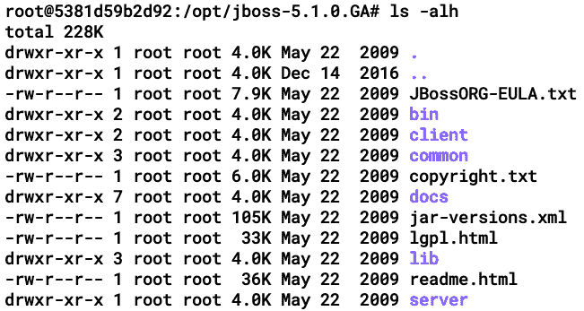

让我们试着了解一下这些目录是什么，它们包含了什么文件和文件夹：

+   `bin`：这个目录包含所有入口点的**Java Archives**（**JARs**）和脚本，包括启动和关闭。

+   `client`：这个目录存储可能被外部 Java 客户端应用程序使用的配置文件。

+   `common`：这个目录包含服务器的所有公共 JAR 和配置文件。

+   `docs`：这个目录包含 JBoss 文档和模式，在开发过程中很有帮助。

+   `lib`：这个目录包含 JBoss 启动所需的所有 JAR 文件。

+   `server`：这个目录包含与不同服务器配置文件相关的文件，包括生产和测试。

通过进一步进入`server`目录并列出内容，我们可以看到下面截图中显示的结构：

让我们打开其中一个配置文件，了解一下结构。下面的截图显示了`default`文件夹的列表：

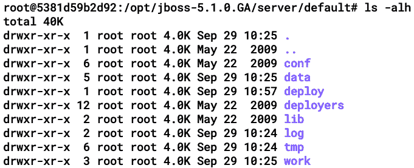

让我们来看一下前面截图中目录的详细情况：

+   `conf`：这个目录包含配置文件，包括`login-config`和`bootstrap config`。

+   `data`：这个目录可用于在文件系统中存储内容的服务。

+   `deploy`：这个目录包含在服务器上部署的 WAR 文件。

+   `lib`：`lib`目录是静态 Java 库的默认位置，在启动时加载到共享类路径中。

+   `log`：这个目录是所有日志写入的地方。

+   `tmp`：这个目录被 JBoss 用来存储临时文件。

+   `work`：这个目录包含编译后的 JSP 和类文件。

通过进一步进入`deploy`目录并列出内容，我们可以看到各种 WAR 文件、XML 文件等，如下面的截图所示：

我们需要了解的一些文件包括：

+   `admin-console.war`是 JBoss AS 的管理控制台。

+   `ROOT.war`是`/root` web 应用程序。

+   `jbossweb.sar`是部署在服务器上的 Tomcat servlet 引擎。

+   `jbossws.sar`是支持 Web 服务的 JBoss 服务。

大多数情况下，我们会发现服务器上缺少`admin-console`，因为 JBoss 管理员会将`admin-console`、`web-console`和`JMX-console`应用程序从服务器中移除。尽管这是保护 JBoss 实例的一种很好的方式，但这对威胁行为者并不起作用。JBoss AS 也可以使用 MBeans 进行管理。尽管它们是管理员的功能，但 MBeans 也可以作为允许行为者渗透网络的活门。要访问 MBeans，让我们首先了解文件和目录结构，因为这将帮助我们学习如何在过程中访问 MBeans。在 JBoss AS 中部署的大量 MBeans 可以直接通过`JMX-console`和`web-console`访问，这引发了许多关于部署安全性的担忧。

在深入研究 JBoss 利用之前，让我们先了解如何在 JBoss AS 部署上执行侦察和枚举。

# 侦察和枚举

在这一部分，我们将专注于对 JBoss 服务器的侦察和枚举。有各种方法可以识别 JBoss 服务器，比如默认情况下 JBoss 监听 HTTP 端口`8080`。让我们看一些用于 JBoss 侦察的常见技术。

# 通过主页检测

我们可以使用的一种非常基本的技术是访问 Web 服务器主页，该主页显示了 JBoss 的标志，如下截图所示：

当我们打开 JBoss 主页时，默认的 JBoss 设置会显示其他超链接，我们可以浏览以获取更多信息。

# 通过错误页面进行检测

有时候我们会发现 JBoss AS 运行在`8080`端口，但主页无法访问。在这种情况下，`404`错误页面也可以透露出 JBoss AS 的标头和版本号，用于正在使用的 JBoss 应用实例：

通过打开任意不存在的链接可以生成一个`404`错误页面，这将给我们一个错误，如前面的截图所示。

# 通过标题 HTML 标签进行检测

有些情况下，当我们尝试访问 JBoss AS 时，我们会得到一个空白页面。这通常是为了保护主页免受公开暴露和未经身份验证的访问。由于主页包含了相当有价值的信息，JBoss 管理员倾向于通过反向代理身份验证或删除应用程序中的 JMX 控制台、Web 控制台和管理控制台来保护页面（如本章前面提到的）。这些控制台将在本章的扫描和利用阶段进一步讨论：

如果我们得到一个空白页面，我们仍然可以通过 HTML `<title>`标签来识别 JBoss，该标签在页面标题中透露了一些信息，如前面的截图所示。

# 通过 X-Powered-By 进行检测

JBoss 还在 HTTP 响应标头中透露了其版本号和构建信息，如下截图所示。我们可以在`X-Powered-By`HTTP 响应标头中找到版本和构建信息。即使管理控制台或 Web 控制台不可访问，部署在 JBoss 中的应用程序也没有配置隐藏标头：

大多数威胁行为者通过在 Shodan、Censys 等上搜索相同的标头信息来检测 JBoss AS 的使用。在撰写本书时，有超过 19,000 个 JBoss AS 服务器，如果它们没有得到安全配置，就有可能被利用：

威胁行为者寻找这些信息并运行自动化扫描程序，以找到易受攻击的 JBoss 实例。一旦被攻击，JBoss 可以为行为者打开进入组织网络的大门。

# 通过哈希值检测 favicon.ico

这种技术通常不为渗透测试人员所熟知，因为它涉及对图标进行哈希处理。这实际上是另一种很酷的方法，可以告诉我们服务器是否正在运行 JBoss AS。我们可以对`favicon.ico`文件（一个图标文件）进行 MD5 哈希处理，如下截图所示：

在 OWASP favicon 数据库中搜索哈希值将告诉我们服务器是否正在运行 JBoss：

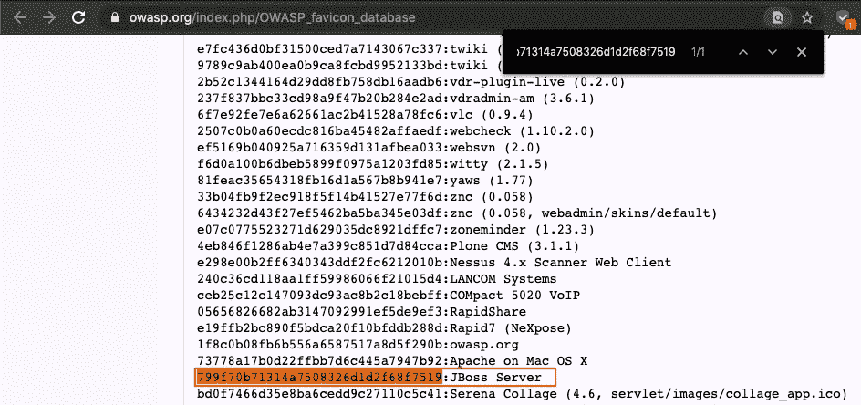

由于 OWASP favicon 数据库非常有限，我们可以随时创建自己的数据库来执行此活动。

# 通过样式表（CSS）进行检测

查看 HTML 源代码，我们可以看到 JBoss 样式表（`jboss.css`），如下截图所示，这清楚地表明了 JBoss AS 正在运行：

有时，管理员会更改 JBoss 文件的命名约定，但在这个过程中，他们忘记了添加必要的安全配置。现在我们已经手动收集了用于识别 JBoss AS 实例使用的信息，让我们尝试使用 Metasploit 来识别该实例。

# 使用 Metasploit 进行 JBoss 状态扫描

Metasploit 还具有用于 JBoss 枚举的内置辅助模块，其中之一是 `auxiliary/scanner/http/jboss_status`。该模块寻找显示应用程序服务器运行状态历史的状态页面。我们可以在 `msfconsole` 中使用以下命令加载该模块：

[PRE0]

以下截图显示了上述命令的输出：

上述截图显示了运行辅助程序所需的选项。设置好选项后，然后像下面的截图中所示运行辅助程序，服务器将确认应用程序服务器是基于 JBoss 的，根据发现的状态页面：

该模块寻找页面上具有以下正则表达式的文本：

该模块执行以下操作：

1.  它向服务器发送 `GET` 请求以查找 `/status` 页面（默认页面设置为 `Target_uri` 选项）。

1.  如果从服务器收到 `200 OK` 响应，它将在 HTML `<title>` 标签中查找 `Tomcat Status` 字符串。

1.  如果找到该标签，该模块将根据正则表达式查找数据，如上述截图所示。

当模块执行时，JBoss 会存储源 IP、目标 IP 和被调用页面。然后这些信息将被打印出来。我们可以在 `/status` 页面中查看它，就像下面的截图中所示：

`jboss_status` 模块寻找特定信息以对 JBoss AS 实例进行指纹识别。

# JBoss 服务枚举

运行在 **JBoss Web Service** (**JBoss WS**) 上的服务列表也可以为我们提供有关 JBoss 服务器的信息：

打开 JBoss WS URI（即浏览到 `/jbossws/services`）将确认 JBoss AS 是否正在运行，正如我们在上述截图中所看到的。现在我们对如何枚举运行的 JBoss 服务并收集更多信息有了更好的理解，让我们继续下一节，它将向我们展示如何对 JBoss AS 实例执行漏洞扫描。

# 对 JBoss AS 执行漏洞评估

如果我们在一台机器上发现了 JBoss AS 实例，并且需要执行漏洞评估，我们总是可以使用 Metasploit。Metasploit 有一个名为 `auxiliary/scanner/http/jboss_vulnscan` 的模块，我们可以使用它对 JBoss AS 执行漏洞扫描。该模块检查一些漏洞，例如身份验证绕过、默认密码和可访问的 `JMX-console` 功能。以下是我们可以观察到的在 JBoss AS 上执行漏洞评估的步骤：

1.  要使用 `jboss_vulnscan`，我们在 `msfconsole` 中输入以下命令：

[PRE1]

以下截图显示了上述命令的输出：

1.  设置所需的选项，如下所示：

1.  运行扫描程序后，它将检查各种漏洞，并报告在服务器上发现了哪些漏洞，如下所示：

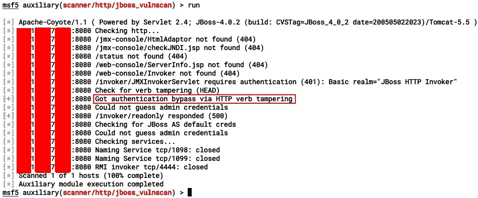

该模块查找应用程序中的特定文件和在不同端口上运行的 Java 命名服务。

# 使用 JexBoss 进行漏洞扫描

还有另一个非常强大的工具，名为 JexBoss，专门用于 JBoss 和其他技术枚举和利用情况。它是由 João F. M. Figueiredo 开发的。在本节中，我们将简要介绍如何使用 JexBoss。该工具可以在 [`github.com/joaomatosf/jexboss`](https://github.com/joaomatosf/jexboss) 下载和安装。

设置好这一切后，我们可以使用以下命令运行该工具：

[PRE2]

让我们使用这个工具（如下截图所示）来查找 JBoss AS 实例中的漏洞：

在前面的屏幕截图中使用的命令将寻找易受攻击的 Apache Tomcat Struts、servlet 反序列化和 Jenkins。该工具还将检查各种 JBoss 漏洞，我们将找出服务器是否易受其中任何漏洞的影响。

# 易受攻击的 JBoss 入口点

众所周知，JBoss 配备了许多功能齐全和运行良好的附加组件和扩展，如 JNDI、JMX 和 JMS，因此 JBoss 利用的可能入口点数量相应增加。以下表格列出了易受攻击的 MBean 及其相应的服务和方法名称，可用于 JBoss 侦察和利用：

| **类别** | **MBean 域名** | **MBean 服务名称** | **MBean 方法名称** | **MBean 方法描述** |
| --- | --- | --- | --- | --- |
| 利用 | `jboss.system` | `MainDeployer` | `deploy()`、`undeploy()`和`redeploy()` | `deploy()`方法用于部署应用程序。`undeploy()`方法用于取消部署已部署的应用程序。`redeploy()`方法用于服务器重新部署存储在服务器本身（本地文件）的已部署应用程序。 |
| 侦察 | `jboss.system` | `Server` | `exit()`、`shutdown()`和`halt()` | `exit()`、`shutdown()`和`halt()`方法是非常危险的方法。威胁行为者可以使用这些方法关闭应用程序服务器以中断服务。 |
| 侦察 | `jboss.system` | `ServerInfo` | N/A | N/A |
| 侦察 | `jboss.system` | `ServerConfig` | N/A | N/A |
| 利用 | `jboss.deployment` | `DeploymentScanner` | `addURL()`和`listDeployedURLs()` | `addURL()`方法用于通过 URL 添加远程/本地应用程序进行部署。`listDeploymentURLs()`方法用于列出所有先前部署的应用程序及其 URL。此方法有助于查找当前的 JBoss AS 实例是否已被利用。 |
| 利用 | `jboss.deployer` | `BSHDeployer` | `createScriptDeployment()`、`deploy()`、`undeploy()`和`redeploy()` | `createScriptDeployment()`方法用于通过**Bean Shell**（**BSH**）脚本部署应用程序。脚本内容应在此方法中提及以进行部署。然后 MBean 创建一个带有`.bsh`扩展名的临时文件，该文件将用于部署。`deploy()`、`undeploy()`和`redeploy()`方法用于使用 BSH 脚本管理部署。 |
| 利用 | `jboss.admin` | `DeploymentFileRepository` | `store()` | `store()`方法被部署者用于存储文件名及其扩展名、文件夹名和时间戳。威胁行为者只需提到具有上述信息的 WAR 文件，有效载荷将直接部署在服务器上。 |

`MainDeployer` MBean 是部署的入口点，所有组件部署的请求都发送到`MainDeployer`。`MainDeployer`可以部署 WAR 存档、**JARs**、**企业应用程序存档**（**EARs**）、**资源存档**（**RARs**）、**Hibernate 存档**（**HARs**）、**服务存档**（**SARs**）、**BSHes**和许多其他部署包。

# JBoss 利用

现在我们清楚了 JBoss 的侦察和漏洞扫描能力，让我们了解一下 JBoss 的利用。我们可以用以下几种基本方法来利用 JBoss：

+   JBoss 利用通过**管理控制台**（`admin-console`）

+   通过`MainDeployer`服务利用 JBoss 的 JMX 控制台

+   JBoss 利用通过 JMX 控制台使用`MainDeployer`服务（Metasploit 版本）

+   JBoss 利用通过 JMX 控制台使用`BSHDeployer`服务

+   通过`BSHDeployer`服务（Metasploit 版本）利用 JBoss 的 JMX 控制台

+   通过 Java 小程序利用 JBoss 的 Web 控制台

+   通过`Invoker`方法利用 JBoss 的 Web 控制台

+   通过第三方工具使用 Web 控制台进行 JBoss 利用

让我们逐个了解这些利用方法。

# JBoss 通过管理控制台进行利用

在这一部分，我们将开始利用过程。第一步是访问管理控制台，默认情况下配置的用户名和密码分别为`admin`和`admin`。下图显示了管理登录页面：

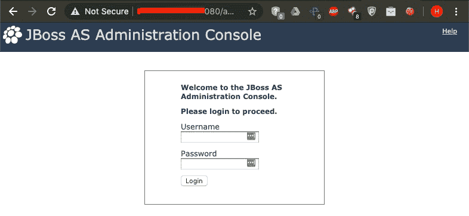

一旦我们成功登录，我们将看到下图所示的页面：

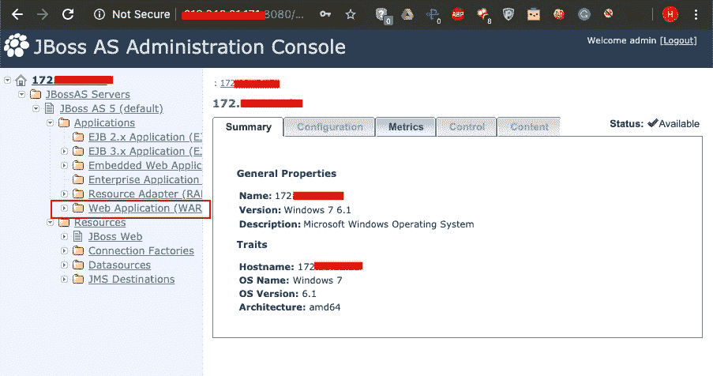

利用的下一步是找到一种在服务器上执行命令的方法，以便我们获得服务器级别的访问权限。从左侧菜单中选择 Web 应用程序（WAR）选项，您将被重定向到下图所示的页面。我们将点击“添加新资源”按钮：

这将带我们到一个新页面，在那里我们将看到上传 WAR 文件的选项。可以使用以下命令使用`msfvenom`生成 WAR 文件： 

[PRE3]

一旦我们生成了基于 WAR 的 Metasploit 有效载荷，我们将把文件上传到控制台的 Web 应用程序（WAR）部分，如下图所示：

一旦文件成功上传，我们只需要转到它被提取到的目录，并在我们的 Web 浏览器上打开它以获取 Meterpreter 连接，如下图所示：

在运行有效载荷之前，有一些需要考虑的事情，最重要的是检查出口连接。如果有效载荷被执行，但防火墙阻止对我们服务器的出口流量（出站连接），我们需要找到一种方法来获取反向 shell。如果没有办法做到这一点，我们总是可以选择绑定连接到服务器。

# 通过 JMX 控制台进行利用（MainDeployer 方法）

请考虑来自官方 JBoss 文档的以下引用（可在[`docs.jboss.org/jbossas/docs/Getting_Started_Guide/4/html-single/index.html`](https://docs.jboss.org/jbossas/docs/Getting_Started_Guide/4/html-single/index.html)找到）：

“JMX 控制台是 JBoss 管理控制台，它提供了服务器组成的 JMX MBeans 的原始视图。它们可以提供有关运行服务器的大量信息，并允许您修改其配置，启动和停止组件等。”

如果我们发现 JBoss 有未经身份验证访问 JMX 控制台的实例，我们可以使用`MainDeployer`选项将 shell 上传到服务器。这允许我们从远程 URL 获取 WAR 文件并在服务器上部署它。JMX 控制台如下图所示：

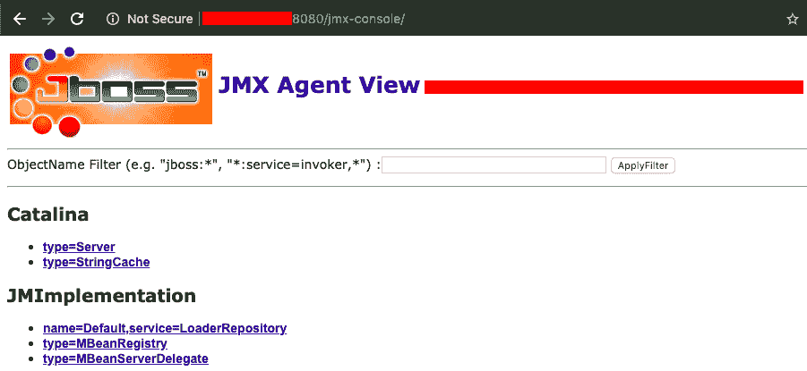

让我们实施以下利用步骤：

1.  在控制台页面上，搜索`MainDeployer`服务选项，如下所示：

1.  单击该选项将重定向我们到一个新页面，如下所示：

1.  向下滚动页面，我们将看到多个`deploy`方法。选择`URL Deploy`方法，这将允许我们从远程 URL 获取 WAR 文件：

1.  使用以下命令生成基于 WAR 的 Metasploit 有效载荷：

[PRE4]

1.  现在我们需要将 WAR 文件托管在 HTTP 服务器上，并将 URL 粘贴到输入字段中，如下所示：

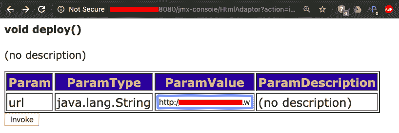

1.  让我们设置我们的利用处理程序如下所示：

1.  一旦成功调用，我们将从服务器收到以下消息：

我们的`s.war`有效载荷已部署。

1.  接下来，我们需要找到正确的 stager 名称，以便我们可以调用文件。让我们解压 Metasploit 生成的文件，如下所示：

我们在`web.xml`文件中找到 servlet 名称：

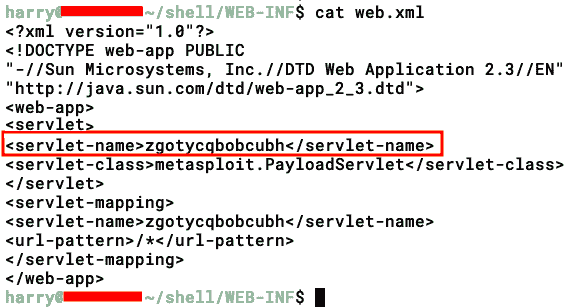

1.  让我们通过将 servlet 名称添加到 URL 来调用有效载荷，如下所示的屏幕截图：

1.  输出将为空，但我们可以在我们的 Metasploit exploit 处理程序上检查 stager 请求，如下所示：

最好自定义 WAR 文件并使用常见的技术对内容进行混淆。此外，为了帮助进一步避免检测，我们需要将文件名从随机名称更改为更具体和常见的名称，例如`login.jsp`，`about.jsp`或`logout.jsp`。

# 通过使用 Metasploit 通过 JMX 控制台进行利用（MainDeployer）

Metasploit 还具有内置的利用模块，可用于使用`MainDeployer`方法利用 JMX 控制台。现在让我们使用 Metasploit 模块通过 JMX 控制台上传 shell。我们使用以下命令加载利用程序：

[PRE5]

我们将看到以下可用选项：

我们可以设置所需的选项，如`rhosts`和`rport`，如下所示：

当一切都设置好后，我们可以运行利用程序，Metasploit 将执行我们在上一节手动执行的相同步骤，以便在服务器上为我们提供 Meterpreter 访问，如下所示：

有时，如果 JMX 控制台受到身份验证保护，模块可能无法工作。我们可以尝试对身份验证进行字典攻击，如果成功，我们可以使用用户名和密码（在字典攻击期间找到）在此模块上设置`HttpUsername`和`HttpPassword`选项。

# 通过 JMX 控制台（BSHDeployer）进行利用

通过使用**BeanShell Deployer**（`BSHDeployer`）在 JMX 控制台上实现代码执行的另一种方法。`BSHDeployer`允许我们在 JBoss 中以 Bean shell 脚本的形式部署一次执行脚本和服务。在获得对 JMX 控制台的访问后，我们可以查找`service=BSHDeployer`对象名称，如下所示：

单击此对象将重定向我们到部署页面，如下所示：

在这里，我们需要放置将用于在服务器上部署我们的有效载荷的 BSH 文件的 URL。一个简单的方法是使用第三方工具进行通过`BSHDeployer`的利用，例如 JexBoss。这也可以使用 Metasploit 来实现，我们将在下面看到。

# 通过使用 Metasploit 通过 JMX 控制台进行利用（BSHDeployer）

Metasploit 也可以用于部署 BSH 以在服务器上实现代码执行。Metasploit 具有用于此目的的`jboss_bshdeployer`利用模块，让我们看一下它的用法。我们可以使用以下命令在`msfconsole`中加载利用程序：

[PRE6]

要查看选项列表，我们需要输入`show options`，如下所示：

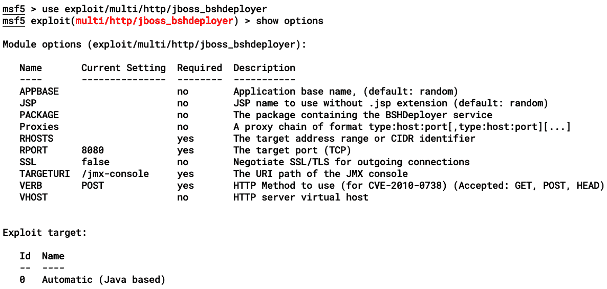

然后我们需要在运行利用程序之前设置相应的选项，如下所示：

我们需要设置在此模块中使用的有效载荷（默认情况下为`java/meterpreter/reverse_tcp`）。一个通用的选项是使用基于 Java 的 Meterpreter，但在 Java 有效载荷不起作用的情况下，我们可以尝试使用基于操作系统风格和架构的有效载荷。

运行利用程序后，Metasploit 将创建一个 BSH 脚本并调用部署程序，然后部署和提取 shellcode。调用 JSP shellcode 将执行我们的有效载荷，我们将获得一个反向连接，如下所示：

现在我们知道如何通过`BSHDeployer`利用 JMX 控制台，让我们看看如何通过 web 控制台进行利用。

# 通过 web 控制台（Java 小程序）进行利用

在本节中，我们将讨论 JBoss web 控制台。请注意，JBoss web 控制台已被弃用，并已被管理控制台取代，但对我们仍然有用，因为在旧版本的 JBoss 服务器上，仍然可以利用 web 控制台。在浏览器中打开 web 控制台时，我们可能也会遇到一些错误，如下所示：

为了允许小程序运行，我们需要更改我们的 Java 安全设置，并将 JBoss 实例的域名和 IP 地址添加到 Java 例外站点列表中，如下所示：

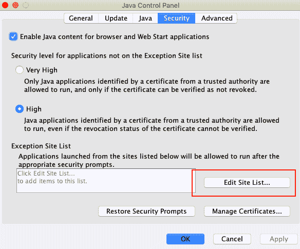

一旦异常被添加，我们仍然会收到浏览器的警告，但我们可以继续单击“继续”，如下所示：

在下一个弹出窗口中，我们需要单击“运行”按钮以允许应用程序运行，如下所示：

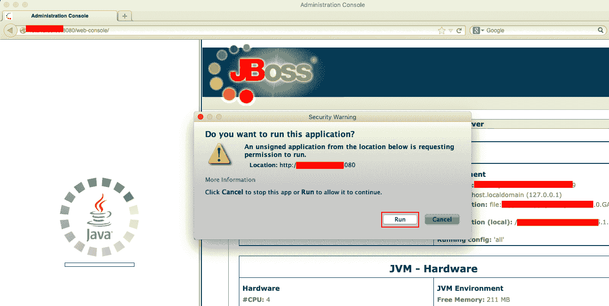

然后我们会看到 JBoss 服务器的 web 控制台。在这里，我们可以继续上一节中介绍的相同步骤，使用`MainDeployer`上传 shell。如下截图所示，我们只需要在左侧窗格中找到并选择对象即可：

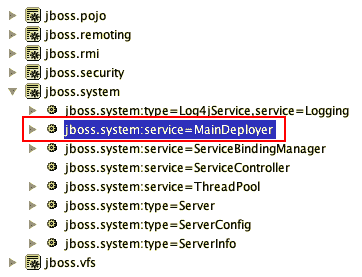

单击`MainDeployer`项目将带我们到可以在服务器上部署 WAR 文件以实现代码执行的页面，如下所示：

默认情况下，大多数浏览器禁用了运行 Java 小程序，因此有时，在发现 JBoss 服务器的 web 控制台页面时，我们可能只会得到一个空白页面。在打开 web 控制台时遇到空白页面并不意味着服务不可访问。这只意味着我们需要稍微调整我们的浏览器以允许 Java 小程序的执行。

# 通过 web 控制台进行利用（Invoker 方法）

利用 JBoss AS 实例的另一种方法是通过 web 控制台的`Invoker`方法。在请求`/web-console/Invoker` URI 路径时执行`curl`命令将从服务器获取响应，文件的前 4 个字节中包含`0xAC`和`0xED`十六进制代码字符（`aced`）。我们可以在任何 Java 序列化对象的开头看到这一点，如下所示：

`Invoker` servlet 可以在 web 控制台或`Invoker`的`http://example.com/web-console/Invoker`中找到。这可以在大多数情况下无需身份验证访问。我们可以向这个`Invoker`发送序列化的 post 请求来在服务器上执行命令。

以下是前面截图中字节的分解：

+   ac ed: `STREAM_MAGIC`指定这是一个序列化协议。

+   00 o5: `STREAM_VERSION`指定正在使用的序列化版本。

+   0x73: `TC_OBJECT`指定这是一个新对象。

+   0x72: `TC_CLASSDESC`指定这是一个新类。

+   00 24: 这指定了类名的长度。

+   {6F 72 67 2E 6A 62 6F 73 ****73 2E 69 6E 76 6F 63 61** **74 69 ****6F 6E 2E 4D 61 72 ****73 68 61 6C 6C 65 64 56** **61 6C 75 65} **org.jboss. invocation.MarshalledValue**: 这指定了类名。

+   EA CC E0 D1 F4 4A D0 99: `SerialVersionUID`指定了这个类的序列版本标识符。

+   0x0C: 这指定了标记号。

+   00 00: 这指定了这个类中字段的数量。

+   0x78: `TC_ENDBLOCKDATA`标记块对象的结束。

+   0x70: `TC_NULL`表示没有更多的超类，因为我们已经到达了类层次结构的顶部。

+   使用第三方工具通过 web 控制台进行利用。

在跳入 Metasploit 的模块之前，让我们看看 RedTeam Pentesting 开发的另一组脚本。存档可以从他们的网站[`www.redteam-pentesting.de/files/redteam-jboss.tar.gz`](https://www.redteam-pentesting.de/files/redteam-jboss.tar.gz)下载。

存档包含以下文件：

+   `BeanShellDeployer/mkbeanshell.rb`

+   `WAR/shell.jsp`

+   `WAR/WEB-INF/web.xml`

+   `Webconsole-Invoker/webconsole_invoker.rb`

+   `JMXInvokerServlet/http_invoker.rb`

+   `JMXInvokerServlet/jmxinvokerservlet.rb`

+   `jboss_jars/console-mgr-classes.jar`

+   `jboss_jars/jbossall-client.jar`

+   `README`

+   `setpath.sh`

+   `Rakefile`

下面的截图显示了团队发布的不同脚本：

我们可以使用这个工具创建自定义的 BSH 脚本，通过 web 控制台`Invoker`部署 BSH 脚本，创建`JMXInvokerServlet`负载等。让我们看看如何使用这个工具创建 BSH 脚本。

# 创建 BSH 脚本

存档中的一个脚本是`mkbeanshell`。该脚本以 WAR 文件作为输入，然后将 BSH 脚本作为输出创建：

1.  通过使用`-h`标志执行脚本，我们可以看到所有可用的选项列表，如下所示：

1.  现在，我们可以使用以下命令创建 BSH：

[PRE7]

该命令的输出（即 BSH 脚本）将保存在前面命令中提到的输出文件中。在这种情况下，创建的文件是`redteam.bsh`，如下截图所示：

1.  源文件（即在本例中使用的 WAR 文件）是通用的负载文件。在这个 WAR 文件中是我们的 JSP web shell，其内容可以在下面的截图中看到：

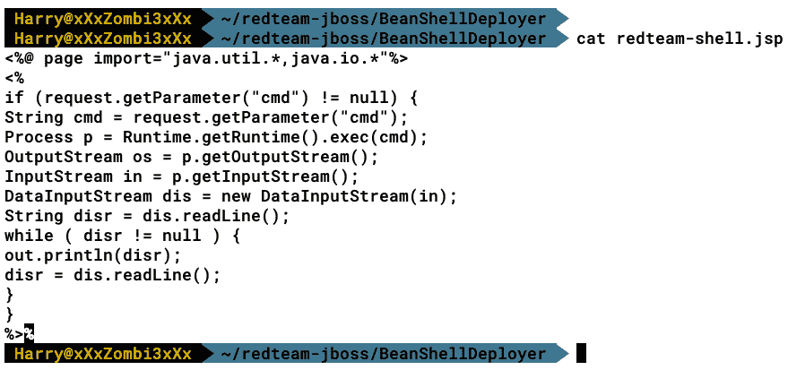

1.  默认情况下，如果我们打开创建的 BSH 脚本，我们会看到它在服务器上使用`/tmp/`目录来提取和部署 WAR 存档。现在，Windows 服务器没有`/tmp/`目录，而`mkbeanshell` Ruby 脚本只有更改路径的选项，在大多数情况下，我们可能根本不知道服务器上的路径。下面的截图显示了 BSH 脚本的代码：

1.  我们可以用以下代码替换上一个截图中的最后几行代码，以获取通用文件位置：

[PRE8]

1.  在这里，我们可以看到`System.getProperty("jboss.server.home.dir");`获取了 JBoss 目录。这是一个平台无关的代码，可以在 Windows 和*nix 服务器上使用。我们只需要在`home`目录中创建一个名为`deploy`的新目录，使用`new File(jboss_home + "/deploy/").mkdir();`，然后，解码`Base64`并将其写入`deploy`目录作为`test.war`。在进行这些更改后，下面的截图显示了 BSH 脚本的最终代码：

BSH 脚本准备就绪后，我们可以使用与第三方工具`redteam-jboss.tar.gz`一起提供的`webconsole_invoker.rb`脚本将我们的 BSH 脚本远程部署到 JBoss AS 实例上。

# 使用`webconsole_invoker.rb`部署 BSH 脚本

我们可以使用`webconsole_invoker.rb`脚本部署 BSH 脚本：

1.  使用`-h`标志执行 Ruby 脚本将显示选项列表，如下截图所示：

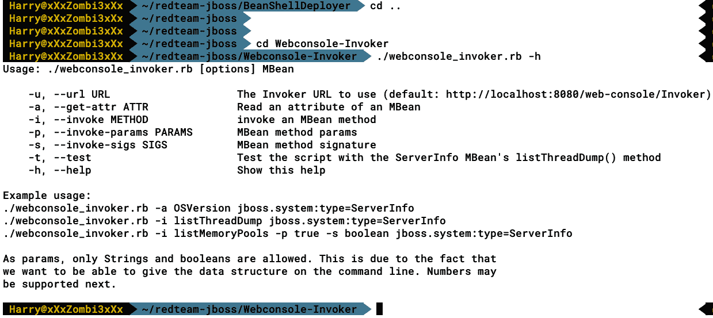

1.  现在我们运行脚本并传递目标`Invoker` URL 以及`Invoke`方法。在我们的情况下，我们将使用`createScriptDeployment()`方法。该方法接受两种输入类型，都是`String`，所以我们在`-s`标志中传递它们，然后我们传递我们的 BSH 文件的路径（带有文件名和使用`-p`标志传递的部署者的名称），如下所示：

1.  执行脚本后，我们的`test.war`文件将被部署，在我们的`home`目录内的`/test/`目录中创建我们的 shell：

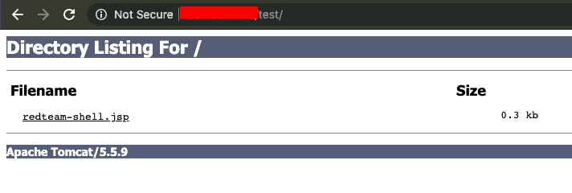

浏览到 URL 可以让我们访问已上传的基于 JSP 的 Web shell，如前面的截图所示。

# 通过 JMXInvokerServlet（JexBoss）进行利用

JBoss 利用的另一个很好的工具是 JexBoss。JexBoss 是一个用于测试和利用 JBoss AS 和其他 Java 平台、框架和应用程序中的漏洞的工具。它是开源的，可以在 GitHub 上找到[`github.com/joaomatosf/jexboss`](https://github.com/joaomatosf/jexboss)：

1.  下载并运行工具后，我们可以通过几个按键来进行利用。我们只需要使用以下命令传递正在运行的 JBoss 服务器的 URL：

[PRE9]

如果 Python 没有正确配置，我们可以使用`python jexboss.py --jboss -P`语法执行前面的命令。两个选项都可以工作。

1.  如下截图所示，该工具已识别出多个可利用的脆弱端点，可以利用它们来访问服务器。我们将使用`JMXInvokerServlet`，它类似于`Invoker`，并接收序列化的 post 数据：

1.  当工具要求确认利用时，请选择`yes`：

1.  一旦利用完成，我们将获得一个 shell，通过它我们可以在服务器上执行命令，如下所示：

使用`jexremote`命令也可以进行进一步的利用。现在我们对使用 JexBoss 利用 JBoss 有了更好的理解，让我们继续下一部分——使用 Metasploit 通过`JMXInvokerServlet`进行利用

# 使用 Metasploit 通过 JMXInvokerServlet 进行利用

Metasploit 还有一个`JMXInvokerServlet`模块，可以使用以下命令加载：

[PRE10]

在使用此`exploit`模块之前，我们需要确保服务器上存在`/invoker/JMXInvokerServlet` URI 路径。如果路径不存在，利用将失败。以下截图显示了前面命令的输出：

要查看`/invoker/JMXInvokerServlet` URI 路径是否存在，我们可以使用以下命令进行确认：

如果服务器以字节形式的序列化数据作为响应，以`ac ed`开头，我们可以运行利用，这将使我们通过 Meterpreter 访问服务器，如下截图所示：

**注意：**在我们无法获得成功的反向 shell 的情况下，我们总是可以选择绑定 shell 连接。

# 总结

在本章中，我们学习了 JBoss 的基础知识，然后继续学习文件和目录结构。接下来，我们研究了 JBoss 的枚举，然后进行了使用 Metasploit 框架进行漏洞评估，之后我们进行了通过管理控制台进行利用的过程。最后，我们通过 Web 控制台执行了利用。

在下一章中，我们将学习有关对 Apache Tomcat 进行渗透测试。

# 问题

JBoss 可以免费下载吗？

# 进一步阅读

JBoss 目录结构：

+   [`www.protechtraining.com/content/jboss_admin_tutorial-directory_structure`](https://www.protechtraining.com/content/jboss_admin_tutorial-directory_structure)

+   [`access.redhat.com/documentation/en-us/jboss_enterprise_application_platform/5/html/administration_and_configuration_guide/server_directory_structure`](https://access.redhat.com/documentation/en-us/jboss_enterprise_application_platform/5/html/administration_and_configuration_guide/server_directory_structure)

Java 序列化格式：

+   [`www.programering.com/a/MTN0UjNwATE.html`](https://www.programering.com/a/MTN0UjNwATE.html)

+   [`www.javaworld.com/article/2072752/the-java-serialization-algorithm-revealed.html`](https://www.javaworld.com/article/2072752/the-java-serialization-algorithm-revealed.html)
