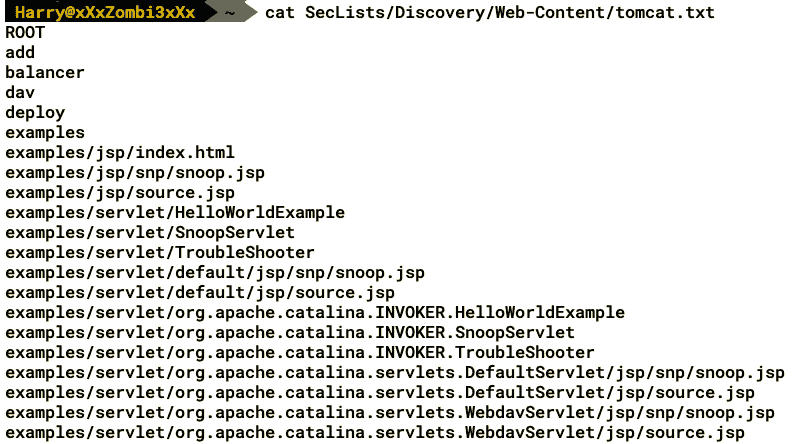
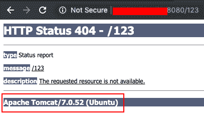
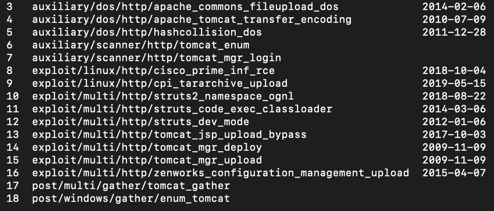
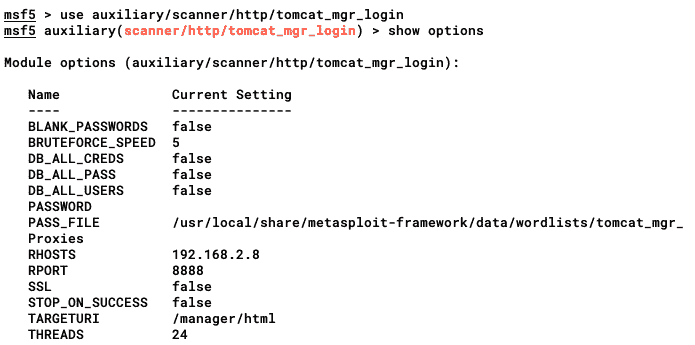
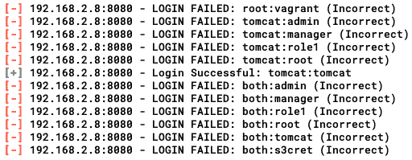
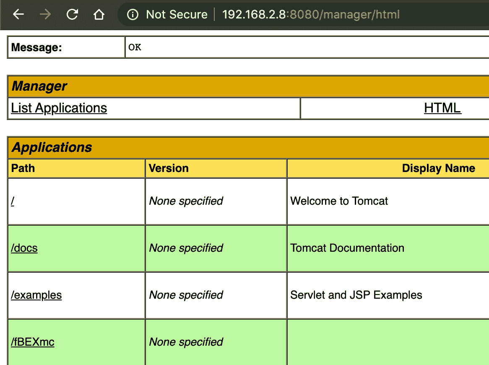
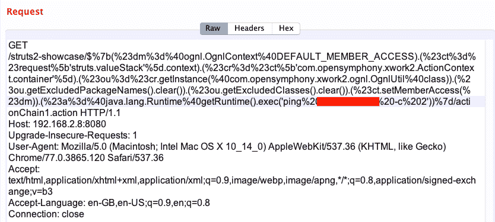
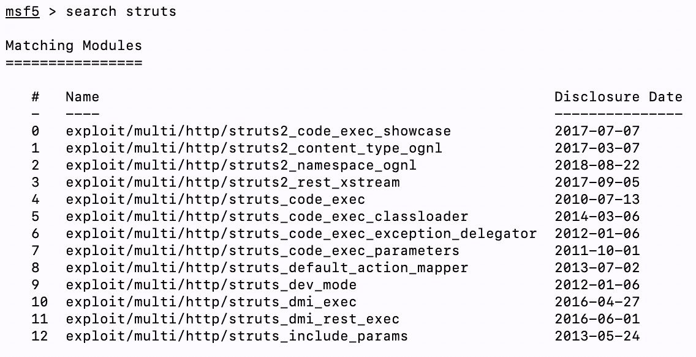
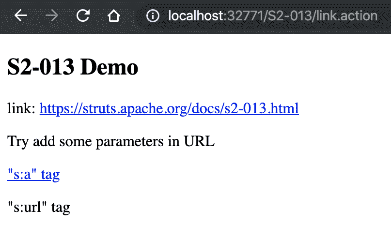

# 第十六章：技术平台的渗透测试- Apache Tomcat

在上一章中，我们学习了如何对**JBoss 应用服务器**（**JBoss AS**）进行渗透测试。现在让我们看看另一个技术平台，称为**Apache Tomcat**。Apache Tomcat 软件是在一个开放和参与的环境中开发的，并在 Apache 许可证第 2 版下发布。Apache Tomcat 是一个 Java Servlet 容器，实现了多个核心企业特性，包括 Java Servlets、**Java Server Pages**（**JSP**）、Java WebSocket 和**Java Persistence APIs**（**JPA**）。许多组织都有部署在 Apache Tomcat 上的基于 Java 的应用程序。易受攻击的 Apache Tomcat 软件对威胁行为者来说是一个金矿，因为许多支付网关、核心银行应用程序和**客户关系管理**（**CRM**）平台等都在 Apache Tomcat 上运行。

在本章中，我们将涵盖以下主题：

+   Tomcat 简介

+   Apache Tomcat 架构

+   文件及其目录结构

+   检测 Tomcat 安装

+   版本检测

+   对 Tomcat 进行利用

+   Apache Struts 简介

+   OGNL 简介

+   OGNL 表达式注入

# 技术要求

本章的先决条件如下：

+   Apache Tomcat ([`tomcat.apache.org/`](http://tomcat.apache.org/))

+   后端数据库；推荐使用 MySQL ([`www.mysql.com/downloads/`](https://www.mysql.com/downloads/))

+   Metasploit 框架 ([`github.com/rapid7/metasploit-framework`](https://github.com/rapid7/metasploit-framework))

# Tomcat 简介

Apache Tomcat 软件是一个开源的 Web 服务器，旨在运行基于 Java 的 Web 应用程序。当前版本的 Tomcat 的一些特性包括以下内容：

+   支持 Java Servlet 3.1

+   JSP 2.3

+   Java 统一**表达语言**（**EL**）3.0

+   Java WebSocket 1.0

Tomcat 是由许多开发人员在 Apache 项目平台的支持下开发和处理的，根据 Apache 认证 2.0 证书发布，并且是一个开源应用程序。Tomcat 可以作为一个独立产品使用，具有自己的内部 Web 服务器，也可以与其他 Web 服务器一起使用，包括 Apache 和 Microsoft 的**Internet Information Server**（**IIS**）。

鉴于 Apache Tomcat 被许多组织使用，应该明智地考虑这个平台的安全性。在撰写本书时，Shodan 已经确定了全球超过 93,000 个 Tomcat 实例（独立和集成在 JBoss 实例中），如下截图所示：

Apache Tomcat 服务器内的漏洞可以允许威胁行为者利用服务器上运行的应用程序，甚至可以超越通用应用程序的利用，最终获取对组织内部网络的访问权限。

# Apache Tomcat 架构

Tomcat 可以被描述为一系列不同的功能组件，这些组件根据明确定义的规则组合在一起。以下图表代表了 Tomcat 的结构：

让我们试着理解前面图表中显示的每个组件的作用：

+   **服务器**：服务器代表整个 Catalina Servlet 容器。`server.xml`文件代表 Tomcat 安装的所有特性和配置。

+   **服务**：服务是服务器内部包含连接器的组件，这些连接器共享单个容器来处理它们的传入请求。

+   **引擎**：引擎接收并处理来自不同连接器的信息，并返回输出。

+   **主机**：这是服务器使用的网络或域名。一个服务器可以有多个主机。

+   **上下文**：表示 Web 应用程序。在主机上可以有多个具有不同 URL 路径的 Web 应用程序。

+   **连接器**：连接器处理客户端和服务器之间的通信。有不同类型的连接器用于处理各种通信；例如，HTTP 连接器用于处理 HTTP 流量，而 AJP 连接器用于使用 AJP 协议与 Apache 通信。

现在我们对 Apache Tomcat 架构有了基本的了解，让我们来看看 Tomcat 服务器上存储的文件和目录的结构。

# 文件及其目录结构

Tomcat 的文件和目录结构与我们在上一章中讨论的 JBoss 类似。在本节中，我们将快速浏览 Tomcat 的目录结构，如下面的屏幕截图所示：

Tomcat 目录中的子目录可以解释如下：

+   `bin`：此目录包含服务器初始化时所需的所有脚本，如启动和关闭脚本以及可执行文件。

+   `common`：这个目录包含 Catalina 和开发人员托管的其他 Web 应用程序可以使用的公共类。

+   `conf`：这个目录包含用于配置 Tomcat 的服务器 XML 文件和相关的**文档类型定义**（**DTD**）。

+   `logs`：这个目录，顾名思义，存储了 Catalina 和应用程序生成的日志。

+   `server`：这个目录存储仅由 Catalina 使用的类。

+   `shared`：这个目录存储可以被所有 Web 应用程序共享的类。

+   `webapps`：这个目录包含所有的 Web 应用程序。

+   `work`：这个目录代表文件和目录的临时存储。

最有趣的目录之一是`webapps`目录：

通过导航到`webapps`目录并列出内容，我们可以查看目录，如前面的屏幕截图所示：

+   `ROOT`：这是 Web 应用程序的根目录。它包含所有的 JSP 文件和 HTML 页面，客户端 JAR 文件等。

+   `docs`：此目录包含 Apache Tomcat 的文档。

+   `examples`：`examples`文件夹包含 Servlet、JSP 和 WebSocket 示例，以帮助开发人员进行开发。

+   `host-manager`：`host-manager`应用程序允许我们在 Tomcat 中创建、删除和管理虚拟主机。这个目录包含了这个应用程序的代码。

+   `manager`：`manager`允许我们管理安装在 Apache Tomcat 实例上的 Web 应用程序，以**Web 应用程序存档**（**WAR**）文件的形式。

对文件和目录结构的清晰理解可以帮助我们在目标 Tomcat 服务器上进行非常有效的侦察。

# 检测 Tomcat 安装

现在，让我们看看如何检测服务器上是否安装了 Tomcat，以及可以用于进一步侦察的常见检测技术。

# 通过 HTTP 响应头检测 - X-Powered-By

检测 Apache Tomcat 安装的一种常见方法是查看服务器响应中的`X-Powered-By` HTTP 头：

典型的安装将在 HTTP 响应头中给出 Apache Tomcat 版本。

# 通过 HTTP 响应头检测 - WWW-Authenticate

检测 Tomcat 的一种简单方法是请求`/manager/html`页面。一旦您发出请求，服务器将以 HTTP 代码`401 未经授权`回复，并附带`WWW-Authenticate` HTTP 头：

如前面的屏幕截图所示，这个特定的头部将设置为`Tomcat Manager Application`字符串，通过使用这个头部，我们将能够检测目标服务器是否安装了 Tomcat。

# 通过 HTML 标签检测 - 标题标签

如果您在打开 Tomcat 实例时看到一个空白页面，您仍然可以通过查看 HTML `<title>`标签来检测它是否是 Tomcat 页面：

`Apache Tomcat`字符串在`<title>`标签之间提到，就像前面的截图中一样。

# 通过 HTTP 401 未经授权错误检测

Tomcat 安装通常使用 Tomcat Manager Web 应用程序来管理和部署 Web 应用程序。它可以通过`URL/manager/html`访问。这会产生一个 HTTP 身份验证面板：

单击弹出窗口上的“取消”将给您一个 401 错误，就像前面的截图中一样，这证实了 Tomcat 的存在。

**注意：**这种信息披露只存在于 Tomcat 服务器配置错误的情况下。

# 通过唯一指纹（哈希）检测

我们在之前的章节中看到，大多数 Web 应用程序可以通过它们的 favicon 来检测。可以比较不同版本的 favicon 的`md5`哈希来识别正在使用的 Tomcat 的版本：

以下截图显示了 OWASP favicon 数据库列表中的哈希：

我们还可以维护我们的 favicon 数据库，以检查不同版本的 Apache Tomcat 安装。

# 通过目录和文件检测

安装时，Apache Tomcat 还创建了`docs`和`examples`目录，以帮助开发人员进行应用程序开发和部署。默认情况下，文件夹的 URI 如下：

+   `/docs/`

+   `/examples/`

我们还可以使用 SecLists ([`github.com/danielmiessler/SecLists`](https://github.com/danielmiessler/SecLists))来枚举 Tomcat 中的敏感文件：

前面的截图显示了可以用来识别安装了 Tomcat 的实例的不同文件和文件夹。在下一节中，我们将解决如何识别 Tomcat 安装的版本号。

# 版本检测

一旦我们确认服务器正在运行 Tomcat，下一步是建立版本信息。在本节中，我们将看一些检测现有 Tomcat 安装的版本号的方法。

# 通过 HTTP 404 错误页面检测版本

默认情况下，Tomcat 的 404 错误页面会披露它正在运行的版本号，所以我们只需要访问服务器上不存在的 URL，服务器应该会返回一个错误页面，如下面的截图所示：

许多管理员实际上并没有隐藏披露版本号的 Web 服务器横幅。攻击者可以利用这些信息从其库中找到公开或零日利用来访问服务器。

# 通过 Release-Notes.txt 披露版本信息

Tomcat 还有一个`Release-Notes.txt`文件，其中包含有关该版本的增强功能和已知问题的详细信息。该文件还向威胁行为者披露了 Apache Tomcat 服务器的版本号：

发布说明的第一行包含版本信息，就像前面的截图中一样。

# 通过 Changelog.html 披露版本信息

除了`Release-Notes.txt`之外，还有一个`Changelog.html`文件，该文件在页面上披露了版本号，如下所示：

现在我们可以继续下一步，即利用 Tomcat 安装。

# 利用 Tomcat

在本节中，我们将看一下如何执行对 Tomcat 的易受攻击版本的利用。我们将涵盖各种技术，包括上传`WAR shell`和 JSP 上传绕过。

在 Metasploit 上使用`search`命令查找 Tomcat 将为我们提供一些可用的模块，如下所示：

我们将使用最基本的模块，它将暴力破解 Tomcat Manager 并给我们凭据：

1.  要加载模块，我们可以使用以下命令：

[PRE0]

1.  在使用模块之前，了解模块的工作原理总是一个好习惯。牢记这一点，渗透测试人员可以在有**Web 应用程序防火墙**（**WAF**）的情况下调整模块。模块加载后，我们可以使用`show options`命令来查看测试人员需要填写的选项（如下截图所示）：

1.  通过查看选项，我们可以看到它要求填写 Tomcat 安装的 IP（`RHOSTS`）和端口（`RPORT`），以及用于暴力破解凭据的字典。我们使用`run`命令来执行模块，如下所示：

1.  我们将得到一个正确的登录/密码组合的`登录成功`消息，如下所示：

利用默认密码漏洞访问服务器是利用 Apache Tomcat 的最常见方式之一。如果攻击者使用默认密码获得访问权限，甚至不需要花费大量精力来查找不同的易受攻击的端点。

# Apache Tomcat JSP 上传绕过漏洞

影响 Tomcat 7.x、8.x 和 9.x 以及 TomEE 1.x 和 7.x 的 JSP 上传绕过漏洞。该漏洞涉及使用`PUT`方法绕过文件名过滤器上传 JSP 文件。此外，Metasploit 模块也可用于此漏洞利用。让我们通过执行以下命令来使用该模块：

[PRE1]

以下截图显示了上述命令的输出：

设置`RHOSTS`值并使用`run`命令执行模块如下截图所示：

正如您在以下截图中所看到的，这个 Metasploit 模块将首先使用 HTTP 的`PUT`方法来上传一个带有`.jsp`扩展名后面跟着`/`（斜杠）的 JSP 文件。如果 Apache Tomcat 实例以 HTTP `201`（已创建）代码回应，这意味着文件已成功上传到服务器：

文件被上传的原因是 Tomcat 服务器存在文件上传限制漏洞（仅限特定版本），如果文件扩展名为 JSP，则会过滤文件。使用这个斜杠，我们可以绕过这个限制来上传一个恶意的基于 JSP 的 Web shell。在这种情况下，有效载荷文件被使用`PUT`方法发送到目标服务器，如下截图所示：

如前所述，在成功上传的情况下，服务器将返回 HTTP `201`代码。

一旦有效载荷文件被上传，Metasploit 模块将请求相同的文件名来执行我们的有效载荷：

成功执行有效载荷后，我们将得到一个通用 shell：

在利用 JSP 上传绕过后，我们并不总是需要获得`root`（特权）shell。还有更多的情况需要我们从普通用户升级到`root`。

# Tomcat WAR shell 上传（经过身份验证）

假设我们有 Apache Tomcat 实例的凭据（可能是通过窃听/嗅探或从包含敏感信息的文件中获得）。用户可以通过将打包的 WAR 文件上传到 Apache Tomcat 实例来运行 Web 应用程序。在本节中，我们将上传一个 WAR 文件以获得绑定/反向 shell 连接。请注意，WAR shell 上传需要身份验证才能工作；否则，服务器将以 HTTP `401`（未经授权）代码回应：

1.  首先，让我们请求`/manager/html`页面。服务器将要求进行 HTTP 身份验证：

1.  一旦经过身份验证，页面将被重定向到`/manager/status`，如下图所示：

1.  单击“列出应用程序”将列出由此 Apache Tomcat 实例管理的所有已安装应用程序：

1.  在同一页向下滚动，我们会找到一个“部署”部分，在这里我们可以通过 URL 部署服务器上的 WAR，或者通过上传我们自己的 WAR 文件来部署：

1.  我们可以从页面的 WAR 文件部署部分向服务器上传 WAR 文件（`redteam.war`）。单击“部署”按钮将部署我们的 WAR 文件。在成功部署 WAR 后，我们的应用程序将安装在 Apache Tomcat 服务器上，我们可以从“列出应用程序”选项中查看（如前所述）：

1.  在上面的屏幕截图中，我们的 WAR 文件已部署。现在，我们只需要正常从浏览器访问我们的 JSP shell，并将要执行的命令作为参数的值传递（如下图所示）：

使用 Metasploit 也可以实现相同的过程。使用 Metasploit 中的`tomcat_mgr_upload`模块，我们可以上传一个 WAR shell。让我们通过在`msfconsole`中执行以下命令来使用这个模块：

[PRE2]

以下屏幕截图显示了前面命令的输出：

由于这是一个经过身份验证的机制，我们需要提供 HTTP 身份验证的凭据。让我们执行这个模块，以便 Metasploit 可以上传 WAR 文件并在服务器上执行有效载荷：

如前面的屏幕截图所示，模块已成功通过服务器进行了身份验证，并上传了一个 WAR 文件（`ymRRnwH.war`）。上传后，模块调用了 WAR 文件中打包的 JSP 有效载荷，并执行它以获得反向`meterpreter`连接：

在执行`tomcat_mgr_upload`模块时，`meterpreter`检查以下步骤：

1.  Metasploit 模块检查凭据是否有效。

1.  如果它们是有效的，模块将从服务器响应中获取`org.apache.catalina.filters.CSRF_NONCE`的值（CSRF 令牌）。

1.  然后，该模块尝试通过 HTTP `POST`方法（无需身份验证）上传 WAR 有效载荷。

1.  如果前面的步骤失败，模块将使用提供的凭据上传 WAR 文件（`POST/manager/html/upload`）。

1.  上传成功后，模块将从服务器请求 JSP `meterpreter`文件，导致打开了`meterpreter`连接（在这种情况下是一个反向连接）。

**注意：**

我们已经上传并执行了`meterpreter` shell 以获得反向连接。有些情况下，反向连接是不可能的。在这些情况下，我们可以总是寻找绑定连接，或者通过 HTTP 隧道`meterpreter`会话。 

现在我们知道了如何将 WAR shell 上传到 Apache Tomcat 实例，以及如何利用一些漏洞，让我们继续进行对 Apache Tomcat 实例执行的攻击的下一级别。

# Apache Struts 简介

Apache Struts 是一个免费的开源框架，遵循 MVC 架构，用于开发基于 Java 的 Web 应用程序。它使用 Java Servlet API。它最初是由 Craig McClanahan 创建的，并于 2000 年 5 月捐赠给 Apache 基金会。Apache Struts 2 的第一个完整版本发布于 2007 年。

在本节中，我们将看一下 Apache Struts 中发现的一些漏洞。

# 了解 OGNL

**对象图标记语言**（**OGNL**）是一种 EL，它简化了存储在`ActionContext`中的数据的可访问性。`ActionContext`是一个包含了执行操作所需的对象的容器。OGNL 在 Apache Struts 2 中有很强的关联，并用于将表单参数存储为 ValueStack 中的 Java Bean 变量。**ValueStack**是一个存储区，用于存储数据以处理客户端请求。

# OGNL 表达式注入

当未经过滤的用户输入传递给 ValueStack 进行评估时，就会发生 OGNL 表达式注入。在本节中，我们将尝试理解表达式注入查询，并查看一个利用示例。

以下屏幕截图显示了一个使用 Struts 2 的易受攻击的 Web 应用程序的示例，该应用程序易受 CVE-2018-11776 的攻击：

让我们尝试手动利用这个 Struts 漏洞（CVE-2018-11776），采取以下步骤：

1.  当您转到菜单栏中的 Configuration | Action Chaining 时，您会注意到以下请求被发送到服务器：

1.  然后服务器返回以下响应：

1.  现在，我们将`actionchaining`字符串替换为其他内容，例如`Testing123`，就像我们在以下屏幕截图中所做的那样：

1.  当我们这样做时，服务器会处理我们的`Testing123`字符串，并用相同的字符串做出响应：

1.  要测试诸如 OGNL 之类的表达式语言注入，我们需要使用`${..}`或`%{..}`语法。OGNL 将处理包含在`${..}`或`%{..}`中的任何内容。因此，为了进行简单的测试，让我们使用`${123*123}`或`%{123*123}`字符串：

1.  由于代码位于以`$`或`%`开头的括号中，服务器将其处理为 OGNL 表达式，并以以下屏幕截图中显示的结果做出响应：

现在我们已经成功确认了前面测试案例中的漏洞，让我们了解如何在执行进程上进行 OGNL 注入时，如何注入有效负载并绕过沙箱（如果有的话）。

# 测试 OGNL 注入的远程代码执行

为了测试漏洞，我们将使用以下有效负载：

[PRE3]

在分解有效负载之前，让我们了解一些关于 OGNL 的东西，这将帮助我们更好地理解有效负载：

| **运算符** | **描述** |
| --- | --- |
| `${..}` or `%{..}` | 一个 OGNL 表达式块。 |
| `(e)` | 一个带括号的表达式。 |
| `e.method(args)` | 方法调用的语法。 |
| `e.property` | 调用属性的语法。 |
| `e1[e2]` | 数组索引。 |
| `[e]` | 数组索引引用。 |
| `#variable` | 上下文变量引用。 |
| `@class@method(args)` | 静态方法引用。 |
| `{e1,e2,e3,..}` | 列表创建-逗号（`,`）的用法与分号（`;`）相同，用于结束语句。 |
| `e1.(e2)` | 子表达式评估。 |

现在，让我们通过参考前面的表来分解先前提到的有效负载。

在以前的 Struts 版本中，`_memberAccess`对象用于控制 OGNL 的操作，但在后来的版本中，`_memberAccess`对象甚至受到了对构造函数调用的限制。这是由于`excludedClasses`、`excludedPackageNames`和`excludedPackageNamePatterns`黑名单，拒绝访问特定的类和包。即使`_memberAccess`对象是可访问的，对该对象也施加了严格的限制。

要绕过这样的限制，在 Struts 版本 2.3.20-2.3.29 中，我们只需用`DefaultMemberAccess`对象（`SecurityMemberAccess`类中的可访问静态对象）替换`_memberAccess`对象，这将允许我们控制 OGNL 的操作而没有任何限制。

因此，负载的第一行用于通过将上下文从`_memberAccess`更改为`DefaultMemberAccess`来绕过对`_memberAccess`对象的限制：

[PRE4]

在上述代码中，`OgnlContext`是一个类，根据 Apache Common OGNL 表达式参考（[`commons.apache.org/proper/commons-ognl/apidocs/org/apache/commons/ognl/OgnlContext.html`](https://commons.apache.org/proper/commons-ognl/apidocs/org/apache/commons/ognl/OgnlContext.html)）定义了 OGNL 表达式的执行上下文。

现在上下文已从`_memberAccess`更改为`DefaultMemberAccess`，我们可以使用`setMemberAccess`方法设置`MemberAccess`。但是，为了访问对象，我们首先需要清除黑名单（`excludedClasses`、`excludedPackageNames`和`excludedPackageNamePatterns`）。我们可以通过恢复到原始上下文来清除黑名单，如我们负载的下一行突出显示所示：

[PRE5]

由于我们还没有上下文，我们需要检索上下文映射，可以通过访问`ActionContext.container`来完成。现在可以访问此容器，因为我们已经从`struts.valueStack`请求了上下文。请参考我们负载的以下突出显示行：

[PRE6]

现在我们已经可以访问上下文映射（请参考我们负载的第一行突出显示），我们现在可以清除黑名单，以便访问`DefaultMemberAccess`对象，该对象没有限制。我们的负载的第二行突出显示行就是这样做的：

[PRE7]

一旦`clear()`方法被处理并且我们已经清除了黑名单，我们现在可以使用`setMemberAccess()`方法设置为`DEFAULT_MEMBER_ACCESS`来设置`MemberAccess`。请参考负载中的以下突出显示文本：

[PRE8]

现在我们已经可以访问`DEFAULT_MEMBER_ACCESS`对象，我们可以从 Java 常用实用程序包中调用任何类、方法和对象来在 OGNL 中运行。在这种情况下，我们将使用`Runtime().exec()`方法来执行我们的命令（`#a=@java.lang.Runtime@getRuntime().exec('id')`），并且为了在响应中打印命令执行输出，我们将使用`getinputStream()`方法，如负载的最后两行所示：

[PRE9]

现在我们对负载有了更好的理解，让我们在请求中使用负载，如下面的屏幕截图所示：

服务器将处理 OGNL 表达式，并在允许访问`DEFAULT_MEMBER_ACCESS`对象后，将调用我们的`Runtime().exec()`方法，该方法将执行我们的命令：

`'id'`命令的输出将打印在`Location` HTTP 响应头中，如前面的屏幕截图所示。现在我们已经了解了 OGNL 表达式及其手动利用，让我们尝试使用 Metasploit 来利用它。

# 通过 OGNL 注入测试盲远程代码执行

这是一个不同的情景，服务器对 Apache Struts 2 **远程代码执行**（**RCE**）漏洞存在漏洞，但由于某种原因，代码执行响应被隐藏了。在这种情况下，我们仍然可以通过使用`sleep()`函数来确认 RCE 漏洞。类似于时间基本的 SQL 注入中使用的`sleep()`函数，我们可以使用此函数来检查响应时间。我们已经执行了`sleep()`函数 2,000 毫秒，如下面的屏幕截图所示：

要确认漏洞，我们只需查看服务器的响应时间，即服务器处理请求并发送响应的时间。对于这种情况，我们执行了`sleep()`函数 2,000 毫秒，服务器在 2,010 毫秒内响应了请求，如下面的屏幕截图所示：

我们应该始终通过更改时间为不同的值来检查漏洞的存在。

# 测试 OGNL 带外注入

确认漏洞的另一种方法是执行与我们放置在组织外的自己的服务器进行交互的命令。要检查 OGNL **带外** (**OOB**)注入，我们可以执行一个简单的`ping`命令，如下截图所示：

在将有效载荷发送到服务器之前，我们需要使用`tcpdump`在服务器的公共接口上进行监听。我们可以执行`tcpdump icmp host <ip>`命令来过滤服务器上的 ICMP `echo request`和`echo reply`数据包。我们需要这样做，这样当我们执行有效载荷时，我们可以在服务器上收到`ping`的 echo request，就像下面的截图中一样：

对于 OOB 交互，我们可以尝试不同的协议，如 HTTP、FTP、SSH 和 DNS。如果我们无法获得输出（盲目），并且要检查是否可能获得反向 shell 连接，那么 OOB 注入会有所帮助。

# 使用 Metasploit 进行 Struts 2 利用

现在我们已经手动利用了 Struts 2 的漏洞并清楚地理解了相关概念，我们将看到使用 Metasploit 利用相同漏洞有多么容易。使用 Metasploit 可以使利用变得更加容易。我们可以通过以下步骤搜索 Struts 上所有可用的模块：

1.  在 Metasploit 控制台中搜索`struts`，如下所示：

1.  以下是一个运行 Apache Struts 的演示 Web 应用程序。该应用程序容易受到`S2-013`漏洞（CVE-2013-1966）的影响。让我们看看如何使用 Metasploit 来利用这个漏洞：

1.  我们通过在`msfconsole`中输入以下命令来加载 Metasploit exploit：

[PRE10]

1.  通过输入`show options`命令，我们可以看到可用的选项，如下所示：

设置选项并运行 exploit 将给我们命令 shell。如果没有反向 shell 连接，我们需要执行简单的出站连接测试，以检查目标服务器是否允许所有端口的连接。如果防火墙阻止了出站连接，我们可以尝试通过 HTTP 隧道获取绑定连接。

# 总结

在本章中，我们介绍了 Tomcat 的基础知识，并了解了其架构和文件结构。然后，我们转向了识别 Tomcat 和检测版本号的不同技术。接下来，我们看了 JSP 和 WAR shell 上传的 Tomcat 利用。在本章的最后，我们介绍了 Apache Struts、OGNL 和 Tomcat 的利用。

在下一章中，我们将学习如何对另一个著名的技术平台 Jenkins 进行渗透测试。

# 问题

1.  在黑盒渗透测试的情况下，我们如何公开识别 Tomcat 服务器？

1.  **`Changelog.html`**文件是否总是存在于 Apache Tomcat 服务器上？

1.  我已成功将 JSP shell 上传到 Apache Tomcat 服务器。然而，我无法访问它。可能是什么问题？

1.  我发现了一个 OGNL OOB 注入。我该如何进一步利用这个漏洞？

# 进一步阅读

以下链接可用作进一步了解 Apache Tomcat 和 CVE 2019-0232 的参考：

+   [`blog.trendmicro.com/trendlabs-security-intelligence/uncovering-cve-2019-0232-a-remote-code-execution-vulnerability-in-apache-tomcat/`](https://blog.trendmicro.com/trendlabs-security-intelligence/uncovering-cve-2019-0232-a-remote-code-execution-vulnerability-in-apache-tomcat/)

+   [`github.com/apache/tomcat`](https://github.com/apache/tomcat)
