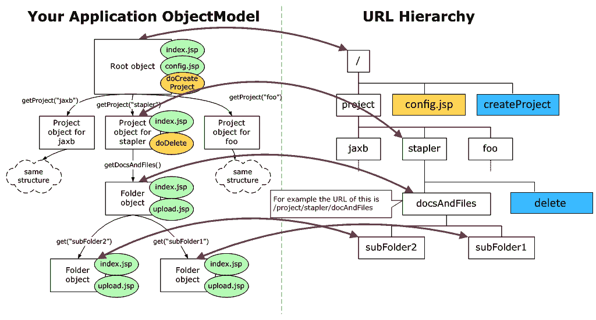
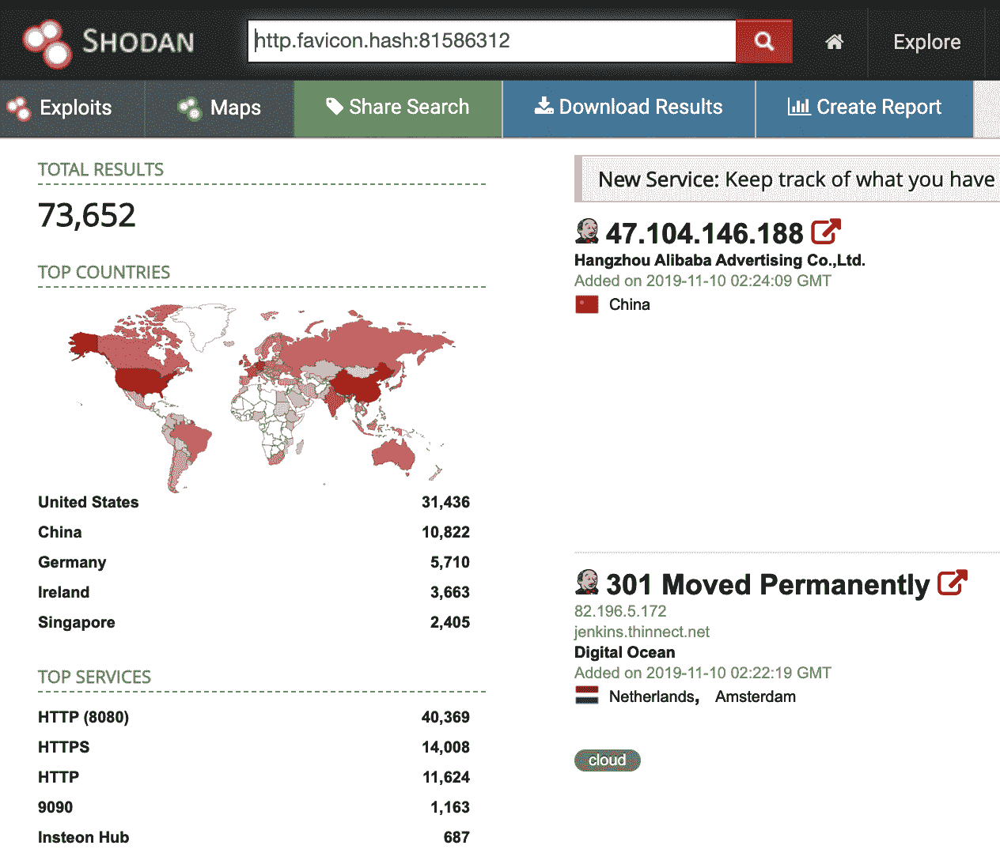
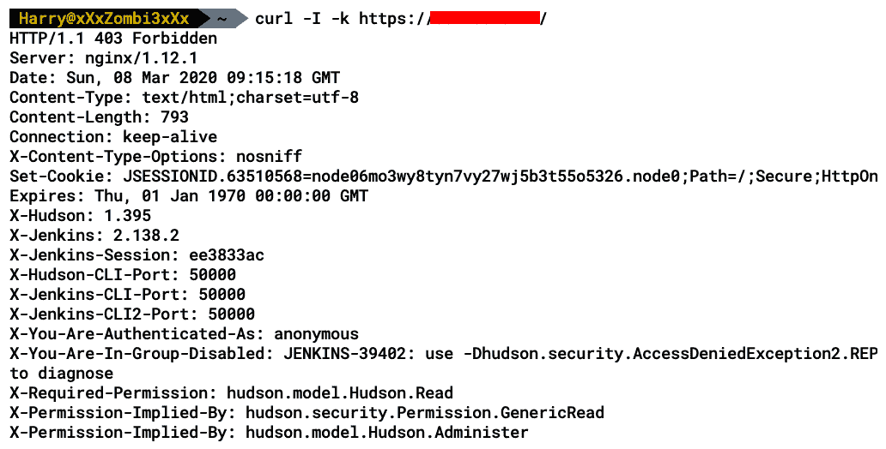
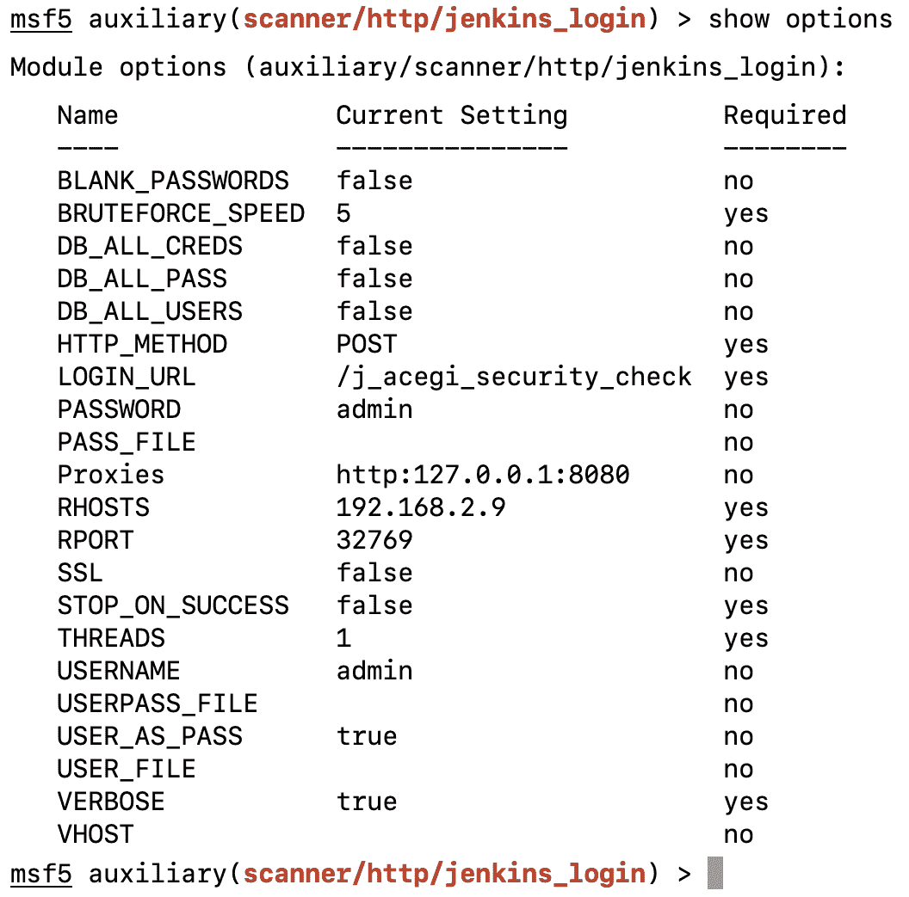
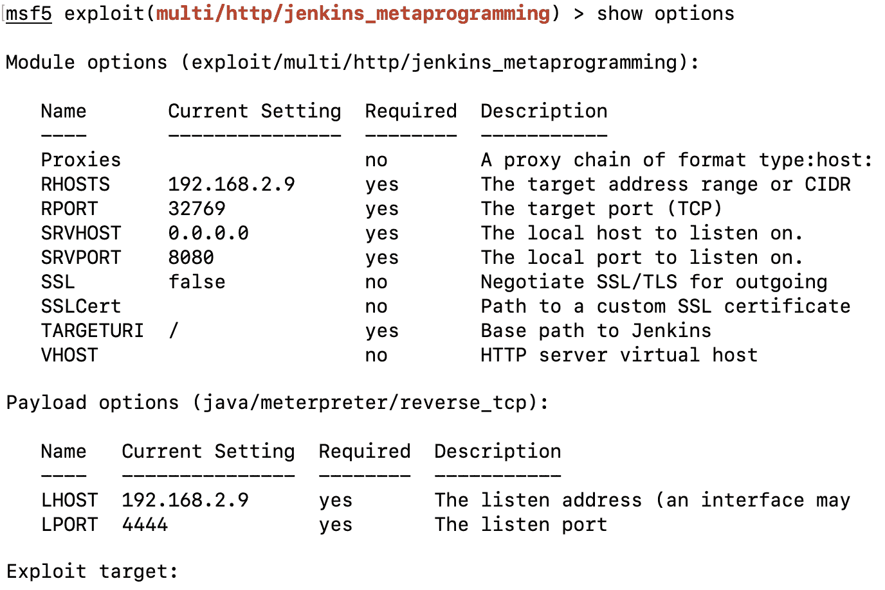
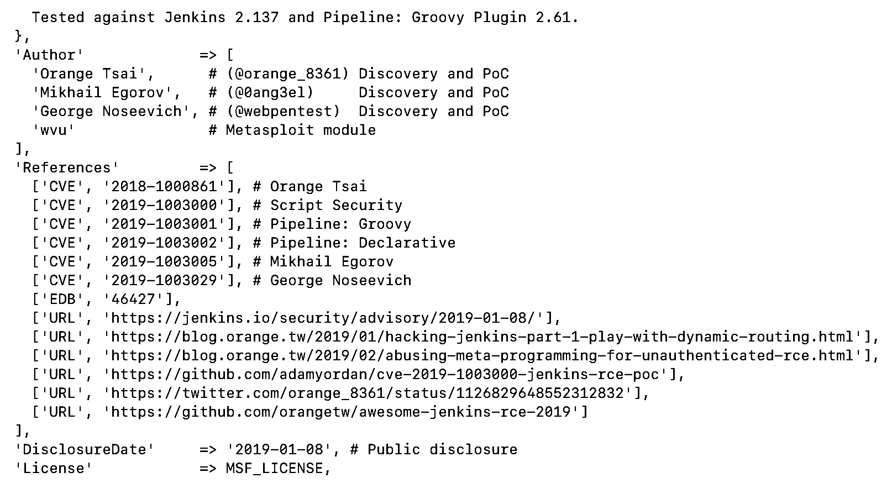
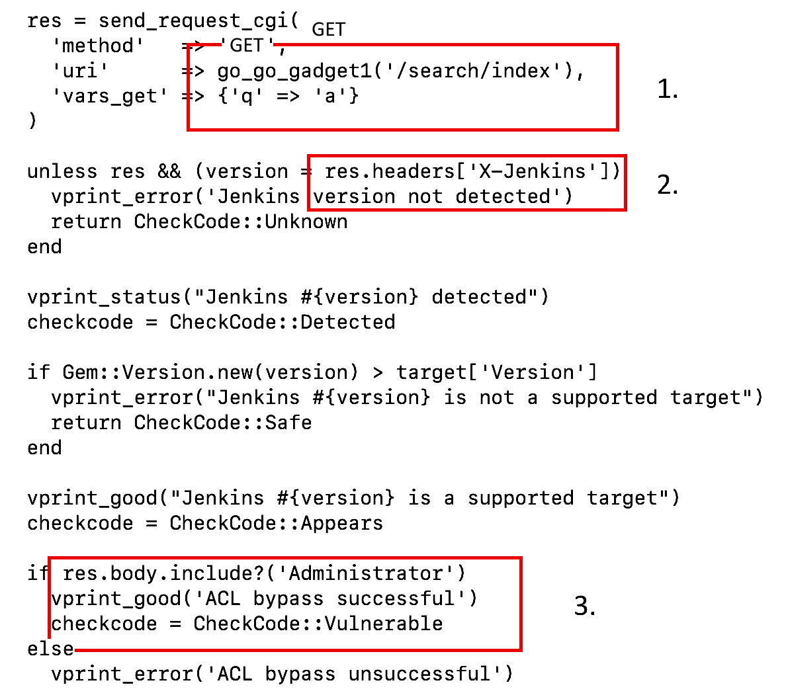
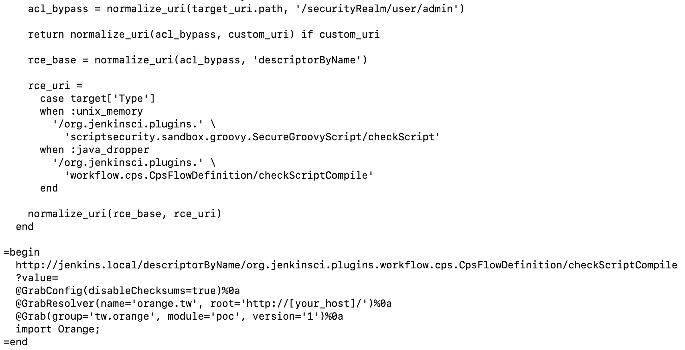
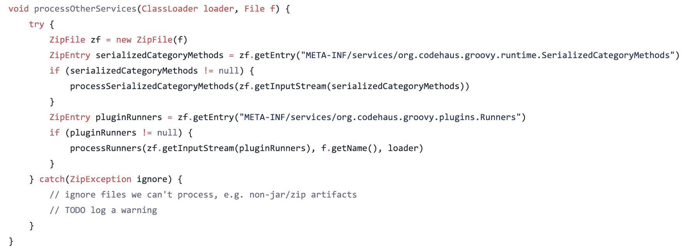

# 技术平台上的渗透测试 - Jenkins

在之前的章节中，我们看了如何利用 JBoss 和 Apache Tomcat。在本章中，我们将看看 Jenkins。Jenkins 是一个流行的工具，用于自动化软件开发过程中的非人工部分。在**企业对消费者**（**B2C**）关系中，公司提供诸如电子支付、电子商务、在线手机和卫星充值计划等服务给消费者，开发人员承担着重要的工作。由于在分期和生产服务器上频繁更新，环境对开发人员来说变得复杂。为了更有效地处理软件更新并能够及时发布它们，公司将选择使用一个平台引擎来尝试帮助管道化更新并轻松管理它们。

Jenkins 是这样一个平台引擎。它处理需要在不同时间部署到不同服务器上的源代码的部署和管理。由于 Jenkins 在管理公司的源代码时处理敏感信息，因此它是那些专注于工业间谍活动的人的热门目标。一旦威胁行为者能够访问 Jenkins 平台，他们就可以访问组织提供的服务的源代码（蓝图）。

作为渗透测试人员，我们必须确保客户组织的实例（如 Jenkins）已经完全打补丁。在本章中，我们将探讨以下主题：

+   Jenkins 简介

+   Jenkins 术语

+   Jenkins 侦察和枚举

+   利用 Jenkins

让我们开始吧！

# 技术要求

以下是本章的技术要求：

+   Jenkins 实例：[`jenkins.io/download/`](https://jenkins.io/download/)

+   Metasploit 框架

# Jenkins 简介

Jenkins 是一个开源工具。它是使用 Java 构建的，可以通过插件实现持续集成。例如，如果我们想要集成 Git，我们需要安装 git 插件。Jenkins 支持数百种插件，几乎与每种工具兼容。它这样做是为了确保**持续集成**（**CI**）和**持续交付**（**CD**）。

以下是 Jenkins 的一些关键特性：

+   提供 CI 和 CD

+   基于插件的架构

+   可扩展

+   分布式

+   易于配置

# Jenkins 术语

在我们深入研究如何枚举和利用 Jenkins 之前，我们需要了解一些基本术语，这些术语可能会在本章的后面部分出现。

# Stapler 库

Stapler 是 Jenkins 使用的一个库，它允许对象自动映射到 URL。它解决了在复杂应用程序中映射相对 URL 的问题，例如**表达式语言**（**EL**）([`www-106.ibm.com/developerworks/java/library/j-jstl0211.html`](http://www-106.ibm.com/developerworks/java/library/j-jstl0211.html))。它接受一个对象和一个 URL，然后根据对象评估 URL。它重复这个过程，直到找到静态资源、视图（如 JSP、Jelly、Groovy 等）或操作方法。以下图表更详细地显示了这个过程：

（来源：[`stapler.kohsuke.org/what-is.html`](http://stapler.kohsuke.org/what-is.html)）

如前图所示，根对象映射到 URL，而每个其他对象都映射为单独的路径，直到找到资源。

# URL 路由

Jenkins 使用 URL 路由来处理 URL 路径；让我们来看一下：

+   模型：

`getLog()`将遍历到`/log/`

`getJob("foo")`将被遍历为`/job/foo`

+   操作方法

`doArtifact(...) action in getJob("foo")`将变成`/job/foo/1/artifact`，其中 1 是动态获取器。

# Apache Groovy

Apache Groovy 是一种多功能的编程语言，支持静态类型和静态编译。用户在这里需要记住的关键点是 Groovy 支持运行时和编译时的元编程。

# 元编程

元编程是一种允许计算机程序将其他程序视为其输入数据的技术。因此，程序可以被设计为读取/写入/修改其他程序，甚至是自身。如果一个程序只是报告自身，这被称为**内省**，而如果程序修改自身，则被称为**反射**。许多语言支持元编程 - PHP、Python、Apache Groovy 和编译器是一些例子。

让我们尝试通过一个例子进一步理解：

[PRE0]

正如您所看到的，前面的程序创建了另一个程序`programs`，它打印数字`1-500`。

# 抽象语法树

**抽象语法树**（**AST**）是程序的结构和内容相关细节的表示。它不包括不必要的标点和分隔符。编译器使用 AST 进行解析、类型解析、流分析和代码生成。

# 管道

Jenkins 管道是一组一起工作并帮助进行持续交付的插件的组合。管道可以作为 JenkinsFile 的代码实现，并且可以使用**领域特定语言**（**DSL**）进行定义。Jenkins 中的管道是用 Groovy 构建的。

# Jenkins 侦察和枚举

对 Jenkins 进行枚举是渗透测试的一个非常重要的方面。在执行侦察和枚举时检索到的活动信息可以帮助渗透测试人员利用 Jenkins 实例。

有几种方法可以确定 Jenkins 的安装和版本检测过程。我们现在将介绍这些，然后讨论如何利用 Jenkins。

# 使用网站图标哈希检测 Jenkins

Jenkins 有一个非常独特的网站图标，当转换为哈希形式时，变成了`81586312`。这个哈希可以用来识别 Jenkins 安装；甚至可以在 Shodan 上用来识别运行 Jenkins 的系统。

以下截图显示了哈希值如何用于识别 Jenkins：

我们还可以使用不同的 Jenkins HTTP 响应头来找到 Jenkins 实例。例如，要找到特定版本的 Jenkins，我们可以使用`X-Jenkins`头，如下图所示：

让我们看看其他 HTTP 响应头可以用来识别 Jenkins 实例。

# 使用 HTTP 响应头检测 Jenkins

检测 Jenkins 实例最常见的方法之一是分析 HTTP 响应头。Jenkins 将大量信息放入其响应头中，例如版本披露信息、**命令行接口**（**CLI**）端口、用户和组权限等，所有这些都可以用于进一步的利用。以下是 Jenkins 实例的响应头截图：

以下是一些可以用于检测 Jenkins 实例的 HTTP 服务器响应头：

+   `X-Hudson`

+   `X-Jenkins`

+   `X-Jenkins-Session`

+   `X-You-Are-Authenticated-As`

+   `X-You-Are-In-Group-Disabled`

+   `X-Required-Permission`

+   `X-Permission-Implied-By`

+   `X-Hudson-CLI-Port`

+   `X-Jenkins-CLI-Port`

+   `X-Jenkins-CLI2-Port`

+   `X-SSH-Endpoint`

+   `X-Hudson-JNLP-Port`

+   `X-Jenkins-JNLP-Port`

+   `X-Jenkins-JNLP-Host`

+   `X-Instance-Identity`

+   `X-Jenkins-Agent-Protocols`

现在我们已经学会了一些手动检测 Jenkins 的常见方法，让我们继续进行渗透测试的下一个阶段 - 枚举。

# 使用 Metasploit 进行 Jenkins 枚举

现在我们已经介绍了手动枚举 Jenkins 的方法，让我们继续看看 Metasploit 框架的辅助`jenkins_enum`，它可以进一步进行枚举。

Metasploit 模块还有一个辅助程序，使用与前一节描述的方法类似的方法来执行 recon。这包括查找响应头值，即`X-Jenkins`，以及关键字的 HTML 源。可以使用以下命令加载辅助程序：

[PRE1]

以下截图显示了上述命令的输出：

在上述截图中设置选项后，运行辅助程序将检测版本号，并执行基本检查：

现在，我们可以深入一点，检查辅助程序的源代码，以了解脚本到底在做什么。通过查看以下截图，我们可以看到脚本检查以下内容：

+   /view/All/newJobs：显示作业列表

+   `/asynchPeople`：显示用户列表

+   `/systemInfo`：打印系统信息：

以下命令显示 Metasploit 中的另一个辅助程序，允许我们暴力破解 Jenkins 的凭据：

[PRE2]

以下截图显示了上述命令的输出：

在设置了所需的选项并运行模块之后，我们将看到辅助程序返回有效的凭据。这可以在以下截图中看到：

现在让我们在下一节中探索 Jenkins。

# 利用 Jenkins

一旦枚举完成，并且找到了一个有漏洞的 Jenkins 版本，我们就可以继续进行利用阶段。在本节中，我们将学习`@orangetsai`发现的各种利用方式，以及它们如何被链接在一起来在 Jenkins 服务器上执行系统命令。

首先，我们将看一下 2019 年最著名的两个利用，由`@orangetsai`（[`blog.orange.tw/`](https://blog.orange.tw/)）发现，利用了 Jenkins 并返回了一个 shell。这些利用后来被添加到 Metasploit 作为未经身份验证的 RCE。

# Jenkins ACL 绕过

在 Jenkins 的脚本控制台利用变得广为人知之后，很多人开始在全局安全配置设置中将匿名读取访问权限设置为**禁用**：

有了这个设置，匿名用户除了在以下截图中显示的特定白名单项目之外，将不再看到任何内容（这些项目在以下 URL 提供：[`github.com/jenkinsci/jenkins/blob/41a13dffc612ca3b5c48ab3710500562a3b40bf7/core/src/main/java/jenkins/model/Jenkins.java#L5258`](https://github.com/jenkinsci/jenkins/blob/41a13dffc612ca3b5c48ab3710500562a3b40bf7/core/src/main/java/jenkins/model/Jenkins.java#L5258)）：

我们已经知道 Jenkins 是基于 Java 的，并且在 Java 中，一切都是`java.lang.Object`的子类。因此，所有对象都有`getClass()`，并且`getClass()`的名称符合命名约定规则。因此，绕过这个白名单的一种方法是使用白名单对象作为入口，然后跳转到其他对象。

Orange 发现调用这些对象（在此处列出）会导致 ACL 绕过，并且可以成功访问搜索方法：

[PRE3]

在上述对象中显示的路由机制映射在以下 URL 格式中：

[PRE4]

从提供的 URL 中，我们可以看到除非我们登录，否则不允许任何操作：

现在，让我们看看当我们使用 ACL 绕过时会发生什么：

我们成功绕过了 ACL 并进行了搜索。

# 理解 Jenkins 未经身份验证的 RCE

将 ACL 绕过漏洞与沙盒绕过链接在一起，给我们**远程代码执行**（**RCE**）。Metasploit 已经有一个利用这些漏洞并执行我们的 shellcode 的模块。在了解利用的工作原理之前，让我们看看它如何使用：

1.  我们可以通过在 msfconsole 中使用以下命令加载利用模块：

[PRE5]

1.  以下屏幕截图显示了前面命令的输出：

1.  接下来，我们设置所需的选项并运行利用，如下面的屏幕截图所示：

1.  现在我们有了一个反向 shell，让我们阅读利用的源代码并尝试理解它是如何工作的。通过查看源代码，我们可以看到利用中使用的各种 CVE，以及作者的详细信息：

1.  查看模块的源代码，我们可以看到模块正在使用`GET` HTTP 方法请求`/search/index`并带有`q=a`参数：

正如我们所看到的，利用通过检查以下内容来确认应用程序是否正在运行 Jenkins：

+   调用搜索功能的 ACL 绕过

+   X-Jenkins 值的响应头

+   调用搜索 URL 后关键字管理员的 HTML 页面正文

在这里，我们可以看到与 Groovy 的`doCheckScriptCompile`方法有关的内容。`doCheckScriptCompile`是一个允许开发人员检查语法错误的方法。为了解析语法，使用了 AST 解析器（有关更多详细信息，请参见本章的*Jenkins 术语*部分）：

为了能够成功实现 RCE，我们需要发送通过`doCheckScriptCompile()`时执行的代码。这就是元编程的作用。Groovy 对元编程很友好。

当我们查看 Groovy 参考手册时，我们会遇到`@groovy.transform.ASTTest`，它有以下描述：

这意味着当通过`@ASTTest`传递时，将执行以下代码：

[PRE6]

到目前为止，利用可以这样编写：

[PRE7]

URL 正在调用 Jenkins 的`workflow-cps`插件，该插件具有`checkScriptCompile`方法。托管代码的 URL 是

[`github.com/jenkinsci/workflow-cps-plugin/blob/2.46.x/src/main/java/org/jenkinsci/plugins/workflow/cps/CpsFlowDefinition.java`](https://github.com/jenkinsci/workflow-cps-plugin/blob/2.46.x/src/main/java/org/jenkinsci/plugins/workflow/cps/CpsFlowDefinition.java) 可以如下所示：

然而，这个版本的利用只有在 Jenkins 中不存在**Pipeline Shared Groovy Libraries Plugin**时才能工作。这就是为什么，如果我们进一步查看利用代码，我们将看到与最终载荷中提到的`@Grab`相关的内容，如下所示：

现在，我们需要了解`@Grab`是什么。根据 Groovy 的官方文档，Grape 是一个 JAR 依赖管理器，允许开发人员管理和添加 Maven 存储库依赖项到他们的类路径，如下面的屏幕截图所示：

因此，`@Grab`将从所述存储库导入依赖项并将其添加到代码中。现在，一个问题出现了：“如果存储库不在 Maven 上怎么办？”在我们的情况下，因为它在 shellcode 中，Grape 将允许我们指定 URL，如下面的屏幕截图所示：

在这里，以下代码将从[`evil.domain/evil/jar/org.restlet/1/org.restlet-1.jar`](http://evil.domain/evil/jar/org.restlet/1/org.restlet-1.jar)下载 JAR 文件：

[PRE8]

现在我们已经从服务器下载了恶意的 JAR 文件，下一个任务是执行它。为此，我们需要深入研究 Groovy 核心的源代码，这是 Grape 实现的地方（[`github.com/groovy/groovy-core/blob/master/src/main/groovy/grape/GrapeIvy.groovy`](https://github.com/groovy/groovy-core/blob/master/src/main/groovy/grape/GrapeIvy.groovy)）。

我们可以使用一种方法来处理 ZIP（JAR）文件，并检查特定目录中的两种方法。请注意以下截图中显示的最后几行 - 有一个名为`processRunners()`的函数：

通过查看以下函数，我们可以看到正在调用`newInstance()`。这意味着可以调用一个构造函数：

简而言之，如果我们创建一个恶意的 JAR 文件，并将一个类文件放在`META-INF/services/org.codehaus.groovy.plugins.Runners`文件夹中，我们就能够调用一个包含我们代码的构造函数，如下所示：

[PRE9]

上述代码将导致代码执行！

因此，如果我们回到利用的源代码，如下图所示，我们应该能够完全理解它的工作原理：

`checkScriptCompile`用于传递程序的语法。`@Grabconfig`用于禁用被获取文件的校验和。`@GrabResolver`用于获取外部依赖（恶意的 JAR 文件）。`Import`用于执行包含 shellcode 的构造函数。

# 总结

在本章中，我们学习了 Jenkins 及其基本术语。我们介绍了如何手动检测 Jenkins 的安装，以及如何使用 Metasploit Framework 进行检测。然后，我们学习了如何利用 Jenkins，以及利用的原理。了解这些利用的原理对于希望帮助所在公司应用更好的补丁并让渗透测试人员开发更好的利用或绕过的人来说是很重要的。

我们的主要目标应该始终是尽可能多地了解技术。从渗透测试人员的角度来看，他们了解得越多，他们能够利用的机会就越大，而从蓝队/SOC 团队的角度来看，对他们安装的技术有更多的了解可以帮助他们防止对其进行攻击。

在下一章中，我们将研究如何利用应用逻辑中的漏洞。

# 问题

1.  在黑盒渗透测试中，我们如何识别 Jenkins 实例？

1.  还有其他方法可以识别 Jenkins 实例吗？

1.  我已经从 HTTP 头中识别出了 Jenkins 实例，但页面无法访问。我该如何使页面可访问？

1.  一旦我能够访问 Jenkins 面板，我可以做些什么？

# 进一步阅读

以下链接更详细地介绍了 Jenkins 的漏洞利用：

+   Hacking Jenkins Part 2 - Abusing Meta Programming for Unauthenticated RCE: [`blog.orange.tw/2019/02/abusing-meta-programming-for-unauthenticated-rce.html`](https://blog.orange.tw/2019/02/abusing-meta-programming-for-unauthenticated-rce.html)

+   Jenkins Security Advisory 2019-01-08: [`jenkins.io/security/advisory/2019-01-08/#SECURITY-1266`](https://jenkins.io/security/advisory/2019-01-08/#SECURITY-1266)

+   使用 Grape 进行依赖管理： [`docs.groovy-lang.org/latest/html/documentation/grape.html`](http://docs.groovy-lang.org/latest/html/documentation/grape.html)
