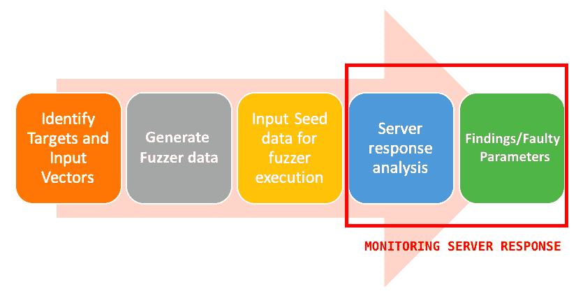
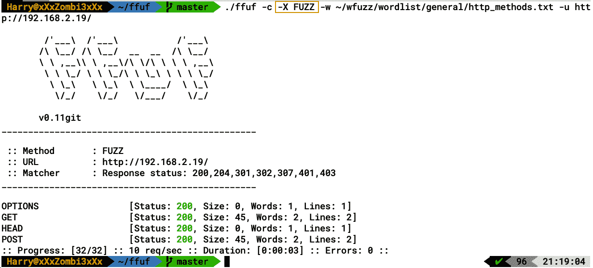
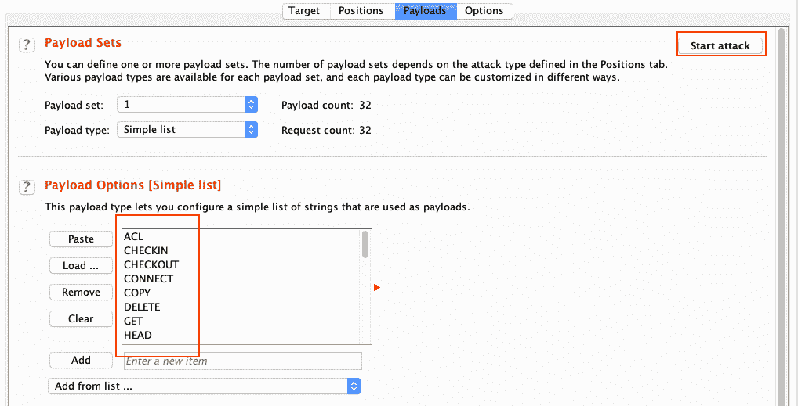
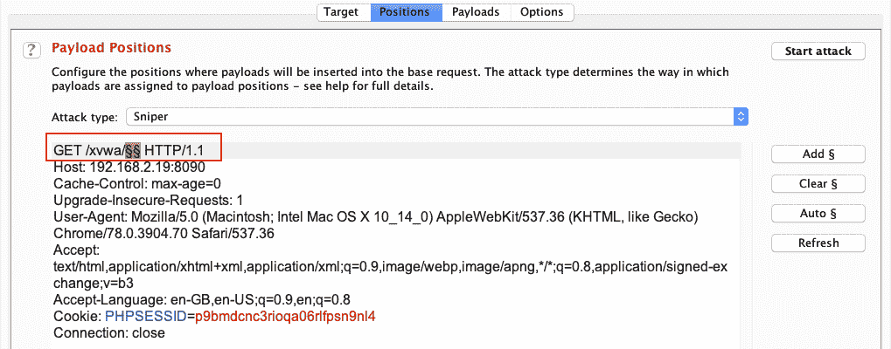
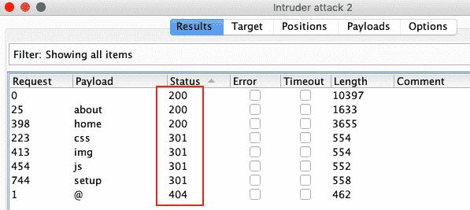
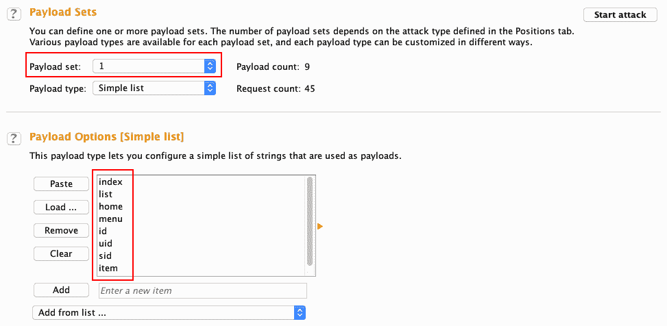
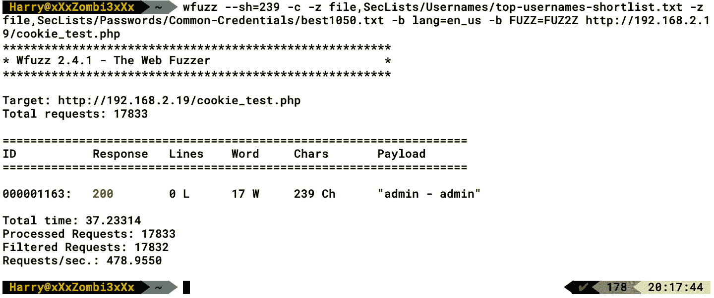
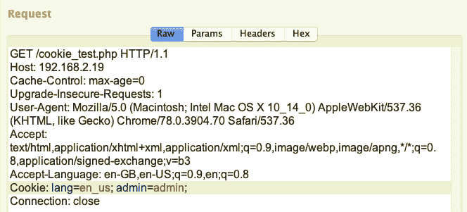

# Web 应用程序模糊测试 - 逻辑漏洞挖掘

在之前的章节中，我们已经学习了 Metasploit 的基础知识，可以在 Web 应用程序渗透测试中使用的 Metasploit 模块，使用 Metasploit 模块进行侦察和枚举，Metasploit 支持的不同技术和不同内容管理系统（CMSes）的不同模块，以及不同的利用技术。在本章中，我们将学习 Web 应用程序渗透测试的另一个重要方面 - Web 应用程序模糊测试。

Web 应用程序模糊测试并不是一般渗透测试案例中的强制阶段。然而，它是发现逻辑漏洞的关键步骤。根据 Web 应用程序服务器对某些请求的响应方式，可以使用模糊器来了解服务器的行为，以发现测试人员未见的缺陷。Metasploit 配备了三个 Web 模糊器模块，可用于测试 Web 应用程序中表单和其他字段的内存溢出。在本章中，我们将学习以下主题来学习模糊测试：

+   什么是模糊测试？

+   模糊测试术语

+   模糊攻击类型

+   Web 应用程序模糊测试简介

+   识别 Web 应用程序攻击向量

+   场景

# 技术要求

以下是本章的技术要求：

+   Wfuzz: [`github.com/xmendez/wfuzz`](https://github.com/xmendez/wfuzz)

+   Ffuf: [`github.com/ffuf/ffuf`](https://github.com/ffuf/ffuf)

+   Burp Suite: [`portswigger.net/burp`](https://portswigger.net/burp)

# 什么是模糊测试？

模糊测试，也称为模糊测试，是一种使用畸形/半畸形数据以自动化方式发现实现错误的黑盒软件测试。模糊测试是由威斯康星大学麦迪逊分校的 Barton Miller 教授及其学生于 1989 年开发的（他们的持续工作可以在[`www.cs.wisc.edu/~bart/fuzz/`](http://www.cs.wisc.edu/~bart/fuzz/)找到）。在进行模糊测试时，观察应用程序/软件的响应，并根据其行为的变化（崩溃或挂起），发现实现错误。简而言之，模糊测试过程如下：

我们需要确定目标和输入向量（在系统应用程序的情况下）以及需要进行模糊处理的端点（在 Web 应用程序的情况下）。在生成适当的输入种子（随机模糊数据）之后，畸形/半畸形的模糊数据将被输入到模糊器进行测试。

与此同时，我们需要通过监控和分析服务器/应用程序响应（在 Web 应用程序模糊测试的情况下为 Web 服务器响应，在系统应用程序模糊测试的情况下为应用程序诊断信息/跟踪信息，其中包括 FTP 服务器、SSH 服务器和 SMTP 服务器）来了解应用程序在模糊测试期间的行为。为了更好地理解模糊测试，让我们首先学习一些在模糊测试中常用的术语。

# 模糊测试术语

为了更好地理解模糊测试和模糊测试技术，让我们先看一下本章中将帮助我们掌握模糊测试概念和技术的不同模糊测试术语：

+   **模糊器：** 模糊器是一种将畸形/半畸形数据注入到服务器/网络应用程序中并观察应用程序行为以检测错误的程序/工具。模糊器使用生成器生成的畸形/半畸形数据。

+   **生成器：** 生成器使用模糊向量和一些随机数据的组合。然后将生成的数据馈送给模糊器，模糊器将这些畸形数据注入到应用程序中。

+   **模糊向量：** 模糊向量是模糊器使用的已知危险值。通过观察应用程序的行为，模糊器可以注入不同的模糊向量。

+   **输入种子：**这些是模糊器用于测试的有效输入样本。输入种子可以是包含模糊器要使用的数据格式的任何测试文件。生成器将根据输入种子生成数据，然后由模糊器使用。如果选择输入种子小心翼翼，我们可以在应用程序中找到大量的错误。

+   **仪器：**这是一种技术，用于测量应用程序的性能和诊断信息，包括任何错误。在模糊处理期间，仪器技术将在运行时暂时控制被模糊处理的应用程序/软件，就像拦截器一样，以查找来自跟踪信息的错误。

现在我们已经学习了一些新的术语，让我们看看可以使用哪些攻击类型来执行模糊测试。

# 模糊攻击类型

模糊器通常会尝试使用数字（有符号/无符号整数或浮点数）、字符（URL 或命令行输入）、用户输入文本、纯二进制序列等进行攻击的组合。可以从这些类型生成一系列模糊向量。例如，对于整数，模糊向量可以是零、负值或非常大的整数值；对于字符，模糊向量可以是转义字符、Unicode 字符、URL 编码字符、特殊字符或所有字符的序列。生成模糊向量列表后，模糊器将使用该列表对应用程序进行模糊处理。

# 应用程序模糊处理

对于基于桌面的应用程序，模糊器可以对其界面（按钮序列的组合、文本输入等）、命令行选项（如果适用）以及应用程序提供的导入/导出功能进行模糊处理。

对于基于 Web 的应用程序，模糊器可以对其 URL、用户输入表单、HTTP 请求头、HTTP POST 数据、HTTP 协议和 HTTP 方法进行模糊处理。

# 协议模糊处理

协议模糊器将伪造网络数据包并将其发送到服务器。如果协议栈中存在错误，将使用协议模糊来揭示它。

# 文件格式模糊处理

文件格式模糊处理通常用于那些程序在文件中导入/导出数据流的情况。要执行文件格式模糊处理，您必须生成多个具有不同文件格式的输入种子，并将它们保存在单个文件中。然后，模糊器将使用保存的文件作为服务器/应用程序的输入，记录可能发生的任何崩溃。现在我们将进入下一节，该节将向我们介绍 Web 应用程序模糊处理。

# Web 应用程序模糊处理简介

现在我们对模糊概念、术语和攻击类型有了清晰的理解，让我们开始基于 Web 应用程序的模糊处理。如前所述，基于 Web 应用程序的模糊处理是通过使用 URL、表单、标头和方法作为主要模糊向量来完成的。在本章中，我们将使用以下工具对基于 HTTP 的 Web 应用程序进行模糊处理：**Wfuzz**、**Ffuf**和**Burp Suite**。在继续之前，让我们安装本节中概述的工具，以便查找逻辑错误。

# Fuzzer 安装（Wfuzz）

Wfuzz 是一个基于 Python 的 Web 应用程序模糊器，它使用替换技术来将命令中的**FUZZ**关键字替换为提供给模糊器的模糊向量。该模糊器可以在不同的 Web 应用程序组件（如参数、身份验证、表单、目录/文件和标头）中执行复杂的 Web 安全攻击。Wfuzz 还配备了各种模块，包括迭代器、编码器、有效载荷、打印机和脚本。根据 Web 应用程序的不同，我们可以使用这些模块来执行成功的模糊测试：

1.  我们可以通过克隆 GitHub 存储库来安装**Wfuzz**工具，如下面的屏幕截图所示：

！

1.  要确认工具是否已成功安装，让我们执行`wfuzz -h`命令：

！

现在让我们安装本章中将使用的第二个工具**Fuzz Faster U Fool**（**ffuf**）。

# 模糊器安装（ffuf）

**Fuzz Faster U Fool**（**ffuf**）是用 Go 编写的 Web 应用程序模糊器，具有 Gobuster 和**Wfuzz**的功能。我们可以从[`github.com/ffuf/ffuf`](https://github.com/ffuf/ffuf)克隆 GitHub 存储库，也可以从[`github.com/ffuf/ffuf/releases`](https://github.com/ffuf/ffuf/releases)下载预编译版本。让我们按照以下步骤安装它：

1.  我们可以使用`git clone https://github.com/ffuf/ffuf`命令或`go get https://github.com/ffuf/ffuf`命令来克隆存储库。让我们克隆存储库：

！

1.  现在，通过执行`go build .`命令来安装它：

！

1.  成功构建后，我们可以看到在同一目录中创建了一个名为`ffuf`的编译程序。我们可以按照以下截图中显示的方式运行程序：

！

1.  本章的第三个和最后一个工具将是臭名昭著的 Burp Suite Intruder：

！

现在我们已经安装了执行模糊测试所需的所有工具，让我们试着了解在执行对 Web 应用程序进行模糊测试时将使用的模糊测试输入和向量。

# 识别 Web 应用程序攻击向量

攻击向量是 Web 应用程序的区域/部分，模糊器可以在其中注入畸形/半畸形数据。对于 Web 应用程序，以下是我们可以执行模糊测试的部分：

+   HTTP 请求动词

+   HTTP 请求 URI

+   HTTP 请求头

+   HTTP `POST`数据

+   HTTP 协议的旧版本

让我们试着了解每个部分以及我们可以用于 Web 应用程序模糊测试的所有模糊向量。

# HTTP 请求动词

请求动词也称为请求方法，它们由 Web 应用程序客户端用于指示对服务器上给定资源执行的期望操作。所使用的每种方法取决于客户端从服务器获取的资源。一些最常见的 HTTP 动词是`GET`，`POST`，`OPTIONS`，`HEAD`，`PUT`，`DELETE`，`TRACE`，`PATCH`和`CONNECT`。

对 HTTP 请求方法进行模糊测试可以帮助我们识别基于模糊器提供的不同方法而发生的 Web 应用程序响应的变化。我们还可以识别 Web 应用程序服务器允许的方法，这可以用于检查一些攻击测试用例。

# 使用 Wfuzz 对 HTTP 方法/动词进行模糊测试

对 HTTP 方法进行模糊测试非常简单，同时也非常有帮助。让我们尝试使用**Wfuzz**在简单的 Web 应用程序上对 HTTP 动词进行模糊测试。可以通过以下步骤来执行 HTTP 请求方法的模糊测试：

1.  在终端中执行以下命令以开始使用**Wfuzz**：

[PRE0]

1.  以下截图显示了前面命令的输出：

！

`-z`选项用于输入有效负载。在这种情况下，我们使用了一个常见的 HTTP 请求方法列表（`GET`，`POST`，`HEAD`，`OPTIONS`，`TRACE`和`PUT`）。

`-X`选项用于提供模糊器要使用的 HTTP 请求方法。如果未提供`-X`选项，模糊器将默认使用 HTTP `GET`请求方法进行模糊测试。

现在，让我们看看如何使用**ffuf**对 HTTP 动词进行模糊测试。

# 使用 ffuf 对 HTTP 方法/动词进行模糊测试

我们还可以使用**ffuf**来模糊请求头。

我们可以执行以下命令，使用单词列表来模糊测试请求头：

[PRE1]

以下屏幕截图显示了前面命令的输出：

如前面的屏幕截图所示，模糊器找到了一些 Web 应用程序服务器可接受的 HTTP 方法。让我们尝试使用 Burp Suite 来模糊相同的情况。

注意：在**ffuf**中使用`-c`选项是为了给 HTTP 响应代码添加颜色。这有助于我们更快地识别隐藏的文件和目录。

# 使用 Burp Suite Intruder 来模糊测试 HTTP 方法/动词

HTTP 动词也可以通过 Burp Suite Intruder 来进行模糊测试，方法是单击 Intruder 选项卡，然后打开 Positions 子选项卡。Burp Suite 将自动使用**§**载荷标记标记任何匹配`[parameter]=[value]`格式的值。在载荷标记内的任何内容都将被 Burp Suite 视为模糊向量。Burp Suite Intruder 支持四种攻击类型：Sniper、Battering Ram、Pitchfork 和 Cluster Bomb。要了解有关攻击类型的更多信息，请参阅[`portswigger.net/burp/documentation/desktop/tools/intruder/positions.`](https://portswigger.net/burp/documentation/desktop/tools/intruder/positions)

让我们通过单击“清除§”按钮来清除模糊向量位置，如下面的屏幕截图所示：

要对 HTTP 请求方法进行模糊测试，让我们通过单击“添加§”按钮添加载荷标记（**§**），如下面的屏幕截图所示：

现在设置了载荷标记，我们需要定义应该由入侵者用于模糊测试的载荷。这可以通过单击“载荷”选项卡来完成（如下面的屏幕截图所示）。在这种情况下，我们将使用包含一些常见 HTTP 请求方法的单词列表。可以通过首先将载荷类型设置为“简单列表”，然后单击“加载…”按钮来加载列表：

加载了单词列表后，我们可以单击“开始攻击”按钮开始模糊测试：

将打开一个新窗口，显示模糊测试的结果，如下面的屏幕截图所示：

在前面的屏幕截图中，我们可以观察到当使用 HTTP CONNECT 和 TRACE 方法时，服务器分别以 HTTP `400`（**错误请求**）和 HTTP `405`（**不允许的方法**）代码做出响应。这显示了关于这两个请求头的 Web 应用程序服务器的行为。 

注意：我们也可以自由使用在线可用的其他自定义列表来模糊测试 HTTP 方法。

# HTTP 请求 URI

开始 HTTP 请求 URI 模糊测试，我们首先需要了解 URI 的结构。URI 具有以下通用可接受的结构：

[PRE2]

# 使用 Wfuzz 来模糊测试 HTTP 请求 URI 路径

要使用 Wfuzz 来模糊测试 URI 路径，让我们执行以下命令：

[PRE3]

以下屏幕截图显示了前面命令的输出：

使用`--hc`开关，我们可以根据 HTTP 代码过滤结果。在这种情况下，我们已经过滤了 HTTP `404`（**未找到**）代码，如下面的屏幕截图所示：

我们也可以使用**ffuf**来做同样的事情。

# 使用 ffuf 来模糊测试 HTTP 请求 URI 路径

要模糊 URI 路径，让我们执行以下命令：

[PRE4]

以下屏幕截图显示了前面命令的输出：

在前面的两种情况下，`FUZZ`关键字被替换为用于模糊处理目录名称的单词列表条目。正如我们在前面的屏幕截图中所看到的，当模糊器请求 css、img、js 和 setup 时，服务器响应了 HTTP `301`。通过观察响应的大小和单词，我们可以得出结论，模糊器能够在 Web 应用程序服务器中找到目录。

# 使用 Burp Suite Intruder 进行 HTTP 请求 URI 路径的模糊处理

现在我们已经使用了**Wfuzz**和**ffuf**来模糊处理 URI 路径，让我们尝试在 Burp Suite Intruder 中进行相同的操作。这里的概念是相同的。让我们放置一个负载标记（如下面的屏幕截图所示），以便模糊器将数据发送到向量：

让我们将负载类型设置为“简单列表”，并使用“加载…”按钮导入一个单词列表：

单击“开始攻击”按钮（如前面的屏幕截图所示），Intruder 将尝试使用给定的自定义单词列表对 URI 路径进行模糊处理。模糊器的结果将显示在另一个窗口中，其中包括 HTTP 响应代码和长度，我们可以在下面的屏幕截图中看到：

正如我们在前面的屏幕截图中所看到的，我们能够模糊处理 Web 应用程序服务器的 URI 路径（目录）。现在，让我们看看如何使用相同的工具模糊处理 URI 文件名和文件扩展名。

# 使用 Wfuzz 进行 HTTP 请求 URI 文件名和文件扩展名的模糊处理

Wfuzz 还可以模糊处理 Web 应用程序服务器的文件名和文件扩展名：

+   `wfuzz -c --hc=404 -z file,SecLists/Discovery/Web-Content/raft-small-files-lowercase.txt http://192.168.2.19:8090/xvwa/FUZZ.php`（文件名模糊处理）

+   `wfuzz -c --hc=404 -z list,php-asp-aspx-jsp-txt http://192.168.2.19:8090/xvwa/home.FUZZ`（文件扩展名模糊处理）

# 使用 ffuf 进行 HTTP 请求 URI 文件名和文件扩展名的模糊处理

要对 HTTP 请求 URI 文件名和文件扩展名进行模糊处理，可以使用 ffuf 模糊器的以下命令：

+   `ffuf -c -w <wordlist> -u http://192.168.2.19:8090/xvwa/FUZZ.php`（文件名模糊处理）

+   `ffuf -c -w <wordlist> -u http://192.168.2.19:8090/xvwa/home.FUZZ`（文件扩展名模糊处理）

# 使用 Burp Suite Intruder 进行 HTTP 请求 URI 文件名和文件扩展名的模糊处理

负载标记放置在文件扩展名之前，以模糊文件名（如我们在以下屏幕截图中所见）：

负载标记放置在文件名之后，以模糊文件扩展名（如我们在以下屏幕截图中所见）：

Wfuzz 和 Burp Suite Intruder 的很酷的功能是能够使用多个模糊向量来模糊处理多个负载位置。

# 使用 Wfuzz 进行 HTTP 请求 URI 的模糊处理（GET 参数+值）

Wfuzz 具有内置功能，可以通过添加**FUZZ**、**FUZ2Z**、**FUZ3Z**...关键字来模糊处理多个负载位置。假设我们想要模糊处理 Web 应用程序服务器的`GET`参数名称和值。由于我们不能在两个模糊向量中使用相同的单词列表，我们将使用**FUZZ**和**FUZ2Z**关键字来执行模糊处理。让我们在 Wfuzz 中执行以下命令：

[PRE5]

正如我们在前面的命令中所看到的，我们使用了`-z`选项（是的，我们可以重复使用`-z`，`-H`和`-b`选项）和`[parameter]=[value]`以`/?FUZZ=FUZ2Z`格式显示。执行此命令时，模糊器将使用`parameter_wordlist`中的第一个条目，将其替换为`FUZZ`关键字，然后通过`FUZ2Z`循环遍历所有`value_wordlist`条目。就像这样，模糊器将通过两个单词列表进行模糊处理。现在让我们看看如何使用 Intruder 实现相同的功能。

# 使用 Burp Suite Intruder 进行 HTTP 请求 URI 的模糊处理（GET 参数+值）

在 Burp Suite 中，不同的攻击类型可以帮助我们进行这种测试。为了同时使用两个字典进行模糊测试，我们将在 Intruder 中使用簇炸弹攻击类型：

1.  首先，让我们将攻击类型设置为簇炸弹，并将有效负载标记设置为/?§§=§§（如下图所示）：

1.  在这种情况下，我们将使用两个有效负载集，让我们将第一个有效负载集（参数名称）设置为简单列表，并将有效负载类型更改为 Simple list：

1.  现在我们的第一个有效负载集已经配置好了，让我们配置第二个有效负载集（参数值）。在将有效负载集设置为`2`后，让我们将有效负载类型更改为`Numbers`。由于参数值是整数格式（在这种情况下），让我们将范围设置为`1`到`5`，并将步长设置为`1`：

1.  我们的 Intruder 现在已经配置好了，可以对多个有效负载集进行模糊测试。让我们通过单击“开始攻击”按钮（如前面的屏幕截图中所示）开始模糊测试。然后我们会看到以下屏幕：

成功！

正如我们从前面的屏幕截图中看到的，Intruder 能够找到一个带有一些参数值的参数名称。我们如何区分在字典中找到的参数名称和值与其他条目？通过观察响应长度。

让我们尝试使用**Wfuzz**模糊三个模糊向量（目录、文件和文件扩展名）。这肯定会花费很多时间，因为它同时结合了不同的有效负载集。为了对目录、文件名和文件扩展名进行模糊测试，我们可以执行以下命令：

[PRE6]

以下屏幕截图显示了前面命令的输出：

结果可以根据字符数（`--hh`）、单词数（`--hw`）或行数（`--hl`）进行过滤：

现在我们对如何模糊 HTTP 请求 URI 有了一些了解，让我们了解如何模糊 HTTP 头部。

# HTTP 请求头

模糊请求头在概念上与模糊 URI 相同。唯一的区别是，通过模糊请求头找到的漏洞数量将比模糊 URI 找到的漏洞数量更多，因为这些头部被发送到 Web 应用程序服务器，服务器会在内部处理这些头部。这意味着我们有更大的范围来发现漏洞。

有不同类型的 HTTP 头部在起作用：

+   标准的 HTTP 头（`Cookie`，`User-Agent`，`Accept`，`Host`等）

+   非标准的 HTTP 头（`X-Forwarded-For`，`X-Requested-With`，`DNT`等）

+   自定义头部（除了非标准头部之外，任何以`X-`开头的头部）

让我们尝试了解如何使用与本章其他部分相同的模糊器模糊每种类型的头部。

# 使用 Wfuzz、ffuf 和 Burp Suite 对标准的 HTTP 头进行模糊测试

标准的 HTTP 头通常被 Web 服务器用来处理客户端请求。在进行 Web 应用程序渗透测试时，建议了解 Web 应用程序的工作原理以及 Web 应用程序服务器如何处理请求头（标准和非标准）。更好地了解 Web 应用程序可以帮助我们定义一些相当不错的模糊向量，从而大大增加在 Web 应用程序中找到逻辑缺陷的可能性。在本主题中，我们将通过一些自定义测试案例来了解如何对 Web 应用程序进行模糊测试。

# 场景 1 - Cookie 头部模糊

让我们看一个场景。我们有一个 PHP 文件，名为`- cookie_test.php`。我们使用`Cookie`标志请求这个文件，值为`lang=en_us.php`：

服务器响应消息为正在使用的语言：*英语*：

从`en_us.php`文件中，我们可能会认为`cookie`参数正在从服务器包含文件（文件包含）并执行文件，然后打印服务器的消息。

现在让我们看看如何使用**Wfuzz**模糊`cookie`头部：

正如我们在上述截图中所看到的，`-b`选项用于提供`cookie`值，我们使用了`lang=FUZZ`。使用基于 Web 应用程序攻击的模糊向量，我们能够找到服务器响应长度不同的有效载荷。在这里，我们使用了 fuzzer 找到的有效载荷之一：

我们能够确认存在文件包含漏洞。

使用**ffuf**执行以下命令也可以完成相同的操作：

[PRE7]

对于 Burp Suite，我们只需要将有效载荷标记添加到`Cookie`头部：

同样，我们可以使用相同的工具来模糊用户定义的`Cookie`头部。让我们来看看这个。

# 情景 2 - 用户定义的 cookie 头部模糊

这种情况与之前的情况不同。在这种情况下，我们将使用`lang=en_us` cookie 值从服务器请求`cookie_test.php`文件：

服务器响应为未经授权的访问！如下截图所示：

仅使用普通请求，服务器将定义的 cookie 回显给我们：

假设我们的目标是访问`home.php`文件，但目前受到限制，如下所示：

由于没有登录认证页面，我们无法对服务器进行身份验证，我们必须假设身份验证是在`User-Agent`部分或`Cookie`部分进行的。让我们假设身份验证是通过检查 cookie 值来进行的。客户端可以使用用户定义的 cookie 值来连接到服务器并成功进行身份验证。为了模糊一个盲目的用户定义的 cookie 值，让我们使用 wfuzz 执行以下命令：

[PRE8]

以下截图显示了上述命令的输出：

哇！正如我们在上述截图中所看到的，当插入一个具有值`Cookie: admin=admin;`的用户定义的 cookie 时，服务器响应了一个不同的页面。让我们使用相同的用户定义的 cookie 参数名称和值来请求相同的页面：

在下面的截图中，我们可以看到服务器正在将我们重定向到`home.php`页面：

通过模糊用户定义的 cookie 参数名称和值，我们能够使用`cookie_test.php`页面进行身份验证，以访问`home.php`页面：

相同的方法可以用来发现各种漏洞，如 SQL 注入，XSS 和 RCE。

注意：这完全取决于 Web 应用程序以及 Web 应用程序如何处理`Cookie`头部。如果`Сookie`头部只是用于服务器向客户端提供临时会话，那么我们除了测试基于会话的漏洞之外，别无他法。

其他标准头部也可以进行模糊，包括`User-Agent`，`Host`，`Accept`和`Content-Type`。在模糊非标准 HTTP 头部的情况下，我们可以使用一个单词列表来检查 fuzzer 请求的每个头部的服务器响应。有时，通过使用这些非标准头部，如 X-Forwarded-For 等，我们可以绕过服务器对应用程序设置的基于 IP 的访问限制。

# 使用 Wfuzz，ffuf 和 Burp Suite 模糊自定义头部

在许多网络应用程序中，开发人员引入了一些自定义的 HTTP 头，当请求被处理时，这些头就会被解析。从生成用户特定令牌到通过这些自定义头实现访问控制，这些头具有完全不同的功能级别。在这种情况下，有时开发人员会忘记对用户输入进行消毒，这反过来可能成为利用的目标。让我们看看如何使用 Wfuzz、ffuf 和 Burp Suite 来模糊自定义头。

# 场景 3 - 自定义头模糊

在这种情况下，我们有一个运行在 PHP 上的应用程序 - `custom_header.php`。我们从服务器请求以下页面：

！

服务器以未经授权的访问！消息和两个未知的头部 - `X-isAdmin: false`和`X-User: Joe`（正如我们在下面的屏幕截图中所看到的）做出回应：

！

服务器的消息如下：

！

通过观察这两个自定义头，我们可以假设服务器也在处理这些头。第一个头，即`X-isAdmin`，看起来像是一个接受布尔值`true`或`false`的自定义头。另一个头，`X-User`，可能接受用户的名字，所以值是字符串格式。让我们使用**Wfuzz**来模糊这些头，找出我们能做些什么。让我们在**Wfuzz**中执行以下命令：

[PRE9]

以下屏幕截图显示了上述命令的输出：

！

我们可以在 HTTP 请求中的多个位置使用`-H`标志。现在我们从服务器得到了相同的响应，让我们根据字符长度过滤结果（`--hh`标志）：

！

不可思议！我们找到了`X-isAdmin: true`和`X-User: Billy`的值。这意味着 Billy 是管理员。使用这个自定义头在 HTTP 请求中，让我们看看我们是否能访问页面：

！

正如我们在下面的屏幕截图中所看到的，我们能够使用自定义的 HTTP 头进行身份验证，并在身份验证后，服务器将我们重定向到`home.php`页面：

！

`home.php`页面如下所示：

！

现在我们对模糊 HTTP 请求头有了一些清晰的认识，我们也可以在 HTTP `POST`参数上使用类似的模糊技术，我们可以在下面的屏幕截图中看到：

！

同样，我们也可以对 HTTP `POST`参数进行模糊测试，以找到应用程序支持的 API 和这些 API 参数支持的可接受值。

对 Web 应用程序攻击向量进行模糊测试可以为我们提供更多关于 Web 应用程序渗透测试的见解。当模糊器发现有趣的东西时，记录每个请求和响应总是一个好习惯。最后，如果向模糊器提供详细的模糊数据，模糊测试就会非常有效。在大多数情况下，模糊测试可以找到代码执行和其他技术漏洞，这是通用 Web 应用程序扫描器无法找到的。

# 总结

在本章中，我们首先了解了模糊测试的基础知识和不同类型的模糊攻击。然后，我们深入研究了 Web 应用程序模糊测试，并查看了**Wfuzz**和**ffuf**的安装。之后，我们对 HTTP 请求动词和请求 URI 进行了模糊测试。在本章的最后，我们看了三种情景：cookie 头部模糊测试，用户定义的 cookie 头部模糊测试和自定义头部模糊测试。通过学习模糊测试，您现在可以了解 Web 应用程序的行为，这将帮助您发现技术和逻辑漏洞。您可以在进行漏洞赏金、或者参加具有挑战性的**夺旗赛**（**CTFs**）时，将模糊测试作为常规渗透测试的一部分。

在下一章中，我们将看一下渗透测试报告中必须包括的关键要点。

# 问题

1.  我可以对基于 SSL 的 Web 应用程序执行模糊测试吗？

1.  这些模糊测试工具（本章提到的）在 Windows 中受支持吗？

1.  我需要在所有 Web 应用程序渗透测试中执行模糊测试吗？

1.  如果我执行模糊测试，会发现什么样的漏洞？

# 进一步阅读

+   Wfuzz 下载页面：[`github.com/xmendez/wfuzz`](https://github.com/xmendez/wfuzz)

+   ffuf 下载页面：[`github.com/ffuf/ffuf`](https://github.com/ffuf/ffuf)

+   Burp Suite 官方网站：[`portswigger.net/burp`](https://portswigger.net/burp)

+   了解模糊测试的基础知识：[`owasp.org/www-community/Fuzzing`](https://owasp.org/www-community/Fuzzing)

+   了解 Web 应用程序攻击向量：[`www.blackhat.com/presentations/bh-dc-07/Sutton/Presentation/bh-dc-07-Sutton-up.pdf`](https://www.blackhat.com/presentations/bh-dc-07/Sutton/Presentation/bh-dc-07-Sutton-up.pdf)
