# 第二十章：撰写渗透测试报告

众所周知，一个好的报告必须包含有关系统漏洞的所有必要细节。所有渗透测试标准都强调撰写结构良好的报告。在本章中，我们将学习一些工具，以便撰写一个好的报告。

报告必须包含的关键要点如下：

+   漏洞的详细信息

+   CVSS 评分

+   漏洞对组织的影响

+   修补漏洞的建议

报告应分为两部分：一部分供技术团队使用，另一部分供管理层使用。

在本章中，我们将涵盖以下主题。这些主题将涵盖报告生成过程中常用的工具：

+   报告撰写简介

+   Dradis 框架简介

+   与 Serpico 合作

# 技术要求

本章的技术要求如下：

+   Dradis（[`github.com/dradis`](https://github.com/dradis)）

+   Serpico（[`github.com/SerpicoProject/Serpico`](https://github.com/SerpicoProject/Serpico)）

+   数据库服务器（MariaDB/MySQL）

+   Redis 服务器（[`redis.io/download`](https://redis.io/download)）

+   Ruby ([`www.ruby-lang.org/en/downloads/`](https://www.ruby-lang.org/en/downloads/))

# 报告撰写简介

报告是渗透测试中最重要的阶段之一，因为报告的漏洞不仅供技术团队使用，还供管理层使用。通常需要向客户呈现两种类型的报告 - **执行报告** 和**详细技术报告**（**DTR**）。

执行报告是为组织/公司的高层管理人员准备的，以便他们可以根据报告中提到的业务影响做出决策。另一方面，DTR 如其名所示，是详细报告，概述了发现的所有漏洞。这包括建议的步骤，以帮助技术（内部安全运营和开发团队）团队修补漏洞。总的来说，报告应包含以下细节：

+   目的和范围

+   使用的方法和方法论

+   使用的**通用漏洞评分系统（CVSS）**版本

+   执行摘要

+   发现摘要（发现的漏洞列表）

+   漏洞详情

+   结论

+   附录

现在我们已经快速介绍了报告撰写，让我们了解如何撰写一个好的执行报告。

# 撰写执行报告

正如我们在介绍中提到的，执行报告是供 C 级高管和管理层使用的，以便根据进行的风险评估（包括漏洞评估和渗透测试）来理解风险。由于 C 级高管是忙碌的人，报告应尽可能简洁，并包含他们需要的所有信息，以便做出明智的决策。让我们来看看执行报告的通用结构。

# 标题页

顾名思义，标题页包含有关项目、供应商和客户的信息。

# 文档版本控制

这个小节也在 DTR 报告中定义。当进行渗透测试时，报告不是一次性完成的。双方需要进行许多更改，以创建一个对客户和测试人员都可接受的平衡报告。将制作初稿并发送给客户。这个小节记录了从初稿起对报告所做的更改次数。每个更改定义了一个新版本。报告最终确定时，版本号也会在报告中提到。

# 目录

这个小节是报告中最重要的部分之一。**目录**（**ToC**）结构化报告文档，以便 C 级高管能够轻松理解。

# 目标

这个小节向高管介绍了渗透测试项目和定义的时间表。

# 定义的范围

在报告的这个小节中，应提及所有已定义的范围内的 URL、IP、端点等。这些信息有助于高级管理人员快速注意到受影响的资产，这可能对组织产生业务关键影响。

# 主要发现（影响）

报告的这个小节列出了每个漏洞的影响；也就是说，攻击者可以对组织的资产做些什么。这些指针帮助组织评估业务资产的安全级别。高级管理人员将知道组织哪些资产需要立即进行关键修复。

# 问题概述

这个小节让高层管理人员了解发现的漏洞的严重程度。可以使用一个漂亮的饼图或条形图来显示根据严重程度分类的发现的漏洞。

# 战略建议

这个小节为高级管理人员提供了他们可以遵循的建议，以修复那些具有关键性质的漏洞，如果被利用，可能会给业务带来问题。

报告中的所有细节都应以简洁的方式提及，因为执行报告的主要目标是向高层管理提供评估概述。报告中应删除任何不必要的内容。现在，让我们来看一下 DTR 报告。

# 撰写详细的技术报告

此报告应包括有关漏洞的所有技术细节。DTR 是为客户端的技术团队准备的。让我们来看一下 DTR 的通用结构。

# 标题页

顾名思义，标题页包含有关项目、供应商和客户的信息。

# 文档版本控制

这个小节也在执行报告中定义，并且包含的细节是相同的。

# 目录

这个小节是报告中最重要的部分之一。目录将报告文档结构化，以便客户的技术团队能够轻松理解。

# 报告摘要

这个小节提供了对渗透测试项目的概述，并向客户展示了发现的漏洞总数，按其严重程度级别显示。我们可以添加一些漏洞统计数据，如饼图或面积图，并将漏洞定义为关键、高、中、低或信息性。作为渗透测试人员，我们可以添加一个攻击叙述，告诉我们攻击者如何找到这些漏洞，以及攻击者可以利用这些漏洞的程度。报告摘要有助于技术团队以及高级管理人员看到项目的整体成功。

# 定义的范围

在与客户的启动会议中，项目的范围和范围内的目标将已经确定。在报告的这个小节中，应提及所有已定义的范围内的 URL、IP、端点等。这些信息有助于技术团队快速处理手头的漏洞，并与负责范围内 URL/IP 的开发者/管理员团队进行沟通。

将范围添加到报告中的另一个原因是为了使渗透测试人员的项目流程更加顺畅。在范围未定义的情况下，渗透测试人员将无法评估需要完成的工作量或完成项目所需的天数。众所周知，计算渗透测试项目价值的核心实体之一是人天数。

当渗透测试项目处于初始阶段，即与客户讨论项目时，项目的价值将根据客户共享的范围和执行该范围测试所需的人天数来计算。请注意，这些并不是定义项目价值的唯一因素 - 资产、时间表、为项目分配的资源数量、差旅费用（如果有）以及渗透测试人员的初始要求也是一些关键因素。

这个定义的范围有助于渗透测试人员将团队的资源分配到项目中，并定义时间表，以确保项目流程顺畅。如果有许多子项目，例如与同一客户进行内部网络或外部网络渗透测试，定义范围可以确保双方有相同的期望。

# 使用的方法

报告的这一小节应包含渗透测试人员在安全评估期间遵循的方法。最好使用图表展示这个过程，并向客户解释每个过程，以便客户端的技术团队了解他们的组织资产是如何被测试的。

无论渗透测试人员遵循 NIST-800 标准、PTES 标准还是他们自己公司的标准，他们都必须在这一小节中解释这个过程。

# CVSS

CVSS 是用于确定漏洞严重性的免费和开放的行业标准。在定义漏洞的严重性时，我们需要根据 CVSS 评分计算对漏洞进行分类。本小节将向客户介绍 CVSS 以及我们将在报告中使用的版本。在撰写本文时，CVSS 的版本为 CVSS v3.1，于 2019 年 6 月发布。

# 漏洞摘要

渗透测试人员应在报告的这一小节中添加漏洞描述、CVSS 评分、漏洞严重性、受影响的端点/IP、概念验证（PoC）、重现步骤、影响、建议和参考资料。

# 结论

在本小节中，渗透测试人员从攻击者的角度总结了项目的整体难度。任何额外的建议都会添加到这个小节中。

# 附录

任何其他信息，如屏幕截图、服务枚举、CVSS 计算公式以及客户可能需要的其他任何信息都添加到报告的这个子部分中。

现在，您知道如何撰写执行报告以及 DTR。在报告过程中出现的主要问题是收集所有技术细节。作为渗透测试人员，我们必须确保在渗透测试期间收集所有屏幕截图、URL、使用的有效载荷等，以便将这些细节输入 DTR 报告中。

如果范围只是几个 IP 或 URL，那么收集数据不会成为问题，但如果项目很庞大，那么有时收集数据会变得很麻烦。为了解决这些问题，我们可以选择在 GitHub 上公开可用的报告框架。这些框架可以自动解析输出扫描文件和 Nmap 端口扫描结果，并根据输入的细节给出报告。在接下来的部分，我们将讨论一个这样的框架 - Dradis。

# Dradis 框架介绍

Dradis 是一个开源的基于浏览器的应用程序，可用于聚合来自不同工具的输出并生成单个报告。它可以连接到超过 15 种工具，包括 Burp Suite、Nessus、Acunetix 和 Nmap。

# 预安装配置

要安装 Dradis，我们需要安装一些依赖包。它非常易于使用，并且已经预装在 Kali Linux 中。因此，我们将重新安装它，然后学习如何使用它。

首先，我们需要通过运行以下命令来安装依赖项：

[PRE0]

接下来，我们将继续安装。

# 安装和设置

我们可以使用以下命令下载 Dradis 社区版的 GitHub 存储库：

[PRE1]

上述命令的输出如下：

现在，我们需要运行以下命令：

[PRE2]

以下屏幕截图显示了上述命令的输出：

现在，我们需要转到 Dradis 文件夹。要安装 Dradis，我们需要在 bin 文件夹中运行设置文件，输入以下内容：

[PRE3]

安装完成后，我们可以运行以下命令来启动 Dradis 服务器，如下屏幕截图所示：

[PRE4]

以下屏幕截图显示了上述命令的输出：

可以通过转到`https://localhost:3000`来访问 Dradis。

我们甚至可以使用 Docker 镜像来避免安装步骤和在此过程中可能出现的任何错误。

现在，我们需要设置密码，以便可以访问框架并登录，如下屏幕截图所示：

现在，让我们开始使用 Dradis。

# 开始使用 Dradis

成功登录后，我们将被重定向到仪表板，如下屏幕截图所示：

Dradis Framework 的免费版本支持各种工具的插件，例如 Nmap、Acunetix、Nikto 和 Metasploit。它还允许我们创建在渗透测试活动期间可以使用的方法论。在平台的左侧窗格中，我们可以看到三个主要部分，可以帮助报告开发过程 - 所有问题、方法论和垃圾箱：

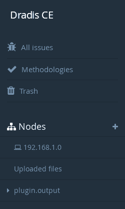

**所有问题**：此页面允许我们手动或通过导入来自不同工具（如 Nmap、Nikto 和 Nessus）的输出找到的问题。单击此选项将重定向我们到以下页面：

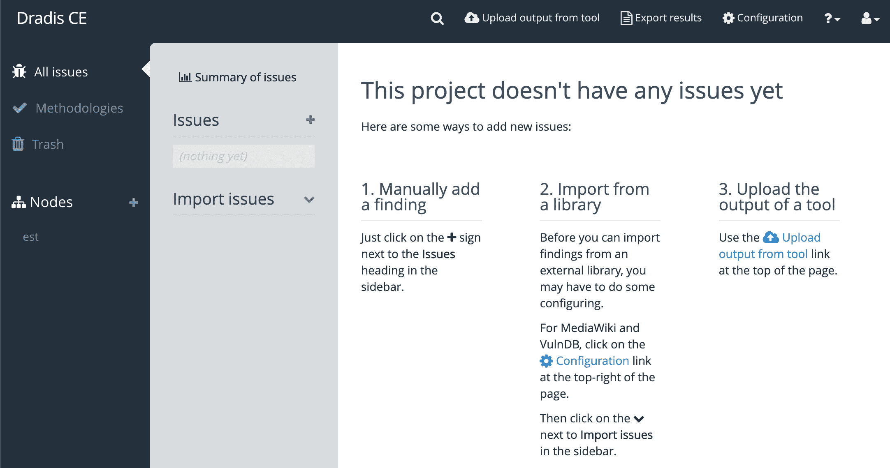

现在，让我们学习如何将第三方报告导入 Dradis。

# 将第三方报告导入 Dradis

要从工具的输出中导入问题，请按照以下步骤操作：

1.  选择第三个选项“上传工具的输出”，这将带我们到以下页面：

1.  向下滚动将显示已安装的插件列表，以及它们的工具名称，如下屏幕截图所示：

1.  上传报告将显示解析后的输出，如下屏幕截图所示：

1.  导入完成后，我们将在左侧窗格下看到结果，即插件输出，如下屏幕截图所示：

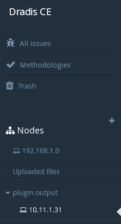

1.  我们刚刚导入的扫描结果的输出如下：

现在，我们需要定义安全测试方法。

# 在 Dradis 中定义安全测试方法

方法论部分允许我们定义在活动期间将遵循的方法论。最常用的方法论是开放源安全测试方法手册（OSSTMM），渗透测试执行标准（PTES）和国家标准技术研究所。我们甚至可以通过定义一个检查表来创建自己的方法论，如下所示：

1.  要创建检查表，请转到方法论，然后单击“添加新内容”。您将看到以下屏幕：

1.  然后，我们需要为其指定一个名称，然后单击“添加到项目”：

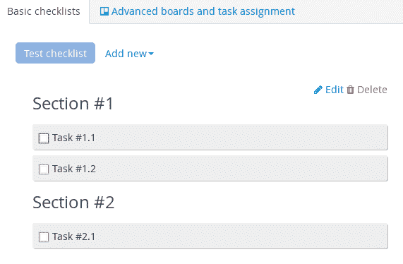

1.  我们应该看到已为我们创建了一个示例列表。单击右侧的“编辑”按钮即可进行编辑：

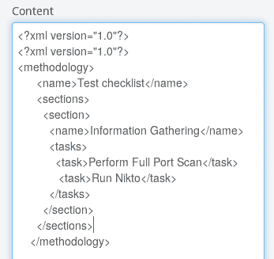

1.  在这里，我们可以看到列表是在一个 XML 文件中。我们可以通过单击“更新方法”来编辑和保存它：

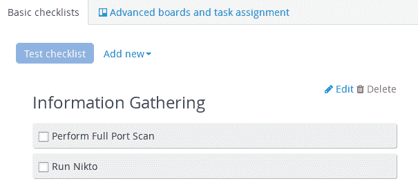

现在，让我们组织我们的报告。

# 使用 Dradis 组织报告

现在，让我们学习如何组织我们的扫描报告。**节点**允许我们为不同的子网、网络和办公地点创建单独的部分，然后将所有问题或截图放在那里。让我们快速看一下如何创建一个节点：

1.  转到左侧菜单中的节点选项，然后单击+号；一个弹出框将打开，我们在其中添加一个网络范围。这样做后，单击“添加”：

1.  要添加一个新的子节点，我们需要从左侧窗格中选择节点，然后选择“添加子节点”选项。子节点用于进一步组织网络。我们甚至可以添加注释和截图作为特定节点中可能发现的错误的证据：

最后，让我们学习如何在 Dradis 中导出报告。

# 在 Dradis 中导出报告

使用 Dradis Framework，可以导入、组合和导出不同的扫描报告为一个单一的报告，如下截图所示：

注意：有关 Dradis 的更多信息可以在官方网站[`dradisframework.com/`](https://dradisframework.com/)上找到。

到目前为止，我们已经学会了如何安装和设置 Dradis Framework。我们还看了如何在 Dradis 中导入、组织和导出报告。在下一节中，我们将看看另一个名为 Serpico 的工具。

# 使用 Serpico

**Serpico**，或者**SimplE RePort wrIting and COllaboration**工具，是一个用 Ruby 开发的工具，用于加快报告编写的过程。它是开源的，与平台无关，并且可以在 GitHub 上获得。在本节中，我们将介绍 Serpico 的基本安装和使用。

# 安装和设置

对于 64 位 Linux 系统，安装很容易 - 我们只需从工具的发布部分下载并安装文件，网址为[`github.com/SerpicoProject/Serpico/releases`](https://github.com/SerpicoProject/Serpico/releases)。

由于 Serpico 有一个 Docker 镜像，我们将在我们的用例中使用它。

首先，我们需要设置数据库和用户名和密码。要做到这一点，运行以下命令：

[PRE5]

以下截图显示了前面命令的输出：

然后，我们使用`ruby serpico.rb`运行工具：

就是这样 - 现在，我们已经准备好开始使用这个工具了，现在可以在`http://127.0.0.1:8443`上访问它。

# 开始使用 Serpico

以下截图显示了 Serpico 的登录界面：

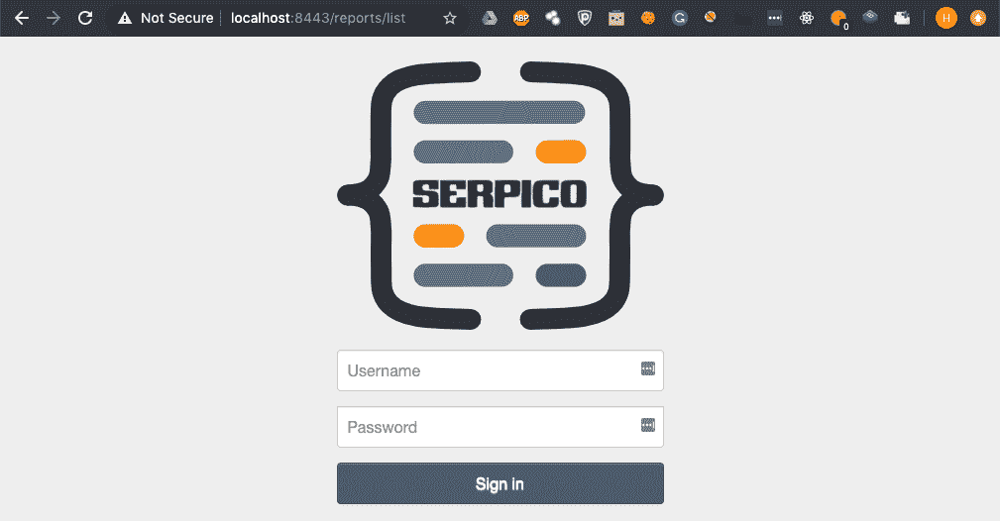

在使用用户名和密码登录后，您将看到一个类似以下的仪表板：

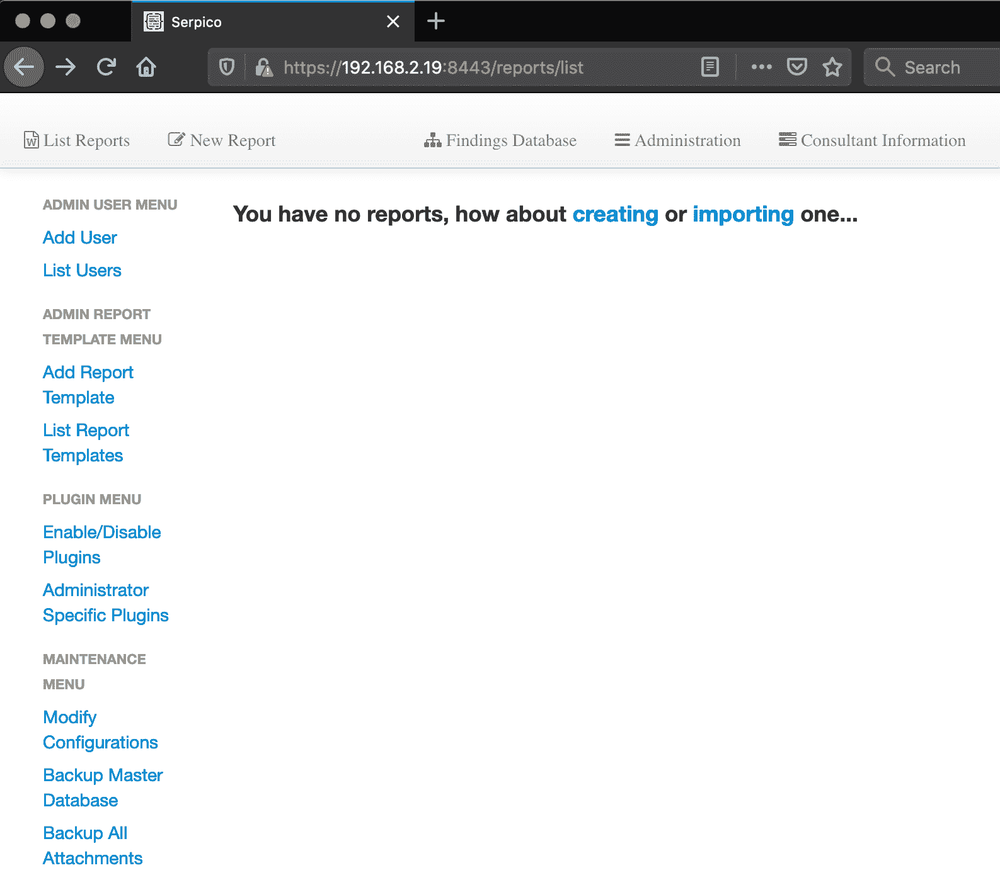

一旦我们登录，我们将看到各种可用选项，如添加用户，添加模板等，如前一个截图的左侧窗格中所示。

要创建一个新报告，请按照以下步骤进行：

1.  从顶部菜单中单击“新报告”选项。我们将被重定向到以下页面：

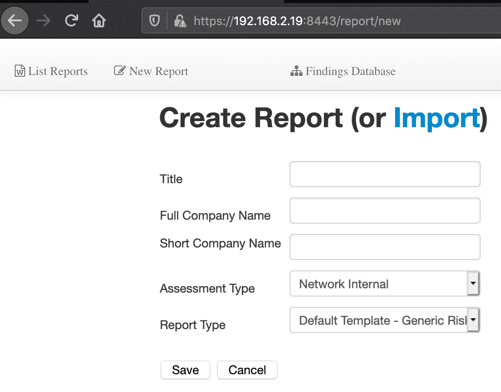

在这里，我们可以填写各种细节，比如完整的公司名称、评估类型等。

1.  单击保存按钮将带我们到下一页，在那里我们可以填写其余的细节，比如联系邮箱等等。所有这些信息都将打印在最终报告上。

1.  下一步是将我们的模板数据库发现添加到工具中。如果我们想要遵循常见的发现模板，比如 SQLi 和 XSS，我们可以选择从模板中添加发现，或者我们可以选择创建新的发现：

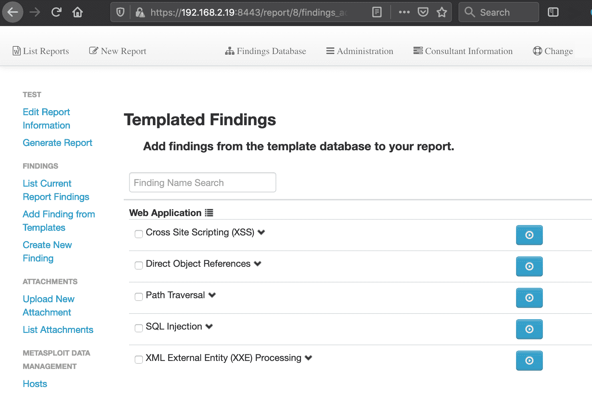

1.  单击模板将下载相应的 Word 文档。它应该看起来类似于以下内容：

1.  要为特定的漏洞添加模板，我们只需选中复选框，然后选择位于页面底部的“添加”按钮。

随着我们不断填充报告的漏洞，我们将看到我们的结构正在形成，并且图表现在更加有意义。我们甚至可以从 Metasploit 数据库直接添加附件和管理主机。

稍后，可以使用“导出报告”功能将其导出为单个报告。Serpico 还支持各种插件，可用于从不同工具（如 Burp Suite 和 Nessus）导入数据。

# 从 Metasploit 导入数据到 Serpico

让我们看看如何连接 Serpico 到 Metasploit 来导入数据。首先，我们需要编辑要连接到 Metasploit 的报告。我们将被重定向到一个新页面。从左侧菜单中选择“附加功能”。以下页面将打开：

现在，让我们启动我们的 Metasploit RPC 服务，如下面的屏幕截图所示：

完成此操作后，我们需要在浏览器中切换回 Serpico，并单击“配置 Metasploit RPC 连接”，这将带我们到以下页面：

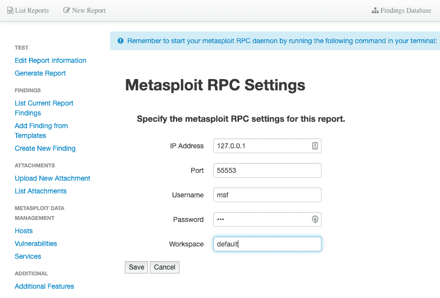

填写连接详细信息并保存这些设置将连接 Serpico 到 Metasploit。通过这样做，所有发现将被添加到报告中。

# 将第三方报告导入 Serpico

与 Dradis 类似，我们还可以从其他工具导入发现到 Serpico 的报告中。让我们快速学习如何从 Nessus 以及 Burp Suite 导入发现。

在编辑报告时，在“附加功能”页面上，我们可以选择“从 Nessus XML 自动添加发现”选项，如下面的屏幕截图所示：

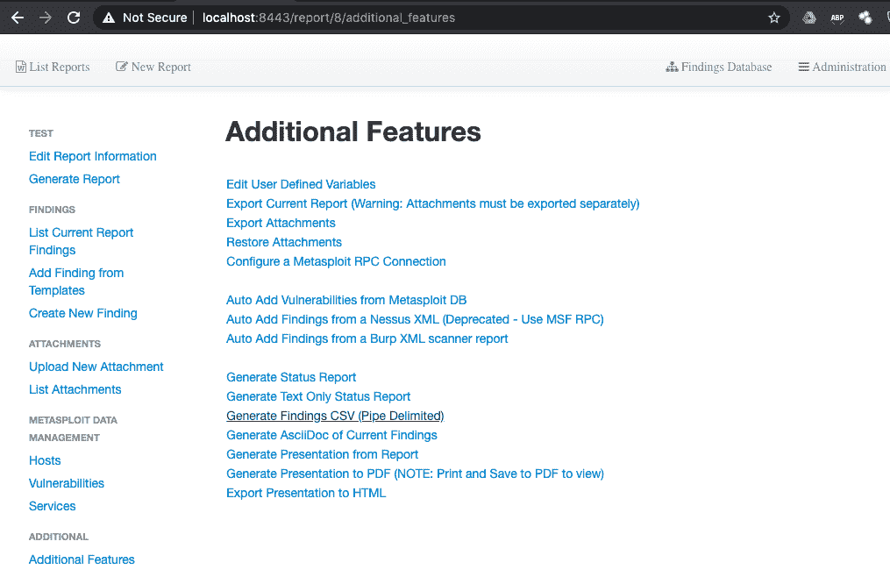

我们将被重定向到一个新页面，我们可以在该页面上传 Nessus 的 XML 文件，如下面的屏幕截图所示：

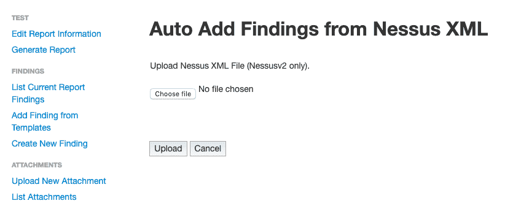

在选择“从 Burp 扫描器报告自动添加发现”选项时，我们有上传 Burp 扫描器报告的选项，如下面的屏幕截图所示：

然后，Burp Suite 报告将被解析为 Serpico 格式，并且报告中的结果将显示在 Serpico 的主面板上，如下面的屏幕截图所示：

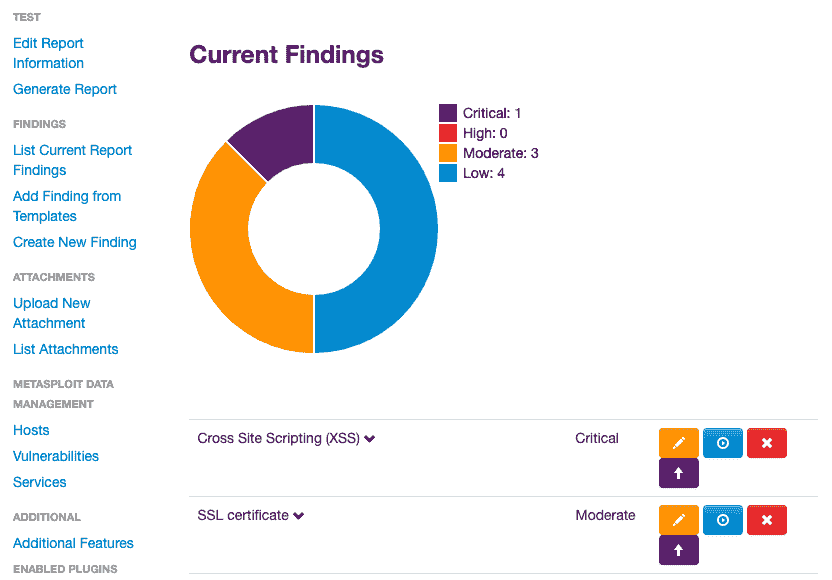

现在我们知道如何从第三方工具导入扫描报告到 Serpico，让我们学习如何管理用户。

# Serpico 中的用户管理

用户管理对于组织是必要的，特别是当渗透测试团队庞大时。Serpico 还允许我们管理用户，如下面的屏幕截图所示：

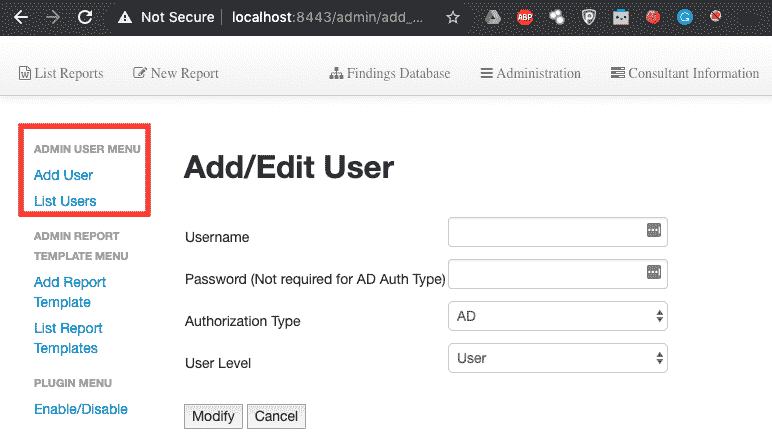

Serpico 支持两种类型的用户授权：**本地授权**和**基于 Active Directory（AD）的授权**。一旦用户被添加，可以通过单击左侧窗格中的“列出用户”链接来查看当前用户列表，如下面的屏幕截图所示：

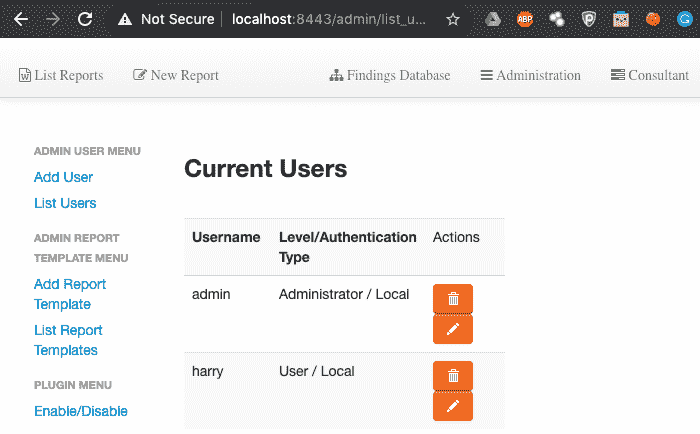

除了用户管理外，Serpico 还允许我们管理报告模板。

# 在 Serpico 中管理模板

Serpico 还允许我们使用从 Microsoft Word 衍生的元语言创建自定义报告模板。我们可以从“添加报告模板”页面定义和上传自定义报告模板，如下面的屏幕截图所示：

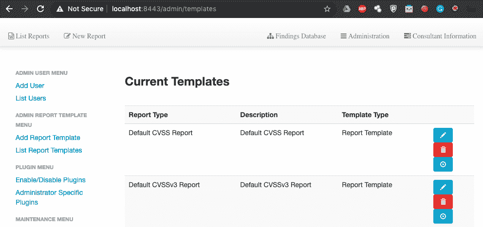

互联网上还有许多其他用户创建和共享的预构建模板。

# 以多种格式生成报告

Serpico 允许我们以不同的格式生成报告：

+   **仅文本格式**

+   **CSV 格式**

+   ASCII Doc 格式

+   演示格式（包括 PDF）

+   HTML 格式

这就是我们对 Dradis Framework 和 Serpico 的快速介绍。

有关 Serpico 的更多信息，请访问[`github.com/SerpicoProject/SerpicoPlugins/wiki/Main-Page`](https://github.com/SerpicoProject/SerpicoPlugins/wiki/Main-Page)。

# 摘要

在本章中，我们介绍了报告撰写及其两种类型。我们还使用了两个工具- Dradis 和 Serpico。现在您已经熟悉它们的框架，可以使用它们生成和组织报告。

这就是我们又一个了不起的旅程的结束。我们希望您喜欢这本书。我们始终欢迎您的反馈，因为它有助于我们改进和创造更好的内容。随时与我们联系以获取任何进一步的查询，并别忘了向您的朋友推荐这本书！

# 问题

1.  Serpico 支持的元语言是什么？

1.  渗透测试报告应包括哪些必要项目？

1.  还可以使用哪些其他工具进行自动报告撰写？

1.  Dradis 和 Serpico 是否支持 Microsoft Windows？

# 进一步阅读

以下链接提供了有关 Dradis 和 Serpico 的更多信息：

+   [`dradisframework.com/ce/`](https://dradisframework.com/ce/)

+   [`github.com/SerpicoProject/Serpico`](https://github.com/SerpicoProject/Serpico)

+   [`github.com/SerpicoProject/Serpico/wiki/Serpico-Meta-Language-In-Depth`](https://github.com/SerpicoProject/Serpico/wiki/Serpico-Meta-Language-In-Depth)

+   [`github.com/SerpicoProject/SerpicoPlugins/wiki/Main-Page`](https://github.com/SerpicoProject/SerpicoPlugins/wiki/Main-Page)
