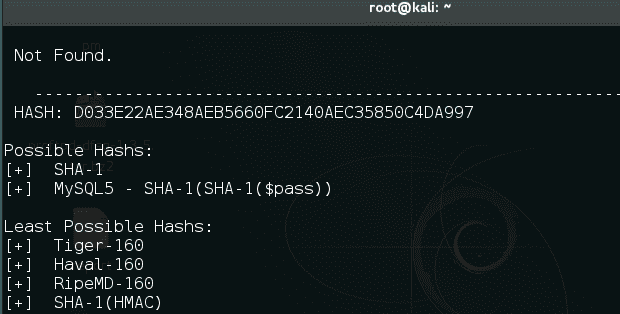
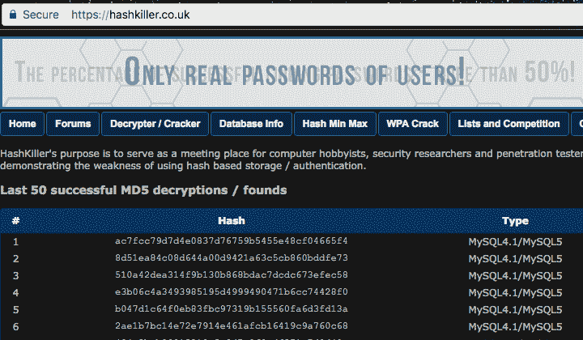
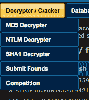
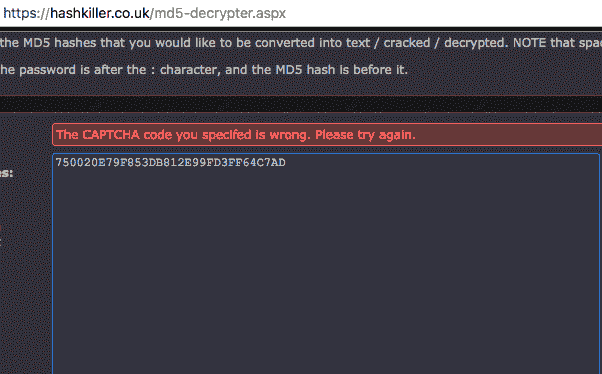
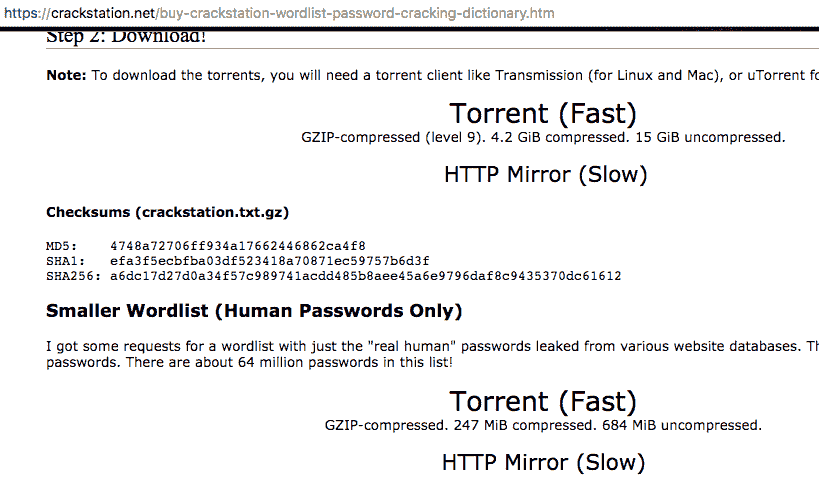
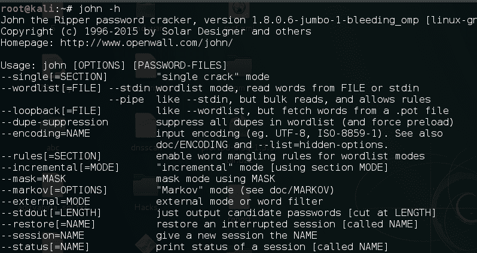
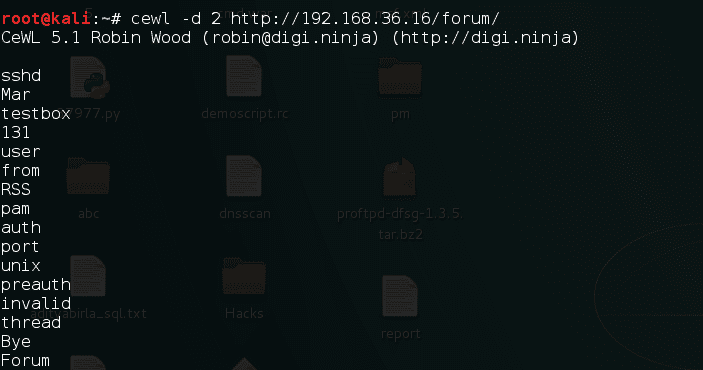
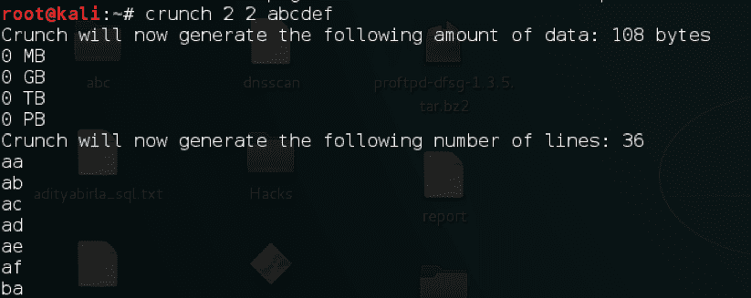
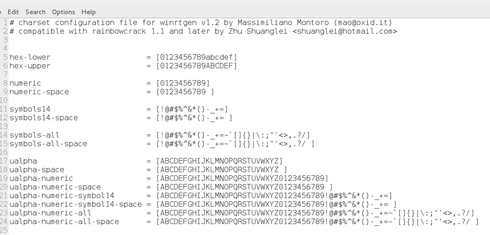
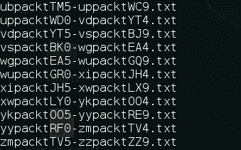

# 密码攻击-它们的星星中的错误

在本章中，我们将涵盖以下教程：

+   识别野外中的不同类型的哈希！

+   使用哈希标识符

+   使用 patator 破解

+   在线破解哈希

+   与约翰·里波特一起玩

+   约翰尼·布拉沃！

+   使用 cewl

+   使用 crunch 生成单词列表

# 介绍

弱密码是一个众所周知的情况，大多数公司都会受到影响。很多人使用可以被暴力破解的弱密码，可以获得明文。在本章中，我们将讨论在 webapp/network 上进行渗透测试活动期间获得的密码哈希的不同破解方法。

# 识别野外中的不同类型的哈希！

哈希是由单向数学算法生成的，这意味着它们无法被反转。打破的唯一方法是暴力破解它们。在这个教程中，您将学习如何识别一些不同类型的哈希。

# 如何做...

以下是哈希的类型。

# MD5

这是最常见的哈希类型。MD 代表**消息摘要**算法。可以使用以下观察来识别这些哈希：

+   它们是十六进制的

+   它们的长度为 32 个字符，128 位，例如`21232f297a57a5a743894a0e4a801fc3`

# MySQL 小于 v4.1

我们可能在从 SQL 注入中提取数据时遇到这些哈希。可以使用以下观察来识别这些哈希：

+   它们也是十六进制的

+   它们的长度为 16 个字符，64 位，例如`606727496645bcba`

# MD5（WordPress）

这在通过 WordPress 制作的网站上使用。可以使用以下观察来识别这些哈希：

+   它们以`$P$`开头

+   它们包含字母数字字符

+   它们的长度为 34 个字符，64 位，例如`$P$9QGUsR07ob2qNMbmSCRh3Moi6ehJZR`

# MySQL 5

这在 MySQL 的新版本中用于存储凭据。可以使用以下观察来识别这些哈希：

+   它们全是大写

+   它们总是以星号开头

+   它们的长度为 41 个字符，例如`*4ACFE3202A5FF5CF467898FC58AAB1D615029441`

# Base64 编码

Base64 很容易识别。转换是通过将八个八位字节编码为四个字符来完成的。检查 Base64 的最简单方法如下：

+   验证长度是否为 4 的倍数

+   验证每个字符是否在 A-Z、a-z、0-9、+、/的集合中，除了末尾的填充，它是 0、1 或 2，=字符，例如`YW55IGNhcm5hbCBwbGVhc3VyZS4=`

# 还有更多...

这是一篇文章，了解更多关于不同类型的哈希：

[`www.101hacker.com/2010/12/hashes-and-seeds-know-basics.html`](http://www.101hacker.com/2010/12/hashes-and-seeds-know-basics.html)

# 使用哈希标识符

在前面的教程中，您学会了如何识别一些常见的哈希类型。但是还有其他类型的哈希，本教程中，您将学习如何识别我们在渗透测试项目中发现的其他哈希。

# 如何做...

以下步骤演示了哈希标识符的使用：

1.  Kali 预装了一个名为哈希标识符的工具。要启动该工具，我们使用以下命令：

```
 hash-identifier
```

以下屏幕截图显示了前面命令的输出：


1.  现在我们只需要在这里粘贴我们找到的哈希，它会显示给我们类型：



# 使用 patator 破解

有时，我们可能有用户名，但我们想尝试暴力破解密码。Patator 是一个令人惊奇的工具，可以让我们暴力破解多种类型的登录，甚至 ZIP 密码。在本教程中，我们将看到如何使用 patator 执行暴力破解攻击。

# 如何做...

以下是使用 patator 的步骤：

1.  要查看所有选项，我们使用以下命令：

```
 patator -h
```

以下屏幕截图显示了前面命令的输出：


1.  让我们尝试暴力破解 FTP 登录：

```
 patator ftp_login
```

以下截图显示了前面命令的输出：


1.  现在我们可以设置`host`、`user`文件和`password`文件并运行模块：

```
 patator ftp_login host=192.168.36.16 user=ftp password=ftp
```

以下截图显示了前面命令的输出：


1.  我们可以看到已经获得了访问权限并且模块已停止。

# 在线破解哈希值

通常在渗透测试中遇到哈希值时，最好在线检查哈希值：它是否已经被破解。在这个教程中，您将了解一些提供哈希值破解服务的很酷的网站。

# 如何做...

让我们来看看识别不同类型的哈希值。

# Hashkiller

以下步骤演示了 Hashkiller 的使用：

1.  Hashkiller 是一个很棒的服务，我们可以提交我们的哈希值，如果它在过去已经被破解，它将向我们显示明文：



1.  这个过程很简单；我们只需在网站上选择解密器/破解器的选项，然后点击我们想要破解的哈希类型：



1.  在打开的页面上，我们粘贴我们的哈希值，填写验证码，然后点击提交：



1.  如果哈希值存在，它将向我们显示明文；否则，我们将看到一条消息，显示未找到任何哈希值！：


# Crackstation

Crackstation 是一个免费的服务，支持 MD2、MD5、NTLM 和 SHA1 破解。它使用自己的单词列表和查找表来有效地从数据库中执行哈希的明文搜索：

1.  我们访问网站[`crackstation.net/`](https://crackstation.net/)：


1.  我们粘贴要破解的哈希值并填写验证码：


1.  如果找到哈希值，我们将看到明文；否则，我们会看到一个消息，说哈希值未找到：


1.  Crackstation 还提供其密码列表和查找表的下载链接，如果我们想要使用它来离线使用 hashcat 等工具破解密码，[`crackstation.net/buy-crackstation-wordlist-password-cracking-dictionary.htm`](https://crackstation.net/buy-crackstation-wordlist-password-cracking-dictionary.htm)：



# OnlineHashCrack

这是一个付费服务，也是我最喜欢的之一。它支持 OSX、MD4、MD5、NTLM、WPA(2)，以及对 Word、Excel、PPT 受保护文档的暴力破解。它提供八个字符的免费密码，之后收取一小费来显示成功破解的密码：

1.  我们访问网站[`onlinehashcrack.com/`](http://onlinehashcrack.com/)：


1.  在这里，我们可以提交我们的哈希值或`.apt`文件进行破解，并填写我们想要接收通知的电子邮件地址：


1.  在我们的电子邮件中收到的唯一链接上，我们可以看到所有已破解或未在网站上找到的哈希值的状态：


# 玩弄约翰·里帕

网站和在线服务可能并不总是可用，也有可能这些网站可能没有我们找到的哈希值的明文。在这种情况下，我们可以使用不同的离线工具来破解哈希值。

假设我们现在有哈希值，并且已经确定了它的类型。在这个教程中，我们将看到如何使用约翰·里帕破解哈希值。约翰速度快，支持各种破解模式。它还具有自动检测哈希类型的能力。

# 如何做...

要了解约翰·里帕，按照给定的步骤进行：

1.  我们可以使用帮助（`-h`）命令查看完整的功能：

```
 john -h
```

以下屏幕截图显示了前面命令的输出：



1.  要破解密码，我们使用以下命令：

```
 john --format=raw-md5
        --wordlist=/usr/share/wordlists/rockyou.txt /root/demo_hash.txt
```

1.  我们将看到密码已成功破解！


# 还有更多...

有关更多信息，您可以参考以下文章：

+   [`pentestmonkey.net/cheat-sheet/john-the-ripper-hash-formats`](http://pentestmonkey.net/cheat-sheet/john-the-ripper-hash-formats)

# 约翰尼·布拉沃！

Johnny 是 John 的 GUI 客户端。由于它添加了一个 UI，因此使用起来更加容易。

# 如何做...

要了解 Johnny，请按照给定的步骤：

1.  在我们之前的教程中，您已经学会了如何使用 John。我们将使用以下命令启动 Johnny：

```
 johnny
```

以下屏幕截图显示了前面命令的输出：


1.  我们通过单击“打开密码文件”选项来加载我们的密码文件。我们的文件已加载：


1.  现在我们转到选项，并选择我们要执行的攻击类型：


1.  我们选择哈希的格式：


1.  完成后，我们点击开始攻击，当密码破解时，我们应该看到我们的密码。

# 使用 cewl

`cewl`是一个基于 Ruby 的爬虫，它爬取 URL 并搜索可用于密码攻击的单词。在这个教程中，我们将看看如何利用它。

# 如何做...

以下是使用`cewl`的步骤：

1.  要查看`cewl`的所有选项，我们使用这个命令：

```
 cewl -h
```

以下屏幕截图显示了前面命令的输出：


1.  要爬取一个网站，我们使用这个命令：

```
 cewl -d 2 http://192.168.36.16/forum/
```

以下屏幕截图显示了前面命令的输出：



1.  我们将看到一个有趣的关键字列表，可以用来制作我们自己的字典密码列表：



# 使用 crunch 生成单词列表

Crunch 是一个单词列表生成器。它使用排列和组合来生成所提供字符集的所有可能组合。

# 如何做...

要了解 Crunch，请按照给定的步骤：

1.  Crunch 已经预装在 Kali 中，我们可以使用以下命令启动它：

```
 crunch -h
```


1.  正如我们所看到的，很容易使用`abcdef`生成一个最小为两个字符，最大为两个字符的密码列表，我们可以使用以下命令：

```
 crunch 2 2 abcdef
```

我们可以看到已经生成了单词列表：


1.  要将其保存到文件中，我们可以使用`-o`开关。Crunch 还有一个内置列表，其中包含预定义的字符集。它可以在`/usr/share/crunch/charset.lst`中找到。

1.  要使用字符集，我们使用`-f`开关：

```
 crunch 2 2 -f /usr/share/crunch/charset.lst lalpha
```

以下屏幕截图显示了前面命令的输出：



1.  这将生成一个包含小写字母的最小长度和最大长度为`2`的列表。Crunch 还有一个`-t`开关，可以用来创建特定模式的单词列表：

+   `@`: 这将插入小写字符

+   `,`: 这将插入大写字符

+   `%`: 这将插入数字

+   `^`: 这将插入符号

1.  开关`-b`可以用来指定要创建的文件的大小：


1.  让我们尝试创建一个具有特定模式且大小为 1 MB 的列表：

```
 crunch 10 10 -t @@packt,,% -b 1mib -o START
```

1.  完成后，我们将看到一个包含相同文件夹中模式的文本文件列表：



1.  `-z`标志可用于创建单词列表并将其保存在压缩文件中。压缩是在进行中完成的：

```
 crunch 10 10 -t @@packt,,% -b 1mib -o START -z gzip
```

以下屏幕截图显示了前面命令的输出：


