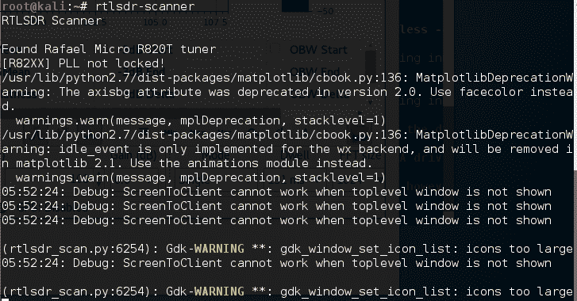
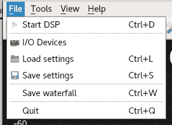
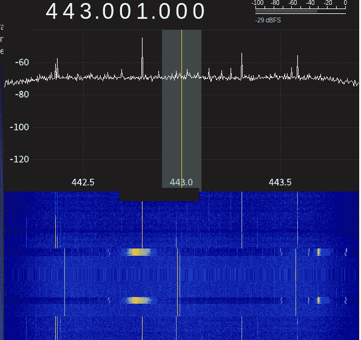
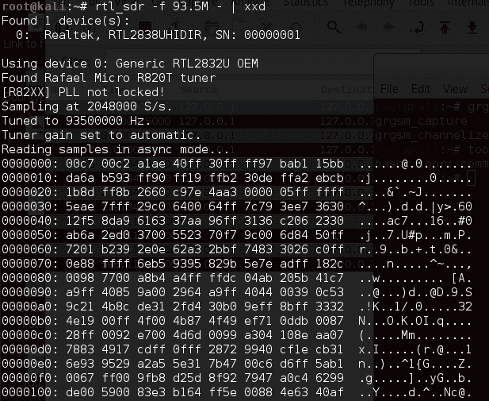
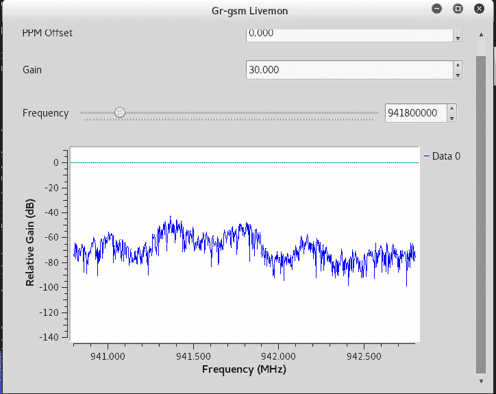
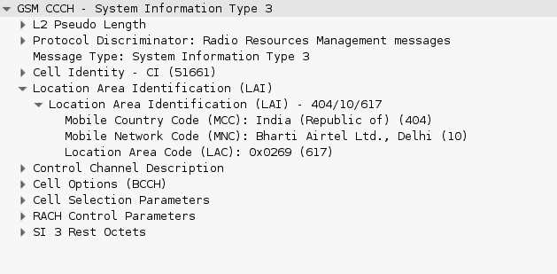
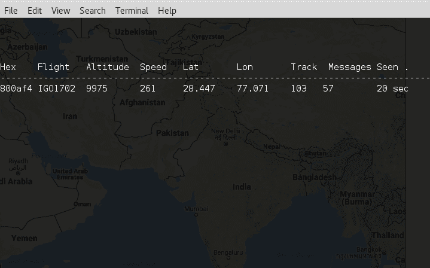

# 玩转软件定义无线电

在本章中，我们将介绍以下步骤：

+   无线电频率扫描仪简介

+   与 RTLSDR 扫描仪亲身实践

+   玩转`gqrx`

+   为 GSM 窃听校准设备

+   使用 Dump1090 解码 ADS-B 消息

# 介绍

软件定义无线电这个术语的意思是，使用软件实现基于硬件的无线电组件，如调制器、解调器和调谐器。在本章中，我们将介绍不同的步骤，并看看 RTLSDR 可以如何用于玩转频率和通过它传输的数据。

# 无线电频率扫描仪

RTLSDR 是一种非常便宜（约 20 美元）的软件定义无线电，它使用 DVB-T 电视调谐器。在这个步骤中，我们将介绍如何将 RTLSDR 设备连接到 Kali Linux 以测试是否成功检测到。

# 准备工作

对于这个步骤，我们需要一些硬件。它可以很容易地从亚马逊购买或从[`www.rtl-sdr.com/buy-rtl-sdr-dvb-t-dongles/`](https://www.rtl-sdr.com/buy-rtl-sdr-dvb-t-dongles/)购买。Kali 已经为我们提供了工具来开始使用它。

# 如何做...

我们连接我们的设备，它应该在 Kali Linux 中被检测到。设备行为不准确是很常见的。以下是运行测试的步骤：

1.  我们将首先使用以下命令运行测试：

```
        rtl_test
```

以下截图显示了前面命令的输出：


1.  我们可能会看到一些数据包丢失。这是因为在只有 USB 2.0 的 VM 设置中尝试这个。

1.  如果有很多数据包丢失，我们可以通过使用`rtl_test -s 10000000`设置较低的采样率进行测试：


1.  现在，我们已经准备好继续下一个步骤并玩弄我们的设备了。

# 与 RTLSDR 扫描仪亲身实践

RTLSDR 扫描仪是一个跨平台的 GUI，可用于频谱分析。它将扫描给定的频率范围，并在频谱图中显示输出。

# 如何做...

这是运行`rtlsdr-scanner`的步骤：

1.  我们将 RTLSDR 连接到系统，并使用以下命令启动扫描：

```
       rtlsdr-scanner
```

以下截图显示了前面命令的输出：



1.  我们应该看到一个新窗口打开，显示工具的 GUI 界面；在这里我们可以简单地输入我们想要执行扫描的频率范围，然后点击开始扫描：


1.  需要一些时间来看到频率的扫描，然后我们将以图形格式看到结果：


如果应用程序停止响应，建议您降低范围，并选择单一模式而不是连续模式。

# 玩转 gqrx

`gqrx`工具是由 GNU 无线电和 Qt 图形工具包提供支持的开源**软件定义无线电**（**SDR**）接收机。

它具有许多功能，例如：

+   发现连接到计算机的设备

+   处理 I/Q 数据

+   AM、SSB、CW、FM-N 和 FM-W（单声道和立体声）解调器

+   录制和播放音频到/从 WAV 文件

+   录制和播放原始基带数据

+   通过 UDP 流式传输音频输出

在这个步骤中，我们将介绍`gqrx`和另一个工具 RTLSDR 的基础知识。

# 如何做...

以下是使用`gqrx`的步骤：

1.  我们可以使用以下命令安装`gqrx`：

```
        apt install gqrx  
```

1.  完成后，我们通过输入`gqrx`来运行工具。

1.  我们从打开的窗口的下拉菜单中选择我们的设备，然后点击确定：


1.  现在 GQRX 应用程序打开，在接收器窗口的右侧，我们选择要查看的频率。然后我们去文件，点击开始 DSP：



1.  现在我们看到一个瀑布，我们应该开始听到扬声器中的声音。我们甚至可以使用接收器选项窗口中的上下按钮更改我们正在收听的频率：


1.  我们将看一个汽车钥匙遥控器的例子，用于锁定/解锁汽车。

1.  当我们按下按钮几次后，我们将看到瀑布图中的变化，显示信号的差异：



1.  我们可以在记录窗口中记录信号，然后保存。稍后可以解码并使用无线电发射回汽车，使用无线电发射器将其解锁。

1.  要在`443` MHz 处捕获数据，我们可以使用以下命令：

```
        rtl_sdr -f 443M - | xxd
```

以下截图显示了前面命令的输出：



# 还有更多...

要了解更多关于`gqrx`的信息，请访问这些博客：

+   [`gqrx.dk/doc/practical-tricks-and-tips`](http://gqrx.dk/doc/practical-tricks-and-tips)

+   [`blog.compass-security.com/2016/09/software-defied-radio-sdr-and-decoding-on-off-keying-ook/`](https://blog.compass-security.com/2016/09/software-defied-radio-sdr-and-decoding-on-off-keying-ook/)

# GSM 窃听的校准设备

RTLSDR 还允许我们使用名为`kal`或`kalibrate-rtl`的工具查看 GSM 流量。该工具可以在频段中扫描 GSM 基站。在本教程中，我们将学习如何使用 kalibrate，然后在`gqrx`中确认信道。

# 如何做...

以下是使用 kalibrate 的步骤：

1.  大多数国家使用 GSM900 频段。在美国，是 850。我们将使用以下命令来扫描 GSM 基站：

```
        kal -s GSM900 -g 40  
```

以下截图显示了前面命令的输出：


1.  几分钟后，它会显示给我们一个基站列表：


1.  我们记录频率；在我们的情况下，我们将使用`947.6 MHz`以及偏移量。

1.  现在我们打开 GQRX 并在接收器选项窗口中输入：


1.  我们可以在瀑布图中看到设备能够完美地捕捉信号。

1.  现在我们将在数据包级别查看这些数据。我们将使用一个名为`gr-gsm`的工具。

1.  可以使用 apt install `gr-gsm`进行安装：


1.  完成后，如果我们输入`grgsm_`并按下*Tab*键，我们将看到一个可用工具列表：


1.  首先，我们将使用`grgsm_livemon`实时监视 GSM 数据包。我们将打开终端并输入`grgsm_livemon`：



1.  在新打开的窗口中，我们将使用 kalibrate 捕获的频率切换到：


1.  我们可以通过拖动并选择图形窗口上的区域来放大特定范围。

1.  在新的终端窗口中，我们输入`wireshark`来启动 Wireshark。

1.  然后我们将适配器设置为 Loopback: lo 并开始我们的数据包捕获：


1.  接下来，我们添加过滤器`gsmtap`：


1.  我们应该在信息窗口中看到数据包。我们应该看到一个带有标签系统信息类型 3 的数据包；让我们打开它：


1.  我们将看到系统信息，如移动国家代码、网络代码和位置区域代码：



1.  现在通过这个教程，我们已经学会了 GSM 数据包的传输方式。

# 还有更多...

以下是一些很棒的视频，让您更好地了解 GSM 嗅探：

+   [`www.crazydanishhacker.com/category/gsm-sniffing-hacking/`](https://www.crazydanishhacker.com/category/gsm-sniffing-hacking/)

# 使用 Dump1090 解码 ADS-B 消息

ADS-B 代表**自动相关监视广播**。这是一种系统，飞机上的电子设备通过数字数据链自动广播飞机的精确位置。

如工具的官方自述中所述，Dump1090 是专为 RTLSDR 设备设计的 Mode S 解码器。

主要特点是：

+   对弱信号的稳健解码。使用 mode1090，许多用户观察到与其他流行解码器相比改进的范围。

+   网络支持—TCP30003 流（MSG5）、原始数据包、HTTP。

+   嵌入式 HTTP 服务器在 Google 地图上显示当前检测到的飞机。

+   使用 24 位 CRC 进行单比特错误校正。

+   能够解码 DF11 和 DF17 消息。

+   能够解码 DF 格式，如 DF0、DF4、DF5、DF16、DF20 和 DF21，其中通过使用 ICAO 地址对校验和字段进行暴力破解，将校验和与 ICAO 地址进行异或运算，我们已经涵盖了。

+   解码来自文件的原始 IQ 样本（使用`--ifile`命令行开关）。

+   交互式 CLI 模式，其中当前检测到的飞机显示为列表，并随着更多数据的到达而刷新。

+   从速度计算 CPR 坐标解码和轨迹计算。

+   TCP 服务器流式传输并接收来自/发送到连接客户端的原始数据（使用`--net`）。

在这个教程中，我们将使用该工具来查看空中交通的可视化。

# 如何做...

以下是使用 Dump1090 的步骤：

1.  我们可以使用命令`git clone https://github.com/antirez/dump1090.git`从 Git 存储库下载该工具：


1.  下载完成后，我们进入文件夹并运行`make`。

1.  现在我们应该有一个可执行文件。我们可以使用以下命令运行该工具：

```
        ./dump1090 --interactive -net
```

以下屏幕截图显示了前面命令的输出：



1.  几分钟后，我们应该能看到航班，并通过在浏览器中打开`http://localhost:8080`，我们也将能够在地图上看到航班。

# 还有更多...

更多信息可以从[`www.rtl-sdr.com/adsb-aircraft-radar-with-rtl-sdr/`](https://www.rtl-sdr.com/adsb-aircraft-radar-with-rtl-sdr/)了解。
