# 第一章。 入门-设置环境

在本章中，我们将介绍与首次使用 Kali Linux 设置相关的基本任务。 配方包括：

+   在云上安装 Kali Linux-Amazon AWS

+   在 Docker 上安装 Kali Linux

+   在 OnePlus One 上安装 NetHunter

+   在虚拟机上安装 Kali Linux

+   定制 Kali Linux 以实现更快的软件包更新

+   定制 Kali Linux 以实现更快的操作

+   配置远程连接服务-HTTP，TFTP 和 SSH

+   配置 Nessus 和 Metasploit

+   配置第三方工具

+   在 Kali Linux 上安装 Docker

# 介绍

Kali Linux 是最受欢迎的 Linux 渗透测试发行版 Backtrack 的全面改版。 Kali Linux 2.0 于 2015 年 8 月 11 日推出，是 Kali Linux 的改进版本，具有全新的内核 4.0，并基于 Debian 的 Jessie 版本，具有改进的硬件和无线驱动程序覆盖范围，支持各种桌面环境（GNOME，KDE，XFCE，MATE，e17，LXDE 和 i3wm）和工具等等。

如果您要从 Kali Linux 升级到 Kali Linux 2.0，那么有一个好消息。 好消息是现在我们有了一个滚动的发行版。 例如，Kali Linux 核心不断更新。

Kali Linux 具有您进行渗透测试和安全评估所需的一切，而无需考虑下载，安装和为您的工具库中的每个工具设置环境。 Kali Linux 2.0 包括 300 多种安全工具。 您现在可以在一个地方安装，配置和准备使用全球专业人士最喜欢的安全工具。

所有安全工具都已经被逻辑地分类并映射到执行一系列步骤的测试人员，例如，侦察，扫描，利用，权限提升，保持访问权限和覆盖轨迹。

安全工具通常很昂贵，但 Kali Linux 是免费的。 使用 Kali 的最大优势是它包含各种商业安全产品的开源或社区版本。

Kali Linux 2.0 现在支持比以往更多的硬件设备。 由于基于 ARM 的系统变得更便宜和更易获得，现在可以使用 ARMEL 和 ARMHF 支持在这些设备上运行 Kali Linux。 目前，Kali Linux 可用于以下 ARM 设备：

+   树莓派（树莓派 2，树莓派 A/B+和树莓派 A/B+ TFT）

+   CompuLab-Utilite 和 Trim-Slice

+   BeagleBone Black

+   ODROID U2/X2

+   Chromebook-HP，Acer 和 Samsung

+   Cubieboard 2

+   CuBox（CuBox 和 CuBox-i）

+   Nexus 5（Kali Nethunter）

+   Odroid（U2，XU 和 XU3）

+   USBArmory

+   RioTboard

+   FriendlyARM

+   BananaPi

# 在云上安装 Kali Linux-Amazon AWS

将 Kali Linux 列入 Amazon EC2 Marketplace 已经将近 2 年了。 这对于渗透测试人员来说是一个非常好的消息，因为他们可以在 Amazon AWS 基础架构中设置自己的 Kali Linux 并用于渗透测试，而且甚至符合免费套餐的条件，只要您在指定的限制范围内使用它，这是相当公平的。

本配方中提供的步骤将帮助您在 Amazon AWS EC2 控制台上安全地设置运行 Kali Linux 的实例，仅需几分钟。

## 准备好

对于这个配方，您需要：

+   一个 Amazon AWS 帐户

+   至少 2GB RAM，如果要运行 Metasploit

## 如何做...

按照本配方执行以下步骤：

1.  创建了 Amazon AWS 帐户后，登录到[`aws.amazon.com`](https://aws.amazon.com)，并转到**Amazon Web Services**仪表板，如下面的屏幕截图所示。 转到**EC2** | **Launch Instance**：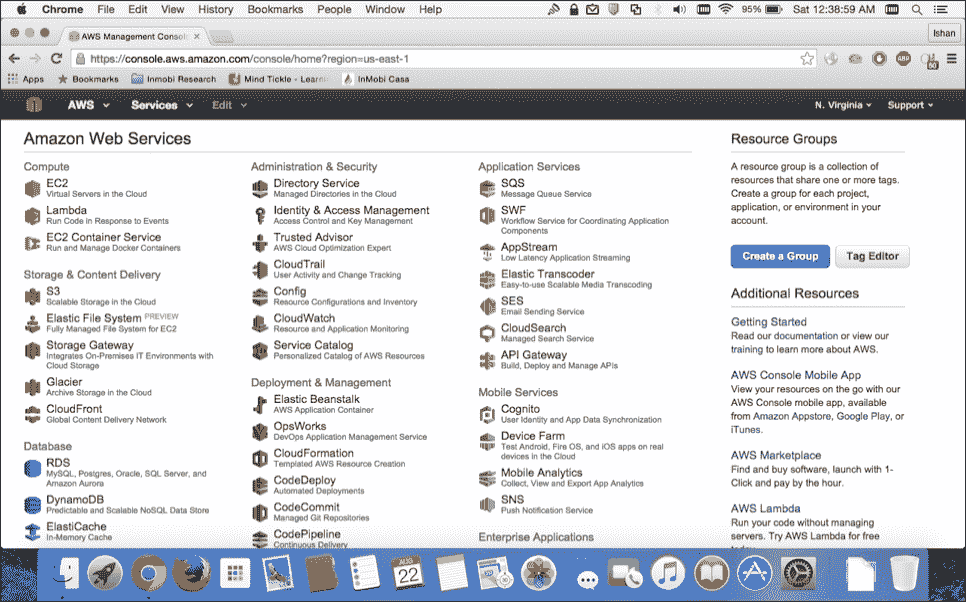

1.  您需要选择**Amazon Machine Image (AMI)**，如下面的屏幕截图所示：

1.  单击**AWS Marketplace**选项，并在**AWS Marketplace**上搜索 Kali Linux，如下面的屏幕截图所示：

1.  单击**Select**，然后单击**Continue**，如下面的屏幕截图所示：

1.  现在您已经在第 2 步显示的屏幕上。在这里，您可以选择实例类型；请注意，只有**t1.micro**和**t2.micro**才符合免费套餐的条件。但是，运行 Metasploit 需要至少 2GB 的 RAM。为此，您可以根据预算选择**t2.small**或**t2.medium**，如下面的屏幕截图所示：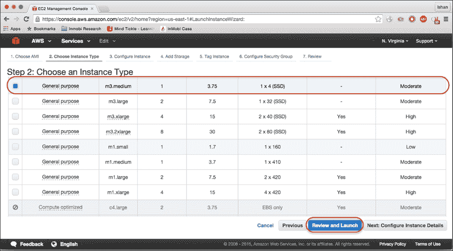

1.  单击**Review and Launch**。您将看到一个弹出窗口，询问您是否要将 SSD 用作启动卷。选择**Make general purpose (SSH)...(recommended)**，然后单击**Next**，如下面的屏幕截图所示：

1.  您将直接进入第 7 步进行审查，如下面的屏幕截图所示：

1.  首先会看到一个警告，提示您改善实例安全性；单击**6.配置安全组**，如下面的屏幕截图所示：

1.  单击**Source**下拉列表，选择**My IP**，它将自动检测您的公共 IP 范围。单击**Review and Launch**。请注意，这仅在您拥有专用公共 IP 时才有效。如果您有动态 IP，您需要重新登录到 AWS 控制台，并允许您的更新 IP 地址：

1.  正如您所看到的，有一个警告说您不符合免费使用套餐的条件，因为我们选择了**m2.medium**，需要至少 2GB 的 RAM：

1.  单击**Launch**；在这里，您需要在继续之前创建并下载一个新的密钥对，如下面的屏幕截图所示：

1.  下载了密钥对后，继续单击**Launch Instances**，如下面的屏幕截图所示：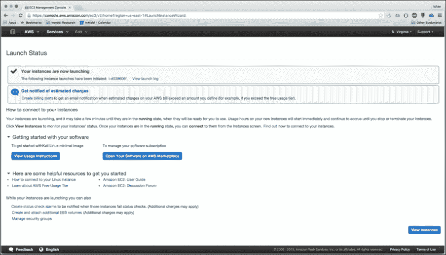

## 操作步骤...

EC2 中的 EC 代表弹性计算，简而言之就是在云中启动虚拟服务器。亚马逊 AWS 已经有了所有流行的操作系统镜像，并且您只需要选择您的需求，然后选择硬件需求。根据您选择的操作系统和硬件配置，AWS 将配置该硬件并安装该操作系统。您可以选择您想要的存储类型，传统或 SSD，然后根据您的需求附加/分离硬盘。最重要的是，您只需支付您想要使用的时间，当您停止 EC2 机器时，AWS 将释放这些资源并将它们添加回其库存，这就是 AWS 的灵活性。现在，是时候快速回顾一下我们在这个配方中所做的事情了。作为先决条件，您需要首先创建一个亚马逊 AWS 帐户，这非常容易创建。然后，步骤 1 向您展示如何选择 EC2。步骤 2 和 3 展示了如何搜索和选择 Kali Linux 的最小镜像。在第 4 步中，您可以阅读 Kali Linux AMI 提供的所有内容，基本要求和用户登录信息。第 5 步向您展示如何根据您的需求和预算选择实例类型。在第 6 到 7 步中，您将通过简单的向导选择默认推荐的 SSD 进行引导。第 8 步向您展示了最终页面，其中包含您应该注意或了解的警告和要点。在第 9 步中，您选择在 SSH 协议端口`22`上设置安全组，只允许您从属于您的特定 IP 范围访问。在第 10 步中，您将看到审查页面，根据您的实例类型选择，它会告诉您是否有资格获得免费套餐。在第 11 步中，您创建一个新的 SSH 密钥对并将其下载到本地计算机。在第 12 步中，您最终点击启动实例。

## 还有更多...

在亚马逊 AWS 基础设施中安装了 Kali Linux，并具有公共 IP 地址，只需点击几下，就可以在外部渗透测试期间非常有帮助。正如您所知，我们已经选择并安装了 Kali Linux 的最小镜像，用于在 AWS 基础设施中使用，因此我们的安装默认没有安装任何工具。

在我们的下一个配方中，我们将介绍如何使用 SSH 并在亚马逊 AWS 盒子上设置 Kali Linux 以供使用。在这个配方中，我们还将解决您在更新存储库和安装 Kali Linux 工具以及设置 GUI 和安装我们将需要使用的所有必需工具时可能遇到的一些问题。

# 在 Docker 上安装 Kali Linux

我认为在这里对 Docker 进行一点介绍是合理的。Docker 是一种新的开源容器技术，于 2013 年 3 月发布，它自动化了在自包含软件容器内部部署应用程序。Docker（建立在 Linux 容器之上）提供了一种更简单的方式来管理单台机器上的多个容器。将其视为虚拟机，但它更轻量级和高效。

这样做的美妙之处在于您几乎可以在任何可以运行 Docker 的系统上安装 Kali Linux。比如，例如，您想在 Digital Ocean droplet 上运行 Kali，但它不允许您直接像 Ubuntu 那样快速启动 Kali Linux。但现在，您可以在数字海洋上简单地快速启动 Ubuntu 或 Centos，并在其上安装 Docker，然后拉取 Kali Linux Docker 镜像，您就可以开始了。

由于 Docker 提供了另一层抽象，从安全的角度来看也是有益的。比如，如果您运行的是托管应用程序的 apache 服务器，您可以简单地为其创建一个 Docker 容器并运行它。即使您的应用程序受到攻击，攻击者也只能被限制在 Docker 镜像中，无法伤害您的主机操作系统。

说了这么多，现在在您的机器上安装 Docker，为了演示的目的，我们将在 Mac 操作系统上安装 Docker。

## 准备就绪

对于这个操作，你需要以下东西：

+   连接到互联网

+   已安装的 Virtualbox

## 如何操作...

按照以下步骤进行此操作：

1.  要在 Mac 操作系统上安装 Docker，你需要从[`www.docker.com/docker-toolbox`](https://www.docker.com/docker-toolbox)下载并安装 Docker 工具箱。在你的 Mac 上运行此安装程序后，你将设置 Docker 环境；工具箱将安装 Docker 客户端、Machine、Compose（仅限 Mac）、Kitematic 和 VirtualBox。

1.  安装完成后，转到**应用程序** | **Docker** | **Docker 快速启动终端.app**，或者直接打开启动台并点击 Docker 快速启动。当你双击该应用程序时，你将看到终端窗口，如下面的屏幕截图所示：

1.  要检查你的安装是否成功，你可以运行以下命令：

```
     docker run hello-world

    ```

如果你的安装成功，你将看到以下输出：


1.  现在，让我们去 Docker hub（[`hub.docker.com`](https://hub.docker.com)）搜索`Kali Linux`镜像，如下面的屏幕截图所示：

1.  正如你所看到的，官方的 Kali 镜像是可用的；我们将使用以下命令在我们的 Docker 中拉取并运行它：

```
     docker pull kalilinux/kali-linux-docker
     docker run -t -i kalilinux/kali-linux-docker

    ```

1.  现在，你在 Docker 中运行了 Kali Linux 的最小基础版本；这个镜像中没有添加任何工具，你可以根据需要安装它们，或者你可以参考[`www.kali.org/news/kali-linux-metapackages/`](https://www.kali.org/news/kali-linux-metapackages/)。

1.  假设你只想运行 Metasploit；为此，你可以在 hub 上搜索`kali Metasploit`镜像，并安装到目前为止拉取次数最多的镜像，如下面的屏幕截图所示：

1.  使用以下命令拉取镜像；但在这之前，请注意这不是官方镜像。因此，你可以自行决定是否信任这个镜像：

```
     docker pull linuxkonsult/kali-metasploit

    ```

1.  然后，使用`docker run`命令运行 Docker 镜像，如下所示：

```
    docker run -t -i linuxkonsult/kali-metasploit

    ```

输出将如下所示：

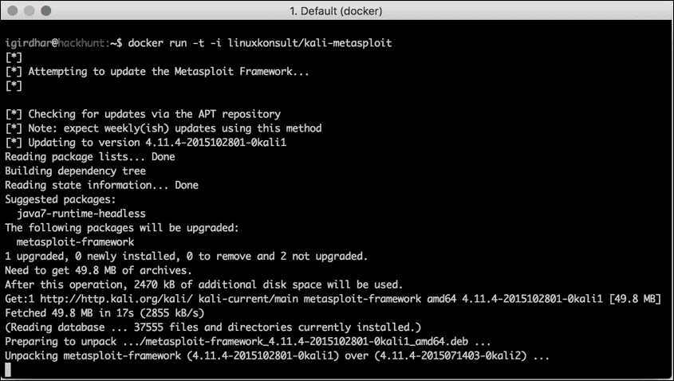

框架准备好后，解压并执行，应该如下所示：


正如你所看到的，你已经更新并运行了 Metasploit。但这还不是全部；你所做的所有更改都不是永久的，直到你提交这些更改。一旦你提交了更改，下次可以从你离开的地方继续。要提交更改，打开另一个控制台窗口并输入以下命令：

```
          docker ps

    ```

1.  运行此命令后，你将看到以下输出，如下面的屏幕截图所示：

1.  要提交更改，你需要按照以下格式输入命令：

```
          docker commit <docker-id> <docker-name>
    docker commit bd590456f320 admiring_pike

    ```

成功提交后，你将看到以下输出：

```
    b4a7745de59f9e106029c49a508c2f55b36be0e9487dbd32f6b5c58b24fcb57

    ```

## 工作原理...

在这个操作中，我们需要先安装 Virtualbox 作为先决条件，然后下载并安装 Docker 工具箱。一旦 Docker 工具箱安装完成，只需打开**Docker 快速启动终端.app**并拉取你想要运行的镜像，你可以从[`hub.docker.com`](https://hub.docker.com)搜索所需的镜像，并使用`docker run`命令来运行它。完成操作后，只需使用`docker commit`命令提交更改。

在这里，我们使用了`-i`和`-t`开关。对于交互式进程（如 shell），你必须同时使用`-i` `-t`来为容器进程分配**电传打字机**（**TTY**）。`-i` `-t`开关通常写作`-it`。

## 还有更多...

您可以在[`www.docker.com`](https://www.docker.com)了解有关 Docker 的更多信息。要搜索公共映像，您可以访问[`hub.docker.com`](https://hub.docker.com)。要安装 Kali Linux 元软件包，您可以访问[`www.kali.org/news/kali-linux-metapackages/`](https://www.kali.org/news/kali-linux-metapackages/)。

# 在 OnePlus One 上安装 NetHunter

Kali Linux NetHunter 是 Nexus 和 One Plus 设备的第一个开源网络渗透测试平台。在本章中，我们将看到如何在 One Plus One 上安装 Kali Linux NetHunter。

在开始之前，请确保在进行以下任何操作之前备份设备数据。

## 准备工作

为了开始，您将需要以下内容：

+   一部 OnePlus One 设备，64GB

+   一根 USB 电缆

+   任何 Windows 操作系统

+   NetHunter Windows 安装程序

+   活动的互联网连接

## 如何做...

执行以下步骤进行此操作：

1.  在[`www.nethunter.com/download/`](http://www.nethunter.com/download/)下载 Kali NetHunter Windows 安装程序，您将看到以下页面：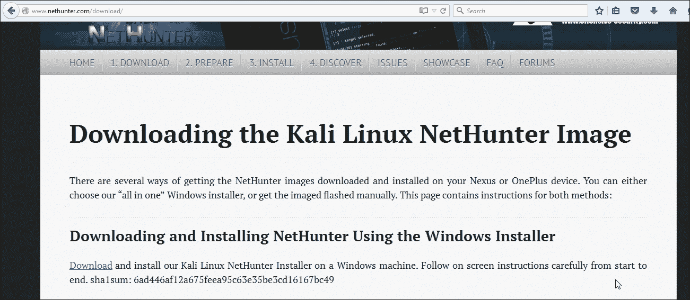

1.  安装下载的设置，如下截图所示：

1.  安装完成后，在桌面上创建的快捷方式上运行：

1.  应用程序加载后，请确保检查是否有更新。如果没有，请单击**下一步**按钮：

1.  现在我们将选择设备进行 root。我们的教程坚持选择 OnePlus，因此让我们选择**ONEPLUSONE-BACON (A0001) - 64GB**选项，然后单击**下一步**：

1.  现在我们将提示安装驱动程序，这些是用于笔记本电脑/PC 通过 USB 连接与移动设备通信的驱动程序。单击**安装**驱动程序...**开始安装过程。安装完成后，单击**测试驱动程序...**以确保驱动程序正常工作，如下截图所示：

1.  一旦驱动程序正确安装，点击**下一步**，现在我们将进入安装程序配置。在这里，建议继续进行**安装官方 Kali Linux NetHunter**。如果您有自定义的 NetHunter，请选择第二个选项，但要注意兼容性问题：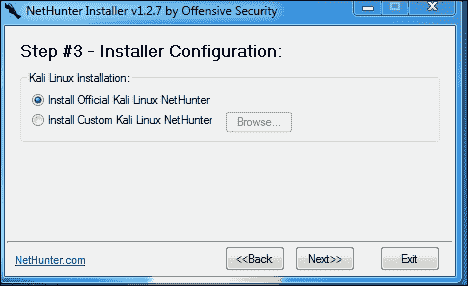

1.  点击**下一步**，我们将进入**下载文件**选项，应用程序将确定可用的软件包和缺少的文件可以通过**下载+更新所有文件依赖项**选项获取。如果卡住或任何文件无法下载，您可以简单地谷歌文件名并下载它并将其放入应用程序安装的文件夹中：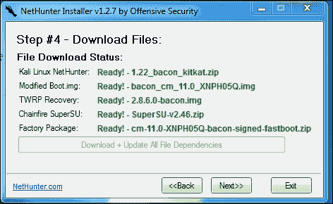

1.  一旦所有依赖项都可用，请确保执行以下操作：

1.  完成后，我们可以继续解锁启动加载程序。单击**解锁设备启动加载程序**。在从这一点开始之前，请务必备份设备的所有重要数据：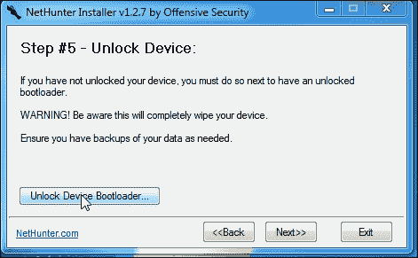

1.  手机将进入**Fastboot**模式并进行解锁。完成后，继续下一步，刷入原始 ROM。这是一个新的 ROM，将安装在您的设备上，以保持与 Kali Linux NetHunter 的兼容性。如下截图所示，单击**刷入原始...**：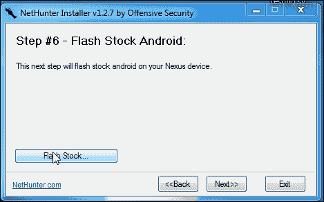

1.  完成刷入原始后，继续下一步，单击**刷入 Kali Linux + Root!**，如下截图所示：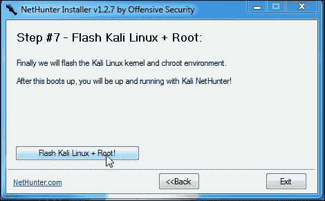

上述步骤将在您的设备中获取 Kali Linux NetHunter。一旦成功，设备将进入 TWRP 恢复模式。

1.  在恢复模式中，点击**重新启动**，它会要求安装超级用户，滑动一次安装完成后，Kali Linux 将启动。现在，点击**SuperSU**，看看它是否工作：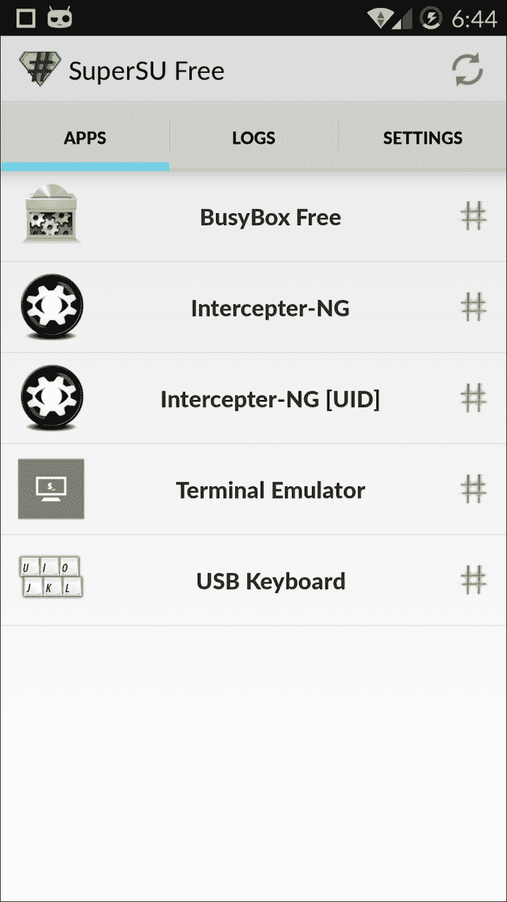

1.  下载 Stephen（Stericson）的**BusyBox**并安装，如下面的屏幕截图所示：

1.  点击名为**NetHunter**的图标，如下面的屏幕截图所示：

1.  一旦应用程序运行，您将被要求授予 root 权限。点击**授予**，然后转到 Kali 启动器，然后转到终端，如下面的屏幕截图所示：

1.  选择 Kali 终端并启动**Metasploit**，如下面的屏幕截图所示：

1.  在设备上启动**msfconsole**：

## 它是如何工作的...

在这个教程中，我们展示了如何安装 Kali Linux，也称为 NetHunter。NetHunter 是 ARM，已被移植到非英特尔处理器上运行，构建在您信任的 Kali Linux 和工具集上。Kali Linux NetHunter 项目是一个面向 ARM 设备的开源 Android 渗透测试平台，由 Kali 社区成员**BinkyBear**和 Offensive Security 共同努力创建。

## 还有更多...

我们在设备上安装了 Kali NetHunter，现在我们可以从 OnePlus One 进行渗透测试，这在红队演习、社会工程或在进行物理安全评估时非常有效。

有关更多信息，请访问[`www.nethunter.com`](http://www.nethunter.com)。

# 在虚拟机上安装 Kali Linux

在硬盘上安装 Kali Linux 是第一步。在物理硬盘或虚拟硬盘上安装 Kali Linux 的过程是完全相似的。因此，可以放心地使用相同的步骤在物理机上安装 Kali Linux。毋庸置疑，只有使用这种方法才能将 Kali Linux 2.0 安装在您的硬盘上作为主要操作系统。

## 准备就绪

在安装 Kali Linux 之前，您将需要 Kali Linux 最新的 ISO 映像，可以从[`www.kali.org/downloads/`](https://www.kali.org/downloads/)下载。

## 如何操作...

执行以下步骤进行此教程：

1.  在您的 macOS 上打开 VMware，按*command* + *N*，一旦完成，我们将看到如下的屏幕截图：

1.  选择**从光盘或映像安装**，然后点击**继续**：

1.  拖放刚刚下载的 Kali Linux 2.0 ISO，如下面的屏幕截图所示：

1.  选择**Debian 5 64 位**，然后点击**继续**，如下面的屏幕截图所示：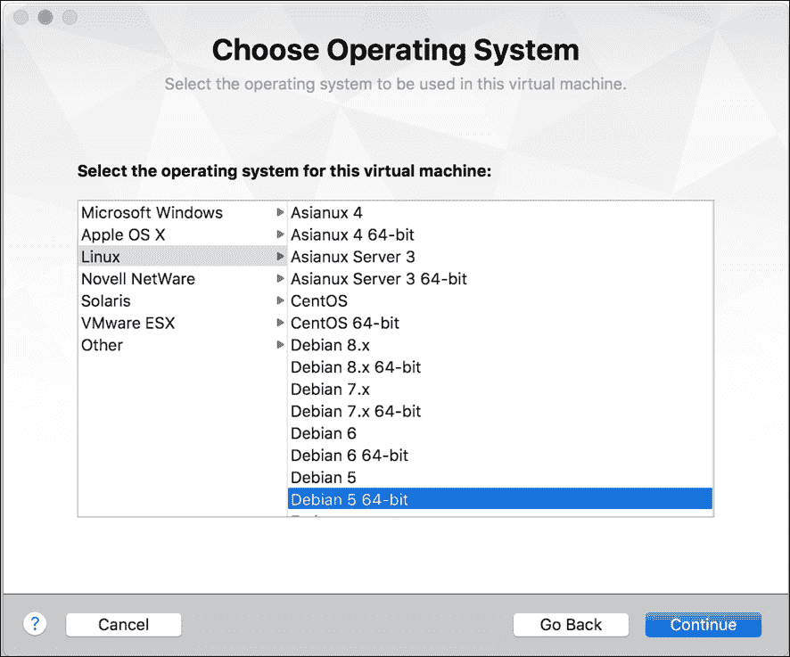

1.  点击**自定义设置**，选择要保存虚拟机的位置：

1.  保存后，VMware 打开**Debian 设置**。打开**处理器和内存**，将 RAM 大小增加到 4GB（或根据笔记本电脑上可用的内存）。请记住，作为先决条件，Metasploit 需要最少 2GB 的 RAM 来运行：

1.  关闭窗口，点击**启动**，然后点击窗口内部。光标控制将转到**Guest VM**。向下滚动并选择**图形安装**，如下面的屏幕截图所示：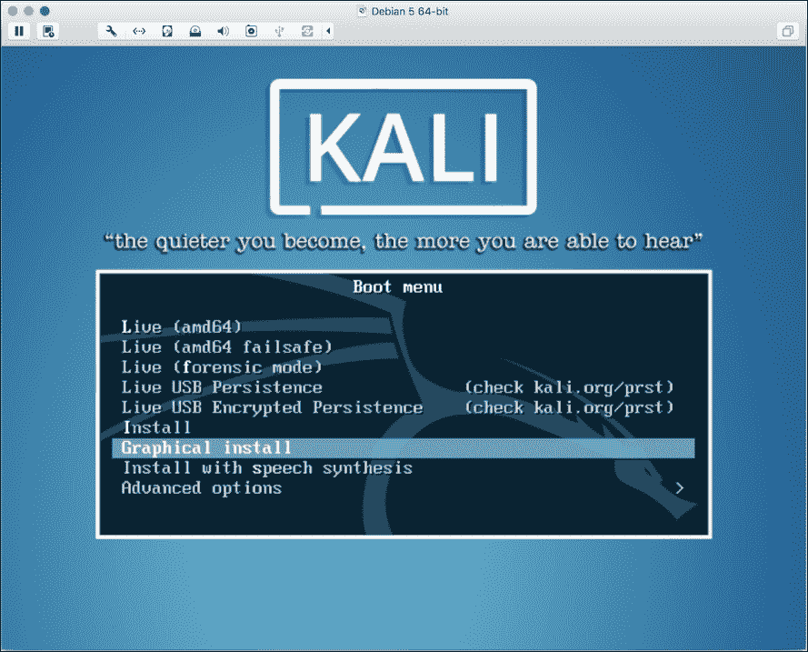

1.  选择您喜欢的语言，然后点击**继续**（我们选择了**英语**）：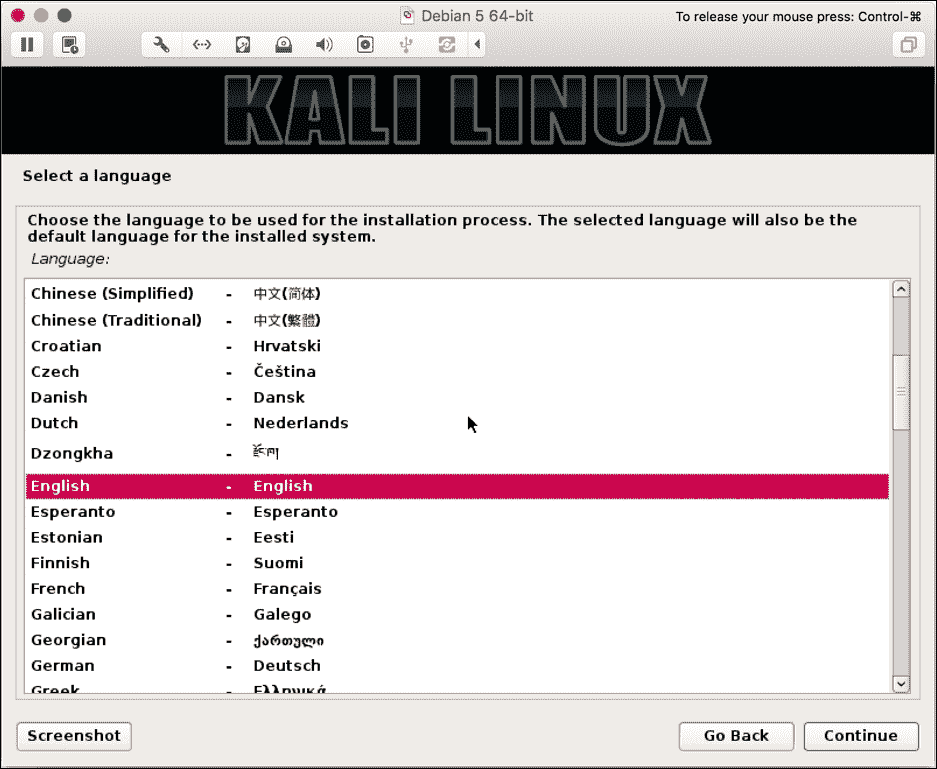

1.  选择您的国家（我们选择了**美国**）：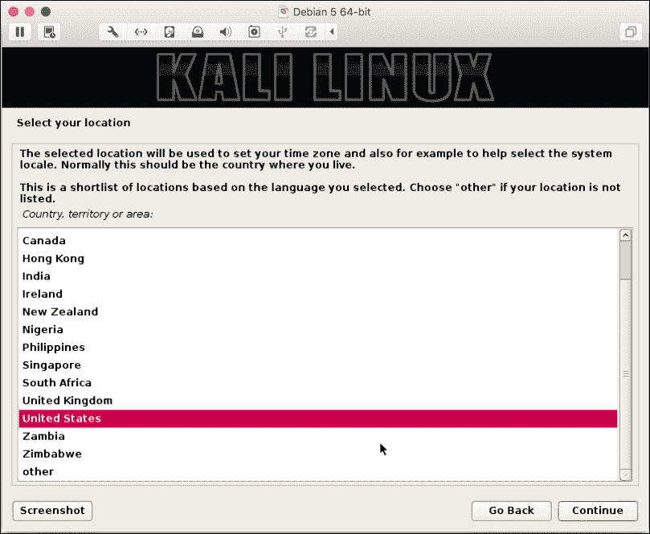

1.  选择您的键盘配置（我们选择了**美式英语**）：

1.  接下来，我们需要配置基本的网络服务。输入您喜欢的主机名（我们将其命名为`Intrusion-Exploitation`）：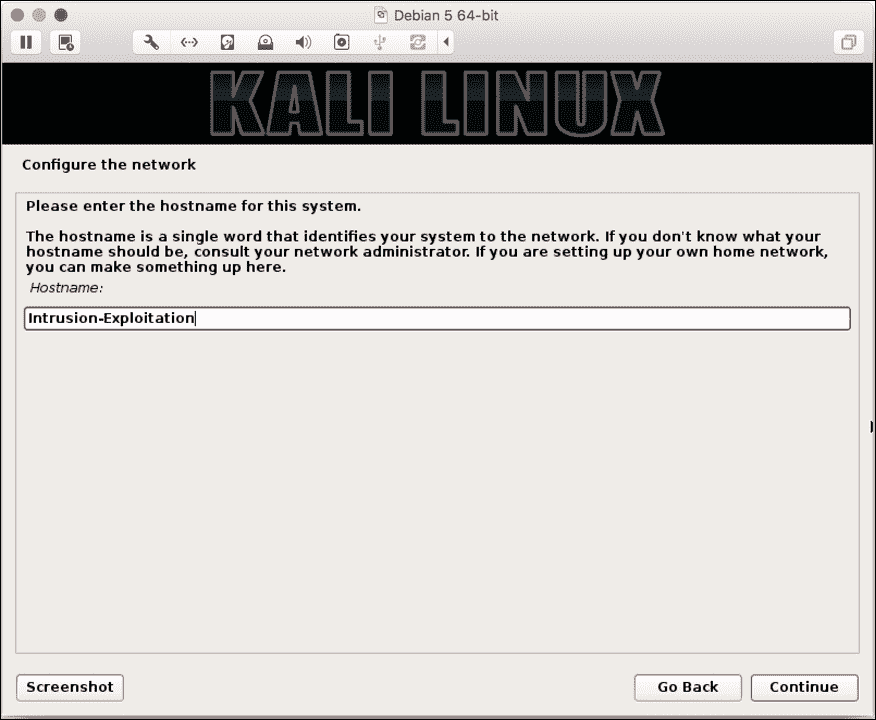

1.  接下来，输入您选择的域名（我们输入了`kali.example.com`）：

1.  最重要的一步是输入您的 root 密码，并确保您有一个强密码，并且不要忘记它（使用 A-Z、a-z、0-9 和特殊字符的组合）：

1.  在下一个屏幕上，选择您的时区（我们选择了**东部**）：

1.  接下来，您将看到四个选项可供选择；如果您有首选的磁盘分区方式，可以选择**手动**。但是，为了简化分区，我们将使用**引导-使用整个磁盘**：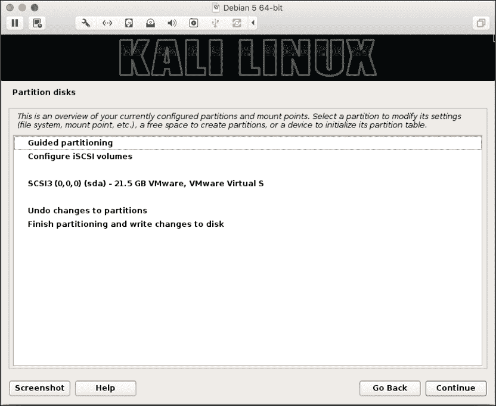

1.  在屏幕上，您将收到提示，整个磁盘空间将被格式化，单击**继续**：

1.  接下来，您将看到三个选项。由于我们只打算将其用于渗透测试，而不是作为服务器或主要桌面操作系统，所以选择**一个分区中的所有文件**是安全的：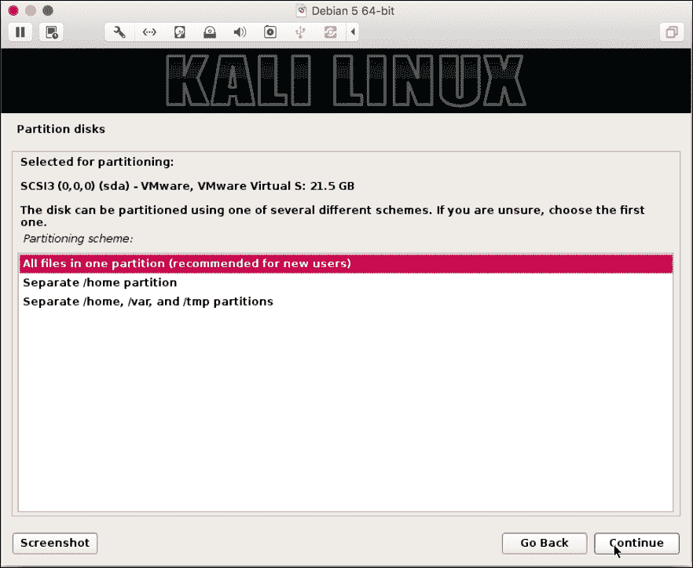

1.  您将看到对磁盘进行的更改摘要。选择**完成分区并将更改写入磁盘**，然后单击**继续**：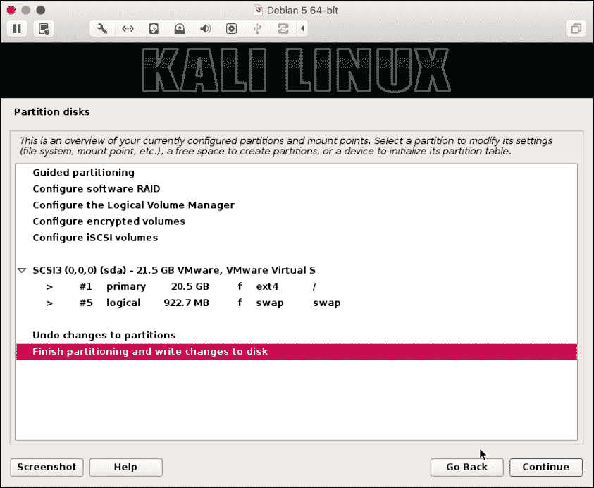

1.  选择**是**，然后单击**继续**：

1.  接下来，您将被要求使用网络镜像配置您的软件包管理器。它允许您在 Kali 工具集可用时更新您的 Kali 工具集，而在我们的情况下，我们选择了**是**：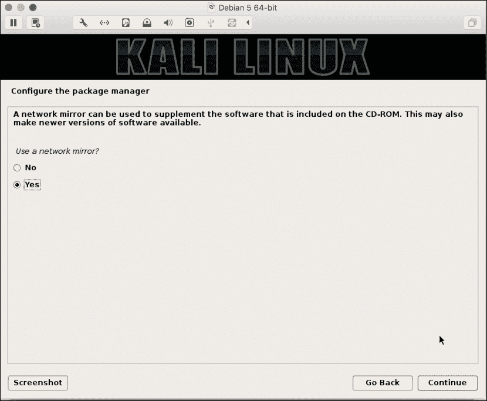

1.  接下来，您可以输入您的网络中是否有代理服务器。如果没有，您可以简单地跳过并单击**继续**：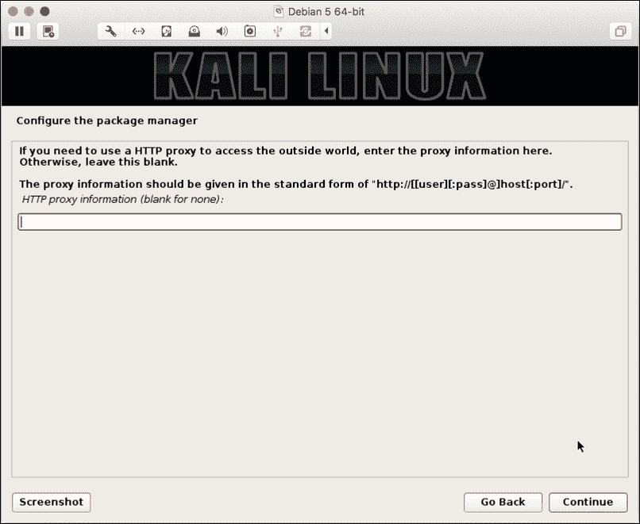

1.  最后，您将被要求将 GRUB 引导加载程序安装到/Dev/SDA-主引导记录；选择**是**，然后单击**继续**：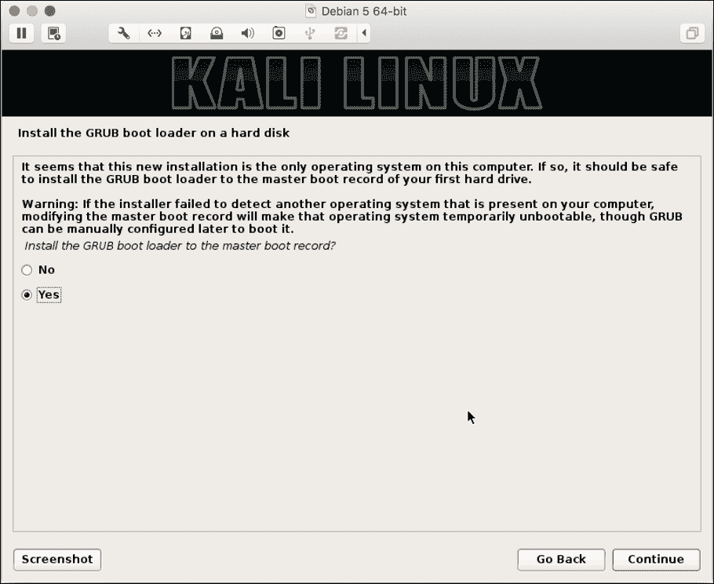

1.  最后，您将被要求手动输入设备或`/dev/sda`; 选择`/dev/sda`并单击**继续**：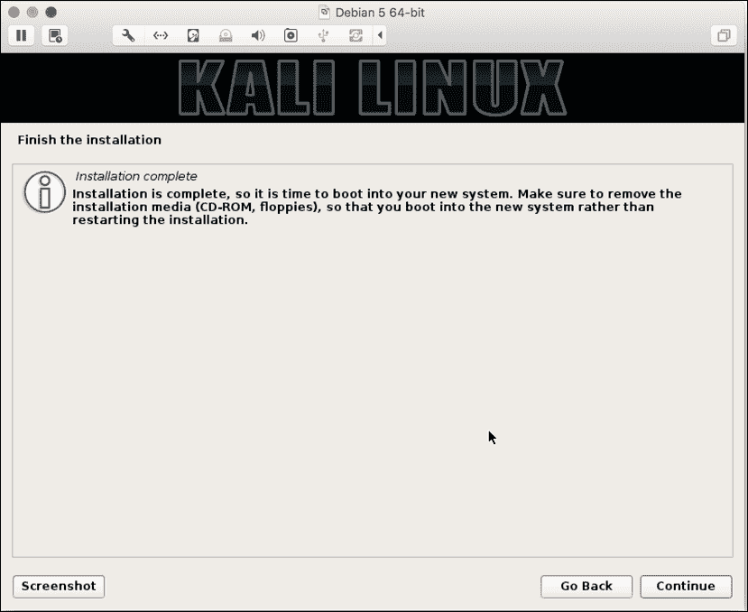

1.  如果您看到前面的屏幕，这意味着您已经完成了 Kali 的安装。恭喜！单击**继续**，您的系统将重新启动，带您进入全新安装的 Kali Linux。

## 它是如何工作的...

在这个步骤中，我们插入了 Kali Linux ISO 并启动了图形安装。在图形安装过程中，我们开始配置我们喜欢的语言、键盘语言、国家和时区。从第 5 步开始，我们输入了我们的 Kali Linux 主机名，在第 6 步，我们输入了我们的 Kali Linux 域名。

从第 9 步到第 13 步，我们配置了硬盘分区，将整个磁盘用于安装，并为所有文件夹创建了一个分区，因为我们只打算用它进行渗透测试。安装完成后，从第 14 步开始，我们配置了 Kali 以使用网络镜像进行更快的更新，配置了任何网络代理（如果需要），最后安装了 GRUB 引导加载程序。

# 为了更快地更新软件包，定制 Kali Linux

Kali 包含了 300 多个安全工具和系统二进制文件。安装 Kali Linux 后，您需要做的第一件事就是更新 Kali Linux，以获取最新的安全工具和功能集。由于 Kali 基于 Debian Linux，您可以使用`apt-get update`命令来更新二进制文件和工具的存储库。

然而，有时在更新 Kali Linux 时，您会注意到无论您的互联网速度和带宽如何，更新都可能会很慢。在这个步骤中，我们将向您展示如何更新您的源文件，以便您的软件包管理器可以更快地更新软件包：

## 准备工作

对于这个食谱，您需要连接到具有有效 IP 地址的互联网。

## 如何操作...

执行以下步骤来制作这个食谱：

1.  打开终端并使用编辑器打开`sources.list`文件：

```
     vim /etc/apt/sources.list

    ```

1.  默认的`sources.list`文件如下所示：

```
     #deb cdrom:[Debian GNU/Linux 7.0 _Kali_ - Official Snapshot i386       LIVE/INSTALL Binary 20140721-23:20]/ kali contrib main non-free
     deb http://http.kali.org/kali kali main non-free contrib
     deb-src http://http.kali.org/kali kali main non-free contrib
     ## Security updates
     deb http://security.kali.org/kali-security kali/updates main       contrib non-free

    ```

您只需要按照以下代码所示将`http`更改为`repo`：

```
          #deb cdrom:[Debian GNU/Linux 7.0 _Kali_ - Official Snapshot i386       LIVE/INSTALL Binary 20140721-23:20]/ kali contrib main non-free
          deb http://repo.kali.org/kali kali main non-free contrib
          deb-src http://repo.kali.org/kali kali main non-free contrib
          ## Security updates
          deb http://security.kali.org/kali-security kali/updates main       contrib non-free

    ```

1.  进行以下更改，保存文件，并通过按*Esc*键然后输入`wq!`并按*Enter*退出编辑器。

1.  现在，使用以下命令更新和升级您的 Kali；您将注意到速度上的差异：

```
          apt-get update && apt-get upgrade

    ```

## 它是如何工作的...

Kali Linux 在世界各地有多个不同的镜像。根据您的 IP 地址位置，它会自动选择距离您最近的镜像。由于各种原因，这些镜像可能会随着时间的推移变得缓慢。您可以在[`http.kali.org/README.mirrorlist`](http://http.kali.org/README.mirrorlist)找到距离您最近的镜像列表。`apt-get`命令从`/etc/apt/sources.list`获取更新服务器列表。对`sources.list`文件的更改确保我们的 Kali 连接到正确的服务器并获得更快的更新。

# 定制 Kali Linux 以获得更快的操作

在审核和渗透测试期间，您将使用 Kali Linux。您需要配置和定制您的 Kali Linux，以便在这些关键测试过程中获得最高速度。在这个食谱中，我们将向您展示几种工具，可以用来优化您的 Kali Linux 体验。

## 准备工作

对于这个食谱，您需要连接到互联网。

## 如何操作...

执行以下步骤来制作这个食谱：

1.  Preload 是由 Behdad Esfahbod 编写的一个作为守护进程运行的程序。该应用程序密切观察经常使用的应用程序和二进制文件的使用情况，并在系统空闲时加载到内存中。这样可以加快启动时间，因为从磁盘获取的数据更少。您可以在[`wiki.archlinux.org/index.php/Preload`](https://wiki.archlinux.org/index.php/Preload)了解更多关于这个应用程序的信息。要安装该应用程序，请在终端窗口上发出以下命令：

```
          apt-get install preload

    ```

BleachBit 快速释放磁盘空间，并不知疲倦地保护您的隐私。释放缓存，删除 cookie，清除互联网历史记录，销毁临时文件，删除日志，并丢弃您不知道存在的垃圾。您可以在[`bleachbit.sourceforge.net/`](http://bleachbit.sourceforge.net/)了解更多关于这个应用程序的信息。

1.  要安装该应用程序，请在终端窗口上发出以下命令：

```
          apt-get install bleachbit

    ```

1.  默认情况下，Kali 不显示启动菜单中的所有应用程序和脚本。您安装的每个应用程序最终都会通过启动，即使不需要也会减慢启动过程。您可以安装 Boot-Up 管理器，并密切关注在启动过程中允许哪些服务和应用程序。您可以随时禁用不必要的服务和应用程序，以增加 Kali 的启动速度。

要安装该应用程序，请在终端窗口上发出以下命令：

```
      apt-get install bum

```

## 它是如何工作的...

在这个食谱中，我们使用了`apt-get`命令来安装基本系统实用程序，这些实用程序可以帮助我们在渗透测试期间有效地管理我们的 Kali Linux 资源，使我们的 Kali Linux 进程和启动文件夹优化以获得最佳性能。

# 配置远程连接服务-HTTP、TFTP 和 SSH

在渗透测试和审核期间，我们将需要从我们的 Kali Linux 向目标机器交付有效载荷。为此，我们将利用基本的网络服务，如 HTTP、FTP 和 SSH。HTTP 和 SSH 等服务默认安装在 Kali Linux 中，但 Kali 不启用任何网络服务以最小化检测。

在这个食谱中，我们将向您展示如何配置和开始安全运行服务：

## 准备工作

对于这个食谱，您需要连接到具有有效 IP 地址的互联网。

## 如何操作...

执行本教程的以下步骤：

1.  让我们开始启动 Apache web 服务器。要启动 Apache 服务，请使用以下命令：

```
          service apache2 start

    ```

您可以通过浏览器浏览本地主机来验证服务是否正在运行，如下面的屏幕截图所示：


1.  要启动 SSH 服务，需要生成 SSH 密钥。在 Backtrack r5 中，您曾经使用`sshd-generate`命令生成 SSH 密钥，但在 Kali Linux 中不可用。使用默认的 SSH 密钥存在安全风险，因此应生成新的 SSH 密钥。要生成 SSH 密钥，您可以删除或备份 Kali Linux 生成的默认密钥：

```
          # cd /etc/ssh
          # mkdir default_kali_keys
          # mv ssh_host_* default_kali_keys/
          # cd /root/

    ```

1.  首先，我们需要通过以下命令删除 SSH 的运行级别：

```
          # update-rc.d -f ssh remove

    ```

1.  现在，我们需要通过以下命令加载默认的 SSH 运行级别：

```
          # update-rc.d -f ssh defaults

    ```

1.  重新生成密钥：

```
    # dpkg-reconfigure openssh-server 
          Creating SSH2 RSA key; this may take some time ...
          Creating SSH2 DSA key; this may take some time ...
          Creating SSH2 ECDSA key; this may take some time ...
          insserv: warning: current start runlevel(s) (empty) of script       `ssh' overrides LSB defaults (2 3 4 5).
          insserv: warning: current stop runlevel(s) (2 3 4 5) of script       `ssh' overrides LSB defaults (empty).

    ```

1.  您可以检查 SSH 密钥散列是否已更改：

1.  使用以下命令启动 SSH 服务：

```
          service ssh start

    ```

1.  您可以使用`netstat`命令验证服务是否正在运行：

```
          netstat - antp | grep ssh

    ```

1.  使用以下命令启动 FTP 服务器：

```
          service pure-ftpd start

    ```

1.  要验证服务是否正在运行，请使用以下命令：

```
          netstat -ant | grep ftp

    ```

1.  要停止任何服务，可以使用以下命令：

```
          service <servicename> stop

    ```

这里，`<servicename>`是要终止的服务的名称：

```
          service ssh stop

    ```

## 工作原理...

在本教程中，我们已配置并启动了基本网络服务，这些服务将根据情况用于向受害机交付有效载荷。我们已启动了 HTTP 服务、FTP 服务，并备份了默认的 SSH 密钥并生成了新的 SSH 密钥，并启动了 SSH 服务。

# 配置 Nessus 和 Metasploit

在本教程中，我们将向您展示如何安装、配置和启动 Nessus 和 Metasploit。

## 准备工作

对于本教程，我们将下载 Nessus 家庭版并注册有效许可证。

## 操作步骤...

执行本教程的以下步骤：

1.  打开 Firefox 并转到[`www.tenable.com/products/nessus/select-your-operating-system`](http://www.tenable.com/products/nessus/select-your-operating-system)，然后选择家庭版。在下一页上，选择操作系统为**Debian 6 and 7**（因为 Kali 基于 Debian Jessie），如下面的屏幕截图所示：

1.  要安装 Nessus，请在终端中打开以下命令并输入：

```
          dpkg -i Nessus-6.2.0-debian6_amd64.deb

    ```

1.  现在，您的 Nessus 已安装，如下面的屏幕截图所示：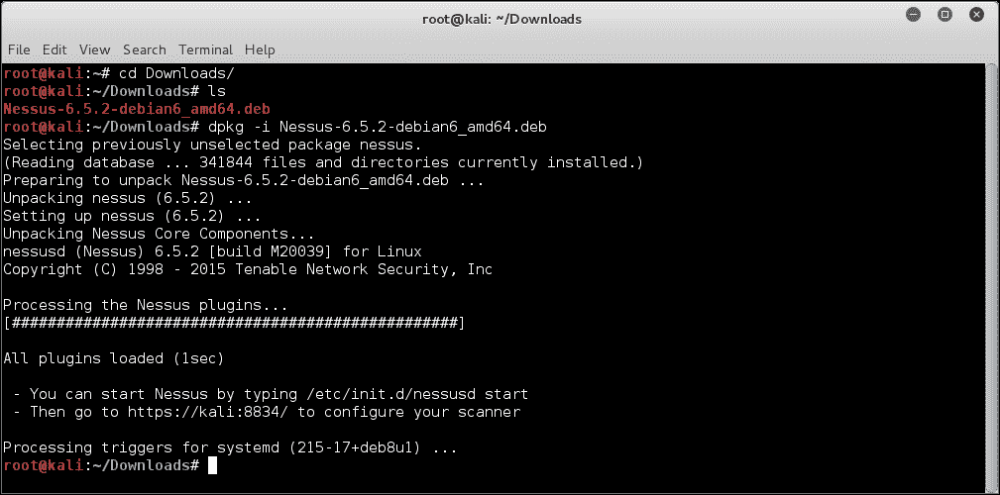

1.  安装完成后，使用以下命令启动 Nessus 服务：

```
          /etc/init.d/nessusd start

    ```

1.  打开链接`https://kali:8834`，如下面的屏幕截图所示：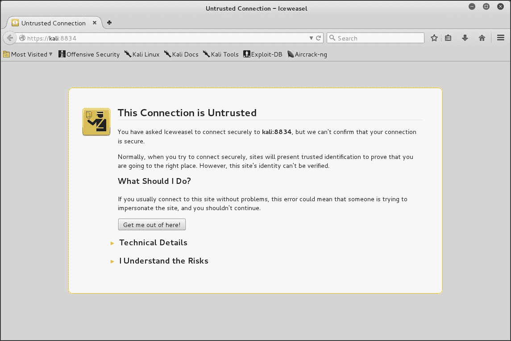

1.  默认情况下，在安装期间，Nessus 配置为使用自签名证书来加密浏览器和 Nessus 服务器之间的流量；因此，您看到了前面屏幕截图中显示的页面。如果您从可信任的网站下载了 Nessus，可以安全地单击**我了解风险并接受证书**继续，然后您将看到以下页面：

1.  单击**继续**，将显示初始帐户设置页面，如下面的屏幕截图所示：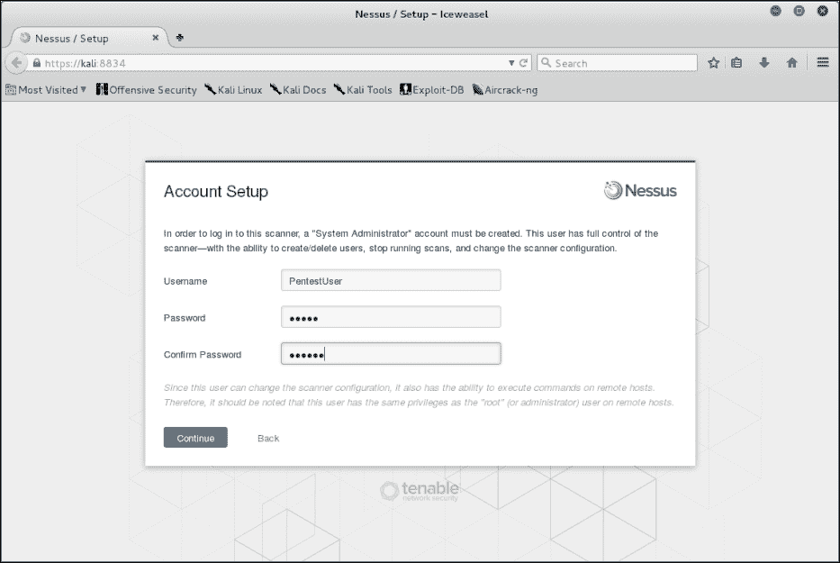

1.  输入要创建的用户名和密码组合，然后单击**继续**。在下一页上，您将需要输入激活代码，如下面的屏幕截图所示：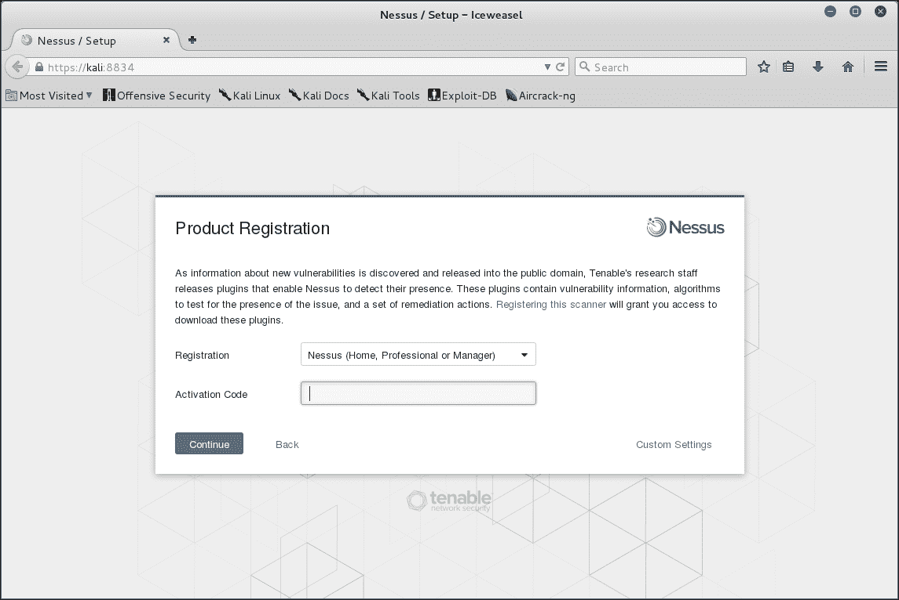

1.  要获取激活码，请转到[`www.tenable.com/products/nessus-home`](http://www.tenable.com/products/nessus-home)，并在页面右侧填写表格以接收激活码。您将在电子邮件帐户中收到激活码。复制激活码并输入到此屏幕上并继续：

现在，激活已经完成，Nessus 将更新插件，工具将准备好供您使用。

1.  现在我们已经安装了 Nessus。所以，让我们设置 Metasploit。Metasploit 在操作系统安装期间默认安装。要调用，您需要启动以下服务：

```
          # service postgresql start
          [ ok ] Starting PostgreSQL 9.1 database server: main.
          root@Intrusion-Exploitation:~#
          root@Intrusion-Exploitation:~# msfconsole
          [ ok ] Starting Metasploit rpc server: prosvc.
          [ ok ] Starting Metasploit web server: thin.
          [ ok ] Starting Metasploit worker: worker.

    ```

1.  Metasploit 将如下所示启动：

## 工作原理...

在这个食谱中，我们已经下载了 Nessus 家庭订阅并启动了服务。我们完成了基本的初始帐户设置，并输入了帐户激活密钥以激活我们的 Nessus 家庭订阅版本，并最终更新了插件。

后来，我们打开了 PostgreSQL 和 Metasploit 服务，最后，使用`msfconsole`我们启动了一个 Metasploit 实例。

## 还有更多...

Nessus 是一个漏洞扫描器，Metasploit 是来自 Rapid7 的利用框架。然而，大多数网络环境只需要漏洞评估，而不需要深入的利用。但是，在某些情况下，如果需要，Metasploit 是最好的框架之一。与 Nessus 类似，Rapid7 还推出了他们自己的漏洞扫描器**Nexpose**。Nexpose 可以配置为与 Metasploit 集成，这允许 Metasploit 使用 NexPose 进行漏洞扫描，并根据 Nexpose 收集的信息选择利用，因此与使用 Nessus 与 Metasploit 相比，它提供了更好的体验。有关更多信息，请访问[`www.rapid7.in/products/nexpose/`](http://www.rapid7.in/products/nexpose/)。

# 配置第三方工具

在这个食谱中，我们将安装一些基本的第三方工具，这些工具作为 Backtrack 5 的一部分，或者可以作为渗透测试工具箱的良好补充。

## 准备工作

对于这个食谱，您需要连接到互联网。

## 如何操作...

执行此食谱的以下步骤：

1.  Lazy Kali 是一个 Bash 脚本，旨在自动化 Kali 更新并安装所有其他您可能需要使 Kali 成为默认操作系统的第三方工具。您可以在[`code.google.com/p/lazykali/`](https://code.google.com/p/lazykali/)了解更多关于此脚本的信息。

要下载并安装此脚本，请在终端窗口上发出以下命令：

```
          Wget https://www.lazykaligooglecode.com/files/lazykali.sh
          Give it executable permission and execute:
          chmod +x lazykali.sh
          sh lazykali

    ```

1.  当你运行`lazykali.sh`脚本时，它会显示脚本是否已经安装，如果没有，你可以按照下面的截图进行安装：

1.  自更新脚本后，继续，您将看到以下屏幕：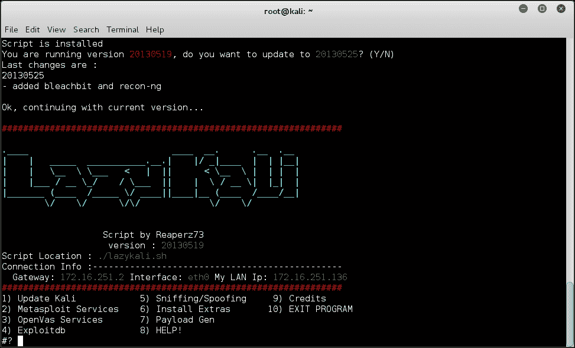

1.  接下来，输入`6`来安装额外的工具：

1.  然后，选择“选择全部”。然后它将安装所有在后续食谱中所需的工具。

## 工作原理...

在这个食谱中，我们已经下载了`lazykali.sh`脚本，我们将用它来下载进一步的第三方工具，这些工具将在我们的后续食谱中使用。

# 在 Kali Linux 上安装 Docker

在这个食谱中，我们将在 Kali Linux 上安装和设置 Docker。

## 准备工作

要完成此食谱的步骤，您需要在 Oracle Virtualbox 或 VMware 中运行 Kali Linux，并连接到互联网。不需要其他先决条件。

## 如何操作...

对于这个食谱，您需要执行以下步骤：

1.  在撰写本书时，Kali Linux 2.0 Rolling 基于 Debian Wheezy，因此这些步骤只适用于基于 Debian Wheezy 的 Kali Linux。将来，如果 Kali 有更新，那么请检查 Docker 文档中的最新安装步骤。

1.  在终端窗口中打开`/etc/apt/sources.list.d/backports.list`文件，并在您喜欢的编辑器中打开。如果文件不存在，请创建它。

1.  删除任何现有条目，并在 Debian wheezy 上添加一个 backports 条目：

```
          deb http://http.debian.net/debian wheezy-backports main

    ```

1.  更新软件包信息，并确保 APT 使用 HTTPS 方法工作，并安装 CA 证书：

```
     $ apt-get update
     $ apt-get install apt-transport-https ca-certificates

    ```

1.  添加 GPG 密钥：

```
          $ apt-key adv --keyserver hkp://p80.pool.sks-keyservers.net:80        --recv-keys 58118E89F3A912897C070ADBF76221572C52609D

    ```

1.  在您喜欢的编辑器中打开`/etc/apt/sources.list.d/docker.list`。如果文件不存在，请创建它。

1.  删除任何现有条目，并在 Debian wheezy 上添加后备条目：

```
          $ deb https://apt.dockerproject.org/repo debian-wheezy main

    ```

1.  更新软件包信息并验证 APT 是否从正确的存储库中拉取：

```
          $ apt-get update && apt-cache policy docker-engine

    ```

1.  安装 Docker：

```
          $ apt-get install docker-engine

    ```

1.  启动 Docker 守护程序：

```
          $ service docker start

    ```

1.  验证 Docker 是否安装正确：

```
          $ docker run hello-world

    ```

由于您已经以`root`用户登录到 Kali Linux 安装中，因此无需使用`sudo`。但重要的是要注意，`docker`守护程序始终以`root`用户身份运行，并且`docker`守护程序绑定到 Unix 套接字而不是 TCP 端口。默认情况下，该 Unix 套接字归`root`用户所有，因此，如果您未以 root 用户身份登录，则需要使用前面的命令与`sudo`一起使用。

## 工作原理...

在这个教程中，我们添加了`docker`源列表，这样每次在系统上使用`apt-get update`命令时，我们就可以获取 Docker 的更新。然后，更新`apt-get`源并安装安装 Docker 所需的先决条件。我们添加了`GPG`密钥，以确保我们安装的任何更新都是有效的官方未更改的软件包。在完成所有这些基本配置之后，我们运行了基本的`apt-cache`来确保 APT 正在从正确的存储库中获取 docker-engine。最后，我们使用`apt-get`安装了`docker-engine`。
